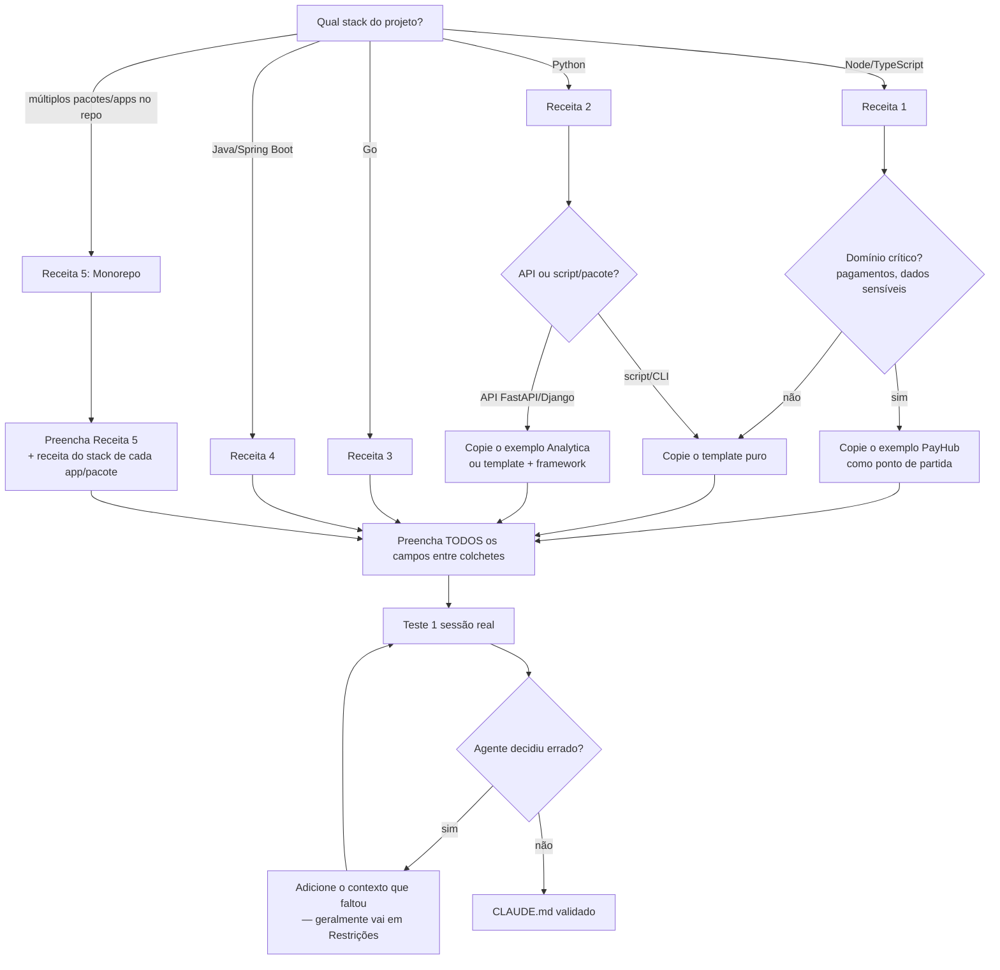

# CLAUDE.md — receitas para Node, Python, Go, Java, monorepos

> [!abstract] TL;DR
> Templates prontos de CLAUDE.md para os stacks mais comuns, com exemplos preenchidos (não apenas placeholders). Copie, adapte, teste uma sessão, e corrija o que o agente interpretar errado. Um CLAUDE.md com 80% de preenchimento é infinitamente melhor que nenhum.
> A escolha certa não é "qual template" e sim "qual seção vai mudar a decisão do agente na próxima sessão real" — normalmente Stack (versões) e Restrições (o que NÃO fazer), não Arquitetura (o agente já lê o código-fonte).
> Receita ruim não é a que falta seção — é a que mantém placeholders genéricos tipo "[Adicionar restrições específicas do projeto]"; isso equivale a não ter CLAUDE.md nenhum, só que com uma falsa sensação de cobertura.

---

## A lógica das receitas

Receitas não substituem o julgamento — são pontos de partida que cobrem os erros mais comuns. O agente não conhece seu projeto, não sabe qual lib de logger você escolheu, não sabe que nunca deve fazer push direto. As receitas cobrem o que é quase sempre verdade para cada stack; você adiciona o que é específico do seu contexto.

Cada receita vem em dois formatos:
- **Template** — campos `[...]` para preenchimento
- **Exemplo preenchido** — como fica com valores reais (para você ver antes de copiar)



---

## Receita 1: Node.js / TypeScript

### Template

```markdown
## Projeto

[Nome]: [descrição em 1-2 frases. Contexto de negócio.]
[Tipo: API REST / GraphQL / CLI / fullstack Next.js]
[Escala relevante: usuários, transações/dia, SLA]

## Arquitetura

- `src/` — código-fonte TypeScript
- `src/[routes|api|controllers]/` — entry points HTTP
- `src/services/` — lógica de negócio
- `src/[db|repositories]/` — acesso a dados
- `src/utils/` — utilitários compartilhados
- `tests/` — [jest / vitest], espelhando estrutura de src/

Fluxo: [ex: rota → service → repository. Services não importam outros services.]

## Stack

- Node [versão], TypeScript [versão]
- [Framework: Express / Fastify / NestJS / Next.js]
- [ORM/DB: Prisma / TypeORM / node-postgres / Drizzle]
- [Testes: Jest / Vitest + supertest]
- Logger: [winston / pino] em `src/utils/logger.ts` — use logger.*, NUNCA console.*
- [Validação: zod / class-validator]

## Convenções

- Erros: [AppError / HttpException] em `src/errors/` (nunca `throw new Error()` raw)
- Nomes de arquivos: kebab-case (`order-service.ts`)
- Imports absolutos via `@/` mapeado para `src/`
- Testes: [um arquivo por módulo / co-located]

## Comandos

- `npm test` — toda a suite
- `npm test -- --testPathPattern=[padrão]` — filtrar testes
- `npm run lint` — ESLint
- `npm run type-check` — TypeScript sem emit
- `npm run dev` — desenvolvimento local

## Restrições

- Não use `any` — prefira `unknown` com type guard
- Não instale dependências sem perguntar
- [Adicionar restrições específicas do projeto]
```

### Exemplo preenchido — API de pagamentos

```markdown
## Projeto

PayHub: API REST de pagamentos para marketplace B2C (~2M transações/mês).
Domínio crítico — erros de cobrança têm impacto financeiro e regulatório (PCI-DSS).

## Arquitetura

- `src/routes/` — rotas Express (um arquivo por domínio: payments.ts, users.ts)
- `src/services/` — lógica de negócio (injetada via construtor)
- `src/db/queries/` — todas as queries SQL (sem ORM, sem inline)
- `src/middleware/` — auth JWT, rate limiting, auditoria PCI
- `tests/` — jest + supertest; espelha src/ 1:1

Fluxo: rota → service → query. Services não importam outros services diretamente.

## Stack

- Node 20, TypeScript 5, Express 4
- PostgreSQL 15 com node-postgres (sem ORM)
- Redis 7 para sessão e idempotência (ioredis em `src/db/redis.ts`)
- Jest + supertest para integração
- Logger: pino em `src/utils/logger.ts` — NUNCA console.* (correlação de traces quebra)
- Validação: zod em `src/validators/[domínio].ts`

## Convenções

- Erros de negócio: `PaymentError` de `src/errors/PaymentError.ts`
- Erros genéricos: `AppError` de `src/errors/AppError.ts`
- Toda mutação de saldo: use `src/payments/ledger.ts` (auditoria automática)
- SQL: placeholders parametrizados obrigatórios (nunca interpolação)
- Commits: conventional commits em português

## Comandos

- `npm test` — toda a suite (requer Postgres + Redis locais)
- `npm test -- --testPathPattern=payments` — testes de pagamento
- `npm run lint` — ESLint (falha = CI falha)
- `npm run db:migrate` — rodar migrations pendentes
- `docker-compose up -d` — iniciar infraestrutura local

## Restrições

- NUNCA logue dados de cartão ou CVV (PCI-DSS — penalidade real)
- Não faça rollback de transação Stripe sem consultar `docs/rollback-policy.md`
- Não altere `src/db/migrations/` — use `npm run db:migrate:create`
- Não faça git push direto — sempre via PR com code review
```

---

## Receita 2: Python

### Template

```markdown
## Projeto

[Nome]: [descrição em 1-2 frases.]
[Tipo: API FastAPI / Django / script / CLI / pacote]

## Arquitetura

- `[app|src]/` — código-fonte principal
- `[app|src]/[routers|views]/` — entry points
- `[app|src]/services/` — lógica de negócio
- `[app|src]/models/` — modelos [SQLAlchemy / Pydantic / dataclasses]
- `tests/` — pytest, espelhando estrutura do app

## Stack

- Python [versão]
- [Framework: FastAPI / Django / Flask]
- [ORM/DB: SQLAlchemy / Django ORM / psycopg2]
- [Testes: pytest + httpx / pytest-django]
- [Gerenciador: pip+requirements.txt / poetry / uv]
- [Linter: ruff / black + isort]

## Convenções

- Type hints obrigatórios em todas as funções públicas
- Schemas de validação: [Pydantic] em `[app]/schemas/`
- [Estilo de imports: absolutos / relativos]
- [Convenções específicas]

## Comandos

- `pytest` — toda a suite
- `pytest tests/[módulo]/ -v` — módulo específico
- `ruff check .` — lint
- `ruff format .` — formatação
- `[uvicorn app.main:app --reload]` — dev

## Restrições

- Não use `type: ignore` sem comentário explicativo
- Não modifique migrations manualmente — use `alembic revision`
- [Restrições específicas]
```

### Exemplo preenchido — API FastAPI

```markdown
## Projeto

Analytica: API de analytics para dashboards internos.
FastAPI + PostgreSQL. Uso interno (time de data, ~20 usuários). Sem SLA crítico.

## Arquitetura

- `app/routers/` — endpoints FastAPI (um arquivo por domínio)
- `app/services/` — lógica de consulta e agregação
- `app/models/` — modelos SQLAlchemy
- `app/schemas/` — schemas Pydantic (request/response)
- `tests/` — pytest + httpx, espelha app/

## Stack

- Python 3.12, FastAPI 0.115
- PostgreSQL 16, SQLAlchemy 2.0 (async), asyncpg
- Alembic para migrations
- pytest + httpx para integração; factory_boy para fixtures
- ruff para lint e formatação

## Convenções

- Type hints obrigatórios (ruff enforça)
- Schemas Pydantic em `app/schemas/` — não use dicts para request/response
- Serviços recebem a session do banco como parâmetro (não criam dentro)
- Nomear endpoints: `POST /[recurso]` (plural), `GET /[recurso]/{id}`

## Comandos

- `pytest` — toda a suite (requer Postgres de teste)
- `alembic upgrade head` — aplicar migrations
- `alembic revision --autogenerate -m "descrição"` — nova migration
- `uvicorn app.main:app --reload` — dev local

## Restrições

- Não faça queries raw na camada de router — use services
- Não use `select *` em queries SQL explícitas
- Não commite dados de usuário em fixtures (use faker)
```

---

## Receita 3: Go

### Template

```markdown
## Projeto

[Nome]: [descrição em 1-2 frases.]
[Tipo: API HTTP / CLI / serviço gRPC / biblioteca]

## Arquitetura

- `cmd/[nome]/` — entry point (main.go)
- `internal/` — código privado do projeto
- `internal/[handlers|transport]/` — HTTP handlers
- `internal/service/` — lógica de negócio (interfaces + implementações)
- `internal/repository/` — acesso a dados
- `pkg/` — código exportável
- `[nome]_test.go` — testes ao lado do código

## Stack

- Go [versão]
- [Framework HTTP: net/http stdlib / chi / gin / echo]
- [DB: database/sql + pgx / GORM / sqlc]
- [Testes: stdlib testing + testify]
- [Logger: slog stdlib / zerolog / zap]

## Convenções

- Interfaces definidas onde são usadas (não onde são implementadas)
- Erros: retorno explícito, sem panic fora de init e main
- Exportados: PascalCase. Internos: camelCase

## Comandos

- `go test ./...` — toda a suite
- `go vet ./...` — análise estática
- `golangci-lint run` — lint
- `go build ./cmd/[nome]/` — compilar

## Restrições

- Não use `interface{}` / `any` sem necessidade forte
- Não ignore erros — use `_` explicitamente quando intencional
- [Restrições específicas]
```

---

## Receita 4: Java / Spring Boot

```markdown
## Projeto

[Nome]: [descrição em 1-2 frases.]
[Tipo: REST API / microserviço / batch / monólito]
[Spring Boot versão, Java versão]

## Arquitetura

- `src/main/java/[pacote]/` — código-fonte
- `[pacote]/controller/` — REST controllers (@RestController)
- `[pacote]/service/` — lógica de negócio (@Service)
- `[pacote]/repository/` — acesso a dados (Spring Data JPA / JDBC)
- `[pacote]/domain/` — entidades e value objects
- `src/test/java/` — testes (JUnit 5 + Mockito / Testcontainers)

## Stack

- Java [versão (ex: 21 LTS)], Spring Boot [versão]
- [DB: PostgreSQL / MySQL / H2 (só test)]
- [ORM: Spring Data JPA + Hibernate / JDBC Template]
- [Testes: JUnit 5, Mockito, Testcontainers, AssertJ]
- [Logger: SLF4J + Logback] — use `log.info/warn/error`, nunca `System.out`
- [Build: Maven / Gradle]

## Convenções

- Exceções de negócio: [BusinessException] (nunca RuntimeException raw)
- Validação: Bean Validation (@Valid, @NotNull, @Size) em DTOs
- DTOs em [pacote]/dto/ — nunca expor entidades JPA diretamente
- Testes de integração: @SpringBootTest + Testcontainers para banco real
- Commits: conventional commits em português

## Comandos

- `./mvnw test` — toda a suite
- `./mvnw test -Dtest=[Classe]Test` — classe específica
- `./mvnw spring-boot:run` — rodar localmente
- `./mvnw clean package -DskipTests` — buildar JAR

## Restrições

- Não use `@Autowired` em fields — prefira injeção por construtor
- Não faça lazy loading fora de transação (LazyInitializationException)
- Não altere migrations Flyway existentes — crie novas
- Não exponha entidades JPA como response body — use DTOs
```

---

## Receita 5: Monorepo

```markdown
## Projeto

[Nome]: monorepo com [N] pacotes/apps.
[Contexto: domínio, consumidores, relações entre apps]

## Estrutura

- `apps/` — aplicações deployáveis
  - `apps/api/` — [descrição]
  - `apps/web/` — [descrição]
- `packages/` — bibliotecas compartilhadas
  - `packages/shared/` — tipos e utilitários comuns
  - `packages/ui/` — componentes compartilhados

## Tooling

- [Turborepo / Nx / pnpm workspaces]
- Todos os comandos usam o runner do monorepo (não `cd app && npm test`)

## Comandos

- `turbo run test` — testes em todos os pacotes
- `turbo run test --filter=[app]` — pacote específico
- `turbo run build` — build de todos

## Restrições

- Não importe de `apps/` para `packages/` — fluxo é unidirecional
- Mudanças em `packages/shared` podem quebrar múltiplos consumers — rodar `turbo run test` antes de commitar
- [Restrições específicas]
```

---

## Como adaptar as receitas

1. Copie o template para `.claude/CLAUDE.md`
2. Substitua todos os `[campos]` — não deixe nenhum placeholder
3. Remova seções que não se aplicam ao projeto
4. Adicione seções específicas que o template não cobre
5. Teste uma sessão com uma tarefa real
6. Se o agente tomar uma decisão errada, adicione o contexto que faltou

---

## Checklist de adaptação

- [ ] Nenhum campo `[...]` permanece no arquivo
- [ ] A seção "Restrições" foi preenchida com pelo menos 3 itens reais
- [ ] A seção "Stack" inclui versões específicas
- [ ] A seção "Comandos" foi testada — todos os comandos funcionam
- [ ] O fluxo de dados foi documentado (rota → service → repo, ou equivalente)
- [ ] O que NÃO usar foi explicitado (não só o que usar)

---

## Casos práticos

Templates são o ponto de partida; o que separa um CLAUDE.md útil de um decorativo é o que acontece
depois que o agente erra pela primeira vez. Dois casos reais dos exemplos preenchidos acima.

### Caso 1 — PayHub: a restrição que faltava custou uma sessão inteira

O exemplo preenchido da Receita 1 já tem "NUNCA logue dados de cartão ou CVV" na seção Restrições.
Isso não nasceu no template — nasceu depois de um incidente: numa sessão anterior, o agente recebeu
a tarefa "adicionar log de debug no fluxo de checkout para investigar um bug de duplicidade de
cobrança" e, sem essa restrição explícita, logou o payload inteiro da requisição — incluindo os
últimos 4 dígitos do cartão e o token de autorização — porque isso era, tecnicamente, "debug útil".
Nenhuma regra genérica de bom senso ("não exponha dados sensíveis") barra isso: o agente não sabe
que aquele campo específico é PCI-DSS até alguém dizer. A correção não foi reescrever o CLAUDE.md
inteiro — foi adicionar uma linha em Restrições e testar de novo a mesma tarefa:

```markdown
## Restrições

# Antes — genérico demais, não impediu o incidente
- Trate dados sensíveis com cuidado
- Siga boas práticas de segurança

# Depois — específico, factual, testável
- NUNCA logue dados de cartão ou CVV (PCI-DSS — penalidade real)
- Ao adicionar logs de debug em `src/routes/payments.ts`, liste explicitamente os
  campos permitidos (ex: `orderId`, `status`) — nunca logue o objeto de requisição inteiro
```

A versão "antes" existia no CLAUDE.md do PayHub havia semanas e não preveniu nada — ela é
indistinguível de não ter restrição nenhuma, porque não diz *qual* dado é sensível nem *onde* o
erro tende a acontecer (debug ad-hoc, não o fluxo principal já revisado).

### Caso 2 — Analytica: por que "Sem SLA crítico" na primeira linha muda o comportamento

O exemplo da Receita 2 declara logo na seção Projeto: "Uso interno (time de data, ~20 usuários).
Sem SLA crítico." Isso parece cosmético, mas resolve um problema recorrente em times de dados: sem
esse contexto, o agente tende a tratar toda API como se fosse produção de alto tráfego — sugerindo
cache agressivo, connection pooling elaborado, rate limiting, retry com backoff exponencial — para
um serviço que 20 pessoas usam esporadicamente. O time da Analytica descobriu isso quando pediu "um
endpoint novo de agregação" e recebeu de volta uma proposta com circuit breaker e métricas
Prometheus para um dashboard interno. A frase "Sem SLA crítico" calibra a escala da solução antes
mesmo de a tarefa começar — é o inverso da restrição do PayHub: aqui o objetivo é o agente *não*
over-engenheirar.

---

## Armadilhas comuns

> [!warning] Copiar o exemplo preenchido em vez do template
> O exemplo preenchido (PayHub, Analytica) existe para você **ver** como fica, não para você **usar** direto. Copiar o exemplo do PayHub pro seu projeto de e-commerce deixa `PaymentError` e menções a PCI-DSS que não fazem sentido no seu domínio — o agente vai tentar seguir convenções de um projeto que não é o seu.

> [!warning] Deixar um placeholder "invisível" para trás
> `[Adicionar restrições específicas do projeto]` no fim da seção Restrições é fácil de esquecer porque parece uma nota de rodapé, não um campo a preencher. Um placeholder esquecido não quebra nada visivelmente — ele só significa que aquela seção continua vazia, e o agente segue sem a restrição que você achava que tinha documentado.

> [!warning] Restrições genéricas demais para valerem alguma coisa
> "Siga boas práticas" ou "escreva código limpo" não muda nenhuma decisão do agente — ele já tenta fazer isso por padrão. Restrição útil é específica e factual: "não faça rollback de transação Stripe sem consultar `docs/rollback-policy.md`", não "seja cuidadoso com pagamentos". Se a restrição poderia se aplicar a qualquer projeto do mundo, ela não vale a linha.

> [!warning] Nunca testar o CLAUDE.md com uma tarefa real
> Um CLAUDE.md que ninguém testou é uma hipótese, não uma configuração. O passo 5 do "Como adaptar as receitas" ("teste uma sessão com uma tarefa real") não é opcional — é o único jeito de descobrir que a seção Restrições está incompleta, como aconteceu no Caso 1 do PayHub acima.

---

## Como explicar em inglês

| Português | Inglês |
|-----------|--------|
| Receita / template | Recipe / starter template |
| Preenchido / placeholder | Filled in / placeholder |
| Adaptação | Customization / adaptation |
| Fluxo de dados | Data flow |
| Restrições | Constraints / guardrails |

**Frases úteis:**
- "Copy the recipe, fill in the brackets, delete what doesn't apply — a partially-filled CLAUDE.md beats an empty one."
- "The restrictions section is the most impactful part to customize — it prevents the agent from making decisions that violate team conventions."
- "Test with one real task, then add whatever context the agent got wrong."

---

## O que vem a seguir

Copiar e preencher a receita resolve o problema do dia zero — mas o que você acabou de escrever
segue princípios que valem a pena entender antes de mexer de novo no arquivo. Se ainda não ficou
claro *por que* certas seções (Stack com versões, Restrições específicas) pesam mais que outras
(Arquitetura, que o agente já infere lendo o código), vale voltar para
[[03-Dominios/Tecnologia/IA/Claude Code/Configuração/02 - CLAUDE.md anatomia|02 - CLAUDE.md anatomia]]
antes de continuar adaptando.

O Caso 2 (Analytica) acima mostrou o agente calibrando a escala da solução pelo contexto do
CLAUDE.md — isso é uma instância de um mecanismo maior, coberto em
[[03-Dominios/Tecnologia/IA/Claude Code/Mental Model/08 - Como o agente decide|08 - Como o agente decide]]:
entender esse mecanismo ajuda a prever *quais* frases no CLAUDE.md realmente mudam o comportamento
do agente, em vez de adicionar texto por instinto.

CLAUDE.md é só uma das superfícies de configuração — quando a receita não for suficiente (você
precisa de permissões automáticas, hooks, ou comportamento que não é "contexto" e sim "regra
executada pelo harness"), a próxima parada é
[[03-Dominios/Tecnologia/IA/Claude Code/Configuração/04 - settings.json|04 - settings.json]].

Para navegar o galho inteiro, o
[[03-Dominios/Tecnologia/IA/Claude Code/Configuração/index|índice de Configuração]] mantém a
sequência de notas em ordem.

---

## Referências

- **Anthropic** — *Claude Code memory and CLAUDE.md* (2026). Estrutura recomendada e boas práticas — https://docs.anthropic.com/pt/docs/claude-code/memory
- **Anthropic** — *Claude Code best practices* (2026). Exemplos de CLAUDE.md por stack — https://www.anthropic.com/engineering/claude-code-best-practices
