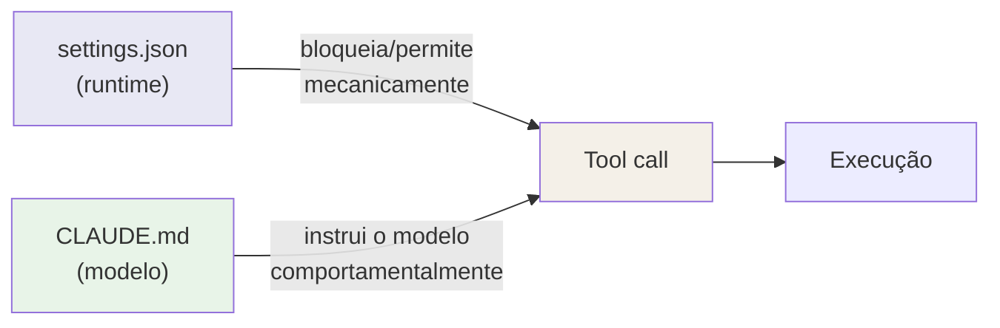
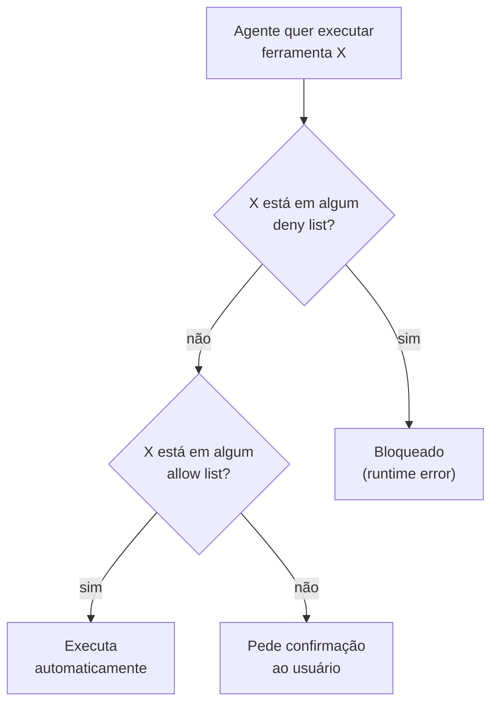

# settings.json — permissões, comportamentos, env vars

> [!abstract] TL;DR
> `settings.json` é a configuração estruturada do Claude Code — controla permissões (allow/deny de tools), variáveis de ambiente, hooks e comportamentos como o modelo padrão. Existe em três locais: global (`~/.claude/`), projeto (`.claude/`) e local (`.claude/settings.local.json`). A camada mais específica sobrescreve. Diferente do CLAUDE.md, é interpretado pelo runtime — não pelo modelo.

---

## A distinção fundamental: runtime vs. modelo

Claude Code tem dois tipos de configuração:

- **CLAUDE.md** — instrução em linguagem natural, lida pelo modelo. O modelo decide como interpretar.
- **settings.json** — configuração estruturada, interpretada pelo runtime do Claude Code. Sem ambiguidade: `"deny": ["Bash(rm -rf *)"]` bloqueia mecanicamente, não sugere ao modelo que talvez seja melhor não fazer.



Essa distinção importa: um `deny` no settings.json não pode ser "convencido" por uma instrução no prompt. É uma barreira de runtime. Uma instrução no CLAUDE.md ("não faça push diretamente") pode ser ignorada se o modelo avaliar que o contexto justifica. Use `settings.json` para o que deve ser inegociável.

---

## Estrutura do arquivo

```json
{
  "permissions": {
    "allow": [...],
    "deny": [...]
  },
  "env": {
    "VARIAVEL": "valor"
  },
  "hooks": {
    "PreToolUse": [...],
    "PostToolUse": [...]
  },
  "model": "claude-sonnet-4-6",
  "includeCoAuthoredBy": false
}
```

---

## Campo `permissions` — allow e deny

O campo mais usado. Define quais ferramentas o agente pode usar sem pedir confirmação (`allow`) e quais estão bloqueadas mesmo que o modelo tente usá-las (`deny`).

**Sintaxe geral:**
```json
{
  "permissions": {
    "allow": [
      "Tool(padrão)",
      "Bash(npm test)",
      "Edit(*)",
      "Read(*)"
    ],
    "deny": [
      "Bash(git push --force)",
      "Bash(rm -rf *)"
    ]
  }
}
```

**Padrões de glob suportados:**
- `Bash(npm test)` — comando exato
- `Bash(npm run *)` — qualquer subcomando de `npm run`
- `Bash(git *)` — qualquer comando git
- `Edit(src/*)` — editar apenas arquivos dentro de src/
- `Read(*)` — qualquer leitura (geralmente seguro liberar)
- `Bash(*)` — qualquer bash (cuidado — libera tudo)

**Prioridade:** `deny` tem precedência sobre `allow`. Se um padrão aparece nos dois, o deny vence.

---

## Campo `env` — variáveis de ambiente

Variáveis disponíveis para o agente durante a sessão. O agente as enxerga no ambiente de execução dos comandos Bash.

```json
{
  "env": {
    "DATABASE_URL": "postgresql://localhost:5432/myapp_dev",
    "NODE_ENV": "development",
    "LOG_LEVEL": "debug",
    "API_BASE_URL": "http://localhost:3000"
  }
}
```

**Caso de uso típico:** apontar o agente para o ambiente de desenvolvimento correto sem que ele precise perguntar qual banco usar.

> [!warning] Segurança — nunca coloque secrets em settings.json
> `settings.json` vai para o git. Qualquer secret (API key, password de banco de produção, token) que você colocar aqui estará exposto no repositório. Use `.claude/settings.local.json` (no .gitignore) para variáveis sensíveis locais. Ou use variáveis de ambiente do sistema — o agente herda o ambiente do shell.

---

## Campo `hooks` — scripts automáticos

Configura scripts que rodam automaticamente antes ou depois de tool calls. Diferente de instruir o modelo ("sempre rode lint depois de editar"), hooks são executados mecanicamente pelo runtime.

```json
{
  "hooks": {
    "PreToolUse": [
      {
        "matcher": "Bash",
        "hooks": [
          {
            "type": "command",
            "command": "echo 'Comando: $TOOL_INPUT' >> ~/.claude/audit.log"
          }
        ]
      }
    ],
    "PostToolUse": [
      {
        "matcher": "Edit",
        "hooks": [
          {
            "type": "command",
            "command": "npm run lint -- --fix"
          }
        ]
      }
    ]
  }
}
```

Os hooks mais comuns em `settings.json` são simples — auto-format após edição, auditoria de comandos, notificações. Para lógica mais complexa (bloqueio condicional, transformação de output), ver o galho [[03-Dominios/Tecnologia/IA/Claude Code/Hooks e Guardrails/index|Hooks e Guardrails]].

---

## Campo `model` — modelo padrão

Seleciona o modelo padrão para o projeto. Útil quando o time quer garantir que todos usam o mesmo modelo, independente da configuração pessoal.

```json
{
  "model": "claude-sonnet-4-6"
}
```

Modelos disponíveis (conforme dados de 2026):
- `claude-opus-4-8` — mais capaz, mais caro, mais lento
- `claude-sonnet-4-6` — padrão recomendado (custo × qualidade)
- `claude-haiku-4-5-20251001` — rápido e barato, para tarefas simples

---

## Campo `includeCoAuthoredBy` — assinatura de commits

Controla se Claude adiciona `Co-Authored-By: Claude` em commits. Default: `true`.

```json
{
  "includeCoAuthoredBy": false
}
```

Definir como `false` no nível de projeto garante consistência para o time inteiro, sem depender da configuração pessoal de cada desenvolvedor.

---

## Configuração mínima recomendada — por stack

**Node.js / TypeScript:**
```json
{
  "permissions": {
    "allow": [
      "Bash(npm test)",
      "Bash(npm test -- *)",
      "Bash(npm run lint)",
      "Bash(npm run type-check)",
      "Bash(npm run build)",
      "Bash(git status)",
      "Bash(git log *)",
      "Bash(git diff *)",
      "Bash(git add *)",
      "Bash(git commit *)"
    ],
    "deny": [
      "Bash(git push --force *)",
      "Bash(rm -rf *)",
      "Bash(git reset --hard *)"
    ]
  },
  "includeCoAuthoredBy": false
}
```

**Python / pytest:**
```json
{
  "permissions": {
    "allow": [
      "Bash(pytest)",
      "Bash(pytest *)",
      "Bash(ruff check *)",
      "Bash(ruff format *)",
      "Bash(alembic upgrade head)",
      "Bash(git status)",
      "Bash(git log *)",
      "Bash(git diff *)",
      "Bash(git add *)",
      "Bash(git commit *)"
    ],
    "deny": [
      "Bash(git push --force *)",
      "Bash(rm -rf *)",
      "Bash(alembic downgrade *)"
    ]
  },
  "includeCoAuthoredBy": false
}
```

**Java / Maven:**
```json
{
  "permissions": {
    "allow": [
      "Bash(./mvnw test)",
      "Bash(./mvnw test *)",
      "Bash(./mvnw compile)",
      "Bash(./mvnw clean package *)",
      "Bash(./mvnw spring-boot:run)",
      "Bash(git status)",
      "Bash(git log *)",
      "Bash(git diff *)",
      "Bash(git add *)",
      "Bash(git commit *)"
    ],
    "deny": [
      "Bash(git push --force *)",
      "Bash(rm -rf *)"
    ]
  },
  "includeCoAuthoredBy": false
}
```

---

## Exemplo completo anotado — projeto fullstack

Um `settings.json` real para um projeto Next.js + PostgreSQL, com comentários sobre cada decisão:

```json
{
  "permissions": {
    "allow": [
      // Leitura — sempre seguro liberar
      "Read(*)",

      // Git de consulta — nunca muda estado
      "Bash(git status)",
      "Bash(git log *)",
      "Bash(git diff *)",
      "Bash(git branch *)",

      // Git de escrita — somente o básico do fluxo local
      "Bash(git add *)",
      "Bash(git commit *)",

      // Testes e qualidade — CI vai rodar mesmo, é seguro liberar
      "Bash(npm test)",
      "Bash(npm test -- *)",
      "Bash(npm run lint)",
      "Bash(npm run lint -- *)",
      "Bash(npm run type-check)",

      // Build e dev — necessário para verificar mudanças
      "Bash(npm run build)",
      "Bash(npm run dev)",

      // Banco de dados — só operações seguras
      "Bash(npm run db:migrate)",
      "Bash(npm run db:status)",

      // Utilitários de leitura comuns
      "Bash(ls *)",
      "Bash(find * -name *)",
      "Bash(wc -l *)"
    ],
    "deny": [
      // Destrutivos — bloquear independente do contexto
      "Bash(rm -rf *)",
      "Bash(git push --force *)",
      "Bash(git reset --hard *)",
      "Bash(git clean -f *)",

      // Banco — operações de reversão precisam de atenção humana
      "Bash(npm run db:rollback)",
      "Bash(npm run db:drop)",

      // Publicação — precisa de aprovação consciente
      "Bash(npm publish *)",
      "Bash(git push * main)"
    ]
  },
  "env": {
    "DATABASE_URL": "postgresql://localhost:5432/myapp_dev",
    "NODE_ENV": "development"
  },
  "includeCoAuthoredBy": false,
  "model": "claude-sonnet-4-6"
}
```

Note que `git push * main` está no deny mas `git push` (sem filtro de branch) não está — push para branches de feature é permitido, mas push direto para main requer confirmação.

---

## Casos práticos

A teoria de allow/deny só cola quando você vê o efeito colateral de uma configuração ruim. Dois cenários que aparecem o tempo todo em times reais:

**Cenário 1 — CI pipeline preso porque o allow list "esqueceu" o básico.**
Um time configura `.claude/settings.json` só com os comandos "importantes" (`npm test`, `npm run build`) e assume que o resto — `git status`, `ls`, `cat` — vai funcionar por padrão. Não funciona: sem allow, cada leitura trivial vira um prompt de confirmação. Numa pipeline não-interativa (Claude Code rodando headless num agente de CI), isso não é só irritante — é uma trava. O processo fica esperando confirmação que nunca chega.

```json
{
  "permissions": {
    "allow": [
      "Bash(npm test)",
      "Bash(npm run build)"
    ]
  }
}
```

A correção é sempre a mesma: liberar explicitamente o básico de leitura e diagnóstico (`Read(*)`, `Bash(git status)`, `Bash(git log *)`, `Bash(git diff *)`, `Bash(ls *)`) além dos comandos "importantes". Veja o [[#Exemplo completo anotado — projeto fullstack|exemplo fullstack]] acima — a seção de utilitários de leitura existe exatamente para evitar essa trava.

**Cenário 2 — onboarding de repo legado com deny amplo demais.**
Ao herdar um projeto legado, é tentador "travar tudo que pode dar problema" com um deny genérico:

```json
{
  "permissions": {
    "deny": ["Bash(*)"]
  }
}
```

Isso bloqueia literalmente qualquer comando Bash — inclusive `git status` e `npm test`. O agente fica sem conseguir rodar nada, e como `deny` sempre vence `allow` (ver [[#Campo permissions — allow e deny|seção acima]]), nenhum allow list vai destravar isso. Num repo legado, o padrão mais seguro é o inverso: `deny` cirúrgico (comandos destrutivos específicos: `rm -rf`, `push --force`, `reset --hard`) e `allow` generoso para leitura/diagnóstico — deixando as ações realmente perigosas fora do automático, mas sem paralisar o resto.

---

## Diagrama de resolução de permissões



---

## Global vs. projeto vs. local

| Configuração | Onde colocar | Versionado? |
|-------------|-------------|------------|
| Git básico (`git status`, `git log`) | `~/.claude/settings.json` | Não (pessoal) |
| Scripts do projeto (`npm test`, `cargo build`) | `.claude/settings.json` | Sim |
| `includeCoAuthoredBy` para o time | `.claude/settings.json` | Sim |
| DATABASE_URL local, paths pessoais | `.claude/settings.local.json` | Não |
| Secrets para desenvolvimento local | `.claude/settings.local.json` | Não |

Lembre: settings.json usa **sobrescrita** (não concatenação). A camada mais específica substitui a menos específica. Se o projeto define `allow: ["npm test"]`, sem incluir os allows do global, o agente perde as permissões globais naquela sessão.

---

## Armadilhas comuns

> [!warning] Sem nenhum allow configurado
> Sem `allow`, cada Bash que o agente tenta rodar — inclusive `git status`, `ls`, `wc -l` — pede confirmação. Sessão fica extremamente lenta, e numa execução não-interativa (CI, agente headless) isso trava o processo à espera de uma confirmação que nunca chega. Configure pelo menos os comandos de leitura básicos (ver [[#Casos práticos|Cenário 1]] acima).

> [!warning] Deny muito amplo
> `"deny": ["Bash(*)"]` bloqueia tudo, inclusive `git status` e `npm test`. O agente fica preso — e como `deny` sempre vence `allow`, nenhuma liberação adicional destrava isso. Deny deve ser cirúrgico — bloqueie o que é perigoso (comandos destrutivos específicos), não tudo (ver [[#Casos práticos|Cenário 2]] acima).

> [!warning] Secrets no settings.json
> O arquivo vai pro git. Se commitar, o secret está exposto no histórico para sempre. Use `.claude/settings.local.json` para qualquer coisa sensível.

> [!warning] Esquecer o .gitignore
> Se criar `settings.local.json`, adicione ao `.gitignore` imediatamente. Do contrário o arquivo sensível entra no repositório sem aviso.

> [!warning] Sobrescrita inesperada
> O projeto define um allow list pequeno, sobrescrevendo o global mais amplo — o agente perde permissões que funcionavam antes. Inclua explicitamente o que quer manter de camadas anteriores (settings.json usa sobrescrita, não concatenação).

> [!tip] Assista: Permissions, settings.json, and plan mode: making one Claude Code session safe
> **Canal:** Tyler Renelle | **Duração:** ~26min | **Idioma:** EN
>
> Cobre o mesmo terreno desta nota com um ângulo prático de quem já foi mordido pela armadilha do allow list amplo demais — inclusive o mesmo conselho desta nota (deny cirúrgico + allow nomeado, nunca `Bash(*)` pra silenciar prompts).
> Trecho de destaque [23:21]: *"The overly broad allow rule. It is so tempting around your second week to just write an allow rule of bash open paren star or bare bash and make all the prompts go away. Don't. [...] Allow the specific commands you run all day, your linter, your tests, your build, by name. Deny the sharp things explicitly, and let everything else prompt."*
>
> 🎬 [Assistir no YouTube](https://www.youtube.com/watch?v=CT9xynq7WZM)

---

## Checklist — settings.json

- [ ] Allow list inclui os comandos de teste e lint do projeto
- [ ] Deny list bloqueia as ações mais destrutivas (rm -rf, push --force)
- [ ] `includeCoAuthoredBy: false` se o time não quer assinatura Claude
- [ ] Secrets não estão no settings.json (verificar com `git diff`)
- [ ] `settings.local.json` está no `.gitignore`
- [ ] Allow list do projeto inclui o que precisa do global (não deixar sobrescrever implicitamente)

---

## Como explicar em inglês

| Português | Inglês |
|-----------|--------|
| Lista de permissões | Allow list / permissions list |
| Lista de bloqueio | Deny list / blocklist |
| Configuração estruturada | Structured configuration |
| Variáveis de ambiente | Environment variables |
| Sobrescrita de camada | Layer override |

**Frases úteis:**
- "settings.json is interpreted by the Claude Code runtime, not the model — a deny rule can't be overridden by a prompt instruction."
- "Without an allow list, every Bash command triggers a confirmation prompt — even `git status`. Configure at least the basics."
- "Never put secrets in settings.json — it goes to git. Use settings.local.json (gitignored) for local credentials."

---

## O que vem a seguir

Este `settings.json` só cobre o essencial de `permissions`, `env`, `hooks` e `model` — mas o campo `permissions` sozinho tem uma sintaxe rica o suficiente para merecer sua própria nota: padrões de glob mais finos, ordem de avaliação, casos de borda que não cabem aqui. Vale seguir para [[03-Dominios/Tecnologia/IA/Claude Code/Configuração/05 - Permissions|05 - Permissions]] para fechar esse detalhe.

Já se a dúvida é "onde esse arquivo mora, e o que mais existe na pasta `.claude/`", [[03-Dominios/Tecnologia/IA/Claude Code/Configuração/07 - Pasta .claude|07 - Pasta .claude]] mapeia a estrutura inteira — settings.json é só um dos arquivos que vivem lá dentro, ao lado de comandos customizados, agentes e hooks.

Outras notas relacionadas:
- [[03-Dominios/Tecnologia/IA/Claude Code/Configuração/01 - Hierarquia de configuração|01 - Hierarquia de configuração]] — como settings.json se combina entre camadas
- [[03-Dominios/Tecnologia/IA/Claude Code/Hooks e Guardrails/index|Hooks e Guardrails]] — hooks em profundidade
- [[03-Dominios/Tecnologia/IA/Claude Code/Configuração/index|Configuração]] — índice do galho

---

## Referências

- **Anthropic** — *Claude Code settings reference* (2026). Estrutura completa do settings.json — https://docs.anthropic.com/pt/docs/claude-code/settings
- **Anthropic** — *Claude Code permissions* (2026). Sintaxe de allow/deny e ordem de precedência — https://docs.anthropic.com/pt/docs/claude-code/settings#permissions
