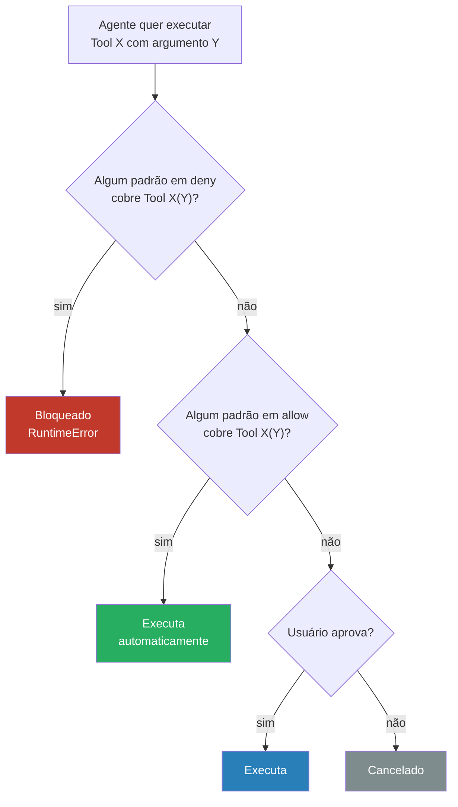

# Permissions — allow/deny, glob patterns, tool rules

> [!abstract] TL;DR
> Permissions controlam quais tool calls o Claude Code executa automaticamente versus quais precisam de confirmação humana. A sintaxe é `"NomeTool(padrão)"` nos arrays `allow` e `deny` de `settings.json`. Glob patterns com `*` funcionam para caminhos e argumentos de Bash. `deny` sempre prevalece sobre `allow`.

---

## A analogia: porteiro com lista VIP e lista negra

Imagine um porteiro de clube. Cada vez que um agente quer executar uma ação (rodar um teste, editar um arquivo, fazer git add), o porteiro verifica dois critérios:

1. **Lista negra (deny):** "Isso está proibido?" → se sim, bloqueio imediato. Sem exceções.
2. **Lista VIP (allow):** "Isso está autorizado?" → se sim, passa sem parar ninguém.
3. **Nenhuma das duas:** "Não sei." → pergunta para o dono (usuário) antes de deixar entrar.

O ponto crucial é que o porteiro não convence ninguém. Não há argumentação. A lista é a lei — diferente do CLAUDE.md, que o modelo pode interpretar com flexibilidade.

---

## Sintaxe geral

```
"NomeTool(padrão)"
```

- **NomeTool** — nome exato da tool: `Bash`, `Edit`, `Read`, `Write`, `WebFetch`, `WebSearch`
- **padrão** — string comparada com o argumento da tool call; suporta glob com `*`

Para liberar uma tool inteira sem restrição de argumento:
```json
"Read(*)"    // Qualquer leitura de arquivo
"Edit(*)"    // Qualquer edição de arquivo
```

---

## Bash — a tool mais crítica

Bash engloba todos os comandos shell — é onde a maioria dos riscos está e onde permissões bem calibradas fazem mais diferença.

### Comandos exatos

```json
"Bash(npm test)"      // Apenas 'npm test', exato
"Bash(git status)"    // Apenas 'git status'
"Bash(ls -la)"        // Apenas 'ls -la' (inclui a flag)
```

### Glob com `*`

```json
"Bash(npm test *)"    // npm test + qualquer argumento
"Bash(npm run *)"     // qualquer npm run <script>
"Bash(git log *)"     // git log com qualquer flag/argumento
"Bash(find * -name *)"
```

> [!warning] Atenção com globs amplos
> `"Bash(git *)"` permite `git push --force`. Prefira listar subcomandos específicos: `"Bash(git status)"`, `"Bash(git log *)"`, `"Bash(git diff *)"`.

### Prefixo de matching

O padrão é verificado como **prefixo** do comando completo. `"Bash(npm run)"` cobre `npm run lint`, `npm run build`, `npm run test:watch` — qualquer comando que começa com `npm run`.

---

## Ferramentas de arquivo — Read, Edit, Write

Para tools de arquivo, o padrão é comparado com o caminho.

```json
"Read(*)"                  // Qualquer arquivo em qualquer caminho
"Edit(*)"                  // Editar qualquer arquivo
"Edit(src/*)"              // Apenas arquivos diretamente em src/
"Edit(src/**/*.ts)"        // TypeScript em qualquer subpasta de src/
"Write(tests/*)"           // Escrever apenas dentro de tests/
"Write(src/generated/*)"   // Apenas código gerado (não handcrafted)
```

**Padrão recomendado:** liberar `Read(*)` e `Edit(*)` quase sempre. Leitura é inofensiva; edição é reversível via git. Restringir `Write(*)` apenas para projetos com arquivos protegidos específicos.

---

## WebFetch e WebSearch

```json
"WebFetch(*)"                                       // Qualquer URL
"WebFetch(https://docs.anthropic.com/*)"            // Apenas docs Anthropic
"WebFetch(https://docs.python.org/*)"               // Apenas docs Python
"WebSearch(*)"                                      // Qualquer pesquisa web
```

---

## Deny sempre prevalece sobre allow

Se um padrão aparece nos dois lados, `deny` vence. Sem exceção.

```json
{
  "permissions": {
    "allow": ["Bash(git *)"],
    "deny": ["Bash(git push *)"]
  }
}
```

Resultado: qualquer `git *` é permitido, **exceto** `git push *`. O agente pode `git status`, `git add`, `git commit`, mas não `git push`.

Isso é útil para liberar amplo e restringir pontualmente, sem ter que listar cada subcomando permitido:

```json
{
  "permissions": {
    "allow": ["Bash(npm *)"],
    "deny": [
      "Bash(npm publish *)",
      "Bash(npm deprecate *)"
    ]
  }
}
```

---

## Como as camadas se combinam

Permissions se acumulam entre camadas. A regra prática é:

```
Allow final = union(allow global, allow projeto, allow local)
Deny final  = union(deny global, deny projeto, deny local)
```

**Exemplo:**
```
~/.claude/settings.json:    allow: ["Bash(git status)", "Bash(git log *)"]
.claude/settings.json:      allow: ["Bash(npm test)"], deny: ["Bash(rm -rf *)"]

Sessão resultante:
  allow: git status + git log * + npm test
  deny:  rm -rf *
```

> [!info] Nota de comportamento observado
> A documentação oficial descreve settings.json com sobrescrita por camada. Na prática, permissões se acumulam entre camadas (a mais específica adiciona, não substitui). Se encontrar comportamento diferente, liste explicitamente o que precisa em cada camada — não confie no comportamento de merge.

---

## Mapa de segurança por zona

```mermaid
quadrantChart
    title Risco × Frequência de uso
    x-axis Baixo risco --> Alto risco
    y-axis Baixa frequência --> Alta frequência
    quadrant-1 Liberar com allow
    quadrant-2 Liberar com allow (monitorar)
    quadrant-3 Deixar pedir confirmação
    quadrant-4 Bloquear com deny
    Read(*): [0.1, 0.9]
    git status: [0.1, 0.8]
    git log: [0.1, 0.7]
    npm test: [0.2, 0.85]
    Edit(*): [0.3, 0.9]
    git add: [0.3, 0.7]
    git commit: [0.4, 0.6]
    npm install: [0.5, 0.5]
    git push: [0.6, 0.4]
    rm -rf: [0.95, 0.1]
    git push force: [0.98, 0.05]
```

---

## Fluxo de decisão completo



O fluxo tem três saídas possíveis: bloqueio (deny), execução automática (allow), execução após aprovação (nenhuma regra → pergunta ao usuário). Não existe "convencer o porteiro" — o resultado é determinístico.

---

## Diferença entre allow list vazia e ausente

Existe uma diferença sutil entre ter `"allow": []` (array vazio) e não ter o campo `allow` no arquivo:

- **Campo ausente:** herda da camada superior (global ou padrão do Claude Code)
- **Array vazio `[]`:** sobrescreve para vazio — nada é permitido automaticamente

```json
// settings.json sem allow — herda do global
{
  "permissions": {
    "deny": ["Bash(rm -rf *)"]
  }
}

// settings.json com allow vazio — NADA é automático neste projeto
{
  "permissions": {
    "allow": [],
    "deny": ["Bash(rm -rf *)"]
  }
}
```

Use `allow: []` explicitamente apenas quando quiser que o projeto force confirmação em tudo — por exemplo, em projetos de infra crítica onde qualquer execução deve ser revisada.

---

## Configuração recomendada por tier

### Nível global — mínimo para qualquer projeto

```json
// ~/.claude/settings.json
{
  "permissions": {
    "allow": [
      "Read(*)",
      "Edit(*)",
      "Bash(git status)",
      "Bash(git log *)",
      "Bash(git diff *)",
      "Bash(git add *)",
      "Bash(git commit *)",
      "Bash(ls *)",
      "Bash(find * -name *)",
      "Bash(wc -l *)"
    ],
    "deny": [
      "Bash(git push --force *)",
      "Bash(git reset --hard *)",
      "Bash(git clean -f *)",
      "Bash(rm -rf *)",
      "Bash(sudo *)"
    ]
  }
}
```

### Nível projeto — Node.js/TypeScript

```json
// .claude/settings.json
{
  "permissions": {
    "allow": [
      "Bash(npm test)",
      "Bash(npm test -- *)",
      "Bash(npm run lint)",
      "Bash(npm run lint -- *)",
      "Bash(npm run type-check)",
      "Bash(npm run build)",
      "Bash(npm run dev)"
    ],
    "deny": [
      "Bash(npm publish *)"
    ]
  }
}
```

### Nível projeto — Python

```json
// .claude/settings.json
{
  "permissions": {
    "allow": [
      "Bash(pytest)",
      "Bash(pytest *)",
      "Bash(ruff check *)",
      "Bash(ruff format *)",
      "Bash(python -m *)",
      "Bash(alembic upgrade *)",
      "Bash(alembic revision *)"
    ],
    "deny": [
      "Bash(alembic downgrade *)"
    ]
  }
}
```

### Nível projeto — Java/Maven

```json
// .claude/settings.json
{
  "permissions": {
    "allow": [
      "Bash(./mvnw test)",
      "Bash(./mvnw test *)",
      "Bash(./mvnw compile)",
      "Bash(./mvnw clean package *)",
      "Bash(./mvnw spring-boot:run)"
    ]
  }
}
```

---

## Armadilhas

**Sem nenhum allow:** cada tool call pede confirmação, inclusive `git status` e leitura de arquivos. Sessão fica inutilizavelmente lenta. Configure pelo menos `Read(*)`, `Edit(*)` e os comandos git de consulta.

**`"deny": ["Bash(*)"]`:** bloqueia absolutamente tudo. O agente fica paralisado. Deny deve ser cirúrgico — alveje o perigoso, não tudo.

**`"Bash(*)"` no allow:** libera todo e qualquer comando shell, incluindo `rm -rf /`, `git push --force`, `sudo`. Se você quiser liberar "quase tudo", use `deny` para as exceções, não allow amplo.

**Esquecer variações de argumento:** `"Bash(npm test)"` não cobre `npm test -- --watch`. Adicione `"Bash(npm test *)"` para cobrir argumentos extras.

**Não testar:** configure, faça uma sessão de teste com comandos variados, verifique o que fica travado. Permissions mal calibradas são descobertas na hora errada.

---

## Checklist — permissions

- [ ] `Read(*)` está no allow (leitura nunca é destrutiva)
- [ ] `Edit(*)` está no allow ou restrito ao subdiretório correto
- [ ] Comandos de teste e lint do projeto estão no allow
- [ ] `rm -rf *`, `git push --force *`, `git reset --hard *` estão no deny
- [ ] Globs amplos no allow têm deny complementares para os casos perigosos
- [ ] Testado com uma sessão real — nada que deveria funcionar fica travado

---

## Como explicar em inglês

| Português | Inglês |
|-----------|--------|
| Lista de permissão | Allow list / allowlist |
| Lista de bloqueio | Deny list / blocklist |
| Padrão glob | Glob pattern |
| Confirmação manual | Manual confirmation / user approval |
| Prevalece sobre | Takes precedence over |

**Frases úteis:**
- "The deny list always takes precedence over the allow list — even if a pattern appears in both, the deny wins."
- "Without any allow list configured, every single tool call — including git status and file reads — will prompt for approval."
- "Use deny to surgically block dangerous operations; don't use allow: Bash(*) and then try to list exceptions in deny — it becomes hard to reason about."

---

## Veja também

- [[03-Dominios/Tecnologia/IA/Claude Code/Configuração/04 - settings.json|04 - settings.json]] — arquivo que contém permissions
- [[03-Dominios/Tecnologia/IA/Claude Code/Configuração/01 - Hierarquia de configuração|01 - Hierarquia de configuração]] — como permissões se combinam entre camadas
- [[03-Dominios/Tecnologia/IA/Claude Code/Configuração/08 - Armadilhas de configuração|08 - Armadilhas de configuração]] — erros comuns

---

## Referências

- **Anthropic** — *Claude Code settings — permissions* (2026). Sintaxe de allow/deny e precedência — https://docs.anthropic.com/pt/docs/claude-code/settings#permissions
- **Anthropic** — *Claude Code security* (2026). Práticas de segurança recomendadas para permissões — https://docs.anthropic.com/pt/docs/claude-code/security


