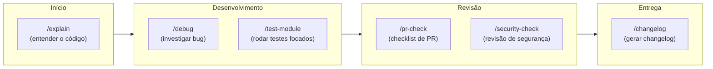

# Slash commands customizados — .claude/commands/

> [!abstract] TL;DR
> Slash commands customizados são arquivos Markdown em `.claude/commands/` que o Claude Code expõe como `/nome-do-arquivo`. O conteúdo do arquivo vira o prompt executado quando você digita o comando. Útil para encapsular fluxos recorrentes do projeto. O argumento `$ARGUMENTS` captura o que você escreve depois do comando.

---

## A analogia: macros de teclado para prompts

Você usa macros de teclado para expandir "brg" em "Bom dia, tudo bem?" ou atalhos no VS Code para rodar testes com dois toques. Slash commands são a mesma ideia — atalhos que expandem um nome curto em um prompt longo e preciso.

A diferença de simplesmente copiar e colar um prompt é que commands ficam versionados no repositório, disponíveis para todo o time. Um `/pr-check` bem calibrado é um padrão de qualidade compartilhado — não um hábito de um desenvolvedor.

---

## Como funciona

```mermaid
flowchart LR
    User["/review no chat"]
    FS["`.claude/commands/review.md`\ncarregado do disco"]
    Expand["Conteúdo do arquivo\nvira o prompt"]
    Exec["Agente executa\ncomo se você tivesse\ndigitado tudo"]

    User --> FS --> Expand --> Exec
```

1. Você digita `/review` no chat
2. Claude Code encontra `.claude/commands/review.md`
3. Carrega o conteúdo como prompt
4. O agente executa como se você tivesse digitado aquele texto

---

## Criando um slash command

1. Crie um arquivo `.md` em `.claude/commands/`
2. O nome do arquivo (sem `.md`) vira o comando — use kebab-case
3. Escreva o prompt no corpo do arquivo

```markdown
<!-- .claude/commands/review.md -->
Faça um code review das mudanças em staging (git diff --staged).

Avalie:
- Bugs óbvios e edge cases não tratados
- Violações das convenções do projeto (CLAUDE.md)
- Testes ausentes para o happy path e casos de erro
- Performance: queries N+1, alocações desnecessárias

Formato de saída: lista de issues por arquivo, severidade (critical/warning/suggestion).
```

Resultado: `/review` no chat executa exatamente esse prompt.

---

## Usando `$ARGUMENTS`

Para comandos que recebem entrada do usuário, use `$ARGUMENTS` no corpo do arquivo. Claude Code substitui `$ARGUMENTS` pelo texto digitado após o comando.

```markdown
<!-- .claude/commands/test-module.md -->
Rode os testes do módulo $ARGUMENTS e analise as falhas.

Se houver falhas:
1. Mostre o stack trace completo de cada falha
2. Identifique a causa raiz (não apenas o sintoma)
3. Sugira a correção mínima para fazer o teste passar

Se todos passarem, mostre o relatório de cobertura.
```

Uso:
```
/test-module services/payment
```

Claude Code executa o prompt com `$ARGUMENTS` = `services/payment`.

---

## Biblioteca de commands úteis

### `/pr-check` — checklist antes de abrir PR

```markdown
<!-- .claude/commands/pr-check.md -->
Revise as mudanças atuais (git diff main) como se fosse aprovar ou reprovar um PR.

Verifique:
- [ ] Todos os testes passam (npm test / pytest / go test ./...)
- [ ] Sem console.log ou código de debug esquecido
- [ ] Sem credenciais ou secrets hardcoded
- [ ] Convenções de código seguidas (ver CLAUDE.md)
- [ ] Há testes para o que foi adicionado?
- [ ] Breaking changes documentados?
- [ ] Mensagens de commit seguem o padrão do projeto?

Dê um veredito: APROVADO / APROVADO COM RESSALVAS / REPROVADO, com justificativa.
```

### `/explain $ARGUMENTS` — explicar código para onboarding

```markdown
<!-- .claude/commands/explain.md -->
Explique o arquivo ou função $ARGUMENTS para um dev que acabou de entrar no projeto.

Inclua:
- O que faz em linguagem de negócio (não só técnica)
- Como se encaixa na arquitetura geral
- Decisões de design não óbvias (por que foi feito assim)
- Armadilhas para quem for modificar

Nível: dev sênior, mas novo no projeto.
```

### `/changelog` — gerar changelog desde a última tag

```markdown
<!-- .claude/commands/changelog.md -->
Gere um changelog para os commits desde a última tag, no formato Keep a Changelog.

1. Execute: git log $(git describe --tags --abbrev=0)..HEAD --oneline
2. Agrupe por: Added, Changed, Fixed, Removed
3. Use linguagem de produto (benefício para o usuário, não detalhes técnicos)
4. Ignore commits de chore, style, refactor sem impacto visível

Formato: Markdown pronto para adicionar ao CHANGELOG.md.
```

### `/debug $ARGUMENTS` — sessão de debugging estruturada

```markdown
<!-- .claude/commands/debug.md -->
Inicie uma sessão de debugging estruturada para o problema: $ARGUMENTS

Processo:
1. Reproduza o problema: comportamento esperado vs. observado?
2. Identifique o ponto de entrada: onde o fluxo começa?
3. Adicione logging estratégico para rastrear o estado
4. Forme hipóteses e teste cada uma com evidências

Não modifique código até termos a causa confirmada.
```

### `/security-check` — revisão de segurança

```markdown
<!-- .claude/commands/security-check.md -->
Faça uma revisão de segurança das mudanças em staging (git diff --staged).

Verifique especificamente:
- SQL injection: queries com interpolação de string?
- XSS: dados de usuário renderizados sem sanitização?
- Auth: endpoints protegidos corretamente?
- Secrets: credenciais hardcoded ou em código?
- Dependencies: novas dependências adicionadas? Verificar licença e manutenção.
- Input validation: entradas de usuário validadas antes de processar?

Formato: lista de vulnerabilidades por severity (HIGH/MEDIUM/LOW) com linha do arquivo.
```

### `/migrate $ARGUMENTS` — auxiliar de migração

```markdown
<!-- .claude/commands/migrate.md -->
Crie uma migration para: $ARGUMENTS

1. Execute: npm run db:migrate:create -- --name $ARGUMENTS
2. Preencha a migration com a operação solicitada
3. Verifique que a operação de rollback (down) desfaz a up completamente
4. Execute: npm run db:migrate para aplicar e verificar que não há erros

Sempre use transações. Nunca modifique migrations existentes.
```

---

### `/refactor $ARGUMENTS` — refator guiado

```markdown
<!-- .claude/commands/refactor.md -->
Refatore $ARGUMENTS seguindo as convenções do projeto.

Antes de qualquer mudança:
1. Explique o que você vai alterar e por quê
2. Identifique o impacto: quais outros arquivos serão afetados?
3. Confirme se há testes existentes que validam o comportamento

Restrições:
- Não altere comportamento — só estrutura
- Não remova testes (mesmo que pareçam redundantes)
- Se o refactor for grande, faça em commits atômicos
- Execute os testes antes e depois: npm test

Apresente um plano e aguarde aprovação antes de editar qualquer arquivo.
```

### `/onboard` — contexto completo do projeto para sessão nova

```markdown
<!-- .claude/commands/onboard.md -->
Estamos iniciando uma nova sessão. Antes de qualquer tarefa:

1. Leia o CLAUDE.md do projeto para entender o contexto
2. Rode: git log --oneline -10 para ver o trabalho recente
3. Rode: git status para ver o estado atual
4. Mostre um resumo: o que o projeto faz, estado atual, branch, mudanças pendentes

Após o resumo, pergunte: "O que vamos trabalhar hoje?"
```

---

## Commands avançados com múltiplos argumentos

`$ARGUMENTS` captura tudo após o comando como uma string. Para commands que precisam de múltiplos parâmetros, documente a convenção no próprio arquivo:

```markdown
<!-- .claude/commands/compare-branches.md -->
Compare as mudanças entre duas branches.

Uso esperado: /compare-branches <branch-origem> <branch-destino>
Argumento recebido: $ARGUMENTS

Interprete o primeiro token como branch-origem e o segundo como branch-destino.

1. Execute: git diff $ARGUMENTS
2. Summarize as mudanças: quais arquivos, quais tipos de mudança (feature, bugfix, refactor)
3. Identifique potenciais conflitos com o estado atual do working tree
```

---

## Commands como padrão de qualidade do time

A proposta mais poderosa dos slash commands não é economizar digitação — é padronizar o nível mínimo de qualidade de uma ação recorrente.

**Sem `/pr-check`:** cada dev faz seu próprio checklist mental antes de abrir PR. Alguns verificam testes, outros não. Alguns verificam secrets, outros esquecem. A qualidade varia por hábito pessoal.

**Com `/pr-check`:** o checklist é o mesmo para todos, sempre. Quando o time descobre que um tipo de bug passa por review, o command é atualizado — e todos herdam o aprendizado na próxima vez que digitarem `/pr-check`.

Esse é o loop de melhoria:
1. Bug passa por review → postmortem identifica o que o review não checou
2. Adiciona checagem no `pr-check.md`
3. Commit, push → todos os devs têm o check na próxima sessão
4. Repete

---

## Commands globais vs. de projeto

```
~/.claude/commands/      → disponível em todos os projetos
.claude/commands/        → específico do projeto (vai pro git, time inteiro)
```

**Quando usar global:**
- Commands que fazem sentido em qualquer projeto (`/debug`, `/explain`, `/pr-check` genérico)
- Preferências pessoais de workflow

**Quando usar projeto:**
- Commands com detalhes específicos da stack (`/migrate`, `test-module`)
- Checklist que referencia convenções do CLAUDE.md
- Qualquer command que o time todo deve ter disponível

---

## Mapa de commands por fase do trabalho



---

## Armadilhas

**Nome com espaços.** `deploy check.md` não funciona como command. Use kebab-case: `deploy-check.md`.

**Prompt vago no command file.** "Faça um review do código" sem critérios específicos produz output genérico. Um command deve ser mais preciso que um prompt ad hoc — é onde você codifica o padrão de qualidade do time.

**`$ARGUMENTS` sem fallback.** Se o command pode ser invocado com ou sem argumento, documente o comportamento esperado para cada caso dentro do arquivo.

**Commands desatualizados.** Se um command referencia `src/utils/logger.ts` e esse arquivo foi movido para `src/infra/logger.ts`, o agente vai se perder. Revise commands quando a estrutura do projeto mudar.

**Tamanho excessivo.** Commands muito longos aumentam o contexto de cada sessão que os usa. Se um command está passando de 50 linhas, considere dividir em dois commands mais focados.

---

## Checklist — slash commands

- [ ] Todos os commands usam kebab-case no nome do arquivo
- [ ] Commands com input usam `$ARGUMENTS`
- [ ] Commands de projeto estão em `.claude/commands/` (versionado no git)
- [ ] Commands pessoais/globais estão em `~/.claude/commands/`
- [ ] Prompts são específicos — não genéricos
- [ ] Referências a arquivos foram verificadas (caminhos atuais)

---

## Como explicar em inglês

| Português | Inglês |
|-----------|--------|
| Slash command customizado | Custom slash command |
| Arquivo de command | Command file |
| Argumento | Argument / input argument |
| Fluxo recorrente | Recurring workflow / repeated pattern |
| Versionado | Version-controlled |

**Frases úteis:**
- "Custom slash commands are Markdown files in .claude/commands/ — the filename becomes the command, the content becomes the prompt."
- "Think of them as shared keyboard macros for prompts: /pr-check runs a 30-line checklist prompt with one keystroke, and every team member gets the same quality bar."
- "Use $ARGUMENTS to capture what the user types after the command name."

---

## Veja também

- [[03-Dominios/Tecnologia/IA/Claude Code/Configuração/07 - Pasta .claude|07 - Pasta .claude]] — estrutura completa da pasta .claude
- [[03-Dominios/Tecnologia/IA/Claude Code/Configuração/01 - Hierarquia de configuração|01 - Hierarquia de configuração]] — commands globais vs. de projeto
- [[03-Dominios/Tecnologia/IA/Claude Code/Skills e MCP/index|Skills e MCP]] — skills são commands mais poderosos com plugins externos
- [[03-Dominios/Tecnologia/IA/Claude Code/Configuração/index|Configuração]] — índice do galho

---

## Referências

- **Anthropic** — *Claude Code slash commands* (2026). Documentação oficial de commands customizados — https://docs.anthropic.com/pt/docs/claude-code/slash-commands
- **Anthropic** — *Claude Code best practices* (2026). Exemplos de commands para workflows comuns — https://www.anthropic.com/engineering/claude-code-best-practices


