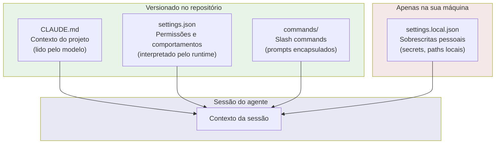
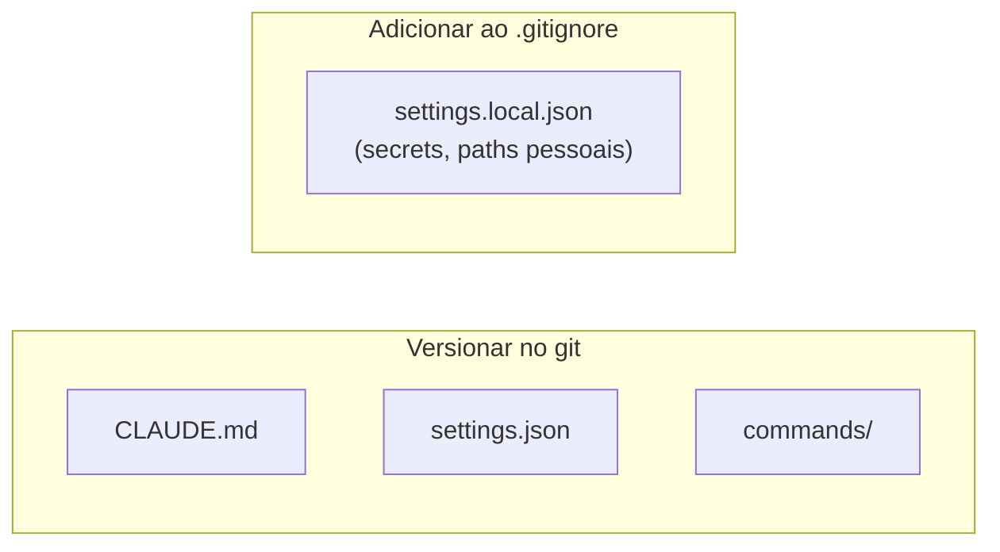

# A pasta .claude — estrutura e propósito de cada arquivo

> [!abstract] TL;DR
> `.claude/` é o diretório de configuração do projeto para o Claude Code. Contém CLAUDE.md (contexto), settings.json (permissões, versionado), settings.local.json (sobrescritas pessoais, no .gitignore) e commands/ (slash commands). Cada arquivo tem um papel distinto — entender isso evita configurar no lugar errado.

---

## A analogia: a pasta `.github/`

Você já conhece a `.github/` — onde ficam os workflows de CI/CD, os templates de PR e issue, as regras de CODEOWNERS. Ela configura o comportamento do GitHub para o repositório sem ser código de produto.

A `.claude/` tem o mesmo papel, mas para o Claude Code. Ela configura o comportamento do agente para o projeto — o que ele sabe, o que ele pode fazer, quais atalhos ele oferece. Também fica no repositório, também é versionada, também é compartilhada com o time.

---

## Estrutura completa

```
.claude/
├── CLAUDE.md              ← contexto do projeto (vai pro git)
├── settings.json          ← permissões e comportamentos (vai pro git)
├── settings.local.json    ← sobrescritas pessoais (NÃO vai pro git)
└── commands/              ← slash commands do projeto (vai pro git)
    ├── review.md          → /review
    ├── pr-check.md        → /pr-check
    ├── debug.md           → /debug
    └── changelog.md       → /changelog
```

---

## Diagrama de responsabilidades



---

## Cada arquivo e seu propósito

### `CLAUDE.md` — o onboarding doc do agente

**O que é:** Contexto do projeto em linguagem natural. Lido pelo modelo no início de cada sessão. Concatenado com `~/.claude/CLAUDE.md` (global) — ambos chegam ao agente.

**Contém:** Stack e versões, arquitetura (onde as coisas ficam), convenções de código, comandos de desenvolvimento, restrições e o que nunca fazer.

**Vai pro git?** Sim. Todo dev que usar Claude Code no projeto recebe o mesmo contexto, tornando o comportamento do agente consistente entre membros do time.

**Quando atualizar:** quando a stack muda, quando uma nova convenção é adotada, quando o agente toma uma decisão errada por falta de contexto — esse é o sinal mais claro.

Ver [[03-Dominios/Tecnologia/IA/Claude Code/Configuração/02 - CLAUDE.md anatomia|02 - CLAUDE.md anatomia]] para estrutura detalhada.

---

### `settings.json` — regras do projeto para o runtime

**O que é:** Configuração estruturada JSON, interpretada pelo runtime do Claude Code (não pelo modelo). Define o que o agente pode e não pode fazer mecanicamente.

**Contém:**
```json
{
  "permissions": {
    "allow": [
      "Bash(npm test)",
      "Bash(npm test -- *)",
      "Bash(npm run lint)",
      "Edit(*)",
      "Read(*)"
    ],
    "deny": [
      "Bash(git push --force*)",
      "Bash(rm -rf *)"
    ]
  },
  "env": {
    "NODE_ENV": "development"
  },
  "includeCoAuthoredBy": false
}
```

**Vai pro git?** Sim. Define o contrato de segurança do projeto — quais comandos o agente pode executar sem pedir confirmação, e quais são bloqueados independente do que o modelo queira fazer.

Ver [[03-Dominios/Tecnologia/IA/Claude Code/Configuração/04 - settings.json|04 - settings.json]] para todos os campos.

---

### `settings.local.json` — suas sobrescritas pessoais

**O que é:** Sobrescritas pessoais do `settings.json` do projeto. Mesma estrutura JSON, mas aplicadas apenas para você na sua máquina. Nunca sai do seu ambiente.

**Contém:** Variáveis de ambiente locais (DATABASE_URL apontando para seu banco local), paths pessoais, permissões temporárias para debugging, secrets de desenvolvimento.

```json
{
  "permissions": {
    "allow": [
      "Bash(npm run dev:local)",
      "Bash(docker-compose up*)"
    ]
  },
  "env": {
    "DATABASE_URL": "postgresql://localhost:5432/myapp_dev",
    "REDIS_URL": "redis://localhost:6379",
    "JWT_SECRET": "dev-only-never-prod"
  }
}
```

**Vai pro git?** NUNCA. Adicione ao `.gitignore` imediatamente ao criar o arquivo.

**Por que existe separado?** Para não forçar você a escolher entre "compartilho tudo no settings.json (inclusive coisas sensíveis)" e "não compartilho nada (perco o valor para o time)". O par settings.json + settings.local.json resolve essa tensão.

---

### `commands/` — slash commands do projeto

**O que é:** Pasta com arquivos Markdown. Cada arquivo vira um slash command disponível no Claude Code.

**Contém:** Um arquivo `.md` por comando. O nome do arquivo (sem `.md`) vira o `/comando`. O conteúdo do arquivo é o prompt executado.

```
commands/
├── pr-check.md    → /pr-check    (checklist antes de PR)
├── explain.md     → /explain     (explicar código)
├── debug.md       → /debug       (sessão de debugging)
└── changelog.md   → /changelog   (gerar changelog)
```

**Vai pro git?** Sim. Commands compartilhados são padrões de qualidade do time — quando `/pr-check` é atualizado para incluir uma nova verificação, todos herdam imediatamente.

Ver [[03-Dominios/Tecnologia/IA/Claude Code/Configuração/06 - Slash commands customizados|06 - Slash commands customizados]] para como criar e usar.

---

## O que vai pro git e o que não vai



**.gitignore recomendado:**
```gitignore
# Claude Code — sobrescritas pessoais (contém secrets de dev)
.claude/settings.local.json
```

Somente `settings.local.json` fica fora. O resto faz parte do harness do projeto e deve ser versionado.

---

## Relação com a estrutura global

A `.claude/` do projeto é uma das camadas. A estrutura completa:

```
~/.claude/              ← camada global (suas preferências pessoais)
├── CLAUDE.md
├── settings.json
└── commands/

[projeto]/.claude/      ← camada de projeto (este repositório)
├── CLAUDE.md
├── settings.json
├── settings.local.json
└── commands/
```

- **CLAUDE.md** — ambas as camadas são lidas e concatenadas
- **settings.json** — a camada mais específica sobrescreve a mais geral
- **commands/** — commands de ambas as camadas ficam disponíveis

---

## Montando do zero em um novo projeto

```bash
# 1. Criar estrutura
mkdir -p .claude/commands

# 2. Criar os arquivos base
touch .claude/CLAUDE.md
touch .claude/settings.json

# 3. Proteger settings.local.json antes de criá-lo
echo ".claude/settings.local.json" >> .gitignore

# 4. Configuração mínima do settings.json
cat > .claude/settings.json << 'EOF'
{
  "permissions": {
    "allow": [
      "Read(*)",
      "Edit(*)",
      "Bash(git status)",
      "Bash(git log *)",
      "Bash(git diff *)",
      "Bash(git add *)",
      "Bash(git commit *)"
    ],
    "deny": [
      "Bash(git push --force *)",
      "Bash(git reset --hard *)",
      "Bash(rm -rf *)"
    ]
  },
  "includeCoAuthoredBy": false
}
EOF

# 5. Preencher CLAUDE.md com contexto do projeto
# (ver nota 02 — CLAUDE.md anatomia para estrutura)
```

---

## Evolução natural da pasta .claude

A `.claude/` não nasce completa — ela cresce junto com o uso do Claude Code no projeto. Uma evolução típica:

```
Semana 1 — Mínimo viável
.claude/
└── settings.json   (só allow/deny básico)

Semana 2 — Agente contextualizado
.claude/
├── CLAUDE.md       (visão geral, stack, convenções)
└── settings.json

Mês 1 — Time usando junto
.claude/
├── CLAUDE.md
├── settings.json
├── settings.local.json  (em .gitignore, cada dev tem o seu)
└── commands/
    └── pr-check.md     (primeiro command do time)

Mês 3 — Harness maduro
.claude/
├── CLAUDE.md
├── settings.json
└── commands/
    ├── pr-check.md
    ├── review.md
    ├── debug.md
    ├── changelog.md
    └── security-check.md
```

O sinal de que a `.claude/` está evoluindo bem: o agente toma menos decisões erradas ao longo do tempo, não mais. Cada decisão errada é uma oportunidade de adicionar contexto.

---

## Skills vs. commands — a distinção

Commands em `commands/` são prompts Markdown simples. Skills (em `.claude/skills/` ou como plugins externos via MCP) são integrações mais poderosas que podem usar ferramentas externas, contexto persistente, e fluxos multi-step.

| Característica | commands/ | skills (MCP) |
|---------------|-----------|-------------|
| Implementação | Arquivo .md | Plugin externo |
| Execução | Prompt simples | Multi-step com tools |
| Contexto externo | Não | Sim |
| Complexidade | Baixa | Alta |
| Setup | Nenhum | Requer MCP server |

Para a maioria dos casos de uso, `commands/` é suficiente e infinitamente mais simples. Skills fazem sentido quando você precisa integrar com sistemas externos (banco de dados externo, APIs, ferramentas CI/CD) dentro do fluxo do agente.

---

## Armadilhas

**Secrets em `settings.json`.** Vai pro git, fica no histórico para sempre. Coloque em `settings.local.json`.

**Esquecer o .gitignore antes de criar `settings.local.json`.** Se você cria o arquivo e só então adiciona ao .gitignore, o arquivo já pode ter sido staged. Use `git rm --cached .claude/settings.local.json` se isso acontecer.

**`CLAUDE.md` na raiz do projeto em vez de `.claude/CLAUDE.md`.** Funciona — Claude Code lê ambos. Mas ter os dois cria redundância. Padronize em `.claude/CLAUDE.md` para manter tudo junto.

**Commands com espaços no nome.** `deploy check.md` não funciona como `/deploy-check`. Use kebab-case: `deploy-check.md`.

---

## Checklist — pasta .claude

- [ ] `.claude/CLAUDE.md` existe e tem contexto real do projeto
- [ ] `.claude/settings.json` existe com allow list do projeto
- [ ] `.claude/settings.local.json` está no `.gitignore`
- [ ] `commands/` tem ao menos `/pr-check` para o ciclo de review
- [ ] Nenhum secret está em `settings.json`

---

## Como explicar em inglês

| Português | Inglês |
|-----------|--------|
| Pasta de configuração | Configuration directory |
| Sobrescrita pessoal | Personal override / local override |
| Versionado no git | Version-controlled / committed to git |
| Contrato de segurança | Security contract |

**Frases úteis:**
- ".claude/ is to Claude Code what .github/ is to GitHub — it configures the tool's behavior for the project."
- "settings.local.json is like a .env.local file — it stays on your machine, never gets committed, and can hold dev credentials safely."
- "Commands in commands/ are shared team quality standards: when you update pr-check.md and push, everyone gets the new check next time they run /pr-check."

---

## Veja também

- [[03-Dominios/Tecnologia/IA/Claude Code/Configuração/01 - Hierarquia de configuração|01 - Hierarquia de configuração]] — contexto das camadas global + projeto
- [[03-Dominios/Tecnologia/IA/Claude Code/Configuração/02 - CLAUDE.md anatomia|02 - CLAUDE.md anatomia]] — o que colocar no CLAUDE.md
- [[03-Dominios/Tecnologia/IA/Claude Code/Configuração/04 - settings.json|04 - settings.json]] — campos do settings.json
- [[03-Dominios/Tecnologia/IA/Claude Code/Configuração/06 - Slash commands customizados|06 - Slash commands customizados]] — como criar commands
- [[03-Dominios/Tecnologia/IA/Claude Code/Configuração/index|Configuração]] — índice do galho

---

## Referências

- **Anthropic** — *Claude Code configuration* (2026). Estrutura da pasta .claude e papel de cada arquivo — https://docs.anthropic.com/pt/docs/claude-code/settings
- **Anthropic** — *Claude Code memory* (2026). CLAUDE.md no contexto de configuração hierárquica — https://docs.anthropic.com/pt/docs/claude-code/memory


