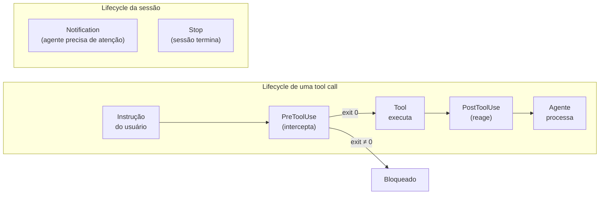
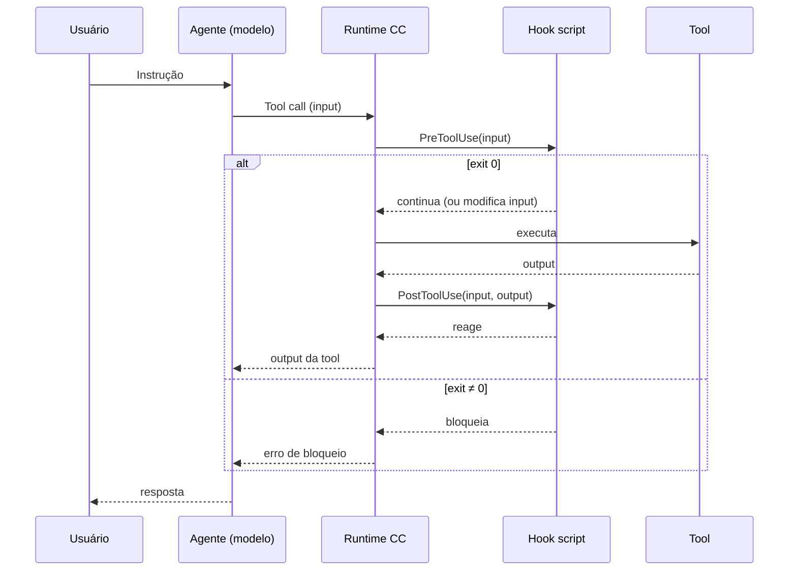

# Sistema de hooks — visão geral do lifecycle

> [!abstract] TL;DR
> Hooks são shell scripts que o Claude Code executa em pontos determinísticos do seu ciclo de operação. Existem 4 tipos: PreToolUse (antes de uma tool call), PostToolUse (depois), Notification (quando o agente precisa de atenção) e Stop (quando a sessão termina). Hooks transformam Claude Code de "agente que pede permissão" em "agente com políticas programáticas".

---

## A analogia: interceptors em um framework web

Se você trabalha com middleware em Express, Axios interceptors, ou Spring Filters, você já conhece o padrão. Um hook é a mesma ideia aplicada ao ciclo de operação do agente: você registra um handler que é chamado antes ou depois de cada ação, pode inspecionar a requisição, pode bloqueá-la, pode modificá-la, pode reagir ao resultado.

A diferença fundamental em relação ao CLAUDE.md: o CLAUDE.md instrui o modelo, que pode interpretar com flexibilidade. O hook é código que executa deterministicamente. Não há negociação. Não há "o agente decidiu ignorar". O hook roda, o exit code é verificado, e o comportamento é determinado mecanicamente.

---

## O que são hooks — definição precisa

Um hook é um shell command configurado em `settings.json` que o Claude Code executa automaticamente em resposta a eventos do seu lifecycle. O agente não decide se executa o hook — o runtime executa sempre que o evento ocorre.

```json
{
  "hooks": {
    "PreToolUse": [
      {
        "matcher": "Bash",
        "hooks": [
          {
            "type": "command",
            "command": "/scripts/validate-bash.sh"
          }
        ]
      }
    ]
  }
}
```

---

## Os 4 tipos de hook



### PreToolUse

Executa **antes** de uma tool call, com acesso ao input que o agente quer usar.

O que pode fazer:
- **Bloquear** a execução (exit code não-zero)
- **Modificar** o input (via stdout JSON)
- **Logar** a intenção para auditoria
- **Solicitar aprovação** humana antes de continuar

Caso de uso principal: guardrails, validação de comandos perigosos, auditoria de segurança.

### PostToolUse

Executa **depois** de uma tool call, independente de sucesso ou falha. Tem acesso ao input original e ao output resultante.

O que pode fazer:
- **Reagir** ao resultado (rodar lint após Edit, notificar após deploy)
- **Logar** output para auditoria
- **Disparar** ações secundárias condicionalmente

Caso de uso principal: automação de qualidade, notificações de ação.

### Notification

Executa quando o Claude Code quer chamar atenção do usuário — tipicamente quando está esperando input em modo não-interativo, ou quando concluiu uma tarefa longa.

Caso de uso: notificações de desktop (`notify-send`), push notifications via ntfy/pushover, log de eventos.

### Stop

Executa quando a sessão termina. Tem acesso ao histórico da sessão.

Caso de uso: limpar temporários, logar a sessão completa, criar resumo do que foi feito, persistir estado para a próxima sessão.

---

## Fluxo completo do lifecycle



---

## Configuração em settings.json

Hooks ficam na chave `"hooks"` do settings.json. A estrutura:

```json
{
  "hooks": {
    "PreToolUse": [
      {
        "matcher": "Bash",
        "hooks": [
          {
            "type": "command",
            "command": "/scripts/validate-bash.sh"
          }
        ]
      },
      {
        "matcher": "Edit",
        "hooks": [
          {
            "type": "command",
            "command": "/scripts/log-edits.sh"
          }
        ]
      }
    ],
    "PostToolUse": [
      {
        "matcher": "Edit",
        "hooks": [
          {
            "type": "command",
            "command": "npm run lint --quiet"
          }
        ]
      }
    ],
    "Notification": [
      {
        "hooks": [
          {
            "type": "command",
            "command": "notify-send 'Claude Code' 'Agente precisa de atenção'"
          }
        ]
      }
    ],
    "Stop": [
      {
        "hooks": [
          {
            "type": "command",
            "command": "/scripts/session-summary.sh"
          }
        ]
      }
    ]
  }
}
```

---

## Matchers — filtragem de tool calls

O campo `"matcher"` filtra quais tool calls ativam o hook.

| Matcher | Ativa para |
|---------|-----------|
| `"Bash"` | Qualquer chamada ao Bash |
| `"Edit"` | Qualquer chamada ao Edit |
| `"Write"` | Qualquer chamada ao Write |
| `"Read"` | Qualquer chamada ao Read |
| `""` (string vazia) | Todas as tool calls |
| `"Bash(rm *)"` | Bash calls cujo argumento começa com `rm` |
| `"Bash(git push *)"` | Bash calls de git push (com qualquer argumento) |

O matching é de prefixo — `"Bash(npm"` cobre `npm test`, `npm run`, `npm install`.

---

## Comunicação hook → runtime

O hook recebe o contexto via variáveis de ambiente ou stdin. Retorna ao runtime via stdout + exit code.

**Para bloquear:**
```bash
#!/bin/bash
echo "BLOQUEADO: motivo aqui"
exit 1
```

**Para continuar normalmente:**
```bash
exit 0
```

**Para retornar estruturado (se o runtime suportar):**
```json
{
  "decision": "block",
  "reason": "Comando rm -rf em diretório protegido"
}
```

O padrão mais simples e robusto é: exit 0 para continuar, exit não-zero para bloquear. Mensagem no stderr aparece no contexto do agente como feedback.

---

## Onde configurar hooks

```
~/.claude/settings.json        → hooks globais (todos os projetos)
.claude/settings.json          → hooks do projeto (time inteiro)
.claude/settings.local.json    → hooks pessoais (só você, não commitado)
```

**Regra prática:**
- Guardrails de segurança (bloqueio de `rm -rf`, auditoria) → global
- Auto-format/lint específico do projeto → projeto
- Notificações pessoais → local (não é do time)

---

## Variáveis de ambiente disponíveis nos hooks

O runtime injeta contexto via variáveis de ambiente para que o script saiba o que está acontecendo:

```bash
# Disponível em PreToolUse e PostToolUse
$CLAUDE_TOOL_NAME      # Nome da tool (Bash, Edit, Write, etc.)
$CLAUDE_TOOL_INPUT     # Input serializado como JSON string
$CLAUDE_SESSION_ID     # ID da sessão atual

# Disponível em PostToolUse
$CLAUDE_TOOL_OUTPUT    # Output da tool (após execução)
$CLAUDE_TOOL_EXIT_CODE # Exit code da tool

# Disponível em Stop
$CLAUDE_SESSION_LOG    # Path para o log da sessão
```

Exemplo de uso em script:

```bash
#!/bin/bash
# PreToolUse hook para logar e validar comandos Bash

TOOL_INPUT="$CLAUDE_TOOL_INPUT"
SESSION="$CLAUDE_SESSION_ID"

# Logar para auditoria
echo "[$(date -Iseconds)] [$SESSION] Bash: $TOOL_INPUT" >> /var/log/claude-audit.log

# Bloquear comandos com sudo
if echo "$TOOL_INPUT" | grep -q "^sudo"; then
    echo "BLOQUEADO: sudo não permitido. Use o usuário atual." >&2
    exit 1
fi

exit 0
```

---

## Casos práticos — setup de hooks para projeto de produção

### Cenário 1 — time de código financeiro (guardrails de segurança)

Um time com código financeiro crítico configurou este set de hooks:

```json
// ~/.claude/settings.json (global — aplica em todos os projetos)
{
  "hooks": {
    "PreToolUse": [
      {
        "matcher": "Bash",
        "hooks": [{
          "type": "command",
          "command": "/home/dev/scripts/claude/audit-bash.sh"
        }]
      }
    ]
  }
}
```

```json
// .claude/settings.json (projeto financeiro)
{
  "hooks": {
    "PreToolUse": [
      {
        "matcher": "Bash(git push*)",
        "hooks": [{
          "type": "command",
          "command": "/scripts/require-pr-approval.sh"
        }]
      },
      {
        "matcher": "Edit",
        "hooks": [{
          "type": "command",
          "command": "/scripts/check-pci-patterns.sh"
        }]
      }
    ],
    "PostToolUse": [
      {
        "matcher": "Edit",
        "hooks": [{
          "type": "command",
          "command": "npm run lint --quiet && npm run type-check"
        }]
      }
    ]
  }
}
```

O hook `check-pci-patterns.sh` verifica se o arquivo editado contém padrões de PAN (Primary Account Number) ou CVV antes de salvar — prevenção automática de dados sensíveis no código.

### Cenário 2 — time de plataforma interna (qualidade + observabilidade assíncrona)

Nem todo hook existe para bloquear alguma coisa. Um time de plataforma que roda sessões longas e não-supervisionadas (o agente trabalha à noite, revisão só de manhã) configurou um set focado em qualidade contínua e visibilidade, não em veto:

```json
// .claude/settings.json (projeto de plataforma interna)
{
  "hooks": {
    "PostToolUse": [
      {
        "matcher": "Edit|Write",
        "hooks": [{
          "type": "command",
          "command": "/scripts/lint-and-typecheck.sh"
        }]
      }
    ],
    "Notification": [
      {
        "hooks": [{
          "type": "command",
          "command": "/scripts/notify-slack.sh"
        }]
      }
    ],
    "Stop": [
      {
        "hooks": [{
          "type": "command",
          "command": "/scripts/session-digest-to-slack.sh"
        }]
      }
    ]
  }
}
```

Aqui o hook `PostToolUse` roda lint e type-check depois de cada `Edit`/`Write` — não bloqueia nada, mas registra falhas para o agente corrigir no próximo turno. O `Notification` avisa o time no Slack sempre que o agente precisa de decisão humana (ex: escolher entre duas migrações de schema conflitantes), e o `Stop` posta um resumo da sessão — o que foi mudado, quais testes rodaram — para quem revisa de manhã não precisar reconstruir o histórico lendo o log inteiro.

A diferença de postura em relação ao Cenário 1 é o ponto: hooks de segurança existem para impedir; hooks de observabilidade existem para informar. Os dois usam a mesma mecânica (PreToolUse/PostToolUse/Notification/Stop), mas a intenção — bloquear vs. avisar — muda completamente o desenho do script.

---

## Hooks vs. allow/deny — quando usar cada um

| Cenário | Use |
|---------|-----|
| Bloquear `git push --force` categoricamente | `deny` em settings.json |
| Bloquear `rm -rf` em diretórios específicos | Hook PreToolUse (lógica condicional) |
| Rodar lint após cada Edit | Hook PostToolUse |
| Pedir aprovação humana antes de deploy | Hook PreToolUse |
| Logar todos os comandos Bash | Hook PreToolUse |
| Notificar quando tarefa longa concluir | Hook Notification |

`deny` é mais simples e direto para bloqueios incondicionais. Hooks são necessários quando a lógica é condicional, ou quando você quer fazer mais do que apenas bloquear.

---

## Armadilhas comuns

Hooks parecem simples até o dia em que um deles trava a sessão inteira, ou passa duas semanas sem rodar sem que ninguém percebesse. Três armadilhas concentram a maior parte dos problemas em produção:

> [!warning] Hook sem timeout
> Um script de hook que trava (loop infinito, chamada de rede que nunca responde, `read` esperando input que nunca vem) bloqueia o agente indefinidamente — não há um "pular depois de N segundos" automático em todo runtime. Se o script faz I/O externo (rede, banco, API), sempre defina timeout explícito dentro do próprio script (`timeout 5 curl ...`) em vez de confiar que o hook "vai ser rápido".

> [!warning] Matcher errado (matching de prefixo, não de substring)
> O matcher casa por **prefixo**, não por substring nem regex completo. `"Bash(git push"` cobre `git push origin main`, mas **não** cobre `cd /repo && git push` — porque o comando não *começa* com `git push`. É comum escrever um matcher achando que ele cobre "qualquer comando que contenha X" e descobrir só em produção que um comando composto (com `&&`, `;`, subshell) passou batido pelo guardrail.

> [!warning] Hook silencioso (falha sem deixar rastro)
> Um hook que falha (script não é executável, path errado, dependência ausente) pode falhar silenciosamente dependendo de como o runtime trata erros do próprio hook — o agente segue em frente sem saber que o guardrail nunca rodou. Teste todo hook novo isoladamente (rode o script à mão com um input de exemplo) antes de confiar nele em produção, e prefira que o script logue sua própria execução (mesmo que só "hook rodou, tudo ok") para que a ausência de log vire o sinal de alarme.

---

## Checklist — sistema de hooks

- [ ] Hooks estão configurados em `settings.json` (não no CLAUDE.md)
- [ ] Scripts de hook são executáveis (`chmod +x`)
- [ ] Scripts testados isoladamente antes de configurar
- [ ] Scripts têm timeout definido (hooks que travam bloqueiam o agente)
- [ ] Guardrails críticos estão no global (`~/.claude/`)
- [ ] Automações de projeto estão em `.claude/settings.json`

---

## Como explicar em inglês

| Português | Inglês |
|-----------|--------|
| Hooks | Hooks / lifecycle hooks |
| Ponto determinístico | Deterministic hook point |
| Interceptor | Interceptor / middleware hook |
| Bloquear execução | Block execution / veto the call |
| Política programática | Programmatic policy |

**Frases úteis:**
- "Hooks are like middleware for the agent's tool calls — they run deterministically before or after each action, regardless of what the model wants to do."
- "Unlike CLAUDE.md instructions (which the model can interpret), hooks are code that either passes or blocks. There's no negotiation."
- "PreToolUse hooks are your enforcement layer — anything that must never happen goes there, not in natural language instructions."

---

## O que vem a seguir

Esta nota mapeou o lifecycle inteiro — os 4 tipos de hook, onde configurar, como o hook se comunica com o runtime. Mas "onde o hook entra" é só metade da história: falta o "o que exatamente ele recebe e o que pode fazer com isso" para cada tipo específico.

O ponto de maior alavancagem prática é o **PreToolUse** — é o único hook que intercepta *antes* da ação acontecer, e por isso é a peça que carrega o peso real dos guardrails de segurança (bloquear `rm -rf`, vetar `sudo`, exigir aprovação para deploy). Entender o payload que ele recebe e as opções de resposta (bloquear, modificar, aprovar) é o próximo passo natural: [[03-Dominios/Tecnologia/IA/Claude Code/Hooks e Guardrails/02 - PreToolUse|02 - PreToolUse]].

---

## Veja também

- [[03-Dominios/Tecnologia/IA/Claude Code/Hooks e Guardrails/02 - PreToolUse|02 - PreToolUse]] — interceptar antes de executar
- [[03-Dominios/Tecnologia/IA/Claude Code/Hooks e Guardrails/03 - PostToolUse|03 - PostToolUse]] — automação pós-ação
- [[03-Dominios/Tecnologia/IA/Claude Code/Hooks e Guardrails/05 - Guardrails|05 - Guardrails]] — bloquear comandos destrutivos
- [[03-Dominios/Tecnologia/IA/Claude Code/Configuração/04 - settings.json|04 - settings.json]] — estrutura completa
- [[03-Dominios/Tecnologia/IA/Claude Code/Hooks e Guardrails/index|Hooks e Guardrails]] — índice do galho

---

## Fontes

- **Anthropic** — *Claude Code hooks* (2026). Documentação oficial do sistema de hooks — https://docs.anthropic.com/pt/docs/claude-code/hooks
- **Anthropic** — *Claude Code security* (2026). Uso de hooks para segurança e auditoria — https://docs.anthropic.com/pt/docs/claude-code/security

> [!tip] Vídeo — Claude Code Hooks na prática
> [I'm HOOKED on Claude Code Hooks: Advanced Agentic Coding](https://www.youtube.com/watch?v=J5B9UGTuNoM) (IndyDevDan) — percorre os hooks PreToolUse/PostToolUse/Notification/Stop com exemplos reais, incluindo um caso onde um hook impede um `rm -rf` de destruir a base de código durante execução paralela de agentes. Bom complemento visual pro fluxo descrito nesta nota.
