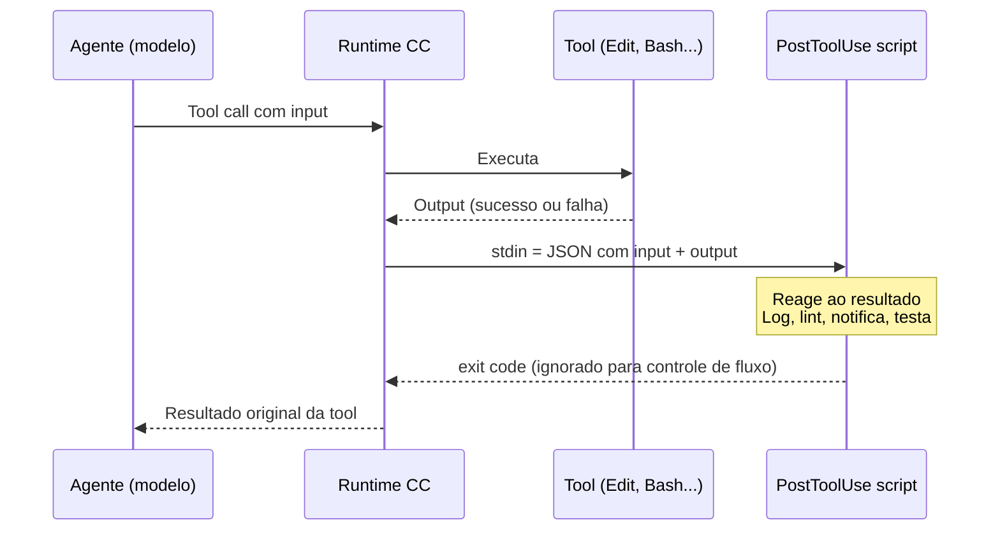
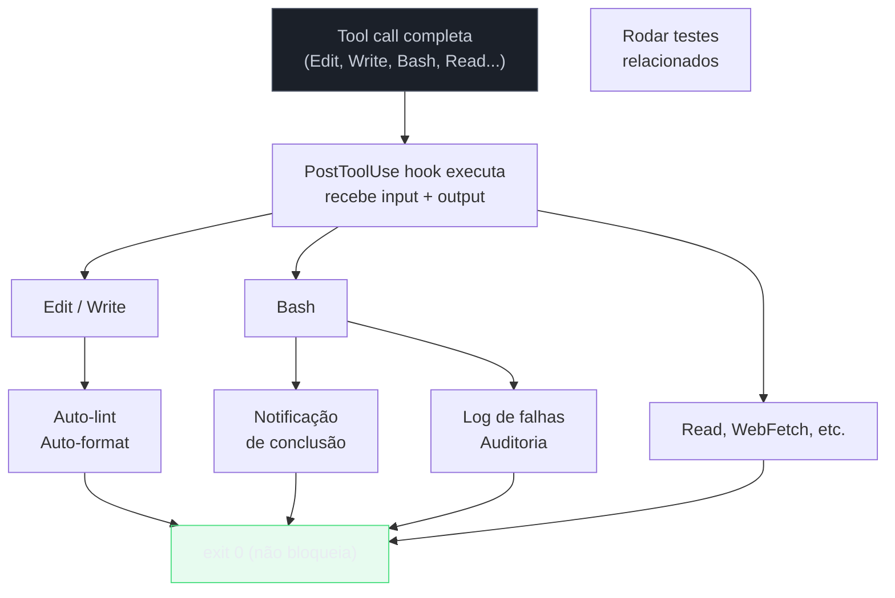

# PostToolUse — automação pós-ação

> [!abstract] TL;DR
> PostToolUse executa depois de qualquer tool call completar — independente de sucesso ou falha. Diferente do PreToolUse (que decide se executa), o PostToolUse reage ao resultado: tem acesso ao input original e ao output gerado. Usos principais: auto-lint depois de edições, notificações, logging de auditoria, disparo condicional de testes. O hook não pode desfazer a ação — só reagir a ela.

---

## A analogia: o evento "onChange" depois do commit

Em frontend, você conhece o padrão de event listeners: `onChange`, `onSubmit`, `onComplete`. Você registra um handler que executa após o evento — não para prevenir, mas para reagir. Se o usuário clicou "salvar", o handler pode sincronizar com o servidor, atualizar o estado local, e disparar uma notificação. O handler não cancela o que já foi salvo.

PostToolUse é exatamente isso. O agente editou um arquivo — o arquivo já foi editado. Não há como voltar atrás. O PostToolUse hook executa e pode: rodar o linter no arquivo novo, logar o que foi alterado, disparar os testes relacionados, notificar que algo aconteceu. É reação, não controle.

Isso cria uma separação de responsabilidades clara: **PreToolUse previne, PostToolUse automatiza**. A prevenção vem antes. A automação vem depois.

---

## O mecanismo exato

Após cada tool call completar (com sucesso ou falha), o runtime:



Pontos críticos do mecanismo:
1. O hook executa **sempre** — independente do exit code da tool
2. O hook tem acesso ao **output completo** da tool (o que o agente não usaria diretamente)
3. O **exit code do hook não bloqueia** a sessão — não é como o PreToolUse
4. O output do hook é logado internamente, mas não é injetado no contexto do agente por padrão

> [!info] PostToolUse não bloqueia
> Um exit code não-zero no PostToolUse não para a sessão. É por design — é um hook de reação. Se você precisa de controle (bloquear, aprovar), use PreToolUse. PostToolUse é para o "e depois disso?"

---

## Estrutura do input recebido pelo hook

O hook recebe via stdin um JSON com o input **e o output** da tool call:

### Edit

```json
{
  "tool_name": "Edit",
  "tool_input": {
    "file_path": "/projeto/src/services/orders.ts",
    "old_string": "function processOrder(id) {",
    "new_string": "async function processOrder(id: string): Promise<Order> {"
  },
  "tool_output": {
    "success": true,
    "message": "File edited successfully"
  }
}
```

### Bash

```json
{
  "tool_name": "Bash",
  "tool_input": {
    "command": "npm test -- --coverage"
  },
  "tool_output": {
    "success": false,
    "output": "FAIL src/services/orders.test.ts\n  ✕ should process valid order\n  Expected: 200\n  Received: 500",
    "exit_code": 1
  }
}
```

### Write

```json
{
  "tool_name": "Write",
  "tool_input": {
    "file_path": "/projeto/src/models/user.ts",
    "content": "export interface User { id: string; email: string; }"
  },
  "tool_output": {
    "success": true
  }
}
```

O campo `tool_output` é o que diferencia PostToolUse do PreToolUse — você sabe o que de fato aconteceu, não apenas o que o agente pretendia fazer.

---

## Variáveis de ambiente disponíveis

Além do stdin, o runtime injeta:

```bash
$CLAUDE_TOOL_NAME       # Nome da tool: "Bash", "Edit", "Write", etc.
$CLAUDE_TOOL_INPUT      # Input serializado como JSON string
$CLAUDE_TOOL_OUTPUT     # Output serializado como JSON string
$CLAUDE_TOOL_EXIT_CODE  # Exit code da tool (para Bash)
$CLAUDE_SESSION_ID      # ID único da sessão atual
```

Exemplo de uso direto via variável:

```bash
#!/bin/bash
# Verificação rápida via variável de ambiente
if [[ "$CLAUDE_TOOL_EXIT_CODE" != "0" && "$CLAUDE_TOOL_NAME" == "Bash" ]]; then
  COMMAND=$(echo "$CLAUDE_TOOL_INPUT" | jq -r '.command // ""')
  echo "$(date -Iseconds) | FALHA | $COMMAND" >> ~/.claude/failures.log
fi
exit 0
```

---

## Casos práticos

> [!tip] Assista: Hooks in Claude Code
> **Canal:** Claude (Anthropic) | **Duração:** ~3min | **Idioma:** EN
>
> Vídeo oficial curto que resume por que hooks são determinísticos (rodam sempre, ao contrário de instruções em CLAUDE.md) e usa o auto-format via PostToolUse como o exemplo central — exatamente o Caso de uso 1 abaixo. Trecho de destaque [1:24]: *"The most common hook. Auto formatting after edits. You set a post-tool-use hook with a matcher of edit or multi-edit... it fires whenever Claude modifies a file."*
>
> 🎬 [Assistir no YouTube](https://www.youtube.com/watch?v=IkaPHiMDazM)

### Caso de uso 1 — Auto-lint depois de edições

O mais comum: garantir que o código editado pelo agente sempre passe no linter.

```bash
#!/bin/bash
# hooks/auto-lint.sh

INPUT=$(cat)
TOOL=$(echo "$INPUT" | jq -r '.tool_name')
FILE=$(echo "$INPUT" | jq -r '.tool_input.file_path // ""')
SUCCESS=$(echo "$INPUT" | jq -r '.tool_output.success // false')

# Só para edições bem-sucedidas de arquivos TS/JS
if [[ "$TOOL" != "Edit" && "$TOOL" != "Write" ]]; then exit 0; fi
if [[ "$SUCCESS" != "true" ]]; then exit 0; fi
if [[ ! "$FILE" =~ \.(ts|tsx|js|jsx)$ ]]; then exit 0; fi

# Lint com auto-fix no arquivo modificado
npx eslint "$FILE" --fix --quiet 2>/dev/null

exit 0
```

Configuração para ativar em Edit e Write:

```json
{
  "hooks": {
    "PostToolUse": [
      {
        "matcher": "Edit",
        "hooks": [{ "type": "command", "command": "~/.claude/hooks/auto-lint.sh" }]
      },
      {
        "matcher": "Write",
        "hooks": [{ "type": "command", "command": "~/.claude/hooks/auto-lint.sh" }]
      }
    ]
  }
}
```

Por que isso importa: o agente pode editar arquivos em rápida sucessão sem rodar lint entre elas. Ao final, você recebe código que já passou no linter — não precisa rodar `npm run lint` no final da sessão.

Esse mesmo princípio — reagir automaticamente ao resultado de uma ação, sem intervenção manual — é o que sustenta pipelines de CI/CD: veja [[03-Dominios/Tecnologia/IA/Claude Code/Time e Automação/02 - CI-CD com GitHub Actions|02 - CI-CD com GitHub Actions]] para o mesmo padrão aplicado no nível de pipeline, em vez de tool call individual.

---

### Caso de uso 2 — Auto-format (Prettier)

Similar ao lint, mas sem semântica de erro — só formatação consistente:

```bash
#!/bin/bash
# hooks/auto-format.sh

INPUT=$(cat)
FILE=$(echo "$INPUT" | jq -r '.tool_input.file_path // ""')

FORMATTABLE_EXTENSIONS=("ts" "tsx" "js" "jsx" "json" "css" "md" "yaml" "yml")
EXTENSION="${FILE##*.}"

for ext in "${FORMATTABLE_EXTENSIONS[@]}"; do
  if [[ "$EXTENSION" == "$ext" ]]; then
    npx prettier --write "$FILE" --log-level silent 2>/dev/null
    break
  fi
done

exit 0
```

> [!tip] Combinar lint + format
> Configure os dois em sequência no mesmo matcher. O format normaliza o estilo, o lint captura problemas semânticos:
> ```json
> "hooks": [
>   { "type": "command", "command": "~/.claude/hooks/auto-format.sh" },
>   { "type": "command", "command": "~/.claude/hooks/auto-lint.sh" }
> ]
> ```

---

### Caso de uso 3 — Logging de auditoria pós-ação

Enquanto o PreToolUse loga intenções, o PostToolUse loga o que de fato aconteceu (incluindo se falhou):

```bash
#!/bin/bash
# hooks/audit-post.sh

INPUT=$(cat)
TOOL=$(echo "$INPUT" | jq -r '.tool_name')
FILE=$(echo "$INPUT" | jq -r '.tool_input.file_path // ""')
COMMAND=$(echo "$INPUT" | jq -r '.tool_input.command // ""')
SUCCESS=$(echo "$INPUT" | jq -r '.tool_output.success // true')
TIMESTAMP=$(date -u +"%Y-%m-%dT%H:%M:%SZ")
SESSION="${CLAUDE_SESSION_ID:-unknown}"

SUBJECT="$FILE"
[[ -z "$SUBJECT" ]] && SUBJECT="$COMMAND"

STATUS="OK"
[[ "$SUCCESS" != "true" ]] && STATUS="FAIL"

echo "$TIMESTAMP | $SESSION | $TOOL | $STATUS | $SUBJECT" >> ~/.claude/audit-post.log

exit 0
```

A diferença crucial: o PostToolUse tem o campo `success` e `output` — você sabe se o agente conseguiu fazer o que queria ou se falhou. Útil para detectar padrões de falha sistemática.

---

### Caso de uso 4 — Notificações de tarefas longas

Quando o agente roda `npm test` ou `cargo build`, você pode estar em outra janela. O PostToolUse notifica quando concluir:

```bash
#!/bin/bash
# hooks/notify-on-long-command.sh

INPUT=$(cat)
TOOL=$(echo "$INPUT" | jq -r '.tool_name')
COMMAND=$(echo "$INPUT" | jq -r '.tool_input.command // ""')
SUCCESS=$(echo "$INPUT" | jq -r '.tool_output.success // true')

if [[ "$TOOL" != "Bash" ]]; then exit 0; fi

LONG_COMMAND_PATTERNS=(
  "npm test"
  "npm run build"
  "npm run lint"
  "pytest"
  "cargo build"
  "cargo test"
  "mvn test"
  "./gradlew build"
)

for pattern in "${LONG_COMMAND_PATTERNS[@]}"; do
  if echo "$COMMAND" | grep -q "^$pattern"; then
    STATUS_ICON="✅"
    [[ "$SUCCESS" != "true" ]] && STATUS_ICON="❌"

    # Linux (notify-send)
    notify-send "Claude Code" "$STATUS_ICON Concluído: $pattern" 2>/dev/null

    # macOS fallback
    osascript -e "display notification \"$STATUS_ICON Concluído: $pattern\" with title \"Claude Code\"" 2>/dev/null

    # ntfy.sh fallback (push universal)
    curl -s -d "$STATUS_ICON $COMMAND" ntfy.sh/claude-notifications 2>/dev/null

    break
  fi
done

exit 0
```

---

### Caso de uso 5 — Disparar testes automaticamente

Quando o agente edita código de implementação, rodar os testes relacionados imediatamente:

```bash
#!/bin/bash
# hooks/auto-run-related-tests.sh

INPUT=$(cat)
TOOL=$(echo "$INPUT" | jq -r '.tool_name')
FILE=$(echo "$INPUT" | jq -r '.tool_input.file_path // ""')
SUCCESS=$(echo "$INPUT" | jq -r '.tool_output.success // false')

if [[ "$TOOL" != "Edit" ]] || [[ "$SUCCESS" != "true" ]]; then exit 0; fi

# Só para arquivos de implementação (não para testes ou config)
if [[ ! "$FILE" =~ src/.+\.(ts|js)$ ]]; then exit 0; fi

# Derivar o arquivo de teste correspondente
TEST_FILE=$(echo "$FILE" | sed 's|src/|tests/|' | sed 's|\.\(ts\|js\)$|.test.\1|')

if [[ -f "$TEST_FILE" ]]; then
  echo "Rodando testes para $FILE..."
  npx jest "$TEST_FILE" --no-coverage --silent 2>&1 | tail -10
fi

exit 0
```

> [!warning] Cuidado com performance
> Rodar testes em cada Edit pode tornar sessões lentas. Avalie: use apenas em `src/services/*` ou outros diretórios críticos, não em todos os arquivos `src/**`.

---

### Caso de uso 6 — Logging de comandos que falharam

Para debugging de sessões longas — saber quais comandos o agente tentou e que falharam:

```bash
#!/bin/bash
# hooks/log-failures.sh

INPUT=$(cat)
TOOL=$(echo "$INPUT" | jq -r '.tool_name')
SUCCESS=$(echo "$INPUT" | jq -r '.tool_output.success // true')

if [[ "$SUCCESS" == "true" ]]; then exit 0; fi

COMMAND=$(echo "$INPUT" | jq -r '.tool_input.command // .tool_input.file_path // "(sem argumento)"')
OUTPUT=$(echo "$INPUT" | jq -r '.tool_output.output // ""')
TIMESTAMP=$(date -u +"%Y-%m-%dT%H:%M:%SZ")

{
  echo "=== $TIMESTAMP | $TOOL ==="
  echo "COMANDO: $COMMAND"
  echo "OUTPUT:"
  echo "$OUTPUT" | head -20
  echo ""
} >> ~/.claude/failures.log

exit 0
```

---

### Caso de uso 7 — Verificação de cobertura de testes

Após o agente criar um arquivo novo, verificar se existe teste correspondente:

```bash
#!/bin/bash
# hooks/check-test-coverage.sh

INPUT=$(cat)
TOOL=$(echo "$INPUT" | jq -r '.tool_name')
FILE=$(echo "$INPUT" | jq -r '.tool_input.file_path // ""')

if [[ "$TOOL" != "Write" ]]; then exit 0; fi

# Só para arquivos de implementação
if [[ ! "$FILE" =~ src/.+\.(ts|js)$ ]]; then exit 0; fi

TEST_FILE=$(echo "$FILE" | sed 's|src/|tests/|' | sed 's|\.\(ts\|js\)$|.test.\1|')

if [[ ! -f "$TEST_FILE" ]]; then
  # Logar arquivos sem teste (não bloqueia — o agente decide se cria o teste)
  echo "$(date -Iseconds) | SEM TESTE | $FILE (esperado: $TEST_FILE)" >> ~/.claude/missing-tests.log
fi

exit 0
```

---

## Diagrama — PostToolUse por tipo de ação



---

## PreToolUse vs. PostToolUse — quando usar cada um

| Pergunta | Use |
|----------|-----|
| Devo deixar o agente fazer isso? | PreToolUse |
| Quero reagir ao que o agente fez | PostToolUse |
| Quero bloquear uma ação perigosa | PreToolUse |
| Quero rodar lint no arquivo editado | PostToolUse |
| Quero aprovação humana antes de um deploy | PreToolUse |
| Quero notificação quando o deploy concluir | PostToolUse |
| Quero logar intenções (o que o agente tentou) | PreToolUse |
| Quero logar resultados (o que de fato aconteceu) | PostToolUse |
| Quero modificar o input antes de executar | PreToolUse |
| Quero reagir ao output para tomar ação secundária | PostToolUse |

Os dois hooks se complementam: PreToolUse é a política, PostToolUse é a automação. Um projeto bem configurado usa os dois em camadas.

---

## Armadilhas

> [!warning] Hook pesado em PostToolUse
> O hook executa a cada tool call. Um hook que demora 3 segundos em cada Edit vai tornar a sessão muito mais lenta — se o agente fizer 20 edições, você perde 1 minuto só em hooks. Mantenha PostToolUse leve: lint rápido (`--quiet`), log simples, verificações de existência de arquivo.

> [!warning] Tentar desfazer a ação
> PostToolUse não pode reverter o que a tool fez. O arquivo já foi editado, o comando já executou. Se você precisa prevenir, use PreToolUse. PostToolUse é para o que acontece depois de.

> [!warning] Depender do exit code para controle
> O exit code do PostToolUse não bloqueia a sessão — é ignorado pelo runtime para controle de fluxo. Se você colocar `exit 1` em um PostToolUse e esperar que o agente pare, não vai acontecer.

> [!warning] Loops de edição
> Se o PostToolUse edita o arquivo (ex: Prettier reescrevendo), isso pode disparar novamente o PostToolUse recursivamente. Não é um problema na prática (o hook vê o mesmo arquivo e não produz mais mudanças), mas vale ter ciência.

> [!warning] Assumir que `success` reflete o resultado real
> O campo `success` em `tool_output` pode não ser granular o suficiente para todos os casos. Para Bash, cheque `exit_code` também: um processo pode terminar com `success: false` mas ter um output parcialmente útil.

---

## Checklist — PostToolUse

- [ ] Scripts são executáveis: `chmod +x hooks/*.sh`
- [ ] Scripts têm guardas de ferramenta (`if [[ "$TOOL" != "Edit" ]]; then exit 0; fi`)
- [ ] Scripts têm guardas de extensão para lint/format (não rodar lint em arquivos `.md`)
- [ ] Scripts têm guardas de sucesso (não rodar testes em edições que falharam)
- [ ] Hooks são rápidos — nada que demora mais de 1-2s por tool call
- [ ] Logging redireciona para arquivo, não para stdout/stderr do hook
- [ ] Testados isoladamente com JSON de exemplo antes de configurar

---

## Como explicar em inglês

| Português | Inglês |
|-----------|--------|
| Hook de pós-execução | PostToolUse hook |
| Reagir ao resultado | React to the result |
| Auditoria pós-ação | Post-action audit |
| Disparar ação secundária | Trigger a secondary action |
| Independente de sucesso ou falha | Regardless of success or failure |

**Frases úteis:**
- "PostToolUse hooks fire after every tool call completes — whether it succeeded or failed. They receive both the original input and the resulting output."
- "Unlike PreToolUse, PostToolUse can't block or modify execution — the action already happened. Its job is to react: lint the edited file, log the result, send a notification, trigger tests."
- "Think of PreToolUse as policy enforcement, PostToolUse as workflow automation. They're complementary: one prevents, the other automates."

---

## O que vem a seguir

PostToolUse fecha o ciclo de reação por tool call: o agente age, o hook reage — lint, log, notificação, teste. Mas e quando a sessão inteira termina? Nenhum dos hooks vistos até aqui olha para o quadro completo: quantos arquivos foram tocados, quantos tokens foram gastos, o que vale registrar como sumário. Esse é o papel do último hook do ciclo de vida: o [[03-Dominios/Tecnologia/IA/Claude Code/Hooks e Guardrails/04 - Stop hook|04 - Stop hook]], que executa uma única vez, no encerramento da sessão, para notificar, sumarizar e limpar.

---

## Veja também

- [[03-Dominios/Tecnologia/IA/Claude Code/Hooks e Guardrails/01 - Sistema de hooks|01 - Sistema de hooks]] — lifecycle completo e configuração
- [[03-Dominios/Tecnologia/IA/Claude Code/Hooks e Guardrails/02 - PreToolUse|02 - PreToolUse]] — controle antes de executar
- [[03-Dominios/Tecnologia/IA/Claude Code/Hooks e Guardrails/04 - Stop hook|04 - Stop hook]] — ações no encerramento da sessão
- [[03-Dominios/Tecnologia/IA/Claude Code/Hooks e Guardrails/08 - Testando hooks|08 - Testando hooks]] — debugging de hooks
- [[03-Dominios/Tecnologia/IA/Claude Code/Hooks e Guardrails/index|Hooks e Guardrails]] — índice do galho

---

## Fontes

- **Anthropic** — *Claude Code hooks* (2026). Documentação oficial do PostToolUse, input/output e variáveis de ambiente — https://docs.anthropic.com/pt/docs/claude-code/hooks
- **Anthropic** — *Claude Code best practices* (2026). Padrões de hooks para automação de qualidade — https://www.anthropic.com/engineering/claude-code-best-practices
