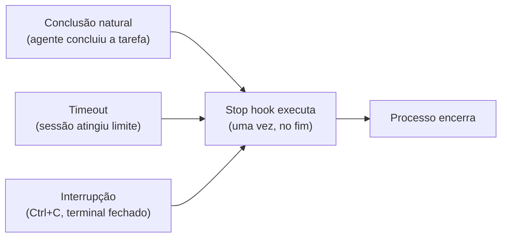

# Stop hook — notificação, logging, cleanup

> [!abstract] TL;DR
> O Stop hook executa quando a sessão do Claude Code termina — por conclusão natural, por timeout, ou por interrupção. É o hook de encerramento: notifica que o trabalho foi concluído, cria sumário da sessão, faz cleanup de temporários, registra métricas. Tem acesso ao log completo da sessão via `$CLAUDE_SESSION_LOG`. Não bloqueia o encerramento — é o último passo antes do processo morrer.

---

## A analogia: o script de deploy que roda no "finalize"

Em pipelines de CI/CD (GitHub Actions, Jenkins, GitLab CI), você conhece o bloco `finally` ou o step `always` — o passo que executa independente de sucesso ou falha, no fim de tudo. Ele limpa o workspace, notifica o Slack, publica as métricas, cria o artefato de relatório.

O Stop hook é isso para uma sessão do Claude Code. O agente terminou (ou foi interrompido). O processo está encerrando. O Stop hook executa: você notifica, loga, limpa, registra. Depois, silêncio.

A diferença do PostToolUse: PostToolUse roda depois de cada ação individual. Stop roda uma vez, no fim da sessão inteira. É o lugar para ações que dependem do quadro completo — "o que essa sessão produziu?", "quantos tokens foram consumidos?", "quais arquivos foram tocados?"

---

## Quando o Stop hook executa

O Stop hook dispara em 3 situações:



1. **`end_turn`**: o agente terminou a tarefa e está aguardando próximo input — a forma mais comum
2. **`max_turns`**: sessão atingiu o limite de turns configurado
3. **`interrupt`**: usuário pressionou Ctrl+C, fechou o terminal, ou o processo foi morto

O campo `stop_reason` no input distingue os três casos — você pode tomar decisões diferentes dependendo do motivo.

---

## Estrutura do input recebido

O Stop hook não recebe input de tool call. Recebe um JSON com metadados da sessão encerrada:

```json
{
  "session_id": "abc123-def456",
  "stop_reason": "end_turn",
  "total_turns": 47,
  "total_tokens": 125000
}
```

Campos disponíveis:

| Campo | Tipo | Descrição |
|-------|------|-----------|
| `session_id` | string | ID único da sessão |
| `stop_reason` | string | `"end_turn"`, `"max_turns"`, `"stop_sequence"`, `"interrupt"` |
| `total_turns` | number | Número total de turns na sessão |
| `total_tokens` | number | Total de tokens consumidos |

---

## Variáveis de ambiente disponíveis

```bash
$CLAUDE_SESSION_ID    # ID da sessão encerrada
$CLAUDE_SESSION_LOG   # Caminho para o arquivo de log completo da sessão
```

O `$CLAUDE_SESSION_LOG` é o mais valioso: é um arquivo JSON com o histórico completo de todas as tool calls da sessão. Você pode processar esse log para criar sumários, detectar padrões, ou auditoria forense.

> [!tip] Vídeo — observabilidade de sessões via hooks
> [I Can SEE EVERYTHING: Claude Code Hooks for Multi Agent Observability](https://www.youtube.com/watch?v=9ijnN985O_c) (IndyDevDan) mostra na prática o problema que motiva boa parte deste galho: quando você tem mais de um agente Claude Code rodando, monitorar cada sessão manualmente não escala. O vídeo constrói um painel de observabilidade que captura eventos de hooks (incluindo Stop) em tempo real — a mesma ideia dos Casos de uso 3 e 4 acima, levada a múltiplos agentes simultâneos.

```bash
#!/bin/bash
# Ler o log da sessão
if [[ -f "$CLAUDE_SESSION_LOG" ]]; then
  TOTAL_EDITS=$(jq '[.[] | select(.tool_name == "Edit")] | length' "$CLAUDE_SESSION_LOG")
  TOTAL_BASH=$(jq '[.[] | select(.tool_name == "Bash")] | length' "$CLAUDE_SESSION_LOG")
  echo "Sessão: $TOTAL_EDITS edições, $TOTAL_BASH comandos Bash"
fi
```

---

## Casos práticos

Seis scripts prontos pra copiar, do mais simples (notificação) ao mais elaborado (artefato de CI). Cada um resolve um problema concreto do "e agora, o que eu faço quando a sessão acaba?".

### Caso de uso 1 — Notificação de desktop

O mais simples e imediatamente útil: avisar quando o Claude terminou enquanto você está em outra janela.

```bash
#!/bin/bash
# hooks/notify-stop.sh

INPUT=$(cat)
REASON=$(echo "$INPUT" | jq -r '.stop_reason // "unknown"')
TURNS=$(echo "$INPUT" | jq -r '.total_turns // 0')
TOKENS=$(echo "$INPUT" | jq -r '.total_tokens // 0')

ICON="✅"
[[ "$REASON" == "interrupt" ]] && ICON="⚠️"
[[ "$REASON" == "max_turns" ]] && ICON="⏱️"

MESSAGE="$ICON $TURNS turns | $TOKENS tokens | $REASON"

# Linux (libnotify)
notify-send "Claude Code" "$MESSAGE" --urgency=normal 2>/dev/null

# macOS
osascript -e "display notification \"$MESSAGE\" with title \"Claude Code\"" 2>/dev/null
afplay /System/Library/Sounds/Glass.aiff 2>/dev/null

# ntfy.sh (push universal — funciona em mobile se configurado)
curl -s -d "$MESSAGE" ntfy.sh/claude-stop 2>/dev/null

exit 0
```

---

### Caso de uso 2 — Sumário de sessão

Criar um log legível com o que a sessão produziu:

```bash
#!/bin/bash
# hooks/session-summary.sh

INPUT=$(cat)
SESSION_ID=$(echo "$INPUT" | jq -r '.session_id // "unknown"')
TURNS=$(echo "$INPUT" | jq -r '.total_turns // 0')
TOKENS=$(echo "$INPUT" | jq -r '.total_tokens // 0')
REASON=$(echo "$INPUT" | jq -r '.stop_reason // "unknown"')
TIMESTAMP=$(date -u +"%Y-%m-%dT%H:%M:%SZ")

# Arquivos modificados nesta sessão (via git)
MODIFIED_FILES=$(git diff --name-only HEAD 2>/dev/null | head -30)
STAGED_FILES=$(git diff --staged --name-only 2>/dev/null | head -10)

{
  echo "=== Claude Code | $TIMESTAMP ==="
  echo "Session: $SESSION_ID"
  echo "Stop: $REASON | Turns: $TURNS | Tokens: $TOKENS"
  echo ""

  if [[ -n "$STAGED_FILES" ]]; then
    echo "Staged para commit:"
    echo "$STAGED_FILES" | sed 's/^/  /'
    echo ""
  fi

  if [[ -n "$MODIFIED_FILES" ]]; then
    echo "Arquivos modificados (não staged):"
    echo "$MODIFIED_FILES" | sed 's/^/  /'
    echo ""
  fi

  echo "---"
  echo ""
} >> ~/.claude/sessions.log

exit 0
```

---

### Caso de uso 3 — Análise do session log

O `$CLAUDE_SESSION_LOG` contém o histórico completo — você pode extrair estatísticas:

```bash
#!/bin/bash
# hooks/analyze-session.sh

INPUT=$(cat)
SESSION_ID=$(echo "$INPUT" | jq -r '.session_id // "unknown"')
TIMESTAMP=$(date -u +"%Y-%m-%dT%H:%M:%SZ")

if [[ ! -f "$CLAUDE_SESSION_LOG" ]]; then
  exit 0
fi

# Contar ações por tipo
EDITS=$(jq '[.[] | select(.tool_name == "Edit")] | length' "$CLAUDE_SESSION_LOG" 2>/dev/null || echo 0)
WRITES=$(jq '[.[] | select(.tool_name == "Write")] | length' "$CLAUDE_SESSION_LOG" 2>/dev/null || echo 0)
BASH_CALLS=$(jq '[.[] | select(.tool_name == "Bash")] | length' "$CLAUDE_SESSION_LOG" 2>/dev/null || echo 0)
READS=$(jq '[.[] | select(.tool_name == "Read")] | length' "$CLAUDE_SESSION_LOG" 2>/dev/null || echo 0)

# Comandos Bash mais usados
TOP_COMMANDS=$(jq -r '[.[] | select(.tool_name == "Bash") | .tool_input.command] | group_by(.) | map({cmd: .[0], count: length}) | sort_by(-.count) | .[0:5] | .[] | "\(.count)x \(.cmd)"' "$CLAUDE_SESSION_LOG" 2>/dev/null | head -5)

{
  echo "=== Análise de sessão: $TIMESTAMP ==="
  echo "Session: $SESSION_ID"
  echo "Ações: $EDITS edições | $WRITES escritas | $BASH_CALLS bash | $READS leituras"
  if [[ -n "$TOP_COMMANDS" ]]; then
    echo "Top comandos:"
    echo "$TOP_COMMANDS" | sed 's/^/  /'
  fi
  echo ""
} >> ~/.claude/session-analytics.log

exit 0
```

---

### Caso de uso 4 — Métricas de uso por projeto

Para times que querem rastrear consumo de tokens por desenvolvedor/projeto:

```bash
#!/bin/bash
# hooks/track-usage.sh

INPUT=$(cat)
SESSION_ID=$(echo "$INPUT" | jq -r '.session_id')
TOKENS=$(echo "$INPUT" | jq -r '.total_tokens // 0')
TURNS=$(echo "$INPUT" | jq -r '.total_turns // 0')
REASON=$(echo "$INPUT" | jq -r '.stop_reason // "unknown"')
TIMESTAMP=$(date -u +"%Y-%m-%dT%H:%M:%SZ")
PROJECT=$(basename "$(pwd)")
USER=$(whoami)

# Arquivo CSV de métricas — pode ser importado em planilha ou dashboard
METRICS_FILE=~/.claude/usage-metrics.csv

# Criar cabeçalho se não existir
if [[ ! -f "$METRICS_FILE" ]]; then
  echo "timestamp,user,project,session_id,tokens,turns,stop_reason" > "$METRICS_FILE"
fi

echo "$TIMESTAMP,$USER,$PROJECT,$SESSION_ID,$TOKENS,$TURNS,$REASON" >> "$METRICS_FILE"

exit 0
```

O CSV pode ser analisado com qualquer ferramenta: `pandas`, Google Sheets, ou um dashboard simples em Python.

---

### Caso de uso 5 — Cleanup de arquivos temporários

Se o agente cria arquivos de debugging durante a sessão, limpá-los ao encerrar:

```bash
#!/bin/bash
# hooks/cleanup-temp.sh

INPUT=$(cat)
REASON=$(echo "$INPUT" | jq -r '.stop_reason // "unknown"')

# Só faz cleanup em conclusão natural (não em interrupt — pode ter trabalho em andamento)
if [[ "$REASON" != "end_turn" ]]; then
  exit 0
fi

# Remover arquivos de debug temporários comuns
find . -maxdepth 3 -name "*.debug.log" -newer ~/.claude/last-session 2>/dev/null | xargs rm -f 2>/dev/null
find . -maxdepth 3 -name "debug-*.json" -newer ~/.claude/last-session 2>/dev/null | xargs rm -f 2>/dev/null
find . -maxdepth 3 -name "test-output-*.txt" -newer ~/.claude/last-session 2>/dev/null | xargs rm -f 2>/dev/null

# Marcar fim de sessão para referência futura
touch ~/.claude/last-session

exit 0
```

---

### Caso de uso 6 — Relatório para CI/CD

Em pipelines headless, o Stop hook pode criar artefatos de saída para o sistema de CI:

```bash
#!/bin/bash
# hooks/ci-report.sh

INPUT=$(cat)
REASON=$(echo "$INPUT" | jq -r '.stop_reason')
TOKENS=$(echo "$INPUT" | jq -r '.total_tokens // 0')
TURNS=$(echo "$INPUT" | jq -r '.total_turns // 0')
SESSION=$(echo "$INPUT" | jq -r '.session_id // "unknown"')

COMPLETED="false"
[[ "$REASON" == "end_turn" ]] && COMPLETED="true"

# Criar artefato JSON para o sistema de CI
cat > "${CI_ARTIFACTS_DIR:-/tmp}/claude-report.json" <<EOF
{
  "session_id": "$SESSION",
  "completed": $COMPLETED,
  "stop_reason": "$REASON",
  "tokens_used": $TOKENS,
  "turns": $TURNS,
  "timestamp": "$(date -u +"%Y-%m-%dT%H:%M:%SZ")"
}
EOF

# Notificar Slack ou webhook se configurado
if [[ -n "$SLACK_WEBHOOK_URL" ]] && [[ "$COMPLETED" == "false" ]]; then
  curl -s -X POST "$SLACK_WEBHOOK_URL" \
    -H 'Content-type: application/json' \
    -d "{\"text\": \"Claude Code pipeline encerrou inesperadamente: $REASON (sessão $SESSION)\"}" \
    2>/dev/null
fi

exit 0
```

---

## Stop hook vs. Notification hook

Existe um quarto tipo de hook, o `Notification`, que pode parecer parecido com Stop — mas são diferentes:

| Aspecto | Stop hook | Notification hook |
|---------|-----------|-------------------|
| Quando executa | Sessão encerra | Agente precisa de atenção do usuário |
| Frequência | Uma vez, ao final | Múltiplas vezes durante a sessão |
| Trigger | Fim da sessão | Agente esperando input, tarefa longa |
| Uso típico | Log, métricas, cleanup, artefatos | Alertas de status, "estou esperando" |
| Acesso ao session log | Sim (`$CLAUDE_SESSION_LOG`) | Não |

Use Stop para: resumo final, métricas de sessão, cleanup. Use Notification para: "me avisa quando o agente precisar de mim".

---

## Stop hook em modo headless

Em pipelines CI/CD com `claude --print`, o Stop hook é especialmente valioso porque o operador não está monitorando a sessão em tempo real. Quando o processo encerra — com sucesso ou falha — o Stop hook é a última chance de:

- **Criar artefatos** para o próximo step do pipeline (`/tmp/claude-report.json`)
- **Notificar sistemas externos** (Slack, webhook, email) sobre o resultado
- **Registrar métricas** de consumo (tokens, turns) para cobrança interna
- **Sinalizar falha** para o CI (`exit 1` se `stop_reason != "end_turn"`)

```bash
#!/bin/bash
# hooks/headless-finalize.sh

INPUT=$(cat)
REASON=$(echo "$INPUT" | jq -r '.stop_reason')
TOKENS=$(echo "$INPUT" | jq -r '.total_tokens // 0')

# Em headless, sinalize falha se sessão não concluiu normalmente
if [[ "$REASON" != "end_turn" ]]; then
  echo "Sessão não concluiu normalmente: $REASON" >&2
  exit 1
fi

exit 0
```

---

## Checklist — Stop hook

- [ ] Script é executável: `chmod +x hooks/notify-stop.sh`
- [ ] Verificação de `stop_reason` antes de ações destrutivas (ver Armadilhas comuns)
- [ ] Logs redirecionados para arquivo (não stdout)
- [ ] Uso de `$CLAUDE_SESSION_LOG` verificado antes de processar (ver Armadilhas comuns)
- [ ] Testado com JSON de exemplo: `echo '{"session_id":"test","stop_reason":"end_turn","total_turns":5,"total_tokens":1000}' | ./notify-stop.sh`
- [ ] Auto-commit (se configurado) só em `end_turn` (ver Armadilhas comuns)

---

## Armadilhas comuns

O checklist acima aponta os pontos de atenção; aqui está o porquê de cada um — os três jeitos mais comuns de um Stop hook causar dano em vez de só informar.

> [!warning] Cleanup destrutivo disparado em `interrupt`
> Se o script de limpeza (Caso de uso 5) não checa `stop_reason` antes de rodar `rm -f`, ele apaga arquivos temporários mesmo quando a sessão foi interrompida por Ctrl+C — exatamente o momento em que o usuário pode querer investigar o que ficou pela metade. A regra é sempre: cleanup destrutivo só em `end_turn`; em `interrupt` ou `max_turns`, no máximo logar, nunca apagar.

> [!warning] Processar `$CLAUDE_SESSION_LOG` sem checar se ele existe
> Nem toda invocação do Stop hook garante que o arquivo de log já foi flushado no disco — rodar `jq` direto contra um caminho ausente derruba o script com erro e pode interromper o resto do hook (notificação, métricas) que viria depois. Por isso os scripts de exemplo (Casos de uso 3, 4) sempre abrem com `if [[ -f "$CLAUDE_SESSION_LOG" ]]; then ... fi` — sem essa guarda, um `set -e` no topo do script derruba o hook inteiro por um log ausente.

> [!warning] Auto-commit rodando fora de `end_turn`
> Um Stop hook que faz `git add -A && git commit` sem checar `stop_reason` comita o estado da sessão mesmo quando ela foi interrompida no meio de uma edição — arriscando gravar um commit com código quebrado ou incompleto. Trate auto-commit como uma ação de "sessão bem-sucedida": só dispare quando `stop_reason == "end_turn"`, do contrário prefira deixar o `git status` sujo para o usuário decidir.

---

## Como explicar em inglês

| Português | Inglês |
|-----------|--------|
| Hook de encerramento | Stop hook / session-end hook |
| Conclusão natural | Natural completion / end turn |
| Interrupção | Interrupt / forced stop |
| Log da sessão | Session log / session transcript |
| Sumário de sessão | Session summary |
| Artefato de CI | CI artifact / pipeline artifact |

**Frases úteis:**
- "The Stop hook fires once when the session ends — whether from natural completion, timeout, or user interrupt. It has access to the full session log via $CLAUDE_SESSION_LOG."
- "Use Stop for session-level actions: notify, summarize, clean up, record metrics. Use PostToolUse for per-action reactions — they're complementary."
- "In CI/CD pipelines, the Stop hook is where you produce the output artifact that the next pipeline step reads — it runs regardless of how the session terminated."

---

## O que vem a seguir

Você já sabe quando o Stop hook dispara, o que ele recebe e os seis scripts de referência pra notificar, sumarizar, limpar e reportar. Falta uma pergunta prática: como ter certeza de que o script vai se comportar como esperado antes de confiar nele numa sessão de verdade — especialmente nos três casos de `interrupt` descritos nas Armadilhas comuns acima, que são justamente os mais difíceis de reproduzir manualmente?

É aí que entra [[03-Dominios/Tecnologia/IA/Claude Code/Hooks e Guardrails/08 - Testando hooks|08 - Testando hooks]]: como simular os três `stop_reason` (`end_turn`, `max_turns`, `interrupt`) com JSON de exemplo, isolar o hook do resto da sessão, e pegar bugs de guarda ausente (tipo os das Armadilhas comuns) antes que eles rodem em produção.

---

## Veja também

- [[03-Dominios/Tecnologia/IA/Claude Code/Hooks e Guardrails/01 - Sistema de hooks|01 - Sistema de hooks]] — lifecycle completo e tipos de hook
- [[03-Dominios/Tecnologia/IA/Claude Code/Hooks e Guardrails/03 - PostToolUse|03 - PostToolUse]] — logging durante a sessão (por ação)
- [[03-Dominios/Tecnologia/IA/Claude Code/Hooks e Guardrails/08 - Testando hooks|08 - Testando hooks]] — como testar hooks de Stop
- [[03-Dominios/Tecnologia/IA/Claude Code/Time e Automação/index|Time e Automação]] — hooks em pipelines de time
- [[03-Dominios/Tecnologia/IA/Claude Code/Hooks e Guardrails/index|Hooks e Guardrails]] — índice do galho

---

## Fontes

- **Anthropic** — *Claude Code hooks* (2026). Documentação oficial do Stop hook, stop_reason e $CLAUDE_SESSION_LOG — https://docs.anthropic.com/pt/docs/claude-code/hooks
- **Anthropic** — *Claude Code best practices* (2026). Padrões de observabilidade e notificação em sessões longas — https://www.anthropic.com/engineering/claude-code-best-practices
