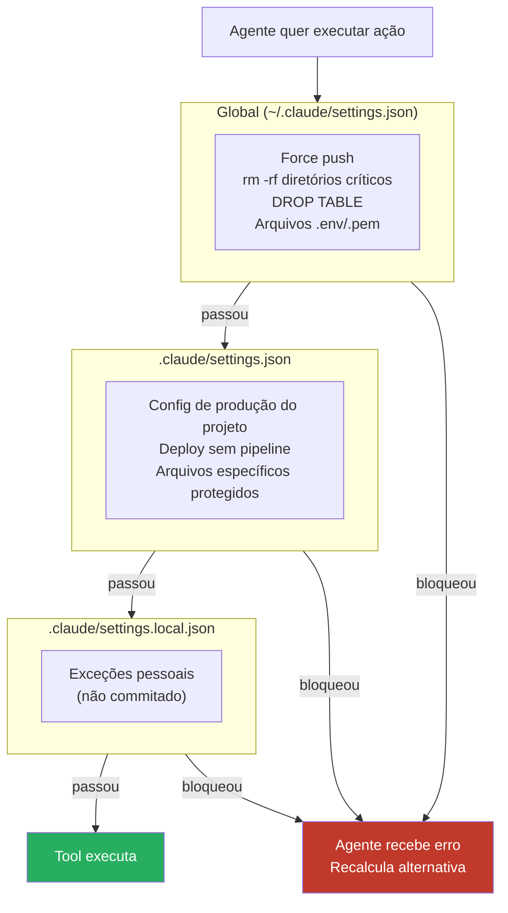

# Guardrails — bloquear comandos destrutivos

> [!abstract] TL;DR
> Guardrails são PreToolUse hooks que bloqueiam ações destrutivas ou de alto risco antes de executar. São a diferença entre usar Claude Code em auto mode de forma segura ou com risco real de perda de dados. A configuração global (`~/.claude/settings.json`) garante que guardrails se aplicam em todos os projetos. A mensagem no stderr instrui o agente a tentar uma abordagem alternativa.

---

## A analogia: disjuntores elétricos em série

A instalação elétrica de uma casa tem disjuntores. Eles não desconfiam dos moradores — eles protegem contra falhas que qualquer pessoa pode causar por descuido. Quando a corrente ultrapassa o limite, o disjuntor desliga antes que o fio queime. A casa fica no escuro por um segundo, mas não pega fogo.

Guardrails são os disjuntores do Claude Code. Não desconfiam do agente — reconhecem que mesmo um agente bem-calibrado pode, em um contexto específico, propor uma ação que parece razoável mas é irreversível. O guardrail desliga antes do fio queimar: bloqueia o `rm -rf`, o `git push --force`, o `DROP TABLE`. A sessão pára por um segundo, o agente recalcula, e a base de código (ou o banco) continua intacta.

---

## Por que guardrails são necessários

Em auto mode, o Claude Code executa tool calls sem pedir confirmação. Isso é o que torna o modo produtivo — mas significa que um mal-entendimento pode resultar em:

- `rm -rf` em diretório errado (confundiu `/tmp/debug` com `/tmp`)
- `git push --force` que sobrescreve o trabalho de outros no branch compartilhado
- `DROP TABLE` em banco de produção (ao tentar limpar dados de dev)
- Deploy acidental em ambiente errado (`prod` no lugar de `staging`)

Nenhum desses é "o agente ficou maluco". São erros razoáveis de contexto — o tipo que qualquer humano cometeria em um dia ruim. Guardrails transformam "confio no agente" em "confio no agente dentro de limites que eu defini".

---

## Guardrail básico — script unificado

Em vez de múltiplos hooks granulares, um script centralizado é mais fácil de manter e auditar:

```bash
#!/bin/bash
# ~/.claude/hooks/guardrails.sh

INPUT=$(cat)
TOOL=$(echo "$INPUT" | jq -r '.tool_name')
COMMAND=$(echo "$INPUT" | jq -r '.tool_input.command // ""')
FILE=$(echo "$INPUT" | jq -r '.tool_input.file_path // ""')

# Helper para bloquear com mensagem informativa
block() {
  echo "GUARDRAIL BLOQUEADO: $1" >&2
  exit 1
}

# ----------------------------------------------------------------
# BASH GUARDRAILS
# ----------------------------------------------------------------
if [[ "$TOOL" == "Bash" ]]; then

  # Force push — irreversível se o remote não tiver backup
  echo "$COMMAND" | grep -qE "push\s+(--force|-f)" \
    && block "force push bloqueado. Use --force-with-lease para push seguro."

  # rm -rf em diretórios críticos do projeto
  if echo "$COMMAND" | grep -qE "rm\s+-rf?\s+.*(src|app|lib|config|data|dist|build)/"; then
    block "rm -rf em diretório de projeto bloqueado. Execute manualmente com confirmação."
  fi

  # Operações destrutivas de banco
  echo "$COMMAND" | grep -qiE "(DROP\s+TABLE|DROP\s+DATABASE|TRUNCATE|DELETE\s+FROM\s+\w+\s*;)" \
    && block "operação destrutiva de banco bloqueada. Execute manualmente no client de banco."

  # Deploy direto em produção
  echo "$COMMAND" | grep -qiE "(deploy|release|publish)\s.*prod(uction)?" \
    && block "deploy em produção bloqueado. Use o pipeline de CI/CD."

  # sudo sem necessidade (ou para ações perigosas)
  echo "$COMMAND" | grep -qE "^sudo\s+(rm|mv|chmod 777|dd)" \
    && block "sudo com comando perigoso bloqueado."

  # kubectl em produção
  echo "$COMMAND" | grep -qE "kubectl\s+(delete|scale|replace)\s.*(prod|production)" \
    && block "operação kubectl em produção bloqueada. Execute manualmente."

fi

# ----------------------------------------------------------------
# EDIT / WRITE GUARDRAILS
# ----------------------------------------------------------------
if [[ "$TOOL" == "Edit" || "$TOOL" == "Write" ]]; then

  # Arquivos de credenciais
  echo "$FILE" | grep -qE "\.(env|pem|key|pfx|p12)$" \
    && block "edição de arquivo de credencial bloqueada. Edite manualmente."

  # Config de produção
  echo "$FILE" | grep -qE "(prod|production)\.(json|yaml|yml|toml|env)" \
    && block "edição de config de produção bloqueada."

  # Arquivos de infraestrutura crítica
  echo "$FILE" | grep -qE "(terraform\.tfstate|kubeconfig|ansible\.cfg)" \
    && block "edição de arquivo de infraestrutura crítica bloqueada."

fi

exit 0
```

Configuração em `~/.claude/settings.json` com matcher vazio (executa para todas as tools):

```json
{
  "hooks": {
    "PreToolUse": [
      {
        "matcher": "",
        "hooks": [
          { "type": "command", "command": "~/.claude/hooks/guardrails.sh" }
        ]
      }
    ]
  }
}
```

O matcher `""` (string vazia) ativa o hook para **todas** as tool calls. O script faz a filtragem interna por `$TOOL` para aplicar as regras corretas por tipo de ação.

---

## Guardrail para operações git

Git tem operações que parecem seguras mas têm efeitos permanentes em repositórios compartilhados:

```bash
#!/bin/bash
# ~/.claude/hooks/git-guard.sh

INPUT=$(cat)
COMMAND=$(echo "$INPUT" | jq -r '.tool_input.command // ""')

# Só processa comandos git
echo "$COMMAND" | grep -q "^git " || exit 0

# Force push — sobrescreve histórico remoto
echo "$COMMAND" | grep -qE "push.*(--force\b|-f\b)" \
  && { echo "GUARDRAIL: git push --force bloqueado. Use --force-with-lease." >&2; exit 1; }

# Reset --hard — descarta trabalho não commitado
echo "$COMMAND" | grep -qE "reset\s+--hard" \
  && { echo "GUARDRAIL: git reset --hard bloqueado. Faça git stash antes." >&2; exit 1; }

# clean -f — deleta arquivos não rastreados permanentemente
echo "$COMMAND" | grep -qE "clean\s+(-f|--force)" \
  && { echo "GUARDRAIL: git clean -f bloqueado. Use git clean -n primeiro para ver o que seria deletado." >&2; exit 1; }

# branch -D — força deletar branch (ignora merge check)
echo "$COMMAND" | grep -qE "branch\s+-D\s" \
  && { echo "GUARDRAIL: git branch -D bloqueado. Use -d (verifica se foi merged)." >&2; exit 1; }

# rebase --abort (pode causar perda de contexto em rebase longo)
echo "$COMMAND" | grep -qE "rebase\s+--abort" \
  && { echo "GUARDRAIL: git rebase --abort bloqueado. Confirme que deseja abortar o rebase." >&2; exit 1; }

exit 0
```

---

## Guardrail por ambiente/branch

Para projetos que têm ambientes distintos, proteger operações baseadas no contexto atual:

```bash
#!/bin/bash
# hooks/production-guard.sh

INPUT=$(cat)
COMMAND=$(echo "$INPUT" | jq -r '.tool_input.command // ""')
BRANCH=$(git branch --show-current 2>/dev/null || echo "")

# Em branch main/master, bloquear deploys diretos
if [[ "$BRANCH" =~ ^(main|master|production)$ ]]; then
  echo "$COMMAND" | grep -qE "^(npm run deploy|kubectl apply|terraform apply|ansible-playbook)" \
    && { echo "GUARDRAIL: deploy direto de branch $BRANCH bloqueado. Use o pipeline de CI/CD." >&2; exit 1; }
fi

# Se variável de ambiente indica produção
if [[ "$NODE_ENV" == "production" || "$ENVIRONMENT" == "prod" || "$APP_ENV" == "production" ]]; then
  echo "$COMMAND" | grep -qE "^(rm|mv|cp)\s+-rf?" \
    && { echo "GUARDRAIL: operação de arquivo recursiva em ambiente de produção bloqueada." >&2; exit 1; }
fi

exit 0
```

---

## Guardrail específico para banco de dados

Para projetos com acesso direto ao banco via terminal:

```bash
#!/bin/bash
# hooks/db-guard.sh

INPUT=$(cat)
COMMAND=$(echo "$INPUT" | jq -r '.tool_input.command // ""')

# Detecta se o comando acessa banco de produção
is_prod_db() {
  echo "$1" | grep -qiE "(prod|production).*db|db.*(prod|production)|DATABASE_URL.*prod"
}

# Operações destrutivas em qualquer banco via psql/mysql
if echo "$COMMAND" | grep -qiE "(psql|mysql|sqlite3|mongosh)\s"; then
  # Verificar se é acesso de produção
  if is_prod_db "$COMMAND"; then
    echo "GUARDRAIL: conexão a banco de produção bloqueada." >&2
    echo "Use a URL de banco de desenvolvimento. Acesse produção manualmente." >&2
    exit 1
  fi

  # Bloquear operações destrutivas mesmo em dev se parecerem apagar tudo
  if echo "$COMMAND" | grep -qiE "DROP\s+(TABLE|DATABASE)|TRUNCATE\s+TABLE"; then
    echo "GUARDRAIL: operação destrutiva de banco bloqueada. Execute manualmente." >&2
    exit 1
  fi
fi

exit 0
```

---

## Diagrama — camadas de guardrails



---

> [!tip] Assista: Setting up Claude Code security guardrails
> **Canal:** NextWork | **Duração:** ~1h09min | **Idioma:** EN
>
> Walkthrough completo de ponta a ponta: permission deny rules + hooks + `CLAUDE.md`, incluindo um validator hook que bloqueia categorias de comando perigoso (SQL injection, pipe-to-shell, escrita em `.env`, exclusões destrutivas) via exit code — o mesmo mecanismo que sustenta os scripts desta nota. Trecho de destaque [40:40]: *"patterns like drop table or delete from that can delete or destroy database history"*
>
> 🎬 [Assistir no YouTube](https://www.youtube.com/watch?v=-Awaa2oUWYY)

---

## Configuração recomendada por camada

**Global** (`~/.claude/settings.json`) — proteções universais, aplica em todos os projetos:
```json
{
  "hooks": {
    "PreToolUse": [
      {
        "matcher": "",
        "hooks": [
          { "type": "command", "command": "~/.claude/hooks/guardrails.sh" },
          { "type": "command", "command": "~/.claude/hooks/git-guard.sh" }
        ]
      }
    ]
  }
}
```

**Projeto** (`.claude/settings.json`) — proteções do contexto específico:
```json
{
  "hooks": {
    "PreToolUse": [
      {
        "matcher": "Bash",
        "hooks": [
          { "type": "command", "command": ".claude/hooks/production-guard.sh" },
          { "type": "command", "command": ".claude/hooks/db-guard.sh" }
        ]
      }
    ]
  }
}
```

**Local** (`.claude/settings.local.json`) — exceções pessoais quando você precisa de ação que o guardrail global bloquearia (não commitado):
```json
{
  "permissions": {
    "allow": ["Bash(git push --force-with-lease *)"]
  }
}
```

---

## Quando o guardrail bloqueia o agente legitimamente

O agente recebe o erro e geralmente:
1. Tenta uma abordagem alternativa (que você pode ter sugerido no stderr do hook)
2. Reporta o bloqueio para você e pergunta como prosseguir

O que fazer:
- **Executar manualmente** — melhor opção para ações de alto risco que o próprio agente não deveria fazer
- **Executar com `!` no chat** — o `!` prefix executa o comando no seu terminal, não via agente
- **Ajustar o guardrail** para ser mais granular se ele está bloqueando algo legítimo com frequência

---

## Armadilhas comuns

> [!warning] Guardrails muito amplos
> Bloquear todos os `rm` impede que o agente faça limpeza de arquivos temporários. Bloquear todo `git push` impede que o agente publique código. Seja específico — bloqueie padrões perigosos, não categorias inteiras.

> [!warning] Só confiar nos guardrails
> Guardrails cobrem padrões conhecidos. Um agente pode fazer algo destrutivo que não está nos seus padrões. Use guardrails como rede de segurança, não como substituto para revisar o que o agente propõe.

> [!warning] Guardrails do projeto commitados sem discussão
> Se você commita guardrails que bloqueiam ações que seus colegas precisam, vai criar atrito. Guardrails do projeto devem refletir a política do time.

> [!warning] Mensagens de erro vagas
> "GUARDRAIL: bloqueado" não ajuda o agente a recalcular. Mensagens boas explicam o porquê e sugerem a alternativa: "force push bloqueado — use --force-with-lease ou abra um PR".

---

## Checklist — guardrails

- [ ] Script unificado em `~/.claude/hooks/guardrails.sh` com `chmod +x`
- [ ] Configurado com matcher `""` no global para cobrir todas as tools
- [ ] Proteções de git em hook separado `git-guard.sh`
- [ ] Mensagens de erro explicam o porquê e sugerem alternativa
- [ ] Testado: `echo '{"tool_name":"Bash","tool_input":{"command":"git push --force origin main"}}' | ./guardrails.sh`
- [ ] Não bloqueia ações legítimas do dia a dia
- [ ] Guardrails de git em hook separado do guardrail geral
- [ ] Guardrails de projeto discutidos com o time antes de commitar
- [ ] Mensagens de bloqueio incluem `>&2` (vão para o agente, não são perdidas)
- [ ] Cada bloqueio testado manualmente antes de ativar

---

## Casos práticos

Guardrail em teoria bloqueia padrão perigoso. Guardrail em produção precisa sobreviver ao dia em que o padrão perigoso chega disfarçado de rotina.

> [!example] Force-push que quase reescreveu o histórico do time
> Um agente em auto mode estava resolvendo um conflito de merge num branch de feature. A sequência óbvia — pelo menos para quem só olha o comando isolado — era `git push --force` pra "sincronizar" o branch remoto com o local depois do rebase. Sem o guardrail de git (`git-guard.sh` bloqueando `push.*(--force|-f)`), esse push teria sobrescrito commits de outro desenvolvedor que empurrou trabalho pro mesmo branch minutos antes — silenciosamente, sem aviso, sem possibilidade de recuperar via reflog alheio. O guardrail bloqueou, devolveu a mensagem sugerindo `--force-with-lease`, e o agente recalculou: usou a variante segura, que falha explicitamente se o remote mudou desde o último fetch. A diferença entre os dois comandos é uma palavra — a diferença de consequência é um branch inteiro de trabalho perdido.

> [!example] Tentativa de DROP TABLE dentro de um script de CI
> Um pipeline de CI gerado para "resetar o schema de teste antes de rodar a suíte" incluía um passo que rodava migrations e, num caminho de erro mal tratado, caía em um `DROP TABLE IF EXISTS` sem qualificar schema — apontando pra `DATABASE_URL` do ambiente em que o job rodava. Em um ambiente de CI mal configurado, essa variável pode apontar pra um banco compartilhado (staging usado por outro time, por exemplo) em vez de um banco efêmero. O guardrail de banco (`db-guard.sh`) intercepta qualquer `DROP TABLE|DROP DATABASE|TRUNCATE` antes da execução, independente de o comando vir de um humano digitando no terminal ou de um agente executando um script gerado — porque o padrão de risco é o mesmo nos dois casos. O bloqueio forçou revisão manual do script de CI, que expôs o bug real: a variável de ambiente errada estava sendo herdada de um job anterior.

> [!summary] O padrão dos dois casos: o comando isolado parece rotina; o contexto (branch compartilhado, variável de ambiente errada) é o que o torna destrutivo. Guardrails não julgam intenção — bloqueiam a classe de comando, e é exatamente essa cegueira ao contexto que os torna confiáveis mesmo quando o raciocínio do agente falha.

---

## Como explicar em inglês

| Português | Inglês |
|-----------|--------|
| Guardrail | Guardrail / safety rail |
| Ação destrutiva | Destructive action / irreversible action |
| Rede de segurança | Safety net |
| Bloquear antes de executar | Block before execution / veto the action |
| Matcher vazio | Empty matcher / catch-all matcher |

**Frases úteis:**
- "Guardrails are PreToolUse hooks that block known-dangerous patterns before the agent can execute them — the agent gets an error message explaining why and can try a different approach."
- "The empty matcher `''` fires for every tool call — the script then filters internally by tool name to apply the right rules."
- "Write good error messages in guardrail scripts: not just 'blocked' but 'force push blocked — use --force-with-lease or open a PR instead'. Give the agent a way out."

---

## O que vem a seguir

Guardrails como os desta nota resolvem bem o caso em que "perigoso" pode ser reduzido a um padrão de texto — `push --force`, `DROP TABLE`, um path que bate num arquivo `.env`. Mas nem todo julgamento de segurança cabe em uma regex. `rm -rf dist/` (diretório de build, gerado automaticamente) e `rm -rf src/` (código-fonte) são estruturalmente idênticos para um guardrail baseado em padrão — e completamente diferentes em consequência.

Quando a decisão de bloquear depende do *contexto* (que diretório é esse, o que esse comando realmente vai afetar), regex para de escalar. A próxima nota, [[03-Dominios/Tecnologia/IA/Claude Code/Hooks e Guardrails/06 - Delegar permissão|06 - Delegar permissão]], cobre o pattern que substitui a regra fixa por julgamento: delegar a decisão de permissão a um segundo LLM, que avalia o comando com o contexto completo antes de aprovar ou bloquear.

---

## Veja também

- [[03-Dominios/Tecnologia/IA/Claude Code/Hooks e Guardrails/02 - PreToolUse|02 - PreToolUse]] — como PreToolUse funciona e semântica de exit codes
- [[03-Dominios/Tecnologia/IA/Claude Code/Hooks e Guardrails/07 - Segurança com hooks|07 - Segurança com hooks]] — hardening dos próprios scripts de hook
- [[03-Dominios/Tecnologia/IA/Claude Code/Hooks e Guardrails/08 - Testando hooks|08 - Testando hooks]] — como testar que guardrails funcionam
- [[03-Dominios/Tecnologia/IA/Claude Code/Configuração/05 - Permissions|05 - Permissions]] — allow/deny como alternativa simples para bloqueios incondicionais
- [[03-Dominios/Tecnologia/IA/Claude Code/Hooks e Guardrails/index|Hooks e Guardrails]] — índice do galho

---

## Fontes

- **Anthropic** — *Claude Code hooks* (2026). Documentação oficial de PreToolUse e configuração de guardrails — https://docs.anthropic.com/pt/docs/claude-code/hooks
- **Anthropic** — *Claude Code security* (2026). Recomendações de segurança para operações de agente — https://docs.anthropic.com/pt/docs/claude-code/security
- **Anthropic** — *Claude Code best practices* (2026). Guardrails recomendados para projetos de produção — https://www.anthropic.com/engineering/claude-code-best-practices
