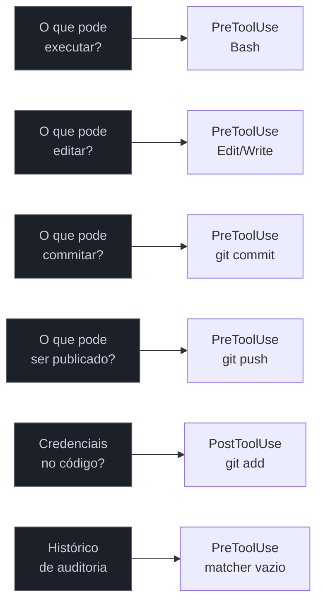

# Segurança com hooks — defesa em profundidade

> [!abstract] TL;DR
> Segurança com hooks vai além de guardrails individuais: é uma estratégia em camadas que cobre o fluxo de trabalho inteiro — desde bloquear comandos destrutivos até proteger arquivos sensíveis, controlar o que pode ser commitado, e detectar credenciais antes de ir ao git. Guardrail bloqueia uma ação. Segurança sistêmica cobre o ciclo completo: o que pode executar, o que pode editar, o que pode commitar, o que pode publicar.

---

> [!tip] Vídeo — Setting up Claude Code security guardrails
> [NextWork, 2026](https://www.youtube.com/watch?v=-Awaa2oUWYY) demonstra na prática as três camadas de defesa — permission deny-rules, hooks PreToolUse que inspecionam o `tool_input` e bloqueiam via exit code 2, e políticas em CLAUDE.md como camada comportamental mais leve — incluindo um exercício de red-team simulando `.env` falso, `cat .env` e `echo $(cat .env)` pra verificar qual camada pega qual ataque. Complementa bem as cinco camadas desta nota.

---

## A analogia: a auditoria de acesso em um ambiente regulado

Em ambientes regulados (bancos, hospitais, sistemas de saúde), não basta bloquear ações perigosas na porta. A segurança é sistêmica: cada ação é registrada, o que pode ser lido está definido, o que pode ser modificado requer aprovação, e o histórico é imutável para auditoria. Não é desconfiança — é accountability.

Hooks bem configurados fazem o mesmo para o Claude Code. Não se trata de desconfiar do agente — se trata de ter um registro confiável de o que aconteceu, garantir que arquivos críticos nunca foram tocados, e que o histórico git permanece intacto. É a diferença entre "usamos IA com auto mode" e "usamos IA com auto mode em ambiente auditável".

---

## A diferença entre guardrail e segurança sistêmica

Um guardrail bloqueia um comando. Uma estratégia de segurança com hooks cobre o ciclo completo:



Cinco camadas, cinco hooks distintos. Cada um protege um ponto diferente do fluxo.

---

## Camada 1 — Proteção de arquivos sensíveis

A primeira linha: impedir que o agente leia ou edite arquivos que nunca devem ser tocados.

```bash
#!/bin/bash
# ~/.claude/hooks/protect-files.sh

INPUT=$(cat)
TOOL=$(echo "$INPUT" | jq -r '.tool_name')
FILE=$(echo "$INPUT" | jq -r '.tool_input.file_path // ""')

# Bloquear Edit, Write E Read em arquivos sensíveis
if [[ "$TOOL" != "Edit" && "$TOOL" != "Write" && "$TOOL" != "Read" ]]; then exit 0; fi

BLOCKED_PATTERNS=(
  ".*\.env$"
  ".*\.env\."
  ".*\.pem$"
  ".*\.key$"
  ".*\.pfx$"
  ".*credentials\.json$"
  ".*secret(s)?\.(json|yaml|yml)$"
  ".*/\.ssh/.*"
  ".*id_rsa$"
  ".*id_ed25519$"
)

for pattern in "${BLOCKED_PATTERNS[@]}"; do
  if echo "$FILE" | grep -qiE "$pattern"; then
    echo "SEGURANÇA: $FILE é um arquivo sensível." >&2
    echo "Leitura e edição pelo agente bloqueadas. Acesse manualmente." >&2
    exit 1
  fi
done

exit 0
```

> [!info] Por que bloquear Read também
> Um agente que lê suas chaves privadas pode inadvertidamente incluí-las em output, logs, ou como conteúdo de uma chamada API subsequente. Bloquear Read é conservative — se o agente precisa de alguma credencial, forneça via variável de ambiente, não via arquivo.

---

## Camada 2 — Detecção de credenciais antes de commit

Interceptar `git add` e `git commit` para verificar se o staged content tem credenciais:

```bash
#!/bin/bash
# hooks/detect-credentials-on-commit.sh

INPUT=$(cat)
COMMAND=$(echo "$INPUT" | jq -r '.tool_input.command // ""')

# Intercepta git add e git commit (PreToolUse)
if ! echo "$COMMAND" | grep -qE "^git (add|commit)"; then exit 0; fi

# Verifica o staged content atual
STAGED_CONTENT=$(git diff --staged 2>/dev/null)

PATTERNS=(
  "AKIA[0-9A-Z]{16}"                          # AWS Access Key ID
  "sk-[a-zA-Z0-9]{48}"                         # OpenAI API key
  "ghp_[a-zA-Z0-9]{36}"                        # GitHub PAT
  "ya29\.[a-zA-Z0-9_-]+"                       # Google OAuth token
  "password\s*[:=]\s*['\"][^'\"]{6,}['\"]"     # password = "valor"
  "secret\s*[:=]\s*['\"][^'\"]{6,}['\"]"       # secret = "valor"
  "api.?key\s*[:=]\s*['\"][^'\"]{6,}['\"]"     # api_key = "valor"
  "token\s*[:=]\s*['\"][^'\"]{10,}['\"]"       # token = "valor longo"
)

for pattern in "${PATTERNS[@]}"; do
  if echo "$STAGED_CONTENT" | grep -qE "$pattern"; then
    echo "SEGURANÇA: possível credencial detectada no staged content." >&2
    echo "Padrão detectado: $pattern" >&2
    echo "Revise com: git diff --staged | grep -E '$pattern'" >&2
    exit 1
  fi
done

exit 0
```

Configure como PreToolUse (não PostToolUse) — assim bloqueia antes de o commit acontecer:

```json
{
  "hooks": {
    "PreToolUse": [
      {
        "matcher": "Bash",
        "hooks": [{ "type": "command", "command": "~/.claude/hooks/detect-credentials-on-commit.sh" }]
      }
    ]
  }
}
```

---

## Camada 3 — Proteção do histórico git

Bloquear operações que reescrevem histórico e podem causar perda de trabalho dos colegas:

```bash
#!/bin/bash
# ~/.claude/hooks/protect-git-history.sh

INPUT=$(cat)
COMMAND=$(echo "$INPUT" | jq -r '.tool_input.command // ""')

echo "$COMMAND" | grep -q "^git " || exit 0

# Force push — reescreve histórico remoto
if echo "$COMMAND" | grep -qE "push.*(--force\b|-f\b)"; then
  echo "SEGURANÇA: force push bloqueado — pode apagar commits de outros." >&2
  echo "Use --force-with-lease para verificar que não houve push externo." >&2
  exit 1
fi

# Rebase em branches compartilhadas — reescreve histórico local e depois force push
BRANCH=$(git branch --show-current 2>/dev/null || echo "")
if echo "$COMMAND" | grep -qE "^git rebase" && [[ "$BRANCH" =~ ^(main|master|develop)$ ]]; then
  echo "SEGURANÇA: git rebase em branch compartilhada ($BRANCH) bloqueado." >&2
  echo "Rebase é seguro apenas em feature branches pessoais." >&2
  exit 1
fi

# Reset --hard — descarta trabalho não commitado permanentemente
if echo "$COMMAND" | grep -qE "reset\s+--hard"; then
  echo "SEGURANÇA: git reset --hard bloqueado." >&2
  echo "Use git stash para preservar o trabalho antes de resetar." >&2
  exit 1
fi

# Amend de commits já publicados
if echo "$COMMAND" | grep -qE "commit.*--amend"; then
  REMOTE_TRACKING=$(git rev-parse --abbrev-ref --symbolic-full-name @{u} 2>/dev/null)
  if [[ -n "$REMOTE_TRACKING" ]]; then
    LOCAL=$(git rev-parse HEAD 2>/dev/null)
    REMOTE_HASH=$(git rev-parse "$REMOTE_TRACKING" 2>/dev/null)
    if [[ "$LOCAL" == "$REMOTE_HASH" ]]; then
      echo "SEGURANÇA: --amend em commit já publicado no remote bloqueado." >&2
      exit 1
    fi
  fi
fi

exit 0
```

---

## Camada 4 — Controle de branches protegidas

Impedir commits diretos em branches de longa vida — force branch workflow:

```bash
#!/bin/bash
# hooks/protect-branches.sh

INPUT=$(cat)
COMMAND=$(echo "$INPUT" | jq -r '.tool_input.command // ""')

# Só age em git commit
echo "$COMMAND" | grep -qE "^git commit" || exit 0

BRANCH=$(git branch --show-current 2>/dev/null || echo "")
PROTECTED_BRANCHES=("main" "master" "develop" "release" "production" "staging")

for protected in "${PROTECTED_BRANCHES[@]}"; do
  if [[ "$BRANCH" == "$protected" ]]; then
    echo "SEGURANÇA: commit direto em $BRANCH bloqueado." >&2
    echo "Crie uma feature branch: git checkout -b feat/sua-tarefa" >&2
    exit 1
  fi
done

exit 0
```

---

## Camada 5 — Auditoria de segurança

Logar todas as ações sensíveis para registro imutável — independente de bloqueio:

```bash
#!/bin/bash
# hooks/security-audit.sh

INPUT=$(cat)
TOOL=$(echo "$INPUT" | jq -r '.tool_name')
COMMAND=$(echo "$INPUT" | jq -r '.tool_input.command // ""')
FILE=$(echo "$INPUT" | jq -r '.tool_input.file_path // ""')
TIMESTAMP=$(date -u +"%Y-%m-%dT%H:%M:%SZ")
USER=$(whoami)
PROJECT=$(basename "$(pwd)")

IS_SENSITIVE=false

case "$TOOL" in
  Bash)
    echo "$COMMAND" | grep -qiE "(git push|git commit|rm |mv |npm publish|deploy|kubectl|terraform)" \
      && IS_SENSITIVE=true
    ;;
  Edit|Write)
    echo "$FILE" | grep -qiE "\.(env|json|yaml|yml|toml|sh|tf|config)" \
      && IS_SENSITIVE=true
    ;;
esac

if [[ "$IS_SENSITIVE" == "true" ]]; then
  SUBJECT="${COMMAND:-$FILE}"
  echo "$TIMESTAMP | $USER | $PROJECT | $TOOL | $SUBJECT" >> ~/.claude/security-audit.log
fi

exit 0  # Auditoria nunca bloqueia
```

---

## Configuração completa em camadas

```json
// ~/.claude/settings.json (global — aplica em todos os projetos)
{
  "hooks": {
    "PreToolUse": [
      {
        "matcher": "",
        "hooks": [
          { "type": "command", "command": "~/.claude/hooks/security-audit.sh" },
          { "type": "command", "command": "~/.claude/hooks/protect-files.sh" },
          { "type": "command", "command": "~/.claude/hooks/protect-git-history.sh" }
        ]
      }
    ]
  }
}
```

```json
// .claude/settings.json (projeto — específico do contexto)
{
  "hooks": {
    "PreToolUse": [
      {
        "matcher": "Bash",
        "hooks": [
          { "type": "command", "command": ".claude/hooks/detect-credentials-on-commit.sh" },
          { "type": "command", "command": ".claude/hooks/protect-branches.sh" }
        ]
      }
    ]
  }
}
```

A auditoria fica global (todos os projetos). Os hooks específicos de workflow git ficam no projeto (onde as políticas de branch são definidas).

---

## Tabela de defesa em profundidade

| Camada | Hook type | Matcher | O que protege |
|--------|-----------|---------|---------------|
| Arquivos sensíveis | PreToolUse | Edit, Write, Read | `.env`, `.pem`, `.key`, credenciais |
| Credenciais em código | PreToolUse | Bash | `git add`/`git commit` com secret no staged |
| Histórico git | PreToolUse | Bash | force push, reset --hard, rebase em main |
| Branches protegidas | PreToolUse | Bash | commit direto em main/master/develop |
| Auditoria | PreToolUse | `""` (tudo) | Log imutável de todas as ações sensíveis |

---

## Armadilhas comuns

> [!warning] Falsa sensação de segurança
> Hooks protegem contra ações do agente via Claude Code. Não protegem contra você mesmo executando `git push --force` no terminal. São política para o agente, não para o shell.

> [!warning] Hooks sem logging
> Bloquear sem logar significa que você não sabe o que o agente tentou fazer. Inclua auditoria como primeiro hook da cadeia (exit 0, só loga) antes dos bloqueios.

> [!warning] Detect-credentials como PostToolUse
> Se você configurar detecção de credenciais em PostToolUse do Bash, o commit já aconteceu quando o hook roda. Use PreToolUse para interceptar antes.

> [!warning] Hooks muito específicos de um projeto commitados globalmente
> Um hook que bloqueia `git commit` em `main` pode causar problemas em projetos que usam `main` como branch de trabalho legítima.

---

## Checklist — segurança com hooks

- [ ] PreToolUse para arquivos sensíveis (.env, .pem, credenciais) com Read bloqueado também
- [ ] Detecção de credenciais em staged content (PreToolUse em `git add`/`git commit`)
- [ ] Proteção de histórico git (force push, reset --hard, rebase em main)
- [ ] Proteção de branches protegidas (commits diretos)
- [ ] Auditoria como primeiro hook da cadeia (exit 0, só loga)
- [ ] Mensagens de erro incluem a alternativa segura
- [ ] Scripts de hook com `chmod +x`
- [ ] Testados com JSON de exemplo antes de ativar
- [ ] Logs não contêm dados sensíveis (logar apenas metadata, não conteúdo)
- [ ] Hooks globais separados dos hooks de projeto (global = universal, projeto = específico)

---

## Ordem dos hooks na cadeia importa

Quando múltiplos hooks rodam em sequência para o mesmo matcher, a ordem define o comportamento:

```
1. security-audit.sh    → exit 0 (sempre — loga antes de qualquer bloqueio)
2. protect-files.sh     → exit 0 ou exit 1
3. protect-git-history.sh → exit 0 ou exit 1
4. detect-credentials.sh  → exit 0 ou exit 1
```

A auditoria deve ser **sempre o primeiro hook**. Se vier depois de um hook de bloqueio, ações bloqueadas não são registradas — você perde o rastro do que o agente tentou fazer e foi impedido.

O bloqueio mais específico deve vir **antes do mais genérico**. Se `protect-files.sh` bloqueia `.env`, e `guardrails.sh` também bloqueia `.env` — não há problema, o primeiro que bloqueia vence. Mas organizações claras de responsabilidade facilitam manutenção.

---

## Casos práticos

As camadas acima não são exercício teórico — são resposta direta a incidentes reais de produção. Dois cenários mostram por que a defesa em profundidade importa mais do que um guardrail isolado (veja também [[03-Dominios/Tecnologia/IA/Segurança e Guardrails/12 - O roadmap de segurança para times|o roadmap de segurança para times]], que trata desse mesmo problema em escala de organização).

**Cenário 1 — a credencial que quase foi ao GitHub público.** Um dev pede ao agente para "subir essa branch com a config de integração". O arquivo `.env.local` tinha ficado staged por engano numa sessão anterior, com uma chave `AKIA...` de produção dentro. Sem a Camada 2 (detecção de credenciais), o `git commit` passa, o `git push` passa, e a chave fica exposta no histórico de um repositório público — mesmo que alguém a remova depois, ela já vazou (rotação de credencial vira obrigatória, não opcional). Com o hook `detect-credentials-on-commit.sh` rodando como PreToolUse em `git commit`, o padrão `AKIA[0-9A-Z]{16}` é pego *antes* do commit existir — o incidente nunca acontece, e não há necessidade de reescrever histórico ou rotacionar segredo às pressas.

**Cenário 2 — o force-push que apagou o trabalho de um colega.** O agente está numa tarefa de "limpar o histórico de commits" e interpreta isso como "reescrever e forçar". Sem a Camada 3 (proteção de histórico), um `git push --force` sobrescreve a branch remota — e os três commits que um colega tinha empurrado nas últimas duas horas somem. Recuperar exige `git reflog` na máquina do colega (se ainda não tiver feito `git pull`) ou, na pior hipótese, refazer o trabalho manualmente. Com `protect-git-history.sh` interceptando `push.*(--force|-f)` como PreToolUse, o comando é bloqueado e a mensagem de erro sugere a alternativa segura (`--force-with-lease`), que falha graciosamente se houver commits remotos que o agente não viu.

Nos dois casos, o padrão é o mesmo: o dano é irreversível ou caro de reverter *depois* que a ação acontece — por isso o hook precisa ser PreToolUse, não PostToolUse (ver Camada 2). Auditoria (Camada 5) não teria evitado nenhum dos dois incidentes — só teria registrado que aconteceram.

---

## O que vem a seguir

Configurar as cinco camadas é necessário, mas não é suficiente — um hook com um bug no regex, um `exit` no lugar errado, ou uma condição que nunca dispara é pior do que não ter hook nenhum, porque cria falsa sensação de segurança (a primeira armadilha desta nota). A pergunta natural depois de escrever `protect-files.sh` ou `detect-credentials-on-commit.sh` é: como eu sei que esse hook realmente bloqueia o que eu acho que ele bloqueia? [[03-Dominios/Tecnologia/IA/Claude Code/Hooks e Guardrails/08 - Testando hooks|08 - Testando hooks]] cobre exatamente isso — como simular o JSON de entrada, rodar o script isolado do Claude Code, e validar cada camada de defesa em profundidade antes de confiar nela em produção.

---

## Como explicar em inglês

| Português | Inglês |
|-----------|--------|
| Defesa em profundidade | Defense in depth |
| Arquivo sensível | Sensitive file / credential file |
| Histórico git | Git history / commit history |
| Branch protegida | Protected branch |
| Auditoria | Audit trail / audit log |
| Detecção de credenciais | Credential detection / secret scanning |

**Frases úteis:**
- "Defense in depth with hooks means not just one guardrail, but five layers: what can run, what can be edited, what can be committed, what can be pushed, and a full audit trail of sensitive actions."
- "Configure credential detection as PreToolUse on 'git add' and 'git commit' — not PostToolUse. PostToolUse fires after the commit already happened; you want to intercept before."
- "Hooks are policy for the agent, not for the shell. A developer can still run git push --force directly — hooks only govern what Claude Code does on your behalf."

---

## Veja também

- [[03-Dominios/Tecnologia/IA/Claude Code/Hooks e Guardrails/02 - PreToolUse|02 - PreToolUse]] — controle de execução e semântica de exit codes
- [[03-Dominios/Tecnologia/IA/Claude Code/Hooks e Guardrails/05 - Guardrails|05 - Guardrails]] — guardrails de bloqueio geral
- [[03-Dominios/Tecnologia/IA/Claude Code/Hooks e Guardrails/06 - Delegar permissão|06 - Delegar permissão]] — meta-agente para decisões complexas
- [[03-Dominios/Tecnologia/IA/Claude Code/Hooks e Guardrails/08 - Testando hooks|08 - Testando hooks]] — como testar cada camada de segurança
- [[03-Dominios/Tecnologia/IA/Claude Code/Hooks e Guardrails/index|Hooks e Guardrails]] — índice do galho

---

## Fontes

- **Anthropic** — *Claude Code hooks* (2026). Documentação oficial de hooks e estratégias de segurança — https://docs.anthropic.com/pt/docs/claude-code/hooks
- **Anthropic** — *Claude Code security* (2026). Melhores práticas de segurança para agentes de código — https://docs.anthropic.com/pt/docs/claude-code/security
- **OWASP** — *Secret Management Cheat Sheet* (2024). Padrões de detecção de credenciais em código — https://cheatsheetseries.owasp.org/cheatsheets/Secrets_Management_Cheat_Sheet.html
