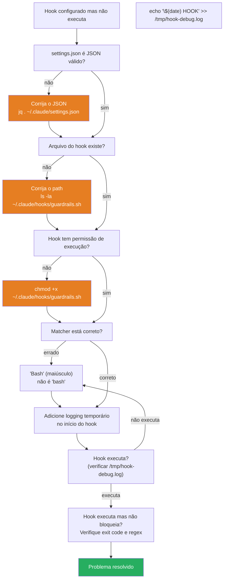

# Testando e debugando hooks

> [!abstract] TL;DR
> Hooks que não são testados não são confiáveis. Um guardrail que você acredita bloquear `git push --force` mas que na prática não bloqueia é pior que não ter guardrail — dá falsa confiança. Esta nota cobre como testar cada tipo de hook em isolamento, como escrever uma suíte de testes automatizados, como debugar hooks que não disparam, e as armadilhas mais comuns que fazem hooks falhar silenciosamente.

---

## A analogia: o disjuntor que nunca foi testado

Você sabe que tem um disjuntor na caixa elétrica. Está escrito que protege o circuito de 20A. Mas nunca foi testado desde que a casa foi construída. Você confia nele? Não deveria — disjuntores enferrujam, travam, perdem calibração.

> [!tip] Vídeo — testando scripts bash na prática
> [Test-Driven Development (TDD) Tutorial: Unit Testing Bash Scripts with Bats](https://www.youtube.com/watch?v=EHUE3i8izew) mostra TDD aplicado a scripts bash com o framework Bats — a mesma lógica de `assert_blocked`/`assert_allowed` desta nota, só que com uma biblioteca de asserções pronta em vez de funções caseiras. Útil se a suíte de testes de hooks crescer a ponto de justificar uma dependência dedicada.

Eletricistas sérios testam os disjuntores periodicamente: simulam uma sobrecarga controlada e verificam que o disjuntor corta o circuito como esperado. Só então consideram a proteção confiável.

Guardrails e hooks são o mesmo problema. Você escreve `guardrails.sh`, adiciona no `settings.json`, e acha que está protegido. Mas o hook pode:
- Não executar porque o path está errado
- Executar com regex que não cobre variações do padrão real
- Bloquear mas retornar exit code 0 (o Claude interpreta como aprovado)
- Funcionar em teste isolado mas falhar quando o input real tem aspas, espaços extras, ou encoding diferente

A suíte de testes é o eletricista que testa o disjuntor. Sem ela, você tem a sensação de segurança sem a segurança de fato.

---

## Anatomia do input que o Claude Code envia

Antes de testar, você precisa saber exatamente o que o Claude Code passa para seu hook. É JSON via stdin, e a estrutura varia por tipo de tool:

**PreToolUse — Bash:**
```json
{
  "tool_name": "Bash",
  "tool_input": {
    "command": "git push --force origin main",
    "description": "Force push to remote"
  }
}
```

**PreToolUse — Edit:**
```json
{
  "tool_name": "Edit",
  "tool_input": {
    "file_path": "/projeto/.env",
    "old_string": "DB_PASSWORD=antigo",
    "new_string": "DB_PASSWORD=novo"
  }
}
```

**PreToolUse — Write:**
```json
{
  "tool_name": "Write",
  "tool_input": {
    "file_path": "/config/prod.yml",
    "content": "database:\n  host: prod-db.example.com"
  }
}
```

**PostToolUse — qualquer tool:**
```json
{
  "tool_name": "Bash",
  "tool_input": { "command": "npm test" },
  "tool_output": "Tests: 42 passed, 0 failed",
  "tool_exit_code": 0
}
```

**Stop hook:**
```json
{
  "session_id": "abc123-def456",
  "stop_reason": "end_turn",
  "total_turns": 47,
  "total_tokens": 125000
}
```

Com esses templates em mãos, testar qualquer hook é só uma questão de `echo '...' | ./hook.sh` e verificar o exit code.

---

## Teste manual — verificação imediata

A forma mais rápida de confirmar que um hook funciona: pipe JSON diretamente para o script.

```bash
# Deve retornar exit 1 (bloqueado) e mensagem no stderr
echo '{"tool_name":"Bash","tool_input":{"command":"git push --force origin main"}}' \
  | ~/.claude/hooks/guardrails.sh
echo "Exit code: $?"

# Deve retornar exit 0 (aprovado), sem saída
echo '{"tool_name":"Bash","tool_input":{"command":"git status"}}' \
  | ~/.claude/hooks/guardrails.sh
echo "Exit code: $?"
```

Para ver a mensagem de erro que o agente recebe (stderr):
```bash
echo '{"tool_name":"Bash","tool_input":{"command":"rm -rf src/"}}' \
  | ~/.claude/hooks/guardrails.sh 2>&1
# Saída esperada: "GUARDRAIL BLOQUEADO: rm -rf em diretório de projeto..."
```

Para ver o JSON de modificação de input (stdout de hooks que reescrevem input):
```bash
echo '{"tool_name":"Bash","tool_input":{"command":"git log --all"}}' \
  | ~/.claude/hooks/rewrite-input.sh 2>/dev/null
# Saída: JSON modificado com o novo tool_input
```

---

## Suíte de testes automatizados

Para guardrails críticos, um script que documenta e verifica comportamento esperado — e falha explicitamente quando algo quebra:

```bash
#!/bin/bash
# tests/test-guardrails.sh

HOOK=~/.claude/hooks/guardrails.sh
PASS=0
FAIL=0

# -------------------------------------------------------------------
# Helpers
# -------------------------------------------------------------------

assert_blocked() {
  local description="$1"
  local input="$2"

  echo "$input" | "$HOOK" > /dev/null 2>&1
  if [[ $? -ne 0 ]]; then
    echo "✓ BLOQUEADO: $description"
    ((PASS++))
  else
    echo "✗ PASSOU (deveria bloquear): $description"
    ((FAIL++))
  fi
}

assert_allowed() {
  local description="$1"
  local input="$2"

  echo "$input" | "$HOOK" > /dev/null 2>&1
  if [[ $? -eq 0 ]]; then
    echo "✓ PERMITIDO: $description"
    ((PASS++))
  else
    echo "✗ BLOQUEADO (deveria permitir): $description"
    ((FAIL++))
  fi
}

assert_stderr_contains() {
  local description="$1"
  local input="$2"
  local expected="$3"

  stderr_output=$(echo "$input" | "$HOOK" 2>&1 >/dev/null)
  if echo "$stderr_output" | grep -q "$expected"; then
    echo "✓ MENSAGEM CORRETA: $description"
    ((PASS++))
  else
    echo "✗ MENSAGEM ERRADA: $description (esperava '$expected', recebeu '$stderr_output')"
    ((FAIL++))
  fi
}

# -------------------------------------------------------------------
# Testes de Bash — deve bloquear
# -------------------------------------------------------------------
echo ""
echo "=== BASH: ações que devem ser bloqueadas ==="

assert_blocked "force push --force" \
  '{"tool_name":"Bash","tool_input":{"command":"git push --force origin main"}}'

assert_blocked "force push -f" \
  '{"tool_name":"Bash","tool_input":{"command":"git push -f origin main"}}'

assert_blocked "force push com espaços extras" \
  '{"tool_name":"Bash","tool_input":{"command":"git  push  --force  origin main"}}'

assert_blocked "DROP TABLE SQL" \
  '{"tool_name":"Bash","tool_input":{"command":"psql -c \"DROP TABLE users\""}}'

assert_blocked "rm -rf em src/" \
  '{"tool_name":"Bash","tool_input":{"command":"rm -rf src/"}}'

assert_blocked "rm -rf em app/" \
  '{"tool_name":"Bash","tool_input":{"command":"rm -rf ./app/"}}'

assert_blocked "deploy em producao" \
  '{"tool_name":"Bash","tool_input":{"command":"npm run deploy production"}}'

# -------------------------------------------------------------------
# Testes de Bash — deve permitir
# -------------------------------------------------------------------
echo ""
echo "=== BASH: ações que devem ser permitidas ==="

assert_allowed "git status" \
  '{"tool_name":"Bash","tool_input":{"command":"git status"}}'

assert_allowed "npm install" \
  '{"tool_name":"Bash","tool_input":{"command":"npm install lodash"}}'

assert_allowed "rm de arquivo temporario" \
  '{"tool_name":"Bash","tool_input":{"command":"rm /tmp/debug.log"}}'

assert_allowed "git push normal" \
  '{"tool_name":"Bash","tool_input":{"command":"git push origin feature/minha-feature"}}'

# -------------------------------------------------------------------
# Testes de Edit — deve bloquear
# -------------------------------------------------------------------
echo ""
echo "=== EDIT: ações que devem ser bloqueadas ==="

assert_blocked "editar .env" \
  '{"tool_name":"Edit","tool_input":{"file_path":"/projeto/.env","old_string":"x","new_string":"y"}}'

assert_blocked "editar arquivo .pem" \
  '{"tool_name":"Edit","tool_input":{"file_path":"/certs/server.pem","old_string":"x","new_string":"y"}}'

assert_blocked "editar config de producao" \
  '{"tool_name":"Edit","tool_input":{"file_path":"/config/production.json","old_string":"x","new_string":"y"}}'

# -------------------------------------------------------------------
# Testes de Edit — deve permitir
# -------------------------------------------------------------------
echo ""
echo "=== EDIT: ações que devem ser permitidas ==="

assert_allowed "editar arquivo TypeScript" \
  '{"tool_name":"Edit","tool_input":{"file_path":"/src/services/orders.ts","old_string":"x","new_string":"y"}}'

assert_allowed "editar arquivo de teste" \
  '{"tool_name":"Edit","tool_input":{"file_path":"/tests/unit/orders.test.ts","old_string":"x","new_string":"y"}}'

# -------------------------------------------------------------------
# Testes de mensagens de erro (qualidade do feedback)
# -------------------------------------------------------------------
echo ""
echo "=== MENSAGENS DE ERRO ==="

assert_stderr_contains "mensagem de force push menciona alternativa" \
  '{"tool_name":"Bash","tool_input":{"command":"git push --force origin main"}}' \
  "force-with-lease"

assert_stderr_contains "mensagem de .env menciona edição manual" \
  '{"tool_name":"Edit","tool_input":{"file_path":"/projeto/.env","old_string":"x","new_string":"y"}}' \
  "manualmente"

# -------------------------------------------------------------------
# Resultado final
# -------------------------------------------------------------------
echo ""
echo "================================"
echo "Resultado: $PASS passou, $FAIL falhou"
echo "================================"

[[ $FAIL -eq 0 ]]
```

Tornar executável e rodar:
```bash
chmod +x tests/test-guardrails.sh
./tests/test-guardrails.sh
```

---

## Fluxo de diagnóstico: hook que não dispara

Quando um hook está configurado mas não parece executar, siga este fluxo:



**Passo a passo:**

```bash
# 1. Validar settings.json
cat ~/.claude/settings.json | jq '.' > /dev/null && echo "JSON válido" || echo "JSON inválido"

# 2. Confirmar que o hook existe e é executável
ls -la ~/.claude/hooks/guardrails.sh

# 3. Tornar executável se necessário
chmod +x ~/.claude/hooks/guardrails.sh

# 4. Verificar o matcher (case-sensitive: "Bash" não é "bash")
cat ~/.claude/settings.json | jq '.hooks.PreToolUse[].matcher'

# 5. Adicionar logging temporário
echo '#!/bin/bash' > /tmp/test-hook-log.sh
echo 'echo "$(date) HOOK ARGS: $(cat)" >> /tmp/hook-debug.log' >> /tmp/test-hook-log.sh
echo 'exit 0' >> /tmp/test-hook-log.sh
chmod +x /tmp/test-hook-log.sh
# Substitua temporariamente o hook e observe /tmp/hook-debug.log
```

---

## Debugar a saída do hook

Para entender o que o agente recebe de volta:

```bash
# Ver stderr — mensagem de erro que o agente lê ao ser bloqueado
echo '{"tool_name":"Bash","tool_input":{"command":"git push --force"}}' \
  | ~/.claude/hooks/guardrails.sh 2>&1 >/dev/null
# Saída esperada: "GUARDRAIL BLOQUEADO: force push bloqueado. Use --force-with-lease."

# Ver stdout — JSON de modificação de input (em hooks que reescrevem input)
echo '{"tool_name":"Bash","tool_input":{"command":"git log"}}' \
  | ~/.claude/hooks/rewrite-hook.sh 2>/dev/null
# Saída esperada: JSON modificado, ou nada (hook transparente)

# Ver exit code explícito
echo '{"tool_name":"Bash","tool_input":{"command":"git push --force"}}' \
  | ~/.claude/hooks/guardrails.sh > /dev/null 2>&1
echo "Exit code: $?"  # 0 = aprovado, != 0 = bloqueado
```

---

## Testar hooks de PostToolUse

PostToolUse recebe também a saída da tool, não só o input:

```bash
# Simular resultado de npm test que falhou
echo '{
  "tool_name": "Bash",
  "tool_input": {"command": "npm test"},
  "tool_output": "Tests: 2 passed, 5 failed\nFAIL src/services/orders.test.ts",
  "tool_exit_code": 1
}' | ~/.claude/hooks/auto-notify-failure.sh

# Simular resultado de edit bem-sucedido (para auto-lint)
echo '{
  "tool_name": "Edit",
  "tool_input": {"file_path": "/src/services/orders.ts", "old_string": "x", "new_string": "y"},
  "tool_output": "File updated",
  "tool_exit_code": 0
}' | ~/.claude/hooks/auto-lint.sh
```

Para hooks de PostToolUse que disparam um comando no arquivo editado:
```bash
# Verificar que o hook rodou eslint no arquivo correto
EDITED_FILE="src/services/orders.ts"
echo "{
  \"tool_name\": \"Edit\",
  \"tool_input\": {\"file_path\": \"$EDITED_FILE\"},
  \"tool_output\": \"ok\",
  \"tool_exit_code\": 0
}" | ~/.claude/hooks/auto-lint.sh
```

---

## Testar Stop hook

Stop hook não recebe input de tool call — recebe metadata de sessão:

```bash
# Simular sessão que terminou normalmente
echo '{"session_id":"test-123","stop_reason":"end_turn","total_turns":10,"total_tokens":5000}' \
  | ~/.claude/hooks/notify-stop.sh

# Simular sessão interrompida — testar se cleanup é pulado
echo '{"session_id":"test-456","stop_reason":"interrupt","total_turns":3,"total_tokens":1200}' \
  | ~/.claude/hooks/cleanup-temp.sh

# Verificar que cleanup não rodou em interrupt
echo '{"stop_reason":"interrupt"}' \
  | ~/.claude/hooks/cleanup-temp.sh
echo "Exit code: $?"  # Deve ser 0 (saiu sem fazer nada, sem erro)
```

Para testar o hook que usa `$CLAUDE_SESSION_LOG`:
```bash
# Criar um session log de exemplo
cat > /tmp/test-session.log <<'EOF'
[
  {"tool_name": "Read", "tool_input": {"file_path": "/src/main.ts"}},
  {"tool_name": "Edit", "tool_input": {"file_path": "/src/main.ts"}},
  {"tool_name": "Bash", "tool_input": {"command": "npm test"}},
  {"tool_name": "Bash", "tool_input": {"command": "git add src/main.ts"}},
  {"tool_name": "Bash", "tool_input": {"command": "git commit -m 'fix: ...'"}},
  {"tool_name": "Edit", "tool_input": {"file_path": "/src/utils.ts"}}
]
EOF

# Rodar o hook de análise com o session log de exemplo
CLAUDE_SESSION_LOG=/tmp/test-session.log \
  CLAUDE_SESSION_ID="test-123" \
  echo '{"session_id":"test-123","stop_reason":"end_turn","total_turns":6,"total_tokens":8000}' \
  | ~/.claude/hooks/analyze-session.sh

# Verificar o log de saída
cat ~/.claude/session-analytics.log | tail -20
```

---

## Testar cadeia de hooks (múltiplos hooks em sequência)

Quando múltiplos hooks rodam para o mesmo matcher, o comportamento da cadeia é:
- **Primeiro hook bloqueia** (exit ≠ 0): a cadeia para, o agente recebe o erro do primeiro hook
- **Todos aprovam** (exit 0 em todos): a tool executa

Para testar que a cadeia funciona como esperado:

```bash
#!/bin/bash
# tests/test-chain.sh
# Testa que a cadeia gardrails.sh + git-guard.sh bloqueia o certo

INPUT_FORCE_PUSH='{"tool_name":"Bash","tool_input":{"command":"git push --force origin main"}}'
INPUT_DROP='{"tool_name":"Bash","tool_input":{"command":"psql -c \"DROP TABLE users\""}}'
INPUT_NORMAL='{"tool_name":"Bash","tool_input":{"command":"git status"}}'

test_chain() {
  local input="$1"
  local expected_block="$2"
  local description="$3"

  # Rodar cada hook em sequência, como o Claude Code faria
  echo "$input" | ~/.claude/hooks/guardrails.sh > /dev/null 2>&1
  code1=$?

  echo "$input" | ~/.claude/hooks/git-guard.sh > /dev/null 2>&1
  code2=$?

  blocked=$([[ $code1 -ne 0 || $code2 -ne 0 ]] && echo "true" || echo "false")

  if [[ "$blocked" == "$expected_block" ]]; then
    echo "✓ $description"
  else
    echo "✗ $description (esperava blocked=$expected_block, obteve blocked=$blocked)"
  fi
}

test_chain "$INPUT_FORCE_PUSH" "true" "force push bloqueado por algum hook da cadeia"
test_chain "$INPUT_DROP"       "true" "DROP TABLE bloqueado por algum hook da cadeia"
test_chain "$INPUT_NORMAL"     "false" "git status passa pela cadeia inteira"
```

---

## Casos práticos — quando a suíte de testes teria salvado o dia

Teoria de teste convence pouco. Dois casos reais (compostos a partir de padrões recorrentes em times que rodam Claude Code) mostram o custo de pular a suíte.

**Caso 1 — o guardrail que passou 3 semanas sem bloquear nada**

Um time configurou `guardrails.sh` para barrar `git push --force` e `DROP TABLE`. Testaram manualmente uma vez, no dia da configuração, viram o bloqueio funcionar, e seguiram em frente. Três semanas depois, alguém rodou `git push --force-with-lease` — variação que o regex original não cobria porque só testava `--force` isolado — e sobrescreveu um branch compartilhado. Investigando, descobriram um segundo problema: o pipeline de CI que rodava `bash -n` nos hooks (a técnica da seção [[03-Dominios/Tecnologia/IA/Claude Code/Time e Automação/02 - CI-CD com GitHub Actions|CI/CD com GitHub Actions]]) verificava só sintaxe, não comportamento — um `assert_blocked` cobrindo `--force-with-lease` teria pego a lacuna antes de chegar em produção. A lição: teste manual único na configuração é uma foto do dia 1; sem suíte automatizada rodando em CI a cada mudança, o guardrail degrada em silêncio.

**Caso 2 — o Stop hook que travava o cleanup em toda sessão interrompida**

Um hook de `Stop` fazia limpeza de arquivos temporários (`cleanup-temp.sh`) sempre que a sessão terminava — mas não diferenciava `stop_reason: end_turn` de `stop_reason: interrupt`. Quando o usuário apertava Ctrl+C no meio de uma tarefa longa, o hook tentava limpar arquivos que ainda estavam sendo escritos por um processo em background, e o script ficava pendurado esperando um lock de arquivo que nunca seria liberado — a sessão inteira travava até o usuário matar o processo manualmente. O teste que faltava é exatamente o do checklist mais abaixo: "Stop hook testado com `stop_reason: interrupt`". Rodar `echo '{"stop_reason":"interrupt"}' | ~/.claude/hooks/cleanup-temp.sh` isoladamente, como mostrado na seção anterior, revela o travamento em segundos — sem precisar reproduzir uma sessão real interrompida.

---

## Armadilhas comuns — falhas silenciosas

> [!warning] 1. jq não instalado
> Se `jq` não está disponível, `$(echo "$INPUT" | jq -r '...')` retorna string vazia e todos os checks falham silenciosamente — o hook aprova tudo. Adicione no início:
>
> ```bash
> command -v jq > /dev/null || { echo "ERRO: jq não encontrado. Instale com: apt install jq" >&2; exit 2; }
> ```

> [!warning] 2. Regex que não cobre variações
> ```bash
> # NÃO pega "push  --force" (dois espaços) ou "push	--force" (tab)
> echo "$COMMAND" | grep -q "push --force"
>
> # Pega variações de whitespace
> echo "$COMMAND" | grep -qE "push\s+--force"
>
> # Pega variações de maiúscula em DROP TABLE
> echo "$COMMAND" | grep -qiE "DROP\s+TABLE"  # -i = case-insensitive
> ```

> [!warning] 3. Exit code esquecido
> ```bash
> # Hook que PARECE bloquear mas não bloqueia
> if echo "$COMMAND" | grep -q "DROP TABLE"; then
>   echo "Bloqueado" >&2
>   # FALTOU: exit 1
> fi
> exit 0  # sempre sai com 0 = sempre aprovado
> ```

> [!warning] 4. Aspas no JSON quebrando o parse
> ```bash
> # Problemático se o comando tiver aspas: psql -c "DROP TABLE users"
> COMMAND=$(echo "$INPUT" | jq -r '.tool_input.command')
>
> # Mais seguro — use // empty para evitar null
> COMMAND=$(echo "$INPUT" | jq -r '.tool_input.command // empty')
> FILE=$(echo "$INPUT" | jq -r '.tool_input.file_path // empty')
> ```

> [!warning] 5. Shebang errado
> ```bash
> # Pode falhar se bash não está em /bin/bash
> #!/bin/bash
>
> # Verificar onde bash está
> which bash  # /usr/bin/bash em alguns sistemas
>
> # Alternativa portável
> #!/usr/bin/env bash
> ```

> [!warning] 6. Hook não-executável no settings.json
> ```bash
> # O arquivo existe mas não tem +x
> ls -la ~/.claude/hooks/guardrails.sh
> # -rw-r--r-- 1 user user 2048 Jun 27 guardrails.sh   ← faltou x
>
> chmod +x ~/.claude/hooks/guardrails.sh
> # -rwxr-xr-x 1 user user 2048 Jun 27 guardrails.sh   ← ok
> ```

> [!warning] 7. Path relativo no settings.json
> ```json
> // Problemático: depende do diretório de trabalho
> { "command": "hooks/guardrails.sh" }
>
> // Correto: path absoluto
> { "command": "~/.claude/hooks/guardrails.sh" }
> ```

---

## Validação de hooks em CI/CD

Para garantir que hooks continuam funcionando após mudanças no repositório:

```yaml
# .github/workflows/test-hooks.yml
name: Validate Claude Code Hooks

on: [push, pull_request]

jobs:
  test-hooks:
    runs-on: ubuntu-latest
    steps:
      - uses: actions/checkout@v4

      - name: Install dependencies
        run: sudo apt-get install -y jq

      - name: Make hooks executable
        run: chmod +x .claude/hooks/*.sh

      - name: Validate hook syntax (bash -n)
        run: |
          for hook in .claude/hooks/*.sh; do
            bash -n "$hook" && echo "✓ Syntax OK: $hook" || exit 1
          done

      - name: Run hook test suite
        run: ./tests/test-hooks.sh
```

O `bash -n` verifica apenas a sintaxe, sem executar — útil para pegar erros de sintaxe antes de chegar nos testes funcionais.

---

## Tabela: tipo de hook × técnica de teste

| Hook | Input de teste | O que verificar |
|------|---------------|-----------------|
| PreToolUse | JSON com `tool_name` + `tool_input` | Exit code (0=aprovado, ≠0=bloqueado), stderr |
| PreToolUse (reescrita) | JSON com `tool_name` + `tool_input` | stdout com JSON modificado |
| PostToolUse | JSON com `tool_output` + `tool_exit_code` | Que a ação correta foi executada (lint, log, notif) |
| Stop | JSON com `session_id`, `stop_reason`, `total_turns` | Que o log/relatório/notificação foi criado |
| Stop (com session log) | `CLAUDE_SESSION_LOG=/tmp/mock.log` + JSON | Que o jq processou o mock corretamente |

---

## Checklist — testar hooks

- [ ] Cada hook tem ao menos um teste `assert_blocked` e um `assert_allowed`
- [ ] Testado com variações de whitespace (`\s+` nos regex)
- [ ] Testado com aspas no comando (psql -c "...", sed -i '...')
- [ ] Exit code verificado explicitamente (`echo "Exit: $?"`)
- [ ] Mensagem de erro no stderr testada (que o agente recebe instrução útil)
- [ ] `jq` verificado no início de cada hook com `command -v jq`
- [ ] Todos os hooks têm `#!/usr/bin/env bash` ou `#!/bin/bash`
- [ ] Todos os hooks têm `chmod +x` aplicado
- [ ] Stop hook testado com `stop_reason: interrupt` (não deve fazer cleanup destrutivo)
- [ ] Cadeia de hooks testada (ordem importa — auditoria deve rodar mesmo quando outro hook bloqueia)
- [ ] CI/CD roda a suíte de testes em cada push

---

## Como explicar em inglês

| Português | Inglês |
|-----------|--------|
| Teste manual de hook | Manual hook testing / hook smoke test |
| Suíte de testes automatizados | Automated test suite |
| Hook que não dispara | Hook not firing / hook not triggering |
| Falha silenciosa | Silent failure |
| Exit code | Exit code / return code |
| Regex de bloqueio | Block pattern / block regex |
| Log de sessão de exemplo | Mock session log |

**Frases úteis:**
- "Hooks that aren't tested are guardrails you can't trust. Pipe the exact JSON that Claude Code would send and check the exit code — zero means approved, non-zero means blocked."
- "Silent failures are the hardest bugs in hooks: the script runs, jq returns empty string, the regex never matches, and the hook exits 0 — approving everything. Guard against this by checking `command -v jq` at the top of every hook."
- "For Stop hooks, export `CLAUDE_SESSION_LOG=/tmp/mock-session.log` and pipe mock session JSON — you can test the full analysis path without running a real Claude Code session."

---

## O que vem a seguir

Com uma suíte de testes confiável, o galho Hooks e Guardrails está fechado: você sabe configurar hooks, escrever guardrails, delegar permissão com um meta-agente, blindar a segurança do sistema, e agora testar tudo isso antes de confiar. Mas um hook bem testado ainda é um script solto — ele bloqueia comandos perigosos, não *estende* o que o Claude Code sabe fazer.

O próximo galho, [[03-Dominios/Tecnologia/IA/Claude Code/Skills e MCP/index|Skills e MCP]], resolve esse próximo problema: em vez de interceptar e bloquear, você ensina o agente a fazer coisas novas — skills modulares carregadas sob demanda e MCP servers que conectam o agente a sistemas externos. Comece por [[03-Dominios/Tecnologia/IA/Claude Code/Skills e MCP/01 - Anatomia de uma skill|Anatomia de uma skill]], que aplica ao empacotamento de capacidades a mesma disciplina de estrutura e frontmatter que esta nota aplicou a testes.

---

## Veja também

- [[03-Dominios/Tecnologia/IA/Claude Code/Hooks e Guardrails/01 - Sistema de hooks|01 - Sistema de hooks]] — lifecycle e configuração de hooks
- [[03-Dominios/Tecnologia/IA/Claude Code/Hooks e Guardrails/02 - PreToolUse|02 - PreToolUse]] — estrutura de input e exit codes
- [[03-Dominios/Tecnologia/IA/Claude Code/Hooks e Guardrails/05 - Guardrails|05 - Guardrails]] — o que deve ser testado em guardrails
- [[03-Dominios/Tecnologia/IA/Claude Code/Hooks e Guardrails/06 - Delegar permissão|06 - Delegar permissão]] — testar o meta-agente
- [[03-Dominios/Tecnologia/IA/Claude Code/Hooks e Guardrails/index|Hooks e Guardrails]] — índice do galho

---

## Fontes

- **Anthropic** — *Claude Code hooks* (2026). Documentação oficial de hooks, incluindo estrutura de input por tipo de tool — https://docs.anthropic.com/pt/docs/claude-code/hooks
- **Anthropic** — *Claude Code best practices* (2026). Recomendações de teste e validação de hooks em produção — https://www.anthropic.com/engineering/claude-code-best-practices
- **Koalaman** — *ShellCheck* (2024). Ferramenta de análise estática para scripts bash, útil para detectar bugs antes de testar — https://www.shellcheck.net
