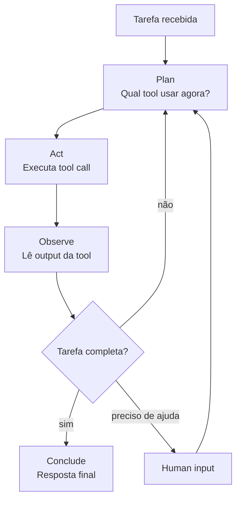
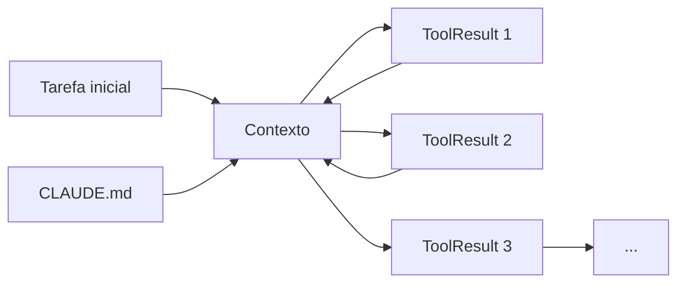
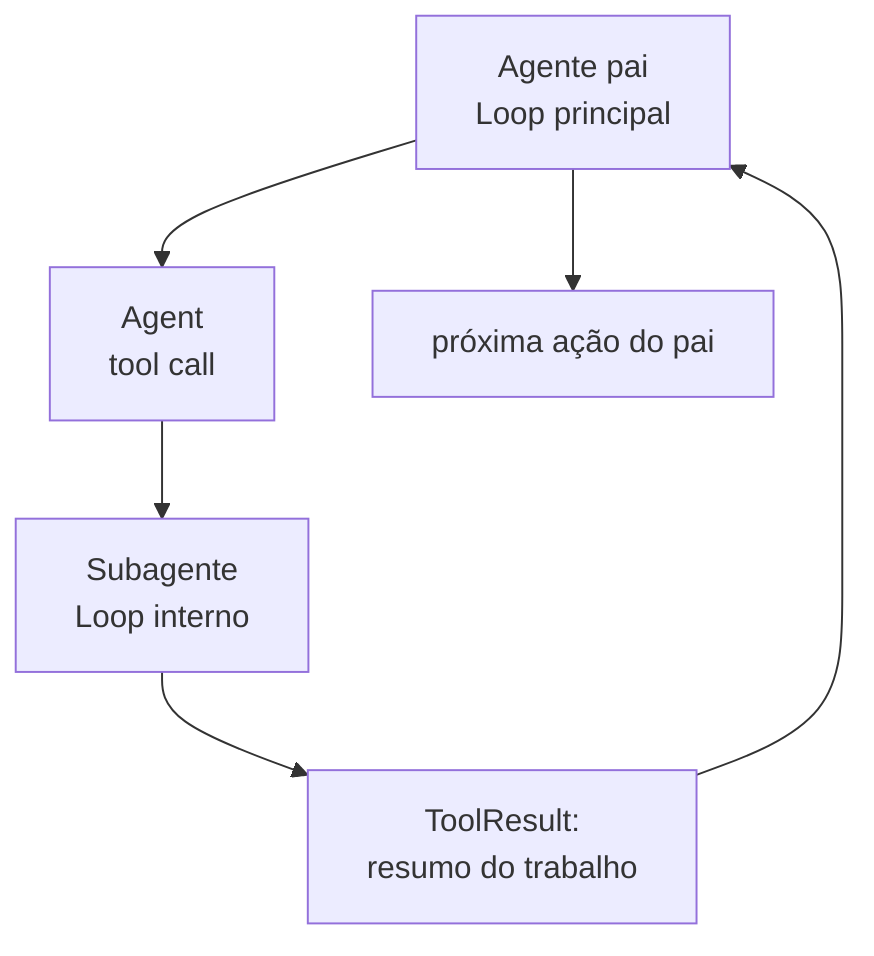
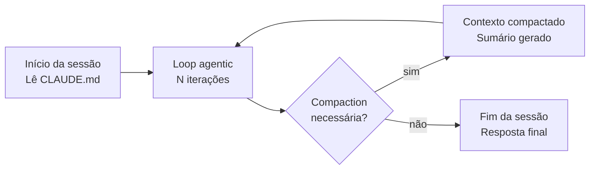

# O loop agentic — plan, act, observe, iterate

> [!abstract] TL;DR
> Claude Code não é um chatbot que gera texto e para. É um agente que executa um loop contínuo: lê a tarefa, planeja uma ação, executa uma tool call, observa o resultado, e decide o próximo passo. Esse ciclo repete até a tarefa estar completa ou o agente precisar de input humano. Entender o loop muda fundamentalmente como você formula pedidos — porque você para de dar instruções passo a passo e começa a dar objetivos.

---

## O que separa um chatbot de um agente

Pense na diferença entre pedir uma receita de bolo a um cozinheiro e contratar o cozinheiro para fazer o bolo.

No primeiro caso, você recebe instruções. Você ainda precisa comprar os ingredientes, ligar o forno, e executar cada etapa. Se você errar na farinha, o cozinheiro não sabe — e não pode corrigir.

No segundo caso, o cozinheiro *age*: vai ao mercado, lê o termômetro do forno, prova a massa, e ajusta. Se a farinha acabar, ele descobre e resolve.

Claude Code é o cozinheiro, não a receita.

Um [[Dicionário de IA#chatbot|chatbot]] recebe sua mensagem, gera uma resposta, e para. Toda ação posterior é sua. Um [[Dicionário de IA#Agent|agente]] recebe um objetivo e age autonomamente para alcançá-lo — lendo arquivos, executando testes, editando código, sem precisar que você especifique cada passo.

O mecanismo que torna isso possível é o **loop agentic**.

---

## As quatro fases do loop

O [[Dicionário de IA#agentic loop|loop agentic]] do [[Dicionário de IA#Claude Code|Claude Code]] tem quatro fases que se repetem:



| Fase | O que acontece |
|------|----------------|
| **Plan** | O agente lê a tarefa, o contexto disponível (CLAUDE.md, histórico), e decide qual tool chamar |
| **Act** | Executa uma [[Dicionário de IA#tool call\|tool call]]: Read, Edit, Bash, Grep, Agent, etc. |
| **Observe** | Lê o output da tool. O resultado entra no contexto como `ToolResult`. |
| **Iterate** | Com base no que observou, decide a próxima ação — ou conclui |

A chave é que a cada iteração o agente tem *mais informação*. Ele começa com a tarefa, lê um arquivo, aprende como o código está organizado, lê outro arquivo, aprende a dependência, e assim por diante. O entendimento é construído *durante* a execução, não antes.

---

## Exemplo completo passo a passo

Tarefa: `fix the failing test in auth.test.ts`

```
Turn 1 — Plan:   "Preciso ver o teste para entender o que falhou."
Turn 1 — Act:    Read("src/auth.test.ts")
Turn 1 — Observe: Teste em linha 47 falha em `validateToken` — esperava `result.valid`

Turn 2 — Plan:   "Preciso ver a implementação de validateToken."
Turn 2 — Act:    Grep("validateToken", "src/")
Turn 2 — Observe: Encontrou em "src/auth.ts:71"

Turn 3 — Plan:   "Leia a implementação."
Turn 3 — Act:    Read("src/auth.ts", offset=65, limit=25)
Turn 3 — Observe: Retorno mudou de `{valid: true}` para `{isValid: true}` em refactor recente

Turn 4 — Plan:   "O teste usa a chave antiga. Corrija."
Turn 4 — Act:    Edit("src/auth.test.ts", old="result.valid", new="result.isValid")
Turn 4 — Observe: Edição aplicada.

Turn 5 — Plan:   "Valide rodando o teste."
Turn 5 — Act:    Bash("npm test src/auth.test.ts")
Turn 5 — Observe: ✓ Passed

Turn 5 — Conclude: "Corrigi a chave `valid` → `isValid` no mock do teste, alinhando com a mudança recente em auth.ts."
```

Cinco turns. Quatorze ações de leitura, busca e edição. Você só deu um objetivo — o agente descobriu o resto.

---

## Vendo o loop em tempo real

Use `--verbose` para inspecionar cada tool call durante a execução:

```bash
claude --verbose "fix the failing test in auth.test.ts"
```

O output mostrará cada chamada de tool e seu resultado antes da resposta final. Isso é indispensável para diagnosticar quando o agente toma um caminho errado.

Para sessões longas, use o modo de debug expandido:

```bash
claude --verbose --debug "add JWT auth to /api/users"
```

---

## Controlando o número de iterações

Por padrão o agente pode fazer quantas iterações precisar. Para tarefas complexas isso é desejável — mas em CI/CD ou contextos automatizados pode ser problema.

```bash
# Limita o agente a 20 turns antes de parar
claude -p "add unit tests to auth module" --max-turns 20
```

Se o agente atingir o limite sem concluir, ele para e reporta onde estava. Você pode retomar com outra chamada.

> [!tip] Calibrando `--max-turns` em CI
> Para pipelines de CI, comece com `--max-turns 30` para tarefas de tamanho médio. Tarefas de revisão de PR costumam terminar em 10-20 turns; implementações novas podem usar 40-60. Monitore com `--verbose` nas primeiras rodadas para calibrar.

---

## Por que o loop importa para como você formula pedidos

Se você entende o loop, você para de fazer isso:

```
❌ "Abra o arquivo src/auth.ts, vá para a linha 47, 
    mude return {valid: true} para return {isValid: true},
    depois abra src/auth.test.ts e mude result.valid para result.isValid."
```

E começa a fazer isso:

```
✅ "O teste validateToken está falhando porque a chave do retorno mudou.
    Corrija e rode os testes para confirmar."
```

A segunda forma é mais curta, mais fácil de escrever, e dá mais autonomia ao agente para descobrir detalhes que você pode não saber (outros arquivos que usam a mesma chave, por exemplo).

**O loop agentic significa que você define o *objetivo*, não o *procedimento*.**

---

## O que entra no contexto em cada iteração

A cada turn, o contexto acumula:



| O que entra no contexto | Impacto em tokens |
|------------------------|-------------------|
| Tarefa inicial | Fixo por sessão |
| CLAUDE.md | Fixo por sessão |
| Cada ToolResult (output de tool calls) | Cresce a cada turn |
| Resposta do agente em cada turn | Cresce a cada turn |

Isso tem implicação direta de custo: cada tool call adiciona tokens ao contexto. Uma sessão com 50 turns custa significativamente mais que uma com 10. Tarefas bem formuladas = menos iterações = menor custo.

---

## O loop em modo headless — quando não há humano na sala

No uso interativo, você vê cada tool call acontecer e pode pressionar `Esc` a qualquer momento. Em modo headless (CI/CD, automação, dispatch via `claude -p`), o loop roda até o fim sem supervisão.

Isso muda o risco. Um loop interativo que vai para o caminho errado custa tempo. Um loop headless que vai para o caminho errado pode commitar código incorreto, deletar arquivos, ou gastar centenas de dólares em tokens antes que alguém perceba.

As salvaguardas para modo headless:
- `--max-turns N` — para o loop após N iterações
- Hooks `PostToolUse` e `Stop` — executam scripts após cada tool call
- `--allowedTools` — restringe quais tools o agente pode usar
- Permissões explícitas em `.claude/settings.json` — controla o que requer confirmação

```bash
# Headless seguro: máximo de turns, tools restritas, sem edições diretas
claude -p "analyze test failures and report" \
  --max-turns 30 \
  --allowedTools "Read,Grep,Bash(npm test)" \
  --output-format json
```

> [!warning] Loop headless sem guardrails
> Um agente rodando em CI com permissões amplas e sem `--max-turns` é como deixar um estagiário sozinho no servidor de produção às 3 da manhã. Ele tem as melhores intenções. Mas se algo der errado, ninguém está lá para pressionar Esc.

---

## O loop em multi-agent — loops dentro de loops

Quando Claude Code usa a tool `Agent` para despachar um subagente, cada subagente tem *seu próprio loop*. O agente pai observa o resultado do subagente como um ToolResult — não as iterações internas.



Isso cria encapsulamento: o pai não precisa gerenciar cada detalhe do que o subagente faz. O subagente tem seu próprio contexto, suas próprias iterações, e retorna um resultado compacto.

**Implicação prática:** tarefas paralelizáveis — "refatore todos os 12 controllers" — podem ser distribuídas para subagentes simultâneos, cada um com seu loop. O pai coordena; os filhos executam. O tempo total cai de O(n) para O(1) (limitado pelo mais lento, não pela soma).

---

## O loop e o custo de tokens

Pense no loop como uma conversa onde cada mensagem cobre o custo de *releitura* de tudo que veio antes. A mensagem 10 paga pelo conteúdo de mensagens 1-9.

Isso significa que:

1. **Outputs longos de Bash são caros** — `npm install` ou `docker build` podem gerar kilobytes de log. Cada token desse log é relido em cada turn subsequente.
2. **Ler arquivos grandes inteiros é ineficiente** — use `Read` com `offset` e `limit` para ler apenas o trecho relevante.
3. **Loops de debugging são os mais caros** — quando o agente tenta várias abordagens para um bug, cada tentativa adiciona ao contexto. Um bom CLAUDE.md reduz isso.

> [!warning] O acumulador silencioso
> O loop agentic é como um gravador de fita magnética sem rebobinar. A cada turn, você grava mais — e paga para tocar a fita inteira novamente. Sessões longas sem `/clear` acumulam contexto que você não está mais usando mas continua pagando.

---

## Armadilhas comuns

> [!warning] Loop aparentemente infinito
> O agente continua iterando sem progredir. Causa quase sempre: tarefa ambígua, ou o agente entrou em um estado onde cada tentativa produz um erro diferente. Diagnóstico: `--verbose`. Solução: `Esc` para interromper e reformule a tarefa com mais contexto.

> [!warning] Suposições silenciosas na fase Plan
> O agente assume algo errado no primeiro turn e nunca revê — porque os ToolResults subsequentes confirmam parcialmente a hipótese errada. Causa: contexto insuficiente. Solução: CLAUDE.md com convenções explícitas, ou mencione o contexto relevante no prompt.

> [!warning] Corrida de edições em multi-agent
> Dois subagentes editam o mesmo arquivo com base em leituras feitas em momentos diferentes. O segundo sobrescreve o trabalho do primeiro. Causa: acesso não coordenado ao mesmo arquivo. Solução: arquitetura com worktrees isolados ou divisão clara de escopo entre subagentes.

> [!warning] Efeito cascata de erro
> O agente comete um erro no turn 3, e todos os turns subsequentes constroem em cima do erro. Nos piores casos, o agente gera código que parece funcionar mas está errado em um nível que os testes não pegam. Solução: revisão humana periódica em tarefas longas — use `/checkpoint` antes de iterações arriscadas.

---

## O papel do humano no loop

Claude Code não foi projetado para substituir o desenvolvedor — foi projetado para tornar o desenvolvedor mais eficiente. A distinção importa porque muda como você estrutura o trabalho.

Em um loop típico:
- **Você define o objetivo** — a tarefa, o contexto, os critérios de sucesso
- **O agente executa** — navega, edita, testa, itera
- **Você revisa** — aprova edições, direciona quando o agente pede ajuda, avalia o resultado

O humano é o supervisor, não o executor. Isso funciona bem quando:
1. O objetivo está claro
2. O CLAUDE.md documentou as convenções do projeto
3. Você tem critérios concretos para avaliar o resultado (testes passando, código revisável)

Quando o humano se ausenta completamente (modo headless), é quando guardrails se tornam essenciais — porque o agente não tem a quem pedir ajuda se travar.

> [!tip] O ponto de intervenção certo
> O loop é mais eficiente quando o humano intervém *no início* (clarificando o objetivo) e *no fim* (revisando o resultado), não no meio de cada iteração. Interrupções frequentes fragmentam o contexto do agente e aumentam o custo cognitivo das duas partes.

---

## O loop como modelo mental para debug

Quando uma sessão vai mal, pense em qual fase do loop o problema ocorreu:

| Fase | Sintoma de problema | Diagnóstico |
|------|---------------------|-------------|
| **Plan** | Agente vai para o arquivo errado, ignora contexto óbvio | CLAUDE.md incompleto ou prompt ambíguo |
| **Act** | Tool call falha (arquivo não encontrado, permissão negada) | Path errado, permissão não configurada |
| **Observe** | Agente "ignora" o que viu | Output da tool muito longo, ficou fora do foco |
| **Iterate** | Agente faz a mesma coisa repetida | Stuck em loop de erro sem saída |

---

## O loop agentic vs outros paradigmas de IA

Vale entender onde o loop agentic se encaixa no espectro de arquiteturas de IA para sistemas de software:

| Paradigma | Mecanismo | Exemplo | Quando usar |
|-----------|-----------|---------|-------------|
| **Completação simples** | Prompt → Resposta. Uma round-trip. | Sugestão de autocomplete | Tarefa sem estado, resultado imediato |
| **Chain-of-Thought** | Prompt com reasoning explícito antes da resposta | Debugging de lógica | Problema de raciocínio, sem ação necessária |
| **RAG** | Retrieve docs → Augment prompt → Generate | Pergunta sobre documentação | Consulta com contexto externo |
| **Loop agentic** | Plan → Act → Observe → Iterate | Claude Code | Tarefa que exige ações sequenciais com adaptação |
| **Multi-agent** | Múltiplos loops coordenados | Vários subagentes em paralelo | Tarefas grandes paralelizáveis |

O loop agentic é especificamente útil quando:
1. A tarefa requer **descoberta** — o agente precisa explorar antes de agir
2. O resultado de uma ação **informa** a próxima — não dá para planejar tudo de antemão
3. Há **validação** intermediária — rodar testes para confirmar antes de continuar

Para tarefas simples de geração de código (escreva uma função que faça X), chain-of-thought puro costuma ser suficiente. O loop agentic brilha quando o agente precisa *interagir com o estado real do sistema* — arquivos existentes, testes que rodam, builds que falham.

---

## Ciclo de vida de uma sessão

Uma sessão Claude Code completa tem um ciclo previsível:



O **compaction** é o mecanismo que permite loops muito longos: quando o contexto fica grande demais, o agente compacta o histórico em um sumário e continua. Isso evita erros de context overflow em tarefas longas, mas com custo: detalhes podem ser perdidos no sumário.

Para tarefas que precisam de alta fidelidade de contexto durante toda a sessão, mantenha os loops curtos — uma tarefa de cada vez — e use `/clear` entre tarefas independentes.

---

## Como explicar em inglês

| Português | Inglês |
|-----------|--------|
| Loop agentic | Agentic loop |
| Fase de planejamento | Planning step / planning phase |
| Chamada de ferramenta | Tool call |
| Resultado da ferramenta | Tool result |
| Iterar | Iterate |
| Concluir | Conclude |
| Número máximo de turnos | Max turns |
| Depurar o loop | Debug the loop / trace tool calls |
| Subagente | Subagent |
| Modo verboso | Verbose mode |

**Frases úteis:**
- "Claude Code uses an agentic loop — it plans, acts, observes the result, and iterates until the task is done."
- "I can see from the verbose output that the agent got stuck in the planning phase — it didn't have enough context about the project structure."
- "Each tool call adds tokens to the context, so longer loops are more expensive."
- "We capped the loop at 30 turns to prevent runaway sessions in CI."
- "The agent dispatched subagents to process each file in parallel — each subagent ran its own loop independently."
- "The verbose flag shows you every tool call in real time, which is essential for debugging why the agent made a wrong turn."

**Descrevendo problemas:**
- "The loop stalled because the agent hit a permission error and couldn't recover without human input."
- "We saw a silent assumption error in the planning step — the agent assumed the test suite used Jest but the project uses Vitest."
- "Context accumulation over 50 turns made the session prohibitively expensive. We split the task into two shorter loops."

**Em pull requests e revisões:**
- "The agent ran a 12-turn loop to implement this feature — you can see the full trace in the verbose log attached to the PR."
- "I interrupted the loop at turn 8 because the agent was going down a rabbit hole with the wrong auth strategy."

---

## Casos práticos

A teoria do Plan/Act/Observe/Iterate é fácil de aceitar em abstrato. Fica mais concreta quando você vê o loop sob pressão real — em produção, sem supervisão constante.

**Cenário 1 — debugging de CI headless**

Um pipeline noturno roda `claude -p "investigate why the nightly build failed" --max-turns 25 --allowedTools "Read,Grep,Bash(npm test),Bash(npm run build)" --output-format json`. O agente entra no loop sozinho: lê o log do build, faz `grep` pelo stack trace, lê o arquivo apontado, roda o teste isolado para confirmar a hipótese, e conclui com um relatório — sem nunca editar nada, porque `--allowedTools` não inclui `Edit`.

Na prática, a primeira hipótese do agente estava errada: o log mostrava falha em `payment.test.ts`, mas a causa raiz era uma variável de ambiente ausente no runner de CI, não no código. O agente só chegou lá porque a fase **Observe** do turn 4 (output de `npm run build` com um `ENV var not set` enterrado no meio do log) contradisse a hipótese do turn 2. Sem `--verbose` — que não faz sentido em headless — a forma de auditar isso depois foi ler o `--output-format json`, que registra cada tool call da sessão. Esse é o motivo de nunca rodar headless sem `--max-turns`: se o agente tivesse entrado num loop de tentativa-e-erro sobre a hipótese errada, o pipeline ficaria preso até o timeout do CI, não do agente.

**Cenário 2 — refactor multi-agent em paralelo**

Uma tarefa como "renomeie `UserService.validate()` para `UserService.authenticate()` nos 14 controllers que o chamam" é candidata natural a fan-out: o agente pai despacha 14 subagentes via `Agent` tool, cada um com escopo isolado (um controller por subagente) e seu próprio loop interno.

O risco descrito na seção de armadilhas — corrida de edições — aparece exatamente aqui se dois controllers importarem um helper compartilhado. Um subagente que precisa editar `shared/authHelpers.ts` além do seu controller entra em conflito com outro subagente fazendo a mesma coisa a partir de uma leitura desatualizada. A mitigação prática não é impedir o fan-out, mas desenhar o escopo antes de despachar: o pai identifica arquivos compartilhados na fase de planejamento e ou (a) edita esses arquivos ele mesmo antes de despachar os subagentes, ou (b) usa worktrees isolados por subagente e resolve o merge no fim. O ganho de tempo é real — 14 loops paralelos em vez de 14 sequenciais — mas só se paga sem retrabalho quando o escopo de cada loop filho é genuinamente independente.

---

## Checklist: trabalhando bem com o loop agentic

Antes de iniciar uma sessão:
- [ ] **A tarefa está formulada como objetivo**, não como sequência de passos
- [ ] **O CLAUDE.md existe e está atualizado** — reduz iterações de exploração
- [ ] **Critérios de sucesso estão claros** — testes passando? Arquivo criado? Comportamento verificável?

Durante a sessão:
- [ ] **Em modo headless**: `--max-turns` configurado, tools restritas ao mínimo necessário
- [ ] **Em sessões longas**: usando `/clear` entre tarefas independentes para evitar acúmulo de contexto
- [ ] **Para debugging**: `--verbose` ligado para ver cada tool call

Para paralelo e automação:
- [ ] Subagentes com escopo isolado para evitar conflito de edição no mesmo arquivo
- [ ] Hooks PostToolUse e Stop configurados para logging e guardrails em headless

---

## O que vem a seguir

Entender o loop responde "como o agente age?" — mas cada `Plan` do ciclo depende de uma pergunta anterior: *o que o agente já sabe sobre este repositório antes do primeiro turn?* A primeira fase do loop não parte do zero. Ela lê CLAUDE.md, explora a árvore de arquivos, e monta um modelo do codebase que molda toda decisão subsequente.

É esse processo de leitura — como Claude Code decide o que explorar, o que ignorar, e em que ordem — que a próxima nota cobre: [[03-Dominios/Tecnologia/IA/Claude Code/Mental Model/02 - Como Claude Code lê um codebase|02 - Como Claude Code lê um codebase]].

> [!tip] Vídeo: agent loops explicados
> "Finally. Agent Loops Clearly Explained" (YouTube) percorre visualmente o ciclo reason→act→observe que fundamenta o loop agentic e conecta com o paper original do ReAct (Yao et al., 2023) — bom complemento em vídeo para quem prefere ver o diagrama animado antes do texto. https://www.youtube.com/watch?v=EuzYhzB0vbI

---

## Veja também

- [[03-Dominios/Tecnologia/IA/Claude Code/Mental Model/02 - Como Claude Code lê um codebase|02 - Como Claude Code lê um codebase]]
- [[03-Dominios/Tecnologia/IA/Claude Code/Mental Model/03 - Tool use|03 - Tool use]]
- [[03-Dominios/Tecnologia/IA/Claude Code/Mental Model/04 - Context window|04 - Context window]]
- [[03-Dominios/Tecnologia/IA/Claude Code/Mental Model/07 - Tokens e custo|07 - Tokens e custo]]
- [[03-Dominios/Tecnologia/IA/Claude Code/Workflows/07 - Sub-agents e dispatch|07 - Sub-agents e dispatch]]
- [[03-Dominios/Tecnologia/IA/Claude Code/Mental Model/index|Mental Model]] — índice do galho

---

## Referências

- **Anthropic** — *Claude Code overview* (2026). Loop agentic e tool use — https://docs.anthropic.com/pt/docs/claude-code/overview
- **Anthropic** — *Agentic patterns* (2026). Frameworks para design de agentes autônomos — https://docs.anthropic.com/pt/docs/build-with-claude/agents
- **Anthropic** — *Claude Code CLI reference* (2026). Flags `--verbose`, `--debug`, `--max-turns` — https://docs.anthropic.com/pt/docs/claude-code/cli-reference
- **Anthropic** — *Claude Code hooks* (2026). PostToolUse e Stop hooks para controle em headless — https://docs.anthropic.com/pt/docs/claude-code/hooks
- **Yao et al.** — *ReAct: Synergizing Reasoning and Acting in Language Models*. ICLR 2023. Artigo seminal que formalizou o padrão Plan/Act/Observe em LLMs — https://arxiv.org/abs/2210.03629
- **Shinn et al.** — *Reflexion: Language Agents with Verbal Reinforcement Learning*. NeurIPS 2023. Extensão do ReAct com auto-reflexão — https://arxiv.org/abs/2303.11366
- **Wang et al.** — *A Survey on Large Language Model based Autonomous Agents*. 2023. Panorama de arquiteturas agênticas incluindo loops Plan-Act-Observe — https://arxiv.org/abs/2308.11432
- **YouTube** — *Finally. Agent Loops Clearly Explained*. Vídeo explicando visualmente o ciclo reason/act/observe dos agent loops — https://www.youtube.com/watch?v=EuzYhzB0vbI
