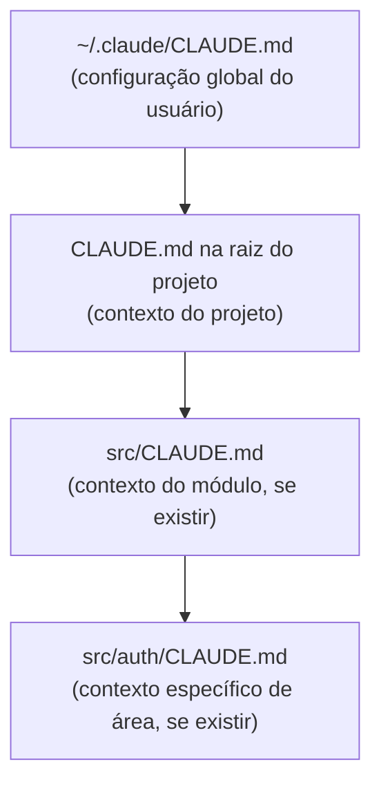

# Como Claude Code lê um codebase

> [!abstract] TL;DR
> Claude Code não indexa o projeto como uma IDE. Ele navega sob demanda: usa Glob para listar arquivos por padrão, Grep para localizar símbolos, e Read para ler apenas o trecho relevante. O CLAUDE.md funciona como o "documento de onboarding" que o agente lê antes de qualquer outra coisa. Sem CLAUDE.md bem escrito, o agente descobre a estrutura do projeto do zero a cada sessão — mais caro, mais lento, e menos consistente.

---

## A diferença entre uma IDE e um agente

Uma IDE mantém um índice persistente do seu projeto. Quando você abre o VS Code em um projeto TypeScript com 400 arquivos, ele constrói uma árvore de símbolos em background: quais funções existem, quais arquivos as importam, quais interfaces são implementadas onde. Esse índice fica na memória e é atualizado incrementalmente quando você salva.

[[Dicionário de IA#Claude Code|Claude Code]] **não tem esse índice**. Cada sessão começa do zero. Não há memória persistente de sessões anteriores, não há mapa pré-construído do projeto, não há indexação de símbolos.

Isso parece uma desvantagem — e é, em alguns aspectos. Mas é uma escolha deliberada de design com consequências positivas:

- O agente pode trabalhar em **qualquer projeto** sem configuração prévia
- O "índice" que ele constrói é **sempre atualizado** — ele leu o arquivo agora, não há defasagem
- O contexto é **controlado** — o agente lê apenas o que é relevante para a tarefa, não carrega megabytes de informação irrelevante

A contrapartida é que você precisa ajudá-lo com o CLAUDE.md.

---

## Como o agente explora na prática

Quando você dá uma tarefa como "adicione validação ao endpoint /api/users", o agente não tem como saber onde esse endpoint está sem explorar. O padrão de exploração típico:

```
Step 1 — Orientação geral
LS(".")                          → estrutura raiz do projeto
LS("src/")                       → subdiretorios de código

Step 2 — Localizar o endpoint
Glob("src/**/*.ts")              → todos os arquivos TypeScript
Grep("router.*users", "src/")    → busca a rota
→ Encontra: src/routes/users.ts

Step 3 — Ler o que importa
Read("src/routes/users.ts")      → lê o arquivo de rota
Read("src/controllers/users.ts") → lê o controller referenciado

Step 4 — Entender dependências
Grep("UserSchema", "src/")       → onde está o schema de validação?
→ Encontra: src/schemas/user.schema.ts
Read("src/schemas/user.schema.ts") → lê o schema
```

Note que o agente leu **4 arquivos** de um projeto com potencialmente centenas. Ele não varreu tudo — foi diretamente ao que a tarefa requeria.

Esse padrão de navegação dirigida é o que o torna eficiente em tokens. Mas requer que o projeto tenha uma estrutura razoavelmente convencional ou que o CLAUDE.md explique onde as coisas estão.

---

## O CLAUDE.md como mapa do projeto

Se o agente precisa explorar para encontrar a rota do usuário, ele vai gastar 4-6 tool calls antes de começar o trabalho real. Com um CLAUDE.md bem escrito, o agente já sabe:

```markdown
# CLAUDE.md

## Estrutura
- Rotas: src/routes/
- Controllers: src/controllers/
- Schemas Zod: src/schemas/
- Testes: test/ (vitest)
- Build: npm run build
- Lint: npm run lint
- Test: npm test
```

Com essa informação, o agente vai direto para `src/routes/users.ts` sem precisar explorar. Isso significa menos tool calls, menos tokens, e sessões mais rápidas.

### O que colocar no CLAUDE.md

| Categoria | Exemplo | Por que ajuda |
|-----------|---------|---------------|
| **Estrutura de pastas** | "Routes em src/routes/, schemas em src/schemas/" | Elimina exploração inicial |
| **Convenções de naming** | "Arquivos de controller: nome.controller.ts" | Reduz Greps de localização |
| **Comandos importantes** | "npm test, npm run lint, npm run build" | Agente usa diretamente sem procurar |
| **O que não fazer** | "Não modifique diretamente src/generated/" | Previne erros de arquivos auto-gerados |
| **Padrões arquiteturais** | "Todo handler usa Result<T, E>, nunca throw" | Garante consistência no código gerado |
| **Dependências incomuns** | "Usamos kysely para DB, não prisma" | Evita que o agente assuma ORM padrão |

> [!tip] CLAUDE.md não é documentação — é onboarding
> Escreva o CLAUDE.md como se fosse a conversa que você teria com um dev novo no primeiro dia. O que ele precisa saber para não cometer os erros óbvios? Quais são as armadilhas que não estão no código em si?

> [!tip] Vídeo — como o agente navega codebases grandes
> [Anthropic Just Dropped a Masterclass on Building Agent Harnesses (for Large Codebases)](https://www.youtube.com/watch?v=efRIrLXoOVA) detalha o playbook da própria Anthropic para usar Claude Code em codebases grandes — incluindo por que a navegação agentic (Glob/Grep/Read sob demanda) supera indexação tradicional em projetos que mudam rápido, e como estruturar CLAUDE.md e subagentes para reduzir a exploração inicial.

---

## Hierarquia de leitura do CLAUDE.md

O agente lê os arquivos CLAUDE.md em ordem, do mais geral para o mais específico:



Os mais específicos podem sobrescrever ou complementar os mais gerais. Para projetos grandes com áreas de código muito diferentes (ex: microserviços num monorepo), CLAUDE.md por pasta permite dar contexto específico para cada área sem sobrecarregar o global.

---

## Leitura seletiva com Read

A tool `Read` é a ferramenta central de leitura e tem parâmetros que permitem leitura parcial:

```python
# Ler arquivo inteiro
Read("src/auth.ts")

# Ler apenas linhas 100-150
Read("src/auth.ts", offset=100, limit=50)

# Resultado: apenas 50 linhas no contexto em vez de 400
```

Isso é importante porque o Claude Code **prefere ler o mínimo necessário**. Se o agente sabe que a função que interessa está na linha 100 (porque encontrou via Grep), ele lê apenas aquele trecho — não o arquivo inteiro.

Comparação de custo para um arquivo de 400 linhas onde a função relevante está nas linhas 100-130:

| Abordagem | Linhas no contexto | Impacto |
|-----------|-------------------|---------|
| `Read("auth.ts")` inteiro | 400 linhas | Alto custo, muita informação irrelevante |
| `Read("auth.ts", 100, 50)` | 50 linhas | Baixo custo, contexto cirúrgico |
| `Bash("cat auth.ts")` | 400 linhas | Igual ao inteiro, sem opção de range |

> [!warning] Bash cat vs Read
> O agente deve usar `Read` em vez de `Bash("cat arquivo")`. O `cat` lê o arquivo inteiro, sempre. O `Read` permite especificar o range. Para arquivos grandes, isso pode fazer diferença de 10× no número de tokens consumidos.

---

## Grep como ferramenta de localização

Antes de ler um arquivo, o agente frequentemente usa `Grep` para encontrar onde algo está definido:

```python
# Encontrar onde validateToken está implementado
Grep("validateToken", "src/")
# Output: src/auth/validators.ts:47: export function validateToken

# Agora lê só o trecho relevante
Read("src/auth/validators.ts", offset=40, limit=30)
```

O `Grep` opera no sistema de arquivos (não na memória do agente) — é rápido e barato. Um bom Grep encontra em segundos o que levaria dezenas de Reads para localizar.

Padrões úteis de Grep:

| Padrão | O que encontra |
|--------|----------------|
| `"function validateToken"` | Definição da função |
| `"import.*validateToken"` | Todos os imports |
| `"validateToken\("` | Todos os call sites |
| `"router\.post.*users"` | Rotas POST para /users |
| `"@Controller.*users"` | Controllers NestJS para users |

---

## CLAUDE.md em diferentes tipos de projeto

A estrutura do CLAUDE.md ideal varia com o tipo de projeto. Alguns templates práticos:

**Projeto Node.js/TypeScript típico:**
```markdown
# Projeto

## Stack
- Runtime: Node.js 22, TypeScript 5.5
- Framework: Fastify (não Express)
- ORM: Drizzle (não Prisma)
- Testes: Vitest

## Estrutura
- src/routes/ — definição de rotas HTTP
- src/handlers/ — lógica de cada endpoint
- src/db/ — queries com Drizzle
- src/schemas/ — validação com Zod
- test/ — testes unitários e de integração

## Comandos
- npm test — roda todos os testes
- npm run lint — ESLint + Prettier
- npm run build — compila TypeScript

## Convenções
- Handlers retornam Result<T, E> (biblioteca neverthrow), nunca throw
- Schemas Zod são a única fonte de validação — não valide manualmente
- Não modifique src/db/generated/ — é auto-gerado pelo drizzle-kit
```

**Monorepo com pacotes:**
```markdown
# Monorepo

## Pacotes
- packages/core — lógica compartilhada
- packages/api — servidor HTTP
- packages/web — frontend Next.js
- packages/cli — ferramenta de linha de comando

## Comandos (da raiz)
- npm run test --workspace=packages/api
- npm run build --workspace=packages/core
- turbo run build — builda todos em paralelo

## Importante
- Alterações em packages/core podem quebrar múltiplos pacotes — sempre rode o build completo
- packages/web usa Server Components por padrão — componentes client-side precisam de "use client"
```

**API com banco de dados:**
```markdown
## Banco de dados
- PostgreSQL 16 via Drizzle ORM
- Migrations em db/migrations/ (nunca edite manualmente)
- Para criar migration: npm run db:generate
- Para rodar migration: npm run db:migrate
- Schema: db/schema.ts — fonte de verdade dos tipos

## Variáveis de ambiente
- DATABASE_URL, REDIS_URL, JWT_SECRET
- Não commite .env — use .env.example como referência
```

---

## O agente como leitor seletivo

Uma forma de pensar sobre como o agente lê o codebase: imagine que você tem 30 minutos para entender um projeto novo e resolver um bug específico. Você não vai ler todos os 400 arquivos. Você vai:

1. Olhar o README/documentação para orientação geral
2. Ir direto para a área do bug
3. Seguir as dependências relevantes
4. Ler o código mínimo necessário para entender o problema

O agente faz exatamente isso — mas em segundos, via tool calls. O CLAUDE.md é o README que ele lê primeiro.

A diferença entre um engenheiro experiente e um júnior nessa tarefa? O experiente sabe *onde olhar*. Com um bom CLAUDE.md, você dá ao agente o conhecimento tácito do experiente — onde as coisas estão, quais as armadilhas, o que não tocar.

---

## Comparação: com vs sem CLAUDE.md

Mesma tarefa: "Adicione paginação ao endpoint GET /api/products"

| Aspecto | Sem CLAUDE.md | Com CLAUDE.md bem escrito |
|---------|--------------|--------------------------|
| Tool calls de exploração | 8-12 | 1-2 |
| Tokens consumidos (estimativa) | ~4.000 | ~400 |
| Risco de usar padrão errado | Alto (pode usar Prisma num projeto Drizzle) | Baixo (documentado) |
| Tempo até começar o trabalho real | ~45s | ~5s |
| Consistência entre sessões | Baixa | Alta |

Esses números são estimativas — variam com o tamanho e complexidade do projeto. Mas a direção é constante: CLAUDE.md reduz exploração e aumenta consistência.

A regra prática que emerge: **1 hora de escrever um bom CLAUDE.md economiza horas de exploração ao longo de semanas de uso**. Em projetos ativos onde você usa Claude Code diariamente, o CLAUDE.md é o investimento com maior retorno por hora.

---

## O que o agente NÃO lê automaticamente

Alguns arquivos existem no projeto mas o agente não vai ler sem ser instruído:

- **Arquivos fora do diretório atual** — o agente opera a partir do diretório onde foi iniciado
- **Arquivos em `.gitignore`** — ele pode listá-los mas normalmente evita
- **Arquivos binários** — não são lidos via Read
- **Arquivos muito grandes** — o agente pode lê-los parcialmente mas pode ter dificuldade com archives de log ou dumps de banco

E o que ele **lê automaticamente** no início de cada sessão:
- `CLAUDE.md` (todos os níveis da hierarquia que existirem)
- `settings.json` da pasta `.claude/`
- Arquivos mencionados explicitamente no prompt

Se há um arquivo crítico que o agente precisa conhecer (ex: um schema de banco de dados central, um enum de tipos usado em todo o projeto), mencione-o no CLAUDE.md ou no prompt.

---

## Armadilhas comuns

> [!warning] Projeto grande sem CLAUDE.md
> O agente gasta os primeiros 8-12 tool calls só descobrindo a estrutura básica. Em projetos com mais de 100 arquivos, essa exploração inicial pode consumir tokens suficientes para distorcer o custo da sessão.

> [!warning] Estrutura não convencional
> Frameworks caseiros, monorepos com layout incomum, pastas com nomes que contradizem seu conteúdo — tudo isso confunde a exploração. Um CLAUDE.md que explica "apesar do nome, a pasta utils/ contém a lógica de negócio central" previne loops de confusão.

> [!warning] CLAUDE.md desatualizado
> Pior que não ter. Um CLAUDE.md que descreve a estrutura de 6 meses atrás induz o agente a procurar arquivos em lugares errados e a assumir convenções que não existem mais. Trate-o como código: revise quando a arquitetura muda.

> [!warning] Assumir que o agente "lembrou" de outra sessão
> Cada sessão começa do zero. O agente não sabe que você discutiu a arquitetura de auth ontem. Se há contexto que importa, ele precisa estar no CLAUDE.md ou no prompt.

> [!warning] Arquivo crítico não mencionado
> "O schema do banco está em db/schema.ts" parece óbvio para você, mas o agente pode não encontrá-lo sem exploração. Se um arquivo é central para as tarefas que você faz com frequência, documente-o no CLAUDE.md.

---

## Como explicar em inglês

| Português | Inglês |
|-----------|--------|
| Navega sob demanda | Navigates on demand |
| Exploração incremental | Incremental exploration |
| Mapa do projeto | Project map / codebase map |
| Leitura parcial | Partial read / ranged read |
| Arquivo de onboarding | Onboarding doc |
| Estrutura de pastas | Directory structure / folder layout |
| Convencão de naming | Naming convention |
| Padrão arquitetural | Architectural pattern |
| Contexto do projeto | Project context |
| Exploração inicial | Initial exploration / project discovery |

**Frases úteis:**
- "Claude Code doesn't index the project upfront — it explores on demand using Glob, Grep, and Read."
- "A well-written CLAUDE.md eliminates the initial exploration phase and cuts the number of tool calls significantly."
- "The agent used a ranged Read to pull just lines 100-130 instead of loading the whole 400-line file."
- "Our CLAUDE.md documents the folder structure, naming conventions, and key commands — the agent rarely needs to explore anymore."
- "Without a CLAUDE.md, the agent spent 10 tool calls just mapping the project structure before doing any real work."
- "We keep separate CLAUDE.md files per package in our monorepo — the agent gets the right context depending on where it's working."
- "Think of CLAUDE.md as the onboarding doc you wish existed on day one — except the new hire is an AI that forgets everything between sessions."
- "I added the folder structure to CLAUDE.md and the first tool call is now `Read('src/routes/users.ts')` instead of 10 Glob and Grep calls."

**Ao descrever problemas de contexto:**
- "The agent defaulted to Prisma because our CLAUDE.md didn't mention we use Drizzle — classic missing context."
- "The CLAUDE.md was outdated and still referenced the old folder structure, which threw the agent off in the first few turns."
- "We added the key commands to CLAUDE.md and now the agent runs `npm test` correctly instead of looking for package.json every time."

---

## Checklist: configurando um projeto para Claude Code

Antes de começar a usar Claude Code em um projeto:
- [ ] **CLAUDE.md existe na raiz** com estrutura de pastas, stack e comandos principais
- [ ] **Convenções não-óbvias documentadas** — padrões que um dev novo quebraria sem saber
- [ ] **O que não fazer está listado** — arquivos auto-gerados, pastas que não devem ser editadas
- [ ] **Comandos de build, lint e test documentados** — o agente os usará para validar seu trabalho
- [ ] **CLAUDE.md está no .gitignore ou versionado?** — para projetos compartilhados, versionar é melhor
- [ ] **CLAUDE.md por subpasta** em áreas muito específicas de projetos grandes

Durante o uso:
- [ ] **Atualizar CLAUDE.md quando a estrutura muda** — nunca deixar desatualizado
- [ ] **Revisar exploração inicial** via `--verbose` nas primeiras sessões — se o agente explorou muito, o CLAUDE.md pode estar incompleto
- [ ] **Adicionar armadilhas novas ao CLAUDE.md** sempre que o agente cometer um erro por falta de contexto

---

## Comparação com outros agentes de codificação

| Agente | Como lê o codebase | Índice persistente? | Vantagem | Limitação |
|--------|-------------------|---------------------|----------|-----------|
| **Claude Code** | On demand via Glob/Grep/Read | Não | Leve, sempre atualizado | Custo de exploração por sessão |
| **Cursor** | Índice embeddings + on demand | Sim | Busca semântica no projeto | Índice pode ficar desatualizado |
| **Windsurf Cascade** | Índice semântico + tool calls | Sim | Context retrieval automático | Dependente da qualidade do índice |
| **GitHub Copilot** | Contexto de arquivo aberto | Não (foco em janela) | Baixo overhead | Contexto muito limitado |
| **Devin** | Clona repo, mantém estado entre turns | Sim (no ambiente) | Ambiente completo | Muito mais caro por sessão |

Claude Code está no polo "sem índice / máxima flexibilidade". Para projetos que você usa com frequência, compensar com um bom CLAUDE.md é o equivalente a ter um índice — só que escrito em linguagem natural, controlado por você, e sempre preciso.

A questão não é "índice vs sem índice" — é "quem mantém o índice?". Em IDEs com índice automático, o índice pode ficar desatualizado silenciosamente. Com CLAUDE.md, você controla o que o agente sabe — e sabe exatamente o que está lá e quando foi atualizado.

---

## Casos práticos

**Cenário 1 — Monorepo grande com múltiplos pacotes**

Imagine um monorepo com 6 pacotes (`packages/core`, `packages/api`, `packages/web`, `packages/cli`, `packages/shared-ui`, `packages/worker`), cada um com sua própria stack e convenções. Sem um CLAUDE.md por pacote, toda tarefa começa com o agente perguntando "isso é Next.js ou é o worker em Node puro?" — e descobre isso via Glob e Read do `package.json` de cada pacote candidato, gastando tool calls só para se orientar.

Na prática, o padrão que funciona é um CLAUDE.md na raiz com o mapa geral dos pacotes e os comandos do monorepo (`turbo run build`, `npm run test --workspace=X`), mais um CLAUDE.md dentro de cada pacote com as convenções locais (ex: `packages/web/CLAUDE.md` avisando que componentes client-side precisam de `"use client"`). Quando você pede "adicione um botão de exportar CSV na tela de relatórios", o agente lê o CLAUDE.md da raiz, identifica que a tarefa é em `packages/web`, e só então lê o CLAUDE.md local — chegando ao arquivo certo em 2-3 tool calls em vez de 10+.

**Cenário 2 — Projeto legado sem CLAUDE.md**

Um sistema legado de 5 anos, sem CLAUDE.md, com uma pasta `utils/` que na verdade concentra boa parte da lógica de negócio (resultado de refactors sucessivos que nunca renomearam a pasta) e um `services/` que mistura chamadas HTTP com regras de validação. Não há convenção visível — dois módulos usam Promises encadeadas, três usam async/await, um usa callbacks.

Sem CLAUDE.md, o agente trata `utils/` como utilitário genérico e pode ignorá-lo numa busca por "lógica de pagamento", porque o nome da pasta engana tanto quanto engana um dev novo no primeiro dia. O ganho aqui não é reduzir tool calls (a exploração de um legado é inevitável na primeira tarefa) — é registrar, depois da primeira exploração, o que foi descoberto: "apesar do nome, `utils/payment.ts` contém as regras de cobrança" e "prefira async/await em código novo; o callback em `services/legacy-mailer.ts` é o único que resta e não deve ser copiado como padrão". Cada sessão subsequente parte desse conhecimento em vez de redescobrir a mesma armadilha.

---

## O que vem a seguir

Até aqui, o foco foi em **como o agente encontra e lê** o código — Glob, Grep, Read e o papel do CLAUDE.md como mapa. Mas ler não é a única coisa que o agente faz com o codebase: ele também precisa *agir* sobre ele — editar arquivos, rodar testes, executar comandos de build. Essas ações passam por um conjunto diferente de tools, com suas próprias regras de uso e armadilhas.

A próxima nota, [[03-Dominios/Tecnologia/IA/Claude Code/Mental Model/03 - Tool use|03 - Tool use]], detalha esse repertório de ferramentas — o que cada tool faz, quando o agente escolhe uma em vez de outra, e como o modelo decide encadear chamadas para completar uma tarefa.

## Veja também

- [[03-Dominios/Tecnologia/IA/Claude Code/Mental Model/01 - O loop agentic|01 - O loop agentic]]
- [[03-Dominios/Tecnologia/IA/Claude Code/Mental Model/03 - Tool use|03 - Tool use]]
- [[03-Dominios/Tecnologia/IA/Claude Code/Configuração/02 - CLAUDE.md anatomia|02 - CLAUDE.md anatomia]]
- [[03-Dominios/Tecnologia/IA/Claude Code/Configuração/03 - CLAUDE.md receitas|03 - CLAUDE.md receitas]]
- [[03-Dominios/Tecnologia/IA/Claude Code/Mental Model/index|Mental Model]] — índice do galho

---

## Fontes

- **Anthropic** — *Memory and CLAUDE.md* (2026). Como o agente lê e usa os arquivos de contexto — https://docs.anthropic.com/pt/docs/claude-code/memory
- **Anthropic** — *Claude Code overview* (2026). Ferramentas de navegação e leitura — https://docs.anthropic.com/pt/docs/claude-code/overview
- **Anthropic** — *Claude Code settings* (2026). Hierarquia de configuração e CLAUDE.md por pasta — https://docs.anthropic.com/pt/docs/claude-code/settings
- **Cursor** — *Codebase indexing* (2026). Como IDEs mantêm índice persistente vs. navegação on-demand de agentes — https://docs.cursor.com/context/codebase-indexing
- **Windsurf** — *Cascade context engine* (2026). Recuperação semântica de contexto em IAs com índice persistente — https://docs.windsurf.com/windsurf/context
- **Paul Gauthier (Aider)** — *How Aider uses the repo map*. Explicação de como o Aider constrói um mapa do repositório para guiar o agente — https://aider.chat/docs/repomap.html
- **Anthropic** — *Claude Code best practices* (2026). Exemplos de CLAUDE.md eficazes para diferentes tipos de projeto — https://docs.anthropic.com/pt/docs/claude-code/best-practices

