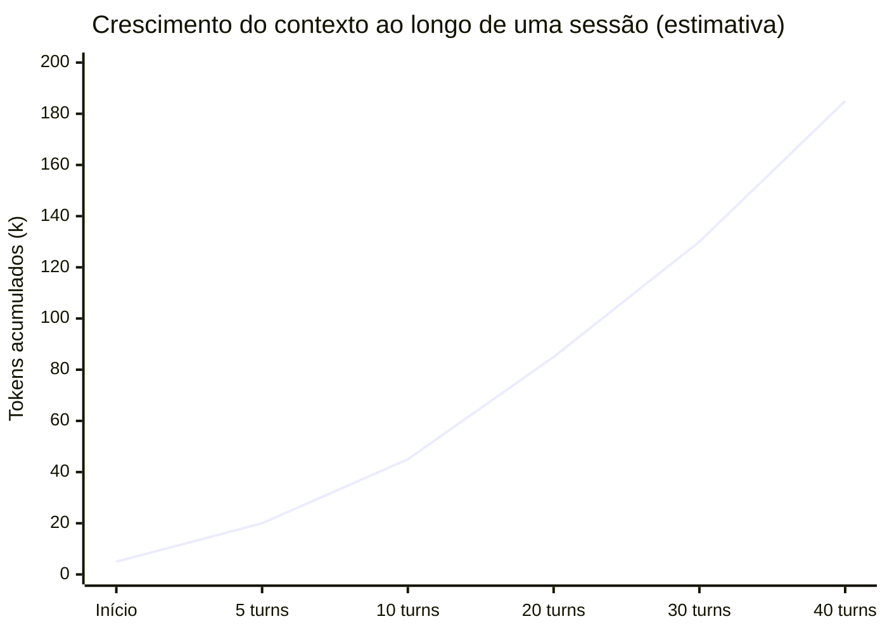

# Context window — o que entra, o que sai, por que isso importa

> [!abstract] TL;DR
> A context window é a memória de trabalho do Claude Code: tudo que o agente "sabe" em uma sessão cabe nela. Sistema prompt, CLAUDE.md, histórico de conversa, e todos os outputs de tool calls consomem tokens desse espaço. Quando a janela fica cheia, o agente esquece ou a sessão precisa ser compactada. Gerenciar contexto é gerenciar a qualidade, a velocidade e o custo das sessões.

---

## A memória de trabalho do agente

Pense na context window como a mesa de trabalho do agente. O tamanho da mesa é fixo — nos modelos Claude mais recentes, em torno de 200 mil tokens. Tudo que o agente precisa para trabalhar precisa caber nessa mesa: o pedido que você fez, os arquivos que ele leu, os resultados dos testes que rodou, as edições que já fez.

No início da sessão, a mesa está vazia exceto pelo system prompt e pelo CLAUDE.md. A cada iteração do loop agentic, mais coisas chegam à mesa: o resultado de um Read aqui, o output de um Bash ali. A mesa vai ficando mais cheia.

Quando a mesa fica quase cheia, o agente tem duas opções: compactar o histórico em um resumo (ver [[03-Dominios/Tecnologia/IA/Claude Code/Mental Model/06 - Compaction|06 - Compaction]]) ou parar. Nenhuma das duas é gratuita.

A diferença entre a context window e a RAM do seu computador: quando a RAM acaba, seu programa trava ou começa a usar swap. Quando a context window acaba, o agente perde informação antiga ou precisa ser reiniciado. Gerenciar a janela de contexto é uma habilidade real.

Uma nuance importante: o agente paga pelos tokens de *input* (o contexto acumulado) em *cada* chamada à API, não apenas uma vez. Isso significa que um contexto de 100k tokens não custa uma vez — custa a cada novo turno. O custo de uma sessão é a soma de todos os contextos de input de todas as chamadas.

O incentivo é claro: **contextos menores e sessões focadas são exponencialmente mais baratos que sessões longas com contexto acumulado.**

---

## O que entra no contexto

Cada chamada à API inclui o contexto acumulado:

```
Chamada 1:  [system prompt] [CLAUDE.md] [turno 1]
Chamada 2:  [system prompt] [CLAUDE.md] [turno 1] [ToolResult 1] [turno 2]
Chamada 3:  [system prompt] [CLAUDE.md] [turno 1] [ToolResult 1] [turno 2] [ToolResult 2] [turno 3]
Chamada N:  [system prompt] [CLAUDE.md] [turnos 1..N-1] [ToolResults 1..N-1] [turno N]
```

Componentes e seus tamanhos típicos:

| Componente | Tokens típicos | Características |
|------------|----------------|-----------------|
| System prompt do Claude Code | ~2.000–5.000 | Fixo por sessão |
| CLAUDE.md global | 500–3.000 | Fixo por sessão, depende do que você escreveu |
| CLAUDE.md do projeto | 500–5.000 | Fixo por sessão |
| Mensagens do usuário | 50–500 por turno | Cresce linearmente |
| Respostas do modelo | 200–2.000 por turno | Cresce linearmente |
| ToolResults (Read, Grep, Bash) | **Mais variável** | O maior fator de crescimento |

---

## O que mais consome contexto

**Leituras de arquivo sem range**
`Read("src/huge-service.ts")` num arquivo de 2.000 linhas pode adicionar 40k+ tokens de uma vez. Um único arquivo grande pode consumir 20% da janela disponível.

**Bash com output verboso**
Instalar pacotes, compilar, rodar testes com saída detalhada — o stdout completo vai para o contexto. `npm ci` em um projeto com muitas dependências pode gerar 5.000+ linhas de output.

**Grep com muitos resultados**
`Grep("import", "src/")` num projeto grande retorna centenas de linhas. O Grep retorna *todos* os matches — sem filtro, pode ser ruído caro.

**Sessões longas de debugging**
Uma sessão com 40 tool calls, onde cada erro gerou uma tentativa de correção, pode facilmente acumular 150k+ tokens — mais de 75% da janela disponível.



---

## Por que isso importa em três dimensões

### 1. Custo

Você paga por tokens de **input** em cada chamada à API. Em uma sessão que acumula 150k tokens de contexto e tem 20 turnos, você está pagando pela releitura de ~150k tokens de input por chamada — mesmo que o agente use apenas os últimos 2k de contexto para decidir o próximo passo.

O custo de uma sessão longa não é linear com o número de turnos — é quadrático (cada novo turno paga pelo contexto *cumulativo* até aquele ponto).

Sessão com 20 turnos, 10k tokens de contexto acumulado por turno:
- Turno 1: 5k tokens de input
- Turno 10: 100k tokens de input
- Turno 20: 200k tokens de input
- **Total acumulado: ~2.100k tokens de input**

Mesma sessão dividida em 2 sessões de 10 turnos cada:
- Sessão 1 total: ~550k tokens de input
- Sessão 2 total: ~550k tokens de input
- **Total: ~1.100k tokens de input** — quase metade

### 2. Qualidade

Com contexto muito próximo do limite, o modelo começa a perder detalhes de turnos anteriores. Uma instrução dada no turno 3 — "não use variáveis globais neste módulo" — pode ser esquecida no turno 35. O agente não "decide" ignorar a instrução; ela literalmente ficou fora do escopo de atenção.

Esta não é uma limitação do Claude especificamente — é inerente à arquitetura Transformer: tokens mais distantes do ponto de geração têm peso decrescente na atenção. Contextos muito longos diluem o sinal das instruções antigas.

### 3. Velocidade

Janelas de contexto maiores = inferência mais lenta. Uma sessão de 180k tokens responde visivelmente mais devagar que uma de 10k. Para uso interativo, isso impacta a experiência. Para CI/CD, impacta o tempo de pipeline.

---

## Estratégias de gestão de contexto

**Leituras cirúrgicas com offset e limit**

```python
# Consume 2000 linhas de tokens
Read("src/auth.service.ts")

# Consume apenas 40 linhas — muito mais eficiente
Read("src/auth.service.ts", offset=150, limit=40)
```

Use Grep para localizar antes de ler. Um Grep que retorna uma linha com número de linha custa muito menos que um Read do arquivo inteiro.

**Filtrar outputs verbosos de Bash**

```bash
# Pode gerar megabytes de output
npm ci

# Apenas as últimas 5 linhas — suficiente para saber se funcionou
npm ci 2>&1 | tail -5

# Apenas erros
npm test 2>&1 | grep -E "(FAIL|ERROR|✗)"
```

**Sessões focadas — uma tarefa por sessão**

A context window é barata quando está vazia. Iniciar uma nova sessão (`/clear` ou nova invocação) para cada tarefa independente mantém o custo e a qualidade altos.

Regra prática: se a próxima tarefa não depende do contexto acumulado na sessão atual, inicie uma nova sessão.

**Compactação preventiva**

Use `/compact` quando a sessão está em ~50% do limite, não quando está quase estourando. A compactação manual com foco explícito é muito melhor que a automática:

```
/compact Focus on the auth module changes and key design decisions
```

**CLAUDE.md como âncora de contexto persistente**

Qualquer informação que precisa sobreviver além da sessão atual — convenções, decisões de arquitetura, restrições — deve estar no CLAUDE.md. O CLAUDE.md é lido no início de cada sessão, independente de histórico ou compactação.

---

## A matemática do contexto

Para ter intuição sobre custos, vale entender a unidade base:

- 1 token ≈ 4 caracteres em inglês (3 em português)
- 100 linhas de código TypeScript ≈ 2.000–3.000 tokens
- 1 arquivo de 500 linhas ≈ 10.000–15.000 tokens
- CLAUDE.md típico (200 linhas) ≈ 4.000–6.000 tokens
- Resposta completa de `npm test` (200 testes) ≈ 5.000–15.000 tokens

Com esses números, uma sessão típica de 20 turnos que lê 5 arquivos médios e roda testes algumas vezes pode facilmente chegar a 80.000–120.000 tokens de contexto acumulado.

**Estimativa rápida do custo de uma sessão de debugging:**

```
System prompt + CLAUDE.md:         ~8.000 tokens
5 Reads de arquivos médios:        ~50.000 tokens
3 Bash runs com output filtrado:   ~3.000 tokens
15 turnos de conversa:             ~15.000 tokens
────────────────────────────────────────────────
Total por chamada (turno 15):      ~76.000 tokens

Com cache (90% do CLAUDE.md):
  Cache reads: ~70.000 × $0.30/Mtok = $0.021
  Cache writes: ~7.000 × $0.375/Mtok = $0.003
  Output: ~3.000 × $1.50/Mtok = $0.005
  ────────────────────────────────────────────
  Custo do turno 15: ~$0.029
  Custo total da sessão (15 turnos): ~$0.25-0.40
```

Isso é para uso interativo normal. Sessões sem filtros em Bash, sem reads cirúrgicos, podem custar 3-5× mais. Sessões com subagentes paralelos têm custo multiplicado pelo número de agentes, mas com ganho de tempo proporcional.

---

## Comparando com outros modelos e ferramentas

A context window não é exclusividade do Claude — mas os tamanhos variam significativamente:

| Modelo | Context window | Cache nativo? |
|--------|----------------|---------------|
| Claude Sonnet 4.6 (padrão Claude Code) | 200k tokens | Sim (5 min TTL) |
| Claude Opus 4.8 | 200k tokens | Sim |
| Claude Haiku 4.5 | 200k tokens | Sim |
| GPT-4o | 128k tokens | Via API, manual |
| Gemini 2.5 Pro | 1M tokens | Sim |
| Llama 3.3 70B | 128k tokens | Depende do deploy |

Uma janela maior parece sempre melhor — mas tem trade-offs. Modelos com janelas de 1M tokens tendem a ter latência maior e custo por token elevado. Na prática, 200k tokens é suficiente para a vasta maioria das sessões de Claude Code se o contexto for gerenciado adequadamente.

O que importa não é só o tamanho da janela, mas a qualidade de atenção ao longo dela. Pesquisas (Liu et al., 2023) mostram que mesmo modelos com janelas grandes tendem a "perder" informação no meio do contexto — prestar mais atenção ao início e ao final. Manter as instruções críticas tanto no CLAUDE.md (começo) quanto no prompt atual (final) melhora a confiabilidade.

**Estratégia de posicionamento:**
- Restrições globais → CLAUDE.md (lido no início da sessão, posição primária de atenção)
- Restrições de sessão → início da primeira mensagem (alta atenção)
- Dados de referência (tabelas, schemas) → referenciados no prompt, não repetidos a cada turno
- Restrições de turno → no prompt do turno atual (próximo à posição de geração = alta atenção)

---

## Otimizações práticas em comparação

| Cenário | Sem otimização | Com otimização | Diferença |
|---------|----------------|----------------|-----------|
| Ler arquivo de 1.000 linhas | `Read(arquivo)` → 20k tokens | `Grep + Read(offset, 50)` → 2k tokens | **10× menos** |
| Output de `npm test` 500 testes | Full output → 30k tokens | `\| grep FAIL \| tail -20` → 500 tokens | **60× menos** |
| Sessão com 3 features independentes | 1 sessão longa → 180k contexto | 3 sessões focadas → 3× 20k | **3× menos por sessão** |
| CLAUDE.md entre sessões | Não existe → 10+ turnos de exploração | Existe → 1-2 turnos de orientação | **5-10× menos exploração** |

---

## Cache de prompt

Uma otimização importante: a Anthropic oferece **prompt caching** para input tokens. Tokens que aparecem no início do contexto e não mudam entre chamadas são "cacheados" — cobrados a ~10% do preço normal.

Em Claude Code, isso inclui automaticamente:
- O system prompt (estável entre turnos)
- O CLAUDE.md (estável entre turnos)
- Partes antigas do histórico (se não mudaram)

O cache tem TTL de 5 minutos por padrão. Sessões ativas onde você faz turnos a cada 2-3 minutos se beneficiam do cache. Sessões onde você pausa por longos períodos não.

> [!tip] Cache e `/clear`
> Usar `/clear` frequentemente destrói o cache do sistema prompt e CLAUDE.md. Para sessões interativas de trabalho contínuo, o cache vivo compensa manter a sessão. Para tarefas independentes, `/clear` vale o custo do cache miss.

> [!tip] Vídeo — Context Management in Claude Code
> Para ver a gestão de contexto na prática (`/compact` vs `/clear`, monitoramento em tempo real), vale assistir [Context Management in Claude Code](https://www.youtube.com/watch?v=eW3oTyfeWZ0) — cobre a context window como memória de trabalho do agente e quando usar cada comando.

---

## Como pensar sobre o contexto como recurso

Uma metáfora útil: tokens de contexto são como tempo de atenção humana em uma reunião. Em uma reunião de 2 horas sobre 5 tópicos, cada tópico recebe 24 minutos de atenção em média. Em uma reunião de 2 horas sobre 1 tópico, ele recebe atenção plena.

Quando você acumula contexto de 5 features diferentes em uma única sessão longa, o agente tem que dividir a atenção entre todos. Manter o contexto focado — uma tarefa, uma sessão — é o equivalente de ter reuniões de um único tópico.

**O princípio da atenção concentrada:**
- Contexto pequeno + tarefa focada = agente com atenção total na tarefa
- Contexto grande + múltiplas tarefas = agente com atenção dividida

Isso explica por que sessões longas tendem a produzir respostas menos coerentes com o que foi dito no começo. Não é falha do modelo — é física do mecanismo de atenção.

---

## Usando `--verbose` para monitorar contexto

O flag `--verbose` não mostra só as tool calls — também indica quanto contexto cada uma adicionou:

```bash
claude --verbose "add error handling to all API endpoints"
```

Output típico:
```
[Read] src/routes/users.ts → 340L → +6.8k tokens (ctx: 15.2k)
[Grep] "router.get" src/ → 12 matches → +0.8k tokens (ctx: 16.0k)
[Read] src/routes/products.ts → 280L → +5.6k tokens (ctx: 21.6k)
[Edit] src/routes/users.ts → aplicado → +0.3k tokens (ctx: 21.9k)
```

Isso permite identificar quando uma única operação está consumindo contexto desproporcional — sinal para otimizar.

---

## Checklist: gerenciamento de contexto

Para uma sessão saudável:
- [ ] **CLAUDE.md atualizado** — menos exploração inicial, contexto mais limpo
- [ ] **Reads com offset/limit** para arquivos maiores que 100 linhas relevantes — use Grep primeiro para localizar o número de linha
- [ ] **Bash com filtro** para comandos que geram output longo — `| tail -10`, `| grep -E "(FAIL|ERROR)"`, `2>&1 | grep -v "^info"`
- [ ] **Uma tarefa por sessão** — `/clear` ou nova invocação entre tarefas independentes para não pagar pelo histórico irrelevante
- [ ] **`/compact` preventivo** com foco explícito quando contexto > 50% — `Focus on the changes to auth module and key design decisions`
- [ ] **Restrições críticas no CLAUDE.md** — não confiar no histórico para preservá-las entre compactions
- [ ] **Monitor de contexto** — verificar `[context: N / 200k]` em sessões longas; agir antes de 75%
- [ ] **Subagentes para tarefas paralelas** — mantêm o contexto do pai pequeno, acumulam tokens no contexto filho que é descartado após a tarefa

---

## Monitorando o uso de contexto

Claude Code mostra o uso de contexto em tempo real no REPL:

```
[context: 45.2k / 200k tokens]
```

Em modo API (headless), o uso de tokens está disponível no output JSON:

```json
{
  "usage": {
    "input_tokens": 45200,
    "output_tokens": 1240,
    "cache_read_input_tokens": 38000,
    "cache_creation_input_tokens": 7200
  }
}
```

`cache_read_input_tokens` é o que você pagou 10% do preço. `cache_creation_input_tokens` é o que você pagou para criar o cache (15% do preço). Quanto maior o ratio cache_read/total, mais eficiente foi a sessão.

---

## Armadilhas comuns

> [!warning] Ler o arquivo inteiro "só para ter contexto"
> O agente não se beneficia de ter lido mais do que o necessário — ele presta atenção ao que é relevante para o próximo passo. Arquivos grandes lidos por precaução são tokens desperdiçados.

> [!warning] Confundir context window com persistência
> O agente não "lembra" de sessões anteriores sem `--resume`. Cada nova invocação de `claude` começa com o contexto do system prompt e CLAUDE.md — o histórico anterior não existe.

> [!warning] Output de CI sem filtro
> Integrar Claude Code em pipelines que geram muito output (build, testes, lint) sem filtrar o stdout pode lotar a janela em segundos. Configure saídas filtradas antes de integrar.

> [!warning] Restrições críticas só no histórico
> "Não use `lodash`" dito no turno 5 pode não sobreviver à compaction. Restrições críticas pertencem ao CLAUDE.md — não ao histórico da sessão.

---

## Casos práticos

**Debugging longo que estoura a janela**

Uma sessão de correção de bug complexo acumula 35 tool calls: leituras de arquivo, execuções de teste, tentativas de fix, mais leituras. Por volta do turno 30, o contexto passa de 160k tokens — 80% da janela. O agente começa a repetir uma abordagem já descartada no turno 8, porque essa informação está "diluída" no meio do histórico (ver a seção sobre atenção acima). A saída prática: a cada ciclo de tentativa-e-erro malsucedido, rodar `/compact Focus on the bug in <módulo> and what's already been ruled out` em vez de deixar o histórico crescer até o limite. Isso preserva o essencial (o que já foi tentado e falhou) e descarta o ruído (outputs de teste repetidos, leituras de arquivos que já não são relevantes).

**Pipeline de CI/CD com Claude Code**

Um pipeline que roda `claude` para revisar PRs ou aplicar migrações automatizadas tende a encadear múltiplos passos no mesmo processo: rodar lint, rodar testes, aplicar correções, rodar testes de novo. Sem filtro de output, um único `npm test` com 500 casos pode adicionar 30k tokens ao contexto — e isso se repete a cada passo do pipeline. Como pipelines são não-interativos (sem alguém para rodar `/compact` no meio), a estratégia precisa ser preventiva: filtrar todo output de build/teste na origem (`| grep -E "(FAIL|ERROR)"`, `| tail -20`) e, quando possível, dividir o pipeline em invocações separadas de `claude` por etapa — cada uma com contexto limpo — em vez de uma única sessão headless acumulando tudo.

---

## Como explicar em inglês

| Português | Inglês |
|-----------|--------|
| Janela de contexto | Context window |
| Token de input | Input token |
| Compactação | Context compaction |
| Cache de prompt | Prompt cache / prompt caching |
| Uso de contexto | Context usage |
| Sessão longa | Long-running session |
| Filtrar output | Filter output / redirect output |
| Tokens desperdiçados | Wasted tokens / unnecessary tokens |
| Custo por turno | Cost per turn |

**Frases úteis:**
- "The context window fills up fast when the agent reads large files without using offset and limit."
- "We filter Bash output with `tail -10` to keep it from bloating the context."
- "I use `/compact` with an explicit focus before switching to a new feature to avoid paying for irrelevant history."
- "The cache read ratio in our pipeline is around 85% — we're getting significant savings from prompt caching."
- "After 30 turns, the context was at 160k tokens — the agent started ignoring constraints from early in the session."
- "Our CLAUDE.md is the source of truth for any constraint that needs to survive context compaction or session restarts."
- "We split the refactoring into three separate sessions by subsystem — each session stayed under 30k tokens and was significantly cheaper."

**Ao falar de custo e eficiência:**
- "The cost of a long session isn't linear — each turn pays for the entire accumulated context, not just its own tokens."
- "Ranged reads cut our average session cost by about 40% without changing the quality of the output."
- "Prompt caching hit rate is a good proxy for how efficiently you're structuring your sessions."
- "We noticed the agent was reading the entire 2,000-line service file when it only needed the 30-line function at line 800 — offset and limit fixed that."

**Em code review e arquitetura:**
- "The agent hit the context limit mid-refactor because the test output wasn't filtered — added `| grep FAIL` and the session stayed lean."
- "Using subagents for each microservice kept the orchestrator context small — the parent session never exceeded 20k tokens."

---

## O que vem a seguir

Entender a janela de contexto como recurso finito explica *por que* gerenciar contexto importa — mas não explica o mecanismo que o Claude Code usa quando a janela está prestes a estourar e você não interveio a tempo com `/compact` manual. Esse mecanismo automático, com suas próprias regras e armadilhas, é o assunto da próxima nota: [[03-Dominios/Tecnologia/IA/Claude Code/Mental Model/06 - Compaction|06 - Compaction]].

---

## Veja também

- [[03-Dominios/Tecnologia/IA/Claude Code/Mental Model/06 - Compaction|06 - Compaction]]
- [[03-Dominios/Tecnologia/IA/Claude Code/Mental Model/07 - Tokens e custo|07 - Tokens e custo]]
- [[03-Dominios/Tecnologia/IA/Claude Code/Mental Model/03 - Tool use|03 - Tool use]]
- [[03-Dominios/Tecnologia/IA/Claude Code/Configuração/01 - Hierarquia de configuração|01 - Hierarquia de configuração]]
- [[03-Dominios/Tecnologia/IA/Claude Code/Mental Model/index|Mental Model]] — índice do galho

---

## Referências

- **Anthropic** — *Claude models and context windows* (2026). Tamanhos de janela por modelo e preços atualizados — https://docs.anthropic.com/pt/docs/about-claude/models
- **Anthropic** — *Prompt caching* (2026). Como funciona o cache e como calculá-lo — https://docs.anthropic.com/pt/docs/build-with-claude/prompt-caching
- **Anthropic** — *Claude Code managing context* (2026). /compact, --resume e gestão de sessões — https://docs.anthropic.com/pt/docs/claude-code/memory
- **Anthropic** — *Token counting* (2026). API para contar tokens antes de enviar — https://docs.anthropic.com/pt/docs/build-with-claude/token-counting
- **Anthropic** — *Reducing prompt size* (2026). Guia oficial de otimização de contexto — https://docs.anthropic.com/pt/docs/build-with-claude/prompt-engineering/reduce-prompt-size
- **Liu et al.** — *Lost in the Middle: How Language Models Use Long Contexts*. 2023. Estudo sobre degradação de atenção em contextos longos — https://arxiv.org/abs/2307.03172
- **Anthropic** — *Claude Code cost optimization* (2026). Estratégias para reduzir custo de sessões de Claude Code — https://docs.anthropic.com/pt/docs/claude-code/costs
- **Ding et al.** — *LongRoPE: Extending LLM Context Window Beyond 2 Million Tokens*. 2024. Técnicas de extensão de janela e suas implicações — https://arxiv.org/abs/2402.13753
- **Hsieh et al.** — *RULER: What's the Real Context Size of Your Long-Context Language Models?* 2024. Benchmark que testa qualidade de atenção ao longo de contextos longos — mostra por que tamanho de janela ≠ qualidade de atenção — https://arxiv.org/abs/2404.06654
- **Anthropic** — *Claude's extended thinking* (2026). Como o contexto interno de thinking afeta a janela disponível para o usuário — https://docs.anthropic.com/pt/docs/build-with-claude/extended-thinking


