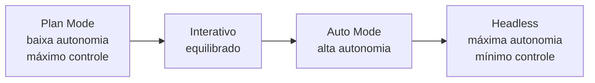

# Modos de operação — interativo, plan mode, auto mode, headless

> [!abstract] TL;DR
> Claude Code tem quatro modos principais de operação: interativo (REPL com confirmações), plan mode (planeja sem executar), auto mode (configuração de permissões que reduz confirmações), e headless (não-interativo para CI/CD e automação). Cada modo tem um equilíbrio diferente entre autonomia e controle. Escolher o modo certo para a tarefa — e compor entre eles — é uma das habilidades centrais para trabalhar eficientemente com Claude Code.

---

## O espectro de autonomia vs controle

Imagine uma escala de confiança entre você e o agente. Em um extremo, você aprova cada ação individualmente — máximo controle, mínima autonomia. No outro extremo, o agente decide e age sem intervenção — máxima autonomia, mínimo controle.

Nenhum dos extremos é sempre correto. Você quer controle máximo quando:
- Está explorando código desconhecido pela primeira vez
- A tarefa tem consequências irreversíveis (deletar dados, fazer deploy)
- Você está aprendendo como o agente aborda o problema

Você quer autonomia máxima quando:
- A tarefa é bem definida e você confia no agente para executar
- O pipeline de CI/CD é automatizado e não pode ser interativo
- Você está rodando a mesma operação em dezenas de arquivos

Os quatro modos de operação cobrem esse espectro:



---

## Modo 1: Interativo (padrão)

```bash
claude
```

O modo REPL. Você abre o terminal, digita a tarefa, e o agente age enquanto você observa. Confirmações aparecem antes de ações significativas.

**O que acontece em cada turno:**
1. Você digita o pedido
2. O agente planeja (invisível — raciocínio interno)
3. Para ações de leitura (Read, Grep, LS): executa automaticamente
4. Para ações de escrita/execução (Edit, Bash): pede confirmação se não estiver na allow list
5. Você aprova ou rejeita
6. O agente observa o resultado e decide o próximo passo

**Quando usar:**
- Exploração de código novo ou desconhecido
- Tarefas abertas onde você quer guiar o processo
- Debugging onde cada passo importa
- Aprendizado de como o agente navega um problema

**Vantagem do modo interativo:** você pode interromper a qualquer momento com `Esc`, dar feedback, e redirecionar. É o modo mais seguro e o melhor ponto de partida para qualquer nova tarefa ou projeto.

---

## Modo 2: Plan Mode

```
# Dentro do REPL — toggle:
Shift+Tab

# Ou ative explicitamente:
/plan
```

O agente **planeja mas não executa**. Ele analisa o problema, propõe um plano de ação detalhado — quais arquivos vai editar, quais comandos vai rodar, qual a sequência — e espera sua aprovação antes de agir.

**O que é preservado em plan mode:**
- Tool calls de leitura (Read, Grep, Glob): são executados — o agente precisa ver o código para planejar
- Tool calls de escrita (Edit, Write, Bash): **não são executados**

**O que um bom plano inclui:**

```
[Plano — refatorar módulo de autenticação para JWT]

1. Ler src/auth/session.ts para entender a implementação atual
2. Ler src/auth/middleware.ts para mapear os pontos de integração
3. Adicionar dependências: jsonwebtoken, @types/jsonwebtoken
4. Modificar session.ts:
   - Substituir cookie-session por jwt.sign/verify
   - Manter interface externa para não quebrar o middleware
5. Atualizar middleware.ts:
   - Verificar token no header Authorization
   - Remover dependência de session cookie
6. Atualizar testes em tests/auth.test.ts:
   - Mockar o JWT em vez do cookie
7. Rodar npm test para validar
8. Confirmar que todos os 42 testes passam

Arquivos que serão modificados: 3
Riscos: mudança de interface de autenticação pode quebrar integrações externas
       → revisar documentação da API antes de prosseguir
```

**Por que isso é valioso:**
Antes de deixar o agente rodar 20 tool calls, você pode ver se ele entendeu corretamente o problema. Um plano ruim revelado antes da execução custa apenas uns segundos. Um plano ruim que executou por 20 minutos custou tempo, tokens, e potencialmente mudanças que precisam ser revertidas.

**Quando usar:**
- Refactoring de módulos críticos
- Mudanças que afetam múltiplos arquivos
- Qualquer tarefa onde você quer validar a estratégia antes da implementação
- Onboarding em um projeto novo — veja como o agente interpreta a estrutura

---

## Modo 3: Auto Mode (via permissões)

Auto mode não é um comando — é um estado resultante de uma configuração de permissões que reduz ou elimina confirmações para ações específicas.

```json
// .claude/settings.json
{
  "permissions": {
    "allow": [
      "Bash(npm test)",
      "Bash(npm run lint)",
      "Bash(npm run build)",
      "Bash(git diff*)",
      "Bash(git log*)",
      "Edit(*)",
      "Write(src/**)"
    ],
    "deny": [
      "Bash(rm -rf*)",
      "Bash(git push*)",
      "Bash(git commit*)",
      "Bash(npm publish*)"
    ]
  }
}
```

Com essa configuração, o agente:
- Roda testes, lint e build sem pedir confirmação
- Edita qualquer arquivo sem pedir confirmação
- Bloqueia (ou pergunta) antes de deletar arquivos, fazer push, commitar, ou publicar pacotes

**A filosofia por trás de auto mode:** você define os limites de segurança uma vez, e o agente opera livremente dentro deles. É como dar a um funcionário de confiança a chave do escritório, mas não a chave do cofre.

**Combinando com hooks para guardrails adicionais:**

```json
{
  "hooks": {
    "PreToolUse": [{
      "matcher": "Edit",
      "hooks": [{
        "type": "command",
        "command": "echo 'Editando: $CLAUDE_TOOL_INPUT_PATH' >> .claude/session.log"
      }]
    }]
  }
}
```

**Quando usar:**
- Pair programming acelerado em projetos bem conhecidos
- Tarefas repetitivas (ex: "adicione logs em todos os endpoints") onde você confia na execução
- Após validar a estratégia em plan mode — execute em auto mode

---

## Modo 4: Headless

```bash
# Forma básica
claude -p "adicione logs de entrada e saída em todos os endpoints"

# Com opções de CI/CD
claude -p "run the test suite and report failures" \
  --output-format json \
  --max-turns 30 \
  --allowedTools "Read,Bash(npm test)"
```

Modo não-interativo. Recebe a tarefa, executa o loop agentic completo, e retorna o resultado — sem REPL, sem confirmações, sem interação humana.

**Flags principais do modo headless:**

| Flag | Valor/Exemplo | Efeito |
|------|---------------|--------|
| `-p "..."` | `-p "tarefa"` | Define tarefa (ativa headless) |
| `--output-format` | `json`, `stream-json`, `text` | Formato de output para parsing |
| `--max-turns` | `--max-turns 20` | Limita número de iterações |
| `--allowedTools` | `"Read,Bash(npm test)"` | Restringe tools disponíveis |
| `--continue` | — | Continua a última sessão |
| `--resume` | `--resume SESSION_ID` | Retoma sessão específica |
| `--model` | `--model claude-sonnet-4-6` | Especifica o modelo |
| `--system-prompt` | `"You are a..."` | Sobrescreve system prompt |

**Output JSON para integração:**

```bash
RESULT=$(claude -p "analyze test failures" \
  --output-format json \
  --max-turns 15)

# Extrair resultado
echo "$RESULT" | jq -r '.result'

# Verificar se houve erro
echo "$RESULT" | jq '.is_error'

# Tokens usados
echo "$RESULT" | jq '.usage'
```

**Exemplo: CI/CD com GitHub Actions**

```yaml
- name: Claude Code — check for security issues
  run: |
    claude -p "Review the changes in this PR for security vulnerabilities.
    Focus on: SQL injection, XSS, authentication bypass, and insecure dependencies.
    Output a JSON summary with findings." \
      --max-turns 20 \
      --allowedTools "Read,Grep,Bash(git diff HEAD~1)" \
      --output-format json > security-report.json
```

**Exemplo: geração de documentação automatizada**

```bash
#!/bin/bash
# Roda em paralelo em cada módulo do monorepo
for MODULE in packages/*/; do
  claude -p "Generate JSDoc for all public functions in $MODULE/src/.
  Only document functions without existing docs.
  Output: list of files modified." \
    --max-turns 30 \
    --allowedTools "Read,Glob,Grep,Edit($MODULE**)" \
    --output-format json > "$MODULE/doc-report.json" &
done
wait
echo "Documentação gerada em todos os módulos"
```

Aqui o headless roda em paralelo — cada instância trata um módulo. O `--allowedTools` restringe edições ao próprio módulo, evitando que um agente edite arquivos de outro.

---

## Composição de modos em workflows reais

Os modos não são mutuamente exclusivos — você os compõe conforme a fase do trabalho:

**Workflow típico de feature:**

```
1. Plan Mode: "Planeje como implementar autenticação 2FA"
   → Revise o plano, ajuste se necessário

2. Interativo com Auto Mode configurado: execute o plano
   → Aprove ações críticas manualmente, deixe o resto fluir

3. Headless: "Rode todos os testes e reporte falhas"
   → Validação automatizada, output JSON para análise

4. Interativo: "Revise os testes que falharam e corrija"
   → Volta para loop interativo para debugging
```

**Workflow de revisão de PR:**

```bash
# Analisa o PR sem executar ações
claude -p "Review this PR for code quality issues: $(git diff HEAD~1)" \
  --max-turns 10 \
  --allowedTools "Read,Grep" \
  --output-format json
```

---

## Diferenças por modo em formato de tabela

| Aspecto | Interativo | Plan Mode | Auto Mode | Headless |
|---------|-----------|-----------|-----------|---------|
| Confirmações | Sim (ações novas) | Aprovação do plano | Não (para permitidas) | Não |
| Lê arquivos | Automático | Automático | Automático | Automático |
| Edita arquivos | Pede confirmação | Não edita | Automático | Automático |
| Roda Bash | Pede confirmação | Não executa | Automático (se permitido) | Automático |
| Interação humana | A cada turno | Uma vez (plano) | Mínima | Nenhuma |
| Caso de uso | Exploração | Refactoring crítico | Pair programming | CI/CD |
| Risco | Baixo | Muito baixo | Médio | Alto sem guardrails |

---

## Armadilhas por modo

**Interativo — interromper demais**
Aprovar cada ação individualmente em uma tarefa longa fragmenta o loop do agente. Deixe o agente trabalhar em sequências; intervenha quando vir algo errado, não preventivamente.

**Plan Mode — plano como contrato**
O plano é uma proposta, não um contrato. Se o agente encontrar algo inesperado durante a execução, ele pode adaptar. Não espere que o plano seja seguido palavra por palavra.

**Auto Mode — sem deny list**
Configurar only `allow` sem `deny` pode dar ao agente mais poder do que você percebe. Sempre adicione `deny` explícito para ações destrutivas: `rm`, `git push`, `git reset --hard`, `npm publish`.

**Headless — sem `--max-turns`**
Em CI/CD sem limite de turns, um loop que trava pode rodar indefinidamente. Configure sempre um `--max-turns` razoável para a tarefa.

**Headless — permissões amplas**
`--allowedTools "Bash"` sem restrição de comando permite que o agente execute qualquer coisa. Use `--allowedTools "Bash(npm test),Bash(npm run lint)"` para restringir.

---

## Qual modo usar? — árvore de decisão

```
Você precisa executar uma tarefa agora?
├── NÃO → Use plan mode para explorar a abordagem primeiro
│         Depois mude para interativo ou auto mode para executar
└── SIM
    ├── A tarefa tem consequências irreversíveis (delete, deploy, push)?
    │   └── SIM → Interativo. Aprove manualmente cada ação crítica.
    │
    ├── Você conhece bem o projeto e a tarefa é bem definida?
    │   ├── SIM → Configure auto mode e deixe o agente rodar
    │   └── NÃO → Interativo. Observe e guie.
    │
    └── A tarefa faz parte de um pipeline automatizado?
        └── SIM → Headless com --max-turns e --allowedTools restritos
```

---

## Checklist — modos de operação

- [ ] Para projetos novos, use **plan mode** antes de qualquer execução
- [ ] Em **auto mode**, sempre defina um `deny` list explícito com ações destrutivas
- [ ] Em **headless**, sempre configure `--max-turns` para evitar loops infinitos
- [ ] Use `--output-format json` em **headless** quando a saída for processada por scripts
- [ ] Combine plan mode + auto mode para tarefas críticas: planeie interativamente, execute com permissões
- [ ] Use `--allowedTools` restrito em CI/CD — nunca `Bash` sem restrição de subcomando
- [ ] Salve configurações de permissões em `.claude/settings.json` para consistência de equipe
- [ ] Use `--resume SESSION_ID` para retomar sessões headless que foram interrompidas
- [ ] Monitore o número de turns em auto mode para detectar loops não intencionais

---

## Como explicar em inglês

| Português | Inglês |
|-----------|--------|
| Modo interativo | Interactive mode / REPL mode |
| Modo de planejamento | Plan mode |
| Modo automático | Auto mode |
| Modo sem cabeça | Headless mode |
| Confirmação | Confirmation / approval |
| Lista de permissões | Allow list |
| Lista de bloqueios | Deny list |
| Saída formatada | Formatted output |
| Iterações máximas | Max turns |
| Ferramentas permitidas | Allowed tools |

**Frases úteis:**
- "I use plan mode first to validate the approach, then switch to auto mode to execute."
- "Our CI pipeline runs Claude in headless mode with `--max-turns 20` and `--output-format json` for structured reporting."
- "The deny list blocks `git push` and `npm publish` so the agent can never accidentally deploy to production."
- "Plan mode is great for onboarding to a new codebase — you can see how the agent interprets the architecture before it makes any changes."

---

## Veja também

- [[03-Dominios/Tecnologia/IA/Claude Code/Workflows/01 - Plan Mode|01 - Plan Mode]] — uso detalhado do plan mode
- [[03-Dominios/Tecnologia/IA/Claude Code/Time e Automação/01 - Headless mode|01 - Headless mode]] — headless em profundidade
- [[03-Dominios/Tecnologia/IA/Claude Code/Time e Automação/02 - CI-CD com GitHub Actions|02 - CI-CD com GitHub Actions]] — integração em pipelines
- [[03-Dominios/Tecnologia/IA/Claude Code/Hooks e Guardrails/index|Hooks e Guardrails]] — guardrails para auto mode e headless
- [[03-Dominios/Tecnologia/IA/Claude Code/Configuração/05 - Permissions|05 - Permissions]] — configuração de allow/deny lists
- [[03-Dominios/Tecnologia/IA/Claude Code/Mental Model/index|Mental Model]] — índice do galho

---

## Referências

- **Anthropic** — *Claude Code CLI reference* (2026). Flags completos para cada modo — https://docs.anthropic.com/pt/docs/claude-code/cli-reference
- **Anthropic** — *Claude Code settings* (2026). Configuração de permissões e allow/deny lists — https://docs.anthropic.com/pt/docs/claude-code/settings
- **Anthropic** — *Claude Code in CI/CD* (2026). Headless mode em pipelines de automação — https://docs.anthropic.com/pt/docs/claude-code/github-actions
- **Anthropic** — *Claude Code hooks* (2026). Como combinar hooks com modos de operação — https://docs.anthropic.com/pt/docs/claude-code/hooks
