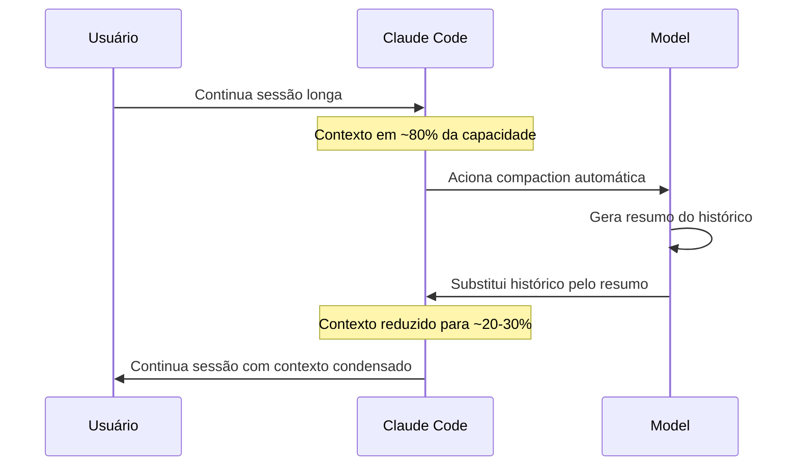
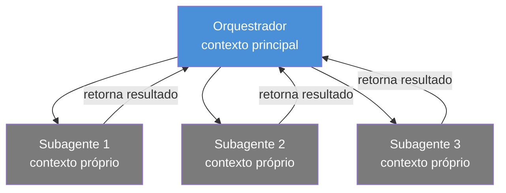

# Compaction — gerenciando sessões longas sem perder o contexto

> [!abstract] TL;DR
> Compaction é o mecanismo pelo qual Claude Code condensa o histórico de uma sessão em um resumo quando a janela de contexto se aproxima do limite. Acontece automaticamente (~80% de capacidade) ou pode ser acionado manualmente com `/compact`. O modelo continua com o resumo em vez do histórico completo — mantendo a essência do trabalho, perdendo alguns detalhes. Saber o que é preservado e o que é perdido, e como ancorar as informações críticas via CLAUDE.md, é fundamental para sessões longas e produtivas.

---

## O problema fundamental: contexto finito, tarefas infinitas

A janela de contexto do Claude é finita — 200k tokens. Uma sessão típica de refactoring pesado pode consumir 50-80k tokens em uma hora. Uma tarefa de migração pode precisar de 10 horas de trabalho. Como resolver esse conflito?

A resposta óbvia seria: terminar a sessão, começar outra. Mas isso tem um custo: o agente perde todo o contexto acumulado — as decisões tomadas, os padrões descobertos, as convenções identificadas, o estado atual da tarefa.

Compaction resolve isso. Em vez de apagar o histórico, o agente o **condensa**: transforma os últimos N tokens de histórico em um resumo compacto que captura a essência sem copiar cada detalhe.

É como um arquivista que transforma 500 páginas de atas de reuniões em um memorando de 10 páginas com as decisões-chave. O memorando não é perfeito — alguns detalhes se perdem — mas você ainda sabe para onde o projeto estava indo e o que foi decidido.

---

## Como compaction funciona por dentro



**O que o modelo faz ao compactar:**
1. Analisa o histórico da sessão (todas as mensagens, tool calls, resultados)
2. Identifica: objetivo da sessão, decisões tomadas, estado atual das tarefas, arquivos modificados
3. Gera um resumo em linguagem natural que captura esses elementos
4. Substitui o histórico bruto pelo resumo
5. O CLAUDE.md e o system prompt permanecem intocados no início do contexto

---

## Compaction automática vs manual

### Automática

```
# Acontece sem intervenção quando o contexto atinge ~80% de capacidade
# Claude Code exibe uma notificação:
⚡ Context compacted (saved ~120k tokens). Continuing...
```

Você não precisa fazer nada. Claude Code monitora a ocupação do contexto e aciona compaction automaticamente quando necessário. A sessão continua — do seu ponto de vista, é quase transparente.

**Quando acontece:** quando o total de tokens no contexto ultrapassa aproximadamente 80% do limite do modelo (160k de 200k para Claude Sonnet/Opus).

### Manual com `/compact`

```bash
# Aciona compaction imediatamente
/compact

# Aciona com foco específico
/compact Focus on the authentication module changes
/compact Preserve the API design decisions we made
/compact Keep the list of failing tests and our debugging approach
```

**Por que acionar manualmente:**
- Você sabe que vai entrar em uma fase nova e complexa — limpe o contexto antes
- O foco da sessão mudou e você quer que o resumo reflita a nova prioridade
- Você quer controlar o que fica enfatizado no resumo

**A diretiva de foco é poderosa:** sem ela, o modelo decide o que é mais importante para o resumo. Com ela, você guia: "preserve especificamente isso".

---

## O que é preservado vs perdido na compaction

| Elemento | Preservado? | Notas |
|----------|-------------|-------|
| CLAUDE.md (project + user) | ✅ Sempre | Relido a cada sessão, não faz parte do histórico |
| Objetivo geral da sessão | ✅ Geralmente | Principal âncora do resumo |
| Decisões de design tomadas | ✅ Geralmente | Mencionadas explicitamente se importantes |
| Lista de arquivos modificados | ✅ Geralmente | Rastreados no resumo |
| Estado das tarefas pendentes | ✅ Geralmente | "Completei X, falta Y e Z" |
| Conteúdo exato de arquivos lidos | ❌ Perdido | Só a referência aos arquivos |
| Output verboso de comandos | ❌ Perdido | Apenas o resultado/conclusão |
| Conversas exploratórias | ⚠️ Parcial | Resumidas, não palavra por palavra |
| Erros e suas soluções | ⚠️ Parcial | O que foi tentado e resultado final |
| Preferências de estilo | ⚠️ Parcial | Se explícitas, provavelmente preservadas |

**Insight crítico:** o conteúdo dos arquivos que foram lidos NÃO é preservado no resumo. Se o agente leu `auth/session.ts` inteiro na primeira hora, após compaction ele sabe que leu e o que encontrou, mas não o conteúdo. Se precisar do conteúdo novamente, vai reler o arquivo — o que é exatamente o comportamento correto.

---

## CLAUDE.md como âncora de compaction

CLAUDE.md é lido no início de cada sessão e fica no topo do contexto — antes de qualquer histórico. Isso tem uma implicação crucial para compaction: **CLAUDE.md sobrevive a qualquer número de compactions**.

```
Contexto após compaction:

[TOPO — alta atenção]
├── System prompt
├── ~/.claude/CLAUDE.md (convenções globais)
├── .claude/CLAUDE.md (instruções do projeto)
│
[MEIO — após compaction]
├── Resumo da sessão (gerado por compaction)
│   ├── Objetivo: implementar autenticação JWT
│   ├── Completado: session.ts, middleware.ts
│   └── Pendente: testes, documentação
│
[FIM — alta atenção]
└── Sua próxima mensagem
```

**O que colocar no CLAUDE.md para sobreviver à compaction:**
- Decisões de arquitetura permanentes: "Use dependency injection via constructor, not service locator"
- Convenções de código: "Errors are typed as `AppError`, never raw `Error`"
- Restrições: "Never use `any` in TypeScript. Always use explicit types."
- Estado do projeto: "Auth module is being migrated. Old: src/auth/legacy.ts. New: src/auth/v2/"

**O que NÃO colocar no CLAUDE.md:**
- Estado temporário de uma tarefa específica — pertence ao contexto da sessão
- Listas de tarefas in-progress — pertence ao sistema de tasks do projeto

---

## Como fica o contexto após compaction — exemplo real

Antes de compaction, o contexto contém a conversa inteira:

```
[Turno 1] Usuário: "Adicione autenticação JWT ao projeto"
[Turno 2] Claude: [leu src/auth/session.ts — 280 linhas de código]
[Turno 3] Claude: [editou session.ts — resultado completo com diff]
[Turno 4] Usuário: "Os testes estão quebrando"
[Turno 5] Claude: [rodou npm test — 200 linhas de output]
[Turno 6] Claude: "O problema é X. Vou corrigir."
[Turno 7] Claude: [editou tests/auth.test.ts]
[Turno 8] Claude: [rodou npm test novamente — 180 linhas de output]
... (12 turnos mais)
Total: ~85.000 tokens
```

Após compaction, o contexto contém o resumo:

```
[RESUMO — gerado por compaction]
Objetivo: Adicionar autenticação JWT ao projeto.

Progresso:
- Modificado: src/auth/session.ts — substituiu cookie-session por jwt.sign/verify
- Modificado: src/auth/middleware.ts — verifica token no header Authorization
- Modificado: tests/auth.test.ts — testes atualizados para JWT

Estado atual: Todos os 42 testes passam. Pendente: atualizar documentação.

Decisões tomadas:
- Token expira em 24h (configurável via JWT_EXPIRY env var)
- Refresh token armazenado em Redis (chave: session:${userId})
- Erro de token expirado retorna 401, não 403

Total: ~1.200 tokens
```

O resumo é ~70× menor que o histórico original. O agente tem o essencial para continuar: o que foi feito, o que está pendente, as decisões de design.

---

## Impacto da compaction na qualidade das respostas

Compaction não é gratuita — tem custo de qualidade. Entender esse custo ajuda a usar o recurso de forma inteligente.

**O que fica mais frágil após compaction:**
- Referências a código específico: o agente pode lembrar que modificou `session.ts` mas não o conteúdo exato que escreveu
- Contexto de debugging: a cadeia de hipóteses e tentativas se perde; apenas o resultado final fica
- Nuances de decisões: "escolhemos JWT porque avaliamos 3 alternativas e JWT ganhou por X, Y, Z" vira "usamos JWT"

**O que continua robusto:**
- Objetivos de alto nível: o agente sabe o que está construindo
- Estado das tarefas: completado/pendente/bloqueado
- Decisões explícitas: se você disse "use JWT", isso fica
- Arquivos modificados: o agente sabe onde trabalhou

**Estratégia de mitigação:** para nuances importantes, diga explicitamente antes da compaction:

```
/compact Focus on: the decision to use Redis for refresh tokens (not database),
         the 24h expiry requirement from the product spec,
         and the fact that middleware must be stateless
```

Isso direciona o modelo a priorizar essas informações no resumo.

---

## Compaction em sessões multi-agente

Quando Claude Code usa subagentes (Agent tool), cada subagente tem seu próprio contexto. Compaction no orquestrador não afeta os contextos dos subagentes — e vice-versa.



O orquestrador recebe os resultados dos subagentes. Se o orquestrador sofre compaction, os resultados dos subagentes (que já foram incorporados ao histórico) são incluídos no resumo — mas de forma condensada. Se um subagente individualmente atinge o limite, ele pode sofrer compaction internamente, transparente para o orquestrador.

---

## Retomando sessões após compaction ou pausa

```bash
# Ver sessões disponíveis
claude sessions list

# Retomar a sessão mais recente
claude --continue

# Retomar sessão específica por ID
claude --resume SESSION_ID

# Retomar em modo headless
claude -p "continue the refactoring" --resume SESSION_ID
```

**O que você encontra ao retomar:**
- O resumo compilado (se houve compaction)
- O histórico desde a última compaction
- CLAUDE.md relido — o agente tem todas as instruções permanentes

**O que não está disponível:**
- Histórico completo antes da última compaction
- Conteúdo de arquivos que foram lidos antes da compaction (serão relidos se necessário)

---

## Estratégias para sessões muito longas

**Estratégia 1: CLAUDE.md como checkpoint de estado**

Para tarefas que duram dias, documente o estado atual no CLAUDE.md temporariamente:

```markdown
## Estado atual da migração (atualizar conforme avança)
- [x] Fase 1: auth module
- [x] Fase 2: user module
- [ ] Fase 3: payment module — em andamento
- [ ] Fase 4: notification module
```

Remova quando a tarefa terminar.

**Estratégia 2: `/compact` com foco antes de fases críticas**

Antes de começar uma fase nova que exigirá muito contexto:

```bash
/compact Focus on the payment module design decisions and the API contract
# Agora o contexto está limpo, preservando exatamente o que importa para a próxima fase
```

**Estratégia 3: Sessões menores por domínio**

Em vez de uma sessão longa cobrindo tudo:
- Sessão 1: auth module (compact ao terminar)
- Sessão 2: user module (compact ao terminar)
- Sessão 3: payment module

O CLAUDE.md documenta convenções descobertas em cada sessão, tornando-as disponíveis para as próximas.

**Estratégia 4: `/clear` entre tarefas independentes**

Para tarefas completamente independentes, `/clear` é melhor que compaction: descarta TODO o histórico (que para tarefas novas é só ruído) e começa limpo. Compaction faz sentido apenas quando o histórico tem valor para o trabalho seguinte.

---

## Compaction vs `/clear` — quando usar cada um

| Situação | Compaction | `/clear` |
|----------|-----------|---------|
| Sessão longa, mesma tarefa | ✅ Ideal | ❌ Perde contexto valioso |
| Tarefa nova, projeto diferente | ❌ Ruído de contexto | ✅ Ideal |
| Pausa e retomada no mesmo dia | ✅ Via `--resume` | ❌ |
| Mudança de foco radical | `/compact Focus on...` | ✅ Se for nova sessão |
| Debug de problema novo | ❌ | ✅ Começa limpo |
| Contexto cheio de erros e tentativas | ❌ Resumo fica bagunçado | ✅ |

---

## Checklist — boas práticas de compaction

- [ ] Documente decisões permanentes no CLAUDE.md — elas sobrevivem a qualquer compaction
- [ ] Use `/compact Focus on X` quando a próxima fase exige foco diferente do histórico
- [ ] Use `/clear` (não `/compact`) quando vai começar uma tarefa completamente nova
- [ ] Guarde o SESSION_ID em tarefas longas — permite retomar com `--resume`
- [ ] Antes de uma fase crítica, compacte manualmente para entrar com contexto limpo
- [ ] Para tarefas multi-dia, atualize CLAUDE.md com o estado do progresso — não confie no resumo de compaction para estado de longo prazo
- [ ] Monitore o uso de contexto com `--verbose` para saber quando compaction está próximo
- [ ] Para nuances de decisão importantes, explicite-as antes de compactar com `/compact Focus on...`
- [ ] Após compaction, releia o resumo para verificar se capturou o que importa
- [ ] Em sessões multi-agente, lembre que cada subagente tem seu próprio contexto — compaction no orquestrador não afeta subagentes

---

## Perguntas que compaction ajuda a responder — e as que não ajuda

**Compaction responde bem:**
- "O que já fizemos até agora?" — o resumo cobre completado vs pendente
- "Qual foi a decisão sobre X?" — decisões explícitas ficam no resumo
- "Quais arquivos modificamos?" — rastreado no resumo

**Compaction responde mal (releia o arquivo):**
- "Qual é o conteúdo atual de `auth.ts`?" — reler é mais confiável que o resumo
- "O que exatamente o teste 42 verifica?" — detalhes de código se perdem
- "Como o erro apareceu exatamente?" — mensagens de erro verbosas não sobrevivem

**Regra prática:** se a resposta depende de texto exato (código, output de comando, mensagem de erro), não confie no resumo — leia o arquivo ou rode o comando novamente. O resumo é confiável para estado de alto nível, não para detalhes de implementação.

Pensar em compaction como um colaborador que mantém notas de projeto: ele sabe o que o time decidiu e quais marcos foram atingidos, mas se você perguntar "qual é exatamente a linha 47 do arquivo?", ele vai dizer "é melhor verificar no código diretamente". Isso não é uma falha — é o comportamento correto para o propósito de um resumo de sessão.

Esta é também a razão pela qual ferramentas como `git log` e `git diff` são mais confiáveis que a memória do agente para rastrear o que foi mudado: o repositório tem o estado real do código; o resumo de compaction tem a intenção e as decisões.

> [!tip] Vídeo — Effective context engineering for AI agents (Anthropic, 2025)
> A própria Anthropic publicou um vídeo oficial explicando a filosofia por trás de compaction e das outras técnicas de gerenciamento de contexto (write/select/compress/isolate) que sustentam sessões longas em agentes. Bom complemento para quem quer o racional por trás do mecanismo, não só o comando. [Effective context engineering for AI agents](https://www.youtube.com/watch?v=139Cfcrt2Mk) — Anthropic, publicado em 30/10/2025.

---

## Casos práticos

**Cenário 1 — Migração multi-dia com compaction repetida**

Uma migração de um monólito para microsserviços leva 4 dias de trabalho contínuo com Claude Code. No dia 1, a sessão sofre 3 compactions automáticas enquanto o agente mapeia dependências entre módulos. No dia 2, o agente retoma via `--resume` — mas o resumo da última compaction do dia 1 não menciona um detalhe crítico: a ordem específica de migração acordada (`payments` antes de `notifications`, por causa de uma dependência de schema). O agente, sem essa nuance, começa pela ordem "óbvia" (alfabética) e quebra a build.

**O que deveria ter sido feito:** antes de encerrar o dia 1, rodar `/compact Focus on: the migration order (payments before notifications, schema dependency) and the modules already migrated`. Melhor ainda: documentar a ordem no CLAUDE.md como checkpoint de estado (Estratégia 1 acima), porque ela sobrevive a *qualquer* número de compactions e sessões — não só à próxima.

**Cenário 2 — Debugging longo perdendo contexto do erro original**

Uma sessão de debugging de um bug intermitente em produção passa 2 horas testando hipóteses: cache stale, race condition, timezone, serialização. Na 2ª hora, o contexto atinge 80% e sofre compaction automática. O resumo preserva "testamos 4 hipóteses, nenhuma confirmada" — mas perde os *detalhes* de cada tentativa: os valores exatos de log que descartaram a hipótese de timezone, o stack trace específico da race condition suspeita.

Quando o agente retoma o debugging, ele sabe que a hipótese de timezone foi descartada, mas não sabe *por quê* — e corre o risco de reconsiderá-la, desperdiçando tempo. Isso ilustra a linha do checklist "para nuances importantes, explicite-as antes de compactar": debugging é exatamente o tipo de trabalho onde a cadeia de raciocínio (não só a conclusão) importa, e onde `/compact Focus on: hypotheses ruled out and why (exact log lines/errors)` evita perder o "porquê" junto com o "o quê".

---

## Armadilhas comuns

> [!warning] Confiar no resumo para conteúdo exato de código
> Depois de uma compaction, o agente sabe que editou `session.ts`, mas não guarda o texto exato que escreveu. Se você perguntar "o que ficou na linha 47?", ele vai *inferir* em vez de saber — e pode alucinar. Sempre releia o arquivo quando o detalhe exato importa; nunca confie no resumo para isso.

> [!warning] Deixar estado de tarefas longas só na memória da sessão
> Em tarefas multi-dia, se o único lugar onde a ordem de execução, as decisões de design e o progresso vivem é o histórico da sessão, cada compaction é uma chance de perder uma nuance crítica — e depois de várias compactions em sequência, o efeito é cumulativo. CLAUDE.md como checkpoint de estado (ver Estratégia 1) é a mitigação, não uma opção "se sobrar tempo".

> [!warning] Usar `/compact` quando o certo era `/clear`
> Compaction preserva um resumo do histórico — que é exatamente o que você **não** quer ao começar uma tarefa nova e independente. Rodar `/compact` nesse caso carrega ruído de uma tarefa anterior para dentro do resumo da próxima, poluindo o contexto em vez de limpá-lo. Ver a tabela "Compaction vs `/clear`" acima antes de decidir qual comando rodar.

> [!warning] Não guardar o SESSION_ID em tarefas longas
> Sem o SESSION_ID anotado, retomar uma sessão específica por `--resume SESSION_ID` fica impossível — sobra só `--continue`, que pega a mais recente. Em fluxos com múltiplas sessões paralelas (ex: uma por módulo, ver Estratégia 3), perder o ID de uma sessão específica significa perder o acesso ao histórico condensado daquele módulo.

---

## Como explicar em inglês

| Português | Inglês |
|-----------|--------|
| Compactação | Compaction |
| Resumo da sessão | Session summary / context summary |
| Contexto condensado | Compacted context |
| Janela de contexto cheia | Context window full / context limit reached |
| Retomar sessão | Resume session |
| Preservado após compaction | Preserved across compaction |
| Âncora de contexto | Context anchor |

**Frases úteis:**
- "After compaction, the model continues with a summary rather than the full history — so CLAUDE.md is critical for anchoring persistent decisions."
- "I use `/compact Focus on X` before switching to a new phase, so the summary is biased toward what I need next."
- "For multi-day tasks, I document progress in CLAUDE.md so it survives compaction and is available in the next session."
- "Compaction vs /clear: use compaction when the history is valuable, /clear when it's just noise for the next task."
- "Compaction is like a meeting note-taker who summarizes what was decided, not a transcript — great for decisions, not for exact code."
- "The deny list in settings.json prevents destructive actions even after compaction resets the agent's short-term caution."

---

## O que vem a seguir

Compaction resolve "como não perder o essencial quando o histórico fica grande demais" — mas o histórico grande demais tem um custo que ainda não apareceu nesta nota: cada token relido, cada resumo gerado, cada compaction disparada tem um preço. A próxima nota fecha esse ciclo: [[03-Dominios/Tecnologia/IA/Claude Code/Mental Model/07 - Tokens e custo|07 - Tokens e custo]] mostra como o consumo de tokens se acumula ao longo de uma sessão longa (compactions inclusas) e o que isso significa em custo real — a métrica que, junto com contexto, você precisa gerenciar em qualquer sessão que passe de algumas dezenas de minutos.

---

## Veja também

- [[03-Dominios/Tecnologia/IA/Claude Code/Mental Model/04 - Context window|04 - Context window]] — o que entra no contexto e como otimizar
- [[03-Dominios/Tecnologia/IA/Claude Code/Mental Model/02 - Como Claude Code lê um codebase|02 - Como Claude Code lê um codebase]] — CLAUDE.md como mapa de projeto
- [[03-Dominios/Tecnologia/IA/Claude Code/Configuração/01 - CLAUDE.md|01 - CLAUDE.md]] — configuração avançada do arquivo
- [[03-Dominios/Tecnologia/IA/Claude Code/Mental Model/05 - Modos de operação|05 - Modos de operação]] — modos e composição de sessões
- [[03-Dominios/Tecnologia/IA/Claude Code/Mental Model/index|Mental Model]] — índice do galho

---

## Referências

- **Anthropic** — *Claude Code concepts* (2026). Compaction e gerenciamento de sessão longa — https://docs.anthropic.com/pt/docs/claude-code/concepts
- **Anthropic** — *Claude Code CLI reference* (2026). Flags `--continue` e `--resume` — https://docs.anthropic.com/pt/docs/claude-code/cli-reference
- **Anthropic** — *Claude Code CLAUDE.md* (2026). Como CLAUDE.md sobrevive à compaction — https://docs.anthropic.com/pt/docs/claude-code/memory
- **Liu et al.** — *Lost in the Middle: How Language Models Use Long Contexts* (2023). Atenção degrada para o meio do contexto — base teórica para por que CLAUDE.md no início importa — https://arxiv.org/abs/2307.03172
- **Anthropic** — *Claude Code agentic patterns* (2026). Compaction em sessões multi-agente e subagentes — https://docs.anthropic.com/pt/docs/claude-code/sub-agents
- **Anthropic** — *Model context window* (2026). Limites de contexto por modelo e como compaction se relaciona com o limite de 200k tokens — https://docs.anthropic.com/pt/docs/about-claude/models
- **Anthropic** — *Claude Code prompt caching* (2026). Interação entre compaction, caching e custo de tokens — https://docs.anthropic.com/pt/docs/build-with-claude/prompt-caching
- **Anthropic** — *Claude Code sessions* (2026). Gerenciamento de sessões, SESSION_ID, e comportamento de `--continue` vs `--resume` — https://docs.anthropic.com/pt/docs/claude-code/cli-reference#session-management
- **Anthropic** — *Effective context engineering for AI agents* (vídeo, 30/10/2025). Racional por trás de compaction e das estratégias write/select/compress/isolate para agentes de sessão longa — https://www.youtube.com/watch?v=139Cfcrt2Mk

