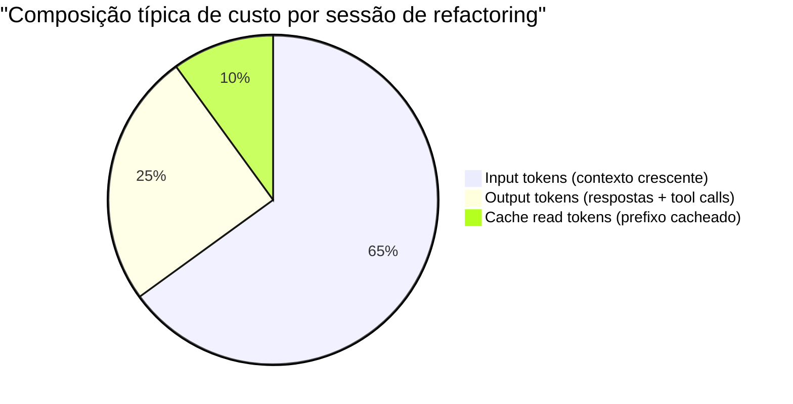
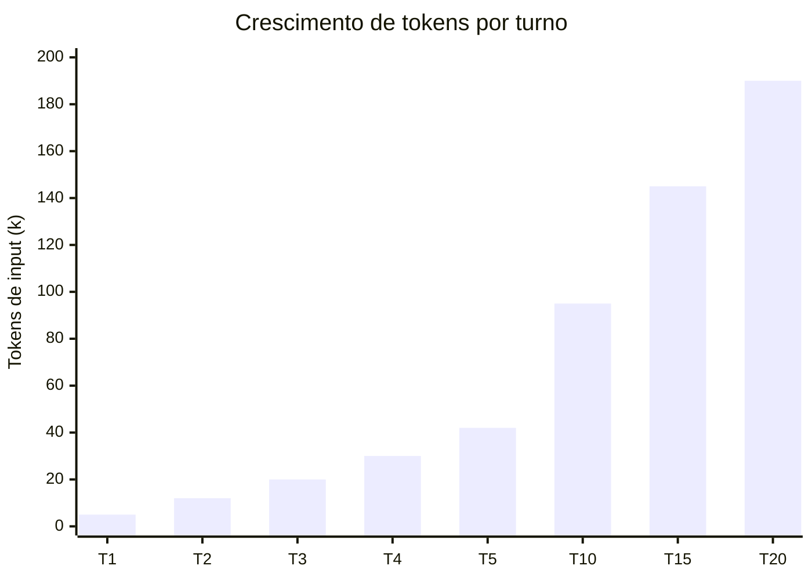

# Tokens e custo — como sessões consomem tokens na prática

> [!abstract] TL;DR
> Todo token processado pelo Claude Code tem custo. Input tokens (o que entra no contexto) são a maior variável — crescem a cada turno porque o histórico completo vai no input. Uma sessão de refactoring pode acumular centenas de milhares de tokens. `ccusage` mostra o breakdown real. As maiores alavancas de redução: leituras cirúrgicas, compaction preventiva e sessões focadas.

---

## Pague pelo contexto que você usa — e pelo que acumulou

Imagine uma impressora que cobra por cada folha inserida na bandeja — não por cada folha impressa. Cada vez que você quer imprimir algo novo, você coloca todas as folhas anteriores de volta, mais a nova. É assim que funciona o billing de tokens no Claude Code.

Cada chamada à API do Claude inclui o **histórico completo da sessão** como input. Não apenas a sua última mensagem — tudo: perguntas anteriores, respostas do agente, resultados de tool calls, conteúdo de arquivos lidos, outputs de comandos rodados. Esse histórico cresce a cada turno, e você paga por ele inteiro a cada chamada.

A consequência é que o custo de uma sessão não cresce linearmente com o número de turnos — cresce de forma superlinear. Dois problemas que você resolve em sessões separadas de 10 turnos cada custam menos que um problema que você tenta resolver em 20 turnos na mesma sessão — mesmo que o "trabalho real" seja idêntico.

---

## Os três tipos de token e seus custos



**Input tokens** — o que entra no contexto quando o modelo é chamado:
- Todo o histórico da sessão
- System prompt + CLAUDE.md
- Conteúdo de arquivos lidos
- Output de comandos Bash
- Resultados de Grep
- Prompts de tool calls anteriores

**Output tokens** — o que o modelo gera:
- Texto de resposta (análise, explicação)
- Parâmetros de tool calls (o JSON com path, content, command)
- Raciocínio interno (quando visível)

**Cache read tokens** — parte do input que bateu no prompt cache:
- System prompt (sempre cacheado após a primeira chamada)
- CLAUDE.md (cacheado enquanto não muda)
- Histórico prefixado estável

Preços de referência (Claude Sonnet 4.x, ordem de grandeza):
- Input: ~$3/MTok
- Output: ~$15/MTok
- Cache read: ~$0.30/MTok (~10× mais barato que input regular)

Os valores exatos mudam — consulte a página de pricing da Anthropic para valores atuais.

---

## Como o contexto acumula tokens turno a turno



**Detalhamento turno a turno:**

```
Turno 1:  5k tokens de input  (system prompt + CLAUDE.md + pedido)
Turno 2:  5k + resposta1 + tool_result1 = ~12k tokens de input
Turno 3:  12k + resposta2 + tool_result2 = ~20k tokens de input
Turno 5:  ~42k tokens de input
Turno 10: ~95k tokens de input
Turno 20: ~190k tokens de input  (próximo do limite de 200k)
```

Cada `Read` de arquivo grande, cada `Bash` com output longo, acelera esse crescimento. Uma única chamada `Read` em um arquivo de 1000 linhas pode adicionar 5-10k tokens em um turno.

---

## O que mais consome tokens — com números

| Operação | Impacto (tokens adicionados) | Mitigação |
|----------|------------------------------|-----------|
| `Read` de arquivo 1000 linhas | ~8-12k tokens | `offset` + `limit` — leia 30-50 linhas |
| `Bash("npm ci")` — output completo | ~3-5k tokens | `\| tail -5` — filtre pro que importa |
| `Bash("docker build")` — output longo | ~10-20k tokens | `2>&1 \| tail -10` |
| `Grep` amplo com 200 resultados | ~5-8k tokens | Padrões específicos + contexto menor |
| Debug loop (10 iterações) | Acumulativo | Sessões focadas; /compact no meio |
| `Agent` subagent call | Isolado | Não polui sessão pai diretamente |
| Resposta longa (análise extensa) | ~3-6k tokens | Peça resumos, não análises exaustivas |

---

## Prompt caching — quando o custo cai 10×

O prompt cache armazena prefixos do contexto por 5 minutos. Quando o modelo é chamado novamente com o mesmo prefixo, esses tokens custam apenas ~10% do preço normal.

**O que é cacheado automaticamente:**
- System prompt do Claude Code (estável entre chamadas)
- CLAUDE.md (estável se você não editar)
- Prefixo do histórico que não mudou desde a última chamada

**Impacto real:**

```
Sessão com 100k tokens de histó​rico estável:
  Sem cache: 100k × $3/MTok = $0.30 por chamada
  Com cache: 100k × $0.30/MTok = $0.03 por chamada
  Economia: ~90% nos tokens cacheados
```

**O que quebra o cache:**
- Editar o CLAUDE.md durante a sessão
- Mudar o system prompt
- Reiniciar a sessão (o cache tem TTL de 5 minutos de inatividade)

---

## ccusage — rastreando o custo real

`ccusage` lê os logs do Claude Code e apresenta o custo por sessão:

```bash
# Instalar
npm install -g ccusage

# Ver uso de hoje
ccusage

# Ver histórico dos últimos 7 dias
ccusage --days 7

# Breakdown por projeto
ccusage --project codex-technomanticus
```

Output típico:

```
╔════════════════════════════════════════════════╗
║  Session 2026-05-13 14:23 — codex-technomanticus
╠════════════════════════════════════════════════╣
║  Input:      145,230 tokens    $0.44
║  Output:      12,450 tokens    $0.19
║  Cache read:  89,100 tokens    $0.03
║  ─────────────────────────────────────────────
║  Total:                        $0.66
╚════════════════════════════════════════════════╝

Top sessions by cost this week:
  $3.42 — refactoring auth module (4h session)
  $1.20 — migration to TypeScript (2h session)
  $0.66 — current session
```

**Interpretando os números:**
- Cache read alto (>50% do input) = bom sinal — o prefixo está estável
- Output muito alto em relação ao input = o agente está gerando respostas longas desnecessariamente
- Input crescendo rápido por sessão = reads grandes ou outputs verbose

---

## Estratégias de redução de custo

### 1. Leituras cirúrgicas

```bash
# CARO: lê arquivo inteiro (1000 linhas = ~10k tokens)
Read("src/services/auth/session.ts")

# BARATO: grep pra localizar, depois lê só o trecho (~50 tokens → 300 tokens)
Grep("createSession", "src/services/auth/")
Read("src/services/auth/session.ts", offset=45, limit=25)
```

**Economia estimada: 10-30× por operação de leitura.**

### 2. Filtrar output de comandos Bash

```bash
# CARO: output completo do npm ci (~500 linhas = ~5k tokens)
Bash("npm ci")

# BARATO: só erros e últimas linhas (~5 linhas = ~50 tokens)
Bash("npm ci 2>&1 | tail -5")
Bash("npm test 2>&1 | grep -E 'FAIL|PASS|✓|✗' | tail -20")
Bash("docker build . 2>&1 | grep -E 'Step|error|warning' | tail -10")
```

**Economia estimada: 50-200× para comandos verbose.**

### 3. Compaction preventiva

`/compact` quando a sessão ainda está com 50-70k tokens é mais barato que deixar auto compaction rodar com 160k tokens. O resumo gerado é proporcional ao tamanho do histórico.

### 4. Sessões focadas

Uma sessão = uma tarefa coesa. Não misture "adicionar feature X" com "refatorar módulo Y" na mesma sessão. O histórico de uma tarefa vira ruído para a outra — e você paga por esse ruído.

### 5. Modelo adequado à tarefa

| Tarefa | Modelo adequado | Custo relativo |
|--------|----------------|----------------|
| Renomear variável, criar arquivo simples | claude-haiku-4-5 | 1× |
| Feature development, debugging, analysis | claude-sonnet-4-6 | ~3× |
| Refactoring arquitetural, decisões complexas | claude-opus-4 | ~15× |

```bash
# Para tarefas mecânicas, use Haiku diretamente
claude --model claude-haiku-4-5-20251001 "rename variable x to connectionTimeout in src/cache.ts"
```

> [!tip] Assista: How To Save 90% of Claude Code Token Usage
> **Canal:** John Kim | **Duração:** ~18min | **Idioma:** EN
>
> Vai além das estratégias já cobertas aqui: mostra indexação prévia do codebase (code graph) pra evitar leituras exploratórias repetidas, uma ferramenta de compressão de output de CLI (RTK) e uma técnica de reduzir a verbosidade das respostas do próprio agente — cada uma com seu trade-off explícito (dessincronização do índice, perda de informação na compressão, risco de contexto raso demais). Trecho de destaque [6:30]: *"There's this open source library called RTK that actually takes a lot of these noisy logs and then compresses them."*
>
> 🎬 [Assistir no YouTube](https://www.youtube.com/watch?v=UslVzxAkiZ0)

---

## Custo vs benefício — a conta que importa

Uma sessão de $3 parece cara até você colocar na balança o que a alternativa custaria. Um dev sênior custando $100/hora que passa 3 horas em um refactoring manual: $300. O mesmo refactoring em uma sessão de Claude Code de 1 hora (com a revisão humana): $3 + 1h de dev = ~$103.

A conta útil não é "quanto custou em tokens" mas "quanto custaria sem IA?":

| Tarefa | Sem IA (tempo × custo) | Com Claude Code | Economia |
|--------|------------------------|-----------------|---------|
| Migrar 50 arquivos (renomear convenção) | 4h × $100 = $400 | 1h + $5 tokens = $105 | 74% |
| Gerar testes para módulo existente | 3h × $100 = $300 | 0.5h + $2 = $52 | 83% |
| Análise de segurança de PR | 2h × $100 = $200 | 0.25h + $1 = $26 | 87% |

Otimizar tokens faz sentido principalmente quando:
1. O custo agregado (time × pessoas) está ficando visível no orçamento
2. O padrão de uso tem muitas sessões longas que poderiam ser mais cirúrgicas
3. Você está em CI/CD onde o custo escala com o número de execuções

Para uso individual exploratório, a otimização prematura de tokens pode custar mais em tempo do que economiza em dinheiro.

---

## Custo em perspectiva — exemplos reais

| Tipo de sessão | Tokens estimados | Custo estimado |
|----------------|-----------------|----------------|
| Conversa exploratória (30min, sem reads grandes) | 20-40k | $0.10-0.20 |
| Feature pequena (1h, reads + edits pontuais) | 60-100k | $0.30-0.50 |
| Debugging intenso (2h, muitos reads + loops) | 150-250k | $0.80-1.50 |
| Refactoring grande (4h, sessão contínua) | 300-600k | $1.50-3.00 |

Para uma equipe de 5 devs usando Claude Code ~2h/dia, o custo mensal varia entre:

| Perfil | Custo estimado/mês |
|--------|-------------------|
| Conversacional, poucos reads | $50-100 |
| Desenvolvimento ativo | $200-500 |
| Refactoring pesado, sessões longas | $500-1500 |

O `ccusage` é a fonte de verdade para o seu uso real. Esses números são estimativas de ordem de grandeza.

> [!tip] Regra de bolso
> Se uma sessão de Claude Code vai durar mais de 1 hora ou tocar mais de 20 arquivos, vale aplicar as otimizações de leitura cirúrgica e planejar compaction preventiva. Para sessões menores, o overhead de otimização não compensa.

---

## Monitoramento contínuo — configurando alertas

No Console da Anthropic (console.anthropic.com):
1. Acesse **Billing** → **Usage limits**
2. Configure um limite mensal (ex: $50/mês)
3. Adicione alerta por email ao atingir 80% do limite

Em times, considere criar uma chave de API por dev ou por projeto — isso permite rastrear custo por usuário/área sem depender exclusivamente do `ccusage`.

---

## Custo em pipelines multi-agente

Quando Claude Code usa subagents (tool `Agent`), cada subagent é uma sessão independente com seu próprio contexto. O custo se multiplica:

```
Sessão principal:        100k tokens  →  $0.50
  └── Subagent A:         50k tokens  →  $0.25
  └── Subagent B:         50k tokens  →  $0.25
  └── Subagent C:         50k tokens  →  $0.25

Total:                                    $1.25
```

O orquestrador não paga pelos tokens dos subagents diretamente — mas o total da operação é a soma de todas as sessões. Para tarefas que disparam 10+ subagents em paralelo (workflows de review, migração de múltiplos arquivos), o custo pode ser 5-15× maior que uma sessão linear equivalente.

**Estratégias para multi-agente eficiente:**

1. **Subagents de leitura vs escrita separados**: um agente lê e planeja (barato — só reads), outro executa (mais caro). Descarte o de leitura quando não precisar mais.

2. **Escopo fechado por subagent**: passe só o contexto que o subagent precisa — não a sessão inteira do orquestrador.

3. **Verifique se subagent resolve o problema**: às vezes uma sequência linear na sessão principal é suficiente e mais barata que fan-out de subagents.

---

## Como estimar custo antes de executar

Antes de disparar uma tarefa longa, você pode estimar o custo:

```
1. Estime o número de arquivos que serão lidos:
   5 arquivos × 500 linhas médias × 8 tokens/linha = 20k tokens em reads

2. Estime o número de turnos de edição:
   10 edições × 2k tokens de output cada = 20k tokens

3. Estime o crescimento do histórico:
   Turno médio: 40k de contexto × 20 turnos = 800k acumulado
   Mas contexto cresce — aproximação: 30k médio × 20 = 600k tokens de input

4. Custo estimado:
   600k input × $3/MTok = $1.80
   20k output × $15/MTok = $0.30
   Total estimado: ~$2.10
```

Essa estimativa é grosseira, mas dá uma ordem de grandeza. Se o resultado for "$10+", vale considerar: dividir em sessões menores, usar compaction preventiva, ou verificar se a tarefa pode ser abordada de forma mais cirúrgica.

---

## Casos práticos

A teoria de "leituras cirúrgicas economizam tokens" só convence quando você vê o número final de uma sessão real. Dois cenários de produção mostram como as mesmas alavancas se comportam sob pressão diferente.

### Cenário 1 — Pipeline de CI com revisão automática de PR

Um squad de plataforma conecta Claude Code a cada PR aberto: o agente lê o diff, roda os testes afetados e comenta achados de review. Rodando em CI, cada execução é uma sessão nova — sem histórico acumulado de turnos anteriores, mas com `npm ci` e `npm test` completos no meio do caminho.

Sem filtrar output, cada execução gastava ~15k tokens só em logs de instalação e teste (a maior parte irrelevante — sucesso silencioso não precisa de 500 linhas de log). Trocando `npm ci` e `npm test` por versões com `| tail` e `grep -E 'FAIL|error'`, o squad cortou esse custo para ~1k tokens por execução. Como o pipeline roda em toda PR — dezenas por dia — a economia mensal ficou na casa de centenas de dólares, não centavos.

> [!example] Por que CI é diferente de sessão interativa
> Em CI não existe "sessão longa que acumula contexto" — cada execução começa do zero. O ganho aqui não vem de compaction ou sessões focadas (que não se aplicam), vem inteiramente da filtragem de output: é a alavanca que mais importa quando o volume de execuções é alto e cada uma é curta.

### Cenário 2 — Migração em lote de um monólito

Uma squad de backend usa Claude Code para migrar 40 módulos de uma convenção antiga de logging para uma nova, um módulo por vez. A primeira tentativa rodou tudo em uma única sessão contínua — abrir módulo, editar, próximo módulo, repetir.

Pelo turno 25, a sessão já carregava ~180k tokens de histórico (a maior parte irrelevante para o módulo 25: contexto dos módulos 1-24, já editados e fechados). O custo por chamada estava alto e a qualidade das edições começava a cair — o agente ocasionalmente "esquecia" convenções combinadas no início da sessão, engolidas pelo meio do contexto.

Dividindo o trabalho em sessões de ~5 módulos cada, com `/clear` entre elas, o custo total caiu porque nenhuma sessão individual voltava a crescer além de ~40k tokens de histórico — e a qualidade se manteve estável em todos os módulos, sem o efeito "esqueceu o combinado" do meio do contexto.

> [!example] O mesmo princípio, dois disfarces
> Sessões focadas (estratégia 4) não é só sobre "não misturar tarefas diferentes" — é também sobre não deixar uma tarefa homogênea e repetitiva (migrar 40 módulos) virar uma única sessão gigante. Cada módulo é, na prática, uma tarefa independente.

---

## Armadilhas

> [!warning] Ignorar o custo até a fatura chegar
> Configure alertas de uso no Console da Anthropic. É fácil acumular $50-100 em uma semana de refactoring sem perceber.

> [!warning] Subagents multiplicam custo
> Cada subagent (`Agent` tool) é uma sessão separada com seu próprio contexto. Em pipelines multi-agente com 10 subagents em paralelo, o custo é multiplicado por 10.

> [!warning] Cache hit rate baixo
> O prompt cache é ativado quando o início do contexto (system prompt + CLAUDE.md) é idêntico entre chamadas. Editar o CLAUDE.md frequentemente, ou rodar muitas sessões com intervalos > 5 minutos, reduz o benefício do cache.

> [!warning] Reads por precaução
> O agente às vezes lê arquivos que não vai editar "para entender o contexto". Com CLAUDE.md bem escrito, você reduz esses reads desnecessários.

---

## Checklist — controle de custo

- [ ] Configure alertas de uso no Console da Anthropic
- [ ] Use `ccusage` semanalmente para rastrear custo por projeto
- [ ] Para reads, use `offset` + `limit` para ler só o trecho relevante
- [ ] Para Bash, filtre output com `tail`, `grep -E`, ou `head`
- [ ] Use `/compact` preventivamente antes que o contexto chegue a 80%
- [ ] Para tarefas mecânicas simples, use `--model claude-haiku-4-5-20251001`
- [ ] Mantenha sessões focadas em uma tarefa — não acumule contexto de tarefas não relacionadas
- [ ] Não edite CLAUDE.md durante sessões longas — quebra o cache do prefixo

---

## Como explicar em inglês

| Português | Inglês |
|-----------|--------|
| Tokens de entrada | Input tokens |
| Tokens de saída | Output tokens |
| Tokens lidos do cache | Cache read tokens |
| Custo por sessão | Cost per session |
| Leituras cirúrgicas | Targeted reads / surgical reads |
| Filtragem de output | Output filtering |
| Compactação preventiva | Preventive compaction |
| Taxa de acerto do cache | Cache hit rate |

**Frases úteis:**
- "Input tokens grow superlinearly per session because the full history is sent on every API call."
- "Cache read tokens are 10× cheaper than regular input — keep your CLAUDE.md stable to maximize cache hits."
- "Surgical reads with `offset` and `limit` cut token usage 10-30× compared to reading the full file."
- "I use `ccusage --days 7` to spot which sessions are burning the most tokens — usually the long debugging sessions."

---

## O que vem a seguir

Saber quanto uma sessão custa não explica por que ela tomou aquele caminho — por que o agente leu esses três arquivos e não outros, por que parou pra perguntar em vez de seguir direto, por que uma instrução vaga produziu um resultado diferente do esperado. Cada um desses "porquês" também é, indiretamente, uma decisão de custo: mais raciocínio, mais reads exploratórios, mais turnos de ida-e-volta. A próxima nota, [[03-Dominios/Tecnologia/IA/Claude Code/Mental Model/08 - Como o agente decide|08 - Como o agente decide]], entra exatamente nesse ponto cego — o raciocínio invisível que precede cada tool call e como a qualidade do seu prompt molda tanto a qualidade da decisão quanto, por consequência, o tamanho da conta no fim da sessão.

---

## Veja também

- [[03-Dominios/Tecnologia/IA/Claude Code/Mental Model/04 - Context window|04 - Context window]] — o que entra no contexto e como otimizar
- [[03-Dominios/Tecnologia/IA/Claude Code/Mental Model/06 - Compaction|06 - Compaction]] — compaction como ferramenta de controle de custo
- [[03-Dominios/Tecnologia/IA/Claude Code/Mental Model/08 - Como o agente decide|08 - Como o agente decide]] — o raciocínio que precede cada tool call
- [[03-Dominios/Tecnologia/IA/Claude Code/Time e Automação/05 - Controle de custo|05 - Controle de custo]] — monitoramento em nível de time
- [[03-Dominios/Tecnologia/IA/Claude Code/Mental Model/index|Mental Model]] — índice do galho

---

## Fontes

- **Anthropic** — *Claude API pricing* (2026). Preços atualizados por modelo e tipo de token — https://www.anthropic.com/pricing
- **ccusage** — *npm package* (2026). CLI para tracking de custo de sessões Claude Code — https://www.npmjs.com/package/ccusage
- **Anthropic** — *Prompt caching* (2026). Como o cache de prefixo funciona e como maximizar hits — https://docs.anthropic.com/pt/docs/build-with-claude/prompt-caching
- **Anthropic** — *Claude Code token usage* (2026). Breakdown de tokens por tipo de operação — https://docs.anthropic.com/pt/docs/claude-code/costs
- **Liu et al.** — *Lost in the Middle* (2023). Por que contexto longo degrada qualidade — base teórica para manter sessões curtas e focadas — https://arxiv.org/abs/2307.03172


