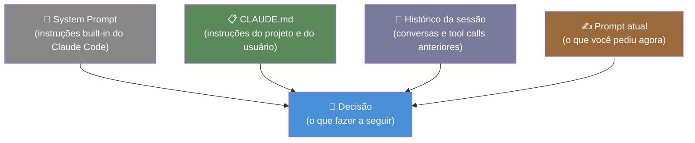

# Como o agente decide — confiança, raciocínio, iteração

> [!abstract] TL;DR
> Claude Code usa raciocínio antes de agir — mesmo quando você não vê. O system prompt, CLAUDE.md e o histórico da sessão moldam cada decisão. A qualidade do prompt afeta diretamente a qualidade das decisões: "adicione auth" gera uma decisão muito mais incerta que "adicione JWT auth ao middleware Express em src/middleware/auth.ts, seguindo o padrão de src/middleware/logger.ts". Explicar o *porquê* frequentemente produz resultados melhores que especificar o *como*.

---

## O raciocínio invisível — o que acontece antes de cada tool call

Quando você digita "adicione tratamento de erros ao serviço de pagamento", o agente não executa imediatamente. Há um passo invisível: **raciocínio**.

O agente lê a situação completa — seu pedido, o histórico da sessão, as instruções do CLAUDE.md, as restrições do system prompt — e decide: o que faço agora? Qual arquivo leio primeiro? Qual é o escopo da mudança? Devo perguntar antes de agir?

Pense em um dev sênior que recebe um ticket vago: "improve error handling in payments". Ele não vai imediatamente editar um arquivo. Vai primeiro entender o que existe hoje, quais os padrões do projeto, qual é o impacto da mudança. Claude Code faz o equivalente — só que em token de raciocínio, não em minutos de análise.

A diferença crucial: o raciocínio do agente é moldado pelo contexto que você fornece. Um contexto vago produz raciocínio incerto. Um contexto preciso produz raciocínio preciso.

---

## As quatro camadas de contexto que informam cada decisão



**System prompt** — as instruções built-in do Claude Code: como pedir confirmação antes de ações destrutivas, quais tools usar para quê, como formatar respostas. Você não edita isso diretamente.

**CLAUDE.md** — suas instruções permanentes: convenções do projeto, padrões preferidos, restrições de domínio. Funciona como o briefing de um tech lead para um novo desenvolvedor.

**Histórico da sessão** — tudo que aconteceu na sessão atual: suas perguntas anteriores, as respostas do agente, os arquivos lidos, os erros encontrados. Cada turn informa o próximo.

**Prompt atual** — o que você pediu agora, no momento. Isso tem peso alto porque está no final do contexto — região de alta atenção.

---

## Decisão: clarificar vs proceder

Uma das decisões mais importantes que o agente toma é: "devo perguntar ou devo agir?"

| Situação | Comportamento típico | Por quê |
|----------|---------------------|---------|
| Tarefa clara com contexto suficiente | Age sem perguntar | Prompt específico + CLAUDE.md cobrem a incerteza |
| Tarefa ambígua com múltiplas interpretações | Pergunta ou escolhe a conservadora | Risco de fazer errado supera o custo de perguntar |
| Ação irreversível (delete, push, drop table) | Pede confirmação explícita | System prompt instrui para isso |
| CLAUDE.md proíbe explicitamente | Recusa e explica | Instrução tem maior peso que inferência |
| Em modo headless (sem interatividade) | Escolhe a interpretação mais conservadora | Não pode perguntar — minimiza danos potenciais |

**O que "mais conservadora" significa na prática:**
- Faz menos do que poderia fazer (escopo mínimo)
- Prefere não-destruição a destruição quando em dúvida
- Adiciona um comentário explicativo sobre o que assumiu
- Deixa um `// TODO: verify this assumption` em vez de assumir silenciosamente

---

## O papel do CLAUDE.md nas decisões — mesmo prompt, resultado diferente

O CLAUDE.md é talvez o maior multiplicador de qualidade das decisões do agente. Veja o mesmo prompt com e sem ele:

**Sem CLAUDE.md:**

```
você: adicione tratamento de erro ao fetchUser

agente: [pensa: o projeto usa JavaScript? TypeScript? qual é o padrão de erro?]
        [lê auth.ts para descobrir]
        [adiciona try/catch genérico com console.error]
        [escolheu console.error porque é o mais comum em projetos sem especificação]
```

**Com CLAUDE.md que diz:**
```markdown
## Error handling
- Use the custom logger in src/utils/logger.ts (never console.error directly)
- All errors must be instances of AppError from src/errors/AppError.ts
- Log level: logger.error for unexpected errors, logger.warn for expected failures
```

```
você: adicione tratamento de erro ao fetchUser

agente: [pensa: project tem AppError + logger customizado — vou usar ambos]
        [lê src/errors/AppError.ts rapidamente para confirmar a interface]
        [adiciona try/catch usando logger.error(new AppError('USER_NOT_FOUND', err))]
```

A decisão foi diferente não porque o agente é mais "inteligente" — mas porque o contexto era mais rico. O CLAUDE.md transformou uma decisão ambígua em uma decisão informada.

---

## Como melhorar a qualidade das decisões: especificidade

### Progresso no nível de especificidade

```
Nível 1 — Vago (força adivinhação):
  "melhore os testes"

Nível 2 — Específico (reduz ambiguidade):
  "adicione testes para os casos de erro em src/services/payment.ts"

Nível 3 — Contextualizado (elimina adivinhação):
  "adicione testes para os casos de erro em src/services/payment.ts.
  Faltam testes para: card decline, insufficient funds, expired card.
  Siga o padrão de src/services/auth.test.ts para estrutura e assertions."
```

Cada nível reduz o espaço de decisão do agente. No nível 3, o agente não precisa decidir *o que* testar nem *como estruturar* — pode focar em *escrever os testes*.

### Por que > Como

Explicar o objetivo produz decisões melhores que prescrever os passos:

```
Prescritivo (como): "edite src/cache.ts linha 47 para adicionar um timeout de 5000ms"

Baseado em objetivo (por quê): "o Redis está causando timeouts em produção quando fica
indisponível. Adicione timeout de 5 segundos às conexões em src/cache.ts para que o
serviço degrade graciosamente em vez de travar."
```

Com o "por quê", o agente pode:
- Verificar se há outros pontos no código com o mesmo problema
- Escolher a implementação correta para o contexto (não apenas a mais óbvia)
- Adicionar um comentário explicativo no código
- Avaliar se a mudança tem side effects em outros lugares

---

## Raciocínio visível — Plan Mode e `--verbose`

Em modo normal, o raciocínio é invisível — você vê só as ações. Em plan mode e com `--verbose`, parte do processo fica exposta:

**Plan Mode (Shift+Tab):**
```
[Plano para "adicione JWT auth ao middleware Express"]

1. Ler src/middleware/auth.ts para entender a implementação atual
2. Ler src/middleware/logger.ts (mencionado como referência) para entender o padrão
3. Verificar se jsonwebtoken está em package.json
4. Modificar auth.ts:
   - Adicionar verificação do header Authorization
   - Implementar jwt.verify com a secret em JWT_SECRET (env var)
   - Retornar 401 com mensagem padrão se token inválido
5. Escrever testes básicos
6. Rodar npm test para validar

Risco: mudança em middleware afeta todas as rotas — verificar se há rotas públicas
que não devem exigir auth (ex: /health, /login, /register)
```

Aqui o agente está expondo seu raciocínio: ele identificou um risco (rotas públicas) que você talvez não tivesse mencionado. Isso é o valor do plan mode — o agente mostra o que entendeu e você pode corrigir antes da execução.

---

## Incerteza e erros de decisão — os padrões mais comuns

**Assumir convenções sem CLAUDE.md:**
O agente escolhe o padrão mais comum da internet, não o do seu projeto. Se você usa uma lib de erro customizada mas não documentou isso, o agente vai usar `new Error()`.

**Solução local para problema sistêmico:**
O prompt descreveu o sintoma, não a causa. O agente corrige onde o sintoma aparece, não a raiz. Exemplo: "o teste X está falhando" → agente corrige o teste em vez de o código que o teste está testando.

**Over-engineering:**
Prompt vago permite interpretação ampla. "Melhore a performance" pode resultar em cache, lazy loading, e reescrita do módulo quando você queria só um índice no banco.

**Under-engineering:**
Prompt ambíguo, agente escolhe interpretação conservadora. "Adicione validação" resulta em validação mínima quando você queria validação completa com mensagens de erro detalhadas.

---

## Iteração — o agente não é one-shot

Um equívoco comum: tratar Claude Code como um gerador de código one-shot. Você digita o pedido, ele produz o resultado, fim. Na prática, o processo é iterativo — e o agente está projetado para isso.

```
Turno 1: "adicione autenticação JWT ao middleware"
Turno 2: Agente lê os arquivos relevantes
Turno 3: Agente escreve a primeira versão
Turno 4: Agente roda os testes
Turno 5: Testes falham — agente analisa o erro
Turno 6: Agente corrige o problema identificado
Turno 7: Agente roda os testes novamente
Turno 8: Testes passam — agente reporta conclusão
```

Cada turno é uma nova decisão baseada no que veio antes. O agente vê o resultado de suas ações e adapta. Isso é o loop agentic em ação — não uma geração linear.

**Consequência para como você usa o agente:**
- Não tente especificar tudo de uma vez — o agente vai iterar de qualquer forma
- Deixe o agente chegar ao resultado por meio de iterações, intervindo quando vir algo errado
- Cada intervenção sua é um dado de feedback que melhora as próximas decisões

---

## Quando o agente usa raciocínio estendido

Claude 3.7 Sonnet e modelos subsequentes com suporte a "extended thinking" usam um processo de raciocínio mais profundo para problemas complexos. Esse raciocínio fica visível como um bloco `<thinking>` antes da resposta.

**Quando é ativado automaticamente:**
- Problemas que exigem múltiplos passos de raciocínio
- Trade-offs entre abordagens diferentes
- Tarefas que envolvem incerteza sobre o domínio

**O que você vê (com `--verbose`):**
```
<thinking>
The user wants to add JWT auth. Let me think about this:
1. Current auth: the project uses session cookies (I saw this in auth.ts)
2. JWT is stateless — this will change how middleware propagates identity
3. The request says "follow the pattern of logger.ts" — let me check what
   pattern that implies for error handling
4. Potential issue: routes that are public (/health, /login) need to be exempted
   I don't see this listed anywhere — I should ask or add a TODO
</thinking>

Vou adicionar JWT auth ao middleware. Observei que algumas rotas podem precisar ser
públicas (/health, /login) — adicionarei um TODO para verificar isso.
```

O raciocínio estendido não é apenas "mais processamento" — é o agente verificando suas próprias assunções antes de agir. Quando você vê um `<thinking>` longo, é o agente sendo cuidadoso.

---

## Como o agente expressa incerteza

O agente não garante silenciosamente — ele sinaliza quando não tem certeza:

| Sinal | Significado |
|-------|-------------|
| Pergunta antes de agir | Alta incerteza sobre o escopo ou abordagem |
| Comentário `// Note: this assumes X` | Assunção implícita que o agente registrou explicitamente |
| "Fiz X, mas Y poderia ser mais adequado se..." | Reconhecimento de trade-off |
| `// TODO: verify this` no código | O agente não tinha informação suficiente para decidir |
| Status `DONE_WITH_CONCERNS` | Tarefa completada mas com ressalvas |

Esses sinais são informação valiosa — não os ignore. Um `// Note: this assumes the auth token is in the Authorization header` é o agente dizendo "verifique isso antes de fazer deploy".

**Como responder a sinais de incerteza:**

```
# Agente fez uma pergunta antes de agir
→ Responda com especificidade. Não "pode prosseguir" — diga "use JWT, siga o padrão
  de src/middleware/auth.ts, exclua a rota /health da verificação".

# Agente adicionou um TODO
→ Decida se é uma assunção correta (remova o TODO) ou algo que precisa ser resolvido
  (responda indicando a decisão correta).

# Agente disse "Y poderia ser mais adequado se..."
→ Leia o raciocínio e confirme ou redirecione. Silêncio aqui significa "continue com X".
```

---

## O ciclo de feedback — como corrigir o agente eficientemente

**Feedback ineficiente:**
```
você: "não era isso, tenta de novo"
agente: [tenta outra abordagem sem entender o que estava errado]
```

**Feedback eficiente:**
```
você: "o tratamento de erro está errado — você usou AppError mas não passou o código de
      erro HTTP correto. Veja o padrão em src/errors/AppError.ts linha 23: o segundo
      argumento deve ser o status code HTTP. Corrija apenas isso."
agente: [entende exatamente o que estava errado, corrige com precisão]
```

Três elementos do feedback eficiente:
1. **O que estava errado** — não apenas "estava errado"
2. **Por que estava errado** — o critério de correção
3. **O escopo da correção** — o que *não* deve mudar

---

## Armadilhas

**Prompt de telefone quebrado.** "melhore o código" → agente faz mudanças de estilo → você diz "não era isso" → agente faz outra coisa. Cada iteração vaga desperdiça tokens e frustração. Invista 2 minutos num prompt preciso.

**Confiança implícita.** O agente não perguntará sobre tudo que não sabe. Se você não especificou o logger, ele escolheu um. Revise outputs, especialmente em sessões longas onde o contexto é resumido.

**Correções sem contexto.** "não era isso, tenta de novo" sem explicar o que estava errado é feedback ineficiente. O agente vai tentar outro caminho sem saber qual critério usar.

**Não usar plan mode em tarefas críticas.** Para mudanças que afetam múltiplos arquivos ou módulos críticos, o custo de verificar o plano antes da execução é irrisório comparado ao custo de reverter mudanças incorretas.

---

## Checklist — decisões de alta qualidade

- [ ] Para tarefas ambíguas, invista em um prompt mais específico antes de enviar
- [ ] Explique o *porquê* da tarefa, não apenas o *o quê* e *como*
- [ ] Use plan mode para tarefas que afetam múltiplos arquivos ou módulos críticos
- [ ] Documente convenções no CLAUDE.md — o agente usa essas informações em todas as decisões
- [ ] Fique atento a sinais de incerteza do agente (perguntas, TODOs, comentários de assunção)
- [ ] Ao corrigir, especifique o que estava errado E o critério de correção
- [ ] Para feedback, aponte o arquivo e linha específicos sempre que possível

---

## Como explicar em inglês

| Português | Inglês |
|-----------|--------|
| Raciocínio interno | Internal reasoning / chain of thought |
| Contexto de decisão | Decision context |
| Incerteza | Uncertainty |
| Escopo mínimo | Minimal scope / conservative approach |
| Feedback eficiente | Targeted feedback |
| Prompt específico | Specific / targeted prompt |
| Plano de ação | Action plan |

**Frases úteis:**
- "The model reasons before acting — even when you can't see it. The quality of that reasoning depends on the context you provide."
- "CLAUDE.md is like a tech lead briefing: it shapes every decision the agent makes without you having to repeat yourself."
- "I use plan mode for any refactoring that touches more than 3 files — it's cheap to verify the plan and expensive to revert bad changes."
- "Explain the *why*, not just the *what*. 'Fix the Redis timeout' tells the agent the symptom; 'the service hangs when Redis is unavailable' tells it the problem."

---

## Veja também

- [[03-Dominios/Tecnologia/IA/Claude Code/Workflows/09 - Prompting para Claude Code|09 - Prompting para Claude Code]] — técnicas de prompting em profundidade
- [[03-Dominios/Tecnologia/IA/Claude Code/Configuração/index|Configuração]] — CLAUDE.md e como moldar decisões do agente
- [[03-Dominios/Tecnologia/IA/Claude Code/Mental Model/01 - O loop agentic|01 - O loop agentic]] — o ciclo Plan→Act→Observe→Iterate
- [[03-Dominios/Tecnologia/IA/Claude Code/Mental Model/05 - Modos de operação|05 - Modos de operação]] — plan mode para verificar raciocínio antes de executar
- [[03-Dominios/Tecnologia/IA/Claude Code/Mental Model/index|Mental Model]] — índice do galho

---

## Referências

- **Anthropic** — *Be clear and direct* (2026). Técnicas de prompting para reduzir ambiguidade — https://docs.anthropic.com/pt/docs/build-with-claude/prompt-engineering/be-clear-and-direct
- **Anthropic** — *Let Claude think* (2026). Como raciocínio interno melhora a qualidade de decisões — https://docs.anthropic.com/pt/docs/build-with-claude/prompt-engineering/extended-thinking
- **Anthropic** — *CLAUDE.md and context* (2026). Como o CLAUDE.md molda o comportamento do agente — https://docs.anthropic.com/pt/docs/claude-code/memory
- **Wei et al.** — *Chain-of-Thought Prompting Elicits Reasoning in Large Language Models* (2022). Base teórica para o raciocínio antes da ação — https://arxiv.org/abs/2201.11903


