# O harness como terceira camada — código, testes, harness

> [!abstract] TL;DR
> O **harness** é a configuração que envolve o modelo — CLAUDE.md hierárquico, hooks, skills, plugins, MCP servers, integração LSP e subagents — e determina a performance do Claude Code tanto quanto o modelo escolhido. A tese da Anthropic é dura: focar em benchmarks de modelo sem investir no harness produz resultados aquém do possível. Esta nota ancora os 6 galhos da trilha como componentes do harness e introduz três temas órfãos: manutenção do harness em ciclos de 3-6 meses, drift de regras escritas pra modelos antigos, e ownership organizacional (DRI ou "agent manager").

---

## A analogia: código sem testes, testes sem harness

Nos primeiros anos do desenvolvimento de software, o código era a única camada que importava. Funcionou? Enviou. A introdução de testes automatizados foi uma revolução conceitual — não mudou o código, mas mudou como você *sabia* que o código funcionava. A segunda camada transformou a forma de trabalhar.

O harness de IA é a terceira revolução com a mesma estrutura:
- **Código**: o que o software faz
- **Testes**: como você sabe que o software faz o que deveria
- **Harness**: como o agente de IA percebe e age no software

Um código bem estruturado com bons testes mas harness zero vai subperformar um código menos elegante com harness bem configurado. O modelo de IA é a CPU; o harness é o sistema operacional que transforma capacidade bruta em comportamento governado e previsível.

---

## A tese central

A Anthropic foi direta no post sobre Claude Code em codebases grandes:

> "The ecosystem built around the model — the harness — determines how Claude Code performs more than the model alone."

Isso inverte a intuição usual. Quando Claude Code não performa bem, o reflexo é "preciso de um modelo melhor". A pergunta correta é: "o harness está configurado para que esse modelo renda?"

Não é uma ou outra. É uma soma: modelo capaz + harness adequado = performance máxima. Mas se você só puder otimizar um, o harness tem ROI mais alto — porque ele persiste entre sessões, entre desenvolvedores, e entre versões do modelo.

---

## Os 7 componentes do harness

```mermaid
flowchart TD
    subgraph Harness["⚙️ O Harness"]
        CM["📋 CLAUDE.md\n(contexto hierárquico)"]
        HK["🪝 Hooks\n(guardrails e eventos)"]
        SK["🎯 Skills\n(expertise on-demand)"]
        PL["📦 Plugins\n(bundles distribuíveis)"]
        MCP["🔌 MCP Servers\n(tools e dados externos)"]
        LSP["🧭 LSP\n(navegação por símbolo)"]
        SA["🤖 Subagents\n(isolamento de contexto)"]
    end

    CM --> HK
    HK --> SK
    SK --> PL
    PL --> MCP
    MCP --> LSP
    LSP --> SA

    style Harness fill:#f0f4ff,stroke:#4a90d9
    style CM fill:#5a8a5a,color:#fff
    style HK fill:#8a5a5a,color:#fff
    style SK fill:#5a5a8a,color:#fff
    style PL fill:#8a7a3a,color:#fff
    style MCP fill:#3a7a8a,color:#fff
    style LSP fill:#6a4a8a,color:#fff
    style SA fill:#4a6a3a,color:#fff
```



| Componente | Função | ROI relativo | Coberto em |
|---|---|---|---|
| **CLAUDE.md** | Contexto em toda sessão; hierárquico (raiz + subdiretórios) | 🟢 Alto | Configuração |
| **Hooks** | Scripts em eventos do ciclo de vida; guardrails e self-improvement | 🟢 Alto | Hooks e Guardrails |
| **Skills** | Expertise on-demand, glob-scoped, progressive disclosure | 🟢 Alto | Skills e MCP |
| **Plugins** | Bundles de skills+hooks+MCP distribuídos via marketplace | 🟡 Médio (apenas se distribuído) | Skills e MCP |
| **MCP servers** | Conexões com tools, dados e APIs internas | 🟢 Alto | Skills e MCP |
| **LSP integrations** | Navegação por símbolo vs grep por string | 🟡 Médio (contextos específicos) | — não coberto ainda |
| **Subagents** | Instâncias isoladas para separar exploração de edição | 🟢 Alto | Workflows |

**A ordem importa:** o post recomenda construir top-down. CLAUDE.md primeiro, depois hooks, depois skills. Pular para MCP server custom antes do CLAUDE.md funcionar é otimizar antes do básico.

**Impacto de cada componente por etapa de adoção:**

```
Etapa 1 — Só o modelo (sem harness):
  Agente funciona mas é genérico, pergunta convenções, inconsistente com o projeto

Etapa 2 — CLAUDE.md bem escrito (+30 min de investimento):
  Agente para de perguntar convenções básicas, 80% mais consistente com o projeto

Etapa 3 — Hooks de guardrail (+1h):
  Agente não faz ações destrutivas sem confirmação, CI integrado como gate

Etapa 4 — Skills de domínio (+2h):
  Tarefas recorrentes se tornam comandos de uma linha (/review-security, /add-migration)

Etapa 5 — MCP servers (+2-4h):
  Agente acessa dados do projeto em tempo real (banco, logs, documentação interna)

Etapa 6 — Subagents configurados (+1h):
  Tarefas longas separadas em contextos isolados; exploração não polui execução
```

---

## Dois cortes do mesmo harness

A lista acima é um corte **autoral** — "que artefatos você escreve para configurar o Claude Code?". A academia formalizou um corte **funcional** — "que funções o harness precisa prover?".

O survey *Externalization in LLM Agents* (arXiv:2604.08224, abr/2026) decompõe a cognição externalizada em três dimensões:
- **Memory** — estado persistente entre interações
- **Skills** — procedimentos especializados on-demand
- **Protocols** — contratos de interação com dados e ferramentas

O harness não é uma quarta dimensão — é o **runtime que hospeda as três** e provê os mediadores: sandboxing, observabilidade, compressão, avaliação, approval loops, orquestração de sub-agentes.

| Componente autorável | Função que encarna |
|---|---|
| CLAUDE.md, MCP servers | Memory + Protocols (contexto e contratos com dados/tools) |
| Skills, plugins | Skills (procedimento especializado) |
| Hooks | Mediadores (approval loops, guardrails) |
| Subagents | Orquestração multi-agente |
| LSP | Protocols (contrato agente↔código) |

> [!info] Múltiplas taxonomias convivem
> Há pelo menos quatro taxonomias concorrentes do harness em 2026 e nenhuma venceu. Conviver com as lentes é mais útil que escolher uma. O tratamento completo desse debate está em [[03-Dominios/Tecnologia/IA/Anatomia de Agents/11 - Harness engineering — a terceira camada|Harness engineering — a terceira camada]].

---

## Os três padrões organizacionais que aparecem em todo deploy bem-sucedido

### Padrão 1: Codebase navegável em escala

Claude Code navega via grep + leitura, não via índice central. Em escala grande, isso depende de escopo:

```
Estrutura boa para harness escalável:

/projeto
├── CLAUDE.md               ← só gotchas críticos + ponteiros para subdiretórios
├── src/
│   ├── CLAUDE.md           ← convenções do módulo src
│   ├── auth/
│   │   └── CLAUDE.md       ← convenções específicas de auth
│   └── payments/
│       └── CLAUDE.md       ← convenções específicas de pagamentos
├── tests/
│   └── CLAUDE.md           ← padrões de teste
└── .claudeignore            ← node_modules, build/, generated/
```

Cada subdiretório carrega seus próprios contextos aditivamente. O agente inicializado em `src/payments/` carrega: `~/.claude/CLAUDE.md` + `/CLAUDE.md` + `/src/CLAUDE.md` + `/src/payments/CLAUDE.md`.

### Padrão 2: Manutenção ativa do harness (3-6 meses)

Este é o tema mais subexplorado em conteúdo público sobre Claude Code: **o harness envelhece**.

> "Instructions written for your current model can work against a future one."

Exemplo concreto: um hook que interceptava writes para forçar `p4 edit` em codebase Perforce ficou redundante quando Claude Code ganhou modo Perforce nativo. Pior — virou ruído que o agente precisava processar e ignorar.

**Sinais de drift do harness:**
- Hooks que existem para compensar limitação que o modelo atual não tem mais
- Regras de CLAUDE.md que prescrevem patterns que o modelo atual já segue por padrão
- Skills duplicando capability que virou nativa
- Instruções contraditórias: regra antiga + comportamento novo do modelo em conflito

**Calendário sugerido:**
- Revisão regular: a cada 3-6 meses
- Revisão fora de ciclo: após release de novo modelo com capabilities relevantes
- Critério de remoção: "se eu tirar essa regra, o agente vai errar?" — se não, remova

### Padrão 3: Ownership organizacional

Adoção bottom-up gera entusiasmo mas fragmenta sem alguém para centralizar o que funciona.

| Escala | Modelo de ownership |
|--------|-------------------|
| Time pequeno (2-5 devs) | DRI (uma pessoa com autoridade sobre o harness) |
| Time médio (5-20) | "Agent manager" — papel híbrido PM/engenheiro |
| Org grande (20+) | Time dedicado DevEx/DevProd construindo o harness antes do rollout |

Sem ownership, "good setups stay tribal" — cada dev evolui o próprio harness e a organização não aprende como um todo.

---

## Em escala individual — o harness de um dev solo

O playbook foi escrito para orgs com milhares de devs, mas os princípios modulam. Observando o padrão de um dev senior solo com projeto multi-repo:

**Hub-and-spoke, não simétrico:** Harness denso no repo que concentra complexidade arquitetural (muitas skills, hooks de validação, subagents read-only, MCP para banco de dados), mínimo nos outros (CLAUDE.md curto). O ROI de skills detalhadas é proporcional à frequência de mudança no domínio.

**DRI = a mesma pessoa:** Não há "agent manager" nem time. Vantagem: zero overhead de coordenação. Custo: vulnerabilidade a bus factor 1 e ausência de revisão externa do harness.

**ROI por componente em escala individual:**

| Componente | ROI solo | Custo solo |
|---|---|---|
| CLAUDE.md | 🟢 Alto — impacto imediato em toda sessão | 30 min de setup |
| Hooks | 🟢 Alto — guardrails e automação | 1-2h de setup |
| Skills | 🟢 Alto — expertise on-demand | 30 min por skill |
| MCP servers | 🟢 Alto — acesso a dados do projeto | 1-2h de setup |
| Subagents | 🟢 Alto — isolamento de contexto em tarefas longas | Configurável per-task |
| LSP | 🟡 Médio — compensa em codebases não-tipadas | 1h de experimento |
| Plugins | 🔴 Baixo solo — vale apenas se você vai distribuir | Alto |

---

## Harness como investimento incremental — não big-bang

Um erro comum é planejar o harness perfeito antes de escrever uma linha. O harness mais eficaz é o que cresce junto com o uso. O processo natural:

```
Semana 1: Sem harness
  Agente: "qual é a convenção de nomear testes neste projeto?"
  Você: [explica pela segunda vez essa semana]

Semana 2: Primeira versão do CLAUDE.md
  # Test naming
  - Test files: *.test.ts
  - Test functions: describe('ServiceName', () => { it('behavior', ...) })
  O agente para de perguntar sobre nomenclatura.

Semana 4: Primeiro hook
  Você: [percebe que o agente às vezes commita direto sem passar pelo CI]
  Hook: PreToolUse → Bash(git commit) → verifica se CI está passando primeiro

Semana 8: Primeira skill
  Você: [percebe que toda semana pede "revise este PR por segurança"]
  Cria skill review-security com o prompt padrão
  O pedido vira: /review-security
```

A pergunta em cada semana não é "qual é o harness ideal?" mas "o que o agente fez errado ou com fricção esta semana que uma configuração poderia prevenir?"

---

## O ciclo de manutenção em ação — exemplo concreto

O post da Anthropic descreve o caso de um hook Perforce que envelheceu mal. Aqui está um exemplo análogo com Git:

**Contexto (2025):** Claude Code antes de suporte nativo a Git assume que você quer `git add -A` em todas as operações. Você cria um hook que intercepta commits e verifica se o staging foi feito explicitamente.

```json
// hook de 2025 — necessário naquela época
{
  "hooks": {
    "PreToolUse": [{
      "matcher": "Bash(git commit*)",
      "hooks": [{
        "type": "command",
        "command": "test -n \"$(git diff --cached)\" || (echo 'Nothing staged' && exit 1)"
      }]
    }]
  }
}
```

**2026:** Claude Code adota policy de staging explícito por padrão — nunca faz `git add -A`, sempre stages paths específicos. O hook acima ainda funciona, mas agora valida uma regra que o agente já segue. Resultado: processamento extra em cada commit, sem benefício.

**Na revisão de 3 meses:**
- Teste: remova o hook, observe por uma semana
- Resultado: sem regressão — o agente continua fazendo staging explícito
- Ação: remove o hook, documenta o motivo no commit de remoção

Este é o ciclo de manutenção funcionando. O hook não foi um erro — foi necessário quando foi escrito. A revisão periódica é que garante que o harness não accumule peso morto.

---

## Antes/depois — o impacto mensurável do harness

Comparação de uma sessão de refactoring com e sem harness configurado, no mesmo codebase, com o mesmo modelo:

| Métrica | Sem harness | Com harness (CLAUDE.md + skills) |
|---------|-------------|----------------------------------|
| Perguntas feitas pelo agente | 8 | 1 |
| Tentativas antes de acertar o padrão de erro | 3 | 1 |
| Leituras de arquivo para "aprender" convenções | 12 | 3 |
| Tokens consumidos | ~120k | ~45k |
| Consistência com code style do projeto | 60% | 95% |

O harness não torna o agente mais "inteligente" — ele reduz a incerteza que o agente precisa resolver em runtime. Parte do trabalho de descoberta que aconteceria na sessão foi feito uma vez no CLAUDE.md e reutilizado em todas as sessões subsequentes.

---

## A versão acadêmica da tese: ganhos harness-sensitive

A frase da Anthropic que abre esta nota ganhou em 2026 uma formulação acadêmica no preprint *Harness Engineering for Language Agents* (proposta CAR — Control/Agency/Runtime):

> "Many reported agent gains may be partly harness-sensitive rather than purely model-driven."

**O que isso significa na prática:** quando o "Modelo X v2" sobe pontos no SWE-bench, o ranking não diz quanto veio do modelo e quanto veio do scaffold em volta. Os autores propõem o **HarnessCard** — um artefato leve de reporte para que progresso em agentes informe *não só o modelo, mas também o harness*.

Para quem opera Claude Code: ao comparar dois setups, fixe o harness antes de atribuir uma diferença ao modelo. Um eval que troca modelo *e* config ao mesmo tempo está medindo uma variável confundida.

> [!caution] Sobre a fonte
> CAR e HarnessCard vêm de um preprint não peer-reviewed — é posição argumentada, não achado validado. O ponto, porém, ecoa o que a própria Anthropic afirma em prosa.

---

## Casos práticos

Duas situações reais mostram o mesmo princípio — harness proporcional ao contexto — puxado em direções opostas.

**Cenário 1 — Harness em codebase grande (monorepo com 40+ módulos).** Um monorepo de e-commerce cresceu de 3 para 40 módulos em dois anos. O CLAUDE.md raiz tinha 800 linhas — todo o histórico de decisões arquiteturais acumulado, nunca podado. Resultado: cada sessão carregava contexto irrelevante para a tarefa em mãos (um dev mexendo em `payments/` recebia instruções sobre `notifications/` que nunca usaria). A correção seguiu o Padrão 1 desta nota: CLAUDE.md raiz reduzido a gotchas críticos + ponteiros, com um `CLAUDE.md` por módulo carregando só as convenções daquele subdiretório. Tempo de "aquecimento" da sessão (perguntas de convenção antes da primeira edição útil) caiu de ~6 perguntas para ~1. A lição não é "harness grande é ruim" — é que harness em escala precisa de **escopo hierárquico**, não de um arquivo único inflando sem limite.

**Cenário 2 — Harness em time distribuído (8 devs, 3 fusos horários).** Um time distribuído sem ownership claro do harness (Padrão 3) viu cada dev configurar hooks e skills próprios em `.claude/` local, nunca comitados. Um dev na Ásia criava skills de revisão de segurança; um dev na Europa criava hooks de guardrail para migrations — nenhum dos dois sabia que o outro tinha resolvido um problema adjacente. Depois de três meses, havia 4 versões incompatíveis de "como revisar um PR" espalhadas em máquinas individuais. A correção: nomear um DRI que centralizasse os artefatos do harness em `.claude/` versionado no repo, com PR review para mudanças de hook/skill — o mesmo rigor aplicado a código de produção. O ganho não foi só consistência técnica; foi *aprendizado compartilhado* — um hook que um dev descobriu que precisava passou a beneficiar os outros sete no mesmo commit.

Os dois casos convergem no mesmo diagnóstico: harness mal-dimensionado (grande demais e centralizado, ou disperso demais e não-compartilhado) desperdiça o ganho que o harness deveria entregar.

---

## Armadilhas comuns

> [!warning] Achar que modelo basta
> Trocar para modelo mais novo sem mexer no harness deixa ganho na mesa — e às vezes regride performance se regras antigas conflitam com o modelo novo.

> [!warning] Inflar CLAUDE.md
> Expertise reusável pertence a skills, não ao CLAUDE.md. Regra: CLAUDE.md = o que se aplica a *toda* tarefa neste path. O resto vai para skill.

> [!warning] Pular para MCP server custom antes do básico
> Sem CLAUDE.md e skills funcionando, MCP só amplifica o caos.

> [!warning] Harness eterno
> Configuração não é set-and-forget. Sem ciclo de revisão, em 12 meses metade das regras é peso morto.

> [!warning] Adoção sem ownership
> Em time, deixar cada dev evoluir o próprio harness produz N versões fragmentadas e nenhuma compartilha aprendizado.

---

## Checklist — harness bem configurado

- [ ] CLAUDE.md raiz cobre somente gotchas críticos + ponteiros para subdiretórios
- [ ] Expertise reusável está em skills, não no CLAUDE.md raiz
- [ ] `.claudeignore` exclui generated/, build/, node_modules/
- [ ] Há um DRI (ou agent manager) responsável pelo harness
- [ ] Ciclo de revisão de 3-6 meses está calendariado
- [ ] Após release de novo modelo, uma revisão fora de ciclo foi agendada
- [ ] Hooks de guardrail bloqueiam ações destrutivas (delete, push, publish)
- [ ] Subagents read-only existem para tarefas de exploração isoladas

---

## Como explicar em inglês

| Português | Inglês |
|-----------|--------|
| Harness | Harness / agent harness |
| Terceira camada | Third layer |
| Drift de regras | Rule drift / harness drift |
| Responsável direto | DRI (Directly Responsible Individual) |
| Ganhos sensíveis ao harness | Harness-sensitive gains |
| Manutenção do harness | Harness maintenance |
| Bundle distribuível | Distributable bundle / plugin |

**Frases úteis:**
- "The harness is what transforms raw model capability into governed, predictable behavior — like an OS for your AI agent."
- "We review our CLAUDE.md and hooks every quarter to remove rules that the model now handles natively."
- "Rule drift is subtle: instructions written for an older model can actively work against a newer one."
- "Before attributing a performance difference to the model, fix the harness variable — run both setups with identical config."

> [!tip] Assista: Anthropic Just Dropped a Masterclass on Building Agent Harnesses (for Large Codebases)
> **Canal:** (criador independente, cobertura do post da Anthropic) | **Duração:** ~30min | **Idioma:** EN
>
> Pega o mesmo post da Anthropic que ancora esta nota — "How Claude Code works in large codebases" — e constrói uma codebase de demonstração aplicando cada estratégia na prática: hooks de guardrail, CLAUDE.md hierárquico, subagents de exploração. É a versão "mão na massa" do que aqui fica em prosa e tabela. Trecho de destaque [11:00]: *"most teams think of hooks as scripts that prevent Claude from doing something wrong... a tool use hook to stop Claude from editing in certain directories."*
>
> 🎬 [Assistir no YouTube](https://www.youtube.com/watch?v=efRIrLXoOVA)

---

## O que vem a seguir

Esta nota fecha o Galho 1 — Mental Model. As oito notas anteriores construíram o "como o agente pensa" (loop agentic, leitura de codebase, tool use, context window, modos de operação, compaction, custo, tomada de decisão); esta nona amarrou o fio que atravessa todas elas: nada disso rende sem um harness bem configurado ao redor.

O próximo passo natural é sair da teoria e entrar na prática de configuração: o galho **[[03-Dominios/Tecnologia/IA/Claude Code/Configuração/index|Configuração]]** detalha como escrever o componente mais visível do harness — o CLAUDE.md — com a anatomia de arquivo, hierarquia de carregamento e receitas testadas. É onde os "7 componentes" desta nota deixam de ser conceito e viram artefato editável no seu projeto.

---

## Veja também

- [[03-Dominios/Tecnologia/IA/Anatomia de Agents/11 - Harness engineering — a terceira camada|Harness engineering — a terceira camada]] — conceito tool-agnóstico; as taxonomias concorrentes
- [[03-Dominios/Tecnologia/IA/Claude Code/index|Claude Code]] — tronco da trilha; os 6 galhos materializam os componentes do harness
- [[03-Dominios/Tecnologia/IA/Claude Code/Mental Model/02 - Como Claude Code lê um codebase|02 - Como Claude Code lê um codebase]] — por que o harness importa: o agente navega, não indexa
- [[03-Dominios/Tecnologia/IA/Claude Code/Configuração/02 - CLAUDE.md anatomia|CLAUDE.md anatomia]] — componente mais visível do harness
- [[03-Dominios/Tecnologia/IA/Claude Code/Time e Automação/index|Time e Automação]] — onde os padrões organizacionais (DRI, agent manager) aprofundam
- [[03-Dominios/Tecnologia/IA/Claude Code/Mental Model/index|Mental Model]] — índice do galho

---

## Fontes

- **Anthropic Applied AI Team** — *How Claude Code works in large codebases* (2026). A tese harness-first e os 7 componentes — https://www.anthropic.com/engineering/claude-code-best-practices
- **Duc Nguyen (AIQuinta)** — *What is an AI Agent Harness? 5 Core Pillars* (2026). A analogia CPU/SO e os 5 pilares operacionais
- **arXiv:2604.08224** — *Externalization in LLM Agents* (abr/2026). Decomposição funcional Memory/Skills/Protocols + harness-runtime. *Preprint.*
- **preprints.org/202603.1756** — *Harness Engineering for Language Agents (CAR)* (abr/2026). Tese "harness-sensitive gains" e proposta HarnessCard. *Preprint, não peer-reviewed.*


