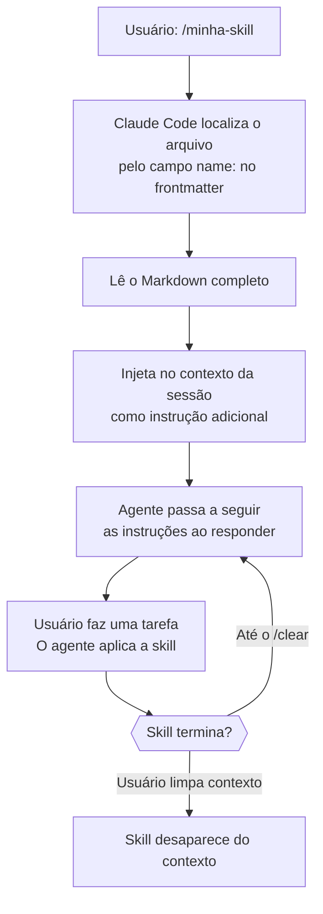
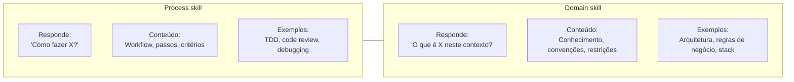
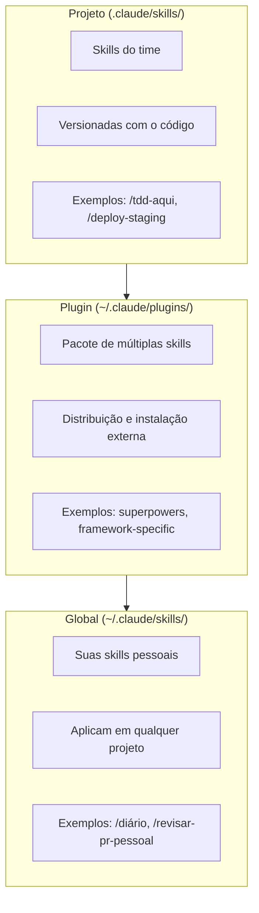
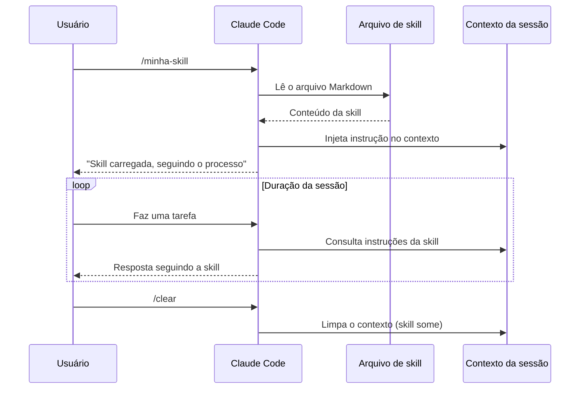

# Anatomia de uma skill — estrutura, frontmatter, tipos

> [!abstract] TL;DR
> Uma skill é um arquivo Markdown com frontmatter YAML que ensina o Claude Code a seguir um processo específico. Ao invocar `/minha-skill`, o agente lê o arquivo e o incorpora no contexto — passando a agir conforme aquelas instruções. É como deixar uma "folha de processo" na bancada do agente antes que ele comece o trabalho.

## A pergunta central: por que skills existem?

Imagine que você contratou um desenvolvedor sênior. Ele chega no primeiro dia cheio de boas intenções — mas não sabe o seu processo de code review. Como você o onborda? Você senta do lado dele, explica as regras, mostra exemplos, corrige quando erra. Isso consome horas.

Agora imagine que, antes de ele sentar, você deixou sobre a mesa um documento: "Processo de code review deste time — leia antes de começar." Ele lê, internaliza, aplica. O onboarding cai de horas para minutos.

Skills são exatamente esse documento. Elas ensinam o [[Dicionário de IA#Claude Code|Claude Code]] a seguir *seu* processo, no *seu* projeto, com as *suas* regras — antes que ele comece qualquer trabalho.

> [!question] Pergunta de aquecimento
> Se você pode dar instruções no chat, por que criar um arquivo separado?
> Resposta: porque instrução no chat some com o contexto. A skill é versionada, invocável pelo nome, compartilhável com o time, e evolui junto com o código.

## O que é uma skill, mecanicamente

Uma skill não é código — é **instrução estruturada**. Quando você invoca `/minha-skill`, o Claude Code:

1. Localiza o arquivo da skill pelo campo `name` no frontmatter
2. Lê o conteúdo completo do arquivo Markdown
3. Injeta esse conteúdo no contexto da sessão como instrução de sistema
4. Passa a seguir aquelas instruções ao longo da conversa

O agente não "executa" a skill como um script — ele a *lê como instrução* e a *aplica*. A diferença é sutil mas importante: o agente usa o próprio julgamento para adaptar a instrução ao contexto específico. A skill guia, não controla.



## Estrutura completa de uma skill

Uma skill bem formada tem três partes: frontmatter, header e corpo.

```markdown
---
name: meu-processo
description: O que esta skill faz — usada pelo agente para decidir relevância automática
metadata:
  type: process
  tags: [testing, tdd, typescript]
  when_to_use: Quando o usuário pede para escrever ou alterar testes
---

# Meu Processo

> [!abstract] TL;DR — resumo de uma linha do que o agente vai fazer

## Quando usar esta skill

Contexto específico onde ela se aplica.

## Passos

1. Passo 1 — concreto e verificável
2. Passo 2 — idem
3. Passo 3 — com critério de saída

## Regras inegociáveis

- Regra crítica que o agente não pode ignorar
- Outra regra

> [!warning] Armadilha comum
> Descreva o que NÃO fazer neste processo.

## Quando terminar

Critério de conclusão — o agente sabe quando parou de aplicar a skill.

## Veja também

- [[Outra skill relacionada]]
```

### Campos do frontmatter

| Campo | Obrigatório | Função |
|-------|-------------|--------|
| `name` | **sim** | Identificador kebab-case. Invocado com `/name`. Deve ser igual ao nome do arquivo. |
| `description` | **sim** | Texto curto. O agente lê isso para decidir se a skill é relevante automaticamente. |
| `metadata.type` | recomendado | `process` ou `domain` — categoriza o catálogo |
| `metadata.tags` | recomendado | Tags para descoberta e filtragem |
| `metadata.when_to_use` | recomendado | Quando o sistema deve sugerir esta skill automaticamente |

> [!tip] O campo `description` é o mais importante depois de `name`
> É a frase que o agente lê para decidir *automaticamente* se uma skill é relevante para o contexto atual. Seja específico: "Para TDD em TypeScript neste projeto" é melhor que "Para testes".

### O corpo: boas práticas

O corpo é texto Markdown livre. O agente lê como instrução e navega pela estrutura dos headers.

**O que funciona bem:**
- Seções com `##` — o agente usa os headers para navegar e priorizar
- Listas numeradas para passos sequenciais — o agente tende a seguir em ordem
- **Negrito** para regras críticas — sinaliza prioridade
- `> [!warning]` para alertas que o agente não deve ignorar
- Exemplos de código quando o comportamento esperado for ambíguo

**O que não funciona:**
- Instruções vagas: "escreva código limpo" não instrui — "prefira composição de funções puras a classes com estado" instrui
- Paredes de texto sem estrutura — o agente perde o fio
- Skills que tentam cobrir tudo — melhor duas skills focadas do que uma skill monolítica

## Tipos de skill

A distinção mais importante em skills é entre **process** e **domain**. Elas respondem perguntas diferentes e têm estruturas diferentes.



### Process skills

Ensinam o agente a seguir um workflow específico. O agente usa a skill como um roteiro a ser executado passo a passo.

**Quando criar uma process skill:**
- Você se vê explicando o mesmo processo para o agente repetidamente
- Existe um workflow com passos claros e ordem importante
- Há critérios de conclusão verificáveis ("escreva o teste antes da implementação")

**Exemplos canônicos:**
- TDD: red → green → refactor, sem pular etapas
- Code review: checklist de segurança, performance, legibilidade, em ordem
- Debugging: reproduzir → isolar → corrigir → testar → documentar
- Deploy: build → smoke test → migração → tag → monitoring

### Domain skills

Ensinam o agente sobre o projeto, o domínio, ou o stack. O agente usa como referência enquanto trabalha em qualquer tarefa.

**Quando criar uma domain skill:**
- O agente toma decisões erradas por não conhecer as convenções do projeto
- Existe conhecimento implícito que você assumiria que um dev da equipe já sabe
- Há restrições técnicas ou de negócio que não aparecem no código

**Exemplos canônicos:**
- Convenções de nomenclatura: "tabelas no plural, snake_case, prefixo `tbl_` proibido"
- Arquitetura: "módulos X, Y, Z — fronteiras e responsabilidades de cada um"
- Regras de negócio: "pedidos com mais de 30 itens seguem fluxo diferente"
- Restrições: "não use `eval()` — auditoria de segurança proíbe"

### Comparação lado a lado

| | Process skill | Domain skill |
|---|---|---|
| Pergunta que responde | Como fazer? | O que é / qual regra? |
| Quando o agente usa | Ao executar o processo | Em qualquer tarefa relacionada |
| Estrutura típica | Passos, checklists, critérios | Definições, exemplos, restrições |
| Tamanho ideal | 50-200 linhas | 20-100 linhas |
| Exemplo de invocação | `/tdd`, `/code-review` | `/convenções`, `/arquitetura` |

## Onde armazenar skills

A localização determina o escopo de aplicação:



**Regra prática:** se a skill é específica do projeto (usa os nomes dos módulos, segue as convenções da equipe), fica em `.claude/skills/` e vai no git. Se é hábito pessoal que você leva de projeto em projeto, fica em `~/.claude/skills/`.

## Como o agente descobre e invoca skills

### Invocação explícita

```
/nome-da-skill
```

O prefixo `/` identifica o nome. O Claude Code procura na ordem:
1. `.claude/skills/` do projeto atual
2. `~/.claude/skills/` pessoal
3. Plugins instalados

Para ver todas as skills disponíveis:
```
/help
```

### Invocação automática

Além da invocação manual, o agente pode carregar skills automaticamente quando detecta relevância pelo campo `description`. Se você tem uma skill com `description: "Para code review de PRs"` e pede ao agente para revisar um PR, ele pode ativar a skill sem você invocar explicitamente.

> [!warning] Não confie na ativação automática para processos críticos
> A detecção automática é heurística — o agente pode não carregar a skill em contextos onde você esperaria. Para processos inegociáveis (segurança, deploy), sempre invoque explicitamente.

## O ciclo de vida de uma skill na sessão



A skill vive no contexto da sessão. Quando o contexto é limpo (com `/clear` ou ao começar uma nova conversa), a skill precisa ser invocada novamente.

## Armadilhas comuns

**Skills muito longas**
O agente lê a skill inteira, consumindo [[Dicionário de IA#Token|tokens]] de contexto. Skills acima de 400-500 linhas começam a competir com o contexto do codebase. Se sua skill está crescendo, pergunte: são dois processos diferentes que deveriam ser duas skills?

**Instruções ambíguas**
"Escreva código limpo" não instrui — o agente não sabe o que você considera limpo neste projeto. "Prefira composição de funções puras a classes com estado; nomeie variáveis pelo que representam, não pelo tipo" instrui.

**Misturar processo e domínio**
Uma skill que ensina TDD *e* documenta a arquitetura do projeto é difícil de manter e invocar. Separe por tipo: a skill de processo ensina o como; a skill de domínio ensina o quê.

**`name` diferente do nome do arquivo**
Convenção é manter `name:` idêntico ao nome do arquivo (sem espaços, kebab-case). Divergência cria confusão: `/meu-processo` não acha o arquivo `meu_processo.md`.

**Não versionar junto ao código**
A skill evolui com o projeto. Se ela vive só localmente e não vai no git, o time fica com versões diferentes do processo — o pior dos mundos.

## Skill como documentação viva

Uma skill bem escrita tem um efeito colateral valioso: ela documenta o processo para humanos também. O arquivo é legível por qualquer membro da equipe. Quando um novo dev entra no projeto, ler as skills dá uma visão rápida de "como as coisas são feitas aqui".

Pense na skill como a intersecção entre "documentação de processo" e "instrução de agente". Ela serve aos dois.

> [!question] Como você sabe se sua skill está boa?
> Mostre para um dev novo no time. Se ele conseguir seguir o processo só lendo a skill, ela está boa. Se ele tiver perguntas que a skill não responde, adicione essas respostas. O agente tem o mesmo problema que o dev novo: ambos precisam de clareza, não de pressupostos.

## Escrevendo instruções eficazes

A qualidade de uma skill depende da qualidade das instruções. Isso parece óbvio mas é difícil na prática: estamos acostumados a escrever documentação para humanos, que inferem contexto, pedem esclarecimentos e toleram ambiguidade. O agente lê literalmente.

### Da vaga à concreta: exemplos reais

| Instrução vaga | Instrução concreta |
|---|---|
| "Escreva testes bons" | "Escreva um teste por comportamento observável; nomeie no padrão `deve_[ação]_quando_[condição]`" |
| "Revisite o código antes de entregar" | "Após escrever o código, leia linha por linha procurando: variáveis não usadas, condições impossíveis, erros de type" |
| "Siga os padrões do projeto" | "Use a convenção de imports: stdlib → externos → internos, separados por linha em branco" |
| "Documente as mudanças" | "Após cada alteração, atualize o CHANGELOG.md na seção `[Unreleased]` com uma linha no formato `- [tipo]: descrição`" |

### A heurística do "dev novo"

Ao escrever uma instrução, pergunte: "Se um dev chegou hoje no time e leu só isso, ele saberia exatamente o que fazer?" Se a resposta for não, a instrução precisa de mais especificidade.

O agente está sempre no lugar do dev novo. Ele não tem histórico do projeto, não sabe das decisões arquiteturais tácitas, não entende os "obviamente"s implícitos.

### Quando exemplos valem mais que regras

Para comportamentos complexos ou sutis, um exemplo de código concreto ensina melhor do que uma regra descrita em prosa:

```markdown
## Formato de mensagem de commit

Use o formato convencional:

```
tipo(escopo): descrição curta no imperativo

Corpo opcional explicando o porquê (não o quê).

Refs: #123
```

Tipos válidos: `feat`, `fix`, `docs`, `refactor`, `test`, `chore`

Exemplo correto:
```
feat(auth): adiciona refresh token automático
```

Exemplo errado (não use):
```
Adicionei o refresh token porque precisava
```
```

O exemplo errado é tão valioso quanto o correto — o agente aprende o que evitar.

## Evolução e manutenção de skills

Skills não são estáticas. Elas envelhecem junto com o projeto — e precisam de manutenção como qualquer outro artefato.

### Sinais de que uma skill precisa de atualização

- O agente frequentemente "quebra" a skill, pedindo clareza em situações que antes eram óbvias
- Você se pega corrigindo o agente sempre no mesmo ponto
- O projeto mudou (nova biblioteca, nova convenção, novo processo) mas a skill ainda reflete o estado antigo
- A skill tem mais de 6 meses sem modificação em um projeto ativo

### Controle de versão na prática

Como as skills ficam em `.claude/skills/`, elas aparecem no `git log` como qualquer outro arquivo. Isso é poderoso: você pode rastrear por que um processo mudou, reverter para uma versão anterior se o time discordar, e fazer code review da skill como faz do código.

```bash
# Ver histórico de uma skill
git log --oneline .claude/skills/tdd.md

# Ver o que mudou numa skill
git diff HEAD~3 .claude/skills/code-review.md
```

> [!tip] Trate skills como código, não como documentação
> Documentação pode envelhecer em paz. Skills envelhecidas geram comportamento errado do agente — e isso é mais difícil de debugar do que um bug no código.

## Como explicar em inglês

**Skill** — a Markdown file that teaches the agent to follow a specific process or understand domain context. Invoked with `/skill-name`, its content is injected into the session context as an instruction.

**Process skill** — teaches the *how*: a workflow the agent should follow step by step (TDD, code review, debugging).

**Domain skill** — teaches the *what*: project-specific knowledge the agent needs to make correct decisions (architecture, naming conventions, business rules).

**Key phrases for interviews:**
- "We use skills to encode team processes as versioned artifacts, so the agent doesn't need to be re-instructed every session."
- "A skill is injected into the model's context — it's not code the agent runs, it's instructions the agent reads and applies."
- "Process skills are about workflow; domain skills are about context."
- "The frontmatter `description` field is what the agent uses for automatic relevance detection — think of it as metadata for the agent, not for humans."
- "Skills colocate process documentation with code, so both evolve together under version control."

**Common follow-up questions:**
- *"How is a skill different from a system prompt?"* — A system prompt is set at API level for all sessions. A skill is opt-in per session, invoked by the user, and can be project-specific and versioned.
- *"Can a skill call another skill?"* — Skills can reference other skills by name and suggest the user invoke them, but there's no automatic chaining at the file level. The agent can mention "you might also want /other-skill" as part of its response.
- *"How do you test that a skill works?"* — Manual testing: invoke it, give a representative task, check if the agent's behavior matches the intended process. Then refine the instructions based on where the agent deviated.

## Referências

- [Claude Code: Skills documentation](https://docs.anthropic.com/en/docs/claude-code/skills) — documentação oficial sobre criação e uso de skills
- [Superpowers skills repository](https://github.com/anthropics/claude-code-superpowers) — exemplos de skills de processo avançadas
- [[03-Dominios/Tecnologia/IA/Claude Code/Skills e MCP/02 - Skills de processo vs domínio|02 - Skills de processo vs domínio]] — quando usar cada tipo em profundidade
- [[03-Dominios/Tecnologia/IA/Claude Code/Skills e MCP/03 - Criar sua primeira skill|03 - Criar sua primeira skill]] — walkthrough prático do zero
- [[03-Dominios/Tecnologia/IA/Claude Code/Skills e MCP/08 - Skills em time|08 - Skills em time]] — versionar e compartilhar skills no time
- [[03-Dominios/Tecnologia/IA/Claude Code/Skills e MCP/index|Skills e MCP]] — índice do galho
- [[03-Dominios/Tecnologia/IA/Claude Code/index|Claude Code]] — tronco da trilha
- [[03-Dominios/Tecnologia/IA/Claude Code/Hooks e Guardrails/index|Hooks e Guardrails]] — galho anterior: automação por eventos vs instrução por skills
- [[Dicionário de IA#Token|Token]] — glossário: o que é token e por que o tamanho da skill importa
