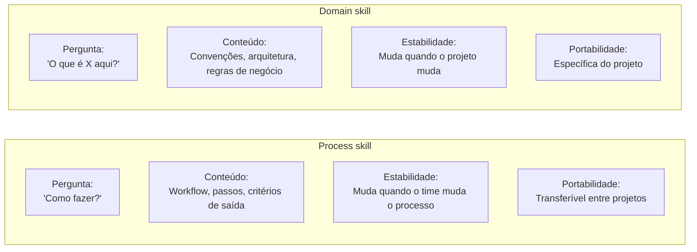
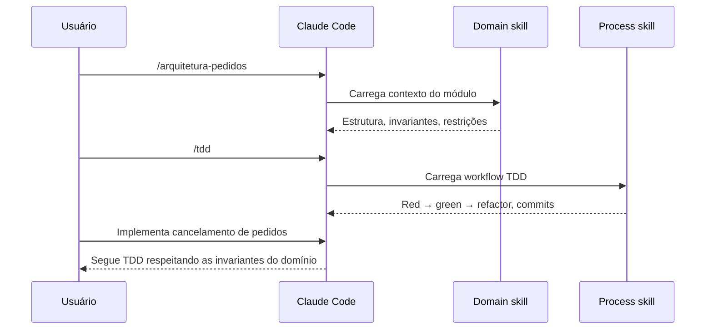
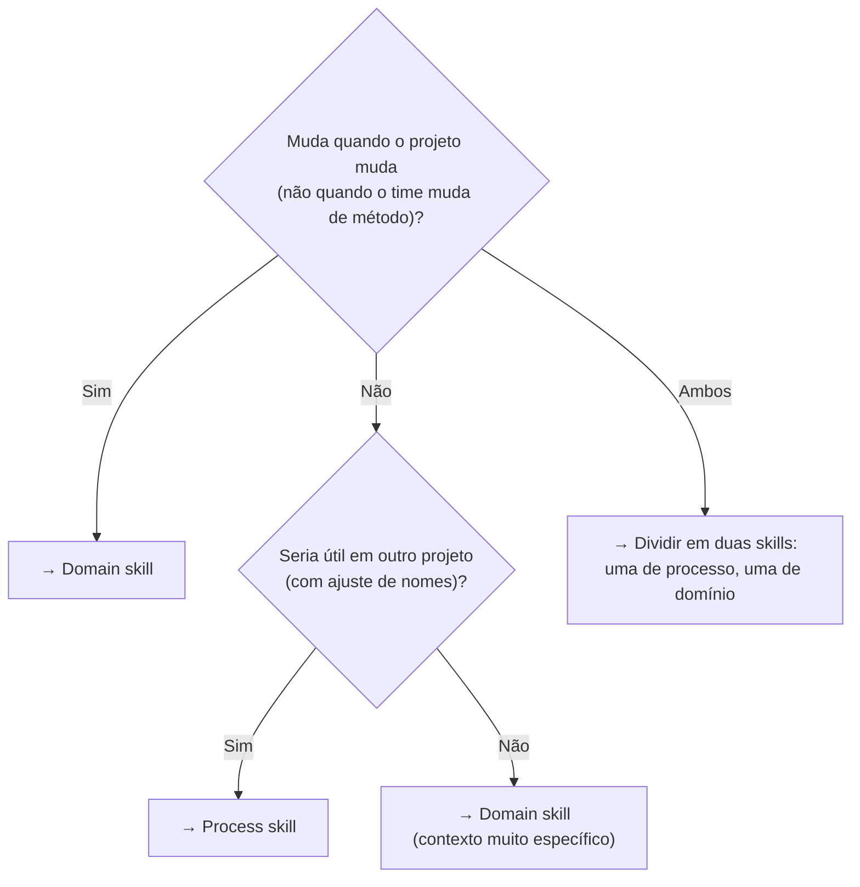

# Skills de processo vs skills de domínio

> [!abstract] TL;DR
> Processo = *como fazer*. Domínio = *o que é*. Skills de processo ensinam o agente a seguir um workflow (TDD, code review, debugging). Skills de domínio ensinam o agente sobre o contexto do projeto (arquitetura, convenções, regras de negócio). A distinção importa porque processo e domínio têm ciclos de vida, invocação e manutenção radicalmente diferentes.

## A analogia do chef

Imagine um chef que acabou de entrar numa nova cozinha.

Ele tem duas coisas para aprender. Primeiro, as **técnicas**: como fazer um roux, como temperar em camadas, como saber o ponto da carne. Essas técnicas são transferíveis — ele aprendeu na escola e leva de cozinha em cozinha.

Segundo, o **contexto da casa**: que a brigada aqui usa salsinha, não coentro; que o forno de canto esquenta mais à direita; que o prato carro-chefe não leva glutén por causa da clientela.

Skills de **processo** são as técnicas — transferíveis, estáveis, sobre o *como*.
Skills de **domínio** são o contexto da casa — específicas do projeto, voláteis, sobre o *o que é aqui*.

O chef (agente) precisa dos dois. Mas quando um erra, o impacto é diferente: técnica errada estraga um prato; contexto errado pode estragar a relação com toda a brigada.

E tem mais: técnica errada é visível — o prato volta da mesa. Contexto errado é silencioso — o chef vai continuar usando ervilha quando o cardápio pede feijão, confiante e eficiente, até alguém notar.

> [!question] Pergunta de aquecimento
> Você tem uma skill com a descrição "Explica como funciona o módulo de pagamentos e como o time processa cobranças". Isso é processo ou domínio? — *É domínio*: ensina o que existe e como funciona, não como executar um workflow.

## A distinção fundamental

**Skills de processo** ensinam o [[Dicionário de IA#Agent|agente]] *como fazer* algo:

- "Para implementar uma feature, siga: teste → implementação → refactor"
- "Para revisar código, verifique: segurança → performance → legibilidade → testes"
- "Para debugar, comece pela reprodução mínima antes de qualquer hipótese"

**Skills de domínio** ensinam o agente *o que é* algo no contexto do projeto:

- "Este projeto usa domain-driven design. Entidades em `src/domain/`, serviços em `src/application/`"
- "A tabela `orders` usa soft delete — nunca DELETE, sempre `deleted_at = NOW()`"
- "O módulo de pagamentos usa filas assíncronas para tudo acima de R$ 1000"



## Quando usar cada tipo

### Use skill de processo quando:

- O workflow tem passos definidos que o agente deveria seguir em sequência
- A tarefa se repete com o mesmo padrão (toda feature segue o mesmo ciclo)
- O processo é transferível para outros projetos com ajuste mínimo
- Você quer garantir que certas verificações sempre aconteçam — o agente não "esquece" o processo

**Catálogo de skills de processo úteis:**

| Nome sugerido | O que instrui |
|---|---|
| `tdd.md` | Red → green → refactor com commits por fase |
| `code-review.md` | Checklist de revisão: segurança, performance, legibilidade |
| `debugging.md` | Reproduzir → isolar → corrigir → testar → documentar |
| `deploy.md` | Verificações antes do push: testes, lint, CHANGELOG, tag |
| `refactoring.md` | Sequência segura: testes cobrem → renomear → mover → extrair |
| `pr-description.md` | Estrutura do PR: contexto, mudanças, como testar |

### Use skill de domínio quando:

- O agente precisa de contexto que não está óbvio no código
- Há convenções não-padrão que o agente violaria sem instrução
- Regras de negócio críticas precisam ser respeitadas
- A arquitetura tem decisões que parecem erradas sem o histórico
- Você se pega explicando o mesmo contexto toda vez que começa uma sessão

**Catálogo de skills de domínio úteis:**

| Nome sugerido | O que ensina |
|---|---|
| `arquitetura.md` | Mapa dos módulos, fronteiras, responsabilidades |
| `convencoes.md` | Nomenclatura, organização de arquivos, estilo |
| `regras-negocio.md` | Invariantes do domínio que não podem ser violadas |
| `stack.md` | Versões, bibliotecas preferidas, o que evitar e por quê |
| `banco.md` | Schema crítico, convenções de migration, soft-delete, índices |
| `infraestrutura.md` | Ambientes, variáveis de ambiente, segredos, endpoints |
| `integracoes.md` | APIs externas, formatos de mensagem, limites de rate |
| `testes.md` | Convenções de nome, onde ficam, quais rodar antes do PR |

## Ciclos de vida diferentes

Esta é a diferença mais prática entre os dois tipos — e a mais ignorada.

```mermaid
flowchart TD
    subgraph VP["Vida de uma Process skill"]
        VP1["Time adota TDD"]
        VP2["Skill criada"]
        VP3["Meses de estabilidade"]
        VP4["Time revisa processo"]
        VP5["Skill atualizada"]
        VP1 --> VP2 --> VP3 --> VP4 --> VP5
    end

    subgraph VD["Vida de uma Domain skill"]
        VD1["Convenção adotada"]
        VD2["Skill criada"]
        VD3["Projeto evolui"]
        VD4["Convenção muda"]
        VD5["Skill desatualizada ⚠️"]
        VD6["Skill atualizada ou aposentada"]
        VD1 --> VD2 --> VD3 --> VD4 --> VD5 --> VD6
    end
```



**Processo** muda quando o time decide mudar como trabalha — e esse evento é relativamente raro. Uma vez que o workflow de TDD funciona, ele permanece estável por meses ou anos. A skill de processo pode ter um owner relaxado.

**Domínio** muda quando o projeto muda. Toda vez que a arquitetura evolui, uma nova regra de negócio surge, ou uma convenção é adotada, a skill de domínio precisa ser atualizada. **Uma skill de domínio desatualizada é pior do que não ter skill** — o agente vai seguir convenções que o projeto abandonou, com confiança e sem aviso.

Imagine: o projeto migrou de soft-delete com `deleted_at` para um campo `archived_at`. A skill de domínio ainda diz `deleted_at`. O agente vai gerar código errado toda sessão — e sem mensagem de erro, porque o agente não sabe que a convenção mudou. O bug só aparece em produção.

> [!warning] Owner obrigatório para skills de domínio
> Cada skill de domínio deveria ter um owner responsável por mantê-la atualizada. Em times pequenos, o tech lead. Em times maiores, quem mais trabalha naquele módulo. Skills sem owner envelhecem silenciosamente.

> [!tip] Dica prática: associe a skill de domínio ao módulo que ela descreve
> Se você tem `src/orders/`, coloque `arquitetura-orders.md` em `.claude/skills/`. Quando alguém fizer PR que toca `src/orders/`, o code review pede para verificar se a skill precisa de atualização. Assim a skill evolui junto com o código.

## Exemplos completos

### Skill de processo: TDD

```markdown
---
name: tdd
description: Guia o agente através do ciclo TDD — red, green, refactor com commits por fase
metadata:
  type: process
  tags: [tdd, testing]
---

# TDD — Test-Driven Development

## Ciclo obrigatório

Para cada unidade de comportamento novo:

1. **Red**: Escreva o teste que falha primeiro.
   - Rode os testes e confirme que falha pelo motivo certo (não por erro de sintaxe).
   - Se o teste passar sem implementação, ele está testando a coisa errada.

2. **Green**: Escreva o mínimo de código para o teste passar.
   - Sem otimizar. Sem generalizar. Só passar.
   - Vale código feio — refactor vem depois.

3. **Refactor**: Melhore o código mantendo os testes verdes.
   - Rode os testes a cada mudança.
   - Commit após cada ciclo completo red/green/refactor.

## Regras inegociáveis

- Nunca escreva implementação sem teste falhando primeiro
- O teste deve falhar pela razão certa
- Não pule o refactor — ele é onde o design acontece

## Quando adaptar o processo

- Se estiver integrando com sistema externo sem mock: escreva o teste de integração primeiro, mesmo que demore mais para rodar.
- Se o comportamento for puramente visual (UI): aplique TDD na lógica; para o layout, prefira snapshot tests.
```

### Skill de domínio: arquitetura de pedidos

```markdown
---
name: arquitetura-pedidos
description: Arquitetura do módulo de pedidos — onde fica cada coisa e regras de integridade
metadata:
  type: domain
  tags: [orders, architecture, domain]
---

# Módulo de Pedidos — Arquitetura

## Estrutura de diretórios

- `src/domain/orders/` — entidades e regras de domínio (sem dependências externas)
- `src/application/orders/` — use cases, orquestra domínio + infra
- `src/infra/orders/` — repositórios, adaptadores de banco

## Invariantes críticas

- Um pedido não pode ir de CANCELADO para qualquer outro estado (verifique a máquina de estados em `Order.ts`)
- `total_amount` é sempre calculado — nunca salvo diretamente do input do usuário
- Todo item de pedido deve ter `product_id` válido verificado antes de inserir
- Soft delete obrigatório: nunca DELETE diretamente, sempre `deleted_at = NOW()`

## O que não fazer

- Não coloque lógica de negócio em `src/infra/` — se está tentando, extraia para `src/domain/`
- Não importe diretamente do banco dentro do `src/domain/` — use a interface do repositório
```

## Combinando os dois tipos

Processo e domínio frequentemente trabalham juntos na mesma sessão. A combinação mais comum é: primeiro carregue o domínio (para o agente entender o contexto), depois invoque o processo (para o agente seguir o workflow correto para aquele contexto).

```
/arquitetura-pedidos
/tdd
Implementa o serviço de cancelamento de pedidos
```

Com os dois carregados, o agente sabe:
- Que o módulo usa DDD com camadas separadas (domínio)
- Que pedidos cancelados não podem mudar de estado (domínio)
- Que deve escrever o teste antes da implementação (processo)
- Que deve fazer commits por fase do ciclo TDD (processo)



## Armadilhas

**Misturar os dois tipos numa skill**
Uma skill que explica a arquitetura E define o processo de desenvolvimento é difícil de manter. O agente tende a priorizar as últimas instruções lidas — e as regras do início se perdem. Separe sempre.

**Skill de domínio desatualizada**
É pior do que não ter skill. Se a convenção de soft delete mudou (a coluna agora se chama `archived_at`) e a skill ainda diz `deleted_at`, o agente vai gerar código com bug. Skills de domínio precisam de owner e revisão periódica — trate como código vivo.

**Skill de processo muito rígida**
Se o processo tem muitas exceções, o agente vai travar tentando segui-lo literalmente. Inclua explicitamente "quando adaptar" ou "quando pular esta etapa". Um processo com 3 exceções conhecidas documentadas é mais útil do que um processo sem exceção que o agente quebra toda vez que encontra uma.

**Invocação na ordem errada**
Para o par domínio+processo, carregue o domínio primeiro. Se você invocar o processo antes do domínio, o agente pode tomar decisões de design antes de entender as restrições do contexto.

## Diagnosing: "isso é processo ou domínio?"

Quando você está criando uma nova skill e não tem certeza de qual tipo ela é, faça três perguntas:

**1. Isso muda quando o projeto muda ou quando o time muda de metodologia?**
- Muda com o projeto → domínio
- Muda com a metodologia → processo

**2. Isso se aplica da mesma forma em outros projetos (com ajuste de nomes)?**
- Sim, é genérico → processo
- Não, é específico demais → domínio

**3. O agente precisa dessas informações para *fazer* algo, ou para *entender* o contexto antes de fazer?**
- Para fazer → processo
- Para entender → domínio



Se a resposta for "ambos" na primeira pergunta — parabéns, você encontrou uma skill monolítica esperando para ser dividida.

### Exemplos de classificação

| Skill | Tipo | Por quê |
|---|---|---|
| "Use TDD com commits por fase" | Processo | Aplicável em qualquer projeto |
| "A entidade `Order` tem estes campos" | Domínio | Específico do modelo de dados |
| "Verifique segurança antes de todo PR" | Processo | Transferível, metodológico |
| "Soft delete usa coluna `archived_at`" | Domínio | Convenção específica do banco |
| "Nomeie testes no padrão `should_X_when_Y`" | Domínio* | Convenção específica do time/projeto |
| "Escreva o teste antes da implementação" | Processo | Princípio metodológico genérico |

*Nomeação de testes: pode ser processo (se é uma convenção da metodologia que o time usa em todos os projetos) ou domínio (se é específico deste projeto). O contexto decide.

## A skill híbrida: quando faz sentido

Há um caso onde misturar processo e domínio é aceitável: **skills de onboarding**. Uma skill de onboarding para um projeto novo pode combinar "este é o processo que seguimos aqui" com "este é o contexto do que foi construído" — porque o objetivo não é instruir um workflow específico, mas dar uma visão geral rápida do projeto ao agente.

Mas a regra é: skills híbridas são para leitura, não para execução. Elas orientam, não instruem. Se você vai invocar a skill para que o agente *execute* algo, separe processo e domínio.

```markdown
---
name: onboarding-projeto-x
description: Visão geral do Projeto X — arquitetura, processo e convenções para novos membros
metadata:
  type: hybrid
  tags: [onboarding, overview]
---

# Projeto X — Onboarding rápido

## O que é este projeto

[Contexto de negócio — domínio]

## Como o time trabalha

[Processo: TDD, code review, deploy]

## Arquitetura em 5 minutos

[Domínio: módulos, fronteiras, responsabilidades]

## Antes de começar

Carregue as skills específicas:
- `/tdd` para desenvolvimento
- `/code-review` para revisão
- `/arquitetura-x` para contexto detalhado
```

A skill híbrida termina redirecionando para as skills específicas — ela é um sumário executivo, não um guia operacional.

## Como explicar em inglês

**Process skill** — teaches the *how*: a workflow the agent should follow step by step, like a recipe. Stable, transferable across projects. Examples: TDD, code review, debugging.

**Domain skill** — teaches the *what*: project-specific context the agent needs to make correct decisions. Volatile — it must be updated whenever the project evolves. Examples: architecture, naming conventions, business rules.

**Key distinction for interviews:**
- "Process skills encode *how we work*; domain skills encode *what our system is*."
- "A process skill is like a methodology manual — it's relatively stable and portable. A domain skill is like an onboarding document — specific to the team and changes as the project evolves."
- "The danger of a stale domain skill is worse than no skill at all: the agent will confidently follow conventions the project has already abandoned."

**Common follow-up questions:**
- *"How many skills should a project have?"* — Start with one domain skill (architecture) and one process skill (your most repeated workflow). Add skills only when you find yourself re-explaining the same thing to the agent.
- *"Should skills overlap?"* — Avoid it for process+domain. But two domain skills can reference the same module from different angles (one on architecture, one on database conventions) without issue.
- *"How do you know which to write first?"* — Start with domain. If the agent doesn't understand the context, even a perfect process skill will generate code that violates the project's constraints. Context before workflow.
- *"Who maintains domain skills?"* — Whoever owns the feature/module. Domain skills should live next to the code they describe. When the code changes, the skill changes. If the PR updates `orders/`, the PR should also update `arquitetura-pedidos.md`.

**Vocabulary:**
- **Process skill**: a skill encoding a repeatable workflow — how the team works
- **Domain skill**: a skill encoding project-specific knowledge — what the system is
- **Hybrid skill**: a broad orientation document (onboarding); not for workflow execution
- **Stale skill**: an outdated domain skill that actively misleads the agent
- **Skill owner**: the team member responsible for keeping a domain skill accurate

## Resumo rápido para consulta

| Dimensão | Process skill | Domain skill |
|---|---|---|
| Responde | "Como fazer?" | "O que é X aqui?" |
| Muda com | Metodologia do time | Evolução do projeto |
| Portabilidade | Alta (transferível) | Baixa (específica) |
| Manutenção | Owner relaxado | Owner obrigatório |
| Risco de envelhecer | Baixo | Alto |
| Exemplo | `/tdd`, `/code-review` | `/arquitetura`, `/convencoes` |
| Tamanho típico | 50-200 linhas | 20-100 linhas |
| Invocação ideal | Explícita, antes da tarefa | Explícita, antes do processo |

## Referências

- [[03-Dominios/Tecnologia/IA/Claude Code/Skills e MCP/01 - Anatomia de uma skill|01 - Anatomia de uma skill]] — estrutura e frontmatter de cada tipo
- [[03-Dominios/Tecnologia/IA/Claude Code/Skills e MCP/03 - Criar sua primeira skill|03 - Criar sua primeira skill]] — walkthrough com exemplos reais
- [[03-Dominios/Tecnologia/IA/Claude Code/Skills e MCP/08 - Skills em time|08 - Skills em time]] — manutenção de skills em equipe e ownership
- [[03-Dominios/Tecnologia/IA/Claude Code/Skills e MCP/index|Skills e MCP]] — índice do galho
- [[03-Dominios/Tecnologia/IA/Claude Code/index|Claude Code]] — tronco da trilha
- [[Dicionário de IA#Claude Code|Dicionário de IA — Claude Code]] — glossário do agente
