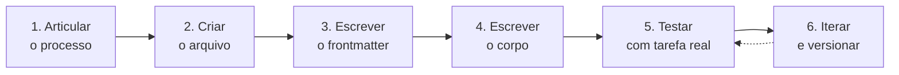
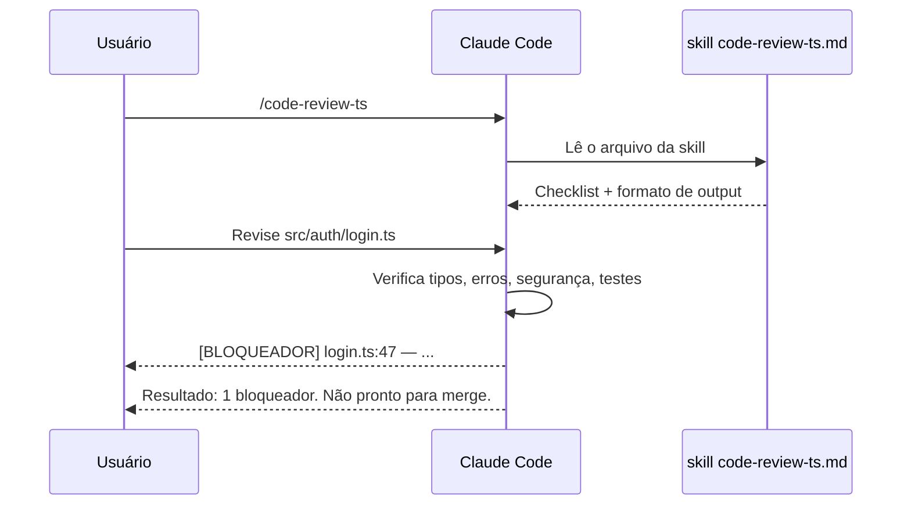

# Criar sua primeira skill — walkthrough prático

> [!abstract] TL;DR
> A melhor primeira skill é aquela que você já executa de cabeça. Escolha um processo repetitivo — code review, deploy checklist, debugging — e transforme-o em texto estruturado. Este guia cria uma skill de code review TypeScript do zero, passo a passo, explicando cada decisão ao longo do caminho.

> [!tip] Vídeo complementar
> [Claude Code Tutorial: How to Create & Use Custom Skills](https://www.youtube.com/watch?v=A4LQnB39LzM) — walkthrough em vídeo cobrindo a mesma sequência deste guia (articular o processo, escrever frontmatter e corpo, testar com uma tarefa real).

## Antes de abrir o editor: o princípio da skill emergente

Há um erro comum ao criar skills: abrir o editor e tentar *inventar* o processo. O resultado é uma skill genérica que o agente segue mas que não captura nenhum julgamento real.

O caminho correto é o inverso: **comece pelo processo que você já faz**. A skill não cria o processo — ela documenta e codifica um processo que já existe na sua cabeça ou nos seus hábitos.

> [!question] Como encontrar o processo certo?
> Pergunte: "O que eu verifico antes de aprovar um PR?" ou "O que um dev novo no time não saberia fazer automaticamente?" Essas são as skills mais valiosas.

Bons candidatos para primeira skill:
- Code review que você faz mentalmente antes de mergear
- Checklist de deploy que você consulta num Notion ou README
- Processo de debugging que você aprendeu com incidentes passados
- Convenções do projeto que você sempre explica para novos devs

Para este walkthrough: skill de code review para TypeScript com foco em segurança.

## O processo em 6 passos



Cada passo tem uma decisão de design. Vamos por elas.

## Passo 1: Articular o processo em linguagem natural

Antes de criar o arquivo, **escreva em prosa** o que você faria manualmente. Isso força a explicitação de julgamento implícito.

Exemplo para code review TypeScript:

> Quando reviso código TypeScript, verifico em ordem: tipos explícitos em funções públicas, ausência de `any`, ausência de `console.log` em produção, tratamento de erros em chamadas assíncronas, testes para o caminho feliz e pelo menos um caminho de erro. Se encontro um problema, anoto com nível de severidade: bloqueador (impede merge), importante (deve ser corrigido no PR), sugestão (melhoria não-bloqueadora).

Esse parágrafo é 90% da skill. Você só precisa estruturá-lo em seções que o agente consiga navegar.

> [!tip] Dica: dite em vez de digitar
> Se você travar na escrita, dite o processo em voz alta como se estivesse explicando para um colega. A linguagem natural que você usa ao explicar é a mesma que a skill deve usar.

## Passo 2: Criar o arquivo

Skills de projeto ficam em `.claude/skills/`. O nome do arquivo deve ser igual ao campo `name` no frontmatter (convenção, não obrigação técnica).

```bash
mkdir -p .claude/skills
touch .claude/skills/code-review-ts.md
```

A estrutura de diretórios do projeto depois:

```
meu-projeto/
├── .claude/
│   └── skills/
│       └── code-review-ts.md   ← aqui
├── src/
└── ...
```

Se a skill for pessoal (vale em qualquer projeto), use `~/.claude/skills/` em vez de `.claude/skills/`.

## Passo 3: Escrever o frontmatter

```markdown
---
name: code-review-ts
description: Revisa código TypeScript — tipos, segurança, tratamento de erros, testes
metadata:
  type: process
  tags: [code-review, typescript, seguranca]
---
```

**Decisões de design no frontmatter:**

`name: code-review-ts` — kebab-case, igual ao nome do arquivo. O agente usa isso para encontrar a skill quando você digita `/code-review-ts`.

`description: ...` — Este é o campo mais importante depois de `name`. O [[Dicionário de IA#Claude Code|Claude Code]] usa o `description` para detectar automaticamente quando a skill é relevante. Seja específico: "TypeScript" e "segurança" no description fazem o agente carregar esta skill quando você pede uma revisão de TS.

`metadata.type: process` — Marca como skill de processo (workflow), não de domínio (conhecimento).

## Passo 4: Escrever o corpo

O corpo é a instrução que o agente vai seguir. Para skills de processo, a estrutura mais eficaz é: **o que verificar** (com critérios claros) + **como reportar** (com formato de output explícito).

```markdown
# Code Review — TypeScript

## O que verificar (em ordem)

### 1. Tipos e TypeScript

- [ ] Funções públicas têm tipos explícitos de retorno?
- [ ] Parâmetros de função têm tipos declarados?
- [ ] Ausência de `any` (exceto em testes e stubs — documente a exceção)?
- [ ] Tipos utilitários usados corretamente (Partial, Required, Pick, Omit)?

### 2. Tratamento de erros

- [ ] Chamadas async/await têm try/catch ou `.catch()`?
- [ ] Erros são tratados ou propagados — nunca silenciados (catch vazio)?
- [ ] HTTP requests verificam status code antes de usar o body?

### 3. Segurança básica

- [ ] Input de usuário é validado antes de usar?
- [ ] Nenhum `console.log` em código de produção?
- [ ] Sem segredos hardcoded (senhas, API keys, tokens)?

### 4. Testes

- [ ] Há testes para o caminho feliz?
- [ ] Há testes para pelo menos um caso de erro?
- [ ] Testes são independentes entre si (sem estado compartilhado)?

## Como reportar

Use estes níveis de severidade:

**Bloqueador**: impede o merge. Ex: segredo hardcoded, acesso sem autenticação, dado corrompido.

**Importante**: deve ser corrigido antes do merge, mas pode ser corrigido no mesmo PR. Ex: falta de tratamento de erro em path crítico.

**Sugestão**: melhoria não-bloqueadora, pode ser num PR futuro. Ex: nome de variável mais descritivo.

## Formato de saída

Para cada problema encontrado:
```
[BLOQUEADOR] src/auth/login.ts:47 — senha hardcoded "admin123" [IMPORTANTE] src/api/orders.ts:23 — chamada async sem try/catch [SUGESTÃO] src/utils/format.ts:8 — considerar renomear `d` para `date`
```

Ao final, um sumário obrigatório:
```
Resultado: 1 bloqueador, 1 importante, 1 sugestão. Não pronto para merge.
```
```

### Por que a ordem importa

A lista de verificação começa com Tipos, não com Segurança. Isso é uma escolha deliberada: problemas de tipo são mais comuns e mais rápidos de verificar. O agente tende a executar as categorias na ordem listada — coloque as mais frequentes primeiro para que ele não as pule por falta de contexto.

### Por que o formato de output importa tanto

Sem um formato explícito, o agente cria o próprio estilo a cada sessão: às vezes usa bullets, às vezes usa parágrafos, às vezes agrupa por arquivo, às vezes por tipo. Isso dificulta automação e leitura. Um formato com exemplo concreto é seguido consistentemente.

## Passo 5: Testar com uma tarefa real

Abra o Claude Code no projeto e invoque:

```
/code-review-ts
Revise o arquivo src/auth/login.ts
```

Durante a revisão, observe se o agente:
- Segue as 4 categorias na ordem definida
- Usa os três níveis de severidade (Bloqueador/Importante/Sugestão)
- Formata o output com arquivo, linha e descrição
- Apresenta o sumário ao final

Se algum comportamento for diferente do esperado, anote o gap — você vai corrigir no próximo passo.



## Passo 6: Iterar com base no uso real

Após o primeiro uso, gaps aparecem. Os mais comuns e como corrigir cada um:

| Gap observado | Causa provável | Como corrigir |
|---|---|---|
| "O agente não verificou X" | X não está no checklist | Adicione X à categoria correta |
| "O agente usou formato diferente" | O exemplo de output é ambíguo | Adicione mais um exemplo concreto |
| "O agente ignorou a regra Z" | Z não se destaca no texto | Coloque Z em **negrito** ou `> [!warning]` |
| "A revisão ficou longa demais" | Checklist tem itens de baixo valor | Remova os 20% que nunca encontram problema |
| "O agente pulou a categoria 3" | Categoria 3 está enterrada no meio | Reorganize: mais frequente → menos frequente |
| "O agente não deu o sumário" | Sumário não é chamado de 'obrigatório' | Adicione 'Sumário obrigatório ao final' |

> [!warning] Teste em código real, não em exemplos inventados
> Uma skill pode parecer clara mas falhar em casos reais que você não antecipou. Teste com um PR ou arquivo de produção recente — é onde os casos-limite aparecem.

## O arquivo final completo

```markdown
---
name: code-review-ts
description: Revisa código TypeScript — tipos, segurança, tratamento de erros, testes
metadata:
  type: process
  tags: [code-review, typescript, seguranca]
---

# Code Review — TypeScript

## O que verificar (em ordem)

### 1. Tipos e TypeScript
- [ ] Funções públicas têm tipos explícitos de retorno?
- [ ] Parâmetros de função têm tipos declarados?
- [ ] Ausência de `any` (exceto em testes e stubs — documente a exceção)?

### 2. Tratamento de erros
- [ ] Chamadas async/await têm try/catch ou `.catch()`?
- [ ] Erros não são silenciados (sem catch vazio)?
- [ ] HTTP requests verificam status code antes de usar o body?

### 3. Segurança
- [ ] Input de usuário é validado?
- [ ] Sem `console.log` em produção?
- [ ] Sem segredos hardcoded?

### 4. Testes
- [ ] Há testes para o caminho feliz?
- [ ] Há testes para pelo menos um caso de erro?

## Como reportar

**Bloqueador**: impede o merge.
**Importante**: deve ser corrigido neste PR.
**Sugestão**: melhoria para PR futuro.

Formato: `[NÍVEL] arquivo:linha — descrição`

Sumário obrigatório ao final:
`Resultado: X bloqueador(es), Y importante(s), Z sugestão(ões). [Pronto / Não pronto] para merge.`
```

## Variações: outros tipos de primeira skill

O walkthrough acima criou uma skill de processo com checklist. Mas dependendo do contexto, a primeira skill mais útil pode ter uma estrutura diferente.

### Skill de deploy checklist

```markdown
---
name: deploy-staging
description: Checklist de verificação antes de fazer deploy no ambiente de staging
metadata:
  type: process
  tags: [deploy, staging, checklist]
---

# Deploy para Staging — Checklist

## Antes do deploy

- [ ] Testes passando localmente? (`npm test`)
- [ ] Build sem erros? (`npm run build`)
- [ ] Variáveis de ambiente de staging configuradas?
- [ ] Migration de banco preparada e testada em dev?

## Durante o deploy

1. Faça o push para a branch `staging`
2. Aguarde o CI completar (< 5 minutos normalmente)
3. Monitore os logs nos primeiros 2 minutos

## Após o deploy

- [ ] Smoke test: acesse `/health` e confirme `{"status": "ok"}`
- [ ] Teste o fluxo principal manualmente (login → ação crítica → logout)
- [ ] Verifique o dashboard de erros (Sentry) por 5 minutos

> [!warning] Se algo der errado
> Rollback: `git revert HEAD && git push origin staging`
> Avisar o time no canal #deploys antes de fazer rollback.
```

### Skill de domínio: convenções de nomenclatura

```markdown
---
name: convencoes-ts
description: Convenções de nomenclatura e estilo TypeScript deste projeto
metadata:
  type: domain
  tags: [typescript, convencoes, estilo]
---

# Convenções TypeScript — este projeto

## Nomenclatura

- **Interfaces**: PascalCase, prefixo `I` proibido. `UserRepository`, não `IUserRepository`.
- **Types**: PascalCase. `UserId`, `OrderStatus`.
- **Funções**: camelCase, verbo no início. `createOrder`, `findUserById`.
- **Constantes**: UPPER_SNAKE_CASE apenas para valores verdadeiramente imutáveis. `MAX_RETRIES`.
- **Arquivos**: kebab-case. `user-repository.ts`, `create-order.use-case.ts`.

## Estrutura de imports

```typescript
// 1. Node stdlib import { readFile } from 'fs/promises'

// 2. Dependências externas import { Injectable } from '@nestjs/common'

// 3. Internas (aliases com @/) import { UserRepository } from '@/domain/user.repository'
```

## O que evitar

- `any` — use `unknown` e faça type narrowing
- `// @ts-ignore` — corrija o tipo ou use `// @ts-expect-error` com comentário
- Barrel exports (`index.ts` re-exportando tudo) — dificulta tree-shaking
```

Note a diferença: a skill de domínio não tem passos sequenciais — tem referências e convenções. O agente consulta enquanto escreve código.

## Casos práticos

As duas variações acima (deploy checklist e convenções de domínio) já são exemplos, mas vale ver como cada estrutura se comporta quando a skill sai do walkthrough e entra na rotina de um time de verdade.

**Cenário 1 — triagem de incidentes num squad de plataforma**

Um squad que atende chamados de produção tem um processo mental de triagem: checar dashboards, isolar o serviço afetado, decidir entre rollback e hotfix, e documentar a decisão. Isso é uma skill de *processo*, igual à `code-review-ts` deste walkthrough: passos em ordem, critério de saída (a decisão está documentada?) e formato de output (um resumo do incidente com severidade e ação tomada). A diferença para o exemplo de code review é que aqui a skill é invocada sob pressão de tempo — por isso o formato de output precisa ser ainda mais enxuto, com os passos mais críticos (isolar o serviço, decidir rollback/hotfix) no topo do checklist.

**Cenário 2 — onboarding de consultor em base de código legada**

Um consultor que assume um sistema legado repete sempre a mesma sequência de reconhecimento: mapear os pontos de entrada, identificar testes existentes (ou a ausência deles), localizar onde a dívida técnica está concentrada. Essa é uma skill de *domínio* — como `convencoes-ts` — porque não tem "fim": o agente consulta a skill continuamente enquanto explora o código, não a executa uma vez do início ao fim. O valor aqui não é o checklist, é registrar o vocabulário e os pontos de atenção que só quem já entrou nesse tipo de sistema antes saberia procurar.

Nos dois casos, o processo de criação é o mesmo dos Passos 1-6: articular em prosa antes de estruturar, testar com uma tarefa real (um incidente de fato, um trecho real do legado) e iterar com base no que o agente errou.

## Checklist de design antes de commitar

Antes de versionar a skill, passe por estas perguntas:

| Pergunta | O que verificar |
|---|---|
| O `name` é igual ao nome do arquivo? | `name: code-review-ts` → arquivo `code-review-ts.md` |
| O `description` é específico o suficiente? | "TypeScript" e "segurança" ajudam; "review" genérico demais |
| O processo tem critério de saída? | O agente sabe quando terminou? |
| Há pelo menos um exemplo de output? | Formato concreto, não só descrição |
| A skill tem menos de ~300 linhas? | Se maior, provavelmente é duas skills |
| Testei com um arquivo real? | Não só com exemplos inventados |

## Armadilhas comuns

> [!warning] Skill com tudo que você sabe sobre code review
> Resulta em um documento enorme que o agente lê mas não consegue priorizar. Coloque os 20% que cobrem 80% dos problemas que você encontra de verdade. O resto pode vir numa skill separada.

> [!warning] Instruções sem exemplos de output
> O agente interpreta o formato de saída de forma criativa sem um exemplo. Sempre inclua pelo menos um exemplo completo do output esperado — incluindo o caso de erro mais comum.

> [!warning] Não versionar a skill
> Skills que vivem só localmente ficam inconsistentes entre membros do time. Commite `.claude/skills/` junto com o código. A skill é um artefato do time, não um arquivo pessoal.

> [!warning] Não testar antes de commitar
> A skill pode ser sintática e semanticamente correta mas instruir o agente de forma ambígua. Teste com um arquivo real antes de fazer o PR com a skill.

## Como explicar em inglês

**"Creating a skill"** — writing a Markdown file that encodes a repeatable process so the agent can follow it consistently across sessions.

**The key insight to communicate:**
- "The best skill documents a process you already follow mentally. You're not inventing a workflow — you're making an implicit workflow explicit so the agent can execute it."
- "The description field in the frontmatter is how the agent knows when to suggest the skill automatically. Think of it as the skill's 'relevance signal'."
- "Skills improve through use: the first version is never perfect. The gap between what you instructed and what the agent did tells you what to add or clarify."

**Walkthrough summary for interviews:**
1. Articulate the process in plain language
2. Create the file in `.claude/skills/`
3. Write the frontmatter: `name`, `description`, `metadata.type`
4. Write the body: what to check + how to report (with a concrete output example)
5. Test with a real task and observe where the agent deviates
6. Iterate: add what's missing, remove what adds no value, sharpen what's ambiguous

### Termos-chave: PT ↔ EN

| PT-BR | EN | Onde aparece |
|---|---|---|
| nome (da skill) | `name` | Frontmatter |
| descrição | `description` | Frontmatter — sinal de relevância pro agente |
| metadados | `metadata` | Frontmatter (`metadata.type`, `metadata.tags`) |
| skill de processo | process skill | `metadata.type: process` |
| skill de domínio | domain skill | `metadata.type: domain` |
| corpo (da skill) | body | Instrução que o agente segue |
| critério de saída | exit criteria | "O agente sabe quando terminou?" |
| checklist de verificação | verification checklist | Passo 4 |
| exemplo de saída | output example | Formato concreto de resultado |
| iterar | iterate | Passo 6 |

## O que vem a seguir

Uma skill isolada já resolve um processo repetitivo, mas o ganho maior aparece quando o agente também sabe *buscar informação externa de forma confiável* — não só seguir um checklist, mas consultar uma fonte viva (um banco de dados, uma API, um sistema interno) durante a execução. É aí que entra o MCP (Model Context Protocol): o próximo passo natural depois de dominar skills é entender como conectar o Claude Code a essas fontes externas.

Continue em [[03-Dominios/Tecnologia/IA/Claude Code/Skills e MCP/04 - MCP overview|04 - MCP overview]].

## Fontes

- **Anthropic** — [*Agent Skills — Claude Docs*](https://docs.claude.com/en/docs/agents-and-tools/agent-skills/overview) (2026). Documentação oficial sobre estrutura de SKILL.md, campo `description` como sinal de relevância e boas práticas de criação.

## Referências

- [[03-Dominios/Tecnologia/IA/Claude Code/Skills e MCP/01 - Anatomia de uma skill|01 - Anatomia de uma skill]] — referência completa de estrutura e frontmatter
- [[03-Dominios/Tecnologia/IA/Claude Code/Skills e MCP/02 - Skills de processo vs domínio|02 - Skills de processo vs domínio]] — qual tipo de skill criar
- [[03-Dominios/Tecnologia/IA/Claude Code/Skills e MCP/08 - Skills em time|08 - Skills em time]] — como versionar e compartilhar com o time
- [[03-Dominios/Tecnologia/IA/Claude Code/Skills e MCP/index|Skills e MCP]] — índice do galho
- [[03-Dominios/Tecnologia/IA/Claude Code/index|Claude Code]] — tronco da trilha
