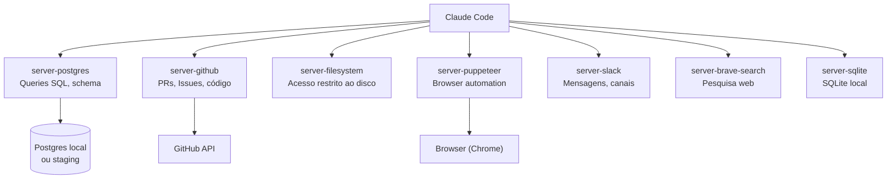
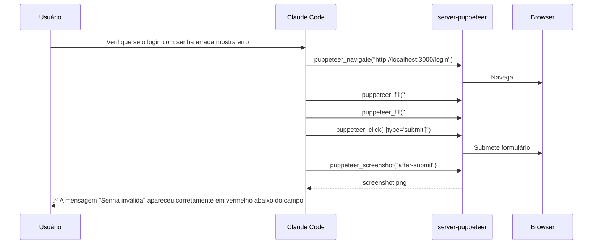

# MCP servers essenciais — postgres, github, filesystem, browser

> [!abstract] TL;DR
> Anthropic e a comunidade mantêm [[Dicionário de IA#MCP server|MCP servers]] prontos para os casos de uso mais comuns. Para o dev típico, quatro servers cobrem quase tudo: **postgres** para banco de dados, **github** para repositórios e issues, **filesystem** para acesso granular a arquivos, e **puppeteer** para automação de browser. Esta nota cobre configuração e quando usar cada um.

## O ecossistema de servers prontos

Antes de criar um MCP server customizado, verifique se já existe um pronto para o seu caso de uso. O repositório oficial tem dezenas de servers mantidos pela comunidade.



Nesta nota: os quatro mais usados no desenvolvimento do dia a dia.

## server-postgres — o indispensável para backend

**Para que serve**: rodar queries SQL, inspecionar schema, e debugar queries diretamente do [[Dicionário de IA#Claude Code|Claude Code]] — sem terminal separado, sem DBeaver.

**Configuração**:

```json
{
  "mcpServers": {
    "postgres": {
      "command": "npx",
      "args": ["-y", "@modelcontextprotocol/server-postgres"],
      "env": {
        "DATABASE_URL": "${DATABASE_URL}"
      }
    }
  }
}
```

Não precisa instalar globalmente. O `npx` baixa e executa na primeira invocação.

**Tools expostas**:

| Tool | Parâmetros | Retorna |
|---|---|---|
| `query(sql)` | SQL string | rows[] como JSON |
| `execute(sql)` | SQL string | affected_rows, result |
| `list_tables()` | — | lista de tabelas |
| `describe_table(table)` | nome da tabela | colunas, tipos, constraints |

**Quando usar**:
- Explorar schema enquanto escreve código de acesso a dados — o agente lê a estrutura e usa os nomes corretos
- Verificar dados de teste sem abrir cliente SQL separado
- Debugar queries lentas pedindo ao agente para rodar `EXPLAIN ANALYZE`
- Verificar invariantes de banco durante code review ("a coluna X tem NOT NULL?")

**Exemplo de workflow com o agente**:

```
Estou implementando a listagem de pedidos pendentes.
Quais colunas a tabela orders tem? E existe índice em status?
```

O agente chama `describe_table("orders")` e `query("SELECT indexname, indexdef FROM pg_indexes WHERE tablename='orders'")`, e responde com as informações estruturadas — sem você precisar sair do Claude Code.

> [!warning] Nunca aponte para banco de produção
> O agente pode rodar `DROP TABLE`, `TRUNCATE`, ou `DELETE` sem WHERE se instruído (ou enganado) a fazer isso. Use sempre banco de desenvolvimento local ou staging isolado, com um usuário sem permissão de DROP.

**Configuração segura para staging**:

```json
{
  "mcpServers": {
    "postgres-dev": {
      "command": "npx",
      "args": ["-y", "@modelcontextprotocol/server-postgres"],
      "env": {
        "DATABASE_URL": "${DATABASE_DEV_URL}"
      }
    }
  }
}
```

Prefixe o nome do server com o ambiente (`postgres-dev`, `postgres-staging`) para evitar confusão quando tiver múltiplos configurados.

## server-github — repositórios e issues sem sair do Claude Code

**Para que serve**: criar issues, ler PRs, buscar código em repositórios do GitHub — direto da sessão do Claude Code.

**Pré-requisito**: um GitHub Personal Access Token.

Escopos mínimos necessários:
- `repo` — para leitura e escrita em repositórios
- `read:org` — para acessar repositórios da organização (se aplicável)

**Configuração**:

```json
{
  "mcpServers": {
    "github": {
      "command": "npx",
      "args": ["-y", "@modelcontextprotocol/server-github"],
      "env": {
        "GITHUB_PERSONAL_ACCESS_TOKEN": "${GITHUB_PERSONAL_ACCESS_TOKEN}"
      }
    }
  }
}
```

**Tools expostas**:

| Tool | O que faz |
|---|---|
| `create_issue` | Cria uma nova issue com título, corpo, labels |
| `get_issue` | Lê uma issue com todos os comentários |
| `list_pull_requests` | Lista PRs abertos do repositório |
| `get_pull_request` | Lê PR com diff completo |
| `search_code` | Busca código nos repositórios da organização |
| `create_pull_request` | Cria PR com título, corpo, branch head/base |
| `list_issues` | Lista issues por label, estado, assignee |

**Quando usar**:
- Criar issues enquanto identifica bugs no código — o agente já formata corretamente
- Ler o contexto de uma issue para implementar a feature correta
- Buscar como algo é implementado em outro repo da organização
- Criar o PR depois de implementar — sem copiar e colar diff

**Exemplo de workflow**:

```
Issue #234 do repositório minha-org/api diz que o endpoint /orders retorna status 500.
Leia a issue e me ajude a diagnosticar o problema.
```

O agente lê a issue com todos os comentários via `get_issue`, entende o contexto reportado, e já começa o diagnóstico com o contexto completo — não só o que você colou no chat.

## server-filesystem — controle granular de acesso

**Para que serve**: acesso ao filesystem com **controle explícito de quais diretórios o agente pode tocar**. Útil quando você quer restringir o agente a um subconjunto do disco por política de segurança.

**Configuração**:

```json
{
  "mcpServers": {
    "filesystem": {
      "command": "npx",
      "args": [
        "-y",
        "@modelcontextprotocol/server-filesystem",
        "/home/user/projetos/meu-projeto",
        "/tmp/outputs"
      ]
    }
  }
}
```

Os diretórios após o nome do package são os únicos que o server aceita. Qualquer tentativa de acessar fora é recusada.

**Tools expostas**:

| Tool | O que faz |
|---|---|
| `read_file(path)` | Lê arquivo |
| `write_file(path, content)` | Escreve arquivo |
| `list_directory(path)` | Lista conteúdo do diretório |
| `create_directory(path)` | Cria diretório |
| `move_file(source, dest)` | Move ou renomeia arquivo |
| `search_files(path, pattern)` | Busca arquivos por padrão glob |

**Quando usar vs tools nativas**:

| Cenário | Ferramenta ideal |
|---|---|
| Editar um arquivo no projeto | Tool nativa `Edit` — mais simples |
| Restringir agente a subpasta específica | MCP filesystem com path configurado |
| Gerar arquivos temporários | Tool nativa `Write` — suficiente |
| Política de acesso por diretório | MCP filesystem |
| Projeto com múltiplos subrepositórios | MCP filesystem por subrepositório |

Para projetos normais, as tools nativas (`Read`, `Write`, `Edit`) são suficientes. O MCP filesystem adiciona valor quando há uma política explícita de isolamento.

## server-puppeteer — o agente vê a UI

**Para que serve**: automação de browser — navegar, clicar, preencher formulários, tirar screenshots, extrair conteúdo de páginas. Com Puppeteer, o agente literalmente "vê" a interface da aplicação.

**Pré-requisito**: Chrome ou Chromium instalado no sistema.

**Configuração**:

```json
{
  "mcpServers": {
    "puppeteer": {
      "command": "npx",
      "args": ["-y", "@modelcontextprotocol/server-puppeteer"]
    }
  }
}
```

**Tools expostas**:

| Tool | O que faz |
|---|---|
| `puppeteer_navigate(url)` | Navega para URL |
| `puppeteer_screenshot(name)` | Captura screenshot nomeado |
| `puppeteer_click(selector)` | Clica em elemento CSS selector |
| `puppeteer_fill(selector, value)` | Preenche input |
| `puppeteer_evaluate(script)` | Executa JavaScript na página |
| `puppeteer_select(selector, value)` | Seleciona opção em `<select>` |
| `puppeteer_hover(selector)` | Hover sobre elemento |
| `puppeteer_content()` | Retorna HTML da página atual |

**Quando usar**:
- Testar fluxos de UI enquanto desenvolve frontend — o agente verifica o comportamento real, não só o código
- Verificar se um fix de CSS ficou correto sem você ter que abrir o browser
- Smoke test automatizado: "suba o app e verifique se o login funciona"
- Scraping de documentação ou exemplos durante desenvolvimento

**Exemplo de sessão**:

```
Suba o servidor de desenvolvimento e verifique se o formulário de login
mostra mensagem de erro quando a senha está incorreta.
```

O agente chama `puppeteer_navigate("http://localhost:3000/login")`, preenche o formulário com credenciais inválidas, clica em submit, tira um screenshot, e reporta o que viu na tela — incluindo se a mensagem de erro apareceu ou não.



## Combinando servers numa sessão

Você pode ter múltiplos servers ativos simultaneamente. O agente escolhe qual tool usar baseado no contexto:

```json
{
  "mcpServers": {
    "postgres-dev": { ... },
    "github": { ... },
    "puppeteer": { ... }
  }
}
```

**Workflow completo de feature em uma sessão:**

1. `get_issue(owner, repo, issue_number)` — lê o contexto da issue
2. `describe_table("orders")` — verifica o schema antes de escrever código
3. *Implementa o código (tools nativas: `Edit`, `Write`)*
4. `puppeteer_navigate("http://localhost:3000")` — verifica a UI
5. `puppeteer_screenshot("feature-done")` — documenta o resultado
6. `create_pull_request(...)` — abre o PR sem sair do Claude Code

## Outros servers notáveis

Além dos quatro essenciais, alguns servers merecem destaque por casos de uso específicos:

### server-brave-search

Pesquisa web estruturada. Útil quando o agente precisa de informações atualizadas que não estão no codebase ou na documentação local.

```json
{
  "mcpServers": {
    "brave-search": {
      "command": "npx",
      "args": ["-y", "@modelcontextprotocol/server-brave-search"],
      "env": {
        "BRAVE_API_KEY": "${BRAVE_API_KEY}"
      }
    }
  }
}
```

**Quando usar:** pesquisar CVEs recentes de uma dependência; encontrar exemplos de uso de uma API; verificar se uma biblioteca tem bugs conhecidos com uma versão específica.

### server-sqlite

Para projetos que usam SQLite como banco de dados (ou como banco de testes). Mesmo interface do server-postgres, sem precisar de servidor externo.

```json
{
  "mcpServers": {
    "sqlite": {
      "command": "npx",
      "args": ["-y", "@modelcontextprotocol/server-sqlite", "/path/to/database.db"]
    }
  }
}
```

### server-slack

Lê e envia mensagens no Slack. Útil para criar bots de notificação ou para o agente buscar contexto de discussões do time.

> [!warning] Use com cuidado em produção
> O agente com acesso ao Slack pode enviar mensagens para canais reais. Teste em workspace de desenvolvimento antes de conectar ao workspace de produção.

## Diagnóstico de problemas comuns

| Problema | Causa provável | Solução |
|---|---|---|
| "Server não aparece em /mcp" | npx falhou no download | Instale globalmente: `npm i -g @mcp/server-...` |
| "Tool X não existe" | Server não inicializou | Rode `npx @mcp/server-X` manualmente e veja o erro |
| "${VAR} não resolvida" | Variável não exportada | Adicione `export VAR=...` ao `.bashrc`/`.zshrc` |
| "Acesso negado ao diretório" | MCP filesystem configurado | Adicione o path à lista de diretórios permitidos |
| "Timeout na tool" | Sistema externo lento | Verifique a conectividade do banco/API |
| "Tool chamada errada" | Dois servers com nome similar | Renomeie os servers para nomes únicos e descritivos |

## Verificar servers na sessão

```
/mcp
```

Lista os MCP servers configurados e as tools disponíveis. Use para confirmar que o server iniciou corretamente e quais capabilities estão ativas.

## Armadilhas

**Server que não inicia**
Verifique se `npx` consegue baixar o package (requer internet na primeira vez). Em ambientes sem internet, pré-instale com `npm install -g @modelcontextprotocol/server-postgres`.

**Variáveis de ambiente não resolvidas**
`${GITHUB_PERSONAL_ACCESS_TOKEN}` só é resolvido se a variável estiver **exportada** no shell onde o Claude Code inicia. Adicione ao `.bashrc` ou `.zshrc`, não só ao `.env` do projeto (que o Claude Code não lê automaticamente).

**Dois servers com tools de mesmo nome**
Se dois MCP servers expõem uma tool chamada `query`, o agente pode chamar a errada. Use nomes de server descritivos: `postgres-dev`, `postgres-staging` em vez de `postgres1`, `postgres2`.

**Agente invocando tools sem confirmação**
Por padrão, algumas tools pedem aprovação do usuário antes de executar. Se você está em modo de automação e o agente trava esperando confirmação, verifique as permissões no settings.json e os hooks de guardrail configurados.

## Como explicar em inglês

**"MCP server"** — an external process that exposes tools (functions with side effects), resources (read-only data), and prompts (workflow templates) via the Model Context Protocol.

**Key servers to know:**
- `server-postgres`: lets the agent run SQL queries directly — useful for schema exploration, debugging, and data verification
- `server-github`: gives the agent read/write access to GitHub — issues, PRs, code search, without leaving Claude Code
- `server-filesystem`: filesystem access with explicit directory restrictions — useful for security policies
- `server-puppeteer`: the agent controls a browser — navigate, click, screenshot, evaluate JS

**Key phrases for interviews:**
- "With the Postgres MCP server, I don't copy-paste query results into the chat anymore — the agent runs the queries directly and reasons over the structured data."
- "Puppeteer gives the agent eyes on the UI. Instead of me describing what I see, the agent navigates and screenshots it."
- "We configure MCP servers per-environment: `postgres-dev` for local, `postgres-staging` for staging. The agent always knows which one it's talking to."

## Referências

- [Repositório oficial MCP servers](https://github.com/modelcontextprotocol/servers) — catálogo completo de servers prontos
- [[03-Dominios/Tecnologia/IA/Claude Code/Skills e MCP/04 - MCP overview|04 - MCP overview]] — arquitetura e conceitos do protocolo MCP
- [[03-Dominios/Tecnologia/IA/Claude Code/Skills e MCP/06 - Criar MCP server|06 - Criar MCP server]] — quando criar um server customizado para ferramentas internas
- [[03-Dominios/Tecnologia/IA/Claude Code/Skills e MCP/07 - Compondo skills e MCP|07 - Compondo skills e MCP]] — combinando servers para agentes especializados
- [[03-Dominios/Tecnologia/IA/Claude Code/Hooks e Guardrails/index|Hooks e Guardrails]] — como proteger o agente ao usar MCP servers em staging
- [[03-Dominios/Tecnologia/IA/Claude Code/Skills e MCP/index|Skills e MCP]] — índice do galho
