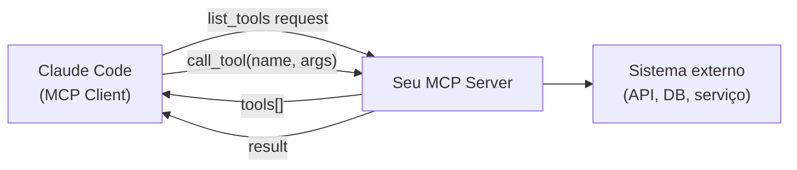

# Criar MCP server — quando e como

> [!abstract] TL;DR
> Crie um [[Dicionário de IA#MCP server|MCP server]] quando o projeto tem ferramentas internas, APIs privadas, ou dados estruturados que nenhum server existente acessa. O custo mínimo é baixo: 50-100 linhas de TypeScript que expõem uma ou duas tools. O SDK oficial cuida do protocolo; você cuida só da lógica de negócio.

> [!tip] Vídeo complementar
> [Build a Real-world MCP Server with One TypeScript File | Full Tutorial](https://www.youtube.com/watch?v=kXuRJXEzrE0) — walkthrough prático de construir um MCP server real (não um brinquedo de tutorial) num único arquivo TypeScript, cobrindo tools, integração com API real e o transporte stdio. Útil para ver a estrutura mínima da nota em ação, do zero ao server funcional.

## A pergunta certa antes de começar

Criar um MCP server customizado é o caminho errado na maioria das vezes. Antes de escrever código, responda:

1. **Existe um server pronto?** — Consulte o [repositório oficial](https://github.com/modelcontextprotocol/servers). Há dezenas de servers. Use um antes de criar.
2. **Consigo resolver com `Bash` + tool nativa?** — Se o acesso ao sistema externo funciona via CLI, o agente já pode usar `Bash`. Um MCP server faz sentido quando o output via CLI é muito difícil de parsear ou quando a latência de parsear texto é problemática.
3. **O acesso vai se repetir?** — Se é uma operação pontual, `Bash` resolve. Se é algo que o agente vai precisar em toda sessão de desenvolvimento, um MCP server paga o custo de criação.

**Crie um server customizado quando:**
- Você tem uma API interna que nenhum server cobre
- O sistema externo requer autenticação ou lógica de negócio específica
- Você quer expor dados do projeto num formato útil para o agente (schema canônico, mapa de serviços)
- Ferramentas de build ou deploy internas que o agente deveria poder invocar com saídas estruturadas

> [!question] Teste mental
> "Se o agente tivesse acesso a essa tool, que tarefas ele conseguiria fazer melhor ou mais rápido?" Se a resposta não for concreta, o server provavelmente não vale o custo.

## Anatomia de um MCP server

Um MCP server é um processo que o Claude Code inicia como filho e com o qual se comunica via JSON-RPC sobre stdio. Você implementa dois handlers principais: `list_tools` (declara o que o server oferece) e `call_tool` (executa uma tool).



O protocolo entre client e server é padronizado pelo MCP SDK. Você só implementa a lógica de negócio — o SDK cuida de deserialização, validação de schema, e transporte.

## Estrutura mínima em TypeScript

```bash
mkdir mcp-server && cd mcp-server
npm init -y
npm install @modelcontextprotocol/sdk
```

```typescript
// src/index.ts
import { Server } from "@modelcontextprotocol/sdk/server/index.js";
import { StdioServerTransport } from "@modelcontextprotocol/sdk/server/stdio.js";
import {
  CallToolRequestSchema,
  ListToolsRequestSchema,
} from "@modelcontextprotocol/sdk/types.js";

const server = new Server(
  { name: "meu-server", version: "1.0.0" },
  { capabilities: { tools: {} } }
);

// Declara as tools disponíveis
server.setRequestHandler(ListToolsRequestSchema, async () => ({
  tools: [
    {
      name: "buscar_servico",
      description: "Retorna configuração de um serviço interno pelo nome. Use quando o agente precisar saber a porta, URL base, ou dependências de um serviço.",
      inputSchema: {
        type: "object",
        properties: {
          nome: { type: "string", description: "Nome do serviço (ex: 'payments', 'orders')" },
        },
        required: ["nome"],
      },
    },
  ],
}));

// Implementa o handler de cada tool
server.setRequestHandler(CallToolRequestSchema, async (request) => {
  if (request.params.name === "buscar_servico") {
    const nome = request.params.arguments?.nome as string;
    const config = await buscarConfiguracaoServico(nome);
    return {
      content: [{ type: "text", text: JSON.stringify(config, null, 2) }],
    };
  }
  throw new Error(`Tool não encontrada: ${request.params.name}`);
});

async function main() {
  const transport = new StdioServerTransport();
  await server.connect(transport);
}

main().catch(console.error);
```

**O que cada parte faz:**

- `new Server(...)` — inicializa o server com nome e versão (usados pelo client para identificação)
- `capabilities: { tools: {} }` — declara que este server expõe tools (não resources, não prompts)
- `setRequestHandler(ListToolsRequestSchema, ...)` — responde "que tools você tem?" com a lista de tools e seus schemas de input
- `setRequestHandler(CallToolRequestSchema, ...)` — executa uma tool quando o agente a invoca
- `StdioServerTransport` — conecta via stdin/stdout ao Claude Code

## Server com estado (conexão de banco persistente)

Alguns servers precisam manter estado entre chamadas — uma conexão de banco, um cache de autenticação, um cliente HTTP com token renovável.

```typescript
import { Server } from "@modelcontextprotocol/sdk/server/index.js";
import { StdioServerTransport } from "@modelcontextprotocol/sdk/server/stdio.js";
import { CallToolRequestSchema, ListToolsRequestSchema } from "@modelcontextprotocol/sdk/types.js";
import { Pool } from "pg";

const pool = new Pool({ connectionString: process.env.DATABASE_URL });

const server = new Server(
  { name: "db-interno", version: "1.0.0" },
  { capabilities: { tools: {} } }
);

server.setRequestHandler(ListToolsRequestSchema, async () => ({
  tools: [
    {
      name: "query_pedidos",
      description: "Busca pedidos por status ou cliente. Retorna até 50 pedidos ordenados por data de criação decrescente.",
      inputSchema: {
        type: "object",
        properties: {
          status: {
            type: "string",
            enum: ["pendente", "aprovado", "enviado", "cancelado"],
            description: "Filtra por status do pedido"
          },
          cliente_id: { type: "number", description: "ID do cliente (opcional)" },
          limite: { type: "number", description: "Número máximo de resultados (padrão 20, máximo 50)" }
        },
      },
    },
  ],
}));

server.setRequestHandler(CallToolRequestSchema, async (request) => {
  if (request.params.name === "query_pedidos") {
    const { status, cliente_id, limite = 20 } = request.params.arguments as {
      status: string;
      cliente_id?: number;
      limite?: number;
    };

    const params: unknown[] = [status, Math.min(limite, 50)];
    let sql = "SELECT id, status, total, created_at FROM pedidos WHERE status = $1";

    if (cliente_id) {
      sql += " AND cliente_id = $3";
      params.push(cliente_id);
    }

    sql += " ORDER BY created_at DESC LIMIT $2";

    const { rows } = await pool.query(sql, params);
    return {
      content: [{ type: "text", text: JSON.stringify(rows, null, 2) }],
    };
  }
  throw new Error(`Tool não encontrada: ${request.params.name}`);
});

process.on("SIGTERM", async () => {
  await pool.end();
  process.exit(0);
});

async function main() {
  const transport = new StdioServerTransport();
  await server.connect(transport);
}

main().catch(console.error);
```

Note o `process.on("SIGTERM", ...)` — essencial para fechar conexões de banco corretamente quando o Claude Code encerra o server.

## Expondo resources (dados somente leitura)

Resources são dados que o agente pode consultar como referência — o schema do banco, o mapa de serviços, a documentação de um módulo. Não têm efeitos colaterais.

```typescript
import {
  ListResourcesRequestSchema,
  ReadResourceRequestSchema,
} from "@modelcontextprotocol/sdk/types.js";

const server = new Server(
  { name: "contexto-projeto", version: "1.0.0" },
  { capabilities: { tools: {}, resources: {} } }  // ← resources: {}
);

server.setRequestHandler(ListResourcesRequestSchema, async () => ({
  resources: [
    {
      uri: "projeto://servicos",
      name: "Mapa de serviços",
      description: "Lista todos os microsserviços com portas, URLs e responsabilidades",
      mimeType: "application/json",
    },
    {
      uri: "projeto://regras-negocio",
      name: "Regras de negócio críticas",
      description: "Invariantes do domínio que não podem ser violadas",
      mimeType: "text/markdown",
    },
  ],
}));

server.setRequestHandler(ReadResourceRequestSchema, async (request) => {
  switch (request.params.uri) {
    case "projeto://servicos":
      return {
        contents: [{
          uri: request.params.uri,
          mimeType: "application/json",
          text: JSON.stringify(await carregarMapaDeServicos(), null, 2),
        }],
      };
    case "projeto://regras-negocio":
      return {
        contents: [{
          uri: request.params.uri,
          mimeType: "text/markdown",
          text: await readFile("./docs/regras-negocio.md", "utf8"),
        }],
      };
    default:
      throw new Error(`Resource não encontrado: ${request.params.uri}`);
  }
});
```

O agente acessa `projeto://servicos` como referência enquanto trabalha — sem precisar invocar uma tool com efeito colateral.

## Configurar o server no settings.json

**Server compilado (produção):**

```json
{
  "mcpServers": {
    "contexto-projeto": {
      "command": "node",
      "args": ["./tools/mcp-server/dist/index.js"],
      "env": {
        "API_BASE_URL": "${API_BASE_URL}",
        "API_TOKEN": "${API_TOKEN}"
      }
    }
  }
}
```

**Server em desenvolvimento (sem build step):**

```json
{
  "mcpServers": {
    "contexto-projeto": {
      "command": "npx",
      "args": ["tsx", "./tools/mcp-server/src/index.ts"],
      "env": {
        "API_BASE_URL": "${API_BASE_URL}"
      }
    }
  }
}
```

`tsx` executa TypeScript diretamente sem compilar — conveniente durante o desenvolvimento do server.

## Checklist antes de publicar o server

Antes de commitar o server e anunciar para o time:

| Item | Verificação |
|---|---|
| Descriptions das tools | Claras sobre *quando* usar, não só *o que* fazem |
| Limite de retorno | Tools com resultado potencialmente grande têm paginação? |
| Tratamento de SIGTERM | Conexões de banco fecham corretamente ao encerrar? |
| Validação de input | Erros de input geram mensagens úteis, não stack traces? |
| Segredos | Nenhum hardcoded em args ou no código? |
| README | Como configurar as env vars e rodar o server? |
| Teste manual | Rodou o server e chamou cada tool antes de commitar? |

## Onde versionar o server

```
meu-projeto/
  src/                      ← código da aplicação
  tools/
    mcp-server/
      src/
        index.ts
      package.json
      tsconfig.json
      README.md             ← como rodar e configurar
  .claude/
    settings.json           ← referencia o server em tools/
```

O server fica no repo do projeto, versionado junto. Todo dev que clona o projeto tem o server disponível — sem instalação extra além do `npm install`.

## Boas práticas de design de tools

**Nome descritivo com contexto** `query_pedidos` é melhor que `query`. O agente escolhe a tool certa pelo nome + descrição. Em projetos com múltiplos servers, o contexto no nome evita ambiguidade.

**Descrição acionável** Descreva o que a tool faz *e quando usá-la*. O agente usa a `description` para decidir se invoca.

```
❌ "Retorna dados de pedidos"
✅ "Busca pedidos por status ou cliente. Use quando precisar verificar o estado atual de pedidos antes de implementar lógica de processamento."
```

**Retorno estruturado** JSON tipado em vez de texto livre. O agente raciocina sobre estrutura, não sobre texto.

```typescript
// ❌ Retorno difícil de processar
return { content: [{ type: "text", text: "Pedido 123: status pendente, total R$ 150,00" }] };

// ✅ Retorno estruturado
return { content: [{ type: "text", text: JSON.stringify({ id: 123, status: "pendente", total: 150.00 }) }] };
```

**Limite nos retornos** Uma tool que retorna 10.000 rows vai consumir todo o contexto da sessão. Adicione paginação ou filtros obrigatórios. Documente o limite na description.

**Erros explícitos e acionáveis** "Serviço não encontrado: payments-v3" é melhor que "404 Not Found". O agente pode agir com uma mensagem que explica o que falhou.

## Armadilhas comuns

> [!warning] Server que trava o Claude Code
> Se o processo do server travar ou não fechar stdin, o Claude Code pode ficar esperando indefinidamente. Sempre trate `SIGTERM` e feche conexões ao sair.

> [!warning] Tool sem description suficiente
> O agente vai ignorar a tool se a description não deixar claro quando usá-la. Invista tempo escrevendo descriptions precisas — elas são a interface pública do seu server para o agente.

> [!warning] Segredos nos args
> `"args": ["--token", "abc123"]` fica visível no processo e no `ps aux`. Sempre use env vars.

> [!warning] Falta de validação de input
> O SDK valida o schema de input antes de chamar o handler, mas a validação de negócio é sua responsabilidade. Valide inputs antes de mandar para o sistema externo.

## Como explicar em inglês

**Custom MCP server** — a TypeScript (or any language) process that exposes tools, resources, and prompts for internal APIs or systems that no community server covers.

**When to create one:**
- Internal APIs that aren't public (company APIs, proprietary databases)
- Systems with custom authentication logic
- Exposing project-specific context (service map, business rules) as structured data

**The minimal pattern:**
1. `npm install @modelcontextprotocol/sdk`
2. Implement `ListToolsRequestSchema` handler — declare your tools with name, description, input schema
3. Implement `CallToolRequestSchema` handler — execute the tool and return JSON
4. Connect via `StdioServerTransport` and launch via `settings.json`

**Key phrase:** "The SDK handles the protocol. You write business logic — what the tool does and what it returns. It's about 100 lines for a simple server."

### Tabela PT↔EN

| PT | EN |
|---|---|
| server MCP customizado | custom MCP server |
| tool | tool |
| resource | resource |
| handler | handler |
| transporte | transport |
| protocolo | protocol |
| lógica de negócio | business logic |
| schema de input | input schema |
| conectar via stdio | connect via `StdioServerTransport` |

## Casos práticos

**1. Painel de suporte consultando pedidos em produção** Um time de suporte usa o Claude Code para investigar tickets. Em vez de pedir pro agente rodar `psql` cru (arriscado, sem paginação, sem controle de acesso), o server `db-interno` da seção [[#Server com estado (conexão de banco persistente)|"Server com estado"]] expõe a tool `query_pedidos` — schema tipado, limite de 50 rows, filtro obrigatório por status. O agente investiga o pedido pedindo dados estruturados, nunca escrevendo SQL solto contra o banco de produção. A conexão do `Pool` fica viva entre chamadas (evita reabrir conexão a cada tool call) e o `SIGTERM` garante que ela fecha limpa quando a sessão encerra.

**2. Onboarding de novos devs com contexto do projeto** Um projeto com múltiplos microsserviços tem regras de negócio e mapa de serviços espalhados em READMEs desatualizados. O server `contexto-projeto` da seção [[#Expondo resources (dados somente leitura)|"Expondo resources"]] publica `projeto://servicos` e `projeto://regras-negocio` como resources somente-leitura — sem efeito colateral, sem risco de o agente "executar" algo ao consultar. Um dev novo (ou o próprio agente investigando uma tarefa) lê o mapa de serviços como referência viva antes de tocar código, em vez de confiar em documentação que ninguém atualiza.

## O que vem a seguir

Um server sozinho já ajuda — mas o ganho composto aparece quando ele vira peça de um fluxo maior. Uma skill pode chamar as tools do seu server como parte de um procedimento documentado (por exemplo, uma skill de "investigar pedido" que primeiro consulta `query_pedidos` e depois aplica um checklist de triagem). Essa combinação — server expondo capacidade bruta, skill orquestrando o procedimento — é o assunto de [[03-Dominios/Tecnologia/IA/Claude Code/Skills e MCP/07 - Compondo skills e MCP|07 - Compondo skills e MCP]].

## Fontes

- [MCP SDK — TypeScript](https://github.com/modelcontextprotocol/typescript-sdk) — SDK oficial com exemplos e documentação
- [MCP servers — repositório oficial](https://github.com/modelcontextprotocol/servers) — verifique se já existe um server antes de criar
- [[03-Dominios/Tecnologia/IA/Claude Code/Skills e MCP/04 - MCP overview|04 - MCP overview]] — arquitetura geral do protocolo MCP
- [[03-Dominios/Tecnologia/IA/Claude Code/Skills e MCP/05 - MCP servers essenciais|05 - MCP servers essenciais]] — servers prontos para usar antes de criar
- [[03-Dominios/Tecnologia/IA/Claude Code/Skills e MCP/07 - Compondo skills e MCP|07 - Compondo skills e MCP]] — usar o server criado em conjunto com skills
- [[03-Dominios/Tecnologia/IA/Claude Code/Skills e MCP/index|Skills e MCP]] — índice do galho
- [[03-Dominios/Tecnologia/IA/Claude Code/index|Claude Code]] — tronco da trilha
