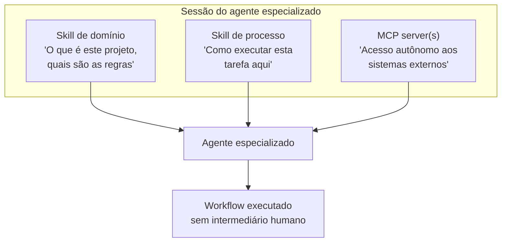
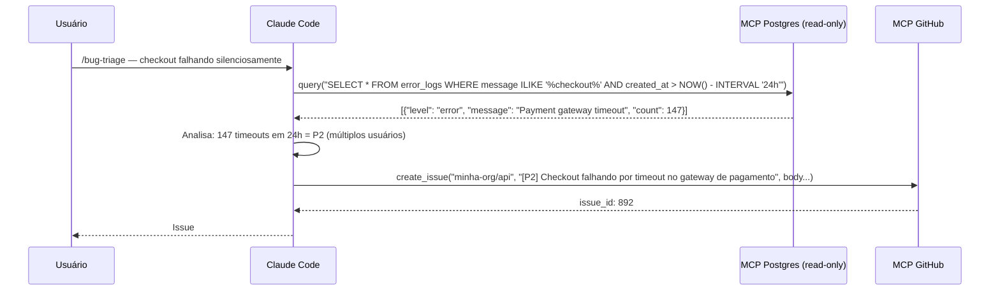
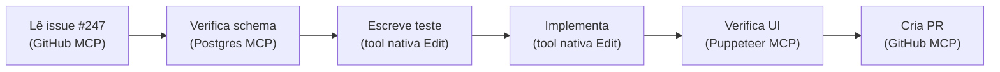

# Compondo skills e MCP — agentes especializados

> [!abstract] TL;DR
> Skills e [[Dicionário de IA#MCP server|MCP servers]] são complementares: skills ensinam o [[Dicionário de IA#Agent|agente]] *como* trabalhar; MCP servers dão ao agente *acesso* ao que ele precisa para trabalhar. Combinados, eles criam um agente especializado que executa workflows completos sem intermediário humano. A composição acontece na sessão — você invoca skills, o MCP está configurado, e o agente une os dois.

## A analogia do especialista completo

Imagine contratar um engenheiro sênior que conhece profundamente as melhores práticas de TDD (processo) mas que ao chegar no primeiro dia de trabalho descobre que não tem acesso ao banco de dados, não consegue abrir o GitHub, e não pode rodar testes de UI.

Ele sabe *como* fazer — mas não tem acesso ao que precisa para *fazer de fato*.

Agora imagine o inverso: um dev com acesso total ao banco, ao GitHub, ao browser — mas sem nenhum processo. Ele cria issues no formato errado, faz queries que não seguem as convenções do projeto, e ignora o checklist de deploy.

Skills sem MCP = processo sem acesso.
MCP sem skills = acesso sem processo.

**A composição entrega o especialista completo**: processo correto + acesso autônomo + contexto do projeto.

> [!question] Como saber o que falta?
> Se o agente está pedindo para você copiar e colar dados de um sistema externo, está faltando MCP.
> Se o agente está tomando decisões que violam as convenções do projeto, está faltando uma skill de domínio.
> Se o agente está executando os passos errados, está faltando uma skill de processo.

## Os três componentes de um agente especializado



| Componente | Pergunta que responde | Exemplo |
|---|---|---|
| Skill de domínio | O que é este projeto? | Arquitetura, convenções, regras de negócio |
| Skill de processo | Como fazer esta tarefa? | TDD, deploy checklist, bug triage |
| MCP server | Com o quê o agente trabalha? | Postgres, GitHub, browser |

Nem toda sessão precisa dos três. Use o mínimo necessário para a tarefa.

## Exemplo 1: agente de triagem de bugs

**Objetivo**: investigar bugs reportados, verificar logs no banco, e criar issues estruturadas no GitHub.

**Configuração MCP** em `settings.json`:

```json
{
  "mcpServers": {
    "postgres-prod-ro": {
      "command": "npx",
      "args": ["-y", "@modelcontextprotocol/server-postgres"],
      "env": { "DATABASE_URL": "${DATABASE_PROD_READONLY_URL}" }
    },
    "github": {
      "command": "npx",
      "args": ["-y", "@modelcontextprotocol/server-github"],
      "env": { "GITHUB_PERSONAL_ACCESS_TOKEN": "${GITHUB_TOKEN}" }
    }
  }
}
```

**Skill de processo** em `.claude/skills/bug-triage.md`:

```markdown
---
name: bug-triage
description: Guia a investigação de bugs reportados — verifica logs, reproduz, prioriza e cria issue
metadata:
  type: process
  tags: [bug, triage, debugging]
---

# Bug Triage — Processo

## Passo 1: Reproduzir o contexto

Para cada bug reportado:
1. Entenda o comportamento esperado vs observado
2. Verifique os logs do banco: `SELECT * FROM error_logs WHERE created_at > NOW() - INTERVAL '24h' AND message ILIKE '%<termo-do-bug>%'`
3. Identifique o endpoint ou fluxo afetado

## Passo 2: Priorizar

**P1 — Crítico**: dado corrompido, perda de transação, acesso indevido
**P2 — Alto**: funcionalidade principal quebrada para múltiplos usuários
**P3 — Médio**: funcionalidade degradada ou workaround existe
**P4 — Baixo**: UX ruim, caso de borda

## Passo 3: Criar issue estruturada

Use `create_issue` (GitHub MCP) com este formato:
- **Título**: `[P{nível}] Descrição curta do comportamento observado`
- **Corpo**: Comportamento esperado / Observado / Reprodução / Logs relevantes / Hipótese inicial
- **Labels**: `bug`, `p{nível}`, módulo afetado
```

**Sessão**:

```
/bug-triage
Investigar o bug reportado: usuários reclamam que checkout está falhando silenciosamente
```



## Exemplo 2: agente de onboarding de feature

**Objetivo**: implementar uma feature descrita em uma issue, seguindo TDD, com acesso ao schema do banco.

**Skills**:
- `/arquitetura-projeto` — domínio: módulos, responsabilidades, convenções
- `/tdd` — processo: red → green → refactor

**MCP servers**:
- `postgres-dev` — verificar schema enquanto implementa
- `github` — ler issue com requisitos, criar PR ao final

**Sessão**:

```
/arquitetura-projeto
/tdd
Implementa a feature descrita na issue #247
```

O agente:
1. Lê a issue #247 via `get_issue` (GitHub MCP) — entende os requisitos
2. Verifica o schema das tabelas envolvidas via `describe_table` (Postgres MCP)
3. Segue o processo TDD da skill: escreve o teste falhando primeiro
4. Implementa o mínimo para passar
5. Refatora respeitando as convenções da skill de arquitetura
6. Cria o PR via `create_pull_request` (GitHub MCP) com referência à issue

## Exemplo 3: agente de deploy

**Skill de processo** em `.claude/skills/deploy-checklist.md`:

```markdown
---
name: deploy-checklist
description: Checklist de deploy para staging — verifica PRs, migrations, e documenta o deploy
metadata:
  type: process
  tags: [deploy, staging, checklist]
---

# Deploy para Staging — Checklist

## MCP servers necessários
- `postgres-staging` — verificar migrations pendentes
- `github` — listar PRs e criar issue de tracking

## Passos

1. Listar PRs mesclados desde o último deploy via `list_pull_requests`
2. Verificar migrations pendentes: `SELECT name FROM migrations WHERE applied_at IS NULL ORDER BY created_at`
3. Se há migrations: confirmar que foram testadas em dev antes de prosseguir
4. Criar issue de tracking com: PRs incluídos, migrations aplicadas, data/hora do deploy
5. Reportar resultado: sucesso ou falha com stack trace
```

**Sessão**:

```
/deploy-checklist
Deploying release/2.4.0 to staging
```

O agente segue o checklist, usa os MCP servers para cada etapa e cria a issue de documentação.

## Skill que instrui uso de MCP explicitamente

Você pode incluir na skill referência explícita a quais tools MCP usar. Isso remove ambiguidade quando há múltiplos servers com tools de mesmo nome:

```markdown
## Verificar schema

Use `describe_table` do `postgres-staging` (não do `postgres-dev`) para confirmar o estado da tabela no ambiente alvo.

## Criar documentação

Use `create_issue` do GitHub com o template de deploy:
```
[DEPLOY] {versão} → staging — {data}
PRs: #{lista}
Migrations: {sim/não, quais}
Resultado: {sucesso/falha}
```
```

A referência explícita ao nome do server (`postgres-staging`) garante que o agente usa o server correto quando há múltiplos configurados.

## Quando a composição não é necessária

Adicionar componentes sem necessidade aumenta a superfície de risco e o overhead cognitivo do agente.

| Tarefa | Suficiente |
|---|---|
| Implementar uma função nova | Tools nativas (`Edit`, `Write`) |
| Refatorar código existente | Skill de processo (TDD, review) |
| Investigar bug em produção | MCP postgres read-only + skill de debugging |
| Feature com requisito em issue | MCP github + skill de domínio |
| Deploy com checklist | Skill de processo + MCP de banco e git |
| Code review de PR | Skill de processo (sem MCP necessário) |

Regra: adicione um componente só quando ele resolve algo que o agente não consegue fazer sem ele.

## Documentar a composição para o time

Para workflows que o time vai repetir, documente a composição no `CLAUDE.md` do projeto:

```markdown
## Workflows disponíveis

### Deploy para staging
Requer MCP: `postgres-staging`, `github`
Invoke: `/deploy-checklist`
Nota: postgres-staging é read-write — use com cuidado.

### Triagem de bugs
Requer MCP: `postgres-prod-ro` (read-only), `github`
Invoke: `/convencoes-projeto` depois `/bug-triage`

### Feature do zero
Requer MCP: `postgres-dev`, `github`
Invoke: `/arquitetura-projeto` depois `/tdd`
```

Isso garante que qualquer dev do time sabe o que configurar antes de usar os workflows — e previne o erro de apontar o server errado para o workflow errado.

## Padrões avançados de composição

### O agente como orquestrador de multi-step

A composição skills + MCP transforma o agente em um orquestrador que executa sequências de passos envolvendo múltiplos sistemas. Cada passo usa o resultado do anterior:



Sem composição, você seria o orquestrador — copiando dados de um sistema para outro. Com composição, o agente faz isso autonomamente.

### Escalando a composição por complexidade

| Complexidade | Composição |
|---|---|
| Tarefa simples | Tools nativas |
| Tarefa com acesso externo | MCP server relevante |
| Tarefa repetitiva com processo | Skill de processo |
| Feature nova no projeto | Skill de domínio + MCP de banco/git |
| Workflow completo do time | Skill processo + domínio + MCP |
| Automação de CI/CD | MCP remoto + skill + hooks |

### Composição com hooks para automação

Skills e MCP podem ser combinados com hooks para criar automações que rodam sem invocação manual. Um hook `PostToolUse` pode carregar uma skill de validação automaticamente após certos eventos:

```json
{
  "hooks": {
    "PostToolUse": [
      {
        "matcher": "Edit|Write",
        "hooks": [{ "type": "command", "command": "..." }]
      }
    ]
  }
}
```

Ver [[03-Dominios/Tecnologia/IA/Claude Code/Hooks e Guardrails/index|Hooks e Guardrails]] para o mecanismo completo. A composição com hooks é o nível mais avançado: skill define o processo, MCP dá o acesso, e o hook garante que o processo é sempre seguido.

### Versionando a composição como código

A composição ideal é declarativa — documentada de forma que qualquer dev do time possa replicar:

```markdown
<!-- CLAUDE.md do projeto -->

## Workflows de agente

### Bug triage
```bash
# 1. Certifique-se que DATABASE_PROD_READONLY_URL está exportada
# 2. Invoque as skills na ordem:
/bug-triage
```
MCP necessário: postgres-prod-ro (read-only), github

### Feature nova
```bash
/arquitetura-projeto
/tdd
# Descreva a feature ou referencie o número da issue
```
MCP necessário: postgres-dev, github
```

O `CLAUDE.md` do projeto documenta quais skills invocar, em que ordem, e quais MCP servers configurar. Trata a composição como código — versionada, revisável, replicável.

## Armadilhas

**Skill sem mencionar os MCP necessários**
A skill instrui o processo, mas se não menciona quais tools MCP usar, o agente pode tentar acesso via Bash ou simplesmente falhar. Documente os MCP necessários no início da skill.

**MCP de produção com skill que permite mutações**
Uma skill de "atualizar dados de pedido" + MCP postgres de produção é uma combinação perigosa. Garanta que o MCP server aponta para o ambiente certo. Nomeie os servers com o ambiente: `postgres-dev`, `postgres-staging`, nunca só `postgres`.

**Muitas skills na mesma sessão**
O agente tenta reconciliar todas as instruções. Três skills simultâneas com instruções conflitantes geram comportamento imprevisível. Prefira duas skills focadas por sessão.

**Skill que assume MCP disponível sem verificação**
Se a skill instrui o agente a usar uma tool que não está configurada, o agente vai falhar com erro pouco informativo. Documente na skill quais MCP servers são pré-requisito.

## Como explicar em inglês

**"Composing skills and MCP"** — combining process instructions (skills) with external system access (MCP servers) to create an agent that can execute complete workflows autonomously.

**The key insight:**
- "Skills give the agent *how*; MCP gives the agent *with what*. Neither is sufficient alone."
- "A specialized agent for bug triage needs three things: knowledge of what the project considers a bug (domain skill), a process for investigating and categorizing (process skill), and access to the logs and issue tracker (MCP servers)."
- "The composition is lightweight — you invoke the skills and the MCP is configured. No glue code. The agent connects the dots."

**Common follow-up questions:**
- *"Isn't this just prompt engineering?"* — Skills are versioned Markdown files, not chat prompts. They're reusable artifacts that evolve with the project. The composition is session-level, not conversation-level.
- *"How do you test the composed agent?"* — Run a representative task and observe where it deviates from expected behavior. Each deviation tells you what to add or clarify — in the skill, the MCP server description, or the tool's description.

## Referências

- [[03-Dominios/Tecnologia/IA/Claude Code/Skills e MCP/01 - Anatomia de uma skill|01 - Anatomia de uma skill]] — estrutura de skills
- [[03-Dominios/Tecnologia/IA/Claude Code/Skills e MCP/02 - Skills de processo vs domínio|02 - Skills de processo vs domínio]] — qual tipo de skill compor
- [[03-Dominios/Tecnologia/IA/Claude Code/Skills e MCP/04 - MCP overview|04 - MCP overview]] — arquitetura MCP
- [[03-Dominios/Tecnologia/IA/Claude Code/Skills e MCP/05 - MCP servers essenciais|05 - MCP servers essenciais]] — servers prontos para usar
- [[03-Dominios/Tecnologia/IA/Claude Code/Skills e MCP/06 - Criar MCP server|06 - Criar MCP server]] — criar server para sistemas internos
- [[03-Dominios/Tecnologia/IA/Claude Code/Skills e MCP/08 - Skills em time|08 - Skills em time]] — versionar e manter a composição em equipe
- [[03-Dominios/Tecnologia/IA/Claude Code/Skills e MCP/index|Skills e MCP]] — índice do galho
- [[03-Dominios/Tecnologia/IA/Claude Code/index|Claude Code]] — tronco da trilha
