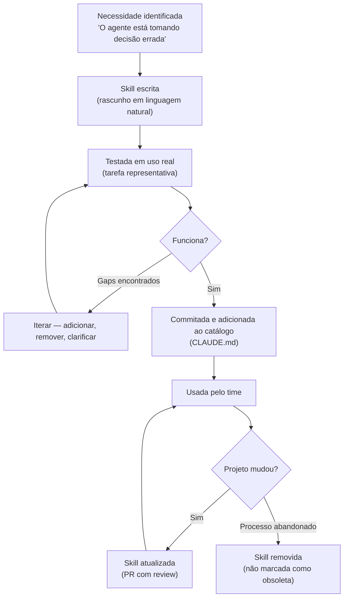
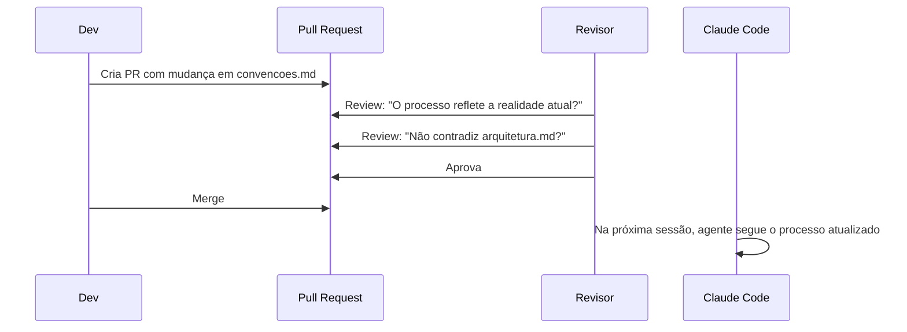

# Skills em time — versionar, manter, compartilhar

> [!abstract] TL;DR
> Skills em `.claude/skills/` são versionadas junto ao código — qualquer dev que clona o repo tem acesso imediato. O desafio não é técnico: é manter as skills atualizadas conforme o projeto evolui. Skills desatualizadas são ativamente prejudiciais: o [[Dicionário de IA#Agent|agente]] segue um processo que o projeto abandonou, com confiança e sem aviso.

## A analogia do manual de processos

Todo time tem um manual de processos: como fazer deploy, como revisar código, quais são as convenções de nomenclatura. Mas manuais têm um problema clássico: eles envelhecem. O time evolui, o projeto muda, e o manual continua descrevendo como as coisas eram feitas — não como são feitas agora.

Skills têm o mesmo problema, mas com uma agravante: o agente *obedece o manual literalmente*. Um humano lê um manual desatualizado e desconfia. O agente lê e segue.

A solução não é técnica — qualquer arquivo Markdown num diretório é suficiente. A solução é cultural: tratar skills como código, com owner, review, e atualização sistemática.

> [!question] Como saber se uma skill está desatualizada?
> Se um dev experiente do time olhar a skill e disser "mas a gente não faz mais assim" — a skill está desatualizada. Esse momento de estranhamento é o sinal.

## Por que versionar no repositório

Skills em `.claude/skills/` são commitadas junto ao código. Comparando com a alternativa (skills pessoais em `~/.claude/skills/`):

| Dimensão | `.claude/skills/` (projeto) | `~/.claude/skills/` (pessoal) |
|---|---|---|
| Escopo | Este projeto | Todos os projetos do dev |
| Disponível para o time | Sim, via clone | Não |
| Histórico de mudanças | git log | Só no seu sistema |
| Code review de skills | Sim, via PR | Não |
| Novo dev no time | Recebe skills automaticamente | Precisa configurar manualmente |
| Quando usar | Convenções e processos do projeto | Seus workflows pessoais |

**A vantagem mais subestimada**: o git log de uma skill mostra *quando* uma convenção mudou e *por quê* — se o commit message for bom. É documentação histórica gratuita.

```bash
# Ver histórico de uma skill
git log --oneline .claude/skills/convencoes.md

# Comparar com versão anterior
git diff HEAD~5 .claude/skills/convencoes.md
```

## Estrutura recomendada

```
.claude/
  skills/
    processo/
      tdd.md
      code-review.md
      debugging.md
      deploy-checklist.md
    dominio/
      arquitetura.md
      convencoes.md
      regras-negocio.md
      banco.md
  settings.json   ← configuração MCP
```

Subpastas por tipo tornam o catálogo legível. O [[Dicionário de IA#Claude Code|Claude Code]] encontra skills em qualquer nível dentro de `.claude/skills/`.

Organize conforme o catálogo cresce — mas comece flat (sem subpastas) até ter 4+ skills. Organização prematura de um conjunto pequeno é overhead sem benefício.

## O ciclo de vida completo de uma skill



O passo que mais falha é a atualização. Skills são escritas e nunca mais tocadas — mesmo quando o projeto evolui completamente. Sem um trigger explícito para atualização, a skill envelhece silenciosamente.

## Mantendo skills atualizadas: o sistema de triggers

### Trigger 1: mudança de processo

Toda vez que o time toma uma decisão que mudaria o comportamento do agente, é um trigger para atualizar a skill:

- Adotou nova convenção de nomenclatura → atualizar `convencoes.md`
- Mudou o processo de deploy → atualizar `deploy-checklist.md`
- Adicionou regra de negócio crítica → atualizar `regras-negocio.md`
- Abandonou uma prática → remover da skill ou adicionar seção "não fazer mais"

### Trigger 2: PR no módulo coberto pela skill

Se um PR toca `src/orders/`, o code review deveria incluir a pergunta: "a skill `arquitetura-orders.md` precisa ser atualizada?" Isso transforma a atualização em parte natural do processo de mudança.

```markdown
<!-- PR template -->

## Checklist

- [ ] Testes passando
- [ ] CHANGELOG atualizado
- [ ] Skills atualizadas se o PR muda convenções ou arquitetura
```

### Trigger 3: revisão periódica

Inclua skills na revisão de documentação técnica (sprint review, quarterly). Perguntas:

- Esta skill ainda reflete como o time trabalha?
- Há passos que foram adicionados à prática mas não à skill?
- Há passos na skill que o time parou de fazer?
- A skill tem exemplos com código desatualizado?

## Ownership: quem cuida de cada skill

Sem owner definido, nenhuma skill será mantida. A responsabilidade difusa é responsabilidade de ninguém.

```markdown
---
name: deploy-checklist
description: Checklist de deploy para staging
metadata:
  type: process
  owner: "@time-infra"
  last_reviewed: "2026-03-01"
---
```

**Regra de ownership**:
- Skill de processo → tech lead ou quem definiu o processo
- Skill de domínio → quem mais trabalha no módulo coberto

Quando o owner sai do time, o owner da skill deve ser reatribuído antes que ela envelheça.

## Catálogo no CLAUDE.md

Documente as skills disponíveis no `CLAUDE.md` do projeto para que o time saiba o que existe:

```markdown
## Skills disponíveis

### Processo
| Skill | Quando usar | Owner |
|---|---|---|
| `/tdd` | Ao implementar features ou corrigir bugs | @tech-lead |
| `/code-review` | Antes de solicitar review num PR | @tech-lead |
| `/deploy-checklist` | Antes de qualquer deploy para staging | @time-infra |
| `/debugging` | Ao investigar um bug em produção | @tech-lead |

### Domínio
| Skill | Quando usar | Owner |
|---|---|---|
| `/arquitetura` | Início de qualquer sessão de desenvolvimento | @tech-lead |
| `/convencoes` | Ao escrever código novo ou refatorar | @tech-lead |
| `/regras-negocio` | Ao implementar ou alterar lógica de negócio | @product-eng |
| `/banco` | Ao escrever queries ou migrations | @backend-lead |
```

Sem esse catálogo, novos devs descobrem as skills por acidente — ou não descobrem.

## Versionamento semântico para skills

Assim como pacotes de software têm versão semântica, skills de alta criticidade podem ter versionamento explícito no frontmatter:

```markdown
---
name: deploy-checklist
description: Checklist de deploy para staging
metadata:
  type: process
  version: "2.3"
  owner: "@time-infra"
  last_reviewed: "2026-06-01"
  breaking_changes: "v2.0 — removido step de rollback manual (agora automatizado via CI)"
---
```

O campo `breaking_changes` ajuda qualquer dev que conhecia a versão anterior a entender o que mudou. Não é obrigatório, mas em skills críticas (deploy, segurança) o custo de não ter é alto.

## Code review de skills

Skills passam pelo mesmo processo de review que código. Um PR que adiciona ou muda uma skill deve ser revisado como qualquer mudança de comportamento:

**Checklist de review de skill:**
- O processo descrito reflete como o time realmente trabalha (não como gostaria)?
- A mudança não contradiz outra skill existente?
- Há exemplos concretos de output para o agente?
- O owner está definido no frontmatter?
- A skill tem critério de saída claro?



Uma skill errada é pior que código com bug — o bug aparece nos testes; a skill errada orienta o agente silenciosamente na direção errada.

## A skill como documentação viva

Uma skill bem mantida tem um efeito colateral valioso: ela documenta o processo para humanos também. Qualquer membro do time pode ler `.claude/skills/` e entender como as coisas são feitas. Isso é especialmente valioso em momentos de:

- **Onboarding**: o novo dev lê as skills e já tem uma visão de como o time trabalha
- **Auditoria**: revisar as skills revela se o processo documentado bate com o praticado
- **Retrospectiva**: skills antigas mostram como o processo evoluiu — o git log das skills é um histórico da maturidade técnica do time

> [!tip] Trate o código de skill como código de produção
> Assim como código mal nomeado dificulta a manutenção, skill mal escrita dificulta o trabalho do agente. Invista no mesmo rigor de clareza e revisão que você aplica ao código.

## Quando aposentar uma skill

Uma skill que descreve um processo abandonado deve ser **removida**, não marcada como obsoleta. O agente não entende "obsoleto" — ele vai seguir a instrução da mesma forma.

```bash
# Remove a skill (histórico fica no git)
git rm .claude/skills/processo/deploy-manual.md
git commit -m "chore: remove skill de deploy manual — substituída por CI/CD (ver pipeline.yml)"
```

O histórico de por que o processo existia e por que foi abandonado fica no commit message e no git log. A skill não fica no repo confundindo o agente.

## Onboarding de novos devs

Skills são parte do onboarding. Um dev que clona o repo e configura o Claude Code tem acesso imediato ao processo do time:

```markdown
## Setup do Claude Code

1. Clone o repo (as skills em `.claude/skills/` já estão incluídas)
2. Configure as variáveis de ambiente (ver `docs/env-setup.md`)
3. Configure `~/.claude/settings.json` com os MCP servers (ver `docs/mcp-setup.md`)
4. Skills disponíveis: consulte a seção "Skills disponíveis" neste CLAUDE.md
5. Para desenvolvimento: sempre invoque `/arquitetura` e `/tdd` antes de começar
```

O novo dev não precisa aprender as convenções do zero — o agente as segue automaticamente depois que as skills são carregadas.

## Casos práticos

**Cenário 1 — time de 8 devs adota skills e evita um incidente repetido**

Um time de backend vivia repetindo o mesmo erro: esquecer de invalidar cache ao alterar um campo indexado, causando dados obsoletos em produção. Depois do terceiro incidente, o tech lead escreveu `cache-invalidation.md`: quando um campo indexado muda, quais chaves de cache invalidar, e o comando exato pra rodar. A skill entrou no `.claude/skills/dominio/`, com owner definido e um exemplo real do incidente anterior no corpo do texto.

Resultado em três meses: zero recorrências do mesmo bug. Todo PR que tocava o schema indexado passou a receber, automaticamente, o lembrete do agente para invalidar o cache certo — porque a skill virou parte do contexto de qualquer sessão que tocasse aquele módulo. O ganho não foi só evitar o bug: foi transformar conhecimento tribal (só o tech lead sabia dessa armadilha) em conhecimento acessível a qualquer dev, júnior incluso.

**Cenário 2 — time de 12 devs abandona uma skill sem perceber, e o agente segue orientando errado**

Um time de frontend tinha `state-management.md`, escrita quando o projeto usava Redux. Seis meses depois, o time migrou para uma lib de estado mais simples — mas ninguém lembrou de tocar a skill. Sem owner definido no frontmatter, a atualização não era responsabilidade de ninguém específico.

O problema só apareceu quando um dev novo, trabalhando com o agente numa feature nova, recebeu sugestões consistentes de padrão Redux (actions, reducers, dispatch) — um padrão que o time tinha abandonado havia meses. O dev, confiando no agente, implementou a feature no padrão errado. Levou um PR inteiro de retrabalho e uma reunião de retrospectiva pra descobrir a causa: a skill nunca foi atualizada, e ninguém tinha lido `.claude/skills/` desde a migração. A correção não foi só editar a skill — foi adicionar `last_reviewed` obrigatório e a pergunta de retrospectiva ("alguma skill te levou na direção errada esta semana?") ao processo do time.

## Armadilhas comuns

> [!warning] O museu de skills
> O time cria skills com entusiasmo no início, mas ninguém as mantém. Meses depois, `.claude/skills/` parece um museu: documentos que descrevem práticas abandonadas, libs trocadas, convenções que ninguém mais segue. O agente segue o museu com confiança.
>
> **Como evitar:** todo frontmatter de skill de domínio tem `last_reviewed`. Skills com mais de 90 dias sem revisão entram em pauta na retrospectiva — revisar ou remover.

> [!warning] A skill aspiracional
> O time escreve o processo que *gostaria* de seguir, não o que *realmente* segue. A skill de TDD diz "escreva o teste primeiro, sempre" — mas na prática o time escreve testes depois, exceto para código crítico. O agente trava tentando seguir o ideal.
>
> **Como evitar:** documente o processo real com as exceções reais. "Escreva o teste primeiro — exceto para scripts de migração one-off" é mais útil que a versão idealizada.

> [!warning] A skill monolítica
> Um `convenções.md` com 800 linhas cobrindo nomenclatura, estrutura de pastas, segurança, banco, e linting. O agente lê tudo, mas prioriza o que vem primeiro ou o que é mais recente no texto.
>
> **Como evitar:** skills focadas, 100-200 linhas cada. `nomenclatura.md`, `banco.md`, `segurança.md`. O agente carrega o que for relevante para a tarefa.

> [!warning] O conflito silencioso
> `convencoes.md` diz camelCase. `arquitetura.md` tem exemplos com snake_case (legado não atualizado). O agente tenta reconciliar e escolhe arbitrariamente.
>
> **Como evitar:** ao atualizar uma skill, grep por termos que possam conflitar com outras. `grep -r "snake_case" .claude/skills/` antes de commitar uma mudança de convenção.

> [!warning] Skill sem owner em time que cresce
> Uma skill de 3 meses sem dono vira orfã. Quando a convenção muda, ninguém sabe que a skill precisa ser atualizada. O novo dev ou o agente segue a skill — e está errado.
>
> **Como evitar:** owner obrigatório no frontmatter. Quando o owner sai do time, o novo owner é atribuído antes da saída.

## Escalando o catálogo conforme o time cresce

O mesmo sistema que funciona para 3 devs fica pesado para 30. A estrutura evolui com o time.

**Time pequeno (1-3 devs)**
Um `CLAUDE.md` + 2-3 skills básicas. Foco em processo (TDD, deploy) mais do que domínio — com 3 pessoas, o conhecimento do projeto ainda cabe na cabeça de todos.

```
.claude/skills/
  tdd.md
  code-review.md
  convencoes.md
```

**Time médio (4-15 devs)**
Skills por tipo e por módulo. Um dev de backend não precisa carregar skills de frontend ao desenvolver sua parte.

```
.claude/skills/
  processo/   ← vale para todos
    tdd.md
    code-review.md
    deploy.md
  dominio/    ← vale para qualquer área
    arquitetura.md
    convencoes.md
  backend/    ← específico
    payments.md
    orders.md
  frontend/   ← específico
    components.md
    testes-ui.md
```

**Time grande (15+ devs) ou múltiplos serviços**
Skills distribuídas por serviço, com skills de processo compartilhadas via plugin global da organização.

```
# Plugin global (processo comum a todos)
~/.claude/plugins/org-skills/skills/
  tdd.md
  code-review.md

# Por serviço (domínio específico)
payments-api/.claude/skills/
  payments-domain.md
  payments-db.md

orders-api/.claude/skills/
  orders-domain.md
```

## Métricas simples de saúde do catálogo

Não precisa de automação para começar — uma revisão manual por sprint resolve os problemas mais comuns:

| Métrica | Sinal de saúde | Sinal de alerta |
|---|---|---|
| `last_reviewed` | < 30 dias para skills de domínio | > 90 dias sem review |
| Owner definido | Toda skill tem `owner:` no frontmatter | Qualquer skill sem owner |
| Taxa de uso | Devs invocam skills regularmente | "Eu não sabia que isso existia" |
| Conflitos | Skills consistentes entre si | Dois arquivos dizem coisas opostas |
| Tamanho médio | 100-300 linhas por skill | Skill com > 500 linhas (provavelmente são duas) |

Uma pergunta na retrospectiva a cada sprint basta: "Alguma skill impediu seu trabalho ou levou o agente na direção errada esta semana?" A resposta positiva é o trigger para revisão imediata.

## Distribuição via plugin

Para skills que você quer compartilhar entre projetos sem copiar arquivos:

```bash
# Criar estrutura de plugin local
mkdir -p ~/.claude/plugins/meu-plugin/skills

# Adicionar skills genéricas (TDD, debugging, que valem em qualquer projeto)
cp .claude/skills/processo/tdd.md ~/.claude/plugins/meu-plugin/skills/
cp .claude/skills/processo/debugging.md ~/.claude/plugins/meu-plugin/skills/
```

Plugins globais são carregados em todos os projetos. Útil para skills de processo genéricas. Skills de domínio não devem virar plugin — elas são específicas do projeto.

## Como explicar em inglês

**"Skills as team artifacts"** — treating skill files as first-class artifacts that live in source control, get reviewed, have owners, and evolve with the codebase.

| PT | EN |
|---|---|
| skill | skill |
| dono / responsável | owner |
| desatualizada / vencida | stale |
| versionamento (semântico) | versioning |
| catálogo de skills | skill catalog |
| revisão periódica | periodic review |
| documentação viva | living documentation |
| skill de processo | process skill |
| skill de domínio | domain skill |

**Key points:**
- "We commit skills in `.claude/skills/`. When someone clones the repo, they get the team's process knowledge immediately."
- "Skills have owners. Domain skills especially — they go stale fast. Without an owner, a skill becomes a liability."
- "The risk of a stale skill is worse than no skill: the agent confidently follows a process the team abandoned months ago."
- "We added skills to our PR checklist: if the PR changes architecture or conventions, update the relevant skill as part of the same PR."

**Common follow-up questions:**
- *"How do you prevent skills from drifting out of sync?"* — Ownership, PR templates that include skill updates, and periodic review during sprint demos.
- *"What if two devs have conflicting opinions about the skill?"* — Same process as any technical decision: discuss in PR review, reach consensus, document in the commit message.
- *"Should skills be tested?"* — Test them the same way you'd test documentation: run a representative task and verify the agent behaves as the skill describes. If not, update the skill.

## O que vem a seguir

Este é o fim do galho "Skills e MCP" — as oito notas cobriram o ciclo completo: anatomia de uma skill, skills de processo vs domínio, o primeiro walkthrough, MCP overview, servers essenciais, criar um MCP server próprio, compor skills com MCP, e agora manter tudo isso vivo em time. A pergunta que resta é operacional: como esse sistema de extensão (skills + MCP) se encaixa num fluxo de trabalho real, do primeiro prompt até o merge? É o assunto do próximo galho da trilha, [[03-Dominios/Tecnologia/IA/Claude Code/Workflows/index|Workflows]] — onde skills e MCP deixam de ser peças isoladas e viram parte de um pipeline de desenvolvimento.

> [!tip] Vídeo — revisando e melhorando skills existentes
> [Build Better AI Agent Skills With Skill Creator v2 from Anthropic](https://www.youtube.com/watch?v=WplS5lycPHM) mostra o Skill Creator v2 sendo usado para revisar uma skill já existente: criar casos de teste, rodar avaliações, identificar exatamente onde a skill falha e aplicar correções direcionadas — o mesmo ciclo de manutenção descrito nesta nota, só que com tooling de teste em vez de revisão manual.

## Fontes

- [Keeping Documentation Up-to-Date: Strategies for Living Docs](https://amrutadeshpande.substack.com/p/keeping-documentation-up-to-date) (2025) — quando a documentação é responsabilidade de todos, não é responsabilidade de ninguém; ownership explícito evita o "cemitério de docs".
- [Agent Skills — Claude Docs](https://docs.claude.com/en/docs/agents-and-tools/agent-skills/overview) — documentação oficial sobre estrutura, descoberta e escopo (projeto vs pessoal) de skills.
- [[03-Dominios/Tecnologia/IA/Claude Code/Skills e MCP/01 - Anatomia de uma skill|01 - Anatomia de uma skill]] — estrutura e frontmatter
- [[03-Dominios/Tecnologia/IA/Claude Code/Skills e MCP/02 - Skills de processo vs domínio|02 - Skills de processo vs domínio]] — ciclos de vida diferentes (processo vs domínio)
- [[03-Dominios/Tecnologia/IA/Claude Code/Skills e MCP/03 - Criar sua primeira skill|03 - Criar sua primeira skill]] — criar antes de distribuir
- [[03-Dominios/Tecnologia/IA/Claude Code/Skills e MCP/07 - Compondo skills e MCP|07 - Compondo skills e MCP]] — skills em composição com MCP servers
- [[03-Dominios/Tecnologia/IA/Claude Code/Skills e MCP/index|Skills e MCP]] — índice do galho
- [[03-Dominios/Tecnologia/IA/Claude Code/index|Claude Code]] — tronco da trilha
