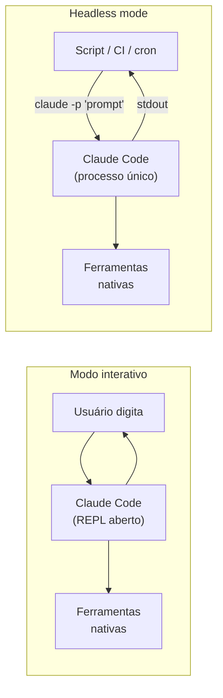
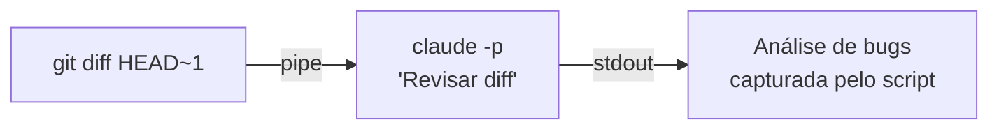
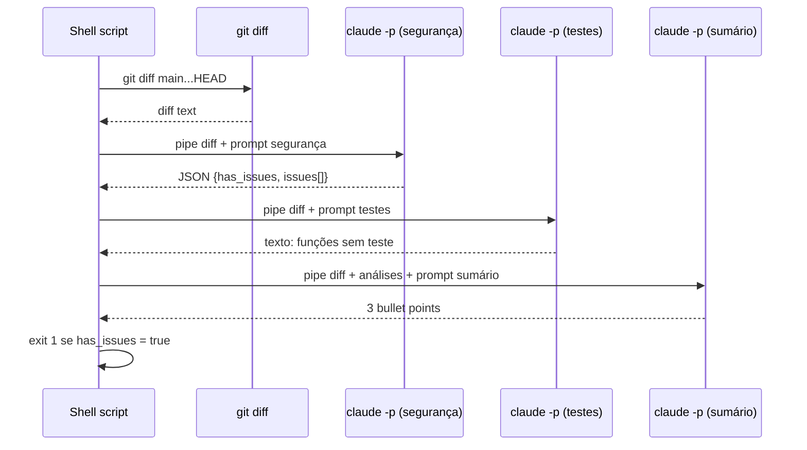

# Headless mode — Claude Code sem interação humana

> [!abstract] TL;DR
> **O quê:** Headless mode é o Claude Code rodando sem terminal interativo — recebe um prompt via argumento ou stdin, executa as ações necessárias, escreve o resultado em stdout, e sai. **Como:** Ative com `claude --print` (ou `-p`); a flag diz ao agente para não abrir o REPL, e sim responder e encerrar o processo — como qualquer outro comando CLI. **Quando usar:** scripts, CI/CD, cron jobs, ou como subprocesso de outra ferramenta — sempre que o trabalho precisa rodar sem ninguém acompanhando em tempo real.

## A analogia do assistente em modo silencioso

Imagine que você tem um assistente extremamente capaz mas que normalmente precisa ficar conversando com você — fazendo perguntas, pedindo confirmações, exibindo o raciocínio em tempo real. Para tarefas do dia a dia, isso é ótimo: a interação é o ponto.

Agora imagine que você quer esse mesmo assistente executando trabalho às 3h da manhã enquanto você dorme. Ele não pode pedir permissão para cada ação — precisa trabalhar de forma autônoma, depositar o resultado, e sair.

Headless mode é o Claude Code nesse "modo silencioso". O mesmo agente, as mesmas capacidades, mas sem a sessão interativa. Você passa o trabalho, ele executa, e o resultado está lá quando você voltar.

> [!question] Por que não usar a API diretamente?
> A API dá controle total mas exige código: Python, TypeScript, gerenciamento de contexto, loop de tool calls. Headless mode usa a CLI que você já tem instalada — é a mesma ferramenta, sem nenhum código adicional. Para automações simples (CI, scripts), headless é suficiente.

## O que muda no headless mode



| Dimensão | Interativo | Headless |
|---|---|---|
| Entrada | Digitação no REPL | Argumento ou stdin |
| Saída | Display rich no terminal | stdout — capturável |
| Duração | Persiste enquanto a sessão dura | Processo único, termina ao completar |
| TTY | Necessário | Não necessário (funciona em CI) |
| Confirmação | Pede ao usuário | `--no-permission-prompts` para executar sem parar |
| Uso típico | Desenvolvimento interativo | Automação, CI/CD, scripts |

## As flags essenciais

### `--print` / `-p` — o coração do headless

```bash
# Modo interativo — abre o REPL
claude

# Headless — executa e sai
claude --print "Qual é a função principal em src/main.ts?"
claude -p "Analisa os últimos 10 commits e identifica regressões potenciais"
```

Sem `--print`, o Claude Code abre o REPL mesmo quando invocado com um argumento. A flag diz: "não abra o REPL, imprime a resposta e sai".

### `--output-format` — controle do formato de saída

```bash
# Texto puro (padrão para leitura humana)
claude -p --output-format text "Descreva a arquitetura deste projeto"

# JSON (para processamento por script)
claude -p --output-format json "Listar todas as funções exportadas"

# Streaming JSON (linha por linha, para pipelines)
claude -p --output-format stream-json "Analise este arquivo"
```

Para automação, prefira `json` — a estrutura garante parsing confiável com `jq`.

### `--max-turns` — limite de tool calls

```bash
# Limite a 5 iterações de tool calls
claude -p --max-turns 5 "Revise o arquivo src/auth.ts"
```

Sem limite, uma tarefa aberta pode loop indefinidamente, consumindo [[Dicionário de IA#Token|tokens]] e dinheiro. Para automações de produção, sempre defina `--max-turns`.

### `--allowedTools` e `--disallowedTools` — controle de superficie

```bash
# Só leitura — o agente não pode modificar nada
claude -p --allowedTools "Read,Grep" "Encontre todos os usos de console.log"

# Sem Bash — o agente não pode executar comandos
claude -p --disallowedTools "Bash,Write" "Revise este código"
```

Em CI/CD, restringir as tools é uma camada extra de segurança: mesmo que o prompt seja mal formado, o agente não consegue fazer mais do que você autorizou.

### `--no-permission-prompts` — execução não-interativa

```bash
# Executa sem pedir confirmação
claude -p --no-permission-prompts "Refatora o módulo de autenticação"
```

> [!warning] Use com guardrails
> `--no-permission-prompts` faz o agente executar sem nenhuma confirmação humana. Use apenas em ambientes controlados com [[Dicionário de IA#Guardrail|guardrails]] configurados via hooks. Sem guardrails, o agente pode modificar qualquer arquivo ou executar qualquer comando. Ver [[03-Dominios/Tecnologia/IA/Claude Code/Hooks e Guardrails/05 - Guardrails|Guardrails]] para como configurar restrições.

## Passando contexto via stdin

Para prompts longos ou para injetar conteúdo dinâmico:

```bash
# Diff como contexto
git diff HEAD~1 | claude -p "Revisar este diff e identificar bugs introduzidos"

# Arquivo como input
cat docs/requirements.md | claude -p "Listar os requisitos não implementados ainda"

# Heredoc para prompt longo
claude -p << 'EOF'
Analise o arquivo abaixo e identifique problemas de segurança:

$(cat src/auth/login.ts)
EOF

# Múltiplos arquivos concatenados
{ cat src/orders.ts; echo "---"; cat src/payments.ts; } | claude -p "Analise a interação entre esses dois módulos"
```



## Output em JSON para automação

```bash
# Resposta estruturada
RESULTADO=$(claude -p --output-format json "
Analise src/api/orders.ts e retorne JSON com:
- has_error_handling: boolean
- missing_validations: string[]
- security_issues: string[]
")

# Verificar se tem issues de segurança
HAS_SECURITY=$(echo "$RESULTADO" | jq '.security_issues | length > 0')
if [ "$HAS_SECURITY" = "true" ]; then
  echo "ALERTA: Issues de segurança encontradas"
  echo "$RESULTADO" | jq '.security_issues[]'
  exit 1
fi
```

O JSON de output contém tanto a resposta textual quanto metadados:

```json
{
  "type": "result",
  "result": "...",           // a resposta do agente
  "cost_usd": 0.0023,        // custo desta invocação
  "duration_ms": 4200,       // tempo de execução
  "num_turns": 3             // quantas tool calls foram feitas
}
```

Esses metadados são úteis para monitorar custo e performance em automações de produção.

## Códigos de saída

| Código | Significado |
|---|---|
| `0` | Agente completou sem erro |
| `1` | Erro de execução (tool falhou, permissão negada, etc.) |
| `2` | Erro de configuração (API key inválida, flags inválidas) |

```bash
# Verificar código de saída
if ! claude -p --allowedTools "Bash" "Verifica se os testes passam"; then
  echo "O agente encontrou um problema — verifique os logs"
  exit 1
fi

# Capturar saída E verificar sucesso
RESULTADO=$(claude -p "..." 2>&1)
EXIT_CODE=$?
if [ $EXIT_CODE -ne 0 ]; then
  echo "Falha com código $EXIT_CODE: $RESULTADO"
  exit $EXIT_CODE
fi
```

## Headless vs subagente: quando usar cada um

| Cenário | Headless (`claude -p`) | Subagente (Agent SDK) |
|---|---|---|
| Script bash ou CI job | ✅ Ideal | Overkill |
| Análise de arquivo único | ✅ Ideal | Overkill |
| Múltiplos agentes em paralelo | Difícil | ✅ Ideal |
| Handoff de contexto entre agentes | Não suportado | ✅ Ideal |
| Controle granular de contexto | Limitado | ✅ Total |
| Sem código adicional | ✅ Zero código | Requer código Python/TS |
| Output estruturado | Via JSON flag | Via schemas tipados |

Para automações simples em CI/CD, headless é suficiente e mais simples. Para orquestração complexa (múltiplos agentes, pipelines de agentes, handoffs), o Agent SDK dá mais controle.

## Configuração de ambiente para headless

O headless mode usa as mesmas configurações do modo interativo, mas via variáveis de ambiente (não via `~/.claude/settings.json` — que pode não existir no CI):

```bash
# API key (obrigatória)
export ANTHROPIC_API_KEY="sk-ant-..."

# Modelo (opcional — padrão: claude-sonnet)
export CLAUDE_CODE_SUBAGENT_MODEL="claude-haiku-4-5"

# Desabilitar telemetria (opcional)
export CLAUDE_CODE_DISABLE_TELEMETRY=1
```

No GitHub Actions, `ANTHROPIC_API_KEY` vai em Secrets:

```yaml
steps:
  - name: Rodar Claude Code
    env:
      ANTHROPIC_API_KEY: ${{ secrets.ANTHROPIC_API_KEY }}
    run: |
      claude -p --no-permission-prompts "Analise o PR"
```

## Armadilhas

> [!warning] Sem `--no-permission-prompts` em CI
> O agente vai pausar pedindo confirmação e o job vai travar até o timeout. Sempre use a flag em ambientes não-interativos.

> [!warning] Output misturado com logs internos
> Mensagens de status do agente vão para stderr; a resposta vai para stdout. Separe corretamente:
>
> ```bash
> RESPOSTA=$(claude -p "..." 2>/dev/null)   # Só a resposta
> claude -p "..." > resposta.txt 2> logs.txt # Separados
> ```

> [!warning] Max-turns sem limite em tarefa aberta
> Uma tarefa com escopo amplo sem `--max-turns` pode rodar por muitas iterações. Defina um limite conservador — se o agente não conseguiu em 10 turns, provavelmente a tarefa está mal especificada.

> [!warning] API key não disponível no CI
> A key precisa estar em `ANTHROPIC_API_KEY` no ambiente. Configure como secret no sistema de CI antes de ativar qualquer job com Claude Code.

> [!warning] Prompt com shell injection
> Ao construir prompts dinamicamente em bash, sempre use aspas e seja cauteloso com dados externos:
>
> ```bash
> # ❌ Vulnerável a injection se ARQUIVO veio de input externo
> claude -p "Analise $ARQUIVO"
>
> # ✅ Use heredoc para isolar o prompt
> claude -p << EOF
> Analise o arquivo: $ARQUIVO
> EOF
> ```

## Padrão: headless como pipeline de análise

Uma das composições mais úteis do headless mode é criar um pipeline onde cada etapa passa seu output para a próxima:

```bash
#!/usr/bin/env bash
# pipeline-de-revisao.sh — exemplo de pipeline headless em múltiplas etapas

set -euo pipefail

PR_NUMBER=${1:-HEAD}

# Etapa 1: buscar o diff
DIFF=$(git diff main...HEAD)

# Etapa 2: análise de segurança
echo "[1/3] Analisando vulnerabilidades de segurança..."
SEC=$(echo "$DIFF" | claude -p --output-format json --max-turns 5 \
  "Analise este diff por problemas de segurança: SQL injection, XSS, dados hardcoded, permissões incorretas. Retorne JSON com: has_issues: boolean, issues: string[]")

HAS_SEC=$(echo "$SEC" | jq -r '.result' | python3 -c "import json,sys; d=json.load(sys.stdin); print(str(d.get('has_issues',False)).lower())" 2>/dev/null || echo "false")

# Etapa 3: análise de testes
echo "[2/3] Verificando cobertura de testes..."
TESTS=$(echo "$DIFF" | claude -p --output-format text --max-turns 3 \
  "Este diff adiciona código novo sem testes correspondentes? Liste as funções sem teste.")

# Etapa 4: sumário executivo
echo "[3/3] Gerando sumário..."
SUMMARY=$(printf "Diff:\n%s\n\nSecurity analysis:\n%s\n\nTest coverage:\n%s" \
  "$DIFF" "$SEC" "$TESTS" | \
  claude -p --max-turns 2 \
  "Gere um sumário executivo em 3 bullet points do estado deste PR")

# Relatório final
echo "=== RELATÓRIO DE REVISÃO ==="
echo "$SUMMARY"
echo ""
if [ "$HAS_SEC" = "true" ]; then
  echo "ATENÇÃO: Problemas de segurança detectados. Revisar antes de merge."
  echo "$SEC" | jq -r '.result.issues[]' 2>/dev/null || true
  exit 1
fi
echo "OK: Sem problemas de segurança detectados."
```



## Monitorando custo e performance

Em automações de produção, é importante rastrear custo por invocação para detectar anomalias (prompt malformado, tarefa com escopo infinito):

```bash
# Wrapper que registra custo e duração
run_claude() {
  local PROMPT="$1"
  local OUTPUT
  OUTPUT=$(claude -p --output-format json --max-turns 10 "$PROMPT")
  
  # Extrair metadados do JSON de saída
  local COST DURATION TURNS
  COST=$(echo "$OUTPUT" | jq -r '.cost_usd // "N/A"')
  DURATION=$(echo "$OUTPUT" | jq -r '.duration_ms // "N/A"')
  TURNS=$(echo "$OUTPUT" | jq -r '.num_turns // "N/A"')
  
  # Logar para arquivo de métricas
  echo "$(date -u +%FT%TZ),${COST},${DURATION},${TURNS}" >> /var/log/claude-metrics.csv
  
  # Alertar se custo acima do limiar
  if [ "$(echo "$COST > 0.10" | bc -l 2>/dev/null)" = "1" ]; then
    echo "ALERTA: invocação custou \$${COST} — verificar escopo do prompt"
  fi
  
  # Retornar apenas o resultado
  echo "$OUTPUT" | jq -r '.result'
}
```

| Métrica | O que indica |
|---|---|
| `cost_usd` alto por invocação | Prompt muito abrangente ou `--max-turns` muito alto |
| `num_turns` próximo do `--max-turns` | Tarefa não foi concluída — escopo muito grande |
| `duration_ms` > 60s | Tool calls lentas ou muitas iterações |
| Exit code 1 repetidamente | Tool falhou — verificar permissões ou acesso externo |

## Anti-padrões

**Usar headless para trabalho interativo** Headless troca a capacidade de direcionamento em tempo real por automação. Se você está mudando o prompt frequentemente baseado no output anterior, o REPL interativo é mais eficiente.

**Prompt vago em headless** No REPL interativo, você pode corrigir o agente quando ele vai na direção errada. Em headless, o agente executa até o fim com o prompt inicial. Seja específico: "analise apenas os arquivos em `src/api/`", não "analise o código".

**Sem `--allowedTools` em CI** Por padrão, o agente tem acesso a todas as tools, incluindo `Bash`. Em um ambiente de CI onde o agente não deveria modificar arquivos, restricione explicitamente. A regra de menor privilégio se aplica igual a usuários humanos.

**Assumir que JSON output é o JSON da resposta** O output JSON do headless tem esta estrutura:

```json
{
  "type": "result",
  "result": "...texto ou objeto JSON aqui...",
  "cost_usd": 0.003,
  "duration_ms": 4200,
  "num_turns": 5
}
```

A resposta do agente está em `.result` — que pode ser uma string com JSON embutido. Use `jq -r '.result'` para extrair, depois parse o JSON interno se necessário.

## Casos práticos

**Cenário 1 — Gate de segurança automático em todo PR** O `pipeline-de-revisao.sh` (seção acima) roda como step de CI: a cada PR aberto, o job dispara três invocações headless em cadeia — análise de segurança, cobertura de testes, sumário executivo — e falha o build (`exit 1`) se `has_issues` vier `true`. Nenhum humano revisa antes do merge; o headless *é* o gate. Isso substitui um linter de segurança customizado por um agente que lê o diff com contexto real do código-fonte, não só regex.

**Cenário 2 — Circuito de alerta de custo em produção** O wrapper `run_claude()` (seção "Monitorando custo e performance") roda em um serviço de automação noturna que dispara dezenas de invocações headless por hora. Cada chamada grava `cost_usd`, `duration_ms` e `num_turns` num CSV; um cron separado lê esse log e dispara alerta no Slack se o custo médio da última hora subir acima do limiar. Sem essa instrumentação, um prompt mal especificado (loop de tool calls) só seria percebido na fatura do mês seguinte.

> [!tip] Vídeo oficial: Building headless automation with Claude Code
> Sid Bidasaria (Anthropic) apresenta padrões parecidos com os dois cenários acima — pipeline de revisão e monitoramento de custo — na talk "Building headless automation with Claude Code" (Code w/ Claude, Anthropic, 2025). [Assista no YouTube](https://www.youtube.com/watch?v=dRsjO-88nBs).

## Como explicar em inglês

**"Headless mode"** — running Claude Code as a non-interactive process: input comes from arguments or stdin, output goes to stdout, and the process exits when done. No REPL, no TTY required.

| PT | EN |
|---|---|
| Modo silencioso / sem interação | Headless mode |
| Saída padrão | stdout |
| Entrada padrão | stdin |
| Código de saída | Exit code |
| Chamada de ferramenta | Tool call |

**The key use cases:**
- "In CI/CD, we use `claude -p --no-permission-prompts` to run code review automatically on every PR."
- "We pipe `git diff` into Claude Code to get a structured list of potential bugs before merge."
- "With `--output-format json`, we capture the response and process it with `jq` to route findings to different Slack channels based on severity."

**Common interview questions:**
- *"How is headless different from using the API?"* — Headless uses the CLI directly — no code, no SDK. The API gives more control but requires implementing the tool-call loop. For simple scripts, headless is faster to set up.
- *"How do you prevent runaway costs in headless automations?"* — `--max-turns` caps the number of tool calls per invocation. Plus monitoring: the JSON output includes `cost_usd` per invocation, so you can alert on anomalies.

## O que vem a seguir

Headless mode isolado já resolve scripts pontuais — mas o padrão que sustenta uma esteira de CI de verdade é outra camada: colocar `claude -p` dentro de um workflow do GitHub Actions, com secrets, matriz de jobs e gatilhos por evento (PR aberto, push, schedule). É aí que os dois cenários da seção "Casos práticos" — gate de segurança e alerta de custo — deixam de ser scripts soltos e viram parte do pipeline oficial do repositório. Veja como em [[03-Dominios/Tecnologia/IA/Claude Code/Time e Automação/02 - CI-CD com GitHub Actions|02 - CI/CD com GitHub Actions]].

## Fontes

- **Anthropic** — [*Run Claude Code programmatically*](https://docs.claude.com/en/docs/claude-code/headless) (doc oficial, 2026). Referência canônica das flags de headless mode (`-p`, `--output-format`, `--max-turns`, `--allowedTools`).
- **Anthropic** — [*CLI reference*](https://docs.claude.com/en/docs/claude-code/cli-reference) (doc oficial, 2026). Lista completa de flags e comandos da CLI.

## Referências

- [[03-Dominios/Tecnologia/IA/Claude Code/Time e Automação/02 - CI-CD com GitHub Actions|02 - CI/CD com GitHub Actions]] — headless em pipelines concretos
- [[03-Dominios/Tecnologia/IA/Claude Code/Time e Automação/03 - Dispatch via claude -p|03 - Dispatch via claude -p]] — padrões avançados de invocação
- [[03-Dominios/Tecnologia/IA/Claude Code/Hooks e Guardrails/05 - Guardrails|05 - Guardrails]] — configurar restrições para headless seguro
- [[03-Dominios/Tecnologia/IA/Claude Code/Time e Automação/index|Time e Automação]] — índice do galho
- [[03-Dominios/Tecnologia/IA/Claude Code/index|Claude Code]] — tronco da trilha
