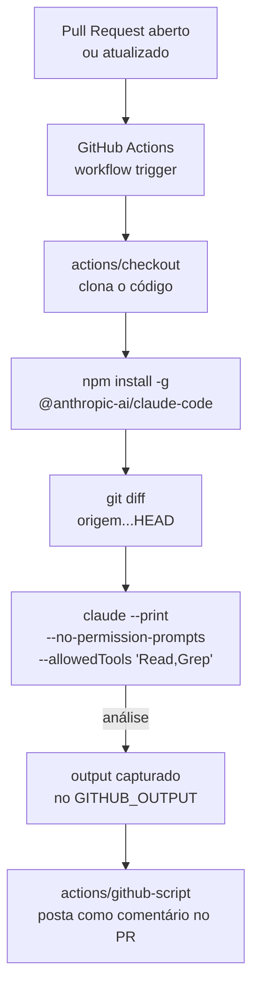
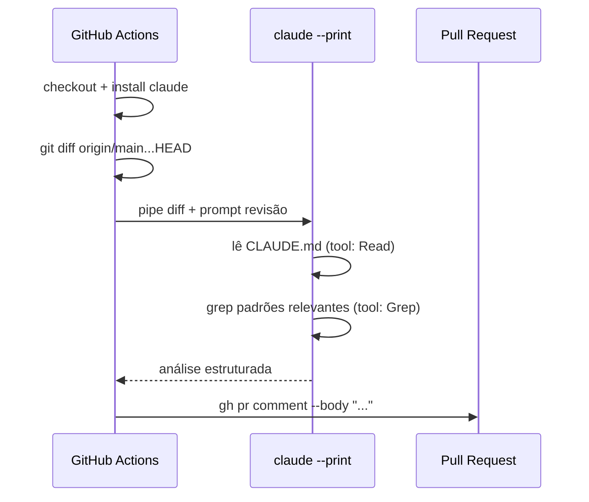

# CI/CD com GitHub Actions

> [!abstract] TL;DR
> Claude Code em GitHub Actions significa rodar `claude --print` como step de um workflow — a mesma CLI que você usa localmente, mas invocada de forma headless num runner. Os casos de uso mais comuns são review automático em PRs, geração de changelog, verificação de convenções, e análise de cobertura. A configuração mínima é: API key como secret, `claude` instalado no runner, `--no-permission-prompts` para execução autônoma.

## A analogia do assistente de plantão

Um time de desenvolvimento tem convenções, checklists e boas práticas — mas revisar manualmente cada PR para garantir que as regras foram seguidas é um trabalho que escala mal. É o tipo de trabalho repetitivo que consome energia mas não agrega valor criativo.

GitHub Actions com Claude Code é como ter um assistente de plantão que lê cada PR automaticamente: verifica bugs, checa convenções, analisa cobertura — e posta o relatório como comentário antes mesmo do primeiro revisor humano olhar. O revisor humano começa onde o assistente terminou.

> [!question] Por que não usar uma lint rule ou uma action específica?
> Regras de lint são determinísticas: verificam padrões fixos. Claude Code entende contexto: sabe a diferença entre "esse hardcode é aceitável aqui" e "isso deveria vir de configuração". Para regras que exigem julgamento — convenções de domínio, anti-padrões específicos do projeto, coerência arquitetural — o LLM supera o lint.

## Arquitetura de um workflow com Claude Code



## Configuração mínima

Todo workflow com Claude Code precisa de:
1. `ANTHROPIC_API_KEY` como secret do repositório (`Settings → Secrets and variables → Actions`)
2. `claude` instalado no step
3. `--no-permission-prompts` para execução sem TTY

```yaml
# .github/workflows/claude-review.yml
name: Claude Code Review

on:
  pull_request:
    types: [opened, synchronize]

jobs:
  review:
    runs-on: ubuntu-latest
    permissions:
      pull-requests: write   # para postar comentários
      contents: read         # para ler o código

    steps:
      - uses: actions/checkout@v4
        with:
          fetch-depth: 0   # necessário para git diff completo

      - name: Install Claude Code
        run: npm install -g @anthropic-ai/claude-code

      - name: Run review
        id: review
        env:
          ANTHROPIC_API_KEY: ${{ secrets.ANTHROPIC_API_KEY }}
        run: |
          DIFF=$(git diff origin/${{ github.base_ref }}...HEAD)
          REVIEW=$(echo "$DIFF" | claude --print \
            --no-permission-prompts \
            --allowedTools "Read,Grep" \
            --max-turns 8 \
            "Analise este diff. Identifique: bugs potenciais, problemas de segurança, e violações das convenções do projeto (ver CLAUDE.md). Máximo 10 itens, seja conciso.")
          {
            echo 'REVIEW<<EOF'
            echo "$REVIEW"
            echo 'EOF'
          } >> "$GITHUB_OUTPUT"

      - name: Post review comment
        uses: actions/github-script@v7
        with:
          script: |
            github.rest.issues.createComment({
              issue_number: context.issue.number,
              owner: context.repo.owner,
              repo: context.repo.repo,
              body: `## Análise automática Claude Code\n\n${{ steps.review.outputs.REVIEW }}`
            })
```

> [!warning] `fetch-depth: 0` é obrigatório
> Por padrão, `actions/checkout` clona apenas o commit mais recente (shallow clone). Para que `git diff origin/main...HEAD` funcione, você precisa do histórico completo: `fetch-depth: 0`.

## Action oficial da Anthropic

A Anthropic mantém uma GitHub Action que simplifica a integração e expõe opções adicionais:

```yaml
- uses: anthropics/claude-code-action@v1
  with:
    anthropic-api-key: ${{ secrets.ANTHROPIC_API_KEY }}
    prompt: "Analise este PR e identifique regressões potenciais"
    allowed-tools: "Read,Grep"
    max-turns: "10"
```

A action cuida de instalar o Claude Code, configurar o ambiente, e capturar o output. Internamente, é um wrapper sobre `claude --print` com a mesma semântica — ver [[03-Dominios/Tecnologia/IA/Claude Code/Time e Automação/01 - Headless mode|headless mode]] para entender os parâmetros.

## Casos de uso em CI/CD

### Review automático de PR

O caso mais comum: a cada PR aberto ou atualizado, o agente analisa o diff e posta um relatório estruturado.

```yaml
steps:
  - name: Claude PR Review
    env:
      ANTHROPIC_API_KEY: ${{ secrets.ANTHROPIC_API_KEY }}
      GH_TOKEN: ${{ secrets.GITHUB_TOKEN }}
    run: |
      git diff origin/${{ github.base_ref }}...HEAD > /tmp/pr.diff

      # Filtra só arquivos de código (sem lock files, assets, etc.)
      RELEVANT_FILES=$(git diff --name-only origin/${{ github.base_ref }}...HEAD \
        | grep -E '\.(ts|tsx|py|go|java|rs)$' | head -20)

      REVIEW=$(claude --print \
        --no-permission-prompts \
        --allowedTools "Read,Grep" \
        --max-turns 10 \
        "Analise o diff em /tmp/pr.diff, focando nos arquivos: $RELEVANT_FILES.
        Formato de saída:
        ## Bugs potenciais
        ## Problemas de segurança
        ## Convenções violadas
        ## Pontos positivos")

      gh pr comment ${{ github.event.number }} \
        --body "## Análise Claude Code$(echo)\n\n$REVIEW"
```

### Geração de changelog

Quando uma tag é criada, gera automaticamente o changelog a partir dos commits:

```yaml
on:
  push:
    tags: ['v*']

jobs:
  changelog:
    runs-on: ubuntu-latest
    steps:
      - uses: actions/checkout@v4
        with:
          fetch-depth: 0

      - name: Generate changelog
        env:
          ANTHROPIC_API_KEY: ${{ secrets.ANTHROPIC_API_KEY }}
        run: |
          PREV_TAG=$(git describe --tags --abbrev=0 HEAD^ 2>/dev/null || echo "")
          if [ -n "$PREV_TAG" ]; then
            COMMITS=$(git log ${PREV_TAG}..HEAD --oneline --no-merges)
          else
            COMMITS=$(git log --oneline --no-merges | head -50)
          fi

          CHANGELOG=$(echo "$COMMITS" | claude --print \
            --no-permission-prompts \
            --allowedTools "" \
            "Transforme estes commits em um changelog para a versão ${{ github.ref_name }}.
            Categorias: Features, Bug Fixes, Breaking Changes, Internal.
            Formato markdown. Tom neutro e técnico.")

          echo "## ${{ github.ref_name }}" > CHANGELOG_LATEST.md
          echo "$CHANGELOG" >> CHANGELOG_LATEST.md

      - name: Create GitHub Release
        uses: actions/github-script@v7
        with:
          script: |
            const fs = require('fs');
            const changelog = fs.readFileSync('CHANGELOG_LATEST.md', 'utf8');
            github.rest.repos.createRelease({
              owner: context.repo.owner,
              repo: context.repo.repo,
              tag_name: context.ref.replace('refs/tags/', ''),
              name: context.ref.replace('refs/tags/', ''),
              body: changelog,
              draft: false
            });
```

### Verificação de convenções

Verifica se os arquivos modificados seguem as convenções do projeto — útil quando as convenções são complexas demais para lint:

```yaml
steps:
  - name: Check conventions
    env:
      ANTHROPIC_API_KEY: ${{ secrets.ANTHROPIC_API_KEY }}
    run: |
      FILES=$(git diff --name-only origin/${{ github.base_ref }}...HEAD \
        | grep '\.ts$' | head -10)

      FAILED=0
      for file in $FILES; do
        RESULT=$(claude --print \
          --allowedTools "Read" \
          --max-turns 3 \
          --no-permission-prompts \
          "Verifique se '$file' segue as convenções do projeto descritas em CLAUDE.md.
          Responda apenas: PASS ou FAIL: <motivo específico em uma linha>")

        if echo "$RESULT" | grep -q "^FAIL"; then
          MOTIVO=$(echo "$RESULT" | sed 's/^FAIL: //')
          echo "::error file=${file}::${MOTIVO}"
          FAILED=1
        else
          echo "✓ $file"
        fi
      done

      exit $FAILED
```

### Análise de cobertura

Após rodar os testes, o agente identifica onde a cobertura está baixa e sugere os testes mais importantes:

```yaml
steps:
  - name: Run tests with coverage
    run: npm run test:coverage -- --json --outputFile=coverage/report.json

  - name: Analyze coverage gaps
    env:
      ANTHROPIC_API_KEY: ${{ secrets.ANTHROPIC_API_KEY }}
    run: |
      claude --print \
        --allowedTools "Read" \
        --max-turns 5 \
        --no-permission-prompts \
        "Analise coverage/report.json e identifique os 5 módulos com menor
        cobertura de linha. Para cada um, liste os 2-3 casos de teste mais
        críticos que estão faltando. Seja específico: mencione as funções,
        não apenas os arquivos." \
        | tee coverage-analysis.txt

      # Adicionar ao sumário do job
      echo "## Análise de Cobertura" >> $GITHUB_STEP_SUMMARY
      cat coverage-analysis.txt >> $GITHUB_STEP_SUMMARY
```



## Controle de permissões no CI

Em CI, sempre use `--allowedTools` para restringir o que o agente pode fazer:

| Caso de uso | Tools necessárias | Justificativa |
|---|---|---|
| Review de diff | Nenhuma (stdin) | O diff já está no prompt |
| Análise de código | `Read,Grep` | Lê contexto sem modificar |
| Verificação de convenções | `Read` | Lê CLAUDE.md e o arquivo |
| Geração de docs | `Read,Write` | Precisa criar o arquivo |
| Análise de cobertura | `Read` | Lê o JSON de coverage |
| Testes automatizados | `Read,Bash` | Executa testes |

> [!warning] Acesso irrestrito em CI é risco real
> Sem `--allowedTools`, o agente tem acesso a todas as tools incluindo `Bash`. Em um runner com acesso ao repositório completo, um prompt mal construído (ou injeção de prompt no código analisado) pode modificar arquivos ou executar comandos arbitrários. Sempre explicite as tools permitidas.

## Limitando custo e tempo

```yaml
- name: Claude analysis
  timeout-minutes: 5           # timeout do step no Actions
  env:
    ANTHROPIC_API_KEY: ${{ secrets.ANTHROPIC_API_KEY }}
  run: |
    claude --print \
      --max-turns 8 \          # limita tool calls
      --no-permission-prompts \
      "..."
```

Estratégias para controlar custo em CI:

```yaml
# Condicional: só rodar em PRs maiores que X linhas
- name: Check PR size
  id: check-size
  run: |
    LINES=$(git diff origin/${{ github.base_ref }}...HEAD --stat | tail -1 | grep -oE '[0-9]+ insertion' | grep -oE '[0-9]+' || echo 0)
    echo "lines=$LINES" >> $GITHUB_OUTPUT

- name: Claude review (only for PRs > 50 lines)
  if: ${{ steps.check-size.outputs.lines > 50 }}
  env:
    ANTHROPIC_API_KEY: ${{ secrets.ANTHROPIC_API_KEY }}
  run: |
    claude --print --max-turns 8 --no-permission-prompts ...
```

## Boas práticas de prompt em CI

**Prompt com formato de saída estruturado**
O output do agente vai para um comentário no PR — estruture o prompt para que a saída seja legível:

```yaml
run: |
  claude --print \
    "Analise este diff. Responda exatamente neste formato markdown:

    ## Bugs potenciais
    - [item ou 'Nenhum']

    ## Segurança
    - [item ou 'Nenhum']

    ## Convenções
    - [item ou 'Nenhum']"
```

**Contexto do projeto via CLAUDE.md**
Se o repositório tem um `CLAUDE.md` com convenções, inclua uma instrução para o agente ler:

```yaml
run: |
  claude --print \
    --allowedTools "Read" \
    "Primeiro leia o CLAUDE.md para entender as convenções do projeto.
    Depois analise o diff em /tmp/pr.diff e identifique violações."
```

**Filtragem antes do prompt**
Diffs de PRs grandes excedem o contexto. Filtre antes:

```yaml
run: |
  # Só arquivos de código, sem os 20 maiores (provavelmente gerados)
  git diff origin/${{ github.base_ref }}...HEAD -- \
    '*.ts' '*.py' '*.go' ':!*.generated.*' ':!vendor/' \
    | head -c 50000 > /tmp/filtered.diff

  cat /tmp/filtered.diff | claude --print ...
```

## Armadilhas

**API key exposta em logs**
Nunca use `set -x` em um step que tenha `ANTHROPIC_API_KEY` no ambiente — imprime variáveis de ambiente nos logs públicos do Actions.

**Shallow clone quebrando git diff**
`fetch-depth: 1` (padrão) cria um clone raso. `git diff origin/main...HEAD` precisa do histórico completo. Use `fetch-depth: 0`.

**Diff muito grande para o contexto**
PRs com centenas de arquivos ou gerados automaticamente excedem o contexto. Filtre para arquivos relevantes antes de passar para o agente.

**Custo surpresa com muitos PRs**
Em repositórios com dezenas de PRs por dia, o custo de cada análise se acumula. Adicione condicionais (tamanho mínimo do PR, branches específicas, opt-in via label) para controlar quando o análise roda.

**`--allowedTools ""` vs ausência de `--allowedTools`**
`--allowedTools ""` explicitamente bloqueia todas as tools (o agente só pode usar o que está no contexto inicial). Sem a flag, todas as tools estão disponíveis. Para análise pura de texto, use `""`.

## Como explicar em inglês

**"Running Claude Code in CI"** — using `claude --print` as a step in a GitHub Actions workflow: the agent receives a diff or code via stdin, runs its analysis with restricted tools (`--allowedTools "Read,Grep"`), and outputs a review that gets posted as a PR comment.

**The key setup:**
- "`ANTHROPIC_API_KEY` as a repository secret, then `npm install -g @anthropic-ai/claude-code` in the runner."
- "`--no-permission-prompts` is mandatory in CI — without it, the agent pauses waiting for confirmation and the job times out."
- "We always use `--allowedTools` to restrict what the agent can do — even with `--no-permission-prompts`, you want defense in depth."

**Common questions:**
- *"Isn't this expensive to run on every PR?"* — We add a size threshold: PRs smaller than 50 changed lines skip the analysis. And `--max-turns 8` caps token usage per invocation.
- *"How do you prevent prompt injection from malicious code in the PR?"* — We restrict to `--allowedTools "Read,Grep"` so the agent can't execute code, and we filter the diff before sending it. Structural defense, not relying on the model to refuse.

## Referências

- [[03-Dominios/Tecnologia/IA/Claude Code/Time e Automação/01 - Headless mode|01 - Headless mode]] — flags e comportamento do `claude --print`
- [[03-Dominios/Tecnologia/IA/Claude Code/Time e Automação/03 - Dispatch via claude -p|03 - Dispatch via `claude -p`]] — padrões avançados de invocação
- [[03-Dominios/Tecnologia/IA/Claude Code/Time e Automação/05 - Controle de custo|05 - Controle de custo]] — monitorar gasto em automações
- [[03-Dominios/Tecnologia/IA/Claude Code/Hooks e Guardrails/05 - Guardrails|05 - Guardrails]] — guardrails para headless seguro
- [[03-Dominios/Tecnologia/IA/Claude Code/Time e Automação/index|Time e Automação]] — índice do galho
- [[03-Dominios/Tecnologia/IA/Claude Code/index|Claude Code]] — tronco da trilha
