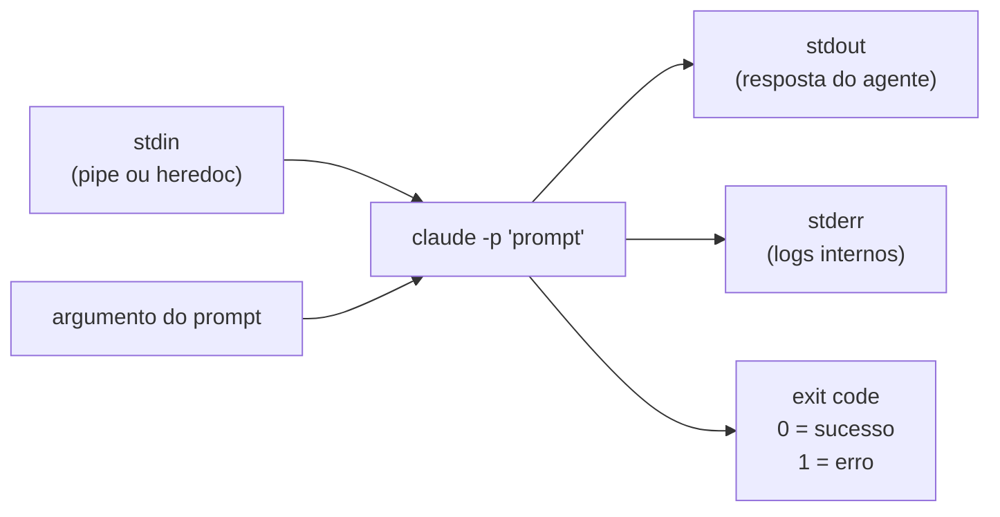
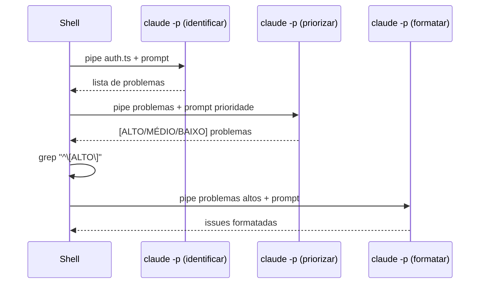

# Dispatch via `claude -p` — casos de uso e padrões

> [!abstract] TL;DR
> `claude -p` (ou `claude --print`) é a interface de dispatch: um processo externo invoca o agente com um prompt, captura o output, e age sobre ele. Trate `claude -p` como qualquer outro processo CLI que lê stdin, escreve stdout, e retorna exit code. Desse ponto de vista, o agente é uma função: entrada de texto, saída de texto, estado isolado por invocação.

## A analogia da função de linha de comando

Pense em `jq`, `awk`, ou `sed` — ferramentas que recebem texto, processam, e devolvem texto transformado. São funções puras da perspectiva do shell: mesma entrada, mesma saída; sem estado entre invocações.

`claude -p` é uma função não-determinística da mesma família. Você passa texto (código, logs, diff, JSON), recebe texto transformado (análise, resumo, JSON estruturado), e o processo sai. O estado da sessão não persiste entre invocações diferentes.

Essa perspectiva clarifica quando usar: sempre que você precisaria de um `jq` capaz de raciocinar, não apenas parsear.

> [!tip] Vídeo — Building headless automation with Claude Code
> A série oficial *Code w/ Claude* tem um episódio dedicado a montar automação headless com `claude -p`, cobrindo os mesmos padrões desta nota (invocação via stdin/argumento, captura de stdout, exit code) na prática: [Building headless automation with Claude Code](https://www.youtube.com/watch?v=dRsjO-88nBs).

> [!question] Quando `claude -p` e quando a API?
> `claude -p` é o atalho sem código: zero setup, zero SDK. A API dá controle total sobre o loop de tool calls, estado entre turnos, e schemas tipados — mas exige código. Para scripts de shell e CI/CD, `claude -p` é suficiente e muito mais simples.

## O padrão básico de dispatch

```bash
# Invocação direta com argumento
RESPOSTA=$(claude -p "Qual é o padrão arquitetural usado neste projeto?")

# Contexto via pipe
cat src/auth.ts | claude -p "Identifique problemas de segurança neste arquivo"

# Arquivo de prompt (separa instrução do prompt)
claude -p "$(cat prompts/analise-seguranca.txt)"

# Combinando contexto e instrução
claude -p "$(cat prompts/instrucao.txt)

CÓDIGO PARA ANALISAR:
$(cat src/main.ts)"

# Stdin explícito via heredoc
claude -p << 'EOF'
Analise o seguinte código e identifique code smells:

$(cat src/payments.ts)
EOF
```



## Casos de uso práticos

### Script de manutenção — triagem de TODOs

```bash
#!/usr/bin/env bash
# scripts/triage-todos.sh — identifica TODOs críticos para criar como issues

set -euo pipefail

TODOS=$(grep -rn "TODO\|FIXME\|HACK" src/ --include="*.ts" 2>/dev/null || true)

if [ -z "$TODOS" ]; then
  echo "Nenhum TODO encontrado"
  exit 0
fi

echo "Encontrados $(echo "$TODOS" | wc -l) TODOs. Triando com Claude Code..."

ANALISE=$(echo "$TODOS" | claude -p \
  --max-turns 2 \
  --allowedTools "" \
  --no-permission-prompts \
  "Analise estes TODOs e identifique os 3 mais críticos para estabilidade do sistema.
  Para cada um, retorne exatamente no formato:
  CRÍTICO: <arquivo>:<linha> — <por que é crítico em uma linha>")

echo "$ANALISE"
```

### Hook de commit inteligente

Um `commit-msg` hook que valida mensagens antes de commitar:

```bash
#!/usr/bin/env bash
# .git/hooks/commit-msg

MENSAGEM=$(cat "$1")

# Pula merge commits e amends automáticos
if echo "$MENSAGEM" | grep -qE "^Merge|^Revert"; then
  exit 0
fi

RESULTADO=$(claude -p \
  --max-turns 1 \
  --allowedTools "" \
  --no-permission-prompts \
  "A mensagem de commit abaixo segue Conventional Commits?
  (feat/fix/docs/style/refactor/test/chore seguido de escopo opcional e descrição)
  Se sim: OK
  Se não: PROBLEMA: <explicação em uma linha>

  Mensagem: $MENSAGEM")

if echo "$RESULTADO" | grep -q "^PROBLEMA"; then
  MOTIVO=$(echo "$RESULTADO" | sed 's/^PROBLEMA: //')
  echo "❌ Commit rejeitado: $MOTIVO" >&2
  echo "Formato esperado: feat(scope): descrição" >&2
  exit 1
fi

echo "✓ Mensagem de commit válida"
```

> [!warning] Latência em hooks
> Cada invocação de `claude -p` faz uma chamada de API — adiciona 2-10 segundos ao commit. Para hooks que rodam frequentemente, avalie se o benefício justifica a latência.

### Análise incremental de logs

```bash
#!/usr/bin/env bash
# scripts/analyze-errors.sh — analisa erros novos desde o último check

CHECKPOINT=".last-error-check"
ULTIMA=$(cat "$CHECKPOINT" 2>/dev/null || date -d "1 hour ago" "+%Y-%m-%d %H:%M:%S")

# Coleta erros novos (adaptar para seu stack de logging)
ERROS=$(journalctl -u meu-servico --since "$ULTIMA" -p err --no-pager 2>/dev/null || true)

if [ -z "$ERROS" ]; then
  echo "Sem novos erros desde $ULTIMA"
  date "+%Y-%m-%d %H:%M:%S" > "$CHECKPOINT"
  exit 0
fi

CONTAGEM=$(echo "$ERROS" | wc -l)
echo "Analisando $CONTAGEM linhas de erro com Claude Code..."

ANALISE=$(echo "$ERROS" | claude -p \
  --max-turns 3 \
  --allowedTools "" \
  --no-permission-prompts \
  "Estes são erros de produção do período recente.
  Identifique:
  1. Padrões recorrentes (erros que aparecem múltiplas vezes)
  2. Erros novos que não parecem relacionados a bugs conhecidos
  3. Urgência geral: BAIXA/MÉDIA/ALTA
  Seja conciso — máximo 10 linhas.")

echo "$ANALISE"

# Notificar se urgência alta
if echo "$ANALISE" | grep -q "ALTA"; then
  # Integrar com Slack/PagerDuty/etc
  echo "ALERTA: Urgência alta detectada — verificar imediatamente"
fi

date "+%Y-%m-%d %H:%M:%S" > "$CHECKPOINT"
```

### Gerador de mensagens de commit

```bash
#!/usr/bin/env bash
# scripts/commit-msg-gen.sh — sugere mensagem de commit baseada no diff

DIFF=$(git diff --cached)

if [ -z "$DIFF" ]; then
  echo "Nenhum arquivo staged. Use 'git add' primeiro."
  exit 1
fi

SUGESTAO=$(echo "$DIFF" | claude -p \
  --max-turns 2 \
  --allowedTools "" \
  --no-permission-prompts \
  "Baseado neste git diff, sugira uma mensagem de commit no formato Conventional Commits.
  Retorne apenas a mensagem, sem explicação.
  Exemplos de formato: 'feat(auth): add JWT refresh token support'
  'fix(orders): prevent duplicate order creation on retry'")

echo "Sugestão: $SUGESTAO"
echo ""
read -rp "Usar esta mensagem? (s/n/editar): " OPCAO

case "$OPCAO" in
  s|S) git commit -m "$SUGESTAO" ;;
  n|N) echo "Commit cancelado" ;;
  e|E) git commit -m "$SUGESTAO" -e ;;  # Abre editor com a sugestão
esac
```

## Padrões de orquestração

### Sequencial com contexto acumulado

O output de cada passo vira o input do próximo — o agente "pensa" em etapas:

```bash
# Etapa 1: identificar problemas
PROBLEMAS=$(cat src/auth.ts | claude -p \
  --max-turns 3 --allowedTools "" \
  "Liste os problemas de segurança encontrados. Um por linha, sem ordenação.")

# Etapa 2: priorizar (usa output da etapa anterior como contexto)
PRIORIZADOS=$(echo "$PROBLEMAS" | claude -p \
  --max-turns 2 --allowedTools "" \
  "Priorize estes problemas por risco para o negócio.
  Formato: [ALTO/MÉDIO/BAIXO] <problema>")

# Etapa 3: gerar issues (usa output da etapa anterior)
echo "$PRIORIZADOS" | grep "^\[ALTO\]" | claude -p \
  --max-turns 3 --allowedTools "" \
  "Para cada problema ALTO, gere uma issue no formato GitHub:
  ## [título]
  **Descrição**: ...
  **Impacto**: ...
  **Reprodução**: ..." \
  > /tmp/security-issues.md

echo "Issues geradas em /tmp/security-issues.md"
```



### Fan-out — análise paralela de múltiplos arquivos

```bash
#!/usr/bin/env bash
# Analisa cada arquivo em paralelo, consolida ao final

ARQUIVOS=$(git diff --name-only origin/main...HEAD | grep '\.ts$' | head -10)
TMPDIR=$(mktemp -d)
trap 'rm -rf "$TMPDIR"' EXIT

echo "Analisando ${#ARQUIVOS[@]} arquivos em paralelo..."

# Fan-out: dispara um agente por arquivo em background
for arquivo in $ARQUIVOS; do
  (
    ANALISE=$(cat "$arquivo" | claude -p \
      --max-turns 3 \
      --allowedTools "" \
      --no-permission-prompts \
      "Identifique problemas neste arquivo. Formato: [ARQUIVO:LINHA] problema")
    echo "=== $arquivo ===" > "$TMPDIR/${arquivo//\//_}.txt"
    echo "$ANALISE" >> "$TMPDIR/${arquivo//\//_}.txt"
  ) &
done

wait  # Aguarda todos os subshells

# Agregação: consolida todos os resultados num sumário
TODOS=$(cat "$TMPDIR"/*.txt 2>/dev/null)
echo "$TODOS" | claude -p \
  --max-turns 2 \
  --allowedTools "" \
  --no-permission-prompts \
  "Estes são os problemas encontrados em cada arquivo. Gere um sumário executivo:
  - Risco total (BAIXO/MÉDIO/ALTO)
  - 3 problemas mais críticos (arquivo:linha + por quê)
  - Ação imediata recomendada"
```

### Gate de qualidade — fail rápido

```bash
#!/usr/bin/env bash
# Bloqueia o pipeline se qualidade abaixo do limiar

DIFF=$(git diff origin/main...HEAD)

AVALIACAO=$(echo "$DIFF" | claude -p \
  --max-turns 5 \
  --allowedTools "Read" \
  --no-permission-prompts \
  --output-format json \
  "Avalie a qualidade deste diff. Retorne JSON:
  {
    'score': <0-10>,
    'has_tests': <boolean>,
    'has_security_issues': <boolean>,
    'blockers': ['<lista de problemas bloqueadores>']
  }")

SCORE=$(echo "$AVALIACAO" | jq -r '.result' | python3 -c "import json,sys; d=json.load(sys.stdin); print(d['score'])" 2>/dev/null || echo 0)
HAS_SECURITY=$(echo "$AVALIACAO" | jq -r '.result' | python3 -c "import json,sys; d=json.load(sys.stdin); print(str(d['has_security_issues']).lower())" 2>/dev/null || echo true)

if [ "$HAS_SECURITY" = "true" ] || [ "$SCORE" -lt 6 ]; then
  echo "❌ Gate de qualidade falhou (score: $SCORE, security: $HAS_SECURITY)"
  echo "$AVALIACAO" | jq -r '.result.blockers[]' 2>/dev/null
  exit 1
fi

echo "✓ Gate de qualidade passou (score: $SCORE)"
```

## Controle de saída

### JSON para parsing confiável

```bash
RESULTADO=$(claude -p \
  --output-format json \
  --max-turns 5 \
  "Analise src/auth.ts e retorne JSON com:
  has_issues: boolean
  issues: array de {line: number, severity: 'low'|'medium'|'high', description: string}")

# O resultado está em .result (que contém JSON como string)
RESPOSTA=$(echo "$RESULTADO" | jq -r '.result')

# Verificar se tem issues altas
echo "$RESPOSTA" | python3 -c "
import json, sys
data = json.load(sys.stdin)
high = [i for i in data.get('issues', []) if i.get('severity') == 'high']
if high:
    print('Issues críticas:')
    for i in high:
        print(f'  linha {i[\"line\"]}: {i[\"description\"]}')
    exit(1)
print('Nenhuma issue crítica')
"
```

### Texto para consumo humano

```bash
# Review legível para comentário em PR ou Slack
REVIEW=$(git diff origin/main...HEAD | claude -p \
  --output-format text \
  "Faça um code review focado em legibilidade e manutenibilidade.
  Tom: construtivo, direto. Máximo 5 itens.")
```

## Timeout e retry

```bash
# Timeout explícito (processo morre após 60s)
RESULTADO=$(timeout 60 claude -p --max-turns 5 "..." || {
  echo "TIMEOUT: agente não completou em 60s" >&2
  exit 1
})

# Retry com backoff exponencial
MAX_TENTATIVAS=3
for tentativa in $(seq 1 $MAX_TENTATIVAS); do
  RESULTADO=$(claude -p --max-turns 5 "..." 2>/dev/null) && break
  EXIT=$?
  if [ $tentativa -eq $MAX_TENTATIVAS ]; then
    echo "Falhou após $MAX_TENTATIVAS tentativas (último código: $EXIT)" >&2
    exit $EXIT
  fi
  WAIT=$((tentativa * tentativa * 5))  # 5s, 20s, 45s
  echo "Tentativa $tentativa falhou, aguardando ${WAIT}s..."
  sleep $WAIT
done
```

## Armadilhas

> [!warning] Newlines perdidas no argumento
> Strings com quebras de linha em `"..."` podem ser interpretadas de forma inesperada pelo shell. Use heredoc para prompts multilinhas:
>
> ```bash
> # Problemático: \n como literal
> claude -p "linha 1\nlinha 2"
>
> # Correto: heredoc preserva quebras de linha
> claude -p << 'EOF'
> linha 1
> linha 2
> EOF
> ```

> [!warning] Stderr misturado no resultado
> `$(claude -p ...)` captura apenas stdout. Erros e logs internos vão para stderr. Para logar separadamente:
>
> ```bash
> RESULTADO=$(claude -p "..." 2>/tmp/claude-err.txt)
> if [ $? -ne 0 ]; then
>   echo "Erro:" >&2
>   cat /tmp/claude-err.txt >&2
> fi
> ```

> [!warning] Contexto grande demais em loop
> Em loops sobre dezenas de arquivos grandes, cada chamada pode exceder o limite de contexto. Adicione verificação de tamanho:
>
> ```bash
> for arquivo in $ARQUIVOS; do
>   TAMANHO=$(wc -c < "$arquivo")
>   if [ "$TAMANHO" -gt 50000 ]; then
>     echo "Arquivo $arquivo muito grande ($TAMANHO bytes) — pulando"
>     continue
>   fi
>   cat "$arquivo" | claude -p "..."
> done
> ```

> [!warning] Paralelismo sem controle de concorrência
> Disparar dezenas de `claude -p` em background simultâneo pode saturar rate limits da API. Limite a concorrência:
>
> ```bash
> # Máximo N processos em paralelo via xargs
> printf '%s\n' "${ARQUIVOS[@]}" | xargs -P 4 -I{} sh -c \
>   'cat {} | claude -p --max-turns 3 "Analise este arquivo"'
> ```

## Como explicar em inglês

**"Dispatching via `claude -p`"** — treating Claude Code as a Unix-style process: input via args or stdin, output to stdout, exit code signals success or failure. The mental model is a non-deterministic `jq`: it transforms text by reasoning, not by parsing.

**The key patterns:**
- "Sequential chaining: the output of one agent becomes the input of the next. Each step narrows the problem — identify, then prioritize, then format."
- "Fan-out: one agent per file in parallel, then an aggregator agent that summarizes all findings."
- "Quality gate: the agent returns a JSON score; the script exits 1 if the score is below threshold, blocking the pipeline."

**Common questions:**
- *"How do you handle non-determinism in scripts?"* — For binary decisions (PASS/FAIL), we structure the prompt so the agent outputs a known format and we grep for it. For analysis tasks, non-determinism is fine — we want nuanced output.
- *"What's the difference between dispatching in bash vs using the Agent SDK?"* — Bash dispatch has no persistent state between calls and no structured output typing. For simple linear pipelines, bash is enough. For parallel agents that share context or need typed schemas, use the SDK.

**Vocabulário PT↔EN:**

| PT | EN | Uso na frase |
| --- | --- | --- |
| Despacho (invocar o agente de fora) | Dispatch | "We dispatch Claude Code from a cron job." |
| Ramificação em paralelo | Fan-out | "Fan-out: one agent per file in parallel." |
| Modo sem interface (não-interativo) | Headless | "Headless mode lets us run Claude Code in CI." |
| Código de saída do processo | Exit code | "Exit code 0 signals success; non-zero blocks the pipeline." |

## O que vem a seguir

Dominar o padrão de dispatch — entrada por stdin/argumento, saída por stdout, sucesso ou falha pelo exit code — resolve a mecânica de "como chamar o agente". A próxima pergunta é "como o agente sabe se comportar direito quando chamado de fora do terminal interativo", já que não há sessão nem histórico de conversa pra carregar contexto de projeto. É aí que entra o arquivo de instruções que todo dispatch headless lê antes do primeiro turno: veja [[03-Dominios/Tecnologia/IA/Claude Code/Time e Automação/04 - CLAUDE.md compartilhado|04 - CLAUDE.md compartilhado]].

## Fontes

- [Claude Code CLI reference](https://docs.anthropic.com/en/docs/claude-code/cli-reference) — flags oficiais de `claude -p`/`--print`, incluindo `--output-format`, `--max-turns` e `--allowedTools`.
- [Claude Code headless mode / SDK overview](https://docs.anthropic.com/en/docs/claude-code/sdk) — documentação oficial da Anthropic sobre uso não-interativo (`-p`) e integração em scripts/CI.

## Referências

- [[03-Dominios/Tecnologia/IA/Claude Code/Time e Automação/01 - Headless mode|01 - Headless mode]] — flags e opções de `claude --print`
- [[03-Dominios/Tecnologia/IA/Claude Code/Time e Automação/02 - CI-CD com GitHub Actions|02 - CI/CD com GitHub Actions]] — dispatch em pipelines de CI
- [[03-Dominios/Tecnologia/IA/Claude Code/Time e Automação/05 - Controle de custo|05 - Controle de custo]] — cada invocação consome tokens
- [[03-Dominios/Tecnologia/IA/Claude Code/Time e Automação/index|Time e Automação]] — índice do galho
- [[03-Dominios/Tecnologia/IA/Claude Code/index|Claude Code]] — tronco da trilha
