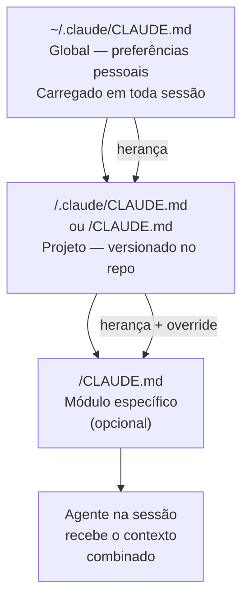
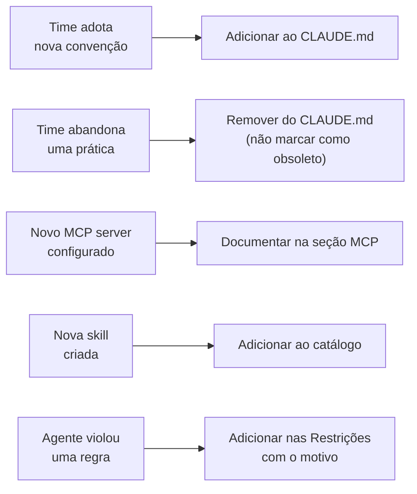
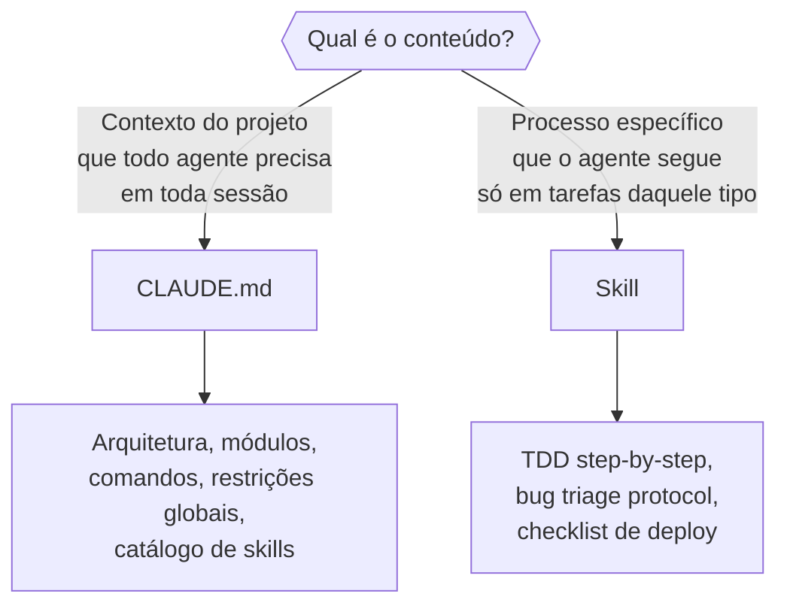

# CLAUDE.md compartilhado — o que vai no repo, o que fica local

> [!abstract] TL;DR
> CLAUDE.md no repo é contrato do projeto: diz ao agente quais são as convenções, proibições, e workflows que todo dev precisa seguir. O `~/.claude/CLAUDE.md` global é preferência pessoal — estilo individual, projetos pessoais, configurações que não fazem sentido para o time. A regra simples: se todos deveriam seguir, vai no repo. Se só você segue, fica no global.

## A analogia do manual de bordo

Todo avião tem dois tipos de documentação: o manual do modelo (como o Boeing 737 funciona em geral) e o "aircraft logbook" específico daquele avião (histórico de manutenções, particularidades, o assento da fileira 14 que trava). O piloto precisa dos dois — mas são livros separados por motivo.

CLAUDE.md funciona igual: o manual global (`~/.claude/CLAUDE.md`) documenta suas preferências pessoais de trabalho. O CLAUDE.md do repositório documenta as particularidades deste avião específico — por que `db/migrations/` nunca deve ser editado diretamente, por que `Result<T,E>` ao invés de `throw`, por que o agente deve sempre rodar `npm run check` antes de propor um commit.

Um dev novo no time clona o repositório e imediatamente tem o contexto que leva semanas acumular. O agente opera com as mesmas regras que o dev sênior interiorizou. Esse é o valor do CLAUDE.md versionado.

> [!question] Por que não colocar tudo no CLAUDE.md global?
> Se o contexto do projeto está só no seu global, outro dev que clona o repositório começa do zero. O agente dele toma decisões sem o contexto — viola convenções, usa abstrações erradas, ignora restrições críticas. O CLAUDE.md do repo garante que todo dev (humano ou agente) começa com o mesmo mapa.

## A hierarquia de CLAUDE.md

Claude Code carrega CLAUDE.md em cascata, do mais geral ao mais específico:



Cada nível herda do anterior e pode sobrescrever. Um CLAUDE.md na pasta `backend/` adiciona contexto específico ao backend sem precisar repetir o que está na raiz.

| Nível | Localização | Quando usar |
|---|---|---|
| Global | `~/.claude/CLAUDE.md` | Preferências pessoais, projetos pessoais |
| Projeto | `<repo>/CLAUDE.md` ou `<repo>/.claude/CLAUDE.md` | Convenções, restrições, skills do projeto |
| Subdiretório | `<repo>/<pasta>/CLAUDE.md` | Contexto de módulo específico (monorepo) |

## O que vai no CLAUDE.md do repo

### Contexto do projeto

O que este projeto faz, qual stack usa, e qual é o modelo mental correto para trabalhar nele:

```markdown
# API de gestão de pedidos

Serviço Node.js que gerencia o ciclo de vida de pedidos para plataforma de e-commerce.
Stack: Node 22, TypeScript, PostgreSQL (via Prisma), Redis (cache e sessões).

Nota: este serviço é downstream do `catalog-service` e upstream do `fulfillment-service`.
Não há lógica de catálogo aqui — só processamento de pedidos.
```

Essa âncora evita que o agente trate o projeto como um monólito genérico.

### Arquitetura e módulos

O mapa que o agente precisa antes de tocar o código:

```markdown
## Arquitetura

- `src/core/` — lógica de negócio pura, sem dependências externas (infra, HTTP)
- `src/api/` — controllers HTTP, validação de input, serialização de response
- `src/infra/` — banco de dados (repositories), filas, integrações externas
- `src/shared/` — tipos compartilhados e utilitários sem lógica de negócio

**Regra crítica**: `core/` não importa de `api/` ou `infra/`.
Dependência vai do externo (api/infra) para o centro (core).
Violações dessa regra são bugs de arquitetura — não commits.
```

### Comandos essenciais

Os comandos que o agente vai precisar rodar:

```markdown
## Comandos essenciais

- Desenvolvimento: `npm run dev` (porta 3000, reload automático)
- Build: `npm run build` (compila para `dist/`)
- Testes unitários: `npm test`
- Testes de integração: `npm run test:int` (requer Docker para PostgreSQL)
- Lint + typecheck: `npm run check` (rode antes de propor commits)
- Migration: `npm run db:migrate` (nunca editar arquivos em `db/migrations/` diretamente)
- Seed (dev): `npm run db:seed`
```

### Convenções do projeto

O que torna este projeto diferente de qualquer outro projeto TypeScript genérico:

```markdown
## Convenções

### Nomenclatura
- camelCase para variáveis e funções
- PascalCase para classes, tipos, e interfaces
- SCREAMING_SNAKE_CASE para constantes de configuração
- Sufixo `Repository` para repositórios, `Service` para serviços de domínio

### Erros
- Nunca `throw` direto no código de aplicação — use `Result<T, AppError>` de `src/shared/result.ts`
- Erros de infraestrutura (banco, rede) são capturados na camada `infra/` e convertidos para `AppError`

### Testes
- Testes unitários: `src/core/` — sem dependência de banco ou rede
- Testes de integração: `src/__tests__/integration/` — com banco real via testcontainers
- Convenção de nome: `<arquivo>.test.ts` para unitários, `<feature>.integration.test.ts` para integração
```

### Restrições explícitas

O que o agente nunca deve fazer — com o motivo para que respeite mesmo em edge cases:

```markdown
## Restrições

- **Nunca editar `db/migrations/` diretamente** — migrations são imutáveis após merge.
  Se precisar alterar schema, crie nova migration com `npm run db:create-migration <nome>`.

- **Nunca usar `any` no TypeScript** — se necessário por interop com lib externa,
  adicione `// eslint-disable-next-line @typescript-eslint/no-explicit-any` com comentário explicando.

- **Nunca commitar com `--no-verify`** — os hooks validam convenções. Se um hook falha,
  corrija o problema, não burle o hook.

- **Nunca apontar MCP servers para o banco de produção** — use sempre `DATABASE_DEV_URL`
  ou `DATABASE_STAGING_READONLY_URL`. O server de produção requer aprovação do tech lead.

- **Nunca mockar o repositório nos testes de integração** — testamos o stack real.
  Mocks causaram 2 incidentes em Q3/2024 onde o teste passava mas a migration quebrava prod.
```

### Catálogo de skills

```markdown
## Skills disponíveis

| Skill | Tipo | Uso |
|-------|------|-----|
| `/convencoes` | domínio | Convenções deste projeto — leia no início de cada sessão |
| `/tdd` | processo | Desenvolvimento orientado a testes (red→green→refactor) |
| `/review` | processo | Checklist completo de code review |
| `/deploy-staging` | processo | Checklist de deploy para staging |
| `/bug-triage` | processo | Investigar bug + criar issue estruturada |

**Ordem recomendada**: sempre `/convencoes` antes de qualquer skill de processo.
```

### MCP servers configurados

```markdown
## MCP servers

| Server | Ambiente | Acesso | Uso |
|--------|----------|--------|-----|
| `postgres-dev` | Desenvolvimento | Read-Write | Schema exploration, testes locais |
| `postgres-staging` | Staging | Read-Only | Verificar estado antes de deploy |
| `github` | Todos | Read-Write | Criar issues, PRs, ler requisitos |

Configuração em `.claude/settings.json` (não commitar API tokens).
```

## O que fica no `~/.claude/CLAUDE.md` global

Preferências que são suas, não do projeto — se entrassem no repo, poluiriam o contexto do time:

```markdown
# Preferências pessoais

## Estilo de resposta
- Respostas em português brasileiro
- Código com comentários mínimos — prefiro código autoexplicativo
- Sem introduções longas — vá direto ao ponto
- Quando houver dúvida entre duas abordagens, apresente as duas em uma frase e recomende uma

## Meus atalhos semânticos
- "revisa" → code review completo com /review
- "implementa" → siga TDD com /tdd
- "analisa" → leia o arquivo e explique a arquitetura antes de sugerir mudanças

## Stack preferido para projetos pessoais
- Backend: Bun + Elysia + Drizzle
- Frontend: SvelteKit + TailwindCSS
- Infra: Railway (dev), Fly.io (prod)
```

Isso não tem lugar no CLAUDE.md do repo — não é relevante para outros devs.

## CLAUDE.md por subdiretório (monorepos)

Para projetos com módulos muito diferentes:

```
repo/
  CLAUDE.md              ← contexto geral, convenções compartilhadas
  backend/
    CLAUDE.md            ← Node.js, banco, eventos, contexto de API
  frontend/
    CLAUDE.md            ← React, componentes, testes E2E, Storybook
  infra/
    CLAUDE.md            ← Terraform, GCP, convenções de IaC
```

O CLAUDE.md de `backend/` herda o contexto geral e adiciona **só** o específico — não repete o que já está na raiz:

```markdown
# Backend — contexto adicional

Este módulo usa Event Sourcing para o aggregate `Order`.
Antes de modificar qualquer handler em `src/orders/`, leia
`docs/architecture/event-sourcing.md` para entender os invariantes.

## Comandos específicos do backend
- Replay de eventos: `npm run events:replay --from=2026-01-01`
- Snapshot manual: `npm run events:snapshot --aggregate=Order`
```

## Manter o CLAUDE.md atualizado

Um CLAUDE.md desatualizado é pior do que nenhum: instrui o agente a seguir práticas que o projeto abandonou.



**Triggers para atualizar:**
- Time adotou nova convenção → adicionar imediatamente
- Prática foi abandonada → remover (não comentar nem marcar como obsoleto — texto obsoleto vira ruído)
- Novo MCP server no projeto → documentar
- Nova skill → adicionar ao catálogo
- O agente violou uma regra que deveria conhecer → documentar a regra nas Restrições com o motivo

**Ownership**: o CLAUDE.md do repo deve ter um responsável — geralmente o tech lead ou quem introduziu Claude Code no time. Sem ownership, o arquivo fica desatualizado silenciosamente.

Uma forma de garantir: adicione no template de PR um item de checklist — "O CLAUDE.md precisa ser atualizado para refletir esta mudança?". Isso leva 5 segundos por PR e evita que o arquivo fique meses desatualizado.

## Formato recomendado para CLAUDE.md de projeto

```markdown
# Nome do Projeto

[1-2 frases: o que faz, qual stack, onde está no ecossistema]

## Arquitetura

[Mapa de módulos — o que cada pasta/serviço faz, e qual a regra de dependência]

## Comandos essenciais

[Build, test, dev, migrate — com flags importantes]

## Convenções

[O que torna este projeto específico — não repita PEP8 ou Airbnb style guide]

## Restrições

[O que nunca fazer — com o motivo para cada restrição]

## Skills disponíveis

[Tabela: skill | tipo | uso]

## MCP servers

[Tabela: server | ambiente | acesso | uso]
```

**Regra de ouro para CLAUDE.md**: documente o que um engenheiro senior internalizou que um junior não sabe que não sabe. Convenções óbvias (não usar `var` em TypeScript) são ruído. Restrições não-óbvias com contexto histórico são ouro.

**Teste do estrangeiro**: imagine que alguém de outro time vai trabalhar neste projeto por uma semana, usando o agente para ajudar. O que eles precisariam saber para não quebrar nada? Esse é o conteúdo essencial do CLAUDE.md.

## Armadilhas

**Tudo no CLAUDE.md global**
Outro dev que clona o repo começa sem contexto. O CLAUDE.md precisa estar versionado com o código — é parte do projeto.

**CLAUDE.md muito longo**
Um arquivo de 500 linhas de convenções não vai ser lido completamente — o agente dilui atenção uniformemente sobre todo o conteúdo. Prefira skills para contexto extenso: o agente carrega skills sob demanda, quando pertinente. O CLAUDE.md deve ser o mapa; as skills são os detalhes.

**Restrições sem motivo**
"Nunca use X" sem explicação vira letra morta — o agente segue, mas não entende quando deve adaptar em edge cases. "Nunca use X — porque Y" dá ao agente a capacidade de julgar situações ambíguas.

**Documentar aspirações, não realidade**
Se o time aspira a 100% de cobertura mas na prática faz merge com 60%, o CLAUDE.md não deve dizer "sempre escreva testes para 100%". O agente vai criar conflito com PRs reais. Documente o que realmente acontece.

**CLAUDE.md desatualizado sem responsável**
Sem ownership definido, ninguém atualiza o arquivo quando o projeto evolui. Em 6 meses, o CLAUDE.md documenta uma arquitetura que não existe mais. Defina quem é responsável e adicione revisão do CLAUDE.md no processo de retrospectiva.

**Misturar conteúdo global e de projeto**
Preferências pessoais (idioma de resposta, estilo de código) no CLAUDE.md do repo frustram devs com preferências diferentes. O repo deve documentar o projeto, não as preferências do autor.

**Instruções contraditórias entre CLAUDE.md e skills**
Se o CLAUDE.md diz "sempre escreva testes antes do código" e uma skill de deadline diz "priorize velocidade sobre cobertura", o agente vai reconciliar de forma imprevisível. Mantenha consistência — a skill pode refinir a regra, não contradizê-la.

**Confiar que o agente vai ler sem que você instrua**
O agente carrega o CLAUDE.md automaticamente, mas para arquivos muito longos pode não prestar atenção igual a todas as seções. Coloque as restrições mais críticas no topo — não enterradas no meio do documento.

## Evolução do CLAUDE.md ao longo do tempo

Um CLAUDE.md bom não é escrito de uma vez — cresce organicamente com o projeto.

**Fase inicial (primeiros dias)**
Escreva o mínimo: contexto do projeto, comandos básicos, 2-3 restrições críticas. Um CLAUDE.md vazio é melhor do que um cheio de aspirações não-cumpridas.

**Fase de descoberta (primeiras semanas)**
A cada vez que o agente toma uma decisão que viola uma convenção do time, adicione essa convenção ao CLAUDE.md. O arquivo cresce a partir dos erros observados — e esses erros são o sinal mais confiável do que realmente precisa ser documentado.

**Fase de maturidade**
O CLAUDE.md estabiliza. A maioria dos erros comuns já está documentada. A partir daqui, o trigger principal de atualização são mudanças de arquitetura, adoção de novas ferramentas, ou renomeação de módulos.

**Sinal de que o CLAUDE.md está saudável**: um dev novo consegue fazer seu primeiro PR correto sem precisar de muito feedback de review sobre convenções — o agente que o auxiliou seguiu as mesmas regras que o time espera.

**Sinal de que o CLAUDE.md está desatualizado**: o agente frequentemente sugere padrões que o time já abandonou, referencia arquivos que foram movidos, ou usa nomes antigos de módulos. Esses sinais indicam que a realidade do código divergiu do documento — atualize imediatamente.

## CLAUDE.md vs skills: onde cada coisa vai

A decisão mais frequente: o conteúdo vai no CLAUDE.md ou numa skill?



| Critério | CLAUDE.md | Skill |
|---|---|---|
| Carregado automaticamente? | Sim — toda sessão | Não — precisa invocar `/skill` |
| Escopo | Todo o projeto | Tarefa específica |
| Tamanho ideal | < 150 linhas | < 200 linhas por skill |
| Conteúdo típico | Mapa + restrições + catálogo | Processo passo a passo |
| Se ficar longo | Extrair seções para skills | Dividir em skills menores |

O CLAUDE.md referencia as skills disponíveis — mas não repete o conteúdo das skills. É um índice, não um manual completo.

## Checklist antes de commitar o CLAUDE.md

Antes de fazer push do CLAUDE.md para o repositório:

- [ ] **Restrições têm motivo**: cada "nunca faça X" tem uma explicação do porquê
- [ ] **Comandos estão corretos**: rodei todos os comandos listados e funcionam
- [ ] **Arquitetura reflete o estado atual**: não o estado desejado, o estado real do código hoje
- [ ] **Skills listadas existem**: o catálogo só lista skills que realmente estão em `.claude/skills/`
- [ ] **MCP servers documentados**: todos os servers em `settings.json` têm entrada na tabela
- [ ] **Sem dados sensíveis**: nenhum token, URL de banco de produção, ou credencial no arquivo
- [ ] **Tamanho razoável**: menos de 200 linhas (se maior, refatorar em skills)
- [ ] **Testado com um dev novo**: peça a alguém que não conhece o projeto para fazer uma tarefa simples usando só o CLAUDE.md como contexto — o que ainda falta?
- [ ] **Restrições verificáveis**: cada restrição é algo que pode ser observado objetivamente (não "escreva código limpo", mas "nunca use `any` sem comentário explicando")

## Como explicar em inglês

**"Shared CLAUDE.md"** — a versioned context file committed to the repository. When any developer (or the AI agent) clones the project, they get the same architectural map, conventions, and restrictions immediately. The agent uses this as its operating manual for the project.

**The key distinction:**
- "The repo CLAUDE.md is a contract: architectural rules, naming conventions, what-never-to-do. Everyone on the team, including the agent, follows it."
- "The global `~/.claude/CLAUDE.md` is personal preference: response style, personal project defaults, individual shortcuts. It doesn't belong in the repo."

**Common questions:**
- *"How long should CLAUDE.md be?"* — As short as possible while covering what a senior engineer knows that a junior doesn't. If it's over 150 lines, extract sections into skills. The CLAUDE.md is the map; skills are the detail.
- *"Who keeps CLAUDE.md up to date?"* — Assign ownership explicitly — usually the tech lead or the engineer who introduced Claude Code. Otherwise it goes stale silently. A stale CLAUDE.md is worse than none.
- *"Should CLAUDE.md be in the repo root or in `.claude/`?"* — Either works. Root-level `CLAUDE.md` is more visible to humans browsing GitHub. `.claude/CLAUDE.md` keeps Claude Code config co-located. Pick one convention and stick to it — inconsistency confuses both the agent and the team.
- *"What's the relationship between CLAUDE.md and skills?"* — CLAUDE.md is loaded automatically every session; skills are loaded on demand. CLAUDE.md contains the map and the index of available skills. Skills contain the step-by-step process. Don't repeat skill content in CLAUDE.md — just list the skill name, its type, and when to invoke it.

> [!tip] Regra dos três
> Se o agente violou a mesma regra três vezes sem que ela estivesse documentada, é um bug do CLAUDE.md — não do agente. Adicione a restrição com o motivo específico.

## Referências

- [[03-Dominios/Tecnologia/IA/Claude Code/Configuração/02 - CLAUDE.md anatomia|02 - CLAUDE.md anatomia]] — estrutura detalhada e frontmatter do arquivo
- [[03-Dominios/Tecnologia/IA/Claude Code/Skills e MCP/08 - Skills em time|08 - Skills em time]] — catálogo de skills no repo
- [[03-Dominios/Tecnologia/IA/Claude Code/Time e Automação/07 - Onboarding de time|07 - Onboarding de time]] — usar CLAUDE.md no processo de onboarding
- [[03-Dominios/Tecnologia/IA/Claude Code/Time e Automação/index|Time e Automação]] — índice do galho
- [[03-Dominios/Tecnologia/IA/Claude Code/Time e Automação/06 - Segurança organizacional|06 - Segurança organizacional]] — restrições de segurança no CLAUDE.md
- [[03-Dominios/Tecnologia/IA/Claude Code/index|Claude Code]] — tronco da trilha
