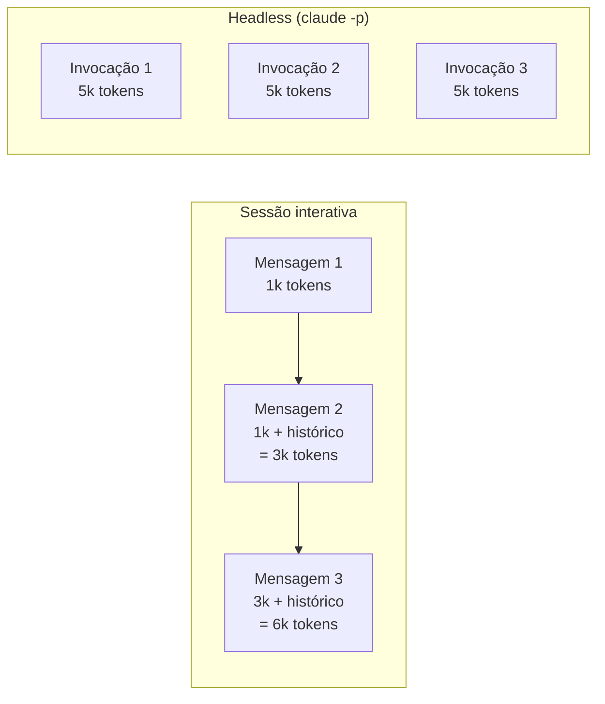
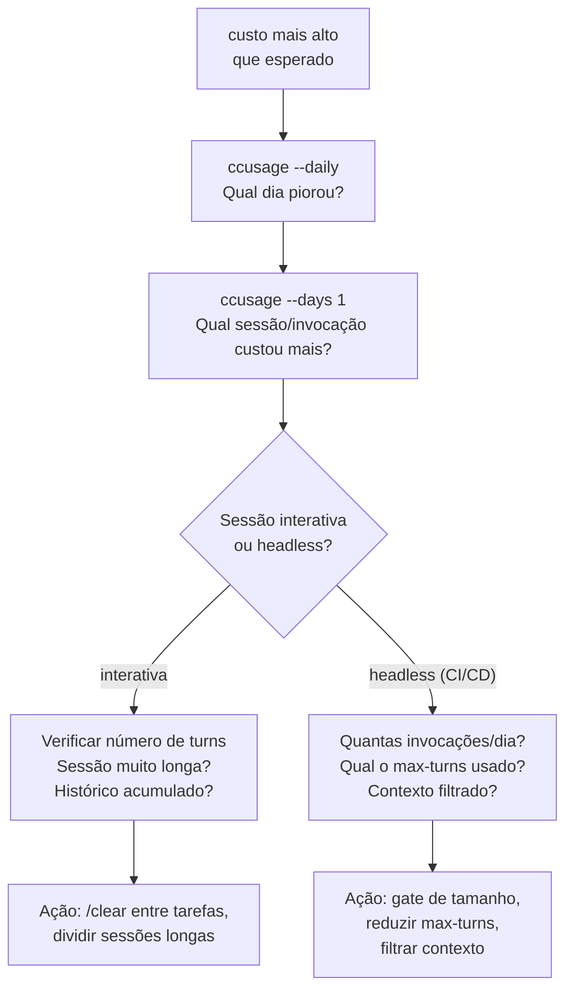
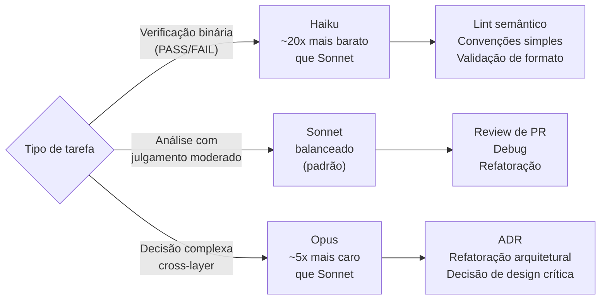

# Controle de custo — monitoramento, limites, ccusage

> [!abstract] TL;DR
> Cada invocação de Claude Code consome tokens — e tokens custam dinheiro. Sem visibilidade, o custo cresce silenciosamente. A ferramenta `ccusage` agrega uso por projeto e sessão. Para automações em CI/CD, `--max-turns` e filtros de contexto são os controles primários. Para o time, o custo por PR pode ser previsto e gerenciado com prompts e contexto bem dimensionados.

## A analogia da conta de luz

Você só percebe que deixou o ar-condicionado ligado o dia todo quando a conta de luz chega. Antes disso, nada indica que algo está errado — a temperatura estava boa, tudo funcionou bem.

Tokens funcionam igual: cada análise é invisível enquanto acontece. O custo se acumula em background — sessões longas, CI/CD rodando dezenas de vezes por dia, tool calls desnecessárias. No final do mês, a conta da Anthropic chega com um número que surpreende.

Controle de custo é sobre tornar o invisível visível antes que seja tarde. `ccusage` é o equivalente ao monitor de consumo elétrico em tempo real — você vê o que está acontecendo enquanto ainda pode agir.

> [!question] Vale a pena monitorar ou é microoptimização?
> Depende da escala. Para uso individual ocasional, o custo raramente surpreende. Para times com CI/CD rodando análises em cada PR, o custo pode escalar para centenas de dólares por mês. Monitorar custa 5 minutos por semana; não monitorar pode custar uma conversa desconfortável sobre o budget de infraestrutura.

## Como o custo se acumula



| Fonte de custo | Mecanismo | Controle |
|---|---|---|
| Sessão longa interativa | Histórico cresce com cada mensagem | `/clear` entre tarefas não relacionadas |
| Tool calls excessivas | Cada resultado de tool vai para o contexto | `--max-turns N` |
| Contexto grande | `cat` de arquivo de 1000 linhas vira 4k tokens de input | Filtrar com `grep` antes de passar |
| CI/CD sem gate | 50 PRs/dia × 20k tokens = 1M tokens/dia | Gate por tamanho de PR, branches específicas |
| Cache frio | Sem cache: paga tokens inteiros; com cache: paga só o delta | Agrupar análises, invocar dentro de 5 min |

### O efeito multiplicador do histórico

Em sessões interativas, o custo não é linear — é quadrático em relação ao número de mensagens:

```
Mensagem 1: 1.000 tokens de input
Mensagem 2: 1.000 (prompt) + 1.000 (histórico) = 2.000 tokens de input
Mensagem 3: 1.000 + 2.000 + 1.000 = 4.000 tokens de input
...
Mensagem 10: ~10x o custo da mensagem 1
```

Sessões longas em tasks grandes são onde o custo mais surpreende.

## ccusage — visualizando o consumo

`ccusage` lê os logs locais do Claude Code e agrega o uso por sessão, projeto, e período:

```bash
# Instalar
npm install -g ccusage

# Uso por sessão (últimas sessões)
ccusage

# Últimos 7 dias por sessão
ccusage --days 7

# Breakdown por dia (útil para ver picos)
ccusage --daily

# Custo total do mês corrente
ccusage --month

# Custo por projeto
ccusage --project /path/to/project

# Output JSON para processar com scripts
ccusage --json | jq '.sessions | sort_by(.cost) | reverse | .[0:5]'
```

Exemplo de saída:

```
Project: /home/user/repos/api-pedidos
Sessions: 23
Total tokens: 1,234,567 (input: 987,654, output: 246,913)
Cache hit rate: 34%
Estimated cost: $4.23

Top sessions by cost:
  2026-05-12 15:32 — $1.12 (auth refactor, 45 min, 28 turns)
  2026-05-11 09:15 — $0.87 (test coverage, 30 min, 19 turns)
  2026-05-10 14:45 — $0.65 (debug payment flow, 20 min, 14 turns)

Daily breakdown:
  2026-05-12 — $1.34
  2026-05-11 — $0.92
  2026-05-10 — $0.78
```

### Interpretando o output

**Cache hit rate > 40%**: saudável — o agente está reaproveitando contexto.

**Cache hit rate < 20%**: as sessões estão começando do zero com frequência — verifique se há `/clear` sendo chamado desnecessariamente ou se o intervalo entre invocações é muito longo para o cache de 5 minutos.

**Sessão com custo > $2**: provavelmente uma tarefa muito longa sem `/clear` no meio, ou muitas tool calls desnecessárias. Analise o número de turns — se acima de 30, a tarefa estava mal dimensionada.

## Fatores de custo e controles

### Contexto grande desnecessário

```bash
# Caro: passa o arquivo inteiro (1000 linhas = ~4k tokens de input)
cat src/auth/session.ts | claude -p "Qual função valida o token JWT?"

# Barato: passa só o relevante
grep -n "jwt\|validate\|token\|verify" src/auth/session.ts | \
  claude -p "Qual função valida o token JWT?"

# Ainda melhor: informa o contexto pelo nome, pede ao agente que leia o necessário
claude -p --allowedTools "Read,Grep" \
  "Em src/auth/session.ts, qual função valida tokens JWT? Leia só as partes necessárias."
```

### Tool calls excessivas

```bash
# Sem limite — pode fazer 20+ tool calls para análise simples
claude -p "Revise o arquivo auth.ts"

# Com limite — máximo 5 tool calls
claude -p --max-turns 5 "Revise o arquivo auth.ts"
```

A heurística: para leitura de arquivo + análise, 3-5 turns é suficiente. Para implementação (escreve, testa, ajusta), 10-15. Para refatoração grande, 15-25.

### Prompts verbosos gerando output longo

```bash
# Verboso — o agente vai produzir output longo não estruturado
claude -p "Analise este código, identifique todos os problemas, explique cada um em detalhe, forneça exemplos de como corrigir, e compare com as melhores práticas do mercado"

# Calibrado — mesmo resultado útil, metade dos tokens de output
claude -p "Liste problemas neste código. Formato: [TIPO] linha N: problema. Máximo 5 itens."
```

Instruções de formato são a forma mais eficiente de reduzir output sem perder qualidade.

## Estimativas de custo por tarefa

Valores aproximados com Claude Sonnet (preços mudam — verifique anthropic.com/pricing):

| Tarefa | Tokens típicos | Custo aproximado |
|---|---|---|
| Validar convenção em função (50 linhas) | 3k tokens | ~$0.01 |
| Review de PR pequeno (100 linhas de diff) | 10k tokens | ~$0.04 |
| Review de PR médio (500 linhas de diff) | 40k tokens | ~$0.16 |
| Análise de arquivo grande (800 linhas) | 60k tokens | ~$0.24 |
| Sessão de debug (30 min, 15 turns) | 150k tokens | ~$0.60 |
| Sessão de refatoração (1h, 30 turns) | 350k tokens | ~$1.40 |
| Pipeline CI por PR (análise completa) | 80k tokens | ~$0.32 |

**Projeção mensal para time de 5 devs (uso moderado)**:
- 10 sessões de dev/semana × $0.50/sessão × 4 semanas × 5 devs = ~$100/mês
- 20 PRs/dia × $0.30/PR × 20 dias úteis = ~$120/mês
- **Total estimado**: ~$220/mês para time de 5 devs usando Claude Code ativamente

## Configurar limites de gasto

**Na Anthropic Console**:
1. Acesse `console.anthropic.com`
2. Settings → Usage limits
3. Configure: monthly budget cap + email alert threshold (ex.: alerta a 80%, hard cap a 100%)

**Por API key**:
- Crie uma API key por projeto ou por equipe para monitorar separadamente
- A Console mostra uso separado por key
- Hard cap por key protege contra runaway cost em CI/CD sem afetar sessões interativas

```bash
# Exemplo: API key de CI com hard cap de $50/mês
# (configurado no console, não no código)
export ANTHROPIC_API_KEY_CI="sk-ant-..."
```

## Ciclo de investigação de custo

Quando o custo surpreende, siga este ciclo para identificar a causa:



**Etapa 1** — identificar quando o custo aumentou:
```bash
ccusage --daily | head -14  # últimas 2 semanas, dia a dia
```

**Etapa 2** — identificar qual sessão ou job foi o culpado:
```bash
ccusage --days 1 --json | jq '.sessions | sort_by(.cost) | reverse | .[0:3]'
```

**Etapa 3** — para sessão interativa, ver o número de turns:
```bash
# O output de ccusage mostra num_turns por sessão
# > 30 turns numa sessão = provavelmente deveria ter sido dividida
```

**Etapa 4** — para CI/CD, ver frequência de invocação:
```bash
# GitHub Actions: ver Jobs no workflow de CI e quantas vezes rodou no dia
# Multiplicar: custo/PR × PRs/dia = custo diário esperado
```

## Otimizando custo em CI/CD

### Gate por tamanho de PR

```yaml
# Só rodar para PRs que valem o custo da análise
- name: Check PR size
  id: pr-size
  run: |
    LINES=$(git diff origin/${{ github.base_ref }}...HEAD --stat \
      | tail -1 | grep -oE '[0-9]+ insertion' | grep -oE '[0-9]+' || echo 0)
    echo "lines=$LINES" >> $GITHUB_OUTPUT
    echo "PR modificou $LINES linhas"

- name: Claude analysis (only for PRs > 30 lines)
  if: ${{ steps.pr-size.outputs.lines > 30 }}
  env:
    ANTHROPIC_API_KEY: ${{ secrets.ANTHROPIC_API_KEY }}
  run: |
    claude --print --max-turns 8 --no-permission-prompts ...
```

### Filtrar arquivos antes de passar para o agente

```yaml
run: |
  # Só arquivos de código, sem gerados, sem lockfiles
  git diff origin/${{ github.base_ref }}...HEAD -- \
    '*.ts' '*.py' '*.go' \
    ':!*.generated.*' ':!yarn.lock' ':!package-lock.json' \
    | head -c 40000 \    # limita em 40kb (~10k tokens de input)
    | claude --print --max-turns 8 "..."
```

### Usar modelo mais barato para análises simples

```bash
# Para análises simples de convenção, Haiku é suficiente e ~20x mais barato
CLAUDE_MODEL=claude-haiku-4-5 claude -p \
  --max-turns 3 \
  "Esta mensagem de commit segue Conventional Commits? PASS ou FAIL: motivo"
```

## Estratégia de modelo por tipo de tarefa

Nem toda tarefa precisa do modelo mais capaz. Escolher o modelo certo por tipo de análise pode reduzir custo em 5-20x:



```bash
# Para verificações simples: Haiku
CLAUDE_MODEL=claude-haiku-4-5 claude -p \
  --max-turns 2 \
  "Esta mensagem segue Conventional Commits? PASS ou FAIL: motivo"

# Para análise: Sonnet (padrão — não precisa setar)
claude -p --max-turns 8 "Revise este PR e identifique problemas"

# Para decisões críticas: Opus (só quando necessário)
claude --model claude-opus-4-8 \
  "Avalie as implicações arquiteturais desta mudança de schema"
```

## Dashboard de custo para o time

```bash
#!/usr/bin/env bash
# scripts/team-cost-report.sh — agrega custo da semana do time

echo "=== Relatório de custo Claude Code — $(date +%Y-W%V) ==="
echo ""

for dev in alice bob carol dan eva; do
  CUSTO=$(ssh "$dev@machines.internal" 'ccusage --days 7 --json 2>/dev/null' \
    | jq -r '.total_cost // "N/A"' 2>/dev/null || echo "N/A")
  echo "$dev: \$$CUSTO"
done | sort -t'$' -k2 -rn

echo ""
echo "Fonte: ccusage --days 7 em cada máquina"
```

Para times com API keys individuais, o custo agregado fica visível na Anthropic Console em `Settings → Usage`. Se o time usa uma única key compartilhada, o script acima via SSH é a alternativa — ou adicionar um middleware que loga custo por usuário antes de passar para a API.

## ROI: quando o custo vale a pena

Controle de custo não é minimizar tokens — é maximizar retorno por token. Algumas perspectivas para calibrar:

| Ação | Custo tipico | Valor gerado |
|---|---|---|
| Review automático de PR | ~$0.15/PR | Detecta bugs antes do merge; review humano parte do ponto certo |
| Geração de changelog | ~$0.10/release | 15-30 min de trabalho manual eliminado |
| Verificação de convenções | ~$0.02/PR | Evita feedback de review trivial; dev foca em lógica |
| Sessão de debug complexo | ~$0.80/h | Pode substituir 2-4h de investigação manual |
| Análise de cobertura | ~$0.10/build | Prioriza esforço de teste no que importa |

**Regra prática**: se a tarefa economiza mais de 15 minutos de trabalho humano e custa menos de $0.50, o ROI é positivo para qualquer desenvolvedor com salário acima de $30/h.

O maior custo de não usar Claude Code geralmente não é o tempo das tarefas que ele faria — é o custo de bugs que ele teria detectado, convenções que teriam sido revisadas no PR, e contexto que um dev novo teria que construir do zero ao invés de ter como ponto de partida.

## Casos práticos

Teoria de custo é fácil de concordar em abstrato. Na prática, o estouro de budget quase sempre tem uma destas duas assinaturas.

**Cenário 1 — o time que estourou o budget sem perceber**

Um time de 6 devs adotou Claude Code em janeiro para debug e refatoração. Ninguém definiu `--max-turns` nas automações locais nem revisou `ccusage` — a ferramenta parecia "só mais um custo de infra, provavelmente pequeno". Em março, o financeiro perguntou por que a linha "Anthropic API" tinha triplicado. A investigação (seguindo o ciclo da seção anterior) revelou duas causas: sessões interativas de refatoração ficavam abertas por horas sem `/clear` (custo quadrático acumulando), e dois devs tinham o hábito de colar arquivos inteiros de 2000+ linhas no prompt em vez de deixar o agente ler com `Grep`/`Read` seletivo. Nenhuma automação estava fora de controle — o custo vinha inteiramente de hábitos individuais nunca calibrados. A correção não exigiu ferramenta nova: `/clear` entre tarefas e a heurística "grep antes de cat" cortaram o custo mensal em ~55%.

**Cenário 2 — o pipeline de CI que rodava sem gate**

Um pipeline de CI disparava uma revisão completa via `claude -p` em **todo** push para **toda** branch, incluindo branches de rascunho com dezenas de commits por hora durante pareamento. Sem `--max-turns`, cada invocação podia fazer 20-30 tool calls explorando o repositório inteiro em busca de contexto. Em um dia de sprint intenso (40 devs, ~300 pushes), o custo do dia sozinho superou o orçamento mensal planejado. O diagnóstico usou exatamente a metade "headless" do ciclo de investigação: `ccusage --days 1` mostrou dezenas de invocações de ~$0.80 cada, muito acima da estimativa de $0.32 para "pipeline CI por PR" — sinal de que o `max-turns` não estava setado e o contexto não estava filtrado. A correção teve três camadas: gate por tamanho de PR (só roda acima de 30 linhas), gate por branch (só `main`/PRs abertos, não todo push), e `--max-turns 8` explícito. O custo diário caiu para dentro do orçamento na primeira semana.

O padrão comum aos dois casos: o custo nunca foi "a ferramenta é cara" — foi ausência de controle explícito (`/clear`, `--max-turns`, gates) num fluxo que crescia organicamente sem ninguém revisitar as premissas iniciais.

## Armadilhas

> [!warning] Ignorar o custo até o bill chegar
> O custo de tokens é invisível durante o trabalho. Reserve 5 minutos por semana para rodar `ccusage --daily` e calibrar a intuição sobre o que custa o quê — uma semana de dados já revela os maiores consumidores.

> [!warning] Automações sem `--max-turns`
> Um agente sem limite pode fazer 30 tool calls numa análise que precisava de 3. Em pipelines que rodam dezenas de vezes por dia, esse multiplicador importa. Sempre defina um limite para automações.

> [!warning] Sessão interativa para tarefas repetitivas
> Se você repete a mesma análise toda manhã, escreva um script com `claude -p` — o custo é mensurável e o resultado é mais previsível do que uma sessão interativa de comprimento variável.

> [!warning] Cache frio em CI
> Se o job de CI roda o agente com intervalo longo entre chamadas, cada invocação começa sem cache. Agrupar múltiplas análises numa só invocação (em vez de um processo por arquivo) reduz o custo ao reutilizar contexto.

> [!warning] API key compartilhada sem visibilidade por projeto
> Com uma única API key para tudo, é impossível saber qual projeto ou automação está responsável pelo custo. Use keys separadas por projeto ou por equipe para granularidade de monitoramento.

> [!warning] Otimizar custo antes de medir
> Sem baseline, é impossível saber se uma otimização funcionou. Meça primeiro com `ccusage`, identifique os maiores consumidores, então otimize especificamente esses pontos.

> [!warning] Cortar custo cortando utilidade
> Reduzir `--max-turns` demais pode fazer o agente parar antes de completar a tarefa. O resultado: você economiza $0.05 de tokens mas gasta 20 minutos investigando por que o output está incompleto. Meça o impacto na qualidade do output ao ajustar limites.

## Como explicar em inglês

| PT-BR | EN | Nota |
|---|---|---|
| token | token | mesma palavra; unidade mínima de texto processada pelo modelo |
| acerto de cache / cache hit | cache hit | reutilização de contexto já processado, cobrada com desconto |
| limite de turnos | max-turns | flag `--max-turns`; teto de tool calls numa invocação headless |
| portão / condição de disparo | gate | condição que decide se uma automação roda (ex.: tamanho de PR) |
| teto rígido | hard cap | limite de gasto que bloqueia uso além do valor, sem exceção |

**"Token cost management"** — making token consumption visible before it surprises you at the end of the month. The two main levers: `ccusage` for observation (what's already been spent) and `--max-turns` plus context filtering for control (limiting future spending).

**The key insight:**
- "Token cost in interactive sessions is quadratic, not linear — each message pays for the full history. A 30-turn session costs ~10x a 3-turn session for the same scope of work."
- "In CI/CD, gate the analysis: skip PRs under a line threshold, filter generated files, and cap tool calls with `--max-turns`. We reduced our monthly CI cost by 60% with these three controls."

**Common questions:**
- *"How do you monitor team-wide cost?"* — API keys per project give cost attribution in the Anthropic Console. For individuals, `ccusage` on each machine. For an aggregate view, we run a weekly script that SSHs into each dev machine and pulls `ccusage --json`.
- *"What's the cheapest model for CI tasks?"* — Claude Haiku is ~20x cheaper than Sonnet and sufficient for mechanical tasks like convention checking or commit message validation. Sonnet for reasoning tasks, Haiku for yes/no or format checks.
- *"How do you handle cost spikes?"* — The Anthropic Console supports email alerts at a configurable threshold (e.g., 80% of monthly budget). Combined with per-project API keys, you get early warning before hitting the hard cap. For CI runaway, add a `timeout-minutes` on the Actions step — it kills the process if the agent loops.

> [!tip] Hábito de calibração
> Use `ccusage --daily` por uma semana sem mudar nenhum comportamento. Isso cria o baseline. Na segunda semana, aplique um ou dois controles (gate de tamanho, filtro de contexto). Compare os números. Controle de custo eficaz é empírico, não teórico.

> [!tip] Vídeo — dicas práticas de uso eficiente
> [My top 6 tips & ways of using Claude Code efficiently](https://www.youtube.com/watch?v=WwdIYp5fuxY) — cobre hábitos do dia a dia (gestão de contexto, `/clear`, seleção de modelo) que se conectam diretamente aos controles desta nota: menos tokens gastos por sessão sem perder qualidade de output.

## O que vem a seguir

Controlar o custo por sessão ou por PR resolve o problema de "quanto isso está custando". Mas custo e segurança são as duas faces da mesma pergunta organizacional: "o que estamos dispostos a deixar o agente fazer, e a que preço". Um `--max-turns` bem calibrado evita gasto excessivo — mas não impede, por si só, que o agente rode um comando destrutivo dentro desses turnos permitidos. A próxima nota, [[03-Dominios/Tecnologia/IA/Claude Code/Time e Automação/06 - Segurança organizacional|06 - Segurança organizacional]], trata da outra metade do guardrail: o que o agente nunca deve poder fazer, independente de quanto custe.

## Fontes

- [Manage costs effectively — Claude Code Docs](https://code.claude.com/docs/en/costs) — guia oficial da Anthropic sobre gestão de custo em Claude Code
- [Pricing — Claude Platform Docs](https://platform.claude.com/docs/en/about-claude/pricing) — tabela oficial de preços por modelo (input/output/cache)
- [Prompt caching — Claude Platform Docs](https://platform.claude.com/docs/en/build-with-claude/prompt-caching) — mecânica oficial de cache write/read usada pelo `ccusage` para calcular `cache hit rate`
- [ccusage — repositório oficial](https://github.com/ccusage/ccusage) — código-fonte e documentação da ferramenta usada nesta nota

## Referências

- [[03-Dominios/Tecnologia/IA/Claude Code/Time e Automação/01 - Headless mode|01 - Headless mode]] — `--max-turns` e controles de execução headless
- [[03-Dominios/Tecnologia/IA/Claude Code/Time e Automação/06 - Segurança organizacional|06 - Segurança organizacional]] — restrições por API key
- [[03-Dominios/Tecnologia/IA/Claude Code/Time e Automação/02 - CI-CD com GitHub Actions|02 - CI/CD com GitHub Actions]] — gate de custo em pipelines
- [[03-Dominios/Tecnologia/IA/Claude Code/Time e Automação/03 - Dispatch via claude -p|03 - Dispatch via `claude -p`]] — timeout e retry
- [[03-Dominios/Tecnologia/IA/Claude Code/Time e Automação/index|Time e Automação]] — índice do galho
- [[03-Dominios/Tecnologia/IA/Claude Code/index|Claude Code]] — tronco da trilha
