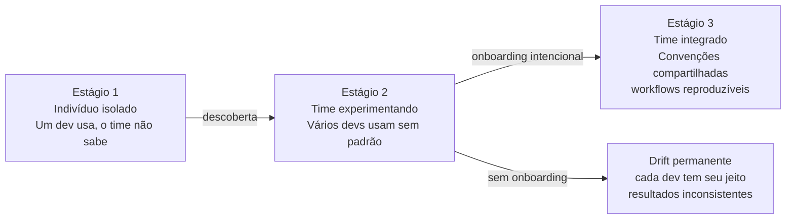
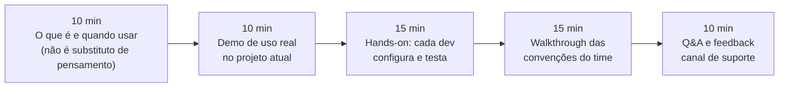
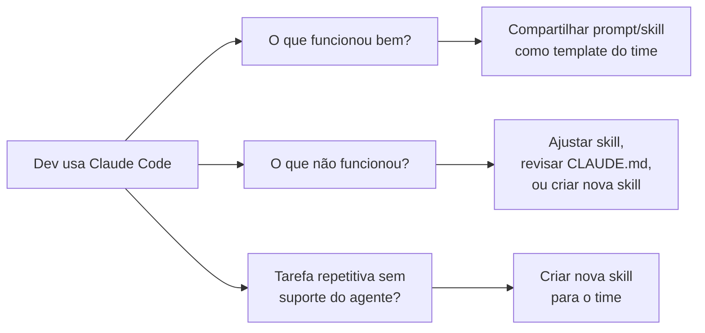
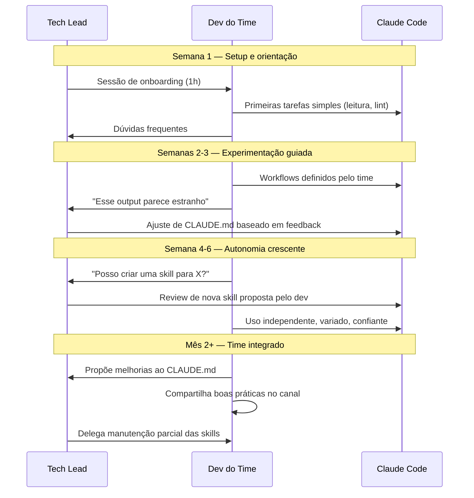

# Onboarding de time — introduzir Claude Code sem caos

> [!abstract] TL;DR
> Introduzir Claude Code num time não é só instalar a CLI — é definir convenções, treinar uso responsável, e estabelecer feedback loops. A adoção falha quando cada dev usa de forma diferente e o agente produz output inconsistente. Tem sucesso quando o time desenvolve hábitos compartilhados: quais skills usar, quando confiar no agente, quando revisar manualmente.

## A analogia do novo membro de equipe

Quando um dev sênior entra num time, o onboarding não é apenas "aqui está o computador, aqui é o repositório". É uma transferência de conhecimento tácito: as convenções do código, o que nunca modificar sem aprovação, quais são os módulos mais frágeis, como é o processo de deploy.

Claude Code precisa do mesmo onboarding — mas entregue via CLAUDE.md e skills, não via shadowing. Se cada dev introduz o agente de forma diferente, sem convenções compartilhadas, o agente vai se comportar de forma inconsistente em cada máquina — como se fosse um dev diferente a cada sessão.

Onboarding de time é garantir que o agente receba o mesmo "manual de integração" em qualquer máquina do time.

> [!question] Por que não deixar cada dev descobrir por conta própria?
> Em uma semana, cada dev vai ter seus próprios prompts, suas próprias skills pessoais, sua própria interpretação do que o agente pode e não pode fazer. Em um mês, o time tem cinco versões diferentes de como usar Claude Code — e nenhuma delas está documentada. Onboarding intencional evita esse drift antes que ele se instale.

## Os três estágios de adoção



A maioria dos times trava no estágio 2 — cada dev tem seu jeito, e o agente vira ruído ao invés de alavanca. Onboarding intencional é o que transforma estágio 2 em estágio 3.

O que distingue um time integrado não é a quantidade de uso — é a consistência. Dois devs, trabalhando em tarefas diferentes na mesma base de código, produzem output com o mesmo nível de qualidade e aderem às mesmas convenções porque o agente recebe o mesmo contexto em ambas as máquinas. Isso é onboarding bem feito.

## Pré-requisitos antes do onboarding

Antes de introduzir Claude Code no time, o ambiente precisa estar pronto:

| Item | Por quê é pré-requisito |
|---|---|
| CLAUDE.md do projeto | Sem ele, o agente não tem contexto do projeto — comportamento genérico |
| 2-3 skills do time | Demonstra os workflows do time, não só a ferramenta genérica |
| MCP servers essenciais | Agente precisa de acesso para demonstrações reais fazerem sentido |
| Hooks de guardrail | Sem bloqueio de destrutivos, um dev novo pode ter um acidente |
| Política de permissões | O time precisa saber o que o agente pode/não pode fazer |

Sem esses pré-requisitos, o onboarding ensina a ferramenta mas não o uso dentro do projeto — cada dev inventa o próprio jeito.

> [!example] O que acontece sem pré-requisitos
> Time A faz onboarding sem CLAUDE.md: cada dev prompta de forma genérica. O agente não conhece as convenções do projeto — sugere imports errados, usa frameworks que o time não usa, ignora regras de estilo. Em três semanas, dois devs desistem ("não funciona") e três continuam com jeitos diferentes. Nenhum dos dois grupos acertou: o problema era a ausência de contexto, não a ferramenta.

### Verificar pré-requisitos antes da sessão

```bash
# Confirmar que CLAUDE.md existe e tem conteúdo
test -f .claude/CLAUDE.md && wc -l .claude/CLAUDE.md

# Listar skills disponíveis
ls .claude/skills/ 2>/dev/null || echo "Nenhuma skill configurada"

# Verificar settings com MCP e hooks
cat .claude/settings.json | python3 -m json.tool | grep -E "(mcpServers|hooks)" -A 5

# Testar uma skill básica
claude -p "/convencoes" --max-turns 3
```

Se qualquer um desses verificações falhar, o onboarding deve ser adiado até que a infraestrutura esteja pronta.

## Sessão de onboarding (1 hora)

Estrutura sugerida para introduzir o time:



**Parte 1 — Contexto (10 min)**
O que é Claude Code e quando faz sentido usar. Ênfase: não é substituto de pensamento. É alavanca para tarefas repetitivas, exploratórias, e com contexto documentado.

**Parte 2 — Demo real (10 min)**
Mostrar uma sessão completa usando skills e MCP do próprio projeto. Não demonstre com projeto genérico — use o repositório real. O time precisa ver o agente entendendo as convenções do projeto, não apenas respondendo sobre JavaScript genérico.

**Parte 3 — Hands-on (15 min)**
Cada dev configura a própria máquina:
- `npm install -g @anthropic-ai/claude-code`
- `export ANTHROPIC_API_KEY=...` (receber key do tech lead)
- Clone do repo (`.claude/` vem com o clone)
- Testar com uma tarefa simples

**Parte 4 — Convenções (15 min)**
Walkthrough do CLAUDE.md, skills disponíveis, e política de permissões. Esta é a parte mais importante — sem ela, os 45 minutos anteriores são parcialmente desperdiçados.

**Parte 5 — Q&A e suporte (10 min)**
Canal para dúvidas, como reportar problemas com skills, quando trazer feedback à revisão.

## Documento de onboarding

Crie um documento de referência — `docs/claude-code/onboarding.md` — que novos devs leem no primeiro dia:

```markdown
# Claude Code neste projeto

## Setup (5 minutos)
1. Instalar: `npm install -g @anthropic-ai/claude-code`
2. Solicitar API key ao tech lead — configurar em `~/.bashrc`:
   `export ANTHROPIC_API_KEY="sk-ant-..."`
3. Clonar o repo — as configurações em `.claude/` vêm com o clone

## Verificar que está funcionando
```bash
claude --version          # mostra a versão
claude -p "Olá"           # resposta rápida de teste
```

## Workflows que o time usa

| Quando | Invocar |
|--------|---------|
| Antes de pedir review de PR | `/review` (analisa o diff contra main) |
| Implementando feature nova | `/convencoes` depois `/tdd` |
| Investigando bug em staging | `/bug-triage` |
| Deploy para staging | `/deploy-checklist` |

## O que o agente pode e não pode fazer
Ver a seção "Política de permissões" em `CLAUDE.md` do projeto.
(Resumo: pode ler, testar, lintar. Nunca toca em migrations, banco de
produção, ou faz push com --force.)

## Não use Claude Code para
- Decisões arquiteturais críticas sem aprovação do time
- PRs urgentes em produção sem review humano
- Lógica de domínio com regras de negócio sutis (ambiguidade = risco)

## Onde pedir ajuda
- Canal #claude-code no Slack
- Tech lead: @nome
- Problemas com skills: criar issue com label `claude-code`
```

## Workflows compartilhados

A força do time está em todos usarem da mesma forma. Workflows documentados garantem reprodutibilidade:

### Workflow: Review de PR

```
1. Crie o PR no GitHub normalmente
2. Localmente, na branch do PR:
   /review
   Revise o diff contra origin/main
3. Endereça os feedbacks que fazem sentido
4. Marque o PR para review humano apenas depois do /review
```

**Por que a ordem importa**: o `/review` do agente não substitui o review humano — ele pré-triagem. O reviewer humano encontra o PR em estado melhor e foca em decisões de design, não em issues mecânicos.

### Workflow: Implementar feature de issue

```
1. Leia a issue com o time (não pula o entendimento humano)
2. Em uma branch nova:
   /convencoes
   /tdd
   Implementa a feature descrita na issue #N
3. Revise os testes gerados antes de aceitar
4. Siga o workflow de review antes do PR
```

### Workflow: Debug de bug em staging

```
1. Reproduza o bug em staging e colete o stack trace
2. /bug-triage
   Bug: [descrição do comportamento observado]
   Stack trace: [cole aqui]
3. O agente consulta logs no banco staging via MCP
4. Revise a análise antes de implementar a correção
```

## Feedback loop nas primeiras semanas

Nas primeiras 2-4 semanas, colete feedback ativamente:



**Mecanismos de feedback**:
- Check-in semanal de 15 min: o que funcionou, o que não funcionou, surpresas
- Canal #claude-code: partilhar bons prompts e cases de uso
- Retrospectiva mensal: revisar e atualizar o CLAUDE.md com o que o time aprendeu

**Template de check-in semanal** (15 min, assíncrono no canal):
```
✅ Funcionou bem esta semana:
   [exemplo específico de tarefa]

⚠️ Não funcionou / output ruim:
   [exemplo específico — prompt + o que deu errado]

💡 Quero uma skill para:
   [tarefa repetitiva que fiz manualmente]

❓ Dúvida:
   [algo sobre o agente que não entendi]
```

Este template simples reduz o atrito de partilhar feedback. Sem estrutura, o canal vira silêncio — cada dev processa as frustrações internamente e o time perde a chance de melhorar as convenções coletivamente.

## Métricas de adoção saudável

| Indicador | Bom sinal | Mau sinal |
|---|---|---|
| Uso por dev | Crescente e estável | Cai depois das primeiras semanas |
| Tipos de tarefa | Variedade aumenta | Só uso para coisas triviais |
| Skills do projeto | Time adiciona e mantém | Nunca tocadas após criação |
| Reviews de PR | Tempo de revisão cai | PRs precisam mais correções pós-merge |
| Confiança no output | Time confia em cenários definidos | Devs revertem mudanças do agente |
| CLAUDE.md | Atualizado com frequência | Não tocado há 2+ meses |

## Anti-padrões comuns de adoção

**"Manda o Claude fazer"**
Time delega tarefas sem entender o que está sendo feito. O agente vira caixa preta. Sintoma: PRs que ninguém consegue explicar. Correção: revisar a saída antes de aceitar, sempre — o agente pode errar, e erros não revisados viram dívida técnica.

**"O Claude vai pegar"**
Time relaxa em qualidade de issue ou especificação assumindo que o agente vai inferir o que falta. Sintoma: prompts vagos com resultados inconsistentes. Correção: tratar o agente como dev junior — quanto melhor o briefing, melhor o resultado.

**Skills paralelas em conflito**
Cada dev cria skills pessoais em `~/.claude/skills/` que duplicam ou contradizem as do projeto. Sintoma: comportamento inconsistente entre máquinas de devs diferentes. Correção: skills do projeto em `.claude/skills/`, revisão obrigatória pelo tech lead antes de adicionar.

**Sem revisão de output**
Time aceita output do agente sem ler. Sintoma: bugs e code smells passando para produção. Correção: code review humano permanece obrigatório — o agente não substitui, ele auxilia.

**Onboarding apenas técnico**
Ensinar a instalar a CLI sem ensinar as convenções do time gera cada dev inventando o próprio jeito. O setup é 20% do onboarding; os 80% restantes são "como usamos aqui".

**Adotar tudo de uma vez**
Headless + CI + MCP + skills + hooks ao mesmo tempo sobrecarrega o time. Comece com uso interativo + 1-2 skills + CLAUDE.md básico. Adicione complexidade conforme o time absorve.

## O papel do tech lead

Em qualquer adoção de Claude Code no time, alguém precisa ser o owner:

- Mantém o CLAUDE.md atualizado (revisão mensal)
- Revisa skills antes de adicionar ao projeto
- Conduz o onboarding de novos devs
- Coleta feedback e itera nas convenções
- Decide quando uma skill foi superada e deve ser removida
- Monitora custo e ajusta controles se necessário

Sem esse papel definido, as convenções degradam rapidamente — o CLAUDE.md vira documentação de um projeto que não existe mais, e as skills ficam desalinhadas com as práticas atuais.

> [!warning] O tech lead não pode ser o único poder de usuário
> Se apenas o tech lead usa o agente com confiança, o time não adotou — o tech lead adotou. O objetivo é capacitar todos os devs a usar o agente nos workflows definidos. Um bom indicador: novos devs conseguem fazer o onboarding com o documento escrito, sem precisar do tech lead presente.

## Sequência de maturidade do time

A adoção saudável segue uma progressão natural:



## Calibrando quando confiar no agente

Um dos desafios mais comuns no onboarding é calibrar confiança: quando aceitar o output sem revisão detalhada, quando revisar linha por linha, quando descartar.

| Tarefa | Nível de confiança | Postura recomendada |
|---|---|---|
| Refactor mecânico (renomear, mover) | Alto — fácil de verificar | Aceitar, checar com `git diff` |
| Geração de testes unitários | Médio — testes podem passar mas ser frágeis | Revisar cobertura e edge cases |
| Lógica de domínio nova | Baixo — requer julgamento de negócio | Revisar linha por linha |
| Mudanças em infraestrutura | Mínimo — alto risco, baixa reversibilidade | Não delegar; fazer manualmente |
| Documentação de código existente | Alto — descreve o que existe | Aceitar, ler por cima |
| Análise de bug com contexto dado | Médio — pode alucinar causa | Tratar como hipótese, verificar |

Compartilhar essa tabela com o time no onboarding evita dois erros opostos: excesso de desconfiança (revisar tudo, perdendo o ganho de velocidade) e excesso de confiança (aceitar output sem critério, introduzindo bugs).

## Armadilhas do onboarding

**Fazer o onboarding sem o projeto estar pronto**
Se CLAUDE.md não existe ou as skills não estão funcionando, o onboarding vai demonstrar uma versão genérica da ferramenta — e o time vai imaginar que o agente é menos poderoso do que realmente é.

**Onboarding "evento único"**
Um workshop de 1 hora não é suficiente. Onboarding real é o acompanhamento nas primeiras semanas, quando o time encontra os primeiros casos difíceis e precisa saber como responder.

**Introduzir muitos recursos de uma vez**
Headless, CI/CD, MCP, hooks, skills — cada um exige adaptação cognitiva. Comece com interativo + CLAUDE.md + 2 skills. Adicione complexidade conforme o time absorve.

**Não documentar o que funciona**
Bons prompts descobertos por devs individuais se perdem. Sem canal de compartilhamento, o time reinventa a roda — cada dev descobre os mesmos prompts individualmente.

**Confundir "o agente pode" com "o time usa"**
Demonstrar que o agente consegue fazer X não significa que o time vai usar de forma produtiva. A distância entre capacidade e adoção real é preenchida por workflows documentados e prática.

## Checklist de onboarding completo

Antes de considerar o onboarding concluído, garanta:

**Infraestrutura**
- [ ] CLAUDE.md do projeto está no repositório e cobre: contexto, arquitetura, comandos essenciais, convenções, restrições
- [ ] Pelo menos 3 skills do time estão em `.claude/skills/` e testadas
- [ ] MCP servers essenciais configurados em `.claude/settings.json`
- [ ] Hooks de guardrail bloqueando comandos destrutivos
- [ ] Política de permissões documentada no CLAUDE.md

**Pessoas**
- [ ] Todos os devs do time instalaram a CLI e testaram com a própria API key
- [ ] Todos assistiram ou receberam o documento de onboarding
- [ ] Todos sabem onde pedir ajuda (canal + tech lead)
- [ ] Todos conhecem os 3 principais anti-padrões

**Processo**
- [ ] Canal de compartilhamento de boas práticas criado
- [ ] Cadência de feedback definida (semanal ou quinzenal)
- [ ] Responsável por manter CLAUDE.md e skills identificado
- [ ] Próxima revisão de convenções agendada (30 dias)

**Métricas**
- [ ] Baseline de custo mensal estimado
- [ ] Teto de custo configurado no Console Anthropic
- [ ] Forma de monitorar custo por dev definida

> [!tip] O onboarding não é um evento, é um processo
> O checklist acima marca o fim da fase de setup — não o fim do onboarding. A fase de adoção real começa na segunda semana, quando o time encontra os primeiros casos ambíguos e precisa decidir como usar o agente. O tech lead precisa estar disponível nesse período.

## Como explicar em inglês

**"Onboarding Claude Code to a team"** — not just installing the CLI but establishing shared conventions: which skills to use, when to trust the agent's output, what it's never allowed to do. The goal is the same agent behavior on every developer's machine.

**The key insight:**
- "The CLAUDE.md is the agent's onboarding document for the project. The team onboarding document is for developers — it explains how the team uses the agent, not just how the agent works."
- "Without shared workflows, you get drift: five developers using five different prompting styles, five different interpretations of what the agent should do. Consistency comes from written conventions, not from everyone independently reaching the same conclusion."
- "Think of it like onboarding a new team member: you wouldn't hand them the laptop and walk away. You'd explain the codebase, the conventions, the fragile parts, the deployment process. Claude Code needs the same treatment — delivered via CLAUDE.md and skills instead of shadowing."

**Common questions:**
- *"How long does it take for a team to reach 'integrated' adoption?"* — 4-6 weeks with intentional feedback loops. The first week everyone is learning the tool; by week 3, the first skills are being added by the team (not just the tech lead); by week 6, the workflows are stable enough to onboard the next new hire.
- *"What's the biggest adoption failure mode?"* — The tech lead sets everything up and the team uses it passively. Active adoption means the team proposes new skills, reports when a skill produces bad output, and iterates on the CLAUDE.md. Passive adoption means the tech lead is the only one who really knows how to use it.
- *"How do you know the team has actually adopted it vs. just being aware it exists?"* — The signal is when developers propose new skills or suggest improvements to CLAUDE.md based on real use. Awareness is passive; adoption is when the team shapes the tool around their actual workflows.
- *"What's the difference between team onboarding and individual onboarding?"* — Individual onboarding is: install, get key, try it out. Team onboarding adds: shared conventions, defined workflows, trust calibration, feedback loops, and someone owning the conventions over time. The individual experience is 20% of team adoption.

**Key vocabulary:**
- **adoption drift** — when each developer uses the agent differently, producing inconsistent output
- **trust calibration** — knowing when to accept agent output vs. when to review carefully
- **shared workflow** — a documented, repeatable sequence that the whole team follows for a given task
- **skill ownership** — having a designated person responsible for keeping skills current and correct

## Referências

- [[03-Dominios/Tecnologia/IA/Claude Code/Time e Automação/04 - CLAUDE.md compartilhado|04 - CLAUDE.md compartilhado]] — base da convenção do projeto
- [[03-Dominios/Tecnologia/IA/Claude Code/Time e Automação/06 - Segurança organizacional|06 - Segurança organizacional]] — política de permissões e hooks
- [[03-Dominios/Tecnologia/IA/Claude Code/Skills e MCP/08 - Skills em time|08 - Skills em time]] — ciclo de vida de skills no time
- [[03-Dominios/Tecnologia/IA/Claude Code/Time e Automação/08 - Avaliando qualidade|08 - Avaliando qualidade]] — quando confiar no agente
- [[03-Dominios/Tecnologia/IA/Claude Code/Time e Automação/05 - Controle de custo|05 - Controle de custo]] — custo individual e por time
- [[03-Dominios/Tecnologia/IA/Claude Code/Time e Automação/02 - CI-CD com GitHub Actions|02 - CI-CD com GitHub Actions]] — automação para o time inteiro
- [[03-Dominios/Tecnologia/IA/Claude Code/Time e Automação/index|Time e Automação]] — índice do galho
- [[03-Dominios/Tecnologia/IA/Claude Code/index|Claude Code]] — tronco da trilha

> [!duvida] Como medir se o onboarding teve sucesso?
> As métricas da seção "Adoção saudável" cobrem o que medir, mas não quando colher. Uma boa heurística: aos 30 dias, se o time tiver identificado pelo menos uma skill nova a adicionar e tiver atualizado o CLAUDE.md pelo menos uma vez — a adoção foi ativa, não passiva. Se em 30 dias nada mudou no `.claude/`, o time está usando a ferramenta de forma genérica, não aproveitando o potencial de customização para o projeto.
