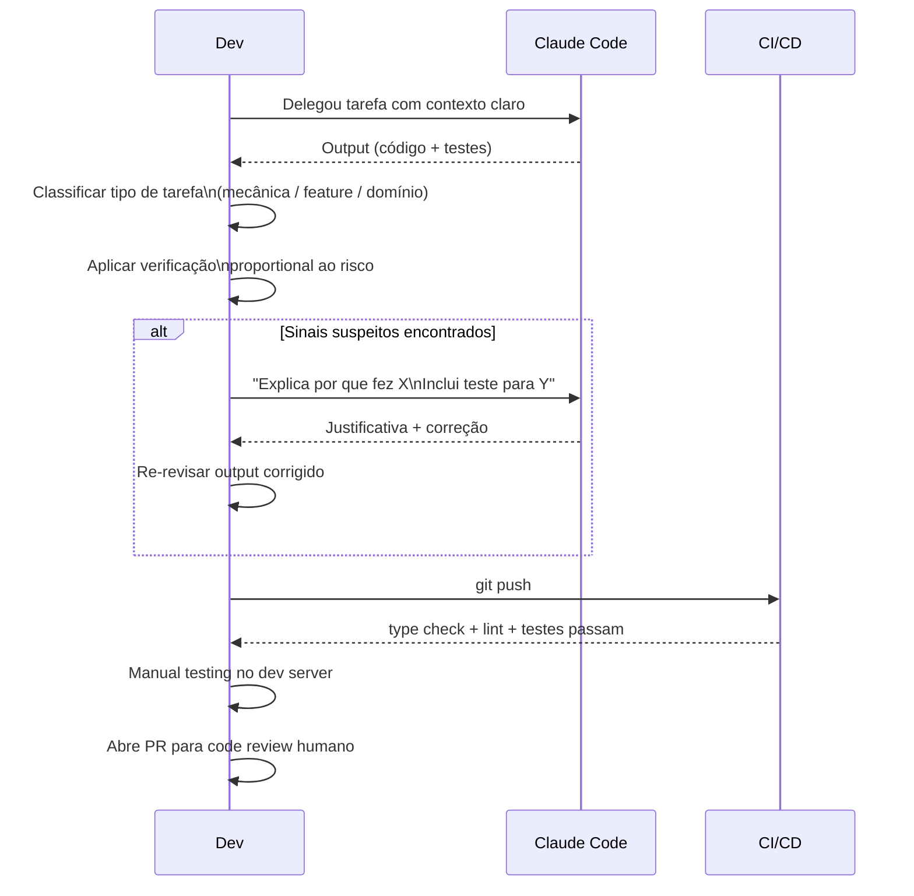
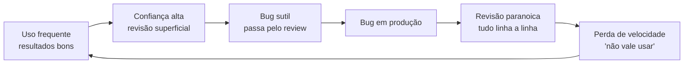

# Avaliando qualidade do output — quando confiar, quando revisar

> [!abstract] TL;DR
> Claude Code produz código que vai de excelente a sutilmente quebrado, e o nível de confiança depende do tipo de tarefa, do contexto fornecido, e do quanto você consegue verificar o resultado. Tarefas mecânicas e bem especificadas merecem mais autonomia; mudanças que afetam regra de negócio, dados, ou produção exigem revisão linha a linha. A calibração não é estática — ela melhora à medida que você acumula evidência de onde o agente acerta e onde erra.

## A analogia do dev júnior muito produtivo

Imagine um dev júnior que produz código na velocidade de um sênior, mas que ainda tem pontos cegos — não conhece todas as regras de negócio do projeto, pode supor que entendeu um requisito quando não entendeu, e às vezes cria uma solução complexa para um problema simples.

Você não ia mandar esse dev diretamente para produção sem revisão. Mas também não ia desperdiçar horas revisando linha a linha cada snippet de boilerplate que ele gera — isso seria paranoia contra evidência.

Claude Code é esse dev júnior. A calibração de confiança é a habilidade de saber quando o júnior pode ir sozinho e quando precisa do sênior do lado.

> [!question] Por que calibração importa mais do que desconfiar de tudo?
> Revisar tudo linha a linha elimina o ganho de velocidade. Revisar nada introduz bugs imperceptíveis. A calibração proporcional ao risco é o que torna o agente uma alavanca real — não um substituto do desenvolvedor.

## A gradação de confiança

O erro mais comum é tratar Claude Code como confiável ou não confiável de forma binária. A realidade tem nuance:

```mermaid
flowchart LR
    subgraph ALTA["Alta confiança"]
        A1["Tarefas mecânicas\nem contexto bem definido"]
        A2["Refatoração com\ntestes existentes passando"]
        A3["Boilerplate, documentação\nformatação, lint"]
        A4["Ajuste de tipos\nanotações simples"]
    end

    subgraph MEDIA["Confiança média"]
        M1["Features pequenas com TDD"]
        M2["Debug de bugs\ncom reprodução clara"]
        M3["Review de PRs\n(catch de erros óbvios)"]
        M4["Migrations de\nestrutura simples"]
    end

    subgraph BAIXA["Baixa confiança"]
        B1["Lógica de domínio\ncom regras sutis"]
        B2["Decisões arquiteturais"]
        B3["Código de pagamento\nautenticação, dados sensíveis"]
        B4["Operações irreversíveis\nem produção"]
    end

    ALTA -->|"aceitação rápida"| MEDIA
    MEDIA -->|"revisão detalhada"| BAIXA
    BAIXA -->|"expert humano\ndirige, agente auxilia"| FIM["decisão humana"]
```



Cada categoria pede um modo de revisão diferente. Tarefa mecânica: olhar o diff e confirmar que parece razoável. Lógica de domínio: ler linha por linha, executar manualmente, validar com testes.

## Sinais de output confiável

Quando o agente produz output que merece confiança, alguns sinais aparecem:

- **Testes incluídos e passando**: o agente escreveu testes que cobrem o novo comportamento, e eles passam
- **Mudanças focadas**: o diff toca só o necessário, sem refatorações paralelas
- **Código autoexplicativo**: nomes claros, sem narração redundante em comentários
- **Decisões justificadas no chat**: quando o agente fez uma escolha não-óbvia, explicou o porquê
- **Casos de borda cobertos**: input vazio, null, lista única, valor extremo
- **Sem dependências novas sem motivo**: usa o que já existe no projeto
- **Coerência com as convenções do projeto**: o código parece escrito pelo time, não por um estranho

> [!tip] Vídeo — como revisar código gerado por IA na prática
> [How I Review AI-Generated Code](https://www.youtube.com/watch?v=As2xy_cSx00) detalha o processo de revisão que um dev aplica a cada PR gerado por agente — do porquê a maioria dos times ainda não tem um processo formal de revisão para output de IA, até os pontos específicos do diff que merecem mais atenção. Complementa a checklist e a tabela de assimetria de revisão desta nota com um walkthrough real.

## Sinais de output suspeito

Inversamente, sinais que pedem revisão atenta:

- **Testes "fake"**: o agente afirma que testou, mas o teste não exercita o caminho relevante
- **Try/catch genérico engolindo erros**: `catch (e) { console.log(e) }` esconde problemas
- **Comentários explicando o óbvio**: sinal de que o agente está preenchendo espaço, não pensando
- **Variáveis renomeadas sem motivo**: refatoração paralela que aumenta área de superfície do PR
- **TODO genérico no meio do código**: `// TODO: handle this case` — vai ficar lá pra sempre
- **Soluções complexas para problemas simples**: três classes onde uma função basta
- **Mocks em testes de integração**: o teste passa mas não valida nada real
- **Dependências novas sem motivo**: adiciona biblioteca para o que poderia ser 5 linhas de código
- **Inconsistência de estilo**: mescla convenções diferentes do projeto
- **Afirmações sobre comportamento sem teste que verifica**: "isso trata o caso X" — cadê o teste?

## Checklist de revisão por tipo de commit

Antes de commitar qualquer output do agente, passe por este checklist rápido:

**Para qualquer tipo de mudança:**
- [ ] Entendi o que está mudando — não apenas que os testes passam
- [ ] O diff é coerente com o que pedi (sem mudanças surpresa)
- [ ] Não há dependências novas desnecessárias

**Para implementação de feature:**
- [ ] Testes cobrem o caminho feliz E os casos de borda
- [ ] Manual testing no dev server confirma o comportamento
- [ ] Edge cases (null, vazio, concorrência) tratados

**Para lógica de domínio:**
- [ ] Regras de negócio verificadas contra documentação ou expert
- [ ] Testes cobrem todas as variações da regra
- [ ] Revisão por alguém do produto

**Para mudanças em infraestrutura ou produção:**
- [ ] Testado em staging antes
- [ ] Existe rollback claro
- [ ] Feature flag pronto se aplicável
- [ ] Outro dev revisou

## Estratégias de verificação por tipo de tarefa

### Refatoração

```
Pergunta-chave: o comportamento mudou?

Verificação:
1. Os testes existentes passam sem modificação?
2. Se testes foram modificados, por quê? (justificativa válida?)
3. O diff visual: faz sentido a mudança?
4. Spot check de 2-3 caminhos críticos manualmente
```

Refatoração com testes existentes que continuam passando é o caso mais seguro de delegação. Se o agente modificou os testes durante a refatoração, isso pede atenção extra — pode estar adaptando os testes para cobrir uma mudança de comportamento que não deveria ter acontecido.

### Implementação de feature

```
Pergunta-chave: a feature funciona conforme especificado?

Verificação:
1. Os testes novos cobrem os casos esperados?
2. Casos de borda: lista vazia, input inválido, concorrência?
3. Caminho feliz manual: roda no dev server, exercita a feature
4. Caminho infeliz manual: o que acontece com input ruim?
5. Integração: a feature interage corretamente com o resto do sistema?
```

Tests passing não é suficiente — o agente pode ter escrito testes incompletos. Manual testing complementa.

### Bug fix

```
Pergunta-chave: o bug foi corrigido sem introduzir outro?

Verificação:
1. Existe teste de regressão? Roda?
2. O fix é local ou tem efeitos colaterais?
3. A causa raiz está clara, ou é só sintoma sumido?
4. Reproduzir o bug manualmente antes e depois do fix
```

> [!warning] Cuidado com fixes que suprimem sintomas
> Agentes às vezes "corrigem" um bug escondendo a manifestação sem entender a causa. Exemplo: adicionar um guard `if (value == null) return` onde o bug real é que `value` nunca deveria ser null naquele ponto. O crash some, mas a causa raiz permanece. Sempre exija o teste de regressão que reproduz o bug original.

### Lógica de domínio

```
Pergunta-chave: as regras de negócio estão corretas?

Verificação:
1. As regras estão documentadas em algum lugar (PRD, ticket, código existente)?
2. O agente teve acesso a essa documentação?
3. Walk-through linha a linha com a regra em mente
4. Cenários de teste cobrem todas as variações da regra
5. Revisão com alguém do produto/domínio
```

Lógica de domínio sutil é onde Claude Code mais falha — porque o agente não tem contexto que só existe na cabeça das pessoas. Quanto mais sutil a regra, menor a confiança no output.

### Mudança em produção

```
Pergunta-chave: o que acontece se isto estiver errado?

Verificação:
1. Existe rollback claro?
2. Mudança pode ser feita em staging primeiro?
3. Existe feature flag para desligar rapidamente?
4. Logs/alertas vão detectar problema rapidamente?
5. Revisão por outra pessoa do time
```

Para mudanças em produção, nunca aceite o output do agente sem revisão humana adicional. Independente de quão bem ele parece estar funcionando localmente.

## Casos práticos

Calibração abstrata é fácil de concordar e difícil de aplicar sob pressão de prazo. Dois cenários reais mostram a diferença na prática — um em que delegar é seguro, outro em que não é.

### Cenário 1: Refactor de um módulo de billing com suíte de testes robusta

Um time recebe a tarefa de extrair a lógica de cálculo de desconto de um componente de checkout monolítico para um service dedicado, sem mudar comportamento. O módulo tem 40 testes de integração cobrindo os principais cupons, combinações de desconto e casos de borda (cupom expirado, desconto que zera o total).

Delegado ao Claude Code com instrução clara ("extrai sem mudar comportamento; os 40 testes devem continuar passando sem edição"), o agente entrega o refactor em poucos minutos. A verificação leva menos tempo do que a implementação manual levaria: os 40 testes passam sem modificação, o diff é mecânico (mover código, ajustar imports), e um spot check de 2 caminhos críticos confirma que os valores calculados batem.

> [!question] Por que esse é o caso ideal de alta confiança?
> Porque a rede de segurança — os testes — já existia antes do agente tocar no código. A verificação não depende de o revisor confiar no agente; depende de a suíte detectar qualquer desvio de comportamento. Delegar aqui não é aposta, é engenharia com verificação barata.

### Cenário 2: Cálculo de imposto retido na fonte para contratos internacionais

Um time de fintech pede ao agente para implementar o cálculo de retenção de imposto sobre pagamentos a prestadores internacionais, que varia por país, tipo de serviço e tratado de bitributação. Não existe suíte de testes prévia — é feature nova.

O agente produz um código plausível: bem estruturado, nomes claros, comentários explicando cada bloco. Só que a regra para um dos países está sutilmente errada — usa a alíquota geral em vez da alíquota reduzida prevista no tratado bilateral específico, um detalhe documentado apenas no acordo fiscal entre os dois países, não em nenhum lugar do código-fonte ou do contexto fornecido.

> [!warning] O bug não teria sido pego por revisão superficial
> O código roda, os testes que o próprio agente escreveu passam (porque testam contra a implementação, não contra a regra fiscal real), e nada no diff parece suspeito visualmente. Só um especialista tributário comparando o resultado com o tratado bilateral pegaria o erro — exatamente o tipo de revisão que esta nota recomenda para lógica de domínio sutil.

A diferença entre os dois cenários não é a qualidade do agente — é a disponibilidade de uma verificação independente e barata. Onde ela existe (testes prévios), delegação é segura. Onde ela não existe (regra de negócio documentada só na cabeça de um especialista), a revisão precisa envolver esse especialista antes do merge.

## O pipeline de verificação de qualidade



## Gates de qualidade por estágio

Defina quais checks são pré-requisito antes de aceitar output em cada estágio:

| Estágio | Gate mínimo |
|---|---|
| Antes de commitar | Type check + lint + testes locais + spot check visual |
| Antes de abrir PR | Testes de integração + manual testing + diff revisado |
| Antes de mergear | CI + code review humano + aprovação para mudanças de risco |
| Antes de deploy em produção | Staging + smoke tests + feature flag pronto |

## Calibrando confiança ao longo do tempo

Mantenha uma noção empírica de onde o agente acerta e onde erra no seu contexto específico:

| Domínio | Padrão observado |
|---|---|
| Boilerplate (DTOs, controllers) | Quase sempre correto |
| Validação de input | Mete `any` quando aperta — sempre revisar tipos |
| Queries SQL | Boa em CRUD; complica em agregações |
| Testes unitários | Boa estrutura; cobre casos óbvios, falha em borda |
| Concorrência | Frequentemente erra timing/race conditions |
| Configuração de CI | Boa quando há template; inventa quando não há |
| Lógica financeira | Alta variabilidade — verificar com calculadora |

Essa tabela é pessoal — cada projeto e estilo de prompt produz padrões diferentes. Vale anotar surpresas (boas e ruins) ao longo das primeiras semanas.

> [!tip] Como construir sua tabela de calibração
> Nas primeiras 4 semanas de uso, após cada PR que passou por code review humano, anote: qual foi a tarefa, houve correção necessária, e qual foi o tipo de erro (se houve). Em um mês você tem evidência suficiente para identificar os padrões específicos do agente no seu contexto.

## Como fazer o agente melhorar seu próprio output

Quando o output tem sinais suspeitos, antes de descartar ou reescrever manualmente, tente iterar:

```
# Pedir justificativa de uma escolha não-óbvia
"Por que você usou um HashMap aqui ao invés de simplesmente uma lista?"

# Exigir teste que cubra um caso que parece não coberto
"Escreve um teste que falha se o input for nulo nesse método"

# Detectar if the agent understood the requirement
"Reformule em suas palavras o que a feature deve fazer"

# Provocar o agente a encontrar seus próprios erros
"Revise sua implementação com foco em edge cases de concorrência.
O que poderia dar errado num ambiente multi-thread?"
```

Essa iteração não é fraqueza da ferramenta — é colaboração. O agente melhora o output quando recebe feedback específico, assim como um dev júnior melhora com mentoring preciso.

> [!tip] Iterar é mais rápido do que reescrever
> Na maioria dos casos, pedir ao agente que corrija um output específico (com o diagnóstico do problema) é mais rápido do que reescrever você mesmo. A exceção: lógica de domínio que o agente não tem como entender sem contexto que você levaria mais tempo a explicar do que a implementar.

## Quando NÃO usar Claude Code

Reconhecer os limites é parte da calibração:

- **Quando você não consegue verificar o output**: se você não entende o código que o agente vai produzir, não dá pra revisar. Use para aprender, mas não para mergear cego.
- **Mudanças com requisitos ambíguos**: o agente vai inferir, e a inferência pode estar errada. Esclareça antes.
- **Decisões que envolvem stakeholders**: arquitetura, escolhas de tooling, mudanças de contrato — converse com o time antes.
- **Sistemas críticos sem boa cobertura de teste**: o agente vai parecer correto e ninguém vai pegar o bug até produção.
- **Lógica de domínio extremamente sutil**: regras de imposto, cálculo financeiro, conformidade legal — esses casos pedem expert humano dirigindo.

## Estabelecendo expectativas claras antes de delegar

O output do agente melhora quando as expectativas estão explícitas no prompt — não apenas o que fazer, mas como verificar que está feito:

```bash
# Prompt fraco — output ambíguo, difícil de verificar
claude -p "Adiciona validação ao endpoint de cadastro"

# Prompt forte — output verificável
claude -p "Adiciona validação ao endpoint POST /users/register:
- email: formato válido (regex RFC 5322 simplificado)
- senha: mínimo 8 chars, ao menos 1 maiúscula e 1 número
- nome: não vazio, máximo 100 chars

Ao terminar:
1. Escreve testes unitários para cada regra de validação
2. Inclui caso de borda: todos inválidos ao mesmo tempo
3. Testa no controller com HttpTestClient
4. O endpoint deve retornar 400 com lista de erros, não 500

Não use bibliotecas de validação externas — usa Bean Validation do projeto"
```

A diferença não está na confiança no agente — está na especificação do resultado esperado. Output especificável é output verificável.

## O paradoxo da confiança crescente

Conforme você usa Claude Code mais, a tendência natural é confiar mais. Isso pode ser perigoso:



A solução não é confiar mais ou menos — é manter ritual de revisão proporcional ao risco da mudança. Refatoração simples? Diff superficial é OK. Pagamento? Linha a linha sempre. A categoria da tarefa, não o histórico de acertos, determina o nível de revisão.

## Métricas de qualidade para o time

Se o time quer entender saúde da adoção, alguns indicadores rastreáveis:

- **% de PRs com Claude Code que precisam de correção pós-merge**: alta = revisão fraca no processo
- **Tempo médio de PR review**: deve diminuir com adoção, mas não para zero
- **Cobertura de testes em PRs com Claude Code**: deve manter ou melhorar
- **Bugs em produção atribuídos a mudanças geradas pelo agente**: tracking simples revela padrões
- **Confiança auto-relatada do time**: pergunte em retro: "você confia no output do agente quando revisa?"

## A regra da assimetria de revisão

Nem toda parte do diff merece o mesmo tempo de revisão. A regra de ouro:

| Parte do diff | Foco de revisão |
|---|---|
| Lógica de negócio nova | Linha a linha — é aqui que bugs sutis entram |
| Testes escritos pelo agente | Verificar se cobrem o que afirmam cobrir |
| Boilerplate e configuração | Spot check — fácil de errar em detalhe, fácil de ver |
| Refatoração de nomes/estrutura | Verificar que o comportamento não mudou |
| Comentários e docs | Leitura rápida — baixo risco |
| Arquivos que não deveriam ter mudado | Revisar com atenção — sinal de drift não solicitado |

A assimetria é intencional: gastar 80% do tempo de revisão nos 20% do diff que têm maior risco é calibração eficiente — não preguiça.

## Armadilhas comuns

> [!warning] Confiar porque os testes passam
> Testes podem ser superficiais. O agente pode escrever testes que passam mas não exercitam os casos que importam. Verifique se a cobertura é real.

> [!warning] Revisar pouco porque "o agente faz bem"
> Viés de confirmação. Você lembra das vezes que acertou, esquece das que precisou corrigir. Calibração exige memória ativa, não impressão geral.

> [!warning] Revisar tudo porque "não confio no agente"
> O oposto é igualmente custoso. Você perde a alavanca da ferramenta. O objetivo é proporcionalidade, não paranoia.

> [!warning] Tratar revisão como formalidade
> Passar o olho sem entender o diff não é revisão — é teatro de revisão. Se não entende o código, peça ao agente para explicar antes de aceitar.

> [!warning] Não documentar padrões de erro
> Se o agente sempre comete o mesmo tipo de erro no seu projeto, isso vai pro CLAUDE.md como restrição. Padrões repetidos que não são capturados como feedback voltam como bugs.

> [!warning] Esperar perfeição
> Claude Code não substitui pensamento; complementa. Mesmo quando funciona, você precisa entender o resultado — não para micro-gerenciar, mas para manter a responsabilidade do que vai para produção.

## Integrando avaliação de qualidade à cultura do time

Avaliação de qualidade não funciona como regra individual — precisa ser cultura do time:

- **Code review menciona a origem**: "gerado por Claude Code, revisei X, Y, Z" — a transparência cria responsabilidade sem estigma
- **Post-mortems incluem origem da mudança**: se um bug veio de output de agente não revisado, isso vai para o aprendizado coletivo
- **Skills evoluem com os padrões de erro**: quando o time identifica que o agente sempre comete um tipo de erro, isso vai para o CLAUDE.md — fecha o loop de qualidade
- **Métricas são de aprendizado, não de auditoria**: a meta não é punir uso do agente, mas melhorar o processo

> [!note] Qualidade de output é função de contexto fornecido
> Antes de concluir que o agente produziu output ruim, pergunte: o CLAUDE.md tinha a convenção relevante? O prompt incluía a regra de negócio? O projeto tinha exemplos do padrão esperado? Output medíocre frequentemente é consequência de contexto medíocre — e isso é corrigível.

## Como explicar em inglês

**"Evaluating AI agent output quality"** — calibrated trust, not binary trust. The question isn't "is the agent reliable?" but "is this type of task one where I can verify the output proportionally to its risk?"

**The key distinction:**
- "Test coverage doesn't prove correctness — it proves that the tests the agent wrote pass. A test suite written by the same process that wrote the code can have systematic blind spots."
- "Output quality degrades with ambiguity. The clearer the specification, the better the output. When requirements are fuzzy, the agent will infer — and the inference may be wrong."
- "Trust calibration is a skill you build over time by tracking where the agent succeeds and fails in your specific context. It's not a property of the tool in the abstract."

**Common questions:**
- *"When should you just trust the agent and move on?"* — When the task is mechanical, the context is well-specified, tests exist and pass, and the change is easily reversible. Not because the agent is always right, but because the cost of being wrong is low enough that proportional review is a quick diff scan.
- *"How do you handle it when the agent explains what it did but you're not sure it's correct?"* — Ask the agent to write a test that would fail if its explanation were wrong. If it can't, the explanation is probably post-hoc rationalization. If it can, run the test.
- *"Should we track bugs introduced by AI-assisted PRs separately?"* — Yes, as a calibration input, not as a blame metric. The goal is to identify systematic patterns (e.g., "the agent consistently mishandles null in service layer calls") and encode them as CLAUDE.md restrictions.

**Termos-chave PT↔EN:**

| Português | Inglês |
|---|---|
| Calibração de confiança | Trust calibration |
| Verificação proporcional ao risco | Risk-proportional verification |
| Pontos cegos | Blind spots |
| Revisão linha a linha | Line-by-line review |
| Cobertura de testes | Test coverage |
| Caso de borda | Edge case |
| Viés de confirmação | Confirmation bias |
| Teatro de revisão | Review theater |
| Lógica de domínio | Domain logic / business rule |
| Reversibilidade | Reversibility |

## O que vem a seguir

Calibrar confiança linha a linha resolve o problema de "esse PR específico está bom?". Mas Claude Code não vive só de PRs isolados — ele entra em fluxos de trabalho inteiros: planejar antes de codar, fazer TDD, revisar um refactor grande, debugar um bug esquivo, orquestrar múltiplos agentes em paralelo. A calibração de confiança desta nota é o filtro que você aplica em cada um desses fluxos — mas o fluxo em si (quando usar Plan Mode, como estruturar um sub-agent, como fazer code review assistido) é outro conjunto de decisões.

O galho [[03-Dominios/Tecnologia/IA/Claude Code/Workflows/index|Workflows]] cobre exatamente isso: os padrões de uso do dia a dia, do planejamento ao multi-agent, que dão a matéria-prima que esta nota ensina a avaliar.

## Fontes

- [Code Review in the Age of AI](https://addyo.substack.com/p/code-review-in-the-age-of-ai) — Addy Osmani (2026). Argumenta que a revisão de código, e não a autoria, é o gargalo que sobra quando o agente escreve rápido; complementa a régua de verificação proporcional ao risco desta nota.
- [96% of developers don't trust AI code: here's a step toward the fix](https://thenewstack.io/agentic-ai-verification-impact/) — The New Stack (2026). Dado empírico sobre a lacuna entre desconfiança declarada e prática real de revisão, que reforça o argumento contra confiança binária.

## Referências

- [[03-Dominios/Tecnologia/IA/Claude Code/Time e Automação/04 - CLAUDE.md compartilhado|04 - CLAUDE.md compartilhado]] — convenções que ajudam o agente a acertar
- [[03-Dominios/Tecnologia/IA/Claude Code/Time e Automação/06 - Segurança organizacional|06 - Segurança organizacional]] — limites que reduzem risco de output destrutivo
- [[03-Dominios/Tecnologia/IA/Claude Code/Time e Automação/07 - Onboarding de time|07 - Onboarding de time]] — como o time desenvolve calibração compartilhada
- [[03-Dominios/Tecnologia/IA/Claude Code/Workflows/05 - Code review|05 - Code review]] — usar o próprio agente para revisar
- [[03-Dominios/Tecnologia/IA/Claude Code/Time e Automação/index|Time e Automação]] — índice do galho
- [[03-Dominios/Tecnologia/IA/Claude Code/index|Claude Code]] — tronco da trilha
