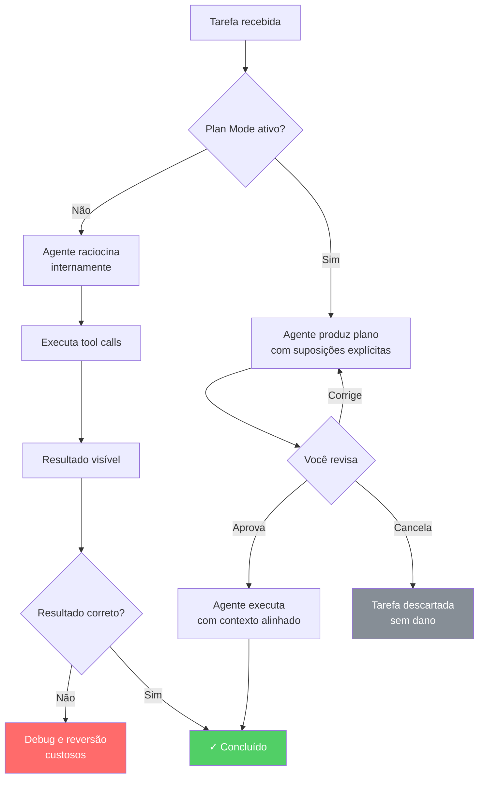

# Plan Mode — planejar antes de agir

> [!abstract] TL;DR
> [[Dicionário de IA#planning|Plan Mode]] faz o agente produzir um plano de implementação antes de escrever qualquer código. Ative com `Shift+Tab` ou `--plan`. O plano expõe o raciocínio do agente — você aprova, corrige ou redireciona antes de o agente agir. O valor não está em ver o plano: está em **corrigir o plano**. Uma suposição errada identificada antes da execução custa um parágrafo; identificada depois, custa uma tarde de debug e possível reversão de mudanças.

## O que é

Em modo normal, o [[Dicionário de IA#Agent|agente]] age: recebe a tarefa, raciocina internamente, executa [[Dicionário de IA#tool call|tool calls]]. O raciocínio é invisível.

Em Plan Mode, o agente para antes de agir e exibe o plano:
- quais arquivos vai ler
- quais mudanças planeja
- qual a ordem de execução
- quais suposições está fazendo

Você vê o raciocínio e pode corrigir antes de o agente modificar qualquer arquivo.

## Por que funciona — o mecanismo

> [!question]- Por que simplesmente pedir um bom prompt não é suficiente? Por que um *modo* especial faz diferença?

A resposta está em como o agente formula o raciocínio quando sabe que será revisado.

Em modo normal, o agente age como um cirurgião que improvisa no centro cirúrgico: as decisões acontecem durante a execução, muitas vezes implicitamente. Se ele assume que você usa PostgreSQL, simplesmente escreve SQL com sintaxe Postgres. Você só descobre a suposição quando lê o código gerado — ou pior, quando ele quebra em produção num banco MySQL.

Em Plan Mode, o cirurgião tem que fazer um *briefing* com a equipe antes de entrar na sala. Ele precisa verbalizar as etapas, os instrumentos necessários, as suposições sobre o estado do paciente. Esse ato de verbalização muda o raciocínio: suposições implícitas se tornam perguntas explícitas, porque o agente sabe que alguém vai revisar.

O que muda tecnicamente:

1. **Suposições viram perguntas**: em vez de agir sobre "provavelmente usa Redis", o agente pergunta "o armazenamento do rate limit deve ser em memória ou Redis?"
2. **Escopo fica visível**: você vê *quantos* arquivos serão tocados. Se o agente planeja modificar 12 arquivos para uma tarefa que você imaginou como mudança de 2, o plano revela o desalinhamento antes do dano.
3. **Ordem de execução é negociável**: se o plano vai criar o schema antes de escrever o service, e você sabe que o schema precisa de aprovação de DBA primeiro, você redireciona antes de qualquer arquivo ser criado.



> [!summary] O plano não é um relatório — é uma janela para o raciocínio que o agente teria de qualquer forma. Abri-la custa tokens; não abri-la custa correções. A assimetria de custo (tokens vs. horas de debug) é a justificativa econômica para Plan Mode em tarefas médias e complexas.

## Como ativar

> [!info] Plan Mode é por prompt, não por sessão
> `Shift+Tab` ativa Plan Mode para **o próximo prompt apenas**. Cada prompt subsequente volta ao modo normal. Se você quer Plan Mode em vários prompts seguidos, precisa pressionar `Shift+Tab` novamente antes de cada um — ou usar `/plan` como prefixo.


**Interativo — teclado:**
```
Shift+Tab    → ativa Plan Mode para o próximo prompt
```

**Interativo — no prompt:**
```
/plan <tarefa>
```

**Headless:**
```bash
claude --plan "adicione autenticação JWT ao middleware"
```

**Forçar pela CLI:**
```bash
claude -p "adicione autenticação JWT" --plan
```

> [!tip] Vídeo complementar
> [Claude Code Plan Mode is here: The Senior Engineer's Workflow](https://www.youtube.com/watch?v=7LWl3EbcFTc) — walkthrough em vídeo mostrando o Plan Mode em uso num fluxo de engenharia real: como o agente expõe o plano antes de agir e como isso muda o padrão de revisão comparado a um prompt direto.

## Exemplo de uso

```
você: Shift+Tab, então:
"Adicione rate limiting ao endpoint POST /api/orders.
Limite: 10 requisições por minuto por IP.
Retorne 429 com Retry-After header quando exceder."

agente (Plan Mode):
Plano de implementação:

1. Ler src/middleware/ para entender o padrão existente de middleware
2. Ler src/routes/orders.ts para ver como o endpoint é definido
3. Verificar se há uma lib de rate limiting instalada (package.json)

Mudanças planejadas:
- Criar src/middleware/rateLimiter.ts com lógica de sliding window
- Modificar src/routes/orders.ts para usar o middleware no POST /api/orders
- Criar tests/middleware/rateLimiter.test.ts

Suposição: se não houver lib de rate limiting, instalar express-rate-limit.
Pergunta: o armazenamento do rate limit deve ser em memória (simples) ou
Redis (persiste entre restarts)?

Aprove para continuar ou corrija o plano.
```

Antes de escrever uma linha, você sabe o que vai mudar e pode responder à pergunta do agente.

## Quando usar

**Use Plan Mode quando:**
- A tarefa envolve mais de 2-3 arquivos
- Você não tem certeza de como o agente vai interpretar o pedido
- A tarefa é sensível (migração de banco, mudança de auth, refactor de interface pública)
- Sessão nova sem histórico do que foi feito antes

**Pode pular Plan Mode quando:**
- Correções triviais em um único arquivo
- Mudanças puramente mecânicas ("renomeie a variável X para Y em orders.ts")
- Você acabou de revisar o código manualmente e tem contexto completo

Uma forma prática de decidir: pergunte-se *"se o agente interpretar meu pedido de forma diferente do que espero, qual o custo de reverter?"*. Se a resposta é "poucos minutos" — pule. Se é "horas ou impossível sem o histórico do banco em produção" — use Plan Mode.

### Sinais de um bom plano

Um plano gerado pelo Plan Mode que merece aprovação costuma ter:

| Sinal | O que indica |
|-------|-------------|
| Lista de arquivos com paths completos | O agente leu o codebase, não está chutando |
| Pelo menos 1 suposição explícita | O agente está sendo honesto sobre incertezas |
| Pelo menos 1 pergunta para você | Existe uma decisão que pertence a você, não ao agente |
| Ordem de execução com dependências claras | O agente entendeu a sequência, não vai quebrar estágio anterior |

Um plano sem suposições nem perguntas em tarefas complexas é um sinal de alerta — o agente provavelmente está fazendo escolhas silenciosas que você não está vendo.

> [!question]- O que fazer quando o plano parece correto mas incompleto?
> Adicione contexto explicitamente na correção: "O plano está correto, mas você esqueceu de mencionar os testes de integração em `tests/e2e/`. Inclua um passo para verificar se eles ainda passam após a mudança." O agente incorpora a observação e revisa o plano com o passo adicional. Não é necessário rejeitar — basta complementar.

> [!question]- Plan Mode aumenta o custo de tokens?
> Sim, mas modestamente. O plano custa tokens para ser gerado; em compensação, execuções com suposições erradas geram muito mais tokens (o agente escreve código errado, você corrige, o agente reescreve). Para tarefas médias a complexas, o saldo é positivo em favor do Plan Mode. Para tarefas triviais, o custo extra não se paga — daí a recomendação de pular para mudanças em arquivo único.

## Casos práticos

### Caso 1: migração de banco com renomeação de coluna

Um endpoint `/api/users` retorna `full_name`. A nova versão da API precisa de `display_name`. A coluna existe em 3 tabelas e é referenciada em 7 arquivos de service.

**Sem Plan Mode:** O agente começa a editar os services. Na metade, você percebe que ele está renomeando a coluna nas migrations de forma destrutiva (DROP COLUMN + ADD COLUMN) em vez de usar um `ALTER TABLE ... RENAME`. Você já tem 4 arquivos modificados e uma migration inválida.

**Com Plan Mode:**
```
agente (Plan Mode):
Plano:
1. Buscar todas as referências a "full_name" no codebase
2. Gerar migration com ALTER TABLE users RENAME COLUMN full_name TO display_name
   (repetir para as outras 2 tabelas)
3. Atualizar os 7 services identificados
4. Atualizar os testes que fazem assertions em "full_name"

Suposição: renomear é retrocompatível neste deploy (sem API antiga rodando em paralelo).
Pergunta: o campo "full_name" aparece em respostas de API que clientes externos consomem?
          Se sim, pode ser necessário manter os dois nomes por um ciclo de deprecação.
```

A pergunta final é exatamente o que você precisava considerar. Você responde e redireciona antes de qualquer arquivo ser tocado.

---

### Caso 2: extração de service com interface pública

Você pediu para extrair a lógica de cálculo de frete de `OrderService` para um novo `ShippingService`. A interface pública de `OrderService` não pode quebrar porque 3 outros serviços a consomem.

**Com Plan Mode:**
```
agente (Plan Mode):
Plano:
1. Ler OrderService para identificar os métodos de frete
2. Criar ShippingService com os métodos extraídos
3. Modificar OrderService para delegar para ShippingService
4. Verificar os 3 consumers (AuthService, ReportService, NotificationService)
   — nenhum chama os métodos de frete diretamente, apenas orquestram OrderService

Mudanças planejadas: 2 arquivos novos, 1 modificado, 0 testes quebrados estimados.
Suposição: os consumers não instanciam OrderService diretamente (usam injeção de dependência).
```

O plano confirma que os consumers não serão afetados e expõe a suposição sobre DI. Se sua arquitetura usa `new OrderService()` diretamente em algum lugar, você corrige antes de começar.

### Caso 3: configuração de feature flag em múltiplos environments

Você precisa adicionar uma feature flag para habilitar o novo checkout apenas em staging. A configuração está espalhada em arquivos `.env`, código de aplicação e um sistema de toggles externo (LaunchDarkly).

**Com Plan Mode:**
```
agente (Plan Mode):
Plano:
1. Identificar onde feature flags são lidas (grep por process.env.FEATURE_*)
2. Adicionar ENABLE_NEW_CHECKOUT=false em .env.example e .env.staging
3. Criar wrapper checkoutFeatureFlag() em src/config/featureFlags.ts
4. Substituir referências diretas ao processo por chamada ao wrapper

Suposição: LaunchDarkly não está integrado ao código (só ao painel) — flag é env-based.
Pergunta: o .env de produção deve receber a variável com valor false explícito,
          ou ausência da variável deve equivaler a false (padrão mais seguro)?
```

A segunda pergunta é uma decisão de segurança por padrão (fail-safe vs. opt-in). O agente não pode tomar essa decisão por você — e num prompt direto, ele tomaria silenciosamente.

## Ciclo de revisão — múltiplas rodadas

Plan Mode não é binário (aprovar/rejeitar). O fluxo mais produtivo é um ciclo de refinamento:

```
Rodada 1 — plano inicial
agente: "Plano: modificar 12 arquivos..."
você:   "Reduza o escopo: primeiro só o módulo de auth.
         Os outros módulos ficam para uma PR separada."

Rodada 2 — plano revisado
agente: "Plano revisado: 3 arquivos em src/auth/..."
você:   "Nessa ordem de execução, você vai quebrar os testes de integração
         antes de criar o mock. Inverta os passos 2 e 3."

Rodada 3 — plano aprovado
agente: "Plano final: criar mock (passo 1) → atualizar service (passo 2)
         → atualizar testes (passo 3)"
você:   "Aprovado."
```

Cada rodada de correção é barata (só texto). Cada rodada de correção *depois da execução* é cara (git diff, revert, debug, re-execução). A assimetria de custo justifica o ciclo.

> [!info] Quantas rodadas são normais?
> Para tarefas simples: 0-1 correções. Para tarefas complexas ou sensíveis: 2-4 é razoável. Se você está na 5ª rodada, o problema geralmente é o prompt — não o Plan Mode.

## Plan Mode vs. prompt detalhado

Plan Mode não substitui um bom prompt — complementa:

```
Ruim (Plan Mode não salva um prompt vago):
Shift+Tab → "melhore o código"

Bom (Plan Mode + prompt específico):
Shift+Tab → "extraia a lógica de cálculo de impostos de
src/services/orders.ts linhas 45-89 para um novo arquivo
src/services/taxCalculator.ts, mantendo a interface pública igual
para não quebrar os testes existentes"
```

## Corrigindo o plano

O valor do Plan Mode está em corrigir antes de executar:

```
agente: "Plano: modificar src/db/migrations/ para adicionar coluna..."

você: "Não modifique migrations manualmente. Use npm run db:migrate:create
      para gerar uma nova migration e depois preencha ela."

agente: "Entendido. Plano revisado: executar npm run db:migrate:create,
        depois editar o arquivo gerado..."
```

Uma correção no plano > horas de debug depois da implementação. Esse é o princípio central do Plan Mode: *shift left* no momento de detecção de problemas.

## Plan Mode em modo headless

Em automação, Plan Mode pode ser usado para inspecionar o que o agente faria antes de aprovar execução:

```bash
# Gera o plano, não executa
claude --plan "atualiza dependências desatualizadas" > plan.txt

# Revisar plan.txt manualmente, depois:
claude "atualiza dependências desatualizadas"
```

Isso é particularmente útil em pipelines de CI onde você quer um passo de aprovação humana antes de deixar o agente tocar código de produção.

Um padrão avançado é usar Plan Mode para gerar um artefato de auditoria em workflows de automação:

```bash
#!/bin/bash
# Em um pipeline de staging:

# 1. Gera o plano e salva
PLAN=$(claude --plan "aplica migration pendentes em staging" 2>&1)
echo "$PLAN" > artifacts/migration-plan-$(date +%Y%m%d).txt

# 2. Envia o plano para revisão (Slack, PR comment, etc.)
# 3. Aguarda aprovação manual
# 4. Executa apenas após aprovação:
claude "aplica migration pendentes em staging"
```

> [!info] Plan Mode headless não é interativo
> No modo `--plan` headless, o agente gera o plano e encerra. Não há ciclo de revisão — o plano é um snapshot de uma rodada. Para revisão iterativa, use o modo interativo.

## Plan Mode e CLAUDE.md

Plan Mode lê o `CLAUDE.md` do projeto antes de gerar o plano. Isso significa que convenções definidas no CLAUDE.md influenciam o plano produzido:

```markdown
# CLAUDE.md (exemplo)
- Nunca usar `git add -A` — sempre paths explícitos
- Migrations devem ser geradas com `npm run db:migrate:create`, nunca manualmente
- Testes usam Vitest, não Jest
```

Com esse CLAUDE.md, o agente já sabe usar `npm run db:migrate:create` no plano — você não precisa corrigir essa suposição manualmente. Plan Mode amplifica o que está bem documentado no CLAUDE.md; o que não está documentado ainda pode aparecer como suposição a corrigir.

> [!tip] Padrão: Plan Mode como detector de lacunas no CLAUDE.md
> Se você percebe que corrige a mesma suposição repetidamente nos planos, é um sinal de que aquela convenção deveria estar no CLAUDE.md. Plan Mode vira uma ferramenta de melhoria contínua da documentação do projeto.

## Armadilhas comuns

> [!warning] Aprovar sem ler o plano
> O valor do Plan Mode está em **revisar** o plano, não em tê-lo. Aprovar automaticamente é pagar o custo extra de geração (tokens, latência) sem o benefício. Se você se pega clicando "aprovar" sem ler, desative Plan Mode — custa menos.

> [!warning] Usar Plan Mode para tarefas triviais
> `Shift+Tab → "corrija o typo na linha 42"` gera um plano de 3 linhas para uma mudança óbvia, desperdiçando [[Dicionário de IA#Token|tokens]] e seu tempo de revisão. Plan Mode tem custo: use onde o benefício supera o custo. Regra prática: se você consegue descrever o resultado sem ambiguidade e ele envolve 1 arquivo, pule.

> [!warning] Não corrigir suposições erradas
> O plano expõe suposições do agente explicitamente. Se o agente assume que você usa Jest e você usa Vitest, essa suposição aparecerá no plano. Ignorá-la e aprovar gera código errado que custa mais para consertar do que teria custado escrever "use Vitest, não Jest" no plano. Cada suposição listada é uma pergunta implícita do agente.

> [!warning] Plan Mode como substituto de um prompt claro
> `Shift+Tab → "melhore o auth"` ainda é um prompt vago — o plano gerado vai refletir a ambiguidade do pedido. Plan Mode dá visibilidade sobre *o que o agente entendeu*, não *o que você quis dizer*. Se o plano parece errado, a causa mais comum é o prompt, não o agente.

## Como explicar em inglês

**Plan Mode** is a Claude Code feature that makes the agent produce an **implementation plan** before taking any action. When activated, the agent reads the codebase, drafts a step-by-step plan listing which files it will modify and what assumptions it's making, then waits for your approval.

The key insight: in normal mode, the agent's reasoning is invisible — you only see the result. Plan Mode surfaces that reasoning *before* any changes happen, giving you a window to correct misaligned assumptions, redirect scope, or cancel entirely.

**In a technical interview**, you might frame it as:

> "Plan Mode implements a human-in-the-loop checkpoint between reasoning and execution. The agent externalizes its planning phase, which forces implicit assumptions to become explicit questions. This is particularly valuable for high-stakes changes where a misaligned assumption discovered post-execution is much more expensive to fix than one caught pre-execution."

### Tabela PT ↔ EN

| Português | English | Contexto |
|-----------|---------|----------|
| Modo de planejamento | Plan Mode | nome da funcionalidade |
| Plano de implementação | Implementation plan | o que o agente produz |
| Suposição | Assumption | o que o agente explicita no plano |
| Aprovar o plano | Approve the plan | ação do usuário |
| Corrigir o plano | Revise / redirect the plan | ação do usuário |
| Tarefa sensível | High-stakes task | contexto de uso |
| Execução | Execution | a fase após aprovação |
| Raciocínio invisível | Hidden reasoning | modo normal sem Plan Mode |
| Barreira de confirmação | Confirmation gate | o mecanismo que muda o comportamento |

## O que vem a seguir

Plan Mode é o ponto de entrada para uma disciplina maior: **controlar o ciclo de raciocínio do agente**, não apenas a tarefa.

Dominar Plan Mode naturalmente leva a duas práticas complementares:

- **[[03-Dominios/Tecnologia/IA/Claude Code/Workflows/02 - TDD com Claude Code|TDD com Claude Code]]** — escrever os testes antes de aprovar o plano garante que o agente saiba exatamente qual contrato implementar. Plan Mode revela o escopo; TDD define o critério de sucesso.
- **[[03-Dominios/Tecnologia/IA/Claude Code/Workflows/09 - Prompting para Claude Code|Prompting para Claude Code]]** — um plano ruim quase sempre é sintoma de um prompt ruim. Refinar como você descreve a tarefa melhora a qualidade do plano antes mesmo de Plan Mode precisar corrigir algo.

A progressão natural é: prompt claro → Plan Mode para visibilidade → TDD para critério objetivo. Os três juntos reduzem drasticamente o número de iterações em tarefas complexas.

## Veja também

- [[03-Dominios/Tecnologia/IA/Claude Code/Mental Model/05 - Modos de operação|05 - Modos de operação]] — Plan Mode no contexto dos 4 modos
- [[03-Dominios/Tecnologia/IA/Claude Code/Mental Model/08 - Como o agente decide|08 - Como o agente decide]] — como o raciocínio molda decisões
- [[03-Dominios/Tecnologia/IA/Claude Code/Workflows/09 - Prompting para Claude Code|09 - Prompting para Claude Code]] — como escrever prompts precisos
- [[03-Dominios/Tecnologia/IA/Claude Code/Workflows/index|Workflows]] — índice do galho

## Fontes

- [Claude Code — Plan Mode](https://docs.anthropic.com/pt/docs/claude-code/how-claude-code-thinks) — documentação oficial do mecanismo de planejamento
- [Claude Code documentation — interactive mode](https://docs.anthropic.com/en/docs/claude-code/cli-reference) — referência de flags (`--plan`, `-p`) e atalhos de teclado
- [Claude Code — CLAUDE.md best practices](https://docs.anthropic.com/en/docs/claude-code/memory) — como o CLAUDE.md influencia o raciocínio do agente em Plan Mode

