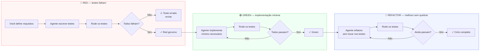

# TDD com Claude Code — test-first workflow

> [!abstract] TL;DR
> [[Dicionário de IA#TDD with AI|TDD]] com [[Dicionário de IA#Claude Code|Claude Code]] funciona quando você instrui o agente a seguir o ciclo Red/Green/Refactor explicitamente — não quando você espera que ele faça isso sozinho. O padrão: peça os testes primeiro, rode-os para confirmar falha, depois peça a implementação. A chave é tratar os testes como **contrato executável**: você especifica o comportamento esperado; o agente implementa para satisfazê-lo. Sem essa separação, o agente naturalmente escreve testes depois da implementação — e os testes ficam enviesados pelo código que ele mesmo criou.

## O problema padrão

Sem instrução explícita, o [[Dicionário de IA#Agent|agente]] tende a:

1. Ler o código existente
2. Implementar a feature
3. Escrever testes para a implementação que acabou de criar

Isso é test-after, não TDD. Os testes ficam enviesados pela implementação — testam o que o código faz, não o que deveria fazer.

## Por que funciona — o mecanismo

> [!question]- Por que separar "escreva os testes" de "implemente" faz diferença? O agente não pode fazer os dois ao mesmo tempo?

Pode. O problema não é capacidade técnica — é design de fora para dentro versus de dentro para fora.

Quando o agente implementa primeiro, ele toma decisões de design implicitamente: como nomear parâmetros, que exceções lançar, como estruturar o retorno. Depois, ao escrever os testes, ele testa *as decisões que já tomou* — não as decisões que você teria tomado.

Quando você escreve os testes primeiro (ou instrui o agente a fazê-lo), o contrato é definido antes da implementação existir. O agente não tem código para confirmar — só tem requisitos para interpretar. Isso força três coisas:

1. **Nomes de API vêm de fora**: `calculateTax(amount, category)` reflete como você quer usar a função, não como o agente achou mais fácil de implementar.
2. **Edge cases são explicitados antes**: você decide o que acontece com `amount negativo` antes de o agente ter oportunidade de silenciosamente retornar `0` ou lançar um erro genérico.
3. **O teste falha por razão certa**: um teste que falha com `calculateTax is not a function` confirma que a implementação não existe — um Red genuíno. Um teste que "passa" sem implementação significa que está testando algo que já existia, não o comportamento novo.

A analogia: é a diferença entre um arquiteto que desenha a planta antes de construir versus um pedreiro que constrói e depois tenta descrever o que construiu. Ambos produzem algo — mas só o primeiro garante que o resultado corresponde à intenção.



> [!summary] O ciclo Red/Green/Refactor não é disciplina por disciplina — é a sequência que garante que cada teste existe por uma razão, e cada linha de implementação existe para satisfazer um teste.

## O ciclo correto com Claude Code

### Red — escreva o teste que falha

```
você: "Escreva os testes para a função calculateTax(amount, category)
      em tests/services/taxCalculator.test.ts.

      Requisitos:
      - Produtos eletrônicos: 15% de imposto
      - Alimentos: 0% de imposto
      - Outros: 10% de imposto
      - amount negativo deve lançar InvalidAmountError
      - amount zero deve retornar 0

      NÃO implemente calculateTax ainda. Só os testes."
```

Depois de o agente escrever os testes:

```
você: "Rode npm test tests/services/taxCalculator.test.ts e
      confirme que todos os testes estão falhando."
```

Confirmar a falha é crucial — se algum teste passa sem implementação, ele está testando algo errado. Os dois casos mais comuns: (1) o agente testou uma função que já existia com outro nome; (2) o agente escreveu um teste que não testa nada (assertion vazia ou `expect(true).toBe(true)`).

### Green — implementação mínima

```
você: "Agora implemente calculateTax em src/services/taxCalculator.ts
      para fazer todos os testes passarem. Implementação mínima —
      não adicione nada além do que os testes exigem."
```

Verificação:

```
você: "Rode npm test tests/services/taxCalculator.test.ts"
```

O critério "implementação mínima" é intencional: evita que o agente adicione comportamentos que nenhum teste cobre (e que portanto podem ser silenciosamente errados).

> [!example] O que "mínimo" significa na prática
> Para `calculateTax` com 3 categorias testadas, implementação mínima é um mapa `{ electronics: 0.15, food: 0, other: 0.10 }` com lookup direto. Não é um sistema de plugins de alíquotas extensível para N categorias — isso seria antecipação. Se no futuro surgirem 10 categorias, os testes novos guiarão a extensão. YAGNI aplicado com rigor.

### Refactor — melhore sem quebrar

```
você: "Os testes estão passando. Refatore calculateTax para:
      - usar um mapa de categoria → alíquota em vez de if/else
      - extrair a validação de amount para validateAmount()
      Rode os testes depois para confirmar que continuam passando."
```

A regra do refactor: **os testes não mudam**. Se o agente modifica um teste durante o refactor, ele está mudando o contrato — não melhorando a implementação. Se você perceber que os testes precisam mudar, pare o refactor e trate isso como uma mudança de requisito — volte ao Red com os novos requisitos.

> [!info] "Implementação mínima" não significa código ruim
> Mínimo significa "não adicione comportamentos que nenhum teste cobre". Um mapa de categorias → alíquotas é implementação mínima se os testes só testam as 3 categorias. Um `switch/case` gigante com categorias que nenhum teste cobre não é mínimo — é antecipação não verificada.

## Prompt de TDD em um bloco

Para quem prefere dar a instrução completa de uma vez:

```
"Implemente calculateTax(amount: number, category: Category): number
seguindo TDD:

1. Escreva os testes em tests/services/taxCalculator.test.ts cobrindo:
   - Eletrônicos: 15%, Alimentos: 0%, Outros: 10%
   - amount negativo → InvalidAmountError
   - amount zero → retorna 0

2. Rode os testes e confirme que falham.

3. Implemente src/services/taxCalculator.ts com o mínimo para passar.

4. Rode os testes e confirme que passam.

5. Refatore se necessário, rodando os testes novamente."
```

> [!info] Bloco único vs. passos separados
> O bloco único é conveniente, mas perde uma vantagem do ciclo manual: você não pode inspecionar os testes antes da implementação. Se o agente escrever testes errados, você só descobre quando a implementação "passa" — mas passa nos testes errados. Para tarefas críticas, prefira o ciclo manual passo a passo.

## Casos práticos

### Caso 1: feature nova com requisitos claros

Você quer um módulo de desconto por volume. As regras são conhecidas e documentadas na spec.

```
você: "Escreva os testes para calculateVolumeDiscount(quantity, unitPrice):
      - 1-9 unidades: sem desconto
      - 10-49 unidades: 5% de desconto
      - 50-99 unidades: 10% de desconto
      - 100+ unidades: 15% de desconto
      - quantity <= 0 deve lançar InvalidQuantityError
      NÃO implemente. Só os testes."

agente: [escreve 8 testes cobrindo os casos]

você: "Rode os testes."

agente: "8 testes falhando. calculateVolumeDiscount is not a function."

você: "Perfeito. Agora implemente o mínimo para passar."
```

Os testes funcionam como documentação executável: qualquer dev que ler os testes entende as regras de negócio sem precisar ler a spec.

---

### Caso 2: bug fix com regressão garantida

Bug relatado: o endpoint de pagamento retorna status 200 mesmo quando o cartão é recusado, desde que o amount seja zero.

```
você: "Temos um bug: PaymentService.charge() retorna { success: true }
      quando amount === 0 com qualquer cartão (mesmo inválido).
      Comportamento correto: amount 0 deve retornar { success: true }
      sem chamar o gateway — é um pagamento gratuito, não um erro.
      MAS amount negativo deve lançar InvalidAmountError.

      1. Escreva um teste que reproduz o comportamento errado atual.
      2. Rode e confirme que o teste falha (o bug existe).
      3. Corrija PaymentService.charge().
      4. Rode todos os testes e confirme que o novo passa e nenhum
         antigo quebrou."
```

O teste de regressão garante que o bug não volta em refactors futuros — mesmo que o agente (ou outro dev) não lembre da correção.

---

### Caso 3: refactoring com suite existente

Você tem 40 testes para `OrderService`. Quer extrair a lógica de precificação para `PricingService` sem quebrar o comportamento.

```
você: "Refatore OrderService para extrair toda a lógica de precificação
      para um novo PricingService em src/services/pricing.ts.
      
      Regras:
      - NÃO modifique os testes existentes (eles testam comportamento)
      - A interface pública de OrderService não pode mudar
      - Depois do refactor, rode npm test e confirme que todos passam"
```

A suite existente é a rede de segurança. O agente sabe que qualquer quebra de comportamento aparecerá imediatamente.

Os testes escritos via TDD funcionam também como documentação viva: um desenvolvedor novo (ou o agente em uma sessão futura) pode ler a suite e entender o que o módulo faz — sem precisar decifrar a implementação. O que a implementação *não deve fazer* fica igualmente documentado nos testes de edge case e erro.

## TDD com Plan Mode — combinando os dois workflows

Plan Mode e TDD se complementam naturalmente para tarefas complexas:

```
Fase 1 — Plan Mode define o escopo:
Shift+Tab →
"Preciso implementar um módulo de autenticação com JWT.
Quais arquivos você vai criar/modificar?"

agente: "Plano:
- src/auth/jwtService.ts — geração e verificação de tokens
- src/auth/authMiddleware.ts — middleware para rotas protegidas
- src/auth/userValidator.ts — validação de credenciais
- tests/auth/ — suite de testes"

você: "Aprovado. Escopo claro."

---

Fase 2 — TDD implementa:
"Seguindo o plano aprovado, comece pela jwtService.
Escreva os testes primeiro:
- generateToken(userId, expiresIn) → string JWT válido
- verifyToken(token) → { userId } ou lança TokenExpiredError
- verifyToken com token inválido → lança InvalidTokenError
NÃO implemente. Só os testes."
```

O Plan Mode deu visibilidade sobre o escopo total; o TDD garantiu que cada módulo foi construído com especificação antes de implementação. As duas disciplinas operam em camadas diferentes: Plan Mode no nível da tarefa, TDD no nível do comportamento de cada unidade.

## TDD em modo headless

Em pipelines de automação, você pode usar TDD como gate de qualidade:

```bash
# Pipeline de feature com TDD forçado
claude -p "Implemente o serviço de notificação seguindo TDD:
1. Escreva os testes em tests/notifications/
2. Rode os testes — PARE se algum passar antes da implementação
3. Implemente src/notifications/
4. Rode os testes — PARE se algum falhar
5. Retorne o número de testes criados e o resultado final" \
--output-format json > tdd-report.json

# Verificar se todos os testes passaram
cat tdd-report.json | jq '.result | test("testes passando")'
```

> [!info] Headless TDD exige output estruturado
> Em modo headless, o agente não tem você para confirmar cada passo. Instrua-o explicitamente a parar se a suite Red não falhar completamente — e a parar se a suite Green não passar completamente. Sem essas instruções, ele pode continuar mesmo com o ciclo comprometido.

## Cobertura guiada

Depois do ciclo TDD, peça análise de cobertura para identificar gaps:

```
"Rode npm test -- --coverage para src/services/taxCalculator.ts.
Identifique branches não cobertos e adicione testes para eles."
```

> [!info] Cobertura não é TDD retroativo
> Adicionar testes para branches descobertos *depois* da implementação é teste de confirmação, não TDD. O valor está em identificar casos que você não previu nos requisitos — e que o agente pode ter tratado de forma arbitrária. Se a cobertura revela um branch inesperado, vale entender o comportamento antes de escrever o teste.

## Armadilhas comuns

> [!warning] "Escreva testes e implemente" no mesmo prompt
> O agente escreve tudo junto, sem o ciclo Red/Green. O resultado são testes que confirmam a implementação, não que especificam o contrato. Separe explicitamente as etapas — ou use o formato de bloco numerado que inclui "rode os testes e confirme que falham" como passo obrigatório.

> [!warning] Não confirmar a falha no Red
> Se o agente escreve um teste que já passa (porque a função existia com outro nome, ou o comportamento estava implementado em outro lugar), você não descobriu nada novo. Confirmar a falha no Red é o mecanismo que valida que o teste é necessário. Sem essa confirmação, você pode ter uma suite cheia de testes que nunca foram vermelhos — e portanto nunca provaram nada.

> [!warning] Testes que testam detalhes de implementação
> `"deve chamar o método getRate() internamente"` não é um teste de comportamento — é um teste de implementação. Se você refatorar para `getRateByCategory()`, o teste quebra sem que o comportamento tenha mudado. Escreva testes de comportamento: `"deve retornar 15 para amount=100 com category='electronics'"`. O agente, se não for instruído, tende a escrever testes de estado interno — corrija antes do Green.

> [!warning] Over-specification antes da implementação
> Pedir ao agente para escrever testes para cada permutação possível de entradas antes de implementar atrasa o ciclo e gera testes de baixo valor. Comece com os 5-7 casos críticos (happy path + principais edge cases + erros esperados). Adicione granularidade na fase de cobertura, depois que o comportamento básico está garantido.

## Quando TDD com Claude Code não compensa

TDD tem custo: dois passos (testes + implementação) onde poderia ser um. Esse custo se paga em situações onde o contrato é importante — mas há casos onde não faz sentido.

| Situação | TDD compensa? | Motivo |
|----------|--------------|--------|
| Feature nova com requisitos claros | ✓ Sim | Os requisitos viram especificação executável |
| Bug fix | ✓ Sim | O teste de regressão garante que o bug não volta |
| Refactoring com suite existente | ✓ Sim | A suite existente é a rede de segurança |
| Script de uso único (migration, seed) | ✗ Não | Vai rodar uma vez; custo de testes supera o benefício |
| Prototipagem / spike | ✗ Não | O objetivo é explorar, não especificar |
| Código gerado (DTOs, types, migrations) | ✗ Não | O comportamento é trivial ou derivado de schema |
| Glue code entre APIs externas | ⚠ Depende | Mock pesado pode tornar os testes frágeis |

> [!question]- O agente pode decidir sozinho quando usar TDD?
> Não de forma confiável. O agente pode inferir que "feature nova" sugere TDD — mas ele não sabe se o código vai para produção, se há suite existente, ou se é um spike. A decisão de quando aplicar TDD é sua; a execução do ciclo pode ser delegada ao agente.

## Como explicar em inglês

**TDD with Claude Code** is a workflow where you explicitly instruct the agent to follow the Red/Green/Refactor cycle rather than letting it write tests and implementation together.

The core pattern:
1. Ask the agent to write tests only ("do NOT implement yet")
2. Run the tests to confirm they all fail (Red)
3. Ask for the minimum implementation to make them pass (Green)
4. Ask for refactoring with the constraint that tests cannot be modified (Refactor)

TDD with Claude Code requires explicit orchestration of the three phases. Unlike a human developer who internalizes the discipline, the agent needs the constraint stated in the prompt: "write tests only, do NOT implement yet."

**In a technical interview**, you might say:

> "Without explicit instruction, Claude Code defaults to test-after — it implements first, then writes tests that confirm the implementation. TDD with Claude Code requires you to enforce the separation: tests first as executable specifications, then implementation to satisfy those specs. The key insight is that the agent treats tests as a contract it must satisfy, not as documentation of what it already built."

### Tabela PT ↔ EN

| Português | English | Contexto |
|-----------|---------|----------|
| Ciclo Red/Green/Refactor | Red/Green/Refactor cycle | o padrão TDD |
| Teste que falha | Failing test / Red test | fase Red |
| Implementação mínima | Minimal implementation / make it pass | fase Green |
| Contrato executável | Executable specification / executable contract | o que os testes representam |
| Cobertura de código | Code coverage | após TDD |
| Teste de regressão | Regression test | bug fix com TDD |
| Test-after | Test-after (sem tradução) | antipadrão |
| Suite de testes | Test suite | conjunto de testes |
| Edge case | Edge case / corner case | caso limite |
| Rede de segurança | Safety net | papel dos testes no refactor |

## Sinais de que o ciclo está funcionando

Após algumas sessões de TDD com Claude Code, você reconhece esses sinais de que o workflow está saudável:

- Os testes que o agente escreve na fase Red *às vezes* te surpreendem — ele interpretou um requisito de forma diferente da que você esperava. Isso é bom: é exatamente a divergência que o ciclo deve revelar antes da implementação.
- A fase Green é rápida. Se o agente leva muito tempo para fazer os testes passarem, provavelmente os testes especificaram uma interface diferente da implementação natural — vale revisar se os testes estão corretos.
- A fase Refactor não quebra testes. Se quebra, o agente estava testando implementação, não comportamento.
- Você raramente encontra bugs em produção que não existiam nos testes.

> [!question]- E se o agente escrever testes ruins mesmo seguindo o ciclo?
> Acontece. O agente pode escrever testes frágeis (dependem de ordem de execução), testes acoplados (um teste chama outro), ou testes que testam a implementação disfarçados de testes de comportamento. A fase de revisão do plano — antes de aprovar os testes — é onde você corrige isso. Leia os testes antes de pedir a implementação.

## O que vem a seguir

TDD com Claude Code é o workflow de *construção controlada*. Depois que você tem uma suite confiável, o agente pode fazer mudanças maiores com segurança — porque qualquer comportamento quebrado aparece imediatamente, não em produção. Uma vez que você tem uma suite de testes confiável, dois workflows naturalmente se seguem:

- **[[03-Dominios/Tecnologia/IA/Claude Code/Workflows/03 - Refactoring pesado|03 - Refactoring pesado]]** — a suite TDD que você acabou de criar é a rede de segurança para refactors. O agente pode fazer mudanças estruturais grandes com confiança de que qualquer quebra de comportamento aparece imediatamente nos testes.
- **[[03-Dominios/Tecnologia/IA/Claude Code/Workflows/04 - Debugging complexo|04 - Debugging complexo]]** — quando um bug aparece numa codebase com boa cobertura TDD, o debug começa por escrever um teste que reproduz o bug — e então o agente corrige até o teste passar. A suite existente garante que a correção não introduz regressões.

A progressão: TDD define o contrato → Refactoring respeita o contrato → Debugging restaura o contrato quando ele é quebrado. Juntos, os três workflows formam um ciclo de desenvolvimento onde o agente tem sempre um critério objetivo de sucesso — não uma descrição vaga do que "deveria funcionar".

## Veja também

- [[03-Dominios/Tecnologia/IA/Claude Code/Workflows/01 - Plan Mode|01 - Plan Mode]] — planejar a estrutura de testes antes de escrever
- [[03-Dominios/Tecnologia/IA/Claude Code/Workflows/03 - Refactoring pesado|03 - Refactoring pesado]] — TDD como rede de segurança em refactors
- [[03-Dominios/Tecnologia/IA/Claude Code/Workflows/09 - Prompting para Claude Code|09 - Prompting para Claude Code]] — precisão no prompt para TDD funcionar
- [[03-Dominios/Tecnologia/IA/Claude Code/Workflows/index|Workflows]] — índice do galho

## Referências

- [Claude Code — TDD workflow](https://docs.anthropic.com/en/docs/claude-code/tutorials#test-driven-development) — tutorial oficial de TDD com Claude Code
- [Martin Fowler — Test Driven Development](https://martinfowler.com/bliki/TestDrivenDevelopment.html) — fundamentos do ciclo Red/Green/Refactor
- [Kent Beck — Test-Driven Development by Example](https://www.oreilly.com/library/view/test-driven-development/0321146530/) — referência canônica do TDD
- [Claude Code — testing best practices](https://docs.anthropic.com/en/docs/claude-code/tutorials) — guia oficial de testes com Claude Code
- [Martin Fowler — TestDouble](https://martinfowler.com/bliki/TestDouble.html) — quando usar mocks vs. stubs nos testes escritos pelo agente
- [Fowler — Mocks Aren't Stubs](https://martinfowler.com/articles/mocksArentStubs.html) — distinção clássica que afeta como o agente escreve testes com dependências externas
- [Kent Beck — TDD by Example — capítulo 1](https://www.oreilly.com/library/view/test-driven-development/0321146530/ch01.html) — o ciclo Red/Green/Refactor em sua forma original
- [Robert C. Martin — The Three Laws of TDD](http://www.butunclebob.com/ArticleS.UncleBob.TheThreeRulesOfTdd) — as três regras que definem o rigor do ciclo
- [Claude Code — superpowers:test-driven-development skill](https://docs.anthropic.com/en/docs/claude-code/skills) — skill oficial que codifica o workflow TDD para Claude Code


