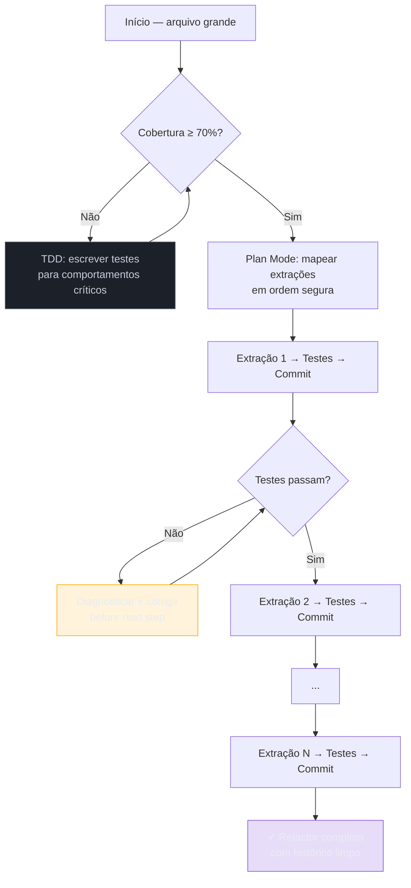

# Refactoring pesado — mudanças grandes sem perder controle

> [!abstract] TL;DR
> Refactoring pesado com [[Dicionário de IA#Claude Code|Claude Code]] requer 3 precauções: cobertura de testes antes de começar, atomização das mudanças em commits pequenos, e gestão ativa do contexto (sessões longas acumulam confusão). O padrão: [[Dicionário de IA#planning|Plan Mode]] para mapear o escopo, [[Dicionário de IA#TDD with AI|TDD]] como rede de segurança, commits frequentes como pontos de retorno. A diferença entre um refactor bem-sucedido e um fracassado raramente está no código — está em quantas coisas mudam de uma vez.

## O problema de refactors grandes

Sem estrutura, um refactor grande com Claude Code tende a:

- Fazer muitas mudanças ao mesmo tempo, tornando o diff incompreensível
- Perder o [[Dicionário de IA#Context window|contexto]] da intenção original à medida que a sessão cresce
- Quebrar comportamento existente sem um teste avisando
- Resultar num estado intermediário que não funciona nem compila

## Por que funciona — o mecanismo

> [!question]- Por que "commitar frequentemente" muda o resultado? O código vai acabar sendo o mesmo, certo?

O código final pode ser o mesmo — mas o caminho importa por três razões:

**1. Reversibilidade granular.** Um commit a cada extração significa que se a extração de `NotificationService` introduzir um bug, você reverte *só aquele passo* com `git revert`, não desfaz uma hora de trabalho. Sem commits atômicos, seu único fallback é `git checkout HEAD` — que apaga tudo.

**2. Reviewabilidade.** Um diff de 800 linhas misturando extração de pricing, notifications e validations é impossível de revisar. Três diffs de ~250 linhas cada, com propósito claro, são revisáveis. Code review humano e revisão do próprio agente ficam mais precisos quando o escopo é menor.

**3. Contexto limpo entre passos.** Cada commit é um ponto natural para `/compact` ou para iniciar sessão nova. O agente começa o próximo passo com o estado do repositório como referência, não com o histórico de raciocínio acumulado da sessão.



> [!summary] Refactor pesado = N refactors pequenos em sequência, cada um verificado e commitado. O agente não fica mais inteligente com mais contexto — fica mais confuso.

## Pré-condição: cobertura de testes

Antes de começar qualquer refactor significativo, verifique a cobertura:

```
"Rode npm test -- --coverage e me mostre a cobertura de
src/services/orders.ts. Precisamos ter pelo menos 70% de cobertura
nos comportamentos críticos antes de refatorar."
```

Se a cobertura for insuficiente:

```
"Antes de refatorar, escreva testes para os comportamentos
principais de OrderService: criação de pedido, cálculo de total
com desconto, e cancelamento com estorno. Cubra o happy path
e os casos de erro mais críticos."
```

> [!info] Por que 70% e não 100%?
> 100% de cobertura antes de um refactor é ideal mas raramente prático em código legado. 70% nos comportamentos *críticos* (não no código total) é o threshold que garante que a suite vai detectar regressões nas partes que mais importam. Código de logging, fallbacks de erro e paths raramente usados podem ter cobertura menor sem comprometer a segurança do refactor.

## Padrão de execução

### 1. Plan Mode para mapear o escopo

```
Shift+Tab →
"Quero refatorar src/services/orders.ts (450 linhas) para:
- Extrair lógica de cálculo de preços para src/services/pricing.ts
- Extrair lógica de notificações para src/services/notifications.ts
- Deixar OrderService responsável apenas por orquestração

Antes de começar, faça um plano com:
- Quais funções vão para cada arquivo
- Qual a ordem de extração (o que extrair primeiro)
- Quais testes precisamos verificar em cada etapa"
```

O plano revela dependências ocultas: se `calculateTotal()` chama `sendNotification()` internamente, extrair pricing antes de notifications vai quebrar a ordem. Plan Mode expõe isso antes de qualquer arquivo ser tocado.

> [!question]- E se o plano estiver errado após a primeira extração?
> Acontece. A primeira extração pode revelar dependências que o plano inicial não tinha identificado. Nesse caso, revise o plano antes de continuar — não force a segunda extração seguindo o plano original. O custo de revisar o plano é muito menor que o de desfazer uma extração mal-feita.

### 2. Atomize em commits pequenos

Em vez de "refatore tudo de uma vez":

```
"Vamos fazer um passo de cada vez, commitando depois de cada extração.

Passo 1: extraia apenas as funções calculateTotal(), applyDiscount()
e calculateTax() para src/services/pricing.ts. Rode os testes,
confirme que passam, e commite como 'refactor: extract pricing logic'."
```

Depois que o commit for feito:

```
"Passo 2: extraia sendOrderConfirmation(), sendCancellationEmail()
para src/services/notifications.ts..."
```

Cada commit é um ponto de retorno. Se algo der errado, `git revert` volta ao estado anterior sem desfazer todo o trabalho.

### 3. Verificação contínua

Depois de cada extração:

```
"Rode npm test. Se houver falhas, mostre o erro completo antes
de tentar corrigir — preciso saber se é problema de import,
assinatura de função ou comportamento diferente."
```

Pedir o erro completo antes da correção é importante: o agente tende a tentar corrigir imediatamente, às vezes gerando uma correção que mascara o problema real. Ver o stack trace completo — antes de qualquer tentativa de fix — permite distinguir se o problema é de import, assinatura de função ou comportamento diferente. Esses três casos têm soluções completamente diferentes.

## Strangler fig para mudanças de arquitetura

Para mudanças mais profundas — migrar de callbacks para async/await, trocar ORM, mudar padrão de injeção de dependência — use o padrão **strangler fig**: faça o novo coexistir com o velho e migre incrementalmente.

O nome vem da figueira-estranguladora (*Ficus aurea*), que cresce em torno de uma árvore hospedeira até substituí-la completamente — sem matar a hospedeira antes de estar pronta para sustentá-la sozinha. O código novo envolve o antigo sem quebrá-lo, até que o antigo pode ser removido com segurança.

```
"Vamos migrar OrderRepository de callbacks para Promises.
Estratégia strangler fig:
1. Duplicar cada método com versão Promise (ex: findByIdAsync)
2. Marcar o callback original como @deprecated
3. Migrar os callers um a um para a versão async
4. Só remover a versão callback quando nenhum caller a usar mais

Comece com findById(). Crie findByIdAsync() ao lado do findById()
existente. Atualize os callers de findById em OrderService para
usar a versão async. Confirme com os testes que o comportamento
é idêntico."
```

A vantagem do strangler fig sobre "reescrever de uma vez": em nenhum momento o sistema fica em estado não-funcional. A versão antiga continua operacional enquanto a nova é construída ao lado. Você pode fazer deploy a qualquer momento sem travar o sistema num estado intermediário — e reverter para a versão antiga em segundos se a nova apresentar problemas.

> [!info] Strangler fig requer disciplina de nomenclatura
> `findById` vs. `findByIdAsync`, `OrderService` vs. `OrderServiceV2`, `PaymentGateway` vs. `PaymentGatewayStripe` — a convenção de nome importa porque os dois sistemas coexistem. Instrua o agente explicitamente sobre o padrão de nomenclatura antes de começar, senão ele pode escolher nomes que colidem ou confundem.

## Gestão de contexto em refactors longos

Refactors longos são onde o [[Dicionário de IA#Context window|contexto]] do agente mais se degrada. Estratégias:

**Commit e `/compact` periodicamente:**
```
"Commitamos a extração de PricingService. Vou fazer /compact
antes de continuar para o próximo passo."
```

**Restate a intenção ao retomar:**
```
"Retomando o refactor de OrderService. Já extraímos:
- PricingService (commit abc123)
- NotificationService (commit def456)

Próximo passo: extrair ValidationService das funções
validateOrderItems() e validateCustomerLimit()."
```

**Sessões novas para fases distintas:** Para refactors muito grandes (>1 dia de trabalho), considere uma sessão por fase. O CLAUDE.md do projeto orienta cada sessão nova com o estado atual e o que já foi feito.

**Documente o estado no CLAUDE.md durante o refactor:**
```markdown
# Estado atual do refactor (2026-06-27)
## Objetivo
Decompor OrderService (800 linhas) em 4 módulos.

## Concluído
- [x] PricingService extraído (commit abc123)
- [x] NotificationService extraído (commit def456)

## Próximo passo
- [ ] Extrair ValidationService (validateItems, validateCustomerLimit)

## Convenções deste refactor
- Cada extração em commit separado com prefixo 'refactor:'
- Testes devem passar antes de cada commit
- Não misturar extração com mudanças de comportamento
```

Isso garante que qualquer sessão nova — sua ou do agente — começa sabendo exatamente onde está o refactor.

> [!info] Por que o contexto degrada?
> A janela de contexto do agente acumula o histórico da sessão — não apenas a conversa, mas os arquivos lidos e os raciocínios intermediários. Num refactor longo, o agente pode "lembrar" de uma decisão tomada 2 horas atrás que foi revertida 1 hora atrás. `/compact` ou sessão nova reseta esse acúmulo; restating da situação atual garante que o agente parte do estado real do repositório, não de um estado inferido do histórico.

## Casos práticos

### Caso 1: extração de módulos de um service God Object

`OrderService` tem 800 linhas fazendo precificação, notificações, validação e persistência.

**Plano de execução:**
```
Plan Mode →
"OrderService.ts tem 800 linhas. Quero extrair em 4 sessões:
Sessão 1: pricing (calculateTotal, applyDiscount, calculateTax)
Sessão 2: notifications (sendConfirmation, sendCancellation)
Sessão 3: validation (validateItems, validateCustomerLimit)
Sessão 4: refinar o core de orquestração

Para cada sessão: liste as funções, dependências, e testes afetados."
```

Após o plano:
- Sessão 1: extração + testes + commit + `/compact`
- Sessão 2 (nova sessão): restate + extração + commit
- Até a sessão 4, cada módulo tem responsabilidade única e historico limpo

---

### Caso 2: migração de ORM

Migrar de Sequelize para Prisma num projeto com 15 repositories.

**Por que não reescrever tudo de uma vez:** Sequelize e Prisma têm modos de operação diferentes (instância global vs. client injetado). Uma reescrita total cria um estado intermediário que não funciona por dias. Você não pode fazer deploy parcialmente — o sistema fica travado até a migração completa, que pode levar semanas.

**Com strangler fig:**
```
"Vamos migrar um repository por vez, mantendo os testes passando
em cada etapa.

UserRepository primeiro (menor, menos dependências).
1. Criar PrismaUserRepository ao lado de SequelizeUserRepository
2. Atualizar o container de DI para injetar Prisma em UserRepository
3. Rodar os testes de integração
4. Só então apagar SequelizeUserRepository

Próximo repository: OrderRepository. E assim até os 15."
```

---

### Caso 3: mover para arquitetura em camadas

Projeto flat (tudo em `/controllers`) precisa migrar para `/controllers`, `/services`, `/repositories`.

```
"O projeto tem toda a lógica em controllers. Quero introduzir
camadas, mas sem quebrar nada.

Estratégia:
1. Identificar a lógica de negócio em cada controller
2. Para cada endpoint: extrair lógica para um service correspondente
   (o controller passa a chamar o service — sem mudar a API HTTP)
3. Para cada service: extrair queries para um repository
   (o service passa a chamar o repository — sem mudar a interface)

Ordem: comece pelo UserController (menor). Commit depois de
cada controller migrado."
```

## Refactoring em código sem testes — o caso especial

E quando você herda um repositório sem testes e precisa refatorar? Não dá para esperar cobertura total antes de começar — mas tampouco pode ignorar a ausência de testes.

A abordagem segura é o **characterization testing**: antes de qualquer refactor, você escreve testes que *documentam o comportamento atual*, não o comportamento correto.

```
"Antes de refatorar OrderService, precisamos characterization tests.
Não vamos testar se o comportamento está certo — vamos capturar
exatamente o que o código faz hoje, incluindo os comportamentos
possivelmente errados.

Para cada método público:
1. Chame-o com entradas representativas
2. Capture o output atual
3. Escreva um teste que expect esse output

Depois do refactor, todos esses testes devem continuar passando —
o que garante que o comportamento não mudou, mesmo que estivesse errado."
```

> [!warning] Characterization tests não certificam correção
> Eles certificam que o comportamento *não mudou*. Se o código tinha um bug antes, os characterization tests vão "certificar o bug". Isso é intencional: você quer saber que o refactor não introduziu *novos* problemas. Bugs pré-existentes são corrigidos depois, com testes de regressão próprios.

## Refactor com múltiplos arquivos em paralelo

Para refactors que tocam muitos arquivos (ex: renomear um campo em toda a codebase), o agente pode trabalhar em paralelo — mas com risco de conflitos se editar o mesmo arquivo mais de uma vez.

O padrão seguro:

```
"Quero renomear o campo 'user_name' para 'display_name' em toda a base.

Passo 1: liste todos os arquivos que usam 'user_name' (grep).
Passo 2: para cada arquivo listado, faça a substituição — mas
         edite um arquivo de cada vez, confirmando que os testes
         passam antes de passar para o próximo.

NÃO use search-and-replace global. Alguns usos podem ser em comentários,
strings de log ou nomes de variáveis diferentes — precisamos revisar cada um."
```

A instrução "um arquivo de cada vez" parece lenta — mas é mais segura do que um search-and-replace global que substitui ocorrências em contextos errados (column names no SQL, variáveis locais, comentários).

> [!info] Quando search-and-replace global é aceitável
> Renomeação de símbolo em código TypeScript/Java com suporte de LSP, onde o agente usa "rename symbol" em vez de text replace. Nesses casos, o LSP garante que só os usos do símbolo são renomeados, não strings arbitrárias. Verifique se o agente tem acesso ao LSP antes de confiar no rename global.

> [!tip] Assista: Automating Large Scale Refactors with Parallel Agents
> **Canal:** OpenHands (Robert Brennan) | **Duração:** ~76min | **Idioma:** EN
>
> Esta talk trata do próximo degrau do "um arquivo de cada vez": quando o refactor é grande o bastante para valer a pena rodar *vários* agentes em paralelo, não em série. Brennan propõe critérios concretos pra decompor a tarefa — algo que este galho ainda não formaliza — antes de disparar agentes simultâneos: cada sub-tarefa precisa (1) caber num único commit/PR, resolvível num "one-shot" sem iteração; (2) ser verificável rápido (CI verde = confiança); (3) ter dependências explícitas entre si, igual dividir trabalho entre uma equipe de engenheiros. Trecho de destaque [27:51]: *"You're really looking to break down your very big problem into tasks that a single agent can solve, a single agent can one-shot. Something that can fit in a single commit, single pull request."*
>
> 🎬 [Assistir no YouTube](https://www.youtube.com/watch?v=rcsliSIy_YU)

## Armadilhas comuns

> [!warning] "Refatore o serviço inteiro de uma vez"
> Sem atomização, o agente faz mudanças demais e o diff vira ilegível. Revisão fica impossível, e qualquer bug introduzido não tem ponto de retorno claro. A regra: nenhum commit de refactor deve tocar mais de 1 responsabilidade por vez.

> [!warning] Começar sem cobertura de testes
> Sem suite de testes, você só descobre que o refactor quebrou algo quando vai para produção. O agente pode ter silenciosamente mudado o comportamento de um edge case que não havia teste cobrindo. Cobertura mínima antes de começar não é perfeccionismo — é o único mecanismo de detecção que você tem.

> [!warning] Misturar refactor com feature
> "Refatore OrderService E adicione suporte a cupom de desconto" cria um diff que mistura duas intenções. Se houver bug, não fica claro se veio do refactor ou da feature nova. Regra: refactor first, feature after. Em commits separados, em sessões separadas se possível.

> [!warning] Deixar o contexto degradar sem /compact
> Em sessões longas de refactor, o agente acumula decisões intermediárias e estados anteriores no contexto. Isso pode levá-lo a "lembrar" de uma estrutura que foi refatorada 3 passos atrás e escrever código que importa de um módulo que não existe mais. Commit + `/compact` + restate a cada fase maior previne esse drift.

## Como explicar em inglês

**Heavy refactoring with Claude Code** is a structured workflow for making large-scale structural changes while maintaining system stability. The three core constraints are: test coverage before starting, atomic commits after each extraction, and active context management for long sessions.

The key insight is that the agent doesn't get smarter with more context in long sessions — it gets noisier. Breaking a large refactor into N small, committed steps keeps each agent invocation focused and reversible.

**In a technical interview**, you might say:

> "Refactoring with Claude Code works best when you treat the agent as a precise executor rather than an autonomous architect. You plan the decomposition (using Plan Mode), the agent executes one extraction at a time, you verify with tests, and you commit before the next step. The strangler fig pattern is particularly effective for architectural migrations because the system never enters a non-functional intermediate state."

### Tabela PT ↔ EN

| Português | English | Contexto |
|-----------|---------|----------|
| Refactoring pesado | Heavy refactoring | mudança estrutural grande |
| Extração de módulo | Module extraction | tirar responsabilidade de um arquivo |
| Ponto de retorno | Rollback point / checkpoint | o que o commit atômico garante |
| Cobertura de testes | Test coverage | pré-condição do refactor |
| Strangler fig | Strangler fig pattern | padrão de migração incremental |
| Degradação de contexto | Context drift / context degradation | problema em sessões longas |
| Atomização de commits | Atomic commits | estratégia de commits pequenos |
| God Object | God Object (sem tradução) | antipadrão de classe com muitas responsabilidades |
| Responsabilidade única | Single responsibility | SRP aplicado ao refactor |

## O que vem a seguir

Refactoring pesado ensina a disciplina de mudança controlada: escopo claro, verificação contínua, histórico limpo. Essa mesma disciplina é transferível para outros tipos de mudança de alta complexidade.

Depois de dominar refactoring pesado, o próximo desafio natural é **debugging complexo** — que compartilha a mesma disciplina de atomização e preservação de contexto, mas em sentido inverso: em vez de decompor para simplificar, você decompõe para isolar a causa de um comportamento inesperado.

- **[[03-Dominios/Tecnologia/IA/Claude Code/Workflows/04 - Debugging complexo|04 - Debugging complexo]]** — isolar a causa de bugs com o mesmo rigor de atomização
- **[[03-Dominios/Tecnologia/IA/Claude Code/Workflows/10 - Gestão de contexto|10 - Gestão de contexto]]** — estratégias completas para sessões longas
- **[[03-Dominios/Tecnologia/IA/Claude Code/Mental Model/06 - Compaction|06 - Compaction]]** — como `/compact` funciona internamente e quando usá-lo

## Veja também

- [[03-Dominios/Tecnologia/IA/Claude Code/Workflows/01 - Plan Mode|01 - Plan Mode]] — mapear o escopo antes de começar
- [[03-Dominios/Tecnologia/IA/Claude Code/Workflows/02 - TDD com Claude Code|02 - TDD com Claude Code]] — cobertura como rede de segurança
- [[03-Dominios/Tecnologia/IA/Claude Code/Workflows/10 - Gestão de contexto|10 - Gestão de contexto]] — manter qualidade em sessões longas
- [[03-Dominios/Tecnologia/IA/Claude Code/Mental Model/06 - Compaction|06 - Compaction]] — como /compact funciona
- [[03-Dominios/Tecnologia/IA/Claude Code/Workflows/index|Workflows]] — índice do galho

## Fontes

- [Martin Fowler — Strangler Fig Application](https://martinfowler.com/bliki/StranglerFigApplication.html) — padrão canônico de migração incremental
- [Martin Fowler — Refactoring: Improving the Design of Existing Code](https://martinfowler.com/books/refactoring.html) — referência clássica de técnicas de refactoring
- [Claude Code — long sessions best practices](https://docs.anthropic.com/en/docs/claude-code/how-claude-code-works) — gestão de contexto em sessões longas
- [Michael Feathers — Working Effectively with Legacy Code](https://www.oreilly.com/library/view/working-effectively-with/0131177052/) — técnicas de refactoring em código sem testes, incluindo characterization testing
- [Martin Fowler — Parallel Change](https://martinfowler.com/bliki/ParallelChange.html) — padrão de expansão/migração/contração, complementar ao strangler fig


