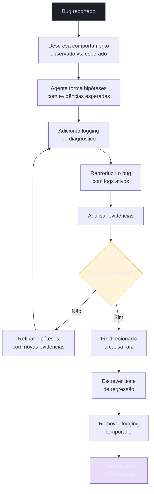

# Debugging complexo — diagnosticar, não só corrigir

> [!abstract] TL;DR
> O erro mais comum ao debugar com [[Dicionário de IA#Claude Code|Claude Code]] é pedir a correção antes de ter a causa raiz. O [[Dicionário de IA#Agent|agente]] aplica um fix plausível que resolve o sintoma mas não o problema real. O padrão correto: descreva o comportamento observado vs. esperado, deixe o agente formar e testar hipóteses, confirme a causa com evidências antes de aceitar qualquer fix. Debugging eficaz com Claude Code é sobre conduzir uma investigação — não sobre delegar a solução.

## O anti-padrão

```
você: "O endpoint POST /api/orders está retornando 500.
      Corrija."

agente: [olha o stack trace, adiciona try/catch em volta do código,
        o erro para de aparecer]

resultado: o erro foi silenciado, não corrigido.
```

Esse é o cenário mais perigoso: o comportamento observável melhorou (500 virou 201), mas a causa raiz — um produto sem preço sendo processado silenciosamente, por exemplo — continua presente e vai manifestar de outra forma depois.

## Por que funciona — o mecanismo

> [!question]- Por que o agente aplica o fix errado quando você pede "corrija"?

Porque a instrução "corrija" define o objetivo como "eliminar o sintoma visível", não "resolver a causa". O agente é extremamente bom em satisfazer objetivos especificados — e o objetivo especificado era tirar o 500, não corrigir a lógica de negócio.

O mecanismo correto separa explicitamente dois modos:

1. **Modo diagnóstico**: o agente lê código, coleta evidências, forma hipóteses. Nenhuma mudança no código.
2. **Modo correção**: depois da causa confirmada, o agente aplica o fix direcionado exatamente àquela causa.

A separação é análoga ao trabalho de um médico: exame clínico e exames complementares *antes* de prescrever. Um médico que prescreve antibiótico para qualquer febre pode acertar — mas às vezes está tratando uma infecção viral com um remédio que não vai funcionar (e que tem efeitos colaterais).



> [!summary] Diagnosticar antes de corrigir não é mais lento — é mais rápido. Um fix direcionado a uma causa confirmada raramente precisa de iterações. Um fix para um sintoma frequentemente esconde o problema e aparece de novo.

## O padrão correto

### 1. Descreva o comportamento, não o fix desejado

```
"O endpoint POST /api/orders retorna 500 com esta payload:
{
  'customerId': 'c123',
  'items': [{'productId': 'p456', 'quantity': 2}]
}

Comportamento esperado: criar o pedido e retornar 201 com o id.
Comportamento observado: 500 Internal Server Error.

Stack trace nos logs:
TypeError: Cannot read properties of undefined (reading 'price')
at calculateTotal (src/services/pricing.ts:47)

Analise a causa raiz antes de sugerir qualquer fix."
```

A instrução "analise a causa raiz antes de sugerir qualquer fix" é o gatilho que ativa o modo diagnóstico no agente.

### 2. Hipóteses e evidências

Instrua o agente a trabalhar como detetive:

```
"Antes de corrigir, forme hipóteses sobre por que 'price' seria
undefined. Para cada hipótese, indique qual evidência confirmaria
ou descartaria. Depois adicione logging para coletar essas evidências."
```

Agente:
```
Hipóteses:
1. productId 'p456' não existe no banco → price vem como undefined
   Confirmar: logar o resultado da query getProduct('p456')

2. getProduct retorna o produto mas sem o campo price
   Confirmar: logar os campos do objeto retornado

3. Race condition: produto existe mas foi deletado entre o
   fetch e o cálculo
   Confirmar: verificar se há soft-delete em produtos

Adicionando logging temporário para coletar evidências...
```

### 3. Coletar evidências antes de corrigir

```
"Adicione o logging de diagnóstico. Depois vou reproduzir o erro
e te mostrar o output dos logs. Não modifique a lógica ainda."
```

Depois de reproduzir:
```
"Output dos logs:
getProduct('p456') retornou: { id: 'p456', name: 'Monitor' }
— sem campo 'price'

Com isso, qual hipótese é confirmada e qual o fix correto?"
```

### 4. Fix direcionado

Com a causa confirmada:
```
agente: "Hipótese 2 confirmada: getProduct não está retornando
o campo price. O fix correto é atualizar a query SQL em
src/db/queries/products.ts para incluir o campo price no SELECT.

Fix:"
```

O fix agora é cirúrgico: toca exatamente a query que estava omitindo o campo, não silencia o TypeError que era apenas o sintoma.

## Debugging com testes

A abordagem mais robusta: escreva um [[Dicionário de IA#TDD with AI|teste que reproduz o bug]] antes de corrigir.

```
"Antes de corrigir, escreva um teste em tests/services/pricing.test.ts
que reproduz o bug: calculateTotal com um produto que tem price=undefined
deve lançar ProductPriceError, não TypeError.

1. Escreva o teste.
2. Rode-o para confirmar que falha (e que falha pelo motivo certo).
3. Corrija o bug.
4. Confirme que o teste passa."
```

O teste vira documentação do bug e prevenção de regressão. Qualquer refactor futuro que reintroduza o problema vai quebrar o teste — e você descobre imediatamente, antes de ir para produção.

## Casos práticos

### Caso 1: bug com stack trace claro

500 em produção com stack trace nos logs. O caminho claro:

```
"TypeError: Cannot read properties of null (reading 'userId')
at AuthMiddleware.verify (src/middleware/auth.ts:23)

Comportamento esperado: token válido → request passa para o handler.
Comportamento observado: token válido mas 500.

1. Forme hipóteses sobre por que req.user seria null em auth.ts:23
   mesmo com token válido.
2. Adicione logging antes da linha 23 para capturar o estado do
   req.user e o token decodificado.
3. Não modifique a lógica de verificação ainda."
```

---

### Caso 2: bug intermitente sob carga

Acontece 20% das vezes e não tem stack trace consistente:

```
"O endpoint POST /api/payment falha ~20% das requisições sob carga.
Não temos stack trace consistente — apenas 500 sem detalhe nos logs
de produção.

Suspeito de race condition ou timeout de banco.

Estratégia:
1. Adicione request ID único a cada requisição (para correlacionar logs)
2. Adicione logging com timestamp em cada etapa de PaymentService.charge()
3. Adicione métricas de latência das queries ao banco
4. Identifique se há chamadas concorrentes ao mesmo recurso (ex: dupla
   cobrança pelo mesmo orderId)

NÃO corrija ainda. Precisamos coletar dados de pelo menos 100
requisições com erro para confirmar o padrão."
```

---

### Caso 3: comportamento diferente entre ambientes

Funciona local, quebra em staging:

```
"O módulo de envio de email funciona em desenvolvimento mas
lança 'Connection refused' em staging.

Diferenças entre os ambientes que eu sei:
- Dev usa MailHog (SMTP local na porta 1025)
- Staging usa SendGrid (SMTP externo, porta 587)

1. Leia a configuração de SMTP em src/config/email.ts e identifique
   de onde vêm as credenciais.
2. Verifique se há algum hardcode de porta ou host.
3. Forme hipóteses sobre por que staging falharia mesmo com
   credenciais corretas — antes de sugerir qualquer fix."
```

O ambiente diferente muda as hipóteses: não é um bug de código, provavelmente é uma configuração. O agente que foi instruído a "corrigir" poderia facilmente adicionar um fallback de porta que mascara o problema real (credencial inválida, regra de firewall, variável de ambiente faltando).

## Debugging sem stack trace — inferência estruturada

Quando você não tem stack trace:

```
"Não tenho o stack trace — o erro acontece apenas em produção
e os logs estão incompletos.

Com base nos sintomas (500 no POST /api/orders, apenas quando
o pedido tem mais de 10 itens), quais são as 3 causas mais
prováveis? Para cada uma, quais logs adicionaríamos para confirmar?"
```

Mesmo sem evidências iniciais, o agente pode estreitar o espaço de hipóteses usando os sintomas disponíveis: frequência do erro, condições em que aparece (mais de 10 itens), endpoint específico (POST /api/orders). Cada sintoma descarta algumas hipóteses e aponta para outras.

> [!info] Síntomas são evidências indiretas
> "Só acontece com mais de 10 itens" descarta hipóteses de autenticação (token não depende da quantidade de itens) e aponta para timeout, limite de tamanho de payload, ou loop sobre os itens que quadraticamente piora com volume.

## Bugs intermitentes — estratégia de coleta

Para bugs que não reproduzem deterministicamente, a coleta de dados precisa ser estruturada:

```
"Precisamos entender o padrão de falha antes de qualquer fix.

Adicione ao OrderController.create():
1. Log de entrada com todos os parâmetros (sem dados sensíveis)
2. Log de saída com o resultado (201/400/500) e tempo total
3. Log intermediário em cada await (banco, fila, email)
4. Request ID no início que aparece em todos os logs

Formato: { requestId, step, timestamp, durationMs, result }

Quando coletarmos 50 casos de erro, analisaremos os logs para
encontrar o passo que sempre precede a falha."
```

> [!info] Logging temporário merece commit próprio
> `git commit -m "debug: add temporary logging for payment race condition"` torna fácil reverter exatamente o logging depois que o bug for resolvido — sem risco de commitar logging de debug junto com o fix real.

> [!tip] Podcast — construindo um harness real de diagnóstico com Claude Agent SDK
> No episódio ["What a harness is and how to build one with Claude Agent SDK"](https://www.lennysnewsletter.com/p/what-a-harness-is-and-how-to-build) do podcast **How I AI** (Claire Vo, jul/2026), a convidada compartilha a tela ao vivo e constrói, do zero, um harness que automatiza a triagem de bugs do Sentry para sua empresa — cobrindo exatamente o ciclo "coleta de evidência → causa raiz → artefato de correção" descrito nas seções acima, sem nunca precisar digitar "conserte isso" pro agente. Útil pra quem já domina o fluxo manual de hipótese/evidência e quer ver como ele vira automação repetível.

## Armadilhas comuns

> [!warning] Pedir o fix direto sem diagnóstico
> `"adicione null check"` pode resolver o TypeError mas não explica por que price é undefined. O bug voltará de outra forma — ou pior, continuará silenciosamente em outra parte do código que confia que price existe. Sempre: causa antes de fix.

> [!warning] Stack trace sem contexto de estado
> Mostrar apenas a linha do erro sem o estado do programa (o que foi passado, o que foi buscado no banco) deixa o agente adivinhando entre hipóteses sem poder descartá-las. Stack trace + payload de entrada + resultado de cada chamada relevante = diagnóstico determinístico.

> [!warning] Corrigir o sintoma mais imediato
> `Cannot read properties of undefined` → agente adiciona `if (product?.price)`. O erro some, mas pedidos sem preço são processados silenciosamente. A exceção era o sistema tentando alertar que algo estava errado. Silenciá-la é pior do que deixar o 500.

> [!warning] Não commitar o logging temporário antes de reverter
> Adicionar logging para debugging sem commitar antes significa que quando você fizer o fix, o `git diff` vai misturar logging de diagnóstico com código de produção. Commit separado para o logging → fix → revert do logging. Histórico limpo e fácil de auditar.

## Debugging em produção — restrições especiais

Debugar em produção tem restrições que o ambiente de desenvolvimento não tem: você não pode parar o serviço, o logging excessivo tem custo de performance, e os dados são reais.

```
"Temos o bug em produção e precisamos diagnosticar sem interromper
o serviço.

Restrições:
- Não podemos adicionar logging síncrono nos endpoints críticos
  (latência <100ms em P99)
- Os logs de produção têm retenção de 24h
- Não podemos acessar o banco diretamente

Dado isso:
1. Quais evidências podemos coletar de forma assíncrona?
2. Existe algum feature flag que poderia isolar o comportamento?
3. Podemos reproduzir o problema em staging com dados anonimizados?"
```

O agente adapta a estratégia de diagnóstico às restrições do ambiente — não propõe logging síncrono se a latência é uma restrição, não sugere acesso direto ao banco se isso não é possível.

> [!question]- Quando aceitar um fix em produção sem diagnóstico completo?
> Quando o impacto do bug supera o risco do fix. Um 500 total bloqueando checkouts é mais grave do que um fix de emergência que pode não ser a causa raiz. Nesse caso, aplique o fix mais conservador (que reduz impacto sem esconder informação — um rollback, um feature flag off), colete dados com o sistema estabilizado, e então diagnostique a causa raiz com calma.

### Amostragem e feature flag de debug — como coletar sem sobrecarregar

> [!question]- Se não posso logar tudo em produção, como coleto evidência suficiente pra confirmar uma hipótese?

A resposta não é "logar menos" de forma genérica — é logar de forma **seletiva e dirigida à hipótese**. Duas técnicas resolvem isso sem violar as restrições de latência e retenção:

1. **Tail-based sampling**: em vez de decidir na entrada da requisição se ela será logada (`sample rate = 10%` fixo), a decisão é tomada só depois que a requisição termina — se ela deu erro ou foi lenta, ela é sempre capturada; se deu certo e foi rápida, só uma fração pequena (ex: 10%) é mantida. É a diferença entre um hospital que triasse pacientes por sorteio na entrada versus um que observa o desfecho e prioriza registro completo dos casos graves — o segundo modelo garante que exatamente os casos que importam pro diagnóstico (os que falharam) nunca são descartados por amostragem.
2. **Feature flag de debug por tenant/request**: em vez de ligar logging verboso globalmente (o que explode custo e viola a restrição de latência em P99), o agente liga o logging detalhado só para o `customerId` ou `requestId` que está reproduzindo o bug. Isso transforma "logging excessivo" em "logging cirúrgico" — o volume de dados extra é proporcional ao tamanho do problema, não ao tráfego total do sistema.

Instrua o agente explicitamente nessa direção:

```
"Não ative logging verboso globalmente. Em vez disso:
1. Proponha uma feature flag 'debug_logging_orderId' que, quando
   setada pro orderId específico do caso reportado, ativa logs
   detalhados só naquela requisição.
2. Para o tráfego geral, use tail-based sampling: captura 100%
   dos casos com erro ou latência >P95, e 10% dos casos normais."
```

> [!summary] Amostragem dirigida ao desfecho (erro/lento = sempre capturado) e logging seletivo por tenant resolvem o mesmo problema que motivou a restrição original: você não precisa escolher entre "logar tudo" (caro, viola SLA) e "logar pouco" (evidência insuficiente) — a seletividade é a terceira opção.

## Como explicar em inglês

**Complex debugging with Claude Code** is a structured investigation workflow. The anti-pattern is asking the agent to "fix" a bug directly — the agent optimizes for eliminating the visible symptom (the 500 error) rather than resolving the root cause.

The correct pattern separates diagnosis from correction explicitly:
1. Describe observed vs. expected behavior (never the fix)
2. Ask the agent to form hypotheses with expected evidence
3. Add diagnostic logging to collect evidence
4. Confirm the root cause before accepting any fix
5. Write a regression test before applying the fix

**In a technical interview**, you might say:

> "Debugging with Claude Code requires you to enforce a diagnostic phase. If you ask the agent to 'fix' a bug, it satisfies the objective as specified: it eliminates the visible error, often by silencing it. By separating 'diagnose' from 'fix' in the prompt, you get an agent that forms falsifiable hypotheses, collects evidence, and applies a targeted fix to the confirmed root cause."

### Tabela PT ↔ EN

| Português | English | Contexto |
|-----------|---------|----------|
| Causa raiz | Root cause | o que o bug realmente é |
| Sintoma | Symptom | o que é visível (o 500, o TypeError) |
| Hipótese | Hypothesis | o que o agente forma no modo diagnóstico |
| Evidência | Evidence | o que o logging coleta para confirmar/descartar |
| Fix direcionado | Targeted fix | correção na causa raiz, não no sintoma |
| Logging temporário | Temporary / diagnostic logging | logging adicionado para debugging |
| Teste de regressão | Regression test | teste que garante que o bug não volta |
| Bug intermitente | Intermittent / flaky bug | ocorre esporadicamente |
| Race condition | Race condition (sem tradução) | acesso concorrente ao mesmo recurso |
| Silenciar o erro | Swallow the error / suppress the error | mascarar sem resolver |

## O que vem a seguir

A disciplina de debugging com Claude Code é, essencialmente, a disciplina de fazer perguntas falsificáveis antes de aceitar respostas. Hipóteses que não podem ser testadas não são hipóteses — são chutes. E chutes aplicados como fix em produção têm um custo muito mais alto do que o tempo gasto em diagnóstico correto.

Debugging e code review compartilham a mesma habilidade fundamental: ler código com o olho de quem procura o que está errado, não de quem construiu.

- **[[03-Dominios/Tecnologia/IA/Claude Code/Workflows/05 - Code review|05 - Code review]]** — o mesmo rigor de "hipóteses + evidências" aplicado preventivamente, antes do bug chegar a produção
- **[[03-Dominios/Tecnologia/IA/Claude Code/Workflows/09 - Prompting para Claude Code|09 - Prompting para Claude Code]]** — como descrever o bug com precisão suficiente para guiar o diagnóstico

## Veja também

- [[03-Dominios/Tecnologia/IA/Claude Code/Workflows/02 - TDD com Claude Code|02 - TDD com Claude Code]] — teste que reproduz o bug antes do fix
- [[03-Dominios/Tecnologia/IA/Claude Code/Workflows/09 - Prompting para Claude Code|09 - Prompting para Claude Code]] — descrever o problema com precisão
- [[03-Dominios/Tecnologia/IA/Claude Code/Mental Model/08 - Como o agente decide|08 - Como o agente decide]] — por que o agente escolhe o fix errado sem diagnóstico
- [[03-Dominios/Tecnologia/IA/Claude Code/Workflows/index|Workflows]] — índice do galho

## Referências

- [Claude Code — debugging workflows](https://docs.anthropic.com/en/docs/claude-code/how-claude-code-works) — abordagem recomendada para debugging com Claude Code
- [Debugging: The 9 Indispensable Rules](https://debuggingrules.com/) — David Agans; os princípios de debugging que o workflow com Claude Code implementa
- [Martin Fowler — Test-Driven Bug Fixing](https://martinfowler.com/articles/workflowsOfRefactoring/) — escrever o teste antes de corrigir como técnica padrão
- [Debugging in Production: Leveraging Logs, Metrics and Traces](https://devops.com/debugging-in-production-leveraging-logs-metrics-and-traces/) — DevOps.com; tail-based sampling e logging seletivo por tenant/request como técnica de coleta de evidência sem sobrecarregar produção
- [How I AI — "What a harness is and how to build one with Claude Agent SDK"](https://www.lennysnewsletter.com/p/what-a-harness-is-and-how-to-build) — Claire Vo (jul/2026); construção ao vivo de um harness de diagnóstico (evidência → causa raiz → fix) com Claude Agent SDK


