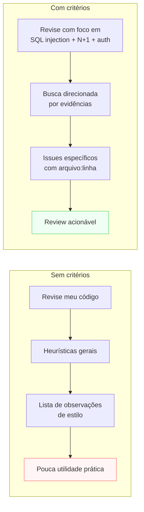
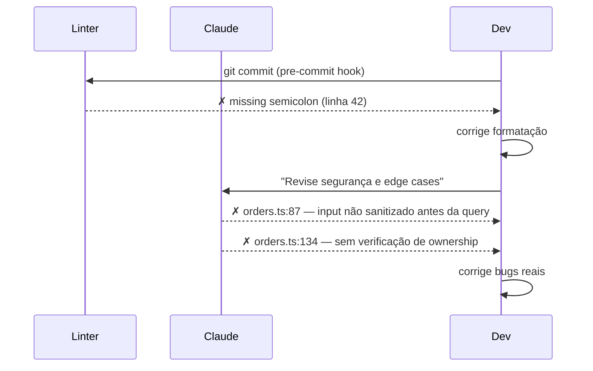

# Code review com Claude Code

> [!abstract] TL;DR
> [[Dicionário de IA#Claude Code|Claude Code]] pode fazer code review do diff em staging, de um arquivo específico, ou de um PR completo via `gh pr diff`. O review é útil quando você **especifica os critérios** — sem critérios, o agente lista observações genéricas de estilo. Com critérios específicos (segurança, performance, convenções do projeto), encontra bugs reais antes que cheguem a produção. O review do agente complementa o review humano: é mais rápido para padrões conhecidos, mas precisa da sua expertise de domínio para julgar trade-offs.

## Por que funciona — o mecanismo

> [!question]- Por que "revise meu código" sem critérios produz feedback inútil?

Porque "revisar código" é um objetivo subspecificado. Sem critérios, o agente usa heurísticas gerais: complexidade ciclomática, nomes de variáveis, cobertura de testes óbvia, formatação. Essas heurísticas produzem listas longas de sugestões de estilo que raramente capturam os bugs reais que você se importa.

Quando você especifica critérios, o agente muda de modo: em vez de varrer o código com heurísticas gerais, ele procura evidências de problemas específicos. `"Há queries com concatenação de string?"` é uma pergunta falsificável que leva a uma busca direcionada. `"Revise a qualidade"` não é.



> [!summary] Criteria-first review: especifique o que procurar antes de pedir o review. O agente é um verificador de padrões, não um juiz de qualidade geral.

> [!tip] Vídeo — Claude Code Review Agent (workflow open source)
> ["Anthropic's NEW Claude Code Review Agent (Full Open Source Workflow)"](https://www.youtube.com/watch?v=nItsfXwujjg) mostra o feature oficial de code review multi-agente do Claude Code em ação: uma frota de agentes especializados analisa o diff de um PR em paralelo — cada um focado numa classe de issue (erros de lógica, edge cases, uso incorreto de API, falhas de autenticação, convenções do projeto) — e um passo de verificação filtra falsos positivos antes de postar os comentários inline. É a versão produtizada do mesmo princípio desta nota: review eficaz é review com critérios específicos, não uma varredura genérica.

## Review do diff atual

O caso mais comum: antes de fazer o commit, revisar o que está em staging.

```
"Revise o diff em staging (git diff --staged) como se fosse
aprovar ou reprovar este PR.

Avalie especificamente:
1. Bugs óbvios e edge cases não tratados
2. Violações das convenções definidas no CLAUDE.md
3. Testes ausentes para comportamentos adicionados
4. Código que vai funcionar mas vai ser difícil de manter

Para cada issue: arquivo:linha, severidade (critical/warning/suggestion),
e o que deveria ser diferente.

Não liste issues de formatação — o linter cuida disso."
```

## Review de arquivo específico

Para revisão mais profunda de um arquivo antes de merge:

```
"Revise src/services/orders.ts com foco em:
1. Segurança: há algum input do usuário que chega sem validação
   até as queries SQL?
2. Performance: há queries N+1 ou loops que poderiam ser batch
   operations?
3. Cobertura: os testes em tests/services/orders.test.ts cobrem
   os casos de erro?"
```

## Review de [[Dicionário de IA#PR-driven workflow|PR]] via GitHub CLI

```bash
# Revisa o PR atual comparando com a branch base
gh pr diff | claude "revise este diff..."
```

Ou dentro do Claude Code:

```
"Execute gh pr diff e revise as mudanças do PR #123.
Verifique:
- Breaking changes na API pública
- Migrações de banco sem rollback
- Secrets ou credenciais hardcoded
- Performance regressions óbvias"
```

> [!info] gh pr diff vs. git diff --staged
> `git diff --staged` mostra suas mudanças locais antes do commit. `gh pr diff` mostra o diff completo do PR em relação à base (útil para reviewar o trabalho de outros ou para ver o PR como o reviewer vai ver). Para review próprio pré-commit, use `git diff --staged`. Para review de PR de terceiros ou para o checklist final, use `gh pr diff`.

## Criteria-first review

O review mais eficaz especifica o que importa:

### Security review

```
"Faça um security review focado em OWASP Top 10.
Priorize:
1. SQL injection — há queries com concatenação de string?
2. Autenticação — há endpoints sem middleware de auth?
3. Autorização — um usuário pode acessar recursos de outro usuário?
4. Exposição de dados — há campos sensíveis no payload de resposta?

Ignora code style e qualidade geral — só segurança.
Para cada issue: risco (crítico/alto/médio), e código específico."
```

### Performance review

```
"Revise para problemas de performance:
1. Queries N+1: loop que faz query dentro de loop
2. Queries sem índice em colunas que filtram por user_id ou created_at
3. Payloads de response com campos desnecessários (serialização custosa)
4. Cache opportunity: dados que raramente mudam mas são consultados frequentemente

Para cada issue, estime o impacto (crítico/moderado/baixo) com base
no volume de requisições desta rota."
```

### Conventions review

```
"Revise para violações das convenções do projeto (CLAUDE.md):
1. console.log em vez de logger (src/utils/logger.ts)
2. AppError não sendo usado para erros de negócio
3. Queries SQL inline em vez de em src/db/queries/
4. TypeScript 'any' em vez de tipos explícitos

Lista com arquivo:linha para cada violação."
```

## Review antes de abrir PR (checklist)

Um slash command útil para este padrão — `.claude/commands/pr-check.md`:

```markdown
Revise as mudanças em staging/branch como checklist de PR:

- [ ] npm test — todos passando?
- [ ] Sem console.log ou código de debug
- [ ] Sem credenciais hardcoded
- [ ] Convenções do CLAUDE.md seguidas
- [ ] Testes para o que foi adicionado
- [ ] Breaking changes documentados?
- [ ] Migration tem rollback?

Veredito: APROVADO / COM RESSALVAS / REPROVADO + justificativa.
```

Uso: `/pr-check`

## Casos práticos

> [!question]- Quando vale pedir review ao Claude em vez de fazer você mesmo?
> Para código fora do seu domínio de expertise (você é backend, o PR toca React), para PRs de outros membros do time antes de você revisar (o agente filtra o óbvio para você focar no design), e para verificações mecânicas repetitivas (credentials hardcoded, console.log) que você faz de memória mas às vezes deixa passar. O agente não substitui o review humano — reduz o custo cognitivo dele.

### Caso 1: PR com mudança sensível — auth middleware

O PR modifica como o JWT é verificado. Qualquer bug aqui é crítico.

```
"Revise o diff do auth middleware (git diff --staged src/middleware/auth.ts).

Foco específico:
1. O token ainda é verificado antes de ser decodificado?
2. Há algum path onde req.user pode ser undefined após o middleware?
3. O middleware está instalado em TODAS as rotas protegidas
   (não só nas que aparecem no diff)?
4. Há testes para o caso de token expirado, token inválido,
   e ausência de token?

Para cada issue: severidade e impacto de segurança."
```

---

### Caso 2: PR com migration de banco

Migrations irreversíveis merecem review especial antes de qualquer merge.

```
"Revise a migration em db/migrations/20260627_rename_user_columns.sql.

Verifique:
1. Há um rollback (DOWN migration) correspondente?
2. A operação é segura em produção com dados existentes?
   (ex: RENAME COLUMN não perde dados; DROP COLUMN perde)
3. O tempo de lock estimado é aceitável? (operações em tabelas
   grandes com ALTER TABLE podem bloquear por minutos)
4. Há alguma constraint sendo removida que quebra integridade referencial?

Veredito: segura para aplicar em produção / requer janela de manutenção / não aplicar."
```

---

### Caso 3: review iterativo — resolver issues em lote

O review encontra múltiplos issues. Em vez de corrigir um a um, você prioriza e resolve em batch:

```
"O review encontrou 3 issues críticos e 2 warnings:

Critical:
1. orders.ts:87 — query SQL com concatenação, risco de injection
2. orders.ts:134 — endpoint sem validação de ownership
3. auth.ts:45 — req.user usado sem verificar se não é null

Warning:
4. orders.ts:156 — N+1 query no loop de items
5. orders.ts:201 — console.log esquecido

Corrija os 3 critical primeiro, em ordem de risco.
Para cada: mostre o before/after e explique o fix."
```

## Review vs. linting — o que cada um encontra

Uma confusão comum: "o linter já cobre isso, por que pedir review para o Claude?"

Linting é busca por padrão sintático — o linter sabe que `===` é diferente de `==`, mas não sabe se um `==` específico é intencional. O agente de review raciocina sobre intenção: "este `==` aqui está comparando `null` com `undefined` propositalmente? Ou é um bug?"



O linter encontra "parece errado sintaticamente". O agente encontra "vai quebrar em produção quando o usuário fizer X". São camadas complementares, não substitutas.

| Ferramenta | O que encontra | O que não encontra |
|------------|---------------|-------------------|
| Linter | Formatação, style, patterns estáticos | Lógica de negócio, edge cases, bugs semânticos |
| Testes | Comportamentos definidos previamente | Comportamentos que você esqueceu de testar |
| Claude Code | Patterns de risco conhecidos, edge cases, gaps de cobertura | Regras de negócio implícitas que só você conhece |
| Review humano | Contexto histórico, trade-offs futuros, qualidade de design | Varredura sistemática de patterns repetitivos |

## Incorporando feedback do review

Depois do review, para resolver issues em lote:

```
"O review encontrou 3 issues críticos e 2 warnings:

Critical:
1. orders.ts:87 — query SQL com concatenação, risco de injection
2. orders.ts:134 — endpoint sem validação de ownership

Warning:
3. orders.ts:156 — N+1 query no loop de items
4. orders.ts:201 — console.log esquecido

Corrija os 2 critical primeiro. Para cada: mostre o before/after
e explique o fix."
```

## Armadilhas comuns

> [!warning] "Revise meu código" sem critérios
> O agente produz uma lista genérica de melhorias de estilo, complexidade ciclomática e nomes de variáveis. Útil como varredura inicial, inútil como substituto de review com critérios. Se você não especificar o que procurar, o agente vai varrer com heurísticas gerais e perder os bugs que realmente importam.

> [!warning] Review de diff muito grande de uma vez
> Um diff com 1000 linhas de mudança vai receber um review superficial — o agente perde detalhes nas partes centrais do diff. Para PRs grandes, divida em revisões por módulo: `"Revise apenas as mudanças em src/auth/"`, depois `"Revise as mudanças em src/orders/"`. Um review focado é mais profundo que um review total superficial.

> [!warning] Aceitar cada sugestão sem avaliar
> O agente pode sugerir refactors desnecessários durante o review — `"use Promise.all() em vez de await sequencial"` pode ser correto em performance mas errado para o caso específico (onde a ordem importa). Sua expertise de domínio > sugestão de performance genérica. Avalie o impacto de cada sugestão antes de aplicar.

> [!warning] Review sem contexto do domínio
> `"é mais eficiente usar reduce()"` pode ser tecnicamente verdade mas pedagogicamente errado para um time que prefere legibilidade. `"este endpoint não precisa de autenticação"` pode ser correto para um endpoint de health check mas errado para um endpoint que expõe dados de usuário. O agente não conhece as regras de negócio implícitas do seu domínio — você conhece.

## Review como hábito de equipe

O review pontual (antes de cada PR) é o ponto de partida, mas equipes mais maduras o integram ao fluxo de trabalho contínuo.

**Antes do commit:** `git diff --staged | claude "revise rapidamente: bug óbvio, console.log, credentials?"` — review de 30 segundos que pega os itens mais fáceis.

**Antes do PR:** `/pr-check` com o checklist completo — review de 2-3 minutos que valida todas as dimensões.

**Revisão assíncrona:** Para PRs grandes (300+ linhas), pedir review por módulo e comentar as findings diretamente no PR via `gh pr comment`. O agente funciona como um primeiro reviewer que pré-filtra o que o reviewer humano vai ver.

**Periodic convention audit:** Uma vez por sprint, pedir ao agente para varrer um módulo inteiro à procura de violações acumuladas de convenção — drift que nenhum PR individual captura.

```
"Faça um audit de convenções em src/services/ — não do diff,
mas do estado atual do código.

Verifique:
1. Arquivos que ainda usam padrões antigos (console.log, callbacks)
2. Funções acima de 50 linhas que deveriam ser extraídas
3. Importações que violam as camadas definidas no CLAUDE.md

Produz uma lista priorizada, não precisa corrigir — só mapear."
```

> [!info] Review não substitui cultura de qualidade
> O agente encontra patterns conhecidos muito bem. Mas ele não sabe que aquela função de 80 linhas em `payments.ts` é deliberadamente monolítica porque qualquer extração vai quebrar a transaction boundary. Contexto de design não está no código — está na equipe. Use o review do agente para liberar sua atenção para as decisões de design.

O ganho real desse hábito não é o review individual — é o efeito composto. Uma equipe que roda `/pr-check` em todo PR e um audit de convenções por sprint tem uma vantagem sutil: os desvios pequenos (um `console.log` esquecido, uma query sem índice, um padrão antigo reintroduzido por engano) param de se acumular silenciosamente. Sem esse hábito, cada um desses desvios é invisível isoladamente — só vira problema visível quando já são dezenas espalhadas pelo código, e aí a correção exige um refactor caro. Com o hábito, o custo de correção fica sempre no tamanho de "um PR", nunca no tamanho de "uma sprint inteira de limpeza".

Isso também muda o papel do reviewer humano. Quando o agente já filtrou os problemas mecânicos — a checklist de `/pr-check`, os patterns conhecidos de segurança e performance — o que sobra para o humano é justamente o que só o humano sabe avaliar: a decisão de design vale o trade-off? Essa abstração está no nível certo? Vale a pena essa complexidade agora ou depois? É a mesma divisão de trabalho que aparece na tabela de patterns vs. domínio: o agente cobre a varredura sistemática, a pessoa cobre o julgamento contextual.

## Como explicar em inglês

**Code review with Claude Code** is a criteria-driven workflow. Without explicit criteria, the agent applies generic heuristics (style, cyclomatic complexity, variable naming) that rarely surface real bugs. With specific criteria (security vulnerabilities, performance anti-patterns, project conventions), the agent performs targeted searches that find actionable issues with file and line references.

The key is framing the review as a pattern-matching task: "find all queries with string concatenation" is falsifiable and executable; "review code quality" is not.

**In a technical interview**, you might say:

> "The most effective code review with Claude Code is criteria-first: you specify what you're looking for before asking the agent to review. Security reviews focus on OWASP Top 10 patterns, performance reviews focus on N+1 queries and missing indexes, convention reviews focus on the project's CLAUDE.md rules. The agent is excellent at finding known-bad patterns; you provide the judgment on whether a finding is actually a problem in context."

### Tabela PT ↔ EN

| Português | English | Contexto |
|-----------|---------|----------|
| Revisão de código | Code review | o processo |
| Critérios de revisão | Review criteria | o que especificar antes do review |
| Diff em staging | Staged diff | `git diff --staged` |
| Severidade | Severity | critical/warning/suggestion |
| Issue crítico | Critical issue | bug que bloqueia o merge |
| Breaking change | Breaking change (sem tradução) | mudança que quebra compatibilidade |
| Migration de rollback | Rollback migration / DOWN migration | a migration reversa |
| Review iterativo | Iterative review | múltiplas rodadas de review |
| Veredito | Verdict | a conclusão do review |
| Heurística geral | General heuristic | o que o agente usa sem critérios |

## O que vem a seguir

Code review é uma prática individual — mas o projeto começa a ganhar escala quando múltiplos fluxos podem ser validados em paralelo.

- **[[03-Dominios/Tecnologia/IA/Claude Code/Workflows/06 - Sessões paralelas|06 - Sessões paralelas]]** — como fazer review em branch isolada enquanto outra feature continua em desenvolvimento
- **[[03-Dominios/Tecnologia/IA/Claude Code/Configuração/06 - Slash commands customizados|06 - Slash commands customizados]]** — criar `/pr-check` e outros slash commands de review reutilizáveis

## Veja também

- [[03-Dominios/Tecnologia/IA/Claude Code/Workflows/06 - Sessões paralelas|06 - Sessões paralelas]] — review em branch isolada
- [[03-Dominios/Tecnologia/IA/Claude Code/Configuração/06 - Slash commands customizados|06 - Slash commands customizados]] — criar /pr-check
- [[03-Dominios/Tecnologia/IA/Claude Code/Workflows/09 - Prompting para Claude Code|09 - Prompting para Claude Code]] — especificidade nos critérios de review
- [[03-Dominios/Tecnologia/IA/Claude Code/Workflows/index|Workflows]] — índice do galho

## Referências

- [Claude Code — /code-review skill](https://docs.anthropic.com/en/docs/claude-code/skills) — skill oficial de code review multi-agente do Claude Code
- [OWASP Top 10](https://owasp.org/www-project-top-ten/) — referência para critérios de security review
- [GitHub — about pull request reviews](https://docs.github.com/en/pull-requests/collaborating-with-pull-requests/reviewing-changes-in-pull-requests/about-pull-request-reviews) — integração com o workflow de PRs do GitHub
- [Anthropic's NEW Claude Code Review Agent (Full Open Source Workflow)](https://www.youtube.com/watch?v=nItsfXwujjg) — demo do feature oficial de code review multi-agente


