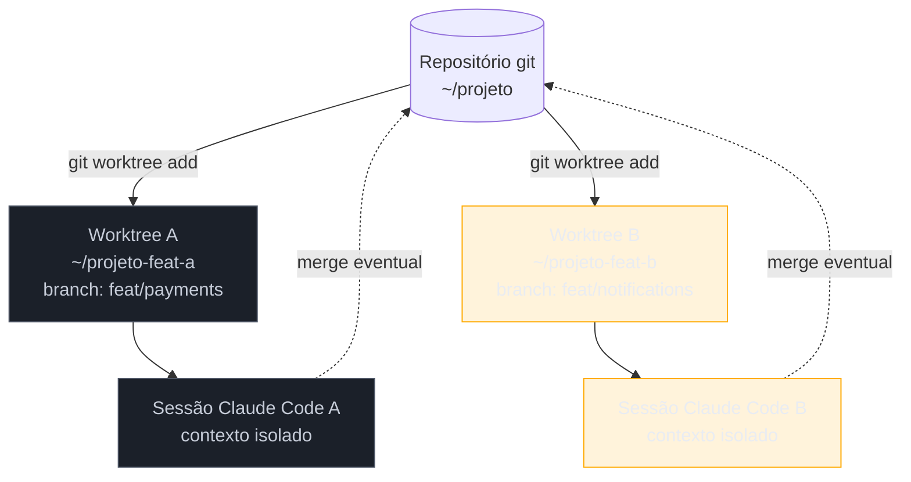
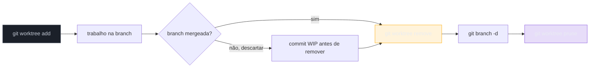

# Sessões paralelas — tmux + worktrees

> [!abstract] TL;DR
> [[Dicionário de IA#Claude Code|Claude Code]] pode rodar múltiplas sessões simultâneas em worktrees git diferentes — cada [[Dicionário de IA#Agent|agente]] trabalha numa branch isolada sem interferir nos arquivos do outro. O setup padrão usa `git worktree add` para criar cópias de trabalho e `tmux` (ou múltiplos terminais) para rodar sessões em paralelo. Ideal para: implementar features independentes simultaneamente, trabalhar numa feature enquanto outra está em review, ou manter um experimento rodando sem afetar a branch de produção. O ganho real não é só velocidade — é contexto limpo: cada sessão tem foco num problema específico sem interferência do outro.

## Por que funciona — o mecanismo

> [!question]- Por que uma única sessão longa é ruim para tarefas paralelas?

Porque o contexto da sessão do Claude Code acumula tudo que aconteceu: edições, erros, decisões, arquivos lidos. Numa sessão única longa tratando duas features, o agente começa a misturar contexto — pode citar o código da feature A quando você está perguntando sobre a feature B, ou fazer sugestões baseadas em estado que era de outro contexto.

Worktrees + sessões paralelas resolvem isso por partição: cada sessão tem seu próprio contexto, seu próprio diretório de trabalho, sua própria branch. O agente da sessão A literalmente não vê os arquivos da sessão B (eles estão em diretórios diferentes). Isso não é só conveniência de organização — é isolamento de estado.



Cada worktree aponta para o mesmo objeto `.git` — commits, histórico, objetos são compartilhados. Só o *working directory* (árvore de arquivos editáveis) é separado.

> [!summary] O ganho de sessões paralelas é duplo: velocidade (trabalho simultâneo) e qualidade (contexto limpo por tarefa). Sem worktrees, sessões paralelas no mesmo diretório causam conflitos de arquivo.

## Git worktrees — a peça central

`git worktree add` cria um segundo diretório de trabalho ligado ao mesmo repositório. Cada worktree pode estar numa branch diferente.

```bash
# Worktree para feature A
git worktree add ../meu-projeto-feat-a feat/payment-integration

# Worktree para feature B  
git worktree add ../meu-projeto-feat-b feat/user-notifications

# Criar branch nova e worktree junto (forma mais comum)
git worktree add -b feat/payment-integration ../meu-projeto-feat-a

# Verificar worktrees
git worktree list
```

Resultado:
```
/home/user/meu-projeto          (main)
/home/user/meu-projeto-feat-a   (feat/payment-integration)
/home/user/meu-projeto-feat-b   (feat/user-notifications)
```

Cada diretório é uma cópia de trabalho independente — arquivos separados, sem interferência. Commits feitos em `feat-a` aparecem no histórico do repositório mas não afetam os arquivos em `feat-b`.

> [!info] Uma branch, um worktree
> Git não permite o mesmo branch em dois worktrees ao mesmo tempo. Se tentar fazer `git worktree add` numa branch já ativa em outro worktree, vai receber um erro. A solução é criar uma branch nova por worktree.

## Setup com tmux

```bash
# Nova sessão tmux com dois painéis
tmux new-session -d -s dev
tmux split-window -h

# Painel esquerdo: feature A
tmux send-keys -t dev:0.0 "cd ../meu-projeto-feat-a && claude" Enter

# Painel direito: feature B
tmux send-keys -t dev:0.1 "cd ../meu-projeto-feat-b && claude" Enter

# Attach à sessão
tmux attach -t dev
```

Navegação básica: `Ctrl+b →` / `Ctrl+b ←` para mover entre painéis. `Ctrl+b z` para zoom no painel atual.

> [!tip] Vídeo: worktrees + agentes em paralelo
> [Git Worktrees Explained — Run Multiple AI Agents in Parallel (Claude Code Tutorial)](https://www.youtube.com/watch?v=n35KalqEwJc) mostra o setup completo de `git worktree` + múltiplas sessões de agente rodando lado a lado, incluindo a armadilha mais comum (branch já ativa em outro worktree) e como nomear sessões tmux pra não se perder entre painéis.

> [!question]- Preciso decorar os comandos de tmux + worktree toda vez que começar uma tarefa paralela?
> Não necessariamente. Existem ferramentas que automatizam o par "criar worktree + abrir janela tmux" num único comando — por exemplo o [workmux](https://github.com/raine/workmux), que trata o tmux como a interface principal: cada worktree novo já nasce com sua própria janela, painéis e comando de inicialização (`claude`) configurados via um arquivo de projeto. Isso reduz o setup manual descrito acima a um único comando (`workmux start feat/payments`), mas o mecanismo por baixo é exatamente o `git worktree add` + `tmux send-keys` que você acabou de ver — vale entender o caminho manual antes de adotar o atalho.

### Persistindo o layout entre reinícios

Um painel tmux criado com `send-keys` se perde se a máquina reiniciar ou a sessão for encerrada por engano. Para sessões paralelas que duram dias (uma feature grande dividida em backend/frontend, por exemplo), vale persistir o layout:

```bash
# Salva o layout atual (painéis, comandos, working directories)
tmux new-session -d -s dev
tmux split-window -h
tmux send-keys -t dev:0.0 "cd ../projeto-feat-a && claude" Enter
tmux send-keys -t dev:0.1 "cd ../projeto-feat-b && claude" Enter

# Um script de bootstrap reconstrói o mesmo layout depois de reiniciar
cat > start-parallel-dev.sh <<'EOF'
#!/bin/bash
tmux new-session -d -s dev -c ../projeto-feat-a
tmux send-keys -t dev "claude" Enter
tmux split-window -h -t dev -c ../projeto-feat-b
tmux send-keys -t dev.1 "claude" Enter
tmux attach -t dev
EOF
chmod +x start-parallel-dev.sh
```

> [!info] tmux não salva sessões automaticamente
> Ao contrário do que muita gente assume, `tmux detach` não persiste a sessão em disco — ela só sobrevive enquanto o servidor tmux (`tmux server`) estiver rodando. Reiniciar a máquina mata o servidor e leva a sessão junto, mesmo com painéis "destacados". Scriptar o bootstrap (como acima) é mais confiável que depender de `tmux attach` sobreviver a um reboot; para persistência real entre reboots, o plugin `tmux-resurrect` grava e restaura sessões em disco.

## Setup com múltiplos terminais

Mais simples para quem não usa tmux:

```bash
# Terminal 1
cd ../meu-projeto-feat-a
claude

# Terminal 2
cd ../meu-projeto-feat-b
claude
```

Cada instância do Claude Code é independente — contexto, histórico, permissões.

## Padrões de uso

### Feature paralela

```
Terminal 1 — feat-a:
"Implemente integração com gateway de pagamento Stripe.
Arquivos: src/services/payment.ts, src/routes/payment.ts.
Siga as convenções do CLAUDE.md."

Terminal 2 — feat-b:
"Implemente sistema de notificações por email para eventos
de pedido. Use o SendGrid client em src/utils/mailer.ts."
```

Ambos trabalhando simultaneamente. Merges independentes quando cada feature estiver pronta.

### Review + development simultâneo

Enquanto um PR está em review e você aguarda feedback:

```
Terminal 1 — branch do PR em review:
"O reviewer pediu para extrair a lógica de validação de pagamento
para um validator separado. Faça essa extração em
src/validators/payment.validator.ts."

Terminal 2 — nova feature:
"Comece a implementação do sistema de relatórios em
src/services/reports.ts conforme spec em docs/reports-spec.md."
```

Você aplica feedback do review na sessão A enquanto avança na próxima feature na sessão B. Sem ficar preso esperando aprovação.

### Experimento vs. produção

Para explorar uma abordagem sem arriscar o trabalho atual:

```
Terminal 1 — branch experimental:
"Tente refatorar OrderService para usar event sourcing.
Não precisa ser perfeito — quero explorar se a abordagem
faz sentido antes de commitar com ela."

Terminal 2 — branch main:
[trabalho normal de produção]
```

Se o experimento valer, você carrega as ideias de volta. Se não, descarta o worktree sem impacto.

## Casos práticos

### Caso 1: hotfix + feature em paralelo

A situação mais urgente: bug crítico em produção enquanto você está no meio de uma feature.

```bash
# Você está trabalhando na feature na branch atual
# Bug crítico aparece em produção

# 1. Cria worktree de hotfix sem abandonar a feature
git worktree add -b hotfix/payment-null-crash ../projeto-hotfix main

# 2. Abre segunda sessão no worktree de hotfix
# Terminal 2:
cd ../projeto-hotfix
claude "Bug crítico: payment.ts:87 lança NullPointerException quando
user.address é null. Contexto: checkout flow. Corrija, adicione teste
cobrindo o caso, e confirme que os outros testes passam."

# Terminal 1: continua na feature normalmente
```

O hotfix vai para main sem tocar sua branch de feature. Depois que mergear o hotfix, você faz `git merge main` no worktree da feature para puxar a correção.

---

### Caso 2: review de PR de colega + sua própria feature

```bash
# Cria worktree para o branch do PR do colega
git fetch origin
git worktree add -b review/maria-auth ../projeto-review origin/feat/auth-refactor

# Terminal 1 — review do PR:
cd ../projeto-review
claude "Faça security review do diff (git diff main...HEAD) com foco
em: tokens sem expiração, endpoints sem auth, e verificação de ownership.
Gera uma lista de issues com severidade para eu comentar no PR."

# Terminal 2 — sua feature normal:
cd ~/projeto
claude "Continue a implementação do sistema de relatórios..."
```

Você consegue dar um review qualificado no PR sem pausar seu próprio trabalho.

---

### Caso 3: split de contexto para tarefas longas

Uma feature grande demais para uma sessão única sem perda de contexto:

```bash
# Worktree para o backend da feature
git worktree add -b feat/reports-backend ../projeto-reports-be

# Worktree para o frontend da feature
git worktree add -b feat/reports-frontend ../projeto-reports-fe

# Terminal 1 — backend:
cd ../projeto-reports-be
claude "Implemente a API de relatórios: endpoints GET /api/reports,
GET /api/reports/:id, POST /api/reports/generate. Schema em
docs/reports-api.md."

# Terminal 2 — frontend:
cd ../projeto-reports-fe
claude "Implemente a tela de relatórios em src/pages/Reports.tsx.
A API segue o schema em docs/reports-api.md."
```

Cada sessão tem contexto focado — backend não mistura com frontend.

## Limpeza de worktrees

Depois que a branch foi mergeada:

```bash
# Remove o worktree (o diretório e o registro)
git worktree remove ../meu-projeto-feat-a

# Se o diretório tiver mudanças não commitadas, force:
git worktree remove --force ../meu-projeto-feat-a

# Remove branches mergeadas
git branch -d feat/payment-integration

# Limpar worktrees stale (branch deletada remotamente)
git worktree prune
```

> [!info] worktrees não são gravados no .git local
> O registro de worktrees fica em `.git/worktrees/`. Se você deletar o diretório do worktree manualmente sem `git worktree remove`, o registro fica órfão. `git worktree prune` limpa esses órfãos.

> [!question]- Por que `git worktree remove` e `git branch -d` são comandos separados?
> Porque são coisas diferentes no modelo do git: o worktree é só uma *cópia de trabalho* (working directory) apontando para uma branch; a branch é a referência de commits em si. Remover o worktree não apaga a branch — ela continua existindo, ainda mergeada ou não, e pode ser recriada em outro worktree depois. Apagar a branch não remove o worktree — se você rodar `git branch -d` numa branch que ainda está *checked out* num worktree, o git recusa com um erro, justamente para não deixar um worktree "órfão" apontando pra uma branch inexistente. A ordem importa: primeiro remove o worktree, depois a branch.



O diagrama acima resume o ciclo de vida completo: criar → trabalhar → (se mergeada) remover worktree → apagar branch → `prune` como rede de segurança final. Pular a etapa de commit antes de remover é a causa mais comum de perda de trabalho em sessões paralelas — veja o [!warning] logo abaixo.

### Script de limpeza completa

Para quem gerencia várias worktrees simultâneas (uma por feature, uma por review), a limpeza manual item a item cansa rápido. Um script que varre worktrees já mergeadas evita esquecimento:

```bash
#!/bin/bash
# cleanup-worktrees.sh — remove worktrees cuja branch já foi mergeada em main

git worktree list --porcelain | grep '^worktree' | awk '{print $2}' | while read -r wt; do
  # pula o worktree principal (o primeiro da lista)
  [ "$wt" = "$(git rev-parse --show-toplevel)" ] && continue

  branch=$(git -C "$wt" branch --show-current)
  if git merge-base --is-ancestor "$branch" main 2>/dev/null; then
    echo "Removendo worktree mergeado: $wt ($branch)"
    git worktree remove "$wt"
    git branch -d "$branch"
  fi
done

git worktree prune
```

> [!warning] Rodar isso sem revisar primeiro é arriscado
> `merge-base --is-ancestor` confirma que os commits da branch chegaram em `main`, mas não confirma que não há mudanças não commitadas no worktree (stash, arquivos untracked importantes). Rode `git status` em cada worktree antes de automatizar a remoção em massa, ou adicione um `git -C "$wt" status --porcelain` como guarda no script.

> [!summary] Limpeza de worktrees é um ciclo de três comandos (`remove` → `branch -d` → `prune`), não um só — e a ordem entre os dois primeiros é obrigatória por design do git.

## Armadilhas comuns

> [!warning] CLAUDE.md compartilhado entre todos os worktrees
> Todos os worktrees leem o mesmo `.claude/CLAUDE.md` do repositório (é o mesmo `.git`). Qualquer mudança no CLAUDE.md de uma worktree aparece em todas. Se você precisar de configurações diferentes por worktree, use `.claude/settings.local.json` (não está no git e é por-diretório).

> [!warning] Conflito de porta ao rodar o servidor em paralelo
> Se dois agentes tentam rodar `npm run dev` simultaneamente, ambos vão tentar usar a mesma porta (geralmente 3000) e um vai falhar. Solução:
> ```bash
> # Worktree A
> PORT=3001 npm run dev
> # Worktree B  
> PORT=3002 npm run dev
> ```
> Ou configure a porta no `.env.local` de cada worktree.

> [!warning] Tarefas que tocam os mesmos arquivos causam conflito no merge
> Sessões paralelas só funcionam bem para tarefas em partes diferentes do codebase. Se a feature A e a feature B modificam `src/utils/auth.ts`, você vai ter conflito de merge quando tentar integrar. Antes de parallelizar, verifique os arquivos que cada tarefa vai tocar.

> [!warning] Esqueceu de commitar antes de remover o worktree
> `git worktree remove` não salva mudanças não commitadas — descarta silenciosamente. Se tiver trabalho em andamento no worktree, commite (mesmo como WIP) antes de remover. `git worktree remove --force` é especialmente perigoso.

## Como explicar em inglês

**Parallel sessions with worktrees** is a git-native parallelism strategy for Claude Code. Instead of running multiple Claude Code instances in the same directory (which would cause file conflicts), you create isolated working copies with `git worktree add`. Each copy points to the same git object store but has its own working tree — its own set of editable files.

The dual benefit is velocity (work runs simultaneously) and context isolation (each Claude Code session has a focused, clean context for one task). A long single session accumulates context that causes the model to conflate separate tasks.

**In a technical interview**, you might say:

> "For independent parallel workstreams — say a hotfix on main while building a feature — I use git worktrees to create isolated working copies and run a separate Claude Code session in each. Each session has clean, focused context. The worktrees share the same git object store, so I don't duplicate the repo; they just have separate working directories. When work is done, I remove the worktree and merge the branch."

### Tabela PT ↔ EN

| Português | English | Contexto |
|-----------|---------|----------|
| Sessão paralela | Parallel session | múltiplos agentes simultâneos |
| Worktree | Worktree (sem tradução) | diretório de trabalho extra do git |
| Branch isolada | Isolated branch | cada worktree tem sua própria branch |
| Contexto limpo | Clean context | sessão focada num único problema |
| Hotfix | Hotfix (sem tradução) | correção urgente em produção |
| Merge | Merge (sem tradução) | integrar branches |
| Conflito de merge | Merge conflict | duas branches editaram o mesmo arquivo |
| Cópia de trabalho | Working copy | o diretório editável ligado ao repo |
| Órfão de worktree | Stale worktree | registro sem diretório correspondente |

## O que vem a seguir

Sessões paralelas isolam trabalho humano-a-humano. O próximo nível é o agente que despacha subagentes — paralelismo gerenciado pelo próprio Claude Code.

- **[[03-Dominios/Tecnologia/IA/Claude Code/Workflows/07 - Sub-agents e dispatch|07 - Sub-agents e dispatch]]** — como um agente coordenador delega tarefas para subagentes especializados
- **[[03-Dominios/Tecnologia/IA/Claude Code/Workflows/08 - Multi-agent|08 - Multi-agent]]** — arquitetura completa de múltiplos agentes com revisão cruzada

## Veja também

- [[03-Dominios/Tecnologia/IA/Claude Code/Workflows/07 - Sub-agents e dispatch|07 - Sub-agents e dispatch]] — delegar tarefas a agentes
- [[03-Dominios/Tecnologia/IA/Claude Code/Workflows/08 - Multi-agent|08 - Multi-agent]] — coordenar múltiplos agentes
- [[03-Dominios/Tecnologia/IA/Claude Code/Time e Automação/index|Time e Automação]] — paralelismo em contexto de time
- [[03-Dominios/Tecnologia/IA/Claude Code/Workflows/index|Workflows]] — índice do galho

## Fontes

- [git-worktree documentation](https://git-scm.com/docs/git-worktree) — documentação oficial do comando git worktree
- [tmux cheat sheet](https://tmuxcheatsheet.com/) — referência de atalhos para gerenciar painéis e sessões
- [Claude Code — parallel workstreams](https://docs.anthropic.com/en/docs/claude-code/tutorials) — tutoriais oficiais sobre workflows com múltiplas sessões
- [Git Worktrees Explained — Run Multiple AI Agents in Parallel (Claude Code Tutorial)](https://www.youtube.com/watch?v=n35KalqEwJc) — vídeo explicando o setup de worktrees + múltiplos agentes em paralelo
- [workmux — git worktrees + tmux windows for zero-friction parallel dev](https://github.com/raine/workmux) — ferramenta que automatiza a criação de worktree + janela tmux num único comando


