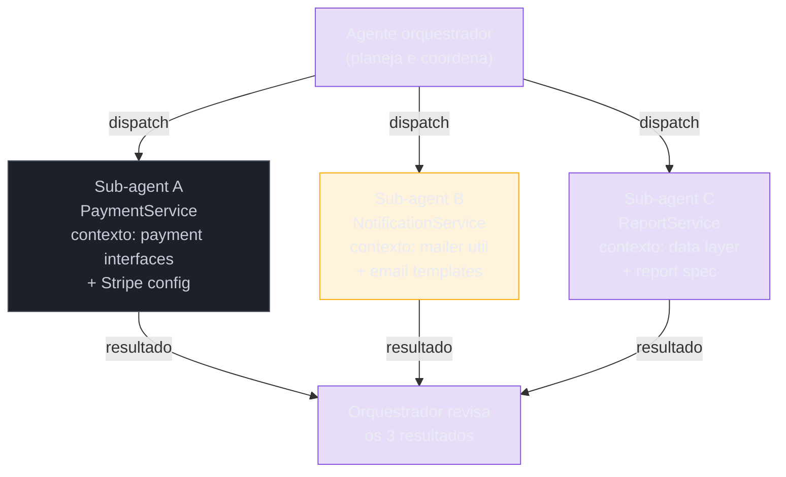

# Sub-agents e dispatch — delegar tarefas

> [!abstract] TL;DR
> [[Dicionário de IA#Claude Code|Claude Code]] pode usar [[Dicionário de IA#subagent|sub-agents]] para executar tarefas em paralelo com contexto isolado. Em vez de uma sessão longa acumulando contexto de múltiplas tarefas, você despacha agentes especializados: cada um recebe o contexto mínimo para sua tarefa, executa, e retorna o resultado. O benefício principal não é velocidade — é qualidade: agente com [[Dicionário de IA#Context window|contexto]] limpo toma decisões melhores. Sub-agents são a fundação do padrão orquestrador/trabalhador: você planeja e coordena; eles executam de forma especializada.

## Por que funciona — o mecanismo

> [!question]- Por que contexto limpo produz código melhor?

Imagine um engenheiro que acabou de passar 2 horas em debate sobre qual ORM usar para o módulo de pagamentos. Agora você pede para ele implementar o serviço de notificações. Ele provavelmente vai sobreaplicar preocupações de ORM em código que nem usa banco de dados diretamente — o debate recente ainda está fresco e influencia as decisões, mesmo quando não deveria.

O mesmo acontece com sessões longas do Claude Code. Contexto acumulado cria viés: o agente começa a aplicar padrões, preocupações, e decisões de tarefas anteriores em tarefas novas que não têm relação. Sub-agents resolvem isso por design: cada um começa do zero, com apenas o contexto que você passou explicitamente.



> [!summary] A regra de ouro do dispatch: passe o contexto mínimo suficiente. Sub-agent que recebe contexto demais vai ter os mesmos problemas de bias que uma sessão longa. Sub-agent que recebe contexto de menos vai inventar convenções.

## O problema de contexto acumulado

Numa sessão longa sem sub-agents:

```
Tarefa A: implementar payment service
→ contexto: 50 mensagens sobre payment

Tarefa B (mesma sessão): implementar notification service
→ contexto: 50 mensagens sobre payment + 30 sobre notificações

Tarefa C: implementar order service
→ contexto: 80 mensagens sobre coisas não relacionadas a orders
```

O agente começa a confundir conceitos entre tarefas, aplica padrões da tarefa A na tarefa C, e toma decisões piores por excesso de contexto irrelevante. Sub-agents resolvem pela partição: cada um tem contexto cirúrgico.

## Como sub-agents funcionam

O agente principal (orquestrador) define a tarefa e o contexto necessário. O sub-agent recebe:
- Contexto específico da tarefa (arquivos relevantes, convenções)
- Escopo claro (o que fazer, o que não fazer)
- Critérios de sucesso (como saber que está pronto)

O sub-agent executa em contexto limpo, sem a história da sessão principal.

## Dispatch via Task tool

Claude Code expõe o `Task` tool para despachar sub-agents programaticamente:

```
"Use o Task tool para criar um sub-agent que vai implementar
o serviço de notificações em src/services/notifications.ts.

Contexto para o sub-agent:
- Leia src/services/orders.ts para entender o padrão de serviço
- Leia src/utils/mailer.ts para o client de email existente
- Convenções: use logger em vez de console.log, AppError para erros

Tarefa: implementar sendOrderConfirmation(orderId: string) e
sendCancellationEmail(orderId: string, reason: string).

Critério de sucesso: testes em tests/services/notifications.test.ts
passando."
```

## Dispatch em modo headless

Para automação e pipelines CI/CD, sub-agents podem ser despachados via CLI:

```bash
# Despachar sub-agent para tarefa específica
claude --print "implementa o serviço X conforme especificado em docs/spec.md" \
       --allowedTools "Read,Edit,Write,Bash(npm test)"

# Com output estruturado
claude --print "analise src/services/ e liste todos os endpoints sem autenticação" \
       --output-format json
```

## Padrão orquestrador/sub-agent

### Orquestrador define o plano

```
"Temos 3 tarefas independentes para implementar. Vou criar um
sub-agent para cada uma, já que não compartilham arquivos:

1. PaymentService (src/services/payment.ts)
2. NotificationService (src/services/notifications.ts)
3. ReportService (src/services/reports.ts)

Crie o sub-agent para PaymentService primeiro. Depois vou criar
os outros quando esse terminar — ou em paralelo se fizer sentido."
```

### Sub-agent recebe contexto cirúrgico

O orquestrador não passa "tudo" — passa só o que o sub-agent precisa:

```
"Sub-agent para PaymentService:

Arquivos relevantes:
- src/interfaces/payment.ts (tipos existentes)
- src/config/stripe.ts (client configurado)
- tests/services/payment.test.ts (testes já escritos — faça passar)

NÃO mexa em:
- src/services/orders.ts
- src/routes/ (outro sub-agent cuida)

Implementação: src/services/payment.ts conforme interfaces em
src/interfaces/payment.ts. Use o Stripe client de src/config/stripe.ts."
```

Cada sub-agent opera dentro do seu escopo. Sem interferência lateral.

## Context isolation como feature, não limitação

O fato de o sub-agent não ter acesso à história da sessão principal é intencional:

```
Sessão principal: 2h de debate sobre arquitetura
→ Sub-agent para implementar: recebe só a decisão final, não o debate
→ Implementa sem bias das opções descartadas
→ Resultado mais limpo
```

Se você quer que o sub-agent saiba algo, passe explicitamente. Se não passou, ele não vai "descobrir" por acidente — isso é um recurso, não um bug.

## Casos práticos

### Caso 1: three-way feature split

Três módulos independentes, implementação paralela:

```
"Preciso implementar 3 serviços independentes para o módulo de checkout.
Cada um tem interface definida e testes já escritos — o critério de sucesso
é os testes passarem.

Crie sub-agents para:
1. PaymentService — interfaces em src/interfaces/payment.ts,
   testes em tests/payment.test.ts, implemente em src/services/payment.ts
2. InventoryService — interfaces em src/interfaces/inventory.ts,
   testes em tests/inventory.test.ts, implemente em src/services/inventory.ts
3. ShippingService — interfaces em src/interfaces/shipping.ts,
   testes em tests/shipping.test.ts, implemente em src/services/shipping.ts

Convenção geral: use AppError para erros, logger (src/utils/logger.ts)
em vez de console.log, sem 'any' em TypeScript."
```

Cada sub-agent implementa o seu módulo. O orquestrador revisa os 3 resultados depois.

---

### Caso 2: pipeline de análise com dispatch especializado

Para tarefas de análise que produzem resultados independentes:

```
"Quero um relatório de saúde do codebase. Crie 3 sub-agents
especializados:

Sub-agent de segurança:
"Analise src/ em busca de: SQL injection (concatenação de string em queries),
endpoints sem autenticação, e campos sensíveis expostos em responses JSON.
Produz lista com arquivo:linha:severidade."

Sub-agent de performance:
"Analise src/services/ em busca de: queries N+1 (loops com query interna),
funções síncronas bloqueantes em handlers async, e ausência de índices
em colunas de filtro comuns. Produz lista com arquivo:linha:impacto."

Sub-agent de convenções:
"Analise src/ em busca de: console.log (em vez de logger), 'any' em
TypeScript, e funções acima de 50 linhas que deveriam ser extraídas.
Produz lista com arquivo:linha:violação."

Agrega os 3 resultados num relatório final por severidade."
```

---

### Caso 3: orquestrador com revisão cruzada

Um sub-agent implementa; outro revisa o resultado:

```
"Passo 1: Sub-agent de implementação
Implemente src/services/payment.ts conforme spec em docs/payment-spec.md.
Critério: testes em tests/payment.test.ts passando.

Passo 2 (depois que o sub-agent terminar): Sub-agent de revisão
Revise src/services/payment.ts com foco em:
- Segurança: há inputs não validados chegando à Stripe API?
- Idempotência: reprocessar o mesmo pagamento duas vezes causa duplicação?
- Error handling: todos os erros da Stripe API são tratados?

Reporte issues com severidade."
```

O sub-agent de revisão tem contexto limpo — vai revisar como um olhar externo, sem o viés de quem implementou.

## Revisão do resultado

Depois que o sub-agent completa:

```
"O sub-agent completou a implementação de PaymentService.
Revise src/services/payment.ts e confirme:
1. Segue o padrão de serviço de src/services/orders.ts
2. Usa AppError para erros de negócio
3. Os testes em tests/services/payment.test.ts passam

Se houver problemas, liste-os com arquivo:linha."
```

## Armadilhas comuns

> [!warning] Contexto insuficiente no dispatch
> Se você despacha um sub-agent sem explicar as convenções do projeto, ele vai usar seus próprios padrões — e vai variar por sessão. Inclua sempre no dispatch: um arquivo de referência como exemplo do padrão esperado (`"leia src/services/orders.ts para entender o padrão"`), onde ficam os testes, e convenções de erro e logging.

> [!warning] Tarefas dependentes despachadas em paralelo
> Dois sub-agents que modificam o mesmo arquivo causam conflito — o segundo vai sobrescrever o trabalho do primeiro, ou vai editar uma versão stale do arquivo. Antes de despachar em paralelo, mapeie quais arquivos cada sub-agent vai tocar. Tarefas que compartilham arquivos devem ser sequenciais.

> [!warning] Sub-agent sem critério de sucesso
> `"implemente o serviço de notificações"` sem especificar o que "pronto" significa resulta em implementação que pode ou não atender ao que você precisa. Todo dispatch deve ter um critério verificável: `"os testes em X passando"`, ou `"a função retorna Y dado Z"`, ou `"o endpoint responde com status 200 para o payload P"`.

> [!warning] Despachar tudo como sub-agent
> Sub-agents têm overhead de contexto e setup. Para tarefas pequenas (uma função, um bug de uma linha, um rename), a sessão principal é mais eficiente. A regra prática: se a tarefa tem escopo claro e vai tomar mais de 15-20 minutos de implementação, provavelmente vale um sub-agent. Se é uma correção rápida, faça inline.

## Como explicar em inglês

**Sub-agents in Claude Code** implement the orchestrator/worker pattern: the main session plans and coordinates; sub-agents execute specialized tasks in clean, isolated contexts. The key insight is that context isolation is a feature — a sub-agent that doesn't inherit the main session's history makes better decisions for its specific task because it isn't biased by unrelated context.

The dispatch protocol has three required components: the minimum sufficient context (what files to read, what conventions to follow), the explicit scope (what to do AND what not to touch), and a verifiable success criterion (tests passing, endpoint returning X, etc.).

**In a technical interview**, you might say:

> "When I have multiple independent implementation tasks, I use Claude Code's sub-agent dispatch to parallelize them with isolated contexts. Each sub-agent gets the minimum context it needs — reference files that show the expected pattern, the test file as the success criterion, and an explicit list of files it should NOT modify. The context isolation is intentional: I don't want the sub-agent implementing payments to be influenced by the two-hour architecture debate I had earlier about the notification system."

### Tabela PT ↔ EN

| Português | English | Contexto |
|-----------|---------|----------|
| Sub-agent | Sub-agent (sem tradução) | agente despachado pelo orquestrador |
| Orquestrador | Orchestrator | agente principal que coordena |
| Dispatch | Dispatch (sem tradução) | ato de despachar um sub-agent |
| Contexto cirúrgico | Surgical context | mínimo contexto necessário para a tarefa |
| Isolamento de contexto | Context isolation | sub-agent não herda histórico da sessão |
| Critério de sucesso | Success criterion | o que define "tarefa completa" |
| Revisão cruzada | Cross-review | sub-agent revisa o trabalho de outro |
| Escopo | Scope | o que o sub-agent pode e não pode tocar |
| Overhead | Overhead (sem tradução) | custo extra de setup do sub-agent |

## O que vem a seguir

Sub-agents são o componente básico. Quando você combina múltiplos sub-agents com revisão cruzada e feedback loops, você tem uma arquitetura multi-agent.

- **[[03-Dominios/Tecnologia/IA/Claude Code/Workflows/08 - Multi-agent|08 - Multi-agent]]** — arquitetura completa: planejador, executores, revisores em colaboração estruturada
- **[[03-Dominios/Tecnologia/IA/Claude Code/Workflows/10 - Gestão de contexto|10 - Gestão de contexto]]** — por que contexto limpo importa e como gerenciar o ciclo de vida do contexto

## Veja também

- [[03-Dominios/Tecnologia/IA/Claude Code/Workflows/08 - Multi-agent|08 - Multi-agent]] — coordenar múltiplos agentes
- [[03-Dominios/Tecnologia/IA/Claude Code/Workflows/06 - Sessões paralelas|06 - Sessões paralelas]] — worktrees para paralelismo de agentes
- [[03-Dominios/Tecnologia/IA/Claude Code/Workflows/10 - Gestão de contexto|10 - Gestão de contexto]] — por que contexto limpo importa
- [[03-Dominios/Tecnologia/IA/Claude Code/Time e Automação/index|Time e Automação]] — sub-agents em pipelines de time
- [[03-Dominios/Tecnologia/IA/Claude Code/Workflows/index|Workflows]] — índice do galho

## Referências

- [Claude Code — agent and subagent patterns](https://docs.anthropic.com/en/docs/claude-code/tutorials) — documentação oficial sobre padrões de sub-agents
- [Anthropic — building effective agents](https://www.anthropic.com/research/building-effective-agents) — referência conceitual sobre orchestrator/worker patterns
- [Claude Code — Task tool](https://docs.anthropic.com/en/docs/claude-code/tools) — documentação do Task tool para dispatch programático


