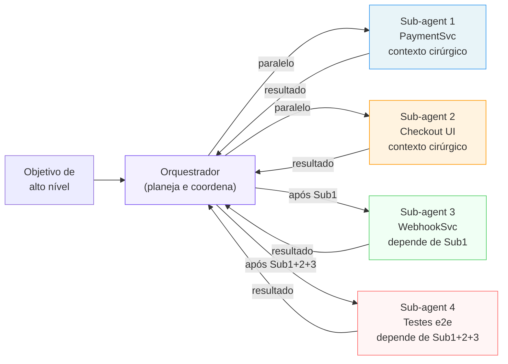

# Multi-agent — coordenar múltiplos agentes

> [!abstract] TL;DR
> Multi-agent em [[Dicionário de IA#Claude Code|Claude Code]] é o padrão de ter um [[Dicionário de IA#orchestrator-worker|agente orquestrador]] que define o plano e despacha [[Dicionário de IA#subagent|sub-agents]] para executar partes independentes. O orquestrador não executa código — gerencia. Cada sub-agent executa em contexto limpo com escopo bem definido. O valor: tarefas em paralelo com contexto isolado, sem a degradação de uma sessão monolítica longa. Multi-agent é a escala natural do Claude Code para projetos de médio/grande porte — quando o trabalho é grande demais para uma sessão mas pequeno demais para uma equipe.

## Por que funciona — o mecanismo

> [!question]- Por que não simplesmente ter uma sessão longa para tudo?

Sessões longas têm dois problemas fundamentais. Primeiro, contexto vira ruído: depois de 2h de implementação do módulo de pagamentos, o agente começa a ver o problema do sistema de notificações através da lente de pagamentos — e faz escolhas de design enviesadas. Segundo, você perde feedback loop: numa sessão monolítica você só sabe se algo funcionou quando chegou no final. Com sub-agents você tem checkpoints depois de cada parte.

Multi-agent resolve ambos: cada sub-agent começa com contexto limpo (sem viés), e o orquestrador revisa cada resultado antes de despachar o próximo. É um sistema com feedback loop estrutural, não linear.



> [!summary] A diferença entre sub-agents e multi-agent é escala e estrutura: sub-agents são o mecanismo; multi-agent é a arquitetura que organiza como sub-agents se relacionam, dependem e revisam o trabalho uns dos outros.

> [!tip] Vídeo complementar
> [How to Build Multi-Agent Teams in Claude Code (Step by Step)](https://www.youtube.com/watch?v=exe9PM8l54o) — explica a diferença prática entre Default Agents, Sub-Agents e Agent Teams no Claude Code, e quando escalar de um pra outro conforme o padrão orchestrator-worker descrito nesta nota.

### Exemplo concreto: a mesma feature, duas abordagens

> [!question]- Isso é abstrato — dá pra ver o contraste na prática?

Sim. Considere uma feature de "sistema de notificações" que precisa de: (1) modelo de dados, (2) worker que dispara notificações, (3) preferências do usuário, (4) UI de configuração. No total, ~6h de trabalho.

**Abordagem A — sessão longa monolítica**

```
09h00 — "Implemente o sistema de notificações completo."
09h00-10h30 — Agente projeta o modelo de dados, decide usar uma tabela
              `notifications` com status enum.
10h30-12h00 — Agente implementa o worker. Reaproveita o enum de status
              da etapa anterior — mas sem revisão intermediária, um erro
              de nomenclatura (`sent` vs `delivered`) passa despercebido.
12h00-14h00 — Agente implementa preferências do usuário. Já são 5h de
              contexto acumulado; o agente começa a "resolver" a UI de
              preferências reaproveitando padrões do worker (que são de
              backend, não de formulário), porque é o que está mais
              recente na janela de contexto.
14h00 — Só ao rodar os testes e2e o erro de nomenclatura do enum aparece.
        Debugar exige voltar 5h de decisões pra entender onde o enum
        divergiu.
```

O contexto não é neutro: ele empurra decisões na direção do que foi visto por último, não do que é correto para a tarefa atual. É o mesmo viés de recência que torna [[Dicionário de IA#few-shot|few-shot prompting]] eficaz — só que aqui ele distorce a sessão, porque o "exemplo mais recente" é apenas a etapa anterior do próprio trabalho do agente, não um exemplo cuidadosamente escolhido.

**Abordagem B — multi-agent**

```
Orquestrador: "Decompondo notificações em 4 sub-agents:
1. Modelo de dados (schema + migração) — sem dependências
2. Worker de disparo — depende de 1
3. Preferências do usuário — depende de 1
4. UI de configuração — depende de 3

Despachando Sub-agent 1 agora."

[Sub-agent 1 completa. Orquestrador revisa: enum de status ficou
`delivered | failed | pending`. Documenta isso explicitamente no
contexto do próximo dispatch, em vez de assumir que vai ser lembrado.]

Orquestrador: "Sub-agent 2 (worker), use exatamente estes valores de
enum: delivered | failed | pending. Não invente variações."

[Sub-agent 2 completa usando os valores corretos — porque o
orquestrador colocou a decisão no contexto cirúrgico, não deixou o
sub-agent inferir de memória de uma sessão de 5h atrás.]
```

O ponto de alavanca não é "múltiplos agentes são mais inteligentes" — é que o orquestrador **externaliza a decisão crítica** (o enum) e a repassa explicitamente, em vez de confiar que ela sobrevive intacta dentro de uma janela de contexto que só cresce.

> [!summary] Sessão longa acumula contexto e deixa decisões relevantes se diluírem. Multi-agent força o orquestrador a decidir explicitamente o que passa adiante — mais trabalho de preparo, e a fonte da confiabilidade extra.

## Papéis no sistema multi-agent

### Orquestrador

Responsabilidades:
- Receber o objetivo de alto nível
- Decompor em tarefas independentes com dependências mapeadas
- Definir o contexto mínimo de cada tarefa
- Despachar sub-agents na ordem correta
- Revisar e validar cada resultado antes de continuar
- Integrar os resultados no produto final

O orquestrador não implementa. Ele planeja, coordena, e revisa.

### Sub-agents

Responsabilidades:
- Executar uma tarefa específica com o contexto fornecido
- Reportar resultado e problemas encontrados
- Não tomar decisões de arquitetura além do escopo recebido
- Saber quando parar: quando o critério de sucesso for atingido

Um sub-agent não sabe o que os outros sub-agents estão fazendo — e não deveria.

## Decomposição efetiva pelo orquestrador

O primeiro trabalho do orquestrador é mapear dependências antes de qualquer dispatch:

```
"Antes de despachar sub-agents, vou mapear as dependências:

Tarefa 1: PaymentService (src/services/payment.ts)
→ Depende de: src/config/stripe.ts (já existe)
→ Nenhuma tarefa depende dela para começar

Tarefa 2: WebhookService (src/services/webhooks.ts)
→ Depende de: PaymentService (precisa dos tipos de Payment)
→ Aguarda Tarefa 1 completar

Tarefa 3: UI de checkout (src/components/Checkout.tsx)
→ Depende de: tipos de Payment (src/interfaces/payment.ts)
→ Pode rodar em paralelo com Tarefa 1

Tarefa 4: Testes e2e (tests/e2e/payment.test.ts)
→ Depende de: Tarefas 1, 2, 3 completas

Plano: Despachar Tarefas 1 e 3 em paralelo.
Depois despachar Tarefa 2 quando 1 completar.
Despachar Tarefa 4 quando 2 e 3 completarem."
```

## Prompt de dispatch com contexto cirúrgico

O orquestrador prepara o contexto do sub-agent com precisão:

```
"Sub-agent para PaymentService:

OBJETIVO: Implementar src/services/payment.ts

CONTEXTO RELEVANTE:
- src/interfaces/payment.ts — tipos (já definidos, não altere)
- src/config/stripe.ts — Stripe client configurado
- src/services/orders.ts — exemplo do padrão de serviço a seguir
- src/utils/logger.ts — use este logger, nunca console.log
- src/utils/errors.ts — AppError para erros de negócio

TESTES: tests/services/payment.test.ts (já escritos, faça passar)

ESCOPO: apenas src/services/payment.ts
NÃO MEXA em: routes, interfaces, outros serviços

PRONTO QUANDO: todos os testes em tests/services/payment.test.ts passam"
```

## Coordenação de resultados

Depois que sub-agents completam, o orquestrador valida compatibilidade:

```
"PaymentService e CheckoutUI completaram.
Agora revise os dois antes de despachar WebhookService:

1. src/services/payment.ts usa os tipos de src/interfaces/payment.ts
   corretamente? O WebhookService vai depender desses tipos.

2. src/components/Checkout.tsx consome a API do PaymentService
   da forma esperada? Se não, corrija antes de continuar.

Reporte: os outputs são compatíveis entre si?"
```

Só depois da validação o orquestrador despacha o próximo sub-agent.

## Anti-padrões no multi-agent

### Orquestrador que implementa

```
❌ Errado:
"Enquanto espero o sub-agent do PaymentService,
vou implementar eu mesmo o WebhookService..."

✓ Correto:
"Enquanto espero o sub-agent do PaymentService,
vou revisar os requisitos do WebhookService e preparar
o contexto para o próximo dispatch."
```

### Sub-agent com escopo vago

```
❌ Errado:
"Implemente o sistema de pagamentos"

✓ Correto:
"Implemente src/services/payment.ts conforme os tipos em
src/interfaces/payment.ts. Faça passar tests/services/payment.test.ts.
Não mexa em outros arquivos."
```

### Sub-agents dependentes em paralelo

```
❌ Errado:
Despachar WebhookService em paralelo com PaymentService
quando WebhookService importa tipos de PaymentService.

✓ Correto:
Aguardar PaymentService completar.
Revisar os tipos exportados.
Então despachar WebhookService com esses tipos como contexto.
```

## Multi-agent com worktrees

Para isolamento máximo, cada sub-agent trabalha em sua própria worktree:

```bash
# Orquestrador cria worktrees
git worktree add -b feat/payment-service ../proj-payment
git worktree add -b feat/checkout-ui ../proj-checkout

# Sub-agents rodam em worktrees separadas
# Terminal 1: cd ../proj-payment && claude (sub-agent para payment)
# Terminal 2: cd ../proj-checkout && claude (sub-agent para checkout)
```

Cada sub-agent tem arquivos completamente separados — sem conflito possível.

## Casos práticos

### Caso 1: implementação de feature grande em 4 fases

Feature de relatórios com backend, frontend, autenticação e testes:

```
"Vou implementar o sistema de relatórios. Decomposição e dependências:

Fase 1 (paralelo):
- Sub-agent A: API de relatórios — src/services/reports.ts +
  src/routes/reports.ts. Testes: tests/services/reports.test.ts
- Sub-agent B: Queries SQL — src/db/queries/reports.sql +
  src/db/repositories/reports.ts. Sem dependências de A.

Fase 2 (após Fase 1 completa e integração validada):
- Sub-agent C: UI de relatórios — src/pages/Reports.tsx +
  src/components/ReportTable.tsx. Consome API da Fase 1.

Fase 3 (após Fase 2):
- Sub-agent D: Testes e2e — tests/e2e/reports.test.ts.
  Cobertura: geração de relatório, filtros, export CSV.

Despache Sub-agent A e B agora em paralelo."
```

---

### Caso 2: refactoring com sub-agent de revisão cruzada

Um sub-agent refatora; outro revisa sem conhecer as decisões tomadas:

```
"Sub-agent de refactoring:
Extrai a lógica de validação de UserService para um UserValidator
separado em src/validators/user.validator.ts.
- Mova toda validação de src/services/user.ts para o validator
- UserService deve usar UserValidator, não ter validação inline
- Faça passar os testes existentes em tests/services/user.test.ts
- Adicione testes para UserValidator em tests/validators/user.test.ts

[depois que completar]

Sub-agent de revisão cruzada:
Revise o refactoring em src/services/user.ts e
src/validators/user.validator.ts.
- Há lógica de validação que ficou em UserService em vez de no Validator?
- O Validator tem acoplamento desnecessário com UserService?
- Os testes cobrem casos de borda do Validator?
Não corrija — reporte issues com arquivo:linha."
```

O sub-agent de revisão olha com olhos frescos. Encontra o que o agente de refactoring normalizou.

---

### Caso 3: auditoria paralela de múltiplas dimensões

```
"Auditoria de segurança do módulo de checkout. Crie 3 sub-agents
em paralelo — cada um com foco em uma dimensão:

Sub-agent 1 (Auth/Authz):
"Revise src/services/checkout.ts e src/routes/checkout.ts.
Há endpoints sem autenticação? Um usuário pode finalizar o checkout
de outro usuário? Inputs chegam ao banco sem sanitização?
Reporte: arquivo:linha:risco."

Sub-agent 2 (Idempotência):
"Revise src/services/checkout.ts e src/services/payment.ts.
O que acontece se o mesmo checkout for submetido duas vezes?
Há proteção contra double-charge? O processo de checkout é atômico?
Reporte: cenário:arquivo:linha:consequência."

Sub-agent 3 (Error handling):
"Revise src/services/checkout.ts.
Há erros da Stripe API que não são tratados?
Há cenários onde o checkout falha silenciosamente?
O estado do carrinho é consistente após uma falha?
Reporte: cenário:arquivo:linha:consequência."

Depois que os 3 completarem, agrego os resultados por severidade."
```

## Quando multi-agent faz sentido

**Faz sentido quando:**
- O objetivo tem ≥3 partes independentes que levam horas cada
- Você consegue definir critério de pronto para cada parte
- As partes têm interfaces bem definidas entre si
- O projeto tem boa cobertura de testes (sub-agents precisam saber quando terminaram)

**Não faz sentido quando:**
- A tarefa é pequena o suficiente para uma sessão (< 1h de trabalho total)
- As partes são profundamente interdependentes
- Você não sabe o suficiente para definir o escopo de cada sub-agent
- A arquitetura ainda está sendo decidida — decida antes de despachar

## Armadilhas comuns

> [!warning] Dispatch sem mapa de dependências
> Despachar sub-agents sem mapear quais tarefas dependem de quais resulta em sub-agent B esperando resultados que sub-agent A ainda não produziu — ou pior, A e B modificando o mesmo arquivo em paralelo e causando conflito. Sempre produza o mapa de dependências antes do primeiro dispatch.

> [!warning] Orquestrador que não valida entre fases
> Despachar sub-agent C (frontend) logo após A (backend) sem verificar que a API que A criou é compatível com o que C vai consumir resulta em incompatibilidade que só aparece nos testes e2e. A validação de compatibilidade entre sub-agents é responsabilidade do orquestrador — é o ponto mais importante do trabalho dele.

> [!warning] Sub-agent sem "definition of done"
> Sub-agent sem critério verificável de conclusão vai entregar quando achar que está pronto — que pode não coincidir com o que você precisa. Todo dispatch deve ter um `PRONTO QUANDO:` explícito. Testes passando é o melhor critério porque é verificável e objetivo.

> [!warning] Multi-agent para tarefas pequenas
> O overhead do multi-agent (decomposição, dispatch, revisão de cada resultado) é real. Para feature de 2h, uma sessão é mais eficiente. Multi-agent compensa quando o trabalho total é de 4h+ e pode ser parallelizado em partes de 1-2h cada. Abaixo disso, a coordenação custa mais que o ganho.

## Como explicar em inglês

**Multi-agent in Claude Code** is the orchestrator/worker pattern applied at scale: one orchestrating agent plans and coordinates; multiple sub-agents execute in isolated contexts. The orchestrator's job is decomposition, dispatch, and validation — it should not implement code itself. Each sub-agent receives surgical context (minimum necessary files and conventions) plus a verifiable success criterion.

The structural advantage over a single long session is twofold: context isolation (sub-agents make decisions without bias from other tasks) and feedback loops (the orchestrator validates each result before dispatching the next dependent task).

**In a technical interview**, you might say:

> "For large features I decompose with Claude Code's multi-agent pattern: an orchestrator session plans the breakdown, maps dependencies between parts, and dispatches sub-agents for each independent piece. The orchestrator validates each sub-agent's output before triggering dependent work. The key discipline is keeping the orchestrator out of implementation — its only job is coordination, context preparation, and cross-validating that sub-agents produced compatible interfaces."

### Tabela PT ↔ EN

| Português | English | Contexto |
|-----------|---------|----------|
| Sistema multi-agent | Multi-agent system | o padrão de múltiplos agentes |
| Orquestrador | Orchestrator | agente que coordena o trabalho |
| Decomposição | Decomposition | quebrar o objetivo em tarefas |
| Mapa de dependências | Dependency map | quais tarefas dependem de quais |
| Fase de execução | Execution phase | grupo de sub-agents que rodam juntos |
| Revisão cruzada | Cross-review | um sub-agent revisa o trabalho de outro |
| Critério de conclusão | Definition of done | o que define "tarefa completa" |
| Integração | Integration | combinar os resultados dos sub-agents |
| Compatibilidade de interface | Interface compatibility | outputs de sub-agents se encaixam entre si |

## O que vem a seguir

Multi-agent resolve a escala de implementação. A próxima fronteira é manter o contexto eficiente dentro de cada sessão — tanto no orquestrador quanto nos sub-agents.

- **[[03-Dominios/Tecnologia/IA/Claude Code/Workflows/10 - Gestão de contexto|10 - Gestão de contexto]]** — como usar `/clear`, `/checkpoint` e CLAUDE.md para manter sessões leves e eficientes
- **[[03-Dominios/Tecnologia/IA/Claude Code/Workflows/09 - Prompting para Claude Code|09 - Prompting para Claude Code]]** — escrever os prompts de dispatch que produzem sub-agents de alta qualidade

## Veja também

- [[03-Dominios/Tecnologia/IA/Claude Code/Workflows/07 - Sub-agents e dispatch|07 - Sub-agents e dispatch]] — como criar e instruir sub-agents
- [[03-Dominios/Tecnologia/IA/Claude Code/Workflows/06 - Sessões paralelas|06 - Sessões paralelas]] — worktrees para isolamento físico
- [[03-Dominios/Tecnologia/IA/Claude Code/Workflows/01 - Plan Mode|01 - Plan Mode]] — planejar a decomposição antes de despachar
- [[03-Dominios/Tecnologia/IA/Claude Code/Time e Automação/index|Time e Automação]] — multi-agent em contexto de time
- [[03-Dominios/Tecnologia/IA/Claude Code/Workflows/index|Workflows]] — índice do galho

## Referências

- [Anthropic — building effective agents](https://www.anthropic.com/research/building-effective-agents) — artigo da Anthropic sobre orchestrator/worker patterns e quando usar multi-agent
- [Claude Code — multi-agent frameworks](https://docs.anthropic.com/en/docs/claude-code/tutorials) — documentação oficial sobre multi-agent no Claude Code
- [Software Engineering at Google — decomposition](https://abseil.io/resources/swe-book) — princípios de decomposição que fundamentam a eficácia do multi-agent
