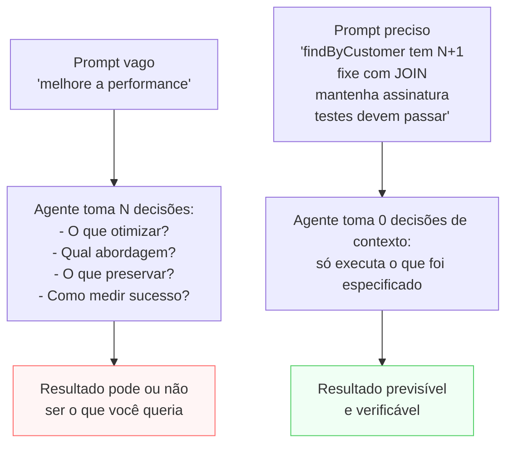

# Prompting para Claude Code — comunicar tarefas com precisão

> [!abstract] TL;DR
> Prompts vagos produzem implementações que "funcionam" mas não fazem o que você queria. A diferença entre um prompt eficaz e um ineficaz está em especificar: o que você sabe (contexto relevante), o que você quer (comportamento esperado), e o que não quer (restrições). O [[Dicionário de IA#Agent|agente]] toma decisões para preencher lacunas — sua job é minimizar as lacunas. Prompts eficazes não são mais longos: são mais densos em sinal. A maior habilidade de prompting não é saber escrever mais — é saber o que omitir.

## Por que funciona — o mecanismo

> [!question]- Por que um prompt preciso produz código melhor do que um prompt vago?

Porque o [[Dicionário de IA#Claude Code|Claude Code]] toma decisões para preencher cada lacuna no seu prompt. Um prompt vago não é "mais fácil para o agente" — é mais difícil, porque ele precisa fazer mais suposições. E cada suposição é uma chance de divergir do que você queria.

Pense assim: você contratou um desenvolvedor sênior para implementar uma feature. Se você diz "melhore a performance do serviço de orders", ele vai otimizar o que *ele* acha que está lento, usando as técnicas *que ele* prefere, com as constraints *que ele* assume. Pode ou não ser o que você queria. Se você diz "o método findByCustomer tem N+1 query quando o cliente tem >100 pedidos — corrija com JOIN mantendo a assinatura atual e os testes passando", ele vai exatamente isso.



> [!summary] Prompts eficazes minimizam as decisões que o agente precisa tomar. Cada lacuna que você deixa é uma decisão que o agente vai fazer — sem o contexto que você tem.

## O que o agente faz com um prompt

Quando você dá uma instrução ao Claude Code, o agente:

1. Lê o CLAUDE.md para entender o contexto do projeto
2. Examina os arquivos relevantes para entender o estado atual
3. Interpreta sua instrução dentro desse contexto
4. **Preenche todas as lacunas com suas próprias decisões**

O passo 4 é onde os problemas acontecem. Quanto mais vago o prompt, mais decisões o agente toma sozinho — e mais chance de divergir do que você queria.

## O princípio do "porquê antes do como"

A diferença mais importante em prompting para agentes:

```
❌ Como: "Use um Map em vez de um objeto para esse cache"

✓ Por que: "Esse cache precisa preservar a ordem de inserção
           e ter deleção O(1). Escolha a estrutura de dados
           mais adequada para isso."
```

Quando você especifica o "como", o agente implementa mecanicamente.
Quando você especifica o "porquê", o agente entende o objetivo e pode:
- Identificar que sua solução proposta não resolve o problema
- Sugerir uma abordagem melhor
- Fazer a implementação correta mesmo em edge cases não especificados

A exceção: quando você tem uma restrição técnica específica (requisito de biblioteca, compatibilidade de sistema), aí é apropriado especificar o "como" — e explicar por quê essa restrição existe.

## Quatro elementos de um prompt eficaz

### 1. Contexto relevante

O que o agente precisa saber que não está óbvio no código:

```
"O endpoint POST /api/orders está lento em produção.
Temos ~10k pedidos por dia, pico de 50 req/s às 12h.
O banco tem índice em orders.customer_id mas não em orders.created_at."
```

### 2. Comportamento esperado

O que "pronto" significa em termos observáveis:

```
"Após a mudança, o endpoint deve responder em <100ms para
95% das requisições. Os testes existentes em
tests/routes/orders.test.ts devem continuar passando."
```

### 3. Restrições explícitas

O que não pode mudar, mesmo que faça sentido mudar:

```
"Não altere a interface pública do endpoint (path, método, payload).
Não use cache em memória — não temos Redis em produção.
As queries devem continuar funcionando com PostgreSQL 13."
```

### 4. Arquivos relevantes

Para onde olhar (e para onde não olhar):

```
"Foco em: src/routes/orders.ts, src/services/orders.ts,
src/db/queries/orders.ts

Não mexa em: src/middlewares/, src/config/"
```

## Exemplos contrastados

### Vago vs. Preciso

```
❌ Vago:
"Melhore a performance do serviço de orders"

✓ Preciso:
"O método OrderService.findByCustomer() está demorando >500ms
quando o cliente tem mais de 100 pedidos. A query SQL está em
src/db/queries/orders.ts linha 34. O problema parece ser
N+1: fazemos uma query por item de cada pedido.

Corrija usando JOIN ou batch query. Os testes em
tests/services/orders.test.ts devem passar.
Não altere a assinatura de findByCustomer()."
```

### Feature request

```
❌ Vago:
"Adicione autenticação no endpoint de admin"

✓ Preciso:
"O endpoint GET /api/admin/reports (src/routes/admin.ts linha 23)
não tem autenticação. Adicione o middleware requireAdmin que está
em src/middlewares/auth.ts. O middleware verifica o header
Authorization: Bearer <token> e checa se o usuário tem role 'admin'
em nossa tabela users.

Escreva um teste em tests/routes/admin.test.ts que verifica:
1. Request sem header retorna 401
2. Request com token de usuário normal retorna 403
3. Request com token de admin retorna 200"
```

## Casos práticos

### Caso 1: bug com comportamento observável preciso

O pior prompt de bug: "está quebrando". O melhor:

```
"Bug: OrderService.createOrder() lança TypeError quando
order.items está vazio.

Reprodução:
1. Criar pedido com items: [] (array vazio)
2. OrderService.createOrder(order) lança:
   'Cannot read property 'total' of undefined'
3. Stack trace aponta para src/services/orders.ts linha 87

Comportamento esperado: pedido com items vazio deve retornar
erro AppError('EMPTY_ORDER', 'Pedido não pode ter itens vazios')
com status 422.

Não adicione validação em outros lugares — só em createOrder()."
```

---

### Caso 2: feature com múltiplos critérios de aceitação

```
"Implemente paginação no endpoint GET /api/products.

Parâmetros a aceitar: ?page=1&limit=20 (defaults: page=1, limit=20, max: 100)

Response esperado:
{
  data: Product[],
  pagination: {
    total: number,     // total de produtos
    page: number,      // página atual
    limit: number,     // items por página
    totalPages: number
  }
}

Constraints:
- Clientes existentes que não passam page/limit devem receber a primeira
  página com 20 items (backward compatible)
- Não use offset para paginação — use cursor (next_cursor no response)
  se a performance com >10k produtos importar; se não, offset está ok
- Testes: tests/routes/products.test.ts — adicione casos para:
  - Request sem parâmetros
  - page=2&limit=5
  - limit=200 (deve retornar 400)"
```

---

### Caso 3: exploração antes de implementação

```
"Precisamos implementar rate limiting na nossa API.
Stack: Node.js/Express, Postgres, sem Redis ainda.
Volumes: ~1k req/min normalmente, pico de 5k req/min.
Casos que queremos limitar: brute force em /api/auth/login
e scraping em /api/products.

Não implemente ainda. Análise as opções disponíveis:
1. Middleware em memória (express-rate-limit)
2. Postgres-based (store customizado)
3. Redis + express-rate-limit
4. Serviço dedicado (NGINX, Cloudflare)

Para cada: como funciona, quando faz sentido, trade-off principal
para nossa situação específica. Recomende uma e justifique."
```

Pedir análise antes da implementação economiza tokens de retrabalho.

## Prompts para exploração

Quando você genuinamente não sabe o que quer, diga isso explicitamente:

```
"Não sei como implementar rate limiting na nossa API.
Tenho opções: middleware em Express, Redis, serviço dedicado.
Qual faz mais sentido dado nosso stack (Node.js, Postgres, sem Redis)?
Não implemente ainda — só me explique as opções com trade-offs."
```

Pedir análise antes de implementação é válido — e mais eficiente do que receber uma implementação que você vai rejeitar.

## Prompts de diagnóstico

Para entender o que o agente entendeu antes de ele implementar:

```
"Antes de implementar, explique em 3 bullet points como você
vai resolver o problema. Não escreva código ainda."
```

Se a explicação estiver errada, corrija antes de gastar tokens na implementação. Isso é o Plan Mode aplicado inline — sem precisar do flag `--plan`.

## Tamanho do prompt

Prompts mais longos não são sempre melhores. O que importa é a relação sinal/ruído:

**Alto sinal:** contexto que muda a decisão do agente
**Ruído:** contexto que o agente ignoraria de qualquer forma

```
❌ Ruído:
"Este é um projeto de e-commerce desenvolvido por nossa equipe.
Usamos boas práticas de desenvolvimento e prezamos pela qualidade..."

✓ Sinal:
"Projeto Node.js/TypeScript com Express + Postgres.
Convenções em CLAUDE.md. Testes com Jest em tests/."
```

## Iteração vs. reescrita

Quando o agente entrega algo errado, a tentação é reescrever tudo. Mas geralmente é mais eficiente:

```
"O resultado está quase certo, mas:
1. Você usou console.log em vez de logger (src/utils/logger.ts)
2. O erro em linha 45 deveria ser AppError, não Error genérico
3. O teste não cobre o caso de orderId inválido

Corrija só esses 3 pontos. O resto está certo."
```

Prompt de correção específico é mais rápido do que refazer tudo — e preserva o que estava bom.

> [!tip] Vídeo: Prompting 101 (Code w/ Claude, Anthropic)
> No talk [Prompting 101 | Code w/ Claude](https://www.youtube.com/watch?v=ysPbXH0LpIE), Hannah Moran e Christian Ryan (Anthropic) mostram, na prática, os mesmos padrões descritos aqui: começar pelo comportamento observável em vez da implementação, dar contexto denso em vez de longo, e usar prompts de diagnóstico ("explique antes de implementar") para pegar mal-entendidos antes de gastar tokens em código. Vale assistir depois de ler esta nota — o vídeo mostra o "antes e depois" de um prompt real sendo refinado ao vivo.

## Caso 4: decompor uma tarefa grande em etapas verificáveis

Os Casos 1-3 cobrem prompts para uma unidade de trabalho — um bug, uma feature, uma decisão. Mas
o problema muda de forma quando a tarefa é grande demais para uma unidade só: "migre o serviço de
pagamentos para o novo provedor" não é um prompt, é um projeto.

> [!question]- Por que não simplesmente descrever a tarefa grande e deixar o agente quebrar em passos?
> Porque o agente vai quebrar em passos — só que com os cortes que *ele* acha razoáveis, não os que
> preservam propriedades que importam pra você (rollback seguro, deploy incremental, compatibilidade
> durante a transição). Decompor tarefas grandes tem a mesma lógica de "porquê antes do como": se você
> não especifica onde os cortes devem ficar, o agente escolhe cortes que fazem sentido tecnicamente mas
> podem não fazer sentido operacionalmente.

Pense em uma reforma de casa: você não entrega ao empreiteiro "reforme a casa" e vai embora por três
meses. Você define fases (fundação, estrutura, acabamento), cada uma com um critério de "pronto" que
você pode verificar antes de liberar a próxima. Prompting para tarefas grandes segue o mesmo padrão —
cada etapa precisa ser uma unidade que pode ser validada isoladamente, não apenas um pedaço arbitrário
do trabalho total.

```
❌ Tarefa grande sem decomposição:
"Migre a autenticação de sessions em cookie para JWT em toda a aplicação."

✓ Tarefa decomposta em etapas verificáveis:
"Vamos migrar de session-cookie pra JWT em 3 etapas. Não implemente
tudo de uma vez — pare ao final de cada etapa pra eu validar.

Etapa 1: adicione emissão de JWT em paralelo ao cookie existente
(POST /api/login passa a retornar os dois). Não remova o cookie ainda.
Critério de pronto: login retorna cookie E JWT; testes existentes
de auth continuam passando.

Etapa 2 (só depois que eu confirmar a 1): migre os middlewares de
verificação para aceitar JWT OU cookie (fallback). Critério de pronto:
requests com JWT válido E requests com cookie válido são aceitos.

Etapa 3 (só depois que eu confirmar a 2): remova o cookie e o
fallback. Critério de pronto: só JWT é aceito; suite de auth
100% verde."
```

O ponto central: cada etapa tem (a) escopo fechado, (b) um critério de sucesso observável, e (c) um
gate explícito de confirmação antes de avançar para a próxima. Isso transforma uma tarefa arriscada
("vai que ele refatora tudo errado e eu só descubro no final") em uma sequência de tarefas pequenas,
cada uma revisável — o mesmo princípio do prompt de diagnóstico, aplicado ao longo de um projeto
inteiro em vez de uma única troca.

> [!warning] Decompor demais também tem custo
> Etapas granulares demais viram overhead de coordenação — você gasta mais tempo revisando checkpoints
> do que economiza em segurança. A régua prática: decomponha no nível em que um erro te custaria caro
> pra reverter (mudança de contrato de API, remoção de dado, deploy em produção). Trocas internas e
> reversíveis podem ficar numa etapa só.

> [!summary] Tarefas grandes não precisam de um prompt maior — precisam de vários prompts pequenos,
> cada um com critério de sucesso próprio e um gate de confirmação entre eles.

## Armadilhas comuns

> [!warning] "Faça o melhor possível" como critério de sucesso
> Sem critério verificável de conclusão, o agente define o próprio critério — que pode não ser o seu. Se você não especifica o que "pronto" significa, o agente vai parar quando achar que fez o suficiente. Critérios verificáveis: testes passando, endpoint retornando X, função com assinatura Y.

> [!warning] Prompt que descreve a solução, não o problema
> Se você descreve a solução, o agente implementa a solução descrita — mesmo que haja uma melhor, ou mesmo que a solução que você descreveu não resolva o problema. Descreva o problema: comportamento observado, comportamento esperado, restrições. Deixe o agente propor a solução.

> [!warning] Restrições implícitas que você assumiu
> Se você assume que o agente vai preservar um comportamento existente, mas não disse isso, ele pode refatorar de forma que quebra o comportamento. Se a assinatura de uma função não pode mudar, diga explicitamente. Se um endpoint não pode ter breaking changes, diga. Tudo que for implícito é uma lacuna.

> [!warning] Contexto demais sem relevância
> Um prompt com 500 linhas de contexto irrelevante é tão ruim quanto sem contexto — o agente vai processar tudo igualmente e perder o sinal no ruído. Inclua só o que muda a decisão: arquivos relacionados ao problema, restrições que contradizem o comportamento padrão, o contexto de negócio que justifica uma escolha técnica específica.

## Como explicar em inglês

**Effective prompting for Claude Code** is about minimizing the decisions the agent makes on your behalf. Every gap in your prompt is a decision the agent will fill with its own assumptions — without the business context, historical knowledge, or implicit constraints that you have.

The most impactful shift is "why before how": describe the problem and success criteria, not the implementation. An agent given the problem can propose and validate a solution; an agent given the implementation can only execute it — even when the implementation doesn't actually solve the problem.

**In a technical interview**, you might say:

> "The main skill in prompting Claude Code is density, not length. A 10-line prompt can be better than a 100-line one if it's precise about what matters: the observable behavior you want, the constraints you can't violate, and the files to focus on. Anything the prompt leaves implicit becomes a decision the agent makes alone — and it makes those decisions without the business context you have. So you minimize gaps, not pad with prose."

### Tabela PT ↔ EN

| Português | English | Contexto |
|-----------|---------|----------|
| Prompt vago | Vague prompt | prompt sem critérios ou restrições |
| Prompt preciso | Precise prompt | prompt com contexto, critério, restrições |
| Relação sinal/ruído | Signal-to-noise ratio | proporção de contexto útil vs. irrelevante |
| Lacuna | Gap | o que o agente tem que assumir por conta |
| Critério de sucesso | Success criterion | o que define "pronto" |
| Comportamento esperado | Expected behavior | como o sistema deve se comportar após a mudança |
| Restrição explícita | Explicit constraint | o que não pode mudar |
| Prompt de diagnóstico | Diagnostic prompt | pedir explicação antes de implementação |
| Iteração | Iteration | rodada de correção sobre resultado parcial |

## O que vem a seguir

Prompts eficazes são o núcleo da interação com o agente. A outra metade é gerenciar o contexto da sessão — que afeta tanto a qualidade das respostas quanto o custo de tokens.

- **[[03-Dominios/Tecnologia/IA/Claude Code/Workflows/10 - Gestão de contexto|10 - Gestão de contexto]]** — como usar `/clear`, checkpoints e CLAUDE.md para manter sessões eficientes
- **[[03-Dominios/Tecnologia/IA/Claude Code/Workflows/01 - Plan Mode|01 - Plan Mode]]** — usar Plan Mode como protocolo de confirmação de entendimento antes da execução

## Veja também

- [[03-Dominios/Tecnologia/IA/Claude Code/Workflows/01 - Plan Mode|01 - Plan Mode]] — Plan Mode para confirmar entendimento antes de executar
- [[03-Dominios/Tecnologia/IA/Claude Code/Workflows/04 - Debugging complexo|04 - Debugging complexo]] — descrever comportamento observado vs. esperado
- [[03-Dominios/Tecnologia/IA/Claude Code/Configuração/02 - CLAUDE.md anatomia|02 - CLAUDE.md anatomia]] — contexto permanente que reduz repetição de prompts
- [[03-Dominios/Tecnologia/IA/Claude Code/Workflows/index|Workflows]] — índice do galho

## Fontes

- [Anthropic — prompt engineering guide](https://docs.anthropic.com/en/docs/build-with-claude/prompt-engineering/overview) — guia oficial de prompt engineering da Anthropic
- [Claude Code — best practices](https://docs.anthropic.com/en/docs/claude-code/best-practices) — boas práticas oficiais para prompting no Claude Code
- [Google — prompt design strategies](https://ai.google.dev/gemini-api/docs/prompting-strategies) — referência comparativa de estratégias de prompt design para LLMs de código
- [Prompting 101 | Code w/ Claude](https://www.youtube.com/watch?v=ysPbXH0LpIE) (Anthropic, 2025) — talk oficial de Hannah Moran e Christian Ryan sobre padrões de prompting que funcionam na prática com Claude Code
