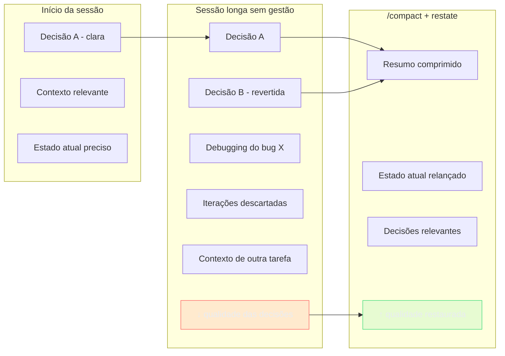
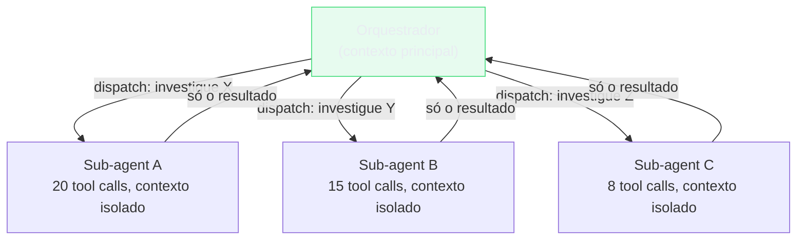

# Gestão de contexto — qualidade em sessões longas

> [!abstract] TL;DR
> Sessões longas degradam a qualidade das decisões do [[Dicionário de IA#Agent|agente]] — não porque o Claude fica "cansado", mas porque o [[Dicionário de IA#Context window|contexto]] acumula ruído e o agente pondera conversas antigas junto com as novas. O sinal de alerta é o agente fazendo escolhas inconsistentes com decisões recentes. Gestão de contexto ativa (commits frequentes + `/compact` + sessões novas por fase) mantém a qualidade estável. O princípio geral: trate o contexto como RAM — dados que não precisam mais estar lá devem sair, e o que precisa persistir vai para o "disco" (CLAUDE.md, código commitado).

## Por que funciona — o mecanismo

> [!question]- Por que o agente começa a tomar decisões piores em sessões longas?

Porque o modelo de linguagem pondera todo o contexto disponível ao tomar uma decisão. Não existe "esquecer" — existe "ponderar menos", mas mesmo um peso pequeno multiplica o ruído quando o contexto tem centenas de mensagens.

Imagine uma sala de decisão onde todas as reuniões já acontecidas ainda estão acontecendo ao mesmo tempo, em volume decrescente mas audível. Você está tentando tomar uma decisão sobre a próxima release, mas ao fundo você ouve discussões sobre um bug que já foi corrigido três semanas atrás, a decisão de arquitetura que foi revertida na semana passada, e o debate sobre qual ORM usar que ainda não foi resolvido. Você consegue tomar a decisão, mas com mais ruído de fundo.

É exatamente isso que o agente experimenta numa sessão longa.



> [!summary] Contexto acumulado = sinal diluído. Gestão de contexto é o trabalho de manter a relação sinal/ruído alta durante toda a sessão — não apenas no começo.

## Por que o contexto degrada

O modelo de linguagem pondera todo o contexto disponível ao tomar uma decisão. Numa sessão longa:

- Decisões revertidas ainda estão no contexto e podem ser reutilizadas
- Código de iterações antigas influencia novas implementações
- Instruções de tarefas concluídas "poluem" a nova tarefa
- O histórico de debugging de um bug já corrigido ainda está visível

O agente não "esquece" o que foi decidido — ele pondera tudo com peso similar.

## Sinais de degradação de contexto

Fique atento a estes padrões:

**Regressão de decisões:** o agente usa `console.log` depois de várias iterações corrigindo isso. A instrução original "use logger" está no início da sessão e foi diluída.

**Inconsistência de padrões:** numa sessão onde você implementou dois serviços, o terceiro segue um padrão diferente dos dois primeiros — as implementações anteriores "competem" no contexto.

**Referências a código antigo:** o agente menciona uma função que você refatorou há 20 mensagens como se ainda existisse.

**Hesitação em decisões simples:** o agente pede confirmação de coisas que estavam claramente estabelecidas no início da sessão — sinal de que a instrução original está "diluída" pelo contexto acumulado.

> [!question]- O que fazer quando vejo os sinais de degradação?
> Primeiro, corrija o comportamento específico. Depois, avalie se vale compactar: se você já teve 2-3 correções do mesmo tipo na sessão, compacte e restate as regras explicitamente. Se foi um caso isolado, continue — o /compact tem custo (você perde contexto potencialmente útil).

## Métricas — quando o contexto está objetivamente cheio

> [!question]- Os sinais de degradação são comportamentais e subjetivos — dá pra medir "quão cheio" o contexto está, em vez de esperar o agente errar?
> Dá. O Claude Code expõe o número: rode `/context` na sessão e você vê o breakdown de tokens por categoria — system prompt, tools, memory files, skills, histórico de conversa — junto com o percentual usado da janela total.

Os sinais da seção anterior (regressão de decisões, inconsistência, hesitação) são o **efeito** visível da degradação. Você não precisa esperar o efeito aparecer no comportamento do agente pra agir — `/context` te dá a **causa** medida em número, antes que ela vire erro perceptível.

**Uso:**
```
/context
```

A saída mostra algo como:
```
Context Usage: 161.3k / 200.0k tokens (81%)
  System prompt:       4.2k
  Tools:               12.1k
  Memory files:         8.4k
  Skills:               6.7k
  Conversation:       129.9k
```

Pense no `/context` como o medidor de combustível do carro. Os sinais comportamentais — o agente hesitando, esquecendo uma instrução, revertendo uma decisão — são o carro engasgando porque o tanque já esvaziou. O medidor avisa *antes* de engasgar; ele não substitui o motorista prestando atenção, mas dá um número em vez de um palpite.

Regra prática, alinhada ao limiar de `/compact` da seção seguinte: trate **~50%** da janela como o ponto de atenção (comece a planejar um checkpoint natural) e **~80%** como o ponto de ação obrigatória — compacte ou encerre a sessão antes que a degradação apareça no comportamento, não depois de já ter aparecido.

> [!summary] Sinais de degradação são o efeito; `/context` é a causa medida em número. Combine os dois: monitore o percentual proativamente durante a sessão, e trate os sinais comportamentais como confirmação tardia de que já passou da hora de compactar.

> [!tip] Vídeo — o que compõe uma janela de contexto
> [Most devs don't understand how context windows work](https://www.youtube.com/watch?v=-uW5-TaVXu4) (Matt Pocock, out/2025) — explica o que entra na janela de contexto de um agente de IA (tokens de entrada e saída, histórico, ferramentas) e por que essa é a restrição central de qualquer sessão longa com agentes de codificação. Complementa o mecanismo de "sinal diluído" desta nota com a mecânica de tokens por trás do número que o `/context` mostra.

## /compact — compactar o contexto

O comando `/compact` sumariza a sessão atual em um resumo comprimido, descartando os detalhes das mensagens individuais mas preservando as decisões e o estado atual.

```
Quando usar /compact:
- Depois de um commit significativo ("salvei o estado, posso compactar")
- Quando o contexto ultrapassar ~50% da janela de tokens
- Quando a tarefa muda de assunto (debugging → nova feature)
- Quando você perceber sinais de degradação
```

**Uso:**
```
/compact
```

Depois do /compact, restate a situação atual de forma explícita:

```
"Compactamos. Estado atual:
- Implementamos PaymentService (commit abc123) — concluído
- WebhookService ainda pendente

Próximo: implementar src/services/webhooks.ts seguindo o mesmo
padrão de PaymentService. Convenções no CLAUDE.md."
```

O restate é obrigatório — o agente não vai "inferir" o que está pendente depois da compactação.

## Commits como pontos de salvamento

A prática mais importante para sessões longas: commitar frequentemente.

```
Benefício 1: ponto de retorno
- Se algo der errado, git revert volta ao estado anterior
- Sem commits → só opção é /compact e reimplementar

Benefício 2: marcador de progresso
- "Já commitamos PaymentService" é informação que pode ser
  incluída no restate após /compact
- O histórico git se torna a fonte de verdade do progresso

Benefício 3: oportunidade natural de /compact
- Depois de cada commit, o estado está "limpo"
- Bom momento para compactar e começar a próxima tarefa com contexto fresco
```

## Sessões novas para fases distintas

Para projetos que duram mais de uma sessão, inicie uma sessão nova para cada fase distinta em vez de continuar a mesma sessão por dias:

```
Sessão 1: implementar PaymentService e WebhookService
→ Commite tudo, feche a sessão

Sessão 2: implementar UI de checkout
→ O agente começa com contexto limpo
→ O CLAUDE.md descreve o projeto, as implementações anteriores
  estão no código — não precisa do histórico da Sessão 1

Sessão 3: testes e2e
→ Mesma coisa
```

O CLAUDE.md e o código são o "estado persistido" entre sessões. O histórico de mensagens não precisa persistir.

## Gestão de contexto multi-agent — isolar em vez de compactar

> [!question]- E quando a tarefa não cabe numa sessão só, mesmo com `/compact` e sessões novas por fase?
> Aí a ferramenta muda de categoria: em vez de gerenciar o contexto de *uma* sessão, você distribui o trabalho entre várias sessões isoladas — sub-agents — que rodam em paralelo e devolvem só o resultado.

Tudo até aqui nesta nota assume um agente, uma sessão, um contexto crescendo linearmente. Mas há um limite estrutural: nenhuma técnica de compactação evita que uma tarefa de pesquisa ampla (10 hipóteses a investigar, cada uma exigindo várias buscas e leituras) explique o contexto principal antes mesmo de você chegar à síntese.

A saída não é comprimir mais — é **não deixar entrar**. Um sub-agent roda numa janela de contexto própria: ele pode fazer 20 chamadas de ferramenta, ler arquivos extensos, seguir becos sem saída — nada disso volta pro agente orquestrador. O orquestrador recebe só o resultado final, já sintetizado.

A diferença central em relação a tudo que foi dito até aqui: `/compact` gerencia o contexto *depois* que ele já cresceu, resumindo o que aconteceu. Sub-agents evitam que o contexto do orquestrador cresça, porque o trabalho exploratório nunca chega a entrar nele — só a conclusão. São mecanismos que atacam o mesmo problema (ruído acumulado) em pontos diferentes do ciclo de vida da sessão.



Isso não é só arquitetura elegante — é mensurável. A Anthropic reportou que um sistema multi-agent (agente líder Opus + subagentes Sonnet paralelos) superou um único agente Opus em **90,2%** numa avaliação interna de pesquisa, principalmente porque o formato permite gastar mais tokens úteis no problema sem que cada um deles compita pelo mesmo contexto compartilhado.

**Quando vale a pena:**
- Tarefas *breadth-first*: várias direções independentes que não dependem do resultado umas das outras (pesquisar 5 bibliotecas candidatas, auditar 8 módulos separados).
- O trabalho de cada sub-agent é volumoso o bastante pra sozinho já pressionar a janela de contexto principal.

**Quando não vale:**
- Tarefas sequenciais onde o passo N depende do resultado detalhado (não só do resumo) do passo N-1 — aí isolar contexto significa perder informação necessária.
- Tarefas pequenas, onde o overhead de orquestrar sub-agents supera o custo de só fazer inline.

> [!example]- Exemplo: revisão de código vs. pesquisa ampla
> Revisar um PR de 200 linhas é sequencial — cada arquivo pode depender do anterior pra fazer sentido; melhor manter tudo no mesmo contexto. Já pesquisar "quais das 6 bibliotecas de fila candidatas suportam retry com backoff configurável" é breadth-first — cada biblioteca é independente das outras, então despachar um sub-agent por biblioteca e coletar só as conclusões evita que a leitura de 6 READMEs e changelogs polua o contexto principal com detalhe irrelevante pra decisão final.

> [!summary] `/compact` reduz o que já está no contexto. Sub-agents evitam que o contexto cresça em primeiro lugar, isolando o trabalho exploratório numa janela separada e devolvendo só a síntese. São táticas complementares, não substitutas — veja [[03-Dominios/Tecnologia/IA/Claude Code/Workflows/07 - Sub-agents e dispatch|07 - Sub-agents e dispatch]] para o mecanismo completo de dispatch.

## Quando NÃO usar /compact

`/compact` descarta detalhes. Não use quando:

- Você está no meio de um debugging onde o histórico de hipóteses importa
- O agente está trabalhando num problema complexo e você precisa do contexto completo para revisar as decisões
- A sessão ainda está curta e não há degradação visível

Compactar por compactar tem custo: você perde contexto que pode ser útil. Compacte quando há sinal de degradação ou natural checkpoint (commit, mudança de assunto).

## Casos práticos

### Caso 1: sessão que mudou de assunto — debugging → feature

```
[2h de debugging de um N+1 query em OrderService]

[Bug corrigido e commitado]

"Commitamos o fix. /compact agora.

[depois do /compact]

Estado atual: fix do N+1 em OrderService.findByCustomer() commitado
em feat: fix N+1 query in order retrieval.

Próxima tarefa: implementar endpoint de exportação de relatórios
em src/routes/reports.ts. Spec em docs/reports-export-spec.md.
Não tem relação com o bugfix — contexto limpo para começar."
```

O debugging é irrelevante para a implementação do relatório. Compactar limpa o ruído.

---

### Caso 2: sessão longa com múltiplos serviços

```
Padrão de commit e /compact por serviço:

Implementou PaymentService → commit → /compact + restate sobre WebhookService
Implementou WebhookService → commit → /compact + restate sobre ReportService
Implementou ReportService → commit → fechar sessão

Cada /compact + restate preserva só:
- O que já foi commitado (referência ao commit)
- O que está pendente (escopo do próximo)
- As convenções que se aplicam (ou referência ao CLAUDE.md)
```

---

### Caso 3: padrão de sessão para feature grande

Sessão de 4h com múltiplas fases:

```
[Início da sessão]
"Objetivo: implementar sistema de relatórios.
Partes: API + UI + testes e2e.
Começando pela API: src/services/reports.ts."

[API implementada e commitada]
"API commitada. /compact

[pós-compact]
API de relatórios concluída. Próximo: UI em src/pages/Reports.tsx.
A API expõe GET /api/reports e GET /api/reports/:id conforme
docs/reports-api.md."

[UI implementada e commitada]
"UI commitada. /compact

[pós-compact]
API e UI concluídas. Próximo: testes e2e em tests/e2e/reports.test.ts.
Cobrir: geração, filtros, export CSV."
```

## Padrão de sessão saudável

```
Início da sessão:
→ Declare o objetivo e o escopo
→ Aponte os arquivos relevantes
→ Cite convenções críticas (ou confie no CLAUDE.md)

Durante a sessão:
→ Commit depois de cada unidade de trabalho completa
→ Cheque `/context` de vez em quando — não espere o comportamento degradar pra descobrir que passou de 80%
→ /compact + restate quando mudar de assunto ou perceber degradação
→ Tarefa breadth-first grande demais para uma sessão? Considere despachar sub-agents em vez de tentar caber tudo no mesmo contexto
→ Se o agente fizer algo inconsistente, corrija e reforce a regra

Fim da sessão (se não concluiu):
→ Commite o estado atual
→ Deixe um TODO documentado se necessário
→ Próxima sessão começa com um restate do que foi feito e o que falta
```

## Armadilhas comuns

> [!warning] Não commitir antes de /compact
> Compactar sem commitar significa que se algo der errado no que vem depois, você não tem ponto de retorno fácil — o agente compactou o contexto que te ajudaria a entender o estado atual. Regra: commit antes de /compact, sempre.

> [!warning] Restate vago depois do /compact
> "Vamos continuar de onde paramos" depois do /compact não funciona — o agente não sabe onde parou com a mesma precisão que antes. Seja específico: qual commit foi o último, qual arquivo está pendente, qual é o critério de sucesso da próxima tarefa.

> [!warning] Ignorar os sinais de degradação e "corrigir e continuar"
> Quando o agente começa a fazer escolhas inconsistentes (usou console.log de novo, aplicou padrão errado), a tentação é corrigir pontualmente e continuar. Mas o contexto vai continuar degradando. Corrija a instância imediata e avalie se é hora de compactar.

> [!warning] /compact no meio de uma tarefa complexa
> Compactar quando o agente está no meio de um debugging complexo descarta as hipóteses e o raciocínio que podem ser necessários para continuar. Finalize a tarefa (ou chegue a um ponto de parada natural com estado documentado) antes de compactar.

## Como explicar em inglês

**Context management in Claude Code** is about maintaining signal-to-noise ratio throughout a session. Long sessions accumulate noise: reverted decisions, abandoned code paths, debugging for already-fixed bugs. The agent weights all of this context when making new decisions — which causes inconsistency and regression to earlier patterns.

The core toolkit is three-part: frequent commits (create safe restore points and natural compaction triggers), `/compact` (compress session history while preserving key decisions), and new sessions per phase (cleanest possible start, with CLAUDE.md and code as the persistent state between sessions).

**In a technical interview**, you might say:

> "For long Claude Code sessions, I treat context like RAM: I commit frequently to create restore points, use `/compact` at natural checkpoints (after each commit or when switching topics), and follow with an explicit restate of what's done and what's next. The CLAUDE.md and the code are the persistent state — the conversation history doesn't need to persist between sessions. When I see the agent regressing on established conventions, that's my signal that context has degraded and it's time to compact."

### Tabela PT ↔ EN

| Português | English | Contexto |
|-----------|---------|----------|
| Gestão de contexto | Context management | o conjunto de práticas |
| Degradação de contexto | Context degradation | qualidade caindo com sessão longa |
| Janela de contexto | Context window | limite de tokens da sessão |
| Compactação | Compaction / context compaction | o que /compact faz |
| Restate | Restate (sem tradução) | redeclarar estado após compactação |
| Ponto de salvamento | Save point | commit antes de /compact |
| Ruído | Noise | contexto irrelevante no histórico |
| Sinal | Signal | contexto que muda decisão do agente |
| Regressão de decisões | Decision regression | agente voltando a padrões anteriores rejeitados |
| Isolamento de contexto | Context isolation | sub-agent com janela própria, resultado sintetizado devolvido ao orquestrador |
| Pesquisa em amplitude | Breadth-first (query) | várias direções independentes, candidato natural pra dispatch em paralelo |

## O que vem a seguir

Gestão de contexto é a fundação de sessões produtivas. Com sessões limpas, você pode aplicar com eficácia todo o resto do galho Workflows.

As três técnicas cobertas aqui — `/compact`, sessões novas por fase, e isolamento via sub-agents — não são excludentes. Uma sessão saudável tipicamente usa as três: `/compact` no meio do trabalho contínuo, sessão nova quando a fase muda, sub-agents quando uma sub-tarefa específica ameaça inundar o contexto principal sozinha.

- **[[03-Dominios/Tecnologia/IA/Claude Code/Mental Model/06 - Compaction|06 - Compaction]]** — como /compact funciona internamente e os detalhes técnicos da compactação
- **[[03-Dominios/Tecnologia/IA/Claude Code/Configuração/02 - CLAUDE.md anatomia|02 - CLAUDE.md anatomia]]** — CLAUDE.md como contexto persistente que sobrevive entre sessões
- **[[03-Dominios/Tecnologia/IA/Claude Code/Workflows/08 - Multi-agent|08 - Multi-agent]]** — quando compactar não basta, isolar o trabalho em sub-agents paralelos vira a ferramenta certa

## Veja também

- [[03-Dominios/Tecnologia/IA/Claude Code/Mental Model/06 - Compaction|06 - Compaction]] — como /compact funciona internamente
- [[03-Dominios/Tecnologia/IA/Claude Code/Workflows/03 - Refactoring pesado|03 - Refactoring pesado]] — gestão de contexto em refactors longos
- [[03-Dominios/Tecnologia/IA/Claude Code/Configuração/02 - CLAUDE.md anatomia|02 - CLAUDE.md anatomia]] — CLAUDE.md como contexto persistente entre sessões
- [[03-Dominios/Tecnologia/IA/Claude Code/Workflows/07 - Sub-agents e dispatch|07 - Sub-agents e dispatch]] — contexto limpo por design via sub-agents
- [[03-Dominios/Tecnologia/IA/Claude Code/Workflows/08 - Multi-agent|08 - Multi-agent]] — orquestração de múltiplos sub-agents em paralelo, o cenário completo por trás da seção de isolamento de contexto multi-agent desta nota
- [[03-Dominios/Tecnologia/IA/Claude Code/Workflows/index|Workflows]] — índice do galho

## Referências

- [Anthropic — managing context in Claude Code](https://docs.anthropic.com/en/docs/claude-code/memory) — documentação oficial sobre memória e contexto no Claude Code
- [Anthropic — /compact command](https://docs.anthropic.com/en/docs/claude-code/cli-reference) — referência do comando /compact na CLI do Claude Code
- [Anthropic — Explore the context window](https://code.claude.com/docs/en/context-window) — documentação oficial do comando `/context` e do breakdown de tokens por categoria
- [Matt Pocock — Most devs don't understand how context windows work](https://www.youtube.com/watch?v=-uW5-TaVXu4) (out/2025) — vídeo explicando o que compõe uma janela de contexto e por que é a restrição central de agentes de IA
- [Anthropic — How we built our multi-agent research system](https://www.anthropic.com/engineering/multi-agent-research-system) — dado de 90,2% de ganho de um sistema multi-agent (Opus líder + Sonnet subagentes) sobre um único agente Opus, e a explicação de por que isolar contexto em sub-agents funciona
- [Lilian Weng — LLM context length](https://lilianweng.github.io/posts/2023-01-27-the-transformer-family-v2/) — fundamento técnico: como transformers ponderam contexto longo
