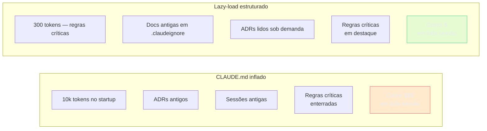

# Estrutura `.claude/` lazy-load — carga inicial enxuta, resto sob demanda

> [!abstract] TL;DR
> A cada `claude` aberto, o [[Dicionário de IA#Claude Code|Claude Code]] lê CLAUDE.md, `.claude/` e tudo que o `.claudeignore` *não* exclui. Em projetos com docs históricas e CLAUDE.md inflado, isso queima 8k–15k [[Dicionário de IA#Token|tokens]] *antes* da primeira pergunta. A solução estrutural é separar o que precisa estar visível no startup (instruções de comportamento, comandos diários, armadilhas críticas) do que pode estar disponível mas não carregado (sessões antigas, decisões, ADRs). Tudo continua acessível por menção explícita — só não custa nada até ser pedido. Lazy-load não é burocracia: é a aplicação do princípio de economia de atenção à estrutura de projeto.

## Por que funciona — o mecanismo

> [!question]- Por que o tamanho do CLAUDE.md importa se o agente "consegue processar tudo"?

Porque cada token carregado no startup é pago em *toda* sessão, mesmo quando irrelevante. Um CLAUDE.md de 10k tokens que contém decisões de arquitetura de 6 meses atrás, sessões antigas resumidas, e 50 ADRs completos vai pagar 10k tokens toda vez que você abre o Claude Code — mesmo numa sessão de 5 minutos para corrigir um typo.

Além do custo direto, há o custo de qualidade: o agente pondera todo o contexto disponível. Contexto irrelevante diluído no startup dilui o sinal das instruções que realmente importam. Um CLAUDE.md de 300 tokens com 5 regras críticas tem impacto mais direto do que um CLAUDE.md de 10k tokens onde as 5 regras estão enterradas.



> [!summary] A regra é simples: arquivo carregado por default custa tokens em toda sessão. Arquivo ignorado custa zero até ser pedido. Tudo que não muda o comportamento do agente em *toda* sessão deve sair do default.

## O que é

Lazy-load aplicado ao contexto inicial do Claude Code: organizar `.claude/` e os arquivos auto-incluídos para que o startup carregue um conjunto mínimo de **instruções vivas**, e qualquer outra coisa fique no repositório mas fora do contexto até ser explicitamente requisitada.

Três ingredientes:

1. **CLAUDE.md curto e estável** — instruções de comportamento que não mudam de sessão pra sessão (convenções, restrições, comandos canônicos). Alvo: 150–300 linhas, ~1.5k–3k tokens.
2. **`.claude/` com 3–4 arquivos focados** — "quick start", "armadilhas comuns", "mapa da arquitetura". Coisas que o agente realmente precisa ver toda sessão.
3. **`.claudeignore` agressivo** — exclui `docs/archive/`, `.claude/sessions/`, `completions/`, tudo que é histórico ou efêmero.

O resto da documentação fica nas pastas habituais do projeto. O agente pode lê-las quando você mencionar — não custa nada até lá.

## Como funciona

### Estrutura típica

```
your-project/
├── CLAUDE.md                    # ~150–300 tokens, ~30 linhas
├── .claudeignore                # exclui histórico e ruído
│
├── .claude/
│   ├── COMMON_MISTAKES.md       # top 5 bugs que custaram >1h
│   ├── QUICK_START.md           # comandos do dia-a-dia
│   ├── ARCHITECTURE_MAP.md      # "onde mora X"
│   ├── sessions/                # NO .claudeignore (0 tokens)
│   └── completions/             # NO .claudeignore (0 tokens)
│
└── docs/
    ├── INDEX.md                 # carregado se mencionado
    ├── adr/                     # decisões — lidas sob demanda
    └── archive/                 # NO .claudeignore
```

### O `.claudeignore` carrega o peso

```gitignore
# Sessões e histórico de Claude
.claude/sessions/
.claude/completions/
.claude/archive/

# Docs históricas
docs/archive/
docs/old/

# Build e dependências
node_modules/
dist/
build/
coverage/

# Logs e dumps
*.log
*.dump
*.bak
```

O `.claudeignore` segue a sintaxe do `.gitignore`. Tudo que ele cobre é invisível ao agente *até* você passar o caminho explicitamente em um `Read`.

### Princípio "0 tokens até ser pedido"

A regra mental: **arquivo carregado por default custa tokens em toda sessão**; arquivo ignorado custa zero tokens até ser explicitamente lido. Tudo que não muda *seu* comportamento como agente em *toda* sessão deve estar fora do default.

Decisões de arquitetura de 6 meses atrás? `docs/adr/` — não vai por default, vai quando você falar "leia o ADR-0007".

Resumo da sessão de ontem? `.claude/sessions/2026-05-21.md` — fica no repo pra você consultar, mas não pra o agente carregar automaticamente.

Lista de tarefas concluídas? `.claude/completions/` — fica pra história, custa zero contexto.

## Casos práticos

### Caso 1: CLAUDE.md inflado em projeto maduro

```
Diagnóstico: /context mostra 12k tokens no startup
  CLAUDE.md: 8k tokens
  .claude/: 4k tokens

Análise do conteúdo do CLAUDE.md:
- Convenções de código: 800 tokens (FICA)
- Comandos canônicos: 600 tokens (FICA)
- ADRs completos (7): 3k tokens (MOVE pra docs/adr/, lazy)
- Sessões antigas resumidas (5): 2k tokens (MOVE pra .claudeignore)
- Histórico de bugs resolvidos (lista de 20): 1.6k tokens
  (MANTÉM só os top 5 com >1h de debug, resto MOVE pra .claude/archive/)

Resultado: 8k → 1.4k tokens no CLAUDE.md
```

---

### Caso 2: pipeline automatizado com sub-agents

Em CI/CD onde Claude Code roda em modo headless, o custo de startup multiplica por número de sessões:

```
100 sessões/dia × 10k tokens de startup = 1M tokens/dia em "ruído de boot"
100 sessões/dia × 1.5k tokens de startup = 150k tokens/dia

Economia: 850k tokens/dia — em escala, compensa qualquer esforço de configuração
```

Para pipelines, o retorno de lazy-load é desproporcionalmente alto porque o startup é o custo dominante por sessão.

---

### Caso 3: distinguir "instrução viva" de "histórico"

A distinção crítica na hora de organizar:

| Tipo | Exemplo | Vai para |
|------|---------|----------|
| Instrução viva | "Use AppError, nunca Error genérico" | CLAUDE.md |
| Instrução viva | "npm test antes de commitar" | CLAUDE.md ou QUICK_START.md |
| Armadilha crítica | "Bug #47: nunca usar == com null aqui" | COMMON_MISTAKES.md |
| Decisão histórica | "ADR-003: escolhemos Postgres sobre MongoDB" | docs/adr/ (lazy) |
| Contexto de sessão | "Sessão 2026-05-21: implementamos PaymentService" | .claude/sessions/ (.claudeignore) |
| Tarefa concluída | "Feature de pagamento entregue em sprint 3" | .claude/completions/ (.claudeignore) |

## Quando usar

Vale a pena adotar quando:

- **Projeto >3 meses** com docs acumuladas e CLAUDE.md crescido organicamente.
- **Monorepo** ou repo grande onde o agente "varre" o início da sessão.
- **Pipelines automatizados** (CI, sub-agents) onde toda sessão paga o startup.
- Você já notou que `/context` mostra >5k tokens consumidos *antes* de você pedir nada.

Não vale a pena para:

- Projeto novo ou repo pequeno onde o CLAUDE.md ainda é proporcional.
- Sessões one-off em projeto exploratório.
- Caso onde a estrutura `.claude/` já não existe — não invente burocracia sem motivo.

## Como medir o impacto

Antes de adotar, meça. O comando `/context` no Claude Code mostra a composição atual:

```
/context
```

Output (esquematizado):

```
Total context: 14,832 tokens
  CLAUDE.md:           8,210 tokens
  .claude/:            3,420 tokens
  System reminders:    1,892 tokens
  ...
```

Se CLAUDE.md + `.claude/` somam >5k tokens em um projeto de tamanho médio, há ganho a capturar. Refatore, rode `/context` de novo, compare.

> [!tip] Vídeo: contexto como o verdadeiro gargalo
> [Make Claude Code 100x BETTER (Context Engineering)](https://www.youtube.com/watch?v=ySA9tJ8RfVM) trata o mesmo diagnóstico desta nota sob outro ângulo: a maioria dos problemas de "o agente esqueceu a instrução" ou "não seguiu o padrão" não é falha de prompt — é orçamento de contexto mal gerenciado. O vídeo reforça o raciocínio de custo por sessão que justifica separar instrução viva de histórico antes de tunar prompts.

Vale rodar `/context` em pelo menos dois momentos: **logo após abrir a sessão** (mede o custo de boot puro — CLAUDE.md + `.claude/` + system reminders) e **depois de uma tarefa típica** (mede quanto o trabalho normal empilha em cima do boot). Se o número de boot já é a maior fatia do total antes de qualquer tarefa, o ganho de lazy-load é desproporcional: você está pagando esse valor em *toda* sessão, inclusive nas curtas. Registrar os dois números (boot vs. boot+trabalho) também ajuda a decidir prioridade: se o boot é pequeno mas o trabalho explode o contexto, o problema não é `.claude/` — é sandboxing de tool output ([[02 - Sandboxing de tool output]]), não estrutura de startup.

Uma segunda leitura do output do `/context` que costuma passar despercebida: a proporção entre CLAUDE.md e `.claude/`. Se `.claude/` sozinho supera o CLAUDE.md, geralmente é sinal de que algum arquivo dentro da pasta virou depósito de histórico — sessions ou completions esquecidos fora do `.claudeignore`. Vale abrir a pasta e conferir arquivo por arquivo antes de mexer no CLAUDE.md em si; às vezes o ganho maior está ali, não no arquivo principal.

## Armadilhas comuns

> [!warning] Mover tudo pra lazy "porque parece bom"
> Se você esvazia o CLAUDE.md, perde as instruções de comportamento que mantêm o agente alinhado. O ponto é separar **instruções vivas** (ficam) de **histórico** (sai). Convenções de código, restrições do projeto, comandos canônicos — ficam. Decisões de 6 meses atrás, sessões antigas, ADRs completos — saem.

> [!warning] `.claudeignore` mal configurado bloqueando arquivos legítimos
> Se você ignora `docs/` inteiro, mas o agente precisa ler um ADR específico que você mencionou, ele vai falhar na leitura. `.claudeignore` afeta leitura sob demanda — teste depois de configurar pedindo para o agente ler um arquivo que deveria estar acessível mas ignorado por default.

> [!warning] Cache miss por instabilidade do CLAUDE.md
> CLAUDE.md grande mas estável é melhor do que CLAUDE.md pequeno mas mutável: o prompt cache da Anthropic só ativa quando o início do contexto é idêntico entre chamadas. Se você troca o CLAUDE.md de sessão pra sessão, anula o desconto de cache (~$0.30/MTok vs $3/MTok). Estabilidade > tamanho para o cache.

> [!warning] COMMON_MISTAKES.md vira diário de bugs
> Se você adiciona cada bug novo, o arquivo cresce e perde o efeito (e quebra o cache). Limite a bugs que custaram >1h pra debugar e que têm chance realista de acontecer de novo. Se passou de 10–15 itens, arquive os mais antigos.

## Como explicar em inglês

**Lazy-load for `.claude/` structure** is the application of the "pay only for what you use" principle to Claude Code's startup context. Every file auto-loaded at session start costs tokens on every session, regardless of relevance. The goal is to keep the startup context to "live instructions" (conventions, daily commands, critical pitfalls) and leave everything else accessible-but-not-loaded: reachable when explicitly mentioned, but costing zero until then.

The `.claudeignore` file is the mechanism: it follows `.gitignore` syntax and controls what the agent can auto-discover vs. what requires an explicit Read call.

**In a technical interview**, you might say:

> "For projects with accumulated documentation, I apply lazy-load structuring to the `.claude/` folder: CLAUDE.md contains only live instructions (conventions, constraints, critical patterns), and historical content — ADRs, session logs, old decisions — goes either in `.claudeignore` or in doc folders the agent accesses on-demand. The `/context` command shows the startup token composition; I aim for CLAUDE.md under 3k tokens for a medium project. It's not just cost — a focused CLAUDE.md is also more effective because the agent's attention isn't diluted by irrelevant context."

### Tabela PT ↔ EN

| Português | English | Contexto |
|-----------|---------|----------|
| Carga inicial | Startup context | tokens carregados ao abrir o Claude Code |
| Sob demanda | On-demand | carregado apenas quando solicitado |
| Instrução viva | Live instruction | regra que se aplica a toda sessão |
| Histórico | History / archive | contexto de sessões passadas |
| Contexto de boot | Boot context | o que o agente vê antes da primeira pergunta |
| Custo de startup | Startup cost | tokens gastos antes de qualquer tarefa |

## Migração incremental de um projeto existente

Não é necessário reestruturar tudo de uma vez. A migração funciona em etapas:

**Passo 1 — Meça o estado atual.** Abra uma sessão limpa e rode `/context`. Anote quantos tokens o CLAUDE.md e o `.claude/` estão consumindo. Esse é o baseline.

**Passo 2 — Identifique o que é "histórico".** Releia o CLAUDE.md e classifique cada seção: instrução viva (fica) ou registro histórico (sai). Sessões antigas, ADRs completos, e listas de tarefas concluídas são os candidatos mais comuns a mover.

**Passo 3 — Crie o `.claudeignore` mínimo.** Comece só com `.claude/sessions/` e `docs/archive/` se existirem. Teste rodando `/context` de novo — o número deve cair.

**Passo 4 — Extraia um arquivo de referência.** Se o CLAUDE.md tem mais de 200 linhas, extraia os ADRs ou histórico para `docs/adr/` e substitua no CLAUDE.md por uma linha: `"Para decisões de arquitetura, ver docs/adr/"`.

**Passo 5 — Valide.** Faça uma sessão normal de trabalho com a estrutura nova. Se o agente pedir informação que você sabe que está nos docs mas não passou explicitamente, está certo — é o lazy-load funcionando. Passe o arquivo quando precisar.

Um erro comum na migração é tentar fazer os 5 passos numa tarde só, num projeto com meses de histórico acumulado. Isso costuma terminar em duas formas de dano: (1) mover coisa demais pro `.claudeignore` de uma vez, sem confirmar que nada crítico foi junto — e só descobrir na sessão seguinte, quando o agente "esquece" uma convenção que sempre funcionou; ou (2) parar no meio, com o CLAUDE.md fragmentado entre "o que ainda está lá" e "o que já foi extraído mas ninguém documentou pra onde foi". A migração funciona melhor como hábito recorrente — rode o Passo 1 (`/context`) uma vez por semana enquanto o projeto ainda está acumulando docs, não como projeto único de limpeza. Cada nova seção que entra no CLAUDE.md já nasce classificada: instrução viva ou histórico. Isso evita que o arquivo volte a inflar entre uma migração e a próxima.

**Passo 6 — Trate a estrutura como código, não como documentação estática.** `.claudeignore` e a pasta `.claude/` mudam junto com o projeto: um módulo novo pode virar `ARCHITECTURE_MAP.md`, uma pasta de build nova precisa entrar no ignore antes que alguém note o `/context` subindo de novo. Revisar essa estrutura em PR — do mesmo jeito que se revisa `.gitignore` — é mais barato do que descobrir o inchaço três meses depois, numa sessão que devia ser rápida e não foi.

Sinal prático de que a migração estabilizou: o número do Passo 1 (`/context` no boot) para de crescer sessão após sessão, mesmo com o projeto avançando. Se ele continua subindo, alguma seção nova está entrando direto como "instrução viva" sem passar pelo filtro do Passo 2 — vale revisitar o hábito antes de acumular mais uma rodada de dívida de contexto.

Times que já passaram por essa migração relatam o mesmo padrão: o primeiro corte é o mais fácil (sessões antigas e ADRs saltam aos olhos), mas o segundo corte — decidir que uma convenção "sempre usada" na verdade só se aplica a um módulo específico e pode sair do CLAUDE.md geral — exige mais julgamento e costuma ser onde a economia real aparece.

Esse segundo corte é também o que mais se beneficia de um `.claude/` bem segmentado por arquivo: em vez de forçar a convenção específica de um módulo pra dentro do CLAUDE.md geral (custando tokens em toda sessão, mesmo nas que nunca tocam aquele módulo), ela vira um arquivo à parte — lido só quando o agente entra naquela área do código.

## O que vem a seguir

Lazy-load resolve o contexto de *boot*. Se a sessão gera muito ruído durante a execução (tool outputs grandes), a próxima camada é sandboxing.

- **[[02 - Sandboxing de tool output]]** — interceptar resultados verbosos de tool calls antes que entrem no contexto
- **[[03 - Indexação semântica externa]]** — para projetos grandes onde mesmo o acesso sob-demanda é caro

## Veja também

- [[03-Dominios/Tecnologia/IA/Claude Code/Configuração/02 - CLAUDE.md anatomia|CLAUDE.md anatomia]] — estrutura do arquivo principal
- [[03-Dominios/Tecnologia/IA/Claude Code/Configuração/07 - Pasta .claude|Pasta .claude]] — convenções de organização
- [[03-Dominios/Tecnologia/IA/Claude Code/Mental Model/07 - Tokens e custo|Tokens e custo]] — fundamentos econômicos
- [[03-Dominios/Tecnologia/IA/Claude Code/Workflows/11 - Estratégias estruturais de contexto/index|Tronco do sub-galho]]

## Referências

- [Claude Code — memory and context](https://docs.anthropic.com/en/docs/claude-code/memory) — documentação oficial sobre CLAUDE.md e controle de contexto
- [Anthropic — prompt caching](https://docs.anthropic.com/en/docs/build-with-claude/prompt-caching) — como o cache de prefixo funciona e por que estabilidade importa
- [nadimtuhin/claude-token-optimizer](https://github.com/nadimtuhin/claude-token-optimizer) — scaffolding via `npx` que cria a estrutura `.claude/` e `.claudeignore` para 13 frameworks (Express, Next.js, Vue, Django, Rails, Laravel, etc). MIT, útil como ponto de partida.
- [Make Claude Code 100x BETTER (Context Engineering)](https://www.youtube.com/watch?v=ySA9tJ8RfVM) (2025) — vídeo sobre orçamento de contexto como causa raiz de "o agente esqueceu a instrução", reforçando o diagnóstico de boot cost desta nota.
- [Explore the context window — Claude Code Docs](https://code.claude.com/docs/en/context-window) — documentação oficial sobre a composição do contexto e o comando `/context`.
- [Claude Code — Common workflows](https://docs.anthropic.com/en/docs/claude-code/common-workflows) — workflows recomendados que dependem de um startup enxuto para funcionar bem em sessões longas.
