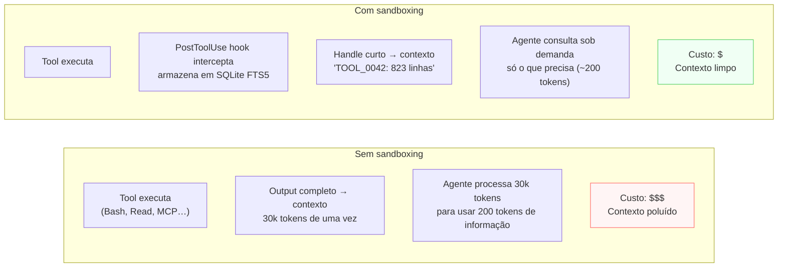

# Sandboxing de tool output — interceptar resultados antes que entrem no contexto

> [!abstract] TL;DR
> Toda vez que o [[Dicionário de IA#Claude Code|Claude Code]] executa um `Bash`, `Read` ou qualquer tool, o resultado completo entra no [[Dicionário de IA#Context window|contexto]] como texto. Um log de produção pode trazer 45k [[Dicionário de IA#Token|tokens]]; um snapshot do Playwright custa ~56k; vinte issues do GitHub somam ~59k. Sandboxing inverte o fluxo: um hook `PostToolUse` intercepta o output antes que ele entre no contexto, armazena em SQLite com indexação FTS5, e devolve ao agente um handle curto (`"TOOL_0042: 823 linhas indexadas"`). O agente consulta o handle sob demanda, pagando tokens só pelo que precisar. É a aplicação do princípio de lazy-load aos resultados de tools em tempo de execução — e reduz tipicamente 15–25% do custo total de sessões dominadas por tool calls grandes.

## Por que funciona — o mecanismo

> [!question]- Por que não deixar o agente ler o output completo diretamente?

Porque o modelo de linguagem processa todo o conteúdo do contexto com custo uniforme. Um output de 8k tokens de um `grep` custa o mesmo em tokens que 8k tokens de instruções relevantes — mas o *valor* é completamente diferente: o grep retorna 400 linhas, das quais o agente vai usar 3. As outras 397 linhas pagam tokens, ocupam janela de contexto, e diluem o sinal das mensagens relevantes.

O sandboxing funciona porque a maioria dos tool outputs grandes tem assimetria extrema de densidade: **output grande, consumo pequeno**. Um teste de performance retorna 500 linhas; o agente precisa dos 10 `FAIL`. Um log de access retorna 2000 linhas; o agente precisa das 5 que contêm `ERROR`. Armazenar e indexar o output completo, mas deixar o agente consultar só o que precisa, inverte a proporção de tokens gastos.



> [!summary] A assimetria que o sandboxing explora: a maioria dos tool outputs grandes tem menos de 5% de conteúdo útil para a tarefa atual. O restante é custo puro de contexto.

## O que é

Sandboxing de tool output é uma camada que se posiciona **entre o tool e o contexto**:

1. O agente invoca um tool (ex: `Bash("kubectl logs deploy/api --tail=2000")`).
2. Em vez de a saída de 30k tokens ir direto pro contexto, um hook `PostToolUse` intercepta.
3. A saída completa é gravada em SQLite com indexação FTS5 e um ID único.
4. O agente recebe um resumo compactado: primeiras/últimas linhas, contagem, padrões detectados, **handle de busca**.
5. Se o agente precisar de detalhe específico, ele chama uma função de consulta (`search_output("TOOL_0042", "OutOfMemoryError")`) que retorna só os trechos relevantes — sem rebuild.

A diferença para leitura cirúrgica (`| tail -20` no `Bash`) é que **a informação não é perdida** — ela existe em índice consultável; só não está consumindo contexto a cada turno.

## A arquitetura: hooks + SQLite + funções de consulta

### Hooks como ponto de interceptação

O Claude Code expõe quatro tipos de hook relevantes:

- **`PreToolUse`** — reescrever o comando antes de executar (ex: adicionar paginação, redirecionar output para arquivo temporário).
- **`PostToolUse`** — interceptar o resultado antes de devolver pro agente. É o núcleo do sandboxing.
- **`PreCompact`** — checkpoint antes da compactação automática.
- **`SessionStart`** — injetar instruções de routing ("use `search_output` em vez de ler o log direto").

Configuração em `.claude/settings.json`:

```json
{
  "hooks": {
    "PostToolUse": [
      {
        "matcher": "Bash|Read|Grep|Glob",
        "hooks": [
          {
            "type": "command",
            "command": "python3 .claude/hooks/sandbox_output.py"
          }
        ]
      }
    ]
  }
}
```

### SQLite com FTS5

```sql
CREATE TABLE tool_outputs (
    id INTEGER PRIMARY KEY,
    handle TEXT UNIQUE,
    tool_name TEXT,
    command TEXT,
    created_at INTEGER,
    line_count INTEGER,
    size_bytes INTEGER
);

CREATE VIRTUAL TABLE tool_output_lines USING fts5(
    handle,
    line_number,
    content,
    tokenize = 'unicode61'
);
```

A indexação FTS5 permite busca full-text nos outputs: `search_output("TOOL_0042", "ERROR")` retorna só as linhas que contêm "ERROR", com contexto de ±2 linhas.

### Funções de consulta expostas ao agente

```python
# Funções que o agente invoca via Bash após receber um handle
search_output("TOOL_0042", "failed test")    # busca FTS5 — retorna matches com contexto
get_lines("TOOL_0042", 100, 120)             # range de linhas por número
get_errors("TOOL_0042")                       # filtra linhas com ERROR/FAIL/Exception
get_summary("TOOL_0042")                      # primeiras 10 + últimas 10 + contagem
```

O agente aprende a usar os handles via instrução no CLAUDE.md ou no prompt de sessão:

```
"Tool outputs grandes estão indexados como handles.
Use search_output(<handle>, '<termo>') para buscar.
Use get_errors(<handle>) para filtrar só erros.
Nunca peça o output completo de um handle."
```

## Padrão "think in code"

O sandboxing muda como o agente pensa sobre outputs grandes. O padrão complementar é **think in code**: em vez de o agente ler N arquivos para contar funções, ele escreve um script que faz a contagem e retorna só o resultado.

```js
// Antes: 47 × Read() = ~700 KB de código no contexto
// Depois: 1 × Bash(script) = ~3.6 KB de resultado

const files = fs.readdirSync('src').filter(f => f.endsWith('.ts'));
files.forEach(f => {
  const lines = fs.readFileSync('src/' + f, 'utf8').split('\n').length;
  console.log(`${f}: ${lines}`);
});
```

A regra: **o agente deve programar a análise, não computar a análise**. Toda vez que o agente está prestes a ler N arquivos para reduzir a um número, ele deveria estar escrevendo um script que devolve só o número.

## Casos práticos

### Caso 1: testes com muita saída

Suíte de 200 testes que produz ~1500 linhas de output:

```
# Sem sandboxing: 1500 linhas entram no contexto de uma vez (~12k tokens)

# Com sandboxing:
Agente recebe: "TOOL_0055: 1483 linhas armazenadas."
Agente: search_output("TOOL_0055", "FAIL")
→ Retorna: 8 linhas FAIL + 2 linhas de contexto cada = ~24 linhas no contexto

"3 testes falharam: UserService.test.js:45, orders.test.js:112, auth.test.js:89.
 Vou corrigir UserService primeiro."
```

Economia: 1483 → 24 linhas efetivas no contexto (98% de redução para essa consulta).

---

### Caso 2: log de produção para depuração

Log de 5000 linhas exportado para depuração de incidente:

```
Agente recebe: "TOOL_0099: 5000 linhas indexadas."

Agente: search_output("TOOL_0099", "CRITICAL") → 3 linhas
Agente: search_output("TOOL_0099", "OutOfMemory") → 7 linhas
Agente: get_lines("TOOL_0099", 2847, 2860) → 14 linhas ao redor do CRITICAL

"Encontrei 2 tipos de erro: OutOfMemory em 7 ocorrências entre 14h-15h,
e um CRITICAL em database connection às 14:32.
O problema provavelmente é o spike de conexões — veja linha 2852."
```

O agente usou 24 linhas efetivas de um log de 5000 — chegando a uma conclusão útil.

---

### Caso 3: busca de símbolo em codebase grande

`grep -r "useSelector" src/` num projeto React retorna 200 ocorrências:

```
Agente recebe: "TOOL_0061: 200 ocorrências indexadas."

Agente: search_output("TOOL_0061", "Form")
→ Retorna: 12 linhas em componentes de formulário

"11 componentes de formulário usam useSelector diretamente.
 Candidatos à extração de um hook customizado: FormPayment, FormAddress, FormCheckout."
```

O agente navegou 200 ocorrências consumindo só 12 linhas de contexto.

## Quando usar

**Vale a pena quando:**

- Tool calls regularmente produzem >500 linhas de output (logs, testes, dumps, snapshots).
- Sessões de debugging longa onde o agente roda muitas buscas e o contexto acumula output.
- Pipelines headless (CI, sub-agents) onde controlar custo por sessão é crítico.
- Você já viu o `/context` mostrar que tool outputs dominam a janela.

**Não vale a pena quando:**

- Outputs são pequenos (funções bem focadas, repos pequenos, compilação rápida).
- O agente genuinamente precisa ler o output inteiro para raciocinar (raro — ex: diff de PR pequeno).
- O projeto é one-off ou exploratório — o overhead de setup (6-10h) não se amortiza.

## Custo e complexidade de setup

Sandboxing tem custo de implantação real:

| Componente | Esforço estimado |
|------------|-----------------|
| Hook `PostToolUse` em Python | 2-4h |
| Schema SQLite + FTS5 | 1h |
| Funções de consulta (4-5 funções) | 1-2h |
| Instruções de routing no CLAUDE.md | 30min |
| TTL + purge do banco | 1h |
| Testes e debug do pipeline | 2-3h |

**Total: ~8-12h de setup.** Amortiza se você usa Claude Code intensivamente em projetos grandes. Não amortiza em uso esporádico ou repos pequenos.

## Investigação gradual — o padrão de consulta por hipótese

Com sandboxing, o agente deve mudar sua estratégia de investigação. O padrão correto é **hipótese → consulta → refinamento**, não "baixar tudo e ler":

```
[Hipótese 1] "O erro é de conexão com banco"
  → search_output("TOOL_0099", "connection") → 12 linhas
  → "Não é conexão, é timeout nas queries."

[Hipótese 2] "É timeout de query"
  → search_output("TOOL_0099", "timeout") → 4 linhas
  → "3 timeouts em OrderService.findByCustomer() às 14:32-14:34"

[Hipótese 3] "N+1 causando timeout nos picos de carga"
  → get_lines("TOOL_0099", 2840, 2860) → 20 linhas de contexto
  → Confirmado. Stack trace aponta para linha 87 de orders.ts.
```

Cada hipótese custa ~5-20 linhas de contexto em vez dos 5000 do log inteiro. A qualidade da investigação não cai — o agente simplesmente para de pagar por linhas que não usa.

Esse padrão é o mesmo que um engenheiro experiente aplica ao `grep` em um log de produção: não lê tudo, começa com o padrão mais provável e afunila. O sandboxing torna esse comportamento a única opção — não há como "ler tudo" quando o output não está no contexto.

## Como medir o impacto do sandboxing

Antes de investir no setup, estime o ganho esperado medindo a composição atual do contexto:

```bash
# Após uma sessão típica de debugging, verifique o /context
# Identifique quanto dos tokens vem de tool outputs vs. instruções/código

# Regra prática:
# Se tool outputs = < 20% do contexto → ganho marginal, não vale o esforço
# Se tool outputs = 20-50% do contexto → ganho moderado, considere
# Se tool outputs = > 50% do contexto → ganho expressivo, invista no setup
```

Para sessions de debugging de logs e testes, tool outputs normalmente dominam 60-80% do contexto — fazendo o sandboxing altamente eficaz.

## Relação com as outras estratégias do galho

Lazy-load ([[01 - Estrutura .claude lazy-load|01]]) reduz o que carrega *no boot*; sandboxing reduz o que entra *durante* a sessão a partir de tool calls. As duas combinam — não competem.

Indexação semântica ([[03 - Indexação semântica externa|03]]) e knowledge graph ([[04 - Knowledge graph local com AST|04]]) mudam *como o codebase é navegado*. Sandboxing muda *como o output de qualquer tool é armazenado*. Também ortogonais — empilham.

## Armadilhas comuns

> [!warning] Hook que falha bloqueia o agente silenciosamente
> Se o hook `PostToolUse` lança exceção e não retorna nada, o Claude Code pode tratar como "sem output" — e o agente vai travar tentando entender por que o tool não retornou. Sempre adicione try/except e retorne um fallback legível: `"Sandboxing falhou: <mensagem>. Output original omitido."` O agente pode lidar com isso explicitamente.

> [!warning] SQLite sem TTL vira problema de disco
> Cada tool output armazenado ocupa disco. Uma sessão de 4h de debugging pode acumular centenas de MB. Adicione TTL: outputs mais velhos que 24h (ou N sessões) são deletados. Sem isso, o banco cresce indefinidamente e o purge se torna uma operação cara.

> [!warning] Resumo agressivo demais perdendo sinal crítico
> Se o hook retorna só "20 linhas omitidas" sem detectar que entre elas havia um stack trace, o agente não sabe que o erro existe — e continua chamando tools sem chegar à causa. O bom resumo detecta padrões (ERROR, FAIL, Exception, timeout) e os inclui no compacto, mesmo quando omite o restante.

> [!warning] Matcher muito amplo ou muito restrito
> Um matcher `.*` indexa todos os outputs, inclusive os pequenos que não precisam de sandboxing (um `ls` de 5 linhas, por exemplo). Um matcher muito específico deixa escapar MCP servers que também produzem outputs grandes. Calibre por tipo de tool e valide com `/context` depois de alguns turnos de uso real.

## Como explicar em inglês

**Tool output sandboxing** applies the lazy-load principle to runtime tool calls: instead of letting every tool result enter the context window in full, a `PostToolUse` hook intercepts the output, stores it in SQLite with FTS5 full-text indexing, and returns a short handle to the agent. The agent then queries the stored output on demand — consuming only the lines relevant to its current hypothesis.

The core insight is an information density asymmetry: a 2000-line log might contain 5 relevant `ERROR` lines. Without sandboxing, you pay for all 2000. With sandboxing, you pay for the 5 plus the handle description. Across a multi-hour debugging session with dozens of large tool calls, this compounds significantly.

**In a technical interview**, you might say:

> "For long debugging sessions in large codebases, I use PostToolUse hooks to sandbox tool outputs. A grep returning 300 results enters the context as a short handle; the agent searches it with FTS5 queries rather than reading everything upfront. The pattern I call 'think in code': the agent investigates progressively, pulling only the lines relevant to its current hypothesis, rather than dumping and scanning. Setup cost is real — maybe 10 hours — but for teams running Claude Code heavily on large repos, it pays back quickly in both token cost and context quality."

### Tabela PT ↔ EN

| Português | English | Contexto |
|-----------|---------|----------|
| Sandboxing de output | Tool output sandboxing | técnica de interceptar outputs de tools |
| Hook de pós-execução | PostToolUse hook | hook que roda depois da tool executar |
| Handle | Handle (sem tradução) | identificador curto do output indexado |
| Indexação full-text | Full-text indexing (FTS5) | busca por conteúdo no SQLite |
| Consulta sob demanda | On-demand query | agente busca só o que precisa |
| Assimetria de densidade | Information density asymmetry | output grande, conteúdo útil pequeno |
| Investigação gradual | Progressive investigation | buscar em camadas, não tudo de uma vez |
| Think in code | Think in code (sem tradução) | escrever script que computa, não ler e computar |

## O que vem a seguir

Sandboxing resolve o ruído gerado *durante* a sessão por tool calls verbosos. Para projetos grandes onde o próprio codebase é grande demais para navegar eficientemente, a próxima camada é indexação semântica.

- **[[03 - Indexação semântica externa]]** — RAG para código: busca por similaridade semântica em repositórios grandes demais para grep eficiente
- **[[04 - Knowledge graph local com AST]]** — grafo de dependências que responde "o que chama X?" sem ler o codebase inteiro

## Veja também

- [[03-Dominios/Tecnologia/IA/Claude Code/Configuração/05 - Hooks|Hooks]] — sistema de hooks do Claude Code (PreToolUse, PostToolUse, SessionStart)
- [[03-Dominios/Tecnologia/IA/Claude Code/Workflows/11 - Estratégias estruturais de contexto/01 - Estrutura .claude lazy-load|01 - lazy-load]] — base desta estratégia aplicada ao boot
- [[03-Dominios/Tecnologia/IA/Claude Code/Mental Model/07 - Tokens e custo|Tokens e custo]] — fundamentos econômicos que motivam o sandboxing
- [[03-Dominios/Tecnologia/IA/Claude Code/Workflows/11 - Estratégias estruturais de contexto/index|Tronco do sub-galho]]

## Referências

- [Claude Code — hooks reference](https://docs.anthropic.com/en/docs/claude-code/hooks) — documentação oficial dos hooks `PostToolUse`, `PreToolUse` e `SessionStart` com schema de I/O
- [SQLite FTS5 documentation](https://www.sqlite.org/fts5.html) — documentação oficial do FTS5 (full-text search) no SQLite, incluindo tokenizadores e operadores de busca
- [mksglu/context-mode](https://github.com/mksglu/context-mode) — MCP server que implementa sandboxing + "think in code" + session continuity, com plugins pra Claude Code, Gemini CLI, VS Code Copilot, Cursor, Codex. **Cuidado:** licença ELv2 (não-OSI, restritiva pra uso como serviço gerenciado). A arquitetura é o aprendizado real mesmo sem adotar.


