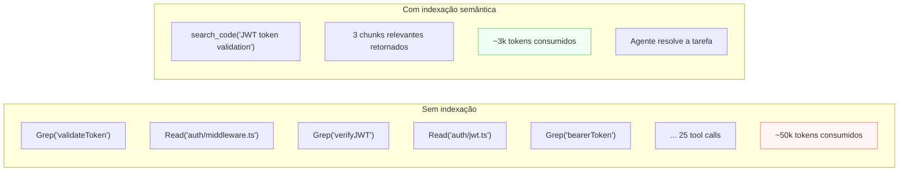
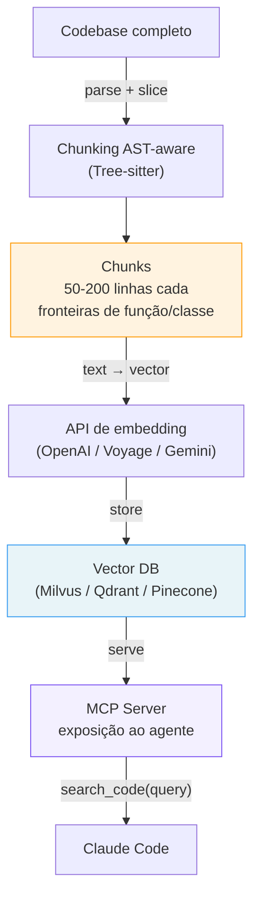
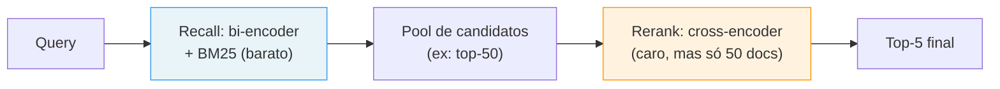

# Indexação semântica externa — vector DB como contexto persistente

> [!abstract] TL;DR
> A cada tarefa, o agente tende a redescobrir o codebase: `Grep`, `Read`, `Grep`, `Read`. Em monorepo grande, isso queima 50k–200k [[Dicionário de IA#Token|tokens]] só pra "achar onde está X". Indexação semântica parte o codebase em [[Dicionário de IA#chunking|chunks]], gera [[Dicionário de IA#embedding|embeddings]], guarda num [[Dicionário de IA#vector database|vector DB]], e expõe via [[Dicionário de IA#MCP (Model Context Protocol)|MCP]] uma tool `search_code(query)` que devolve só os trechos conceitualmente relevantes. O agente faz **uma** busca em vez de 30 grep+read, com 5%–10% do custo de tokens. Requer infra externa (API de embedding + vector DB) e disciplina de re-indexação incremental — mas em monorepo >100k LOC, o investimento se paga em semanas.

## Por que funciona — o mecanismo

> [!question]- Por que semantic search é mais eficiente do que grep + read em repos grandes?

Porque `grep` busca por texto exato e não sabe de semântica. Para encontrar onde um JWT token é validado, você pode tentar `validateToken`, `verifyJWT`, `bearerToken`, `authMiddleware` — são quatro buscas diferentes, cada uma retornando matches parcialmente relevantes, que você lê para filtrar manualmente. Em repositórios grandes, isso se transforma em 20-30 tool calls por tarefa só de "descoberta".

Embedding search entende intenção, não texto. A query `"how is JWT token validation implemented"` encontra código relevante mesmo se os nomes forem `checkAuth`, `tokenGuard`, ou `auth.verify` — porque o embedding captura o conceito de validação de token, não as palavras específicas. Uma busca substitui dez.



> [!summary] Indexação semântica muda o paradigma de "explorar para encontrar" para "consultar e chegar". Em repos grandes, a diferença é entre passar 30 minutos de tokens em descoberta ou 2 minutos.

## O que é

Aplicação clássica de [[Dicionário de IA#RAG (Retrieval-Augmented Generation)|RAG]] ao codebase: transformar o repositório inteiro em um índice vetorial consultável, externo ao contexto do agente.

Em vez do agente fazer:

```
Grep("authentication")        → 47 matches
Read("auth/login.ts")         → 200 linhas
Read("auth/middleware.ts")    → 150 linhas
Grep("validateToken")         → 12 matches
Read("auth/jwt.ts")           → 180 linhas
... (20 tool calls mais)
```

ele faz:

```
search_code("how is JWT token validation implemented")
  → chunk 1: auth/jwt.ts:34-67 (score: 0.94)
  → chunk 2: auth/middleware.ts:12-41 (score: 0.87)
  → chunk 3: auth/guards/bearer.ts:1-28 (score: 0.82)
```

A diferença não é só volume — é **qualidade de busca**: semantic search entende intenção, encontra código relevante mesmo com nomes diferentes, e ranqueia por similaridade conceitual em vez de match literal de texto.

## O pipeline de indexação



### Tipos de chunking

A qualidade do retrieval depende de como o código é cortado:

| Estratégia | Como funciona | Prós | Contras |
|-----------|--------------|------|---------|
| Janela fixa | Blocos de N linhas | Simples | Corta funções no meio |
| Por AST | Função/classe completa | Semântica preservada | Chunks de tamanho variável |
| Híbrido | AST para pequenos, janela para grandes | Equilíbrio | Implementação mais complexa |
| Sliding window | Blocos com sobreposição | Contexto nas bordas | Duplicação, custo maior |

Implementações sérias usam **Tree-sitter** para chunking AST-aware: parse da AST, detecção de boundaries (função, classe, método), corte respeitando os limites. O resultado é chunks semanticamente coerentes — um chunk de função é sempre a função inteira.

### Re-indexação incremental

Indexação inicial pode demorar (minutos a horas em repo grande com 1M LOC). O que torna a abordagem sustentável é **re-indexação incremental**: a cada commit ou save, só os chunks cujos arquivos mudaram são re-embedados.

Implementações maduras comparam a **Merkle tree** do repo (hash do conteúdo de cada arquivo) com o estado anterior. Os arquivos com hash diferente são re-indexados; o restante permanece. Em repos com mudanças típicas de feature (10-30 arquivos por PR), a re-indexação incremental leva segundos.

Sem re-indexação automática, o índice fica stale e o agente recupera "código antigo" — que pode nem compilar mais.

> [!tip] Vídeo — construindo indexação de codebase ao vivo
> [Code with me — build codebase indexing for RAG and semantic search with live update](https://www.youtube.com/watch?v=G3WstvhHO24) (CocoIndex) mostra, na prática e ao vivo, o mesmo pipeline descrito nesta seção: chunking AST-aware com Tree-sitter, geração de embeddings e atualização incremental do índice conforme o código muda — sem precisar re-processar o repo inteiro a cada save. Útil pra quem quer ver o Merkle-tree-diff e o chunking por AST saindo do diagrama e virando código rodando.

## Acesso via MCP

A camada que conecta o vector DB ao agente é um **MCP server**. Ele expõe tools que o agente invoca como qualquer outra ferramenta:

| Tool | Uso |
|------|-----|
| `search_code(query, top_k=5)` | busca semântica — retorna chunks ranqueados por score |
| `search_symbol(name)` | busca exata por nome de função/classe (fallback keyword) |
| `index_status()` | health check do índice (quando foi a última re-indexação, cobertura) |
| `reindex(path)` | força re-indexação de um path específico |

Configuração:

```bash
claude mcp add claude-context \
  -e OPENAI_API_KEY=sk-... \
  -e MILVUS_TOKEN=... \
  -- npx @zilliz/claude-context-mcp@latest
```

Com o MCP ativo, o agente pode usar `search_code` como qualquer tool nativa — sem saber que há um vector DB por baixo.

## Hybrid search — combinando semântico e keyword

Semantic search é forte para conceitos, fraco para símbolos exatos. `grep` é forte para símbolos exatos, fraco para conceitos. Implementações maduras combinam os dois:

```
hybrid_search(query="JWT validation", symbol="validateToken")
  → ranking combinado: vector similarity × BM25 score
  → o melhor dos dois mundos
```

O resultado combina relevância conceitual (embedding) com match literal (FTS5/BM25). É o padrão de busca empresarial — o mesmo que o Elasticsearch usa quando você habilita `semantic search + keyword`.

> [!question]- Como exatamente você combina dois rankings diferentes (vetor e BM25) em um só?
> O jeito ingênuo — normalizar os dois scores para 0-1 e somar — quebra fácil: BM25 e cosine similarity têm distribuições muito diferentes, então a soma acaba dominada por qualquer um dos dois que tiver escala maior naquela query específica.
>
> A técnica que resolve isso é **Reciprocal Rank Fusion (RRF)**: em vez de combinar os *scores*, combina as *posições* no ranking.
>
> ```
> RRF_score(doc) = Σ  1 / (k + rank_i(doc))
>                  i∈{vetor, BM25}
> ```
>
> `k` é uma constante de suavização (tipicamente 60). Um documento que aparece em 2º lugar no ranking vetorial e 5º no BM25 recebe um score maior do que um documento em 1º no vetorial mas ausente do BM25 — porque RRF recompensa consenso entre os dois rankings, não pico isolado em um deles. Não precisa normalizar nada: rank é sempre um inteiro, independente da escala do score original. É o método usado por padrão em Elasticsearch, Weaviate e na maioria das implementações de hybrid search de produção.

O achado empírico central em benchmarks de retrieval (texto e código) é que BM25 e dense retrieval têm **recall complementar**: os documentos que um erra, o outro frequentemente acerta. É esse complemento — não a soma bruta de scores — que faz hybrid search superar qualquer método isolado.

## Casos práticos

### Caso 1: onboarding de novo módulo em monorepo

Tarefa: "Preciso adicionar rate limiting no módulo de API gateway. Onde começa o código de middleware?"

```
# Sem indexação: engenheiro ou agente navega manualmente
Grep("middleware") → 120 matches em 40 arquivos
Read(...) → 3-4 arquivos para identificar o padrão

# Com indexação:
search_code("API gateway middleware pipeline")
  → chunk 1: gateway/middleware/chain.ts:1-45 (score: 0.96)
  → chunk 2: gateway/middleware/logger.ts:1-30 (score: 0.78)
  → chunk 3: gateway/config/middleware.ts:1-25 (score: 0.71)

"O pipeline de middleware está em gateway/middleware/chain.ts.
 Vou adicionar o rate limiting após o logger (linha 32) e antes do auth (linha 38)."
```

O agente chegou ao local correto com 1 tool call e 3 chunks (~90 linhas) em vez de 20+ tool calls.

---

### Caso 2: busca cross-cutting em refactoring

Tarefa: "Precisamos trocar nosso logger de Winston para Pino. Onde o logger é instanciado e usado?"

```
search_code("logger instantiation and initialization")
  → chunk 1: utils/logger.ts:1-35 (instanciação central)
  → chunk 2: services/orders.ts:3-8 (import e uso)
  → chunk 3: config/logging.ts:1-28 (configuração)

search_code("log function calls in business logic")
  → 5 mais chunks com padrões de uso específicos
```

Em vez de grep por `winston` (que só encontra o que já usa o nome), a busca semântica encontra onde o conceito de "logging" é aplicado — incluindo arquivos que podem usar o logger via abstração.

---

### Caso 3: auditoria de segurança por intenção

Tarefa: "Auditoria: há queries ao banco sem prepared statements?"

```
search_code("database query with string concatenation")
  → chunk 1: repositories/order.ts:87-102 (SQL concatenado diretamente)
  → chunk 2: legacy/reports.ts:45-60 (string interpolation em query)
  → chunk 3: admin/search.ts:112-128 (template literal com input do usuário)

"Encontrei 3 locations suspeitas de SQL injection.
 repositories/order.ts:92 é o mais crítico — usa input do usuário diretamente."
```

Grep por `SELECT` ou `query(` encontraria 150 resultados. A busca semântica encontrou os 3 que têm o padrão de risco.

---

### Caso 4: onboarding de dev júnior num monorepo desconhecido

Tarefa: dev novo pergunta "como funciona o fluxo de checkout deste sistema? Preciso adicionar um cupom de desconto."

```
# Sem indexação: dev pede ajuda no Slack, ou passa 1h navegando manualmente
Grep("checkout") → 80 matches espalhados em controllers, services, tests, mocks
Read(...) → 5-6 arquivos até montar o fluxo mental

# Com indexação:
search_code("checkout flow order total calculation")
  → chunk 1: checkout/service.ts:20-68 (orquestra o fluxo: cart → pricing → payment)
  → chunk 2: checkout/pricing.ts:1-40 (cálculo de total, onde descontos entram)
  → chunk 3: checkout/coupon.ts:1-25 (stub existente — só valida cupom, não aplica)

"O fluxo está em checkout/service.ts. O cálculo de total é em pricing.ts,
 e já existe um stub de validação de cupom em coupon.ts que não está
 conectado ao pricing ainda — é aí que a feature entra."
```

Esse é o caso onde indexação semântica paga dividendo além de tokens: reduz a dependência de conhecimento tribal. Um dev júnior (humano ou agente) chega à mesma resposta que um sênior chegaria perguntando no Slack — mas em segundos, sem interromper ninguém. O ganho não é só de custo, é de **autonomia de onboarding**: novos membros do time (ou uma nova sessão de agente sem memória do repo) reconstroem contexto sozinhos.

## Quando usar

| Cenário | Vale? | Por quê |
|---------|-------|---------|
| Monorepo >100k LOC | Sim | Grep direto vira gargalo |
| >20 grep+read por sessão | Sim | Custo de descoberta domina |
| Repo pequeno (<20k LOC) | Não | Grep resolve mais simples |
| Codebase instável (refactors diários) | Cuidado | Índice fica stale entre sessões |
| Sem budget pra embedding API | Não | Use grep + sandboxing |
| Busca por símbolo exato | Não | Grep/LSP são mais precisos |

## Custo real da abordagem

| Item | Custo estimado |
|------|---------------|
| Embedding API (indexação inicial 1M LOC) | ~$5 (OpenAI text-embedding-3-small) |
| Vector DB (free tier) | $0/mês até ~500k chunks |
| Vector DB (pago) | $20-100/mês a partir de alguns GB |
| Re-indexação incremental diária | <$0.10/dia em repos típicos |
| Setup e manutenção | 10-20h iniciais + ~1h/mês |

Em conta Claude Code de $500/mês com sessões longas em monorepo, redução de 30% no custo de tokens paga a infra em menos de 10 dias.

## Comparativo de modelos de embedding para código

Nem todo embedding é igual para código. Modelos treinados em linguagem natural pura têm desempenho inferior na recuperação de código:

| Modelo | Dimensões | Custo/1M tokens | Nota para código |
|--------|-----------|-----------------|-----------------|
| OpenAI text-embedding-3-small | 1536 | $0.020 | Boa escolha geral, equilibrada |
| OpenAI text-embedding-3-large | 3072 | $0.130 | Melhor qualidade, 6× mais caro |
| Voyage code-2 | 1536 | $0.120 | Treinado especificamente para código |
| Cohere embed-english-v3.0 | 1024 | $0.100 | Boa para código em inglês |
| nomic-embed-code (local) | 768 | $0 (GPU) | Self-hosted, sem envio de dados |

Para a maioria dos casos, `text-embedding-3-small` é o ponto de partida correto: custo baixo, qualidade adequada, fácil de trocar depois. Se você precisa de maior precisão (repo crítico, auditoria de segurança), `voyage-code-2` — treinado especificamente para código — costuma superar os modelos gerais por 10-15% em benchmarks de code retrieval.

## Benchmarks de retrieval em código

> [!question]- Como medir se o índice de fato "acha" o código certo, além do teste manual de sanidade?

Retrieval de código tem sua própria linhagem de benchmarks, distinta de retrieval de texto genérico — porque código tem estrutura (assinatura de função, hierarquia de classe) que texto em linguagem natural não tem.

**CodeSearchNet** foi o benchmark fundador (2019): pares de query-em-linguagem-natural → função-em-código, em seis linguagens. As baselines originais já comparavam IR clássico (ElasticSearch, BM25, TF-IDF) contra bi-encoders neurais treinados com objetivo contrastivo — o mesmo desenho conceitual usado hoje em embeddings de produção. Modelos mais recentes como CodeBERT e GraphCodeBERT elevaram a régua ao incorporar estrutura de AST diretamente no treinamento, não só o texto do código.

O padrão que a pesquisa mais recente confirma — e que a seção de hybrid search acima antecipou — é o desenho em duas etapas **recall-then-rerank**: um bi-encoder leve (opcionalmente com BM25 fundido) recupera um pool amplo de candidatos com baixo custo computacional; um cross-encoder mais caro reordena só esse pool reduzido para o ranking final. É o mesmo motivo pelo qual `search_code` retorna `top_k=5` em vez de escanear o repo inteiro toda vez — a etapa cara (reranking semântico completo) só roda sobre um conjunto pequeno e pré-filtrado.



Um exemplo concreto dessa estratégia de fusão é o sistema **TOSS**, que combina múltiplos sinais de retrieval (incluindo BM25) e atinge MRR (Mean Reciprocal Rank) de 0.763 com latência bem menor do que reranking puro sobre o corpus inteiro — evidência empírica de que hybrid search não é só "mais robusto", é também mais barato em produção, porque a etapa cara opera sobre um pool pequeno.

> [!summary] O benchmark confirma na prática o que a seção de hybrid search argumenta em teoria: BM25 e embeddings erram em pontos diferentes, e a arquitetura recall-then-rerank é o jeito padrão de capturar esse complemento sem pagar o custo de reranking sobre o corpus inteiro.

## Integração com o fluxo de desenvolvimento

A re-indexação precisa acontecer automaticamente. As três abordagens comuns:

### Via git hook

```bash
# .git/hooks/post-commit
#!/bin/bash
echo "Re-indexando arquivos modificados..."
git diff --name-only HEAD~1 | xargs claude-context reindex
echo "Indexação concluída."
```

Roda após cada commit. Indexa só os arquivos que mudaram. Latência: 1-5s para commits típicos.

### Via file watcher (em desenvolvimento ativo)

```bash
# Configurado no CLAUDE.md ou como processo separado
npx chokidar-cli 'src/**/*.ts' -c 'claude-context reindex {path}'
```

Re-indexa ao salvar. Mais responsivo, mas pode sobrecarregar se você salva frequentemente sem completar a lógica.

### Via CI/CD (para pipelines)

```yaml
# .github/workflows/reindex.yml
on:
  push:
    branches: [main]

jobs:
  reindex:
    runs-on: ubuntu-latest
    steps:
      - uses: actions/checkout@v4
      - run: npx @zilliz/claude-context-mcp reindex-full
        env:
          OPENAI_API_KEY: ${{ secrets.OPENAI_API_KEY }}
          MILVUS_TOKEN: ${{ secrets.MILVUS_TOKEN }}
```

Para pipelines multi-branch, re-indexa em merge para main. Sub-agents sempre recebem o índice atualizado do trunk.

## Como avaliar a qualidade do retrieval

Antes de confiar no índice, valide:

**Teste de sanidade:** para 5 funções que você conhece bem no codebase, faça `search_code` com descrição do que elas fazem (sem mencionar o nome). O chunk correto deve aparecer no top-3.

```
search_code("rate limit requests per user per minute")
→ Esperado: chunk de rate_limiter.ts no top-3

search_code("send email notification on order creation")
→ Esperado: chunk de notifications/order.ts no top-3
```

Se menos de 3 dos 5 testes retornam o chunk correto no top-3, o chunking ou o modelo de embedding precisam de ajuste.

**Cobertura:** `index_status()` deve mostrar cobertura próxima de 100% dos arquivos `.ts`, `.py`, `.java`, etc. Se está em 60%, o indexer está falhando silenciosamente em alguns arquivos.

**Drift detection:** compare timestamps da última re-indexação com o último commit. Se a diferença for >1h em projeto ativo, a automação de re-indexação não está funcionando.

## Teoria subjacente — por que embeddings funcionam para código

Embeddings são representações vetoriais de alta dimensão (~1536 dimensões para text-embedding-3-small) onde **distância no espaço vetorial corresponde a similaridade semântica**. Dois trechos de código semanticamente semelhantes (mesma intenção, lógica similar) ficam próximos no espaço — mesmo que os tokens de texto sejam completamente diferentes.

O modelo de embedding aprendeu, durante o treinamento, que `validateToken(jwt, secret)` e `checkAuth(bearer, key)` implementam o mesmo conceito. Essa representação latente é o que torna semantic search possível — o que `grep` nunca consegue, porque ele trabalha com tokens de texto, não com significado.

A limitação fundamental: embeddings capturam **intenção e conceito**, não **estrutura**. Para saber *quais funções chamam X*, você precisa de análise de AST (knowledge graph). Para saber *onde X é discutido conceitualmente*, você precisa de embeddings. As duas abordagens são ortogonais.

## Armadilhas comuns

> [!warning] Índice stale é pior do que não ter índice
> Um agente que confia num índice stale vai propor patches baseados em código que já foi refatorado. Se a re-indexação incremental não está automatizada (hook no git commit, watch em save), o índice é uma fonte de erro. Ou automatize completamente ou não use — não há meio-termo seguro.

> [!warning] Chunking ruim invalida a busca
> Chunking que corta funções no meio produz chunks semanticamente quebrados: a função começa num chunk, termina em outro, e nenhum dos dois é semanticamente coerente. A busca retorna "pedaços de função" que não fazem sentido fora do contexto. Vale o investimento em chunking AST-aware desde o início — implementar depois exige re-indexar tudo.

> [!warning] Dados sensíveis na API de embedding
> Embeddings de OpenAI, Cohere, Voyage etc. implicam enviar o código para o provedor. Em codebase corporativo com IP sensível ou dados regulados (HIPAA, PCI), isso é risco. Avalie embeddings locais (sentence-transformers, nomic-embed) ou provedores com cláusulas explícitas de não-retenção de dados.

> [!warning] Não indexar o `.indexignore`
> `node_modules/`, `dist/`, `vendor/`, geração automática de código — tudo isso entra no índice e polui retrievals. Configure um `.indexignore` tão agressivo quanto seu `.gitignore`. Chunks de bibliotecas de terceiros ranqueados acima do código próprio é o sintoma mais comum de índice mal configurado.

> [!warning] Confiar na busca semântica para tudo
> Semantic search é ótimo para "onde tá a lógica de X" e ruim para "todas as chamadas exatas de função Y". Para busca de símbolo precisa, grep e LSP são mais confiáveis. Implementações maduras usam **hybrid search** (vetor + BM25) — mas mesmo assim, para navegação estrutural de dependências, o knowledge graph ([[04 - Knowledge graph local com AST]]) é mais adequado.

## Contextual retrieval — melhorando a qualidade dos chunks

Uma técnica da Anthropic que melhora a qualidade do retrieval em 30-50% em benchmarks: antes de embedar cada chunk, adiciona contexto do documento completo ao chunk.

Em vez de embedar:

```typescript
// chunk original — sem contexto
export function processPayment(amount: number, currency: string): Promise<Receipt> {
  return stripe.charge({ amount, currency });
}
```

Você embeda:

```
Contexto: Este arquivo (src/services/payment.ts) implementa a integração
com Stripe para processamento de pagamentos. A função processPayment é o
ponto central de cobrança, chamada pelo checkout controller.

export function processPayment(amount: number, currency: string): Promise<Receipt> {
  return stripe.charge({ amount, currency });
}
```

O embedding do chunk+contexto captura melhor a intenção do código. Quando alguém busca "Stripe payment processing", o chunk com contexto explícito de "integração com Stripe" ranqueia mais alto do que o chunk com só o código.

O custo é ~2× mais tokens de embedding (porque você embeda chunk+contexto em vez de só o chunk). Para projetos onde a qualidade de retrieval é crítica, o investimento compensa.

## Como explicar em inglês

**Semantic search indexing** applies RAG (Retrieval-Augmented Generation) to codebases: instead of grepping and reading files to "rediscover" the codebase on every session, you pre-index all code into a vector database and expose it via an MCP server tool (`search_code(query)`). The agent retrieves only the semantically relevant chunks, typically reducing discovery token cost by 90%+ compared to grep-and-read exploration.

The key differentiator from keyword search is that embedding models represent semantic intent, not literal text. A query like "JWT validation implementation" retrieves code implementing auth token checks even if the actual function names are `checkAuth`, `tokenGuard`, or `bearerValidate` — because the embedding captures what the code *does*, not what it's *called*.

**In a technical interview**, you might say:

> "For large monorepos I deploy semantic search via MCP: Tree-sitter chunking preserves function boundaries, embeddings capture semantic intent, and the agent gets search results instead of grep results. The practical shift is from 'explore to find' to 'query and arrive' — a query like 'database connection pool implementation' returns three relevant chunks directly, instead of the agent spending 30 tool calls exploring the repo. I combine it with keyword fallback (FTS5) for symbol-exact search, since embeddings aren't always more precise than grep for exact symbol names."

### Tabela PT ↔ EN

| Português | English | Contexto |
|-----------|---------|----------|
| Indexação semântica | Semantic indexing | técnica de indexar código com embeddings |
| Busca semântica | Semantic search | busca por intenção, não texto exato |
| Embedding | Embedding (sem tradução) | representação vetorial de alta dimensão |
| Banco de vetores | Vector database | banco que armazena e busca embeddings |
| Chunking | Chunking (sem tradução) | dividir código em pedaços indexáveis |
| Busca por AST | AST-aware chunking | chunking que respeita fronteiras da árvore sintática |
| Recuperação aumentada | Retrieval-Augmented Generation (RAG) | padrão de buscar contexto externo antes de gerar |
| Índice stale | Stale index | índice desatualizado após mudanças no código |
| Busca híbrida | Hybrid search | combinação de vetor + keyword (BM25) |

## O que vem a seguir

Indexação semântica responde "onde está o código que faz X?" A próxima camada responde "o que é afetado se eu mudar Y?" — que requer análise estrutural, não semântica.

- **[[04 - Knowledge graph local com AST]]** — grafo de dependências: call graph, import graph, blast-radius queries via MCP
- **[[03-Dominios/Tecnologia/IA/Context Engineering/06 - Dynamic retrieval beyond RAG|Dynamic retrieval beyond RAG]]** — evolução do RAG: re-ranking, contextual retrieval, HyDE

## Veja também

- [[03-Dominios/Tecnologia/IA/Claude Code/Skills e MCP/04 - MCP overview|MCP overview]] — protocolo de extensão usado por MCPs de indexação
- [[03-Dominios/Tecnologia/IA/Claude Code/Workflows/11 - Estratégias estruturais de contexto/02 - Sandboxing de tool output|02 - Sandboxing]] — complementar: reduz ruído em outputs de tool calls
- [[04 - Knowledge graph local com AST]] — abordagem ortogonal para navegação estrutural
- [[03-Dominios/Tecnologia/IA/Claude Code/Mental Model/07 - Tokens e custo|Tokens e custo]] — fundamentos econômicos do problema
- [[03-Dominios/Tecnologia/IA/Claude Code/Workflows/11 - Estratégias estruturais de contexto/index|Tronco do sub-galho]]

## Fontes

- [zilliztech/claude-context](https://github.com/zilliztech/claude-context) — MCP de semantic search mantido pela Zilliz (empresa por trás do Milvus). MIT. Usa Tree-sitter para chunking AST-aware, Merkle tree para re-indexação incremental, suporte a OpenAI/Voyage/Gemini para embeddings. Cross-platform: Claude Code, Cursor, Codex, Gemini CLI, Windsurf.
- [Anthropic — Contextual Retrieval](https://www.anthropic.com/news/contextual-retrieval) — técnica que melhora qualidade dos chunks adicionando contexto antes de embedar; relevante para implementadores.
- [SQLite FTS5 documentation](https://www.sqlite.org/fts5.html) — fundamento do lado keyword do hybrid search; se você já usa SQLite (como no sandboxing), FTS5 é o caminho natural antes de um vector DB completo.
- [Recall Before Rerank: Benchmarking Deep Learning Models for Large-Scale Code-to-Code Retrieval](https://arxiv.org/html/2606.27401) — benchmark de recall/rerank em recuperação de código; base para a seção de benchmarks de retrieval.
- [CocoIndex — Code with me: build codebase indexing for RAG and semantic search with live update](https://www.youtube.com/watch?v=G3WstvhHO24) — vídeo demonstrando indexação de codebase com Tree-sitter e atualização incremental em tempo real; a mesma arquitetura descrita nesta nota (chunking AST-aware, re-indexação incremental).
