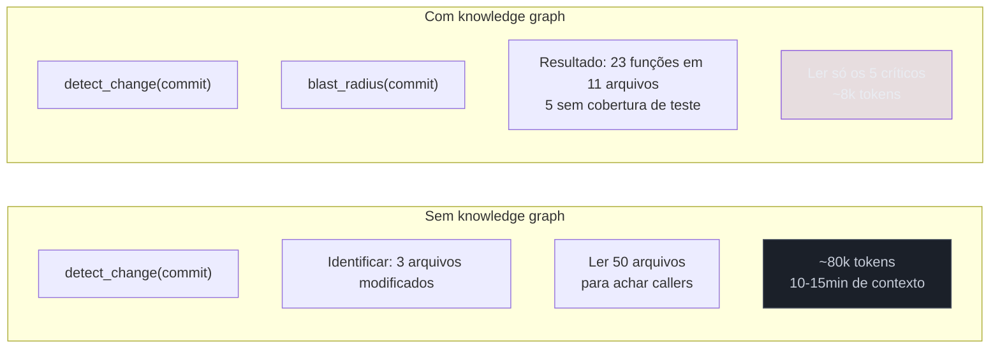
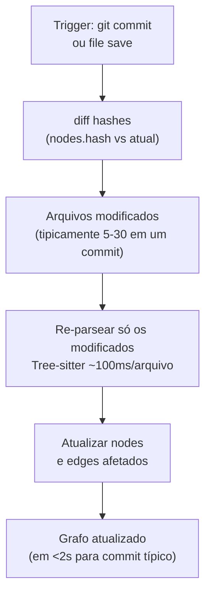

# Knowledge graph local com AST — blast-radius em vez de re-leitura

> [!abstract] TL;DR
> Em review e refactoring multi-arquivo, a pergunta dominante é "o que essa mudança impacta?". A resposta exige percorrer chamadas, herança, imports e testes — leitura caríssima em [[Dicionário de IA#Token|tokens]]. Knowledge graph local resolve isso: parseia o codebase com Tree-sitter, armazena funções/classes/imports como **nós** e chamadas/herança/cobertura como **arestas** em SQLite, e expõe via [[Dicionário de IA#MCP (Model Context Protocol)|MCP]] queries de blast-radius. O agente lê o **grafo da mudança**, não o **código completo**. Reduções de 5×–50× em tokens de review, dependendo do tamanho do monorepo — e consultas de "o que chama X?" que seriam impossíveis sem ler tudo.

## Por que funciona — o mecanismo

> [!question]- Por que o agente não pode simplesmente ler todos os arquivos afetados?

Porque "todos os arquivos afetados" por uma mudança em código compartilhado pode ser 50 arquivos em um monorepo. Ler 50 arquivos de 200 linhas cada é 10k linhas — ~80k tokens — só para descobrir que 45 deles têm uma chamada ao método que mudou e precisam ser testados. Se o agente pudesse perguntar "quem chama X?" e receber "45 funções em 22 arquivos, aqui estão os 5 que têm lógica complexa ao redor da chamada", ele leria só os 5 — 1k linhas em vez de 10k.

É exatamente isso que um knowledge graph faz: responde "quem chama X?" sem ler os 50 arquivos. O grafo já foi construído com análise estática — o agente só consulta o resultado.



> [!summary] Knowledge graph inverte a lógica: em vez de "ler tudo para entender o impacto", você "consultar o impacto para saber o que ler". Em monorepos, essa inversão muda de inviável para prático.

## O que é

Uma camada de análise estática que constrói um grafo de relações do código, persiste localmente em SQLite, e responde queries estruturais em vez de obrigar o agente a re-ler arquivos.

```
Nós:                          Arestas:
  Function                      calls       (f1 chama f2)
  Class                         extends     (ClassA herda ClassB)
  Module / File                 imports     (file importa X)
  Test                          tests       (test_X cobre função X)
  Interface                     implements  (ClassA implementa IB)
```

Query típica em review de PR:

```
blast_radius(commit="abc123")
  → arquivos modificados: 3
  → funções afetadas diretamente: 7
  → callers transitivos: 23 funções em 11 arquivos
  → testes que cobrem as funções afetadas: 4
  → funções afetadas sem cobertura: 3 (nomes: OrderService.cancel, ...)
```

O agente recebe esse resumo (~2 KB) em vez de ler os 11 arquivos completos (~120 KB).

## Como funciona

### Parsing com Tree-sitter

Tree-sitter é o parser incremental usado pelo GitHub, Neovim, Atom e a maioria das implementações de knowledge graph. Roda em ~100ms por arquivo, suporta 20+ linguagens com grammars maduras (Python, TypeScript, Go, Rust, Java, Ruby, C/C++, etc).

Para cada arquivo, o parser extrai:

- Definições de função, classe, método, interface.
- Call sites: quem chama quem, com quais argumentos.
- Imports e referências entre módulos.
- Cadeias de herança e implementação de interface.
- Decoradores relevantes (`@Injectable`, `@Test`, `@pytest.fixture`).

### Persistência local em SQLite

```sql
CREATE TABLE nodes (
  id INTEGER PRIMARY KEY,
  type TEXT,           -- function, class, module, test
  name TEXT,
  file TEXT,
  line_start INTEGER,
  line_end INTEGER,
  hash TEXT            -- SHA-256 do conteúdo para detecção incremental
);

CREATE TABLE edges (
  source_id INTEGER REFERENCES nodes(id),
  target_id INTEGER REFERENCES nodes(id),
  type TEXT,           -- calls, extends, imports, tests, implements
  confidence REAL      -- 0.0–1.0: extraído vs inferido
);

-- Índices para queries rápidas
CREATE INDEX idx_edges_source ON edges(source_id, type);
CREATE INDEX idx_edges_target ON edges(target_id, type);
CREATE INDEX idx_nodes_name ON nodes(name, type);
```

O grafo vive em `.code-graph/graph.db` no projeto. Tamanho típico: poucos MB para 500 arquivos, algumas centenas de MB para monorepos com 10k+ arquivos.

### Atualização incremental



Em monorepo de 2900 arquivos, atualização típica fica em <2s porque só re-parseia o delta.

### MCP como interface ao agente

```
Tools expostas via MCP:

find_callers(symbol)          → quem chama esta função (1 hop)
find_callers_transitive(sym)  → callers transitivos (todos os hops)
find_dependents(file)         → o que depende deste módulo
blast_radius(commit_or_diff)  → impacto completo de um conjunto de mudanças
find_untested(file)           → funções sem cobertura de teste
find_hubs(top_n=10)           → nós mais conectados (chokepoints)
find_bridges()                → nós que conectam comunidades distintas
detect_dead_code()            → nós sem callers reachable de entry points
```

## Análises avançadas a partir do grafo

O grafo responde "quem afeta quem", mas também habilita análises arquiteturais:

### Detecção de comunidades

Algoritmos de clustering (Leiden, Louvain) identificam grupos de nós fortemente conectados entre si e fracamente conectados com o resto:

```
find_communities() → {
  community_1: [auth/, middleware/, tokens/],  # "módulo de autenticação"
  community_2: [orders/, checkout/, cart/],    # "módulo de pedidos"
  cross_community_edges: [
    auth.validateToken → orders.createOrder   # acoplamento entre comunidades
  ]
}
```

Arestas cross-community são candidatas a abstrações: se `auth` chama `orders` diretamente, há acoplamento arquitetural que pode virar interface.

### Betweenness centrality

Identifica nós-ponte: funções que conectam sub-grafos que não se conectariam sem elas. Mudanças em nós de alta centralidade têm impacto desproporcional.

```
find_bridges() → {
  "BaseRepository.query": 0.87,  # alta centralidade — 23 módulos passam por ela
  "AuthContext.getUser": 0.71,   # 15 módulos dependem dela indiretamente
}
```

### Dead code detection

```
detect_dead_code(entry_points=["main.ts", "routes/*.ts"]) → {
  unreachable_functions: ["LegacyPaymentService.chargeV1", "reports.generatePDF"],
  unreachable_classes: ["OldAuthAdapter"],
  potentially_dead: ["utils/formatting.ts:42-67"]  # só chamado por código morto
}
```

### Detecção de dependências circulares

Grafos direcionados podem ter ciclos: `A` chama `B`, `B` chama `C`, `C` chama `A` de volta. Ciclos entre módulos são um cheiro de arquitetura — não impedem o código de rodar, mas tornam impossível entender ou testar `A` isoladamente sem também carregar `B` e `C`.

> [!question]- Por que um ciclo de dependência é um problema, se o código funciona?
> Porque quebra a composicionalidade: para revisar `A`, o agente (ou o dev) precisa ler `B` e `C` também, e vice-versa — não existe "unidade menor" que se possa entender sozinha. Em refactoring, ciclos também bloqueiam extração de módulos: não dá pra mover `A` para um pacote separado sem levar `B` e `C` junto. E em builds incrementais, um ciclo entre arquivos força recompilar/re-parsear o grupo inteiro a cada mudança em qualquer um deles.

```
find_cycles() → {
  cycle_1: [OrderService → PaymentService → NotificationService → OrderService],
  cycle_2: [auth/session.ts → auth/token.ts → auth/session.ts]
}
```

Algoritmo: Tarjan's strongly connected components (SCC) — O(V+E), roda sobre o grafo já construído sem custo adicional de parsing. Cada componente fortemente conexo (SCC) com mais de um nó é, por definição, um ciclo: todo par de nós dentro do componente consegue alcançar o outro seguindo arestas `calls`/`imports`.

> [!summary] Ciclos não aparecem em "quem chama quem" isolado — só emergem ao percorrer o grafo
> inteiro. É a análise mais barata do conjunto (SCC é linear no tamanho do grafo) e uma das que mais expõe débito arquitetural escondido, porque ninguém enxerga um ciclo de 4 saltos lendo arquivo por arquivo.

## Casos práticos

### Caso 1: review de PR com mudança em método compartilhado

PR modifica `UserRepository.findById()` — um método usado em dezenas de lugares:

```
blast_radius(pr=4217)
→ Funções modificadas: UserRepository.findById, UserRepository.findByEmail
→ Callers diretos: 12 funções
→ Callers transitivos: 41 funções em 18 arquivos
→ Testes cobrindo os callers: 28
→ Callers SEM teste: 13 funções (lista: ...)
→ Callers com lógica complexa ao redor da chamada: 4 (lista: ...)

Agente: "Vou revisar os 4 callers complexos e os 13 sem teste,
 não todos os 41. Lista: OrderService.getByUser, CheckoutController.proceed,
 AdminController.getUserDetails, ReportService.byUser."
```

Sem knowledge graph: o agente leria 18 arquivos para entender o impacto. Com knowledge graph: lê 17 funções específicas, identificadas por relevância.

---

### Caso 2: refactoring — extraindo uma interface

Tarefa: "Extraia uma interface `IPaymentGateway` de `StripeService` para facilitar troca futura."

```
find_callers_transitive("StripeService")
→ Callers: 7 funções em 4 arquivos
→ Métodos de StripeService chamados: processPayment, refund, getStatus

find_bridges()
→ StripeService não é nó de alta centralidade → refactoring de baixo risco

blast_radius(diff=extracted_interface_diff)
→ Impacto esperado: 7 funções precisam ser atualizadas para usar IPaymentGateway
→ Arquivos afetados: checkout.ts, orders.ts, admin.ts, reports.ts
```

O agente planeja o refactoring com informação estrutural precisa, sem ler o codebase inteiro.

---

### Caso 3: onboarding — entender arquitetura de um repo desconhecido

```
find_hubs(top_n=5)
→ "BaseController.authorize": 0.92 centralidade (27 rotas passam por aqui)
→ "Database.query": 0.88 centralidade (todos os repositórios usam)
→ "AppError.throw": 0.71 centralidade (42 funções usam este padrão de erro)
→ "config.get": 0.65 centralidade (configuração unificada)
→ "logger.structured": 0.58 centralidade (padrão de log do projeto)

Agente: "Os 5 pontos centrais do sistema são: autorização (BaseController),
 acesso a dados (Database.query), tratamento de erros (AppError),
 configuração (config.get), e logging (logger.structured).
 Para entender o projeto, começo por esses 5 conceitos."
```

Em vez de ler README e tentar inferir arquitetura, o grafo a revela diretamente.

## Quando usar

| Workflow | Knowledge graph compensa? |
|----------|--------------------------|
| Code review de PR em monorepo | Sim — blast-radius é central |
| Refactoring que toca código compartilhado | Sim — impacto calculado antes de editar |
| "Posso remover esta função?" | Sim — dead code detection |
| Análise de impacto antes de mudar API pública | Sim — callers transitivos |
| Onboarding em codebase desconhecido | Sim — hubs revelam arquitetura |
| Coding "verde" em projeto pequeno | Não — overhead não se justifica |
| Geração de código novo sem dependências | Marginal — semantic search é mais útil |

## Custo da abordagem

| Item | Custo estimado |
|------|---------------|
| Build inicial (500 arquivos) | ~10s |
| Build inicial (10k+ arquivos) | minutos |
| Atualização incremental por commit | <2s |
| Espaço em disco | poucos MB a centenas de MB |
| Setup e configuração de hooks | 4-8h |
| API key necessária | Não (tudo local) |

A vantagem sobre indexação semântica: sem custo de API, sem cloud, tudo local. Mas exige que o Tree-sitter grammar do seu stack esteja maduro.

> [!tip] Podcast — knowledge graph local na prática, com números de token
> [KiroGraph: How a Local Code Graph Saves 80% of Your AI Tokens](https://www.listennotes.com/podcasts/the-aws-developers/kirograph-how-a-local-code-DfYo3rRtvlO/) (The AWS Developers Podcast, jul/2026) — Davide de Sio conta como o KiroGraph nasceu de um projeto pessoal pra parar o agente de gastar créditos só procurando arquivos, virou MCP open-source, e reduz uso de tokens em até 80% usando Tree-sitter + grafo local. O episódio também toca no módulo de segurança (trace do call graph pra achar segredos expostos) e em como conter o "blast radius" de agentes com permissões explícitas — o mesmo conceito desta nota aplicado a um produto real.

## Construindo o grafo incrementalmente numa equipe

Em equipes onde múltiplos desenvolvedores fazem commits, o grafo precisa ser compartilhado ou reconstruível por cada membro:

**Opção 1: SQLite no repositório (gitignore parcial)**

```gitignore
# .gitignore
.code-graph/*.db
# mas versionar a configuração
!.code-graph/config.json
```

Cada desenvolvedor reconstrói o grafo localmente na primeira vez (minutos). Depois, hooks mantêm o grafo sincronizado. O SQLite não vai pro git (binário mutável), mas a configuração sim.

**Opção 2: Serviço centralizado**

Para times grandes, um servidor interno serve o grafo via API. O MCP do cliente faz queries remotas em vez de ler SQLite local. O servidor re-indexa após cada push para o repositório central.

```
git push origin feature/xyz
→ CI webhook → rebuild incremental do grafo central
→ Todos os clientes consultam versão atualizada
```

Overhead de latência de rede vs garantia de consistência — trade-off a avaliar pelo tamanho do time.

**Opção 3: Per-branch index**

Para repos com branches de longa duração, o grafo por branch garante que o agente numa feature branch está consultando as relações da feature, não do main.

```bash
git checkout -b feature/payment-v2
claude-context index --branch current  # índice separado para este branch
```

Dobra o espaço em disco mas evita confusão de callers entre branches.

## Calibrando o limiar de confidence

Edges com confidence < 1.0 (inferidos, não extraídos) precisam de tratamento explícito:

```sql
-- Consulta com filtro de confidence
SELECT * FROM edges
WHERE target_id = ? AND type = 'calls'
AND confidence >= 0.8  -- só arestas confiáveis
ORDER BY confidence DESC;
```

Recomendações práticas por contexto:

| Contexto | Confidence mínimo |
|----------|------------------|
| Review de PR crítico (auth, payments) | 0.95+ |
| Review de PR normal | 0.7+ |
| Análise exploratória / arquitetural | 0.5+ |
| Dead code detection | 0.9+ (falsos negativos piores) |
| Mapa de arquitetura / documentação | 0.5 (mais cobertura, aceita incerteza) |

O agente deve ser instruído sobre o limiar em uso e o que fazer com resultados abaixo dele:

```
"Arestas com confidence < 0.8 são marcadas como '(inferido)'.
Trate-as como hipóteses a confirmar com grep antes de agir."
```

## Teoria subjacente — análise estática de grafo

Knowledge graphs de código são uma instância de **análise de grafo direcionado**: o codebase é um dígrafo onde nós são entidades (funções, classes, módulos) e arestas são relações (calls, imports, extends).

As queries de blast-radius são **reachability queries**: a partir de um conjunto de nós modificados, encontre todos os nós alcançáveis seguindo arestas do tipo "calls" e "imports". É equivalente a BFS/DFS no dígrafo de dependências.

A limitação fundamental é que análise estática não resolve **ligações dinâmicas**: `obj[method]()` em JavaScript, reflexão em Java, metaprogramação em Ruby. Para essas, o grafo anota `confidence < 1.0` e o agente deve tratar como "possível mas não confirmado". Análise dinâmica (com profiler) resolveria, mas é inviável como ferramenta geral.

## Armadilhas comuns

> [!warning] Confundir recall com precisão no blast-radius
> Blast-radius bem desenhado prioriza **recall** (não perder impacto real) sobre precisão (over-predict é aceitável — melhor investigar falso positivo do que perder impacto real). Mas se a precisão fica em 0.2, o agente é inundado de falsos positivos e perde o sinal. Calibre em F1 ~0.5 com recall 1.0 — isso é conservador funcional, não ruído.

> [!warning] Edges inferidos tratados como extraídos
> Tree-sitter extrai call sites com alta confiança para chamadas diretas (`foo()`). Em chamadas dinâmicas (`obj[method]()`, callbacks, decoradores com metaprogramação), a aresta é **inferida** com confidence < 1.0. Implementações maduras anotam essa confiança; as ruins tratam tudo como extraído e o grafo vira ficção arquitetural.

> [!warning] Grafo desatualizado — o pior cenário
> Um agente que confia num grafo desatualizado faz review incompleto: "blast-radius identificou 7 arquivos" quando o real é 15 — e os 8 restantes ficam com bugs introduzidos sem revisão. Se o hook de atualização não está funcionando, é melhor desativar o grafo do que usar um stale. Verifique: `index_status()` mostra timestamp da última atualização.

> [!warning] Languages sem grammar maduro
> Tree-sitter cobre bem Python, TypeScript, Go, Rust, Java, Ruby, C/C++. Menos bem: Solidity, Zig, Julia, R, COBOL. Em projeto poliglota com linguagens exóticas, o grafo tem buracos — funções não aparecem como nós, arestas ficam faltando. Saiba os limites do seu stack antes de depender do grafo.

> [!warning] Tomar stars de repo como prova de qualidade
> O espaço de MCPs de knowledge graph tem repos com crescimento anormal (>15k stars em <3 meses, fork-to-star ratio >10%). Avalie o código, reproduza os benchmarks num repo seu, e verifique se o repo tem manutenção ativa. Stars não são substituto para due diligence.

## Como explicar em inglês

**Knowledge graph with AST** is structural analysis applied to codebase navigation: Tree-sitter parses code into an AST, extracting functions, classes, and their relationships (calls, imports, extends) into a SQLite graph. The agent then queries the graph instead of reading files — `blast_radius(commit)` returns the complete impact summary in ~2 KB, whereas reading all affected files would cost 80 KB or more.

The key distinction from semantic search is the axis of organization: semantic search indexes **conceptual similarity** ("what's about JWT validation?"); the knowledge graph indexes **structural relationships** ("what calls this function?"). They're orthogonal — and together answer the two dominant questions in large-codebase work.

**In a technical interview**, you might say:

> "For PR review in large codebases, I use a local knowledge graph over the AST. Tree-sitter parses the repo into a function-level call graph stored in SQLite. Before I ask Claude Code to review a PR, I run `blast_radius(commit)` to get the full impact map: direct callees, transitive callers, which callers have test coverage, and which don't. The agent then reads only the high-risk callers — typically 5-10 files instead of 40. In monorepos with shared utilities, this makes the difference between a meaningful review and an economically impossible one."

### Tabela PT ↔ EN

| Português | English | Contexto |
|-----------|---------|----------|
| Grafo de conhecimento | Knowledge graph | grafo de relações do codebase |
| Raio de impacto | Blast radius | extensão do impacto de uma mudança |
| Chamadores | Callers | quem chama uma função |
| Análise estática | Static analysis | análise sem executar o código |
| Nó do grafo | Graph node | entidade (função, classe, módulo) |
| Aresta do grafo | Graph edge | relação (calls, imports, extends) |
| Detecção de código morto | Dead code detection | identificar código nunca chamado |
| Centralidade | Centrality | métricas de importância de um nó no grafo |
| Comunidades | Communities / clusters | grupos de nós fortemente conectados |
| Parser incremental | Incremental parser | parser que re-analisa só o delta |

## Integração com CI/CD — grafo sempre fresco

O grafo tem valor máximo quando reflete o estado atual do código. Duas estratégias para manter a sincronia em equipes:

**Hook pós-merge no repositório central:**

```yaml
# .github/workflows/update-graph.yml
on:
  push:
    branches: [main]
jobs:
  update-graph:
    runs-on: ubuntu-latest
    steps:
      - uses: actions/checkout@v4
        with:
          fetch-depth: 0  # histórico completo para diff incremental
      - run: pip install tree-sitter-graph-builder
      - run: |
          graph-builder update \
            --db .code-graph/main.db \
            --since ${{ github.event.before }} \
            --languages python,typescript
      - uses: actions/cache/save@v4
        with:
          path: .code-graph/main.db
          key: graph-${{ github.sha }}
```

O grafo atualizado fica em cache no CI. Cada desenvolvedor baixa via `actions/cache/restore` ao abrir o ambiente. Custo: ~30s por push, economizando minutos de re-indexação local.

**Hook pré-review no PR:**

```yaml
# Antes de rodar Claude Code review num PR
- name: Load graph for PR
  run: |
    graph-builder blast-radius \
      --db .code-graph/main.db \
      --commits ${{ github.event.pull_request.base.sha }}..${{ github.sha }} \
      --output pr-impact.json
```

O `pr-impact.json` vai para o agente como contexto inicial: "estas são as funções afetadas". O agente começa o review com o mapa de impacto, não com "leia todos os arquivos do PR".

## O que vem a seguir

Knowledge graph completa o quadro das estratégias estruturais de contexto. As 4 camadas empilham:

1. **Lazy-load** — boot eficiente
2. **Sandboxing** — tool calls eficientes
3. **Indexação semântica** — navegação por intenção
4. **Knowledge graph** — navegação por estrutura

- **[[03-Dominios/Tecnologia/IA/Claude Code/Workflows/05 - Code review|05 - Code review]]** — aplicação primária do knowledge graph: blast-radius antes de revisar
- **[[03-Dominios/Tecnologia/IA/Claude Code/Workflows/03 - Refactoring pesado|03 - Refactoring pesado]]** — impacto calculado antes de refatorar

## Veja também

- [[03-Dominios/Tecnologia/IA/Claude Code/Skills e MCP/04 - MCP overview|MCP overview]] — como o grafo é exposto ao agente
- [[03 - Indexação semântica externa]] — abordagem complementar (eixo conceitual)
- [[03-Dominios/Tecnologia/IA/Claude Code/Workflows/05 - Code review|Code review]] — workflow primário onde knowledge graph brilha
- [[03-Dominios/Tecnologia/IA/Claude Code/Workflows/03 - Refactoring pesado|Refactoring pesado]] — blast-radius é central neste workflow
- [[03-Dominios/Tecnologia/IA/Claude Code/Workflows/11 - Estratégias estruturais de contexto/index|Tronco do sub-galho]]

## Referências

- [tirth8205/code-review-graph](https://github.com/tirth8205/code-review-graph) — implementação Python/MCP com Tree-sitter, SQLite, blast-radius, comunidades via Leiden, hubs/bridges, export GraphML/Neo4j/Obsidian. MIT, 24 linguagens. **Cuidado:** repo de ~3 meses com ~17k stars — sinais de star inflation. A técnica é legítima; reproduza os benchmarks num repo seu antes de adotar.
- [Tree-sitter](https://tree-sitter.github.io/tree-sitter/) — parser incremental; documentação oficial e lista de grammars suportados por linguagem
- [Leiden algorithm — Nature Scientific Reports](https://www.nature.com/articles/s41598-019-41695-z) — algoritmo de detecção de comunidades usado em grafos de código para identificar módulos coesos


