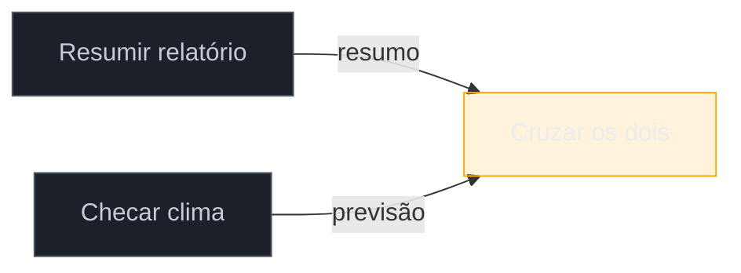
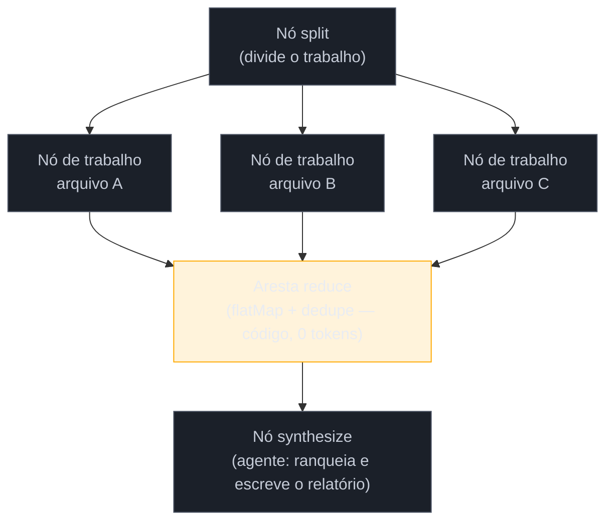
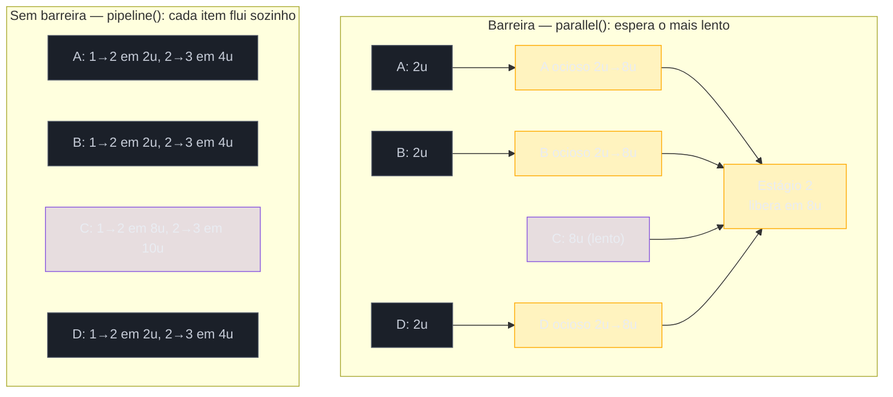

# Orquestração em grafo — fan-out, arestas e verificadores

> [!abstract] TL;DR
> Quando o número de [[Dicionário de IA#subagent|sub-agents]] deixa de ser "alguns despachados à mão" e vira dezenas ou centenas, o problema muda de natureza: não é mais dispatch, é **topologia**. Um agente multi-step que só encadeia passos é um grafo degenerado — uma cadeia sem ramificação, correta e frágil. Esta nota ensina a enxergar o grafo que já está aí: nós com contrato, arestas que só existem quando dados atravessam (e que são de graça — flatten e dedupe não custam token), fan-out com barreira, o diamante split→work→merge, verificadores plantados na aresta, e a escolha que decide seu tempo de execução, barreira (`parallel`) versus fluxo sem barreira (`pipeline`). O material vem de um thread de marketing técnico no X — tratado com ceticismo — mas as APIs concretas de **dynamic workflows** foram verificadas contra a documentação oficial do Claude Code (`code.claude.com/docs/en/workflows`) em 21/07/2026.

> [!warning] O que é padrão, o que é API de versão
> Esta nota mistura dois tipos de afirmação. **Padrão conceitual** — nó como unidade de trabalho, aresta como contrato de dados, o diamante fan-out→reduce→synthesize, verificador na aresta, loop-until-dry, dedupe contra tudo que já foi visto, tiering de modelo, barreira vs. fluxo sem barreira — vale em qualquer runtime que orquestre agentes, LangGraph e CrewAI inclusos, e não vai envelhecer. **API específica** — `agent()`, `pipeline()`, `isolation: "worktree"`, `.claude/workflows/`, `/deep-research`, a keyword `ultracode` — é de uma versão concreta do Claude Code (v2.1.154+) e pode mudar de nome no próximo release. Onde a fonte primária (um thread do X, ver [[#Fontes]]) afirmava algo que não achei na documentação oficial, marco "conforme a fonte" e sinalizo como não verificado — não afirmo como fato.

## O grafo que já está aí

> [!question]- Por que "faça A, depois B, depois C" já é um grafo — e não uma lista de passos?

Pega o pedido mais comum que você já deu a um agente multi-step: "resuma este relatório, depois me diga se o clima em São Paulo hoje afeta o cronograma de obra". Duas tarefas, uma atrás da outra. O agente resume, então busca o clima, então cruza os dois. Passo um espera passo dois educadamente, que espera passo três — uma fila, uma cabeça, uma coisa de cada vez, até a janela de contexto encher e o meio do trabalho já ter saído da memória do início.

Agora olha de novo para essas duas primeiras tarefas: resumir o relatório e checar o clima. Nenhuma delas usa o resultado da outra. São dois nós **desconectados** que o script — ou você, digitando de cima para baixo — encadeou por hábito, não por necessidade. É a mesma armadilha que [[03-Dominios/Tecnologia/IA/Claude Code/Workflows/07 - Sub-agents e dispatch|07 - Sub-agents e dispatch]] já resolvia com três sub-agents despachados sem competir por contexto, e que [[03-Dominios/Tecnologia/IA/Claude Code/Workflows/08 - Multi-agent|08 - Multi-agent]] resolvia mapeando dependências antes do primeiro dispatch. O que muda aqui é a escala: com quatro sub-agents, mapear dependências na cabeça funciona. Com quarenta — ou quando a forma do trabalho só aparece durante a execução, achou três bugs novos ao investigar o primeiro — mapear na cabeça deixa de escalar, e você precisa de uma linguagem que descreva a forma do trabalho, não só a lista de tarefas.

Essa linguagem é grafo. **Nós são jobs.** Um nó é uma unidade de trabalho: um agente, um job delimitado, uma entrada e uma saída. **Arestas são o que flui.** Uma aresta é uma dependência de dados — diz que a saída deste nó alimenta a entrada daquele, e nada mais. O erro fundador, o que faz quase todo agente multi-step virar uma fila desnecessária, é tratar "e então" como aresta. "Resuma o arquivo e então me diga o tempo" não tem aresta real entre as duas tarefas — o tempo não consome o resumo.

Existe um teste simples pra separar aresta real de ordem de digitação: desenhe o trabalho como caixas e setas. Uma caixa é uma chamada de agente. Uma seta é uma variável que sai do retorno de uma caixa e entra no prompt de outra. Se você não consegue desenhar a seta — se nenhuma variável de fato atravessa — as duas caixas são independentes, e independência é exatamente o que você vai explorar no resto desta nota.



Repare que A e B não têm seta entre si — porque nenhuma variável atravessa de um para o outro. As duas só convergem em C, que de fato precisa dos dois resultados. Isso já é o esqueleto do diamante que a seção "As topologias" vai formalizar.

O corolário incômodo: **seu script linear de sempre já era um grafo — só que um degenerado.** "Faça A, então B, então C, então D" é uma cadeia sem ramificação, cada nó com exatamente uma aresta de entrada e uma de saída. Roda correto. Também roda devagar e frágil, porque cadeia não tem redundância: se C trava, D nunca acontece, e o trabalho de A fica preso rio acima sem para onde ir. A primeira habilidade real de orquestração em grafo não é aprender uma ferramenta nova — é **redesenhar a cadeia que você já tem**: para cada seta do seu script atual, faça a pergunta do teste acima. Na prática, a maioria das cadeias que as pessoas escrevem por hábito tem duas ou três setas que não carregam dado nenhum — são só a ordem em que alguém, num momento qualquer, decidiu digitar o prompt. Corte essas setas e a cadeia colapsa em algo mais largo, mais rápido, e mais resiliente a uma falha isolada.

> [!summary] Um nó é uma unidade de trabalho; uma aresta só existe se uma variável de fato atravessa de um nó para outro. "E então" não é aresta — é o vício de digitar de cima para baixo. Toda cadeia linear é um grafo degenerado, e a primeira habilidade de graph engineering é achar as setas que sobram e cortá-las.

## Contratos, nos nós e nas arestas

> [!question]- Se um grafo é só nós e arestas, por que preciso de "contrato" — não basta escrever o prompt certo?

Porque um nó sobre o qual você não consegue raciocinar de fora é um nó que você não consegue paralelizar com segurança. Se a entrada de um sub-agent depende de "o que ele por acaso lembra da conversa" e a saída dele é texto livre que você vai reparsear na mão, você não tem um nó — tem uma caixa-preta que só funciona bem quando roda sozinha, em ordem, sob sua supervisão linha a linha. Isso é exatamente o oposto do que fan-out precisa.

**Todo nó recebe um contrato de três partes**: entrada delimitada e passada explicitamente (nunca assumida de janela compartilhada — o mesmo "contexto cirúrgico" de [[03-Dominios/Tecnologia/IA/Claude Code/Workflows/07 - Sub-agents e dispatch|07 - Sub-agents e dispatch]]); saída de forma definida e validada; e exatamente um job. Num script de dynamic workflow, o contrato de saída é imposto com um **JSON Schema** passado à chamada do nó:

```javascript
// Nó: extrai a lista de arquivos de rota do repositório.
// O schema define a FORMA da saída — não é documentação, é
// validação de verdade: a resposta do agente é checada contra
// ele na camada de tool-call.
const found = await agent(
  'Liste todo arquivo .ts sob src/routes/.',
  {
    schema: {
      type: 'object',
      required: ['files'],
      properties: {
        files: { type: 'array', items: { type: 'string' } },
      },
    },
  }
)
// found.files é um array de strings GARANTIDO por schema —
// não texto livre que você vai regex-ar na esperança de que
// o formato bateu desta vez.
```

O mecanismo por trás disso é verificável: a documentação oficial confirma que a validação de schema acontece na camada de tool-call, e que uma falha de validação repetida não trava o script — o runtime **retenta** a chamada (a documentação de changelog registra explicitamente um bug corrigido em que o agente ficava retentando indefinidamente até ser corrigido para abortar após 5 tentativas). Isso é o oposto de devolver texto livre e rezar para que o parsing funcione: o contrato de saída é imposto pelo runtime, não pela sua sorte.

> [!warning] Contrato não é prompt bem escrito — é validação executável
> Um prompt caprichado ("responda só com JSON, sem markdown") ainda pode falhar de formas sutis: markdown escapado errado, vírgula sobrando, campo faltando. Schema não é uma instrução a mais no prompt — é uma barreira que o runtime aplica *depois* que o agente responde, e que dispara retry automático em caso de mismatch. A diferença entre "pedir formato" e "impor formato" é a diferença entre um nó que você pode compor com confiança e um nó que quebra silenciosamente uma vez a cada N execuções.

A metade que falta é a **aresta como contrato de dados**, não como ordem de execução. Uma aresta não é "B vem depois de A" — é uma promessa: A produz esta forma, B foi construído para consumir esta forma. Nomear a aresta pelos dados, e não pela sequência, resolve dois problemas de uma vez: você vê na hora se a aresta é real (dado de fato se move? senão é ordem de digitação), e pode trocar o nó de qualquer ponta sem quebrar o grafo, desde que a forma se mantenha — o mesmo princípio de "interfaces bem definidas" que [[03-Dominios/Tecnologia/IA/Claude Code/Workflows/08 - Multi-agent|08 - Multi-agent]] já cobra para multi-agent fazer sentido, só que aqui a interface é um objeto JavaScript, não uma convenção verbal entre dispatches.

Na prática, a aresta mora em código puro, e é aqui que a vitória silenciosa de pensar em grafo aparece:

```javascript
// Aresta entre "achados brutos de N sub-agents" e "lista final
// deduplicada". Isso é flatten + dedupe — não precisa de agente
// nenhum. Nenhuma chamada de modelo acontece nesta linha.
const achadosBrutos = await Promise.all(
  arquivos.map(f => agent(`Audite ${f} por falha de auth.`, { schema }))
)

const achadosUnicos = [
  ...new Set(
    achadosBrutos
      .filter(Boolean)                 // thunk que falhou vira null — descarta
      .flatMap(r => r.achados)         // achata os arrays de cada sub-agent
      .map(a => `${a.arquivo}:${a.linha}`) // chave de dedupe
  ),
]
// Custo desta aresta: zero tokens. É flatMap e Set — determinístico,
// instantâneo, e roda em microssegundos independente de quantos
// sub-agents alimentaram a lista.
```

A regra prática que sai daqui: **agentes para julgamento, não para encanamento.** Se combinar resultados significa flatten-and-dedupe, isso é `results.flatMap(...)` e um `Set`. Boa parte do que as pessoas queimam em tokens numa orquestração multi-agent é, na verdade, uma aresta disfarçada de nó — alguém pediu a um agente para "juntar os resultados dos três sub-agents anteriores", quando isso é uma linha de JavaScript. Um grafo em que toda aresta é um agente é um grafo pagando aluguel pela própria fiação. Isso conecta direto com o que este vault já trata como princípio central de custo: veja [[03-Dominios/Tecnologia/IA/Economia de Tokens/09 - Model routing — modelo certo para a tarefa|09 - Model routing]] para a versão desse argumento aplicada a escolha de modelo por tarefa, e a "Bloco 5" adiante nesta nota para tiering por nó especificamente em grafos.

> [!summary] Contrato de nó = entrada explícita + saída validada por schema + um job. Contrato de aresta = nomeie pelos dados que atravessam, não pela ordem. E a aresta, quando é só combinar/filtrar/deduplicar, custa zero tokens — é código, não conversa.

## As topologias

> [!question]- Com nós e arestas definidos, qual é o repertório real de formas que um grafo de agentes assume na prática?

Cinco formas cobrem a maioria do que você vai construir: fan-out com barreira, o diamante (fan-out + fan-in), roteamento condicional em runtime, e ciclos que convergem. Cada uma resolve um problema estrutural diferente — e cada uma tem um jeito característico de dar errado quando mal aplicada.

### Fan-out com barreira

Quando você tem N nós independentes — a pergunta do teste da seta respondida "não" para todos os pares —, o movimento que paga por tudo é espalhar e rodar todos de uma vez, em vez de encadear. A fonte primária desta nota descreve um `parallel()` dedicado, com barreira explícita: thunk que lança vira `null` em vez de derrubar o lote, concorrência limitada pela contagem de cores. **Não encontrei `parallel()` citado literalmente** na página oficial `/docs/en/workflows` que consegui recuperar — só `agent()` e `pipeline()` aparecem no script de exemplo publicado ali. Trato `parallel()` como conforme a fonte, não verificado diretamente: vários escritores técnicos independentes descrevem a mesma função com a mesma semântica de barreira, o que sugere existência real mesmo sem eu ter localizado a linha exata na doc.

O que **é** verificado, porque está na doc oficial: o runtime limita a 16 agentes concorrentes por vez (menos em máquinas com poucos núcleos de CPU), e a 1.000 agentes no total por execução — um teto contra loop descontrolado, não uma sugestão. Excesso de trabalho além do limite de concorrência enfileira em vez de estourar.

```javascript
// Fan-out: N nós independentes, todos de uma vez.
// Um thunk que lança NÃO derruba o lote inteiro — resolve para
// null, e você filtra depois. Essa é a diferença entre um grafo
// resiliente e um grafo onde um sub-agent instável trava tudo.
const resultados = await Promise.all(
  arquivos.map(f =>
    agent(`Audite ${f}.`, { schema }).catch(() => null)
  )
)
const validos = resultados.filter(Boolean)
```

O ponto que importa mais que o nome exato da função: **o fan-out vive em código, não numa conversa de modelo.** O contexto do orquestrador nunca precisa segurar nove fontes de pesquisa ao mesmo tempo; cada sub-agent carrega a própria janela, isolada, e só a resposta final volta — o mesmo mecanismo que [[03-Dominios/Tecnologia/IA/Claude Code/Workflows/10 - Gestão de contexto|10 - Gestão de contexto]] já descreveu no isolamento multi-agent, só que aqui a orquestração inteira é código executável em vez de você decidindo turno a turno o que despachar. É essa mudança — quem segura o plano, conversa ou script — que a doc oficial usa para diferenciar workflows de subagents/skills/agent teams: nos três primeiros "Claude decide o que rodar a seguir, turno a turno"; num workflow, "o script segura o loop".

### Fan-in numa barreira, e o diamante

Fan-out só serve se algo reúne o resultado. O **fan-in** é o nó onde arestas convergem — onde um trecho de código, ou um agente, vê todos os resultados de uma vez e faz algo que exige o conjunto inteiro: dedupe entre fontes, ranking por impacto, early-exit se o total voltou vazio.

A regra que mantém um grafo rápido em vez de artificialmente sequencial: **use barreira só quando um estágio genuinamente precisa de todo resultado anterior junto.** Se você só está achatando uma lista, isso é uma aresta — faça inline, sem barreira nenhuma. O teste é direto: se seu grafo tem fan-out → transformação → fan-out de novo, e a transformação do meio não depende de item nenhum além de si mesmo, você deveria ter usado um fluxo sem barreira e pulado a espera.

Junte fan-out e fan-in e você tem a topologia mais usada de qualquer grafo sério de agentes — a que a documentação oficial cita nos próprios exemplos ("revise todo arquivo alterado neste PR, depois funda os achados por arquivo em um resumo único ranqueado"). O nome vale memorizar porque descreve a forma exata: **fan out → reduce → synthesize.**



Uma vez que você vê o diamante, a pergunta que você faz sobre um agente que "não dá mais passos" muda de "como faço ele ir mais fundo" para "onde está o split, onde está o merge" — que é a pergunta que de fato escala, porque tem resposta em código em vez de resposta em mais tokens de raciocínio no mesmo agente.

### Roteamento em runtime

Nem todo grafo tem forma fixa. Um nó roteador inspeciona um resultado e decide qual caminho a jusante dispara — classifique o ticket e ramifique para o handler certo; cheque o tamanho do diff e escolha entre revisão rápida e auditoria completa. Num script de workflow, isso é literalmente um `if`/`switch` sobre a saída validada por schema de um nó anterior:

```javascript
// O julgamento (classificar) é do agente. A decisão de rota
// (qual handler chamar) é código — determinística, auditável,
// e igual toda vez para a mesma classificação.
const classificacao = await agent(
  `Classifique este ticket: ${ticket.texto}`,
  { schema: { type: 'object', required: ['categoria'], properties: {
      categoria: { type: 'string', enum: ['bug', 'duvida', 'feature'] } } } }
)

let resultado
if (classificacao.categoria === 'bug') {
  resultado = await agent(`Triagem completa de bug: ${ticket.texto}`)
} else if (classificacao.categoria === 'duvida') {
  resultado = await agent(`Resposta rápida de dúvida: ${ticket.texto}`)
} else {
  resultado = await agent(`Encaminhamento de feature request: ${ticket.texto}`)
}
```

Aqui determinismo vira feature, não limitação. O agente contribui julgamento no nó (que categoria é esta?); o script contribui confiabilidade na aresta (dado categoria X, sempre rode o handler X). Você ganha os dois sem misturar as responsabilidades — e sem o risco de "o agente decidiu pular a auditoria por conta própria", porque o pulo teria que estar escrito no `if`, e não está.

### Ciclos que convergem

Às vezes você não sabe o tamanho do trabalho até estar dentro dele: uma varredura de bugs onde achar um revela três outros, uma descoberta de tamanho desconhecido. Isso pede um ciclo — uma aresta controlada de volta a um nó anterior. O perigo é óbvio: um ciclo que não converge é um loop infinito que spawna agentes até o orçamento (ou o teto de 1.000 agentes por execução) acabar.

O padrão que converge de fato é **loop-until-dry**: continue rodando rounds de busca até K rodadas consecutivas não trazerem achado novo nenhum. A própria documentação oficial usa exatamente este exemplo como um dos seis padrões prontos de prompt para workflow: "encontre testes flaky rodando a suíte repetidamente, registre o que falha de forma intermitente, e pare quando duas rodadas seguidas não acharem nada novo".

O detalhe que faz ou quebra o loop — e o erro que praticamente todo mundo comete na primeira tentativa — é **contra o que você dedupa**:

```javascript
// ERRADO: dedupa só contra os achados CONFIRMADOS.
// Um achado que foi investigado e rejeitado numa rodada
// anterior não está na lista de confirmados — então ele
// reaparece na rodada seguinte como se fosse novo, o
// contador de "rodadas sem novidade" nunca zera de verdade,
// e o loop paga pra redescobrir o mesmo beco sem saída
// pra sempre.
const jaVistos = new Set(confirmados.map(a => a.chave))

// CERTO: dedupa contra TUDO que já foi visto — confirmado
// ou rejeitado. Um achado rejeitado entra na memória do loop
// e não é reproposto. É isso que faz K rodadas sem novidade
// significar "de fato secou", não "de fato esqueceu".
const jaVistos = new Set(todosOsAchadosJaVistos.map(a => a.chave))

let rodadasSemNovidade = 0
while (rodadasSemNovidade < K) {
  const achadosDaRodada = await agent('Procure mais issues.', { schema })
  const novos = achadosDaRodada.filter(a => !jaVistos.has(a.chave))
  if (novos.length === 0) {
    rodadasSemNovidade++
  } else {
    rodadasSemNovidade = 0
    novos.forEach(a => jaVistos.add(a.chave))
  }
}
```

A diferença entre as duas linhas de `jaVistos` é sutil no código e enorme no comportamento: uma converge de verdade, a outra fica presa rodando em círculo redescobrindo os mesmos becos sem saída, gastando token a cada volta, sem nunca disparar a condição de parada de forma honesta.

> [!warning] Dedupe contra confirmados é o bug clássico de loop-until-dry
> Se seu ciclo não está secando quando deveria, a primeira coisa a checar não é o modelo, nem o prompt — é contra qual conjunto você está deduplicando. Achado rejeitado precisa contar como "já visto" pro propósito de convergência, mesmo que não conte como "achado válido" pro propósito do relatório final. São dois conjuntos diferentes que fazem trabalhos diferentes.

> [!summary] Fan-out espalha N nós independentes de uma vez; fan-in junta só quando o próximo passo genuinamente precisa do conjunto inteiro; o diamante (fan out → reduce → synthesize) é a forma canônica que resolve a maioria dos jobs reais; roteamento em runtime move a decisão de caminho para código determinístico; e um ciclo só converge se dedupar contra tudo que já foi visto, não só contra o que foi confirmado.

## Confiança e contenção

> [!question]- Mais agentes não significa, por definição, mais achados errados espalhados por mais lugares?

Significa, se a única alavanca que você puxa for "mais agentes". A alavanca real de um grafo maduro não é volume — é a estrutura que você embrulha em volta dos agentes para produzir **confiança**, e a contenção que impede uma falha isolada de contaminar o resto do grafo.

### O verificador na aresta

Um nó verificador senta na aresta antes que um resultado seja permitido a jusante, e o único trabalho dele é **tentar matar o achado**. Se sobrevive à tentativa de refutação, passa; se não, é descartado antes do relatório final. A documentação oficial confirma esse mecanismo em produção: `/deep-research` "vota em cada claim e retorna um relatório citado com claims que não sobreviveram ao cross-check já filtrados" — e uma correção de changelog (v2.1.196) mostra o mecanismo mantido ativamente: "quando os verificadores não conseguem checar uma claim (rate limit, erro de API), o relatório marca como não-verificada em vez de refutada".

A fonte primária desta nota nomeia três padrões de verificação — trate a nomenclatura como vocabulário da fonte, não como termos oficiais da documentação, ainda que o mecanismo subjacente esteja confirmado via `/deep-research`:

- **Adversarial verify** — para cada achado, spawnar N céticos independentes instruídos explicitamente a *refutar* o achado; manter só se a maioria sobreviver ao ataque.
- **Perspective-diverse verify** — dar a cada verificador uma lente distinta (correção, segurança, "isso reproduz?"), porque diversidade de ângulo pega modos de falha que N checks idênticos, rodando a mesma pergunta, nunca vão pegar.
- **Judge panel** — gerar N tentativas de ângulos diferentes, pontuar cada uma com juízes rodando em paralelo, sintetizar a partir da tentativa vencedora enxertando o melhor das segundas colocadas.

O ponto conceitual que atravessa os três, e que é o que de fato importa reter independente do nome exato: um verificador que compartilha o enquadramento do agente que produziu o trabalho tende a compartilhar o ponto cego dele também. Diversidade de lente — não quantidade de checagens idênticas — é o que aumenta a chance real de pegar um erro antes que ele chegue no usuário. Isso conecta diretamente com o trabalho de avaliação de agentes tratado em [[03-Dominios/Tecnologia/IA/Evaluation/09 - Evaluation de agents|Evaluation de agents]] — verificação na aresta de um grafo é, no fundo, um eval rodando em produção, item a item, em vez de num dataset offline.

```javascript
// Nó verificador: N céticos independentes tentam refutar
// cada achado. Maioria sobrevive → achado passa a jusante.
async function verificarComAdversarios(achado, n = 3) {
  const vereditos = await Promise.all(
    Array.from({ length: n }, () =>
      agent(
        `Tente refutar este achado: ${JSON.stringify(achado)}. ` +
        `Responda apenas com se ele SOBREVIVE ou É REFUTADO, e por quê.`,
        { schema: { type: 'object', required: ['sobrevive'],
            properties: { sobrevive: { type: 'boolean' } } } }
      )
    )
  )
  const sobreviventes = vereditos.filter(v => v.sobrevive).length
  return sobreviventes > n / 2   // maioria precisa concordar
}
```

### Isolamento — a falha contida no nó, não no grafo

Numa cadeia linear, falha cascateia: se o passo 2 quebra, o passo 3 nunca roda. Num grafo bem desenhado, falha deve ser contida ao nó que falhou. Parte disso já apareceu na seção de fan-out: um thunk que lança resolve para `null` em vez de derrubar o lote inteiro, e `.filter(Boolean)` é a contenção. A regra que fecha o círculo: **desenhe todo fan-in para tolerar entrada faltando**, em vez de assumir que o conjunto vai sempre chegar completo. Um `reduce` que assume N resultados quando só N-1 chegaram porque um sub-agent falhou é um bug esperando para acontecer na primeira execução ruidosa.

A falha mais sutil de conter não é um sub-agent que erra — é **nós pisando um no outro**. Quando agentes escrevem arquivos em paralelo, eles colidem: dois sub-agents editando o mesmo módulo produzem um resultado que depende de qual terminou por último, não de qual estava certo. O conserto documentado é isolamento por worktree: cada agente roda no próprio git worktree, trabalha num sandbox isolado, e faz merge limpo depois. A opção `isolation: "worktree"` é real e verificada — aparece no changelog do Claude Code (correção de um bug em que agentes de workflow spawnados com `isolation: "worktree"` em sessões de background ficavam impedidos de editar arquivos dentro do próprio worktree) e na documentação de worktrees. Um artigo de terceiro recomenda "ligar por default em todo sub-agent que escreve código, porque o custo é zero" — mas a fonte primária desta nota é mais conservadora, e é a leitura que fica de pé aqui: isolamento por worktree é o cinto de segurança da única topologia que de fato precisa dele — nós concorrentes escrevendo no mesmo arquivo — não um imposto default sobre toda rodada. Worktree tem custo real de setup (checkout, depois merge); ligue quando o teste da seta mostrar escrita concorrente, não antes.

> [!warning] `isolation: "worktree"` resolve colisão de escrita, não resolve tudo
> Worktree isola o *filesystem* de cada agente. Não isola contexto (isso já é padrão em todo sub-agent, worktree ou não — ver [[03-Dominios/Tecnologia/IA/Claude Code/Workflows/07 - Sub-agents e dispatch|07 - Sub-agents e dispatch]]), e não previne dois agentes chegando a decisões de design incompatíveis sobre o mesmo módulo — só previne que a escrita física de um sobrescreva a do outro antes do merge.

> [!summary] Verificador na aresta tenta matar o achado antes de deixá-lo passar; diversidade de lente pega mais que quantidade de checagem idêntica; e isolamento por worktree é o cinto de segurança específico de agentes escrevendo em paralelo no mesmo repositório — não um default a ligar em toda rodada.

## Custo e latência são a topologia

> [!question]- Se arestas são de graça, onde exatamente o custo de um grafo de agentes vai parar?

Nos nós — e na forma como você organiza o tempo de espera entre eles. A documentação oficial é direta sobre isso: "um workflow spawna muitos agentes, então uma única execução pode usar significativamente mais tokens do que trabalhar a mesma tarefa numa conversa". Isso não é um detalhe de rodapé — é o motivo pelo qual este vault trata contenção de fan-out como regra, não como sugestão (ver [[03-Dominios/Tecnologia/IA/Economia de Tokens/03 - Por que agentes gastam tanto|03 - Por que agentes gastam tanto]] para o panorama geral de onde o gasto de agente vai parar). Um grafo de cem nós não é cem vezes mais inteligente — é, na melhor das hipóteses, cem vezes mais caro, e a única forma de isso valer a pena é desenhar a topologia para que o custo extra compre confiabilidade real, não só volume.

### Tiering de modelo por nó

Nem todo nó precisa do seu melhor modelo. Um grafo torna isso óbvio de um jeito que um agente único nunca torna: alguns nós são delimitados e repetitivos (extraia este campo, classifique este ticket), e alguns carregam o julgamento real (sintetize o relatório, adjudique achados conflitantes). A documentação oficial confirma o mecanismo de herança de modelo, e ele é menos generoso do que parece: **"todo agente num workflow usa o modelo da sessão, a menos que o script direcione um estágio para outro, ou `CLAUDE_CODE_SUBAGENT_MODEL` esteja definida"**. Por padrão, uma rodada de cem nós é faturada **inteira** no tier da sessão que a disparou — numa sessão Opus, os cem rodam em Opus, mesmo que noventa fossem extração trivial que um modelo mais barato resolveria igual.

A alavanca que corrige isso é a opção `model` na chamada de cada nó:

```javascript
// Nós chatos e repetitivos: modelo barato.
const campos = await pipeline(arquivos, f =>
  agent(`Extraia o campo X de ${f}.`, { model: 'haiku', schema })
)

// Nó que carrega julgamento real: modelo caro, deliberadamente.
const sintese = await agent(
  `Sintetize os achados em um relatório ranqueado: ${JSON.stringify(campos)}`,
  { model: 'opus' }
)
```

Essa é, palavra por palavra, a mesma disciplina que este vault já cravou em [[03-Dominios/Tecnologia/IA/Economia de Tokens/09 - Model routing — modelo certo para a tarefa|09 - Model routing]] — só que agora aplicada nó a nó dentro de um único grafo, em vez de sessão a sessão. Um grafo que não faz tiering explícito não é neutro em custo: por padrão ele herda o tier mais caro da sessão inteira, para todo nó, mesmo os triviais.

> [!warning] Tiering de nó não é opcional, é a alavanca principal de custo
> Rodar dezenas de nós num grafo sem pensar em qual modelo cada um usa é a forma mais rápida de transformar uma auditoria de vinte arquivos numa fatura desproporcional ao valor do resultado. Antes de disparar um grafo grande, pergunte por nó: este trabalho exige o modelo mais forte da sessão, ou é extração/classificação que um modelo menor resolve igual de bem por uma fração do custo? Essa pergunta, feita nó a nó, é a alavanca que transforma um grafo faminto por tokens de caro em econômico — sem tocar na forma do grafo em si.

### Barreira vs. fluxo sem barreira: a escolha que derruba todo mundo

A forma do grafo não é cosmética — é a maior alavanca isolada sobre tempo de execução. A escolha central: fan-out com barreira (espera todo mundo antes de seguir) versus um fluxo sem barreira, onde cada item avança pelos próprios estágios de forma independente. A documentação oficial confirma a semântica de `pipeline()` como "roda um agente por item de uma lista", sem detalhar explicitamente a ausência de barreira no texto que consegui recuperar — mas o princípio conceitual, barreira força tudo esperar o item mais lento, é universal em qualquer sistema de filas e vale independente do nome exato da função no runtime.



O diagrama mostra o custo real de uma barreira: no cenário de cima, os itens A, B e D terminam o próprio trabalho em 2 unidades de tempo, mas ficam **ociosos** esperando o item C (lento, 8 unidades) até a barreira liberar o próximo estágio em 8. No cenário de baixo, sem barreira, A, B e D avançam para o estágio seguinte assim que terminam o seu — o item C ainda está atrasando *ele mesmo*, mas não está mais segurando os outros três.

**Default para fluxo sem barreira.** Recorra à barreira só quando um estágio de fato precisa de todo resultado anterior de uma vez — um fan-in que faz dedupe entre itens, por exemplo, genuinamente não pode rodar até ter visto o conjunto inteiro. "É código mais limpo" e "os estágios parecem naturalmente separados" não são razões para usar barreira — latência de barreira é tempo real, mensurável, e desperdiçado sempre que o próximo estágio não depende do conjunto inteiro. Separado não é o mesmo que sincronizado: dois estágios podem ser conceitualmente distintos e ainda assim não ter motivo nenhum para esperar um pelo outro.

> [!summary] Custo de um grafo mora nos nós, não nas arestas — e por padrão os nós herdam o tier de modelo mais caro da sessão inteira, o que torna tiering explícito por nó a alavanca principal de economia. Latência de um grafo mora na escolha barreira vs. sem barreira — barreira força os rápidos a esperarem o mais lento; default para sem barreira, e reserve a barreira para quando o próximo estágio genuinamente precisa do conjunto completo.

## Deixar o grafo ser desenhado por você

> [!question]- Depois de aprender a desenhar nós, arestas, diamantes e verificadores à mão, ainda preciso desenhar tudo manualmente toda vez?

Não, e esse é o movimento final: para jobs que você não consegue planejar de antemão — a forma só aparece durante a execução, ou desenhar o grafo à mão levaria mais tempo que a tarefa —, você descreve o objetivo e deixa Claude escrever o próprio script de orquestração. Isso é **dynamic workflows**, a peça mais bem verificada desta nota: a doc oficial confirma que "Claude escreve o script para a tarefa descrita, e um runtime o executa em background enquanto sua sessão permanece responsiva". Um workflow é literalmente um arquivo JavaScript com `await` de topo de arquivo, salvo sob `~/.claude/projects/` a cada execução — você pode abrir, ler, e comparar com uma execução anterior.

Existem três portas de entrada confirmadas, e cada uma tem um comportamento levemente diferente que vale reter com precisão:

**1. Pedir em texto livre, ou usar a keyword.** Escrever "use um workflow para..." no seu próprio prompt funciona em qualquer versão. A keyword literal também funciona, mas o nome dela **mudou**: antes da v2.1.160 a palavra-gatilho era `workflow`; a partir daí foi renomeada para `ultracode`. Isso é exatamente o tipo de detalhe que a ressalva desta nota pede para marcar como instável entre versões — se você está lendo um tutorial que fala em digitar "workflow" no prompt para disparar a feature, ele está descrevendo uma versão anterior à renomeação.

**2. Rodar um workflow já pronto** — o `/deep-research` embutido é o exemplo canônico e está documentado em detalhe: fan-out de buscas web por vários ângulos, fetch e cross-check das fontes encontradas, votação em cada claim, síntese num relatório citado com o que não sobreviveu ao cross-check já filtrado fora. É, literalmente, o esqueleto inteiro desta nota — split, work, verify, synthesize — rodando em produção real, não um exemplo hipotético.

**3. Ligar `ultracode` como nível de esforço da sessão** (`/effort ultracode`), o que combina raciocínio `xhigh` com orquestração automática de workflow para toda tarefa substancial da sessão — sem você precisar pedir workflow por workflow. A documentação avisa explicitamente o preço disso: "com ultracode ligado, cada requisição usa mais tokens e demora mais do que em níveis de esforço mais baixos" — o mesmo argumento de custo do bloco anterior, só que aplicado à sessão inteira em vez de a um único grafo.

Quando uma rodada sai boa, o script pode ser salvo em `.claude/workflows/` (compartilhado com quem clona o repositório) ou `~/.claude/workflows/` (pessoal) — versionado, re-executável por nome como um comando `/<nome>`, e capaz de receber entrada estruturada em runtime via um parâmetro `args` (uma lista de paths, uma pergunta de pesquisa, uma configuração) sem precisar editar o script a cada execução:

```text
> Run /triage-issues on issues 1024, 1025, and 1030
```

> [!info] O que a doc confirma sobre limites de execução
> O runtime aplica restrições concretas: nenhuma entrada de usuário no meio da execução (só prompts de permissão de agente pausam uma rodada); nenhum acesso direto a filesystem ou shell a partir do script em si — só os agentes que ele spawna têm essas permissões; até 16 agentes concorrentes; 1.000 agentes no total por execução. E há um aviso de escala automático: quando um workflow agenda mais de 25 agentes, ou projeta passar de 1,5 milhão de tokens, a interface mostra um alerta "Large workflow" — que é só um aviso, não pausa nem limita a execução por conta própria.

O ponto historiográfico que fecha o círculo com o resto deste galho: `/deep-research` não é um workflow especial construído com técnica secreta — é o mesmo vocabulário desta nota (nó, aresta, fan-out, verificador, diamante) compilado uma vez pela própria Anthropic e reaproveitado toda vez que você o chama. Aprender a desenhar o grafo à mão não é trabalho perdido quando você passa a deixar Claude desenhar por você — é o que te permite ler o script que ele gerou, entender por que tem uma barreira ali e não em outro lugar, e editar com confiança quando o padrão default não serve.

> [!summary] Dynamic workflows são scripts JavaScript reais, salvos e re-executáveis, que o próprio Claude escreve a partir de um objetivo em texto. Três portas de entrada confirmadas: pedir em texto livre ou com a keyword `ultracode` (renomeada de `workflow` antes da v2.1.160), rodar um bundled workflow como `/deep-research`, ou ligar `ultracode` como nível de esforço para toda a sessão. Custo e limites são reais e documentados — não é orquestração de graça, é orquestração cara feita de forma auditável.

## Por que isso surgiu

Esta nota é a prática — a topologia, o contrato, a API. O *porquê* histórico — por que o discurso do campo virou, em poucas semanas de julho de 2026, de "loop engineering" para "graph engineering", e o que Carlos E. Perez (@IntuitMachine) argumenta sobre confiabilidade morar nas arestas e não nos nós — está no galho histórico deste vault, que deliberadamente não repete aqui:

- [[03-Dominios/Tecnologia/IA/Evolução da Engenharia de IA/06 - Graph engineering — a confiabilidade mora nas arestas|06 - Graph engineering — a confiabilidade mora nas arestas]] — a historiografia completa: o argumento do "loop vigiado por outro loop", os quatro padrões de MLOps que inspiraram a virada (champion-challenger, drift-monitor, rollback, held-out eval), e o próprio autor do argumento admitindo que "graph" talvez fosse a palavra errada para um fenômeno mais nuançado.
- [[03-Dominios/Tecnologia/IA/Evolução da Engenharia de IA/index|Evolução da Engenharia de IA]] — o galho inteiro, da escada de abstração (prompt → flow → context → harness → loop → graph) até o fecho sobre grounded vs. ungrounded.

## O que vem a seguir

Esta nota fecha o arco que [[03-Dominios/Tecnologia/IA/Claude Code/Workflows/07 - Sub-agents e dispatch|07 - Sub-agents e dispatch]] abriu com um único sub-agent, que [[03-Dominios/Tecnologia/IA/Claude Code/Workflows/08 - Multi-agent|08 - Multi-agent]] escalou para um punhado coordenado por você, e que [[03-Dominios/Tecnologia/IA/Claude Code/Workflows/10 - Gestão de contexto|10 - Gestão de contexto]] usou como ferramenta de isolamento de contexto. O grafo é o que acontece quando a coordenação vira grande demais para caber no seu turno-a-turno e precisa virar código — e é também, por isso mesmo, onde o custo para de ser um detalhe e vira a decisão de design mais importante que você toma. Tiering de nó e a escolha barreira-vs-sem-barreira não são otimizações de depois; são parte do desenho do grafo desde a primeira linha.

- **[[03-Dominios/Tecnologia/IA/Economia de Tokens/09 - Model routing — modelo certo para a tarefa|09 - Model routing]]** — a disciplina de tiering aplicada de forma geral, além do contexto específico de um grafo.
- **[[03-Dominios/Tecnologia/IA/Economia de Tokens/03 - Por que agentes gastam tanto|03 - Por que agentes gastam tanto]]** — o panorama de onde o gasto de agentes multi-step vai parar, base do argumento de custo desta nota.
- **[[03-Dominios/Tecnologia/IA/Evaluation/09 - Evaluation de agents|Evaluation de agents]]** — verificação de trajetória de agente fora do contexto de grafo; o verificador na aresta desta nota é uma aplicação em produção do mesmo princípio.
- **[[03-Dominios/Tecnologia/IA/Anatomia de Agents/index|Anatomia de Agents]]** — os componentes internos de um único agente, a unidade que este grafo orquestra em escala.

## Veja também

- [[03-Dominios/Tecnologia/IA/Claude Code/Workflows/07 - Sub-agents e dispatch|07 - Sub-agents e dispatch]] — o mecanismo de um único sub-agent que esta nota escala para dezenas
- [[03-Dominios/Tecnologia/IA/Claude Code/Workflows/08 - Multi-agent|08 - Multi-agent]] — orquestração turno-a-turno; o que muda quando o plano vira código, não conversa
- [[03-Dominios/Tecnologia/IA/Claude Code/Workflows/10 - Gestão de contexto|10 - Gestão de contexto]] — isolamento de contexto via sub-agent, o princípio que fan-out em grafo herda e escala
- [[03-Dominios/Tecnologia/IA/Claude Code/Workflows/06 - Sessões paralelas|06 - Sessões paralelas]] — worktrees usados manualmente; a base do que `isolation: "worktree"` automatiza dentro de um workflow
- [[03-Dominios/Tecnologia/IA/Evolução da Engenharia de IA/06 - Graph engineering — a confiabilidade mora nas arestas|06 - Graph engineering — a confiabilidade mora nas arestas]] — o porquê histórico desta nota
- [[03-Dominios/Tecnologia/IA/Claude Code/Workflows/index|Workflows]] — índice do galho

## Fontes

- Codez (@0xCodez) — ["Graph Engineering with Claude: 14-Step roadmap from 0 to graph architect"](https://x.com/0xCodez) (X, 20/07/2026) — a fonte primária estruturante desta nota: os 14 passos de nós/arestas/contratos/fan-out/verificadores/loop-until-dry/tiering/barreira-vs-pipeline. Marketing técnico de criador de conteúdo (bio "AI insights from 2030"), não documentação — tratado com ceticismo explícito ao longo da nota, com cada API específica confrontada contra a documentação oficial.
- Anthropic — ["Orchestrate subagents at scale with dynamic workflows"](https://code.claude.com/docs/en/workflows) — documentação oficial verificada em 21/07/2026: confirma `agent()`, `pipeline()`, schema/retry, `.claude/workflows/`, `args`, limites de concorrência (16) e total (1.000 agentes), herança de modelo por sessão, `CLAUDE_CODE_SUBAGENT_MODEL`, `/deep-research`, e a renomeação da keyword `workflow` → `ultracode` antes da v2.1.160. Fonte primária de toda afirmação marcada como verificada nesta nota.
- Anthropic — ["Run agents in parallel"](https://code.claude.com/docs/en/agents) — comparação oficial entre subagents, agent view, agent teams e dynamic workflows; base da distinção "quem segura o plano" usada na seção de fan-out.
- Anthropic — ["Run parallel sessions with worktrees"](https://code.claude.com/docs/en/worktrees) — confirma `isolation: "worktree"` como mecanismo real de isolamento de filesystem para agentes escrevendo em paralelo.
- Registro de changelog local do Claude Code (`~/.claude/cache/changelog.md`, consultado 21/07/2026) — usado para corroborar `isolation: "worktree"`, `agent({schema})` com retry após 5 tentativas, a existência de `.claude/workflows/` versionado, e a linha do tempo da renomeação `workflow` → `ultracode`.
- [[03-Dominios/Tecnologia/IA/Evolução da Engenharia de IA/06 - Graph engineering — a confiabilidade mora nas arestas|06 - Graph engineering — a confiabilidade mora nas arestas]] — o argumento historiográfico de Carlos E. Perez (@IntuitMachine) sobre grafos de loops, que motiva por que "orquestração em grafo" virou vocabulário do campo em julho de 2026.
