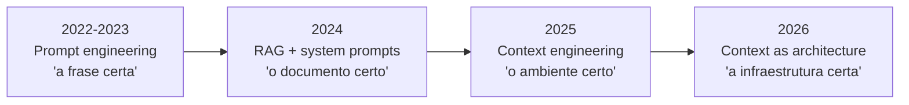

# De prompt engineering a context engineering

> [!abstract] TL;DR
> Prompt engineering é sobre a **frase certa**. Context engineering é sobre o **ambiente informacional inteiro** que cerca o agente: documentos recuperados, definições de tools, memória, histórico, system instructions, scratchpad. Karpathy resumiu em junho de 2025: "o LLM é a CPU, a janela de contexto é a RAM, e você é o sistema operacional responsável por carregar a informação certa para cada tarefa". Em junho de 2026, com janelas chegando a 1M de tokens e compressão nativa, context engineering virou a habilidade que separa sistemas de IA que funcionam em produção dos que funcionam apenas em demos.

---

## Por que um bom prompt não resolve mais

Imagine que você contratou um consultor sênior para um projeto de seis meses. No primeiro dia, você lhe dá um briefing perfeito — bem escrito, conciso, com todos os detalhes. No segundo dia, ele acorda sem nenhuma memória do que aconteceu. No terceiro, idem. Toda semana, você reescreve o briefing do zero.

Isso é o que acontece quando você trata um agente de IA como um gerador de respostas one-shot. O consultor sem memória não é inútil — em tarefas curtas e isoladas, ele performa bem. O problema aparece quando o trabalho é longo, iterativo, e depende de contexto acumulado.

Prompt engineering foi a habilidade certa para 2022-2023, quando o caso de uso típico era: abrir o chat, digitar uma pergunta, obter uma resposta, fechar o chat. Mas em 2026, os casos de uso sérios são outros:

- Agentes que rodam por horas, executando dezenas de ferramentas em sequência
- Sistemas que lêem código, documentação, histórico de conversas e estado de memória simultaneamente
- Pipelines onde o output de uma etapa é o contexto da próxima
- Times inteiros que compartilham a mesma "memória institucional" via arquivos de instrução

Para esses cenários, a pergunta "qual é a frase mágica?" foi substituída por: **"qual é a arquitetura de informação que esse agente precisa para tomar boas decisões?"**

Essa mudança de pergunta é a essência da transição de prompt engineering para context engineering. Não é uma evolução de grau — é uma mudança de categoria. Você não é mais escritor de instruções; você é arquiteto de ambientes informacionais.

---

## A evolução

| Era | Foco | Métrica de sucesso |
|---|---|---|
| **Prompt engineering** | Wording, few-shot examples, técnicas de raciocínio | Resposta correta numa caixa de chat |
| **RAG** | Recuperar documentos relevantes | Qualidade do top-k recuperado |
| **Context engineering** | Montar dinamicamente o ambiente do modelo | Agente robusto em sessões longas |
| **Context as architecture** | Tratar contexto como sistema versionado, governado | Reprodutibilidade, auditabilidade |

O salto de RAG para context engineering parece sutil mas é profundo. RAG resolve "quais documentos incluir". Context engineering resolve "o que entra, o que comprime, o que descarta, em que ordem, com qual estrutura, para que etapa específica do raciocínio".

É a diferença entre comprar os ingredientes certos (RAG) e preparar a bancada antes de começar a cozinhar (context engineering). Ambos são necessários; apenas o segundo garante que a execução vai funcionar.

---

## A definição operacional

Context engineering é a **disciplina de decidir** o que entra na janela de contexto, o que é comprimido, o que é recuperado on-demand, e o que é descartado — em cada etapa de cada tarefa.

Cinco fontes de contexto que coexistem em qualquer sistema não-trivial:

| Fonte | Exemplos | Persistência |
|---|---|---|
| **System prompt / instructions** | Quem o agente é, regras, personalidade | Sessão inteira |
| **Memória persistente** | `CLAUDE.md`, `AGENTS.md`, perfil do usuário | Entre sessões |
| **Histórico de conversa** | O que foi dito e feito até agora | Sessão atual |
| **Tool definitions** | Schemas das ferramentas disponíveis | Configuração |
| **Retrieval dinâmico** | Documentos, código, dados buscados durante a tarefa | Por chamada |

O trabalho do context engineer é orquestrar essas cinco fontes de forma que o modelo sempre tenha — na janela de contexto — exatamente o que precisa para o passo atual, sem excesso que dilua a atenção e sem falta que force alucinação.

> [!quote] Karpathy (junho de 2025)
> *"Context engineering is the delicate art and science of filling the context window with just the right information for the next step."*

---

## O termo: quem cunhou, quando e por quê

O termo "context engineering" foi popularizado em junho de 2025 por dois eventos simultâneos. Tobi Lutke, CEO da Shopify, publicou um memo interno afirmando que "prompt engineering" era subestimado e que o trabalho real era "context engineering" — a curadoria do ambiente informacional do agente. Karpathy amplificou a ideia no mesmo mês, com a analogia do sistema operacional que se tornou canônica.

Em 2026, o termo está consolidado:
- **Anthropic** chamou de "load-bearing skill" na documentação para desenvolvedores
- **Papers acadêmicos** tratam "context window management" como subdisciplina de agentes
- **Empresas** contratam "context engineers" como papel separado de "prompt engineers"

---

## A analogia do sistema operacional

Karpathy popularizou o framing em 2025, e ele envelheceu bem:

| Componente clássico | Equivalente em LLM agent |
|---|---|
| CPU | LLM (executa o "raciocínio") |
| RAM | Janela de contexto (200K-1M tokens) |
| Disco | Memória persistente (arquivos, vector store) |
| Sistema operacional | Você / sua pipeline (decide o que carregar) |
| Cache | Prompt caching (tokens pré-computados) |
| Page faults | Just-in-time retrieval (busca on-demand) |
| Swap | Compressão de contexto (summarização de histórico antigo) |

A consequência prática: tratar contexto como recurso finito é começar a pensar como engenheiro de sistemas, não como redator de prompts. RAM tem limite. Swap tem custo. Cache tem regras. O SO é responsável por isso tudo.

---

## Estado da arte — junho de 2026

O landscape mudou significativamente desde a popularização do termo em 2025:

**Janelas gigantes chegaram**
- Gemini 2.5 Pro: 1M de tokens de contexto
- Claude: 200K padrão, com compressão automática em agentes
- GPT-4o e sucessores: 128K-512K dependendo da versão

Janela maior não elimina o context engineering — ela o torna mais importante. Com 1M de tokens disponíveis, a tentação de "colocar tudo" é real. Mas a atenção do modelo dilui com o tamanho do contexto (→ [[03 - Context rot e atenção diluída]]).

**Compressão nativa**
- Claude Code implementa "context compaction" automático: quando a janela enche, um modelo auxiliar sumariza o histórico antigo e injeta o resumo
- Isso resolve o problema de sessões longas sem exigir gestão manual

**Prompt caching virou padrão**
- Anthropic, Google e OpenAI oferecem cache de prefixos de prompt
- System prompts longos (com docs, código, instruções) custam 90% menos na segunda chamada
- Arquitetar contexto com "partes estáveis primeiro" tornou-se prática padrão

**Context engineering como disciplina formal** Em junho de 2026, "context engineering" aparece em job descriptions de empresas como Stripe, Shopify e Linear. A distinção com "prompt engineering" está formalizada: CE inclui retrieval, compressão, orquestração de memória, versionamento de instructions e monitoramento de qualidade de contexto. É uma habilidade de engenharia de software, não de comunicação.

**Frameworks e tooling específico**
- **LangGraph** e **LlamaIndex** adicionaram primitivas nativas de gerenciamento de contexto
- **Mem0** e **Zep** oferecem memória persistente como serviço
- **Claude Code hooks** (PreToolUse/PostToolUse) permitem injetar contexto dinâmico em agentes
- Observabilidade de contexto (o que o modelo recebeu, em que ordem, com qual tamanho) virou categoria própria de ferramentas (→ [[Observability]])

**O modelo mental de 2026** A metáfora evoluiu da analogia do SO para a de um **chef de cozinha mise en place**. Mise en place é a prática de preparar e organizar todos os ingredientes antes de começar a cozinhar. Context engineering é o mise en place do agente: preparar, organizar e posicionar cada pedaço de informação no lugar certo, no momento certo, antes de a execução começar.

---

## Os quatro princípios do context engineering

Antes de mergulhar nas técnicas específicas, quatro princípios governam qualquer decisão de CE:

**1. Relevância acima de completude** O contexto perfeito não é o maior — é o mais relevante para o passo atual. Incluir um documento de 100 páginas quando o agente precisa de 3 parágrafos é um erro de CE tão grave quanto não incluir nada. A pergunta certa não é "posso incluir isso?" mas "o agente precisa disso para o passo atual?"

**2. Estrutura antes de conteúdo** A ordem e a estrutura do contexto importam tanto quanto o conteúdo. O modelo presta mais atenção ao início e ao fim da janela. Informações críticas no meio de um contexto longo são invisíveis na prática (→ [[03 - Context rot e atenção diluída]]).

**3. Contexto é código — versione e teste** Um `CLAUDE.md` não documentado, não versionado, editado por qualquer pessoa a qualquer momento é uma bomba-relógio. Contexto compartilhado precisa de pull request, revisão e changelog, exatamente como qualquer outro componente de software. Uma mudança de 5 linhas no system prompt pode mudar o comportamento do agente de formas imprevisíveis — sem histórico, você não consegue fazer rollback.

**4. Custo é uma restrição de design, não uma consequência** Ignorar o custo de tokens até o fim do projeto garante surpresas desagradáveis. Context engineering bem feito inclui estimativa de custo por sessão desde o design.

---

## Métricas de qualidade de contexto

Como saber se seu contexto é bom? Em 2026, as métricas emergentes são:

| Métrica | O que mede | Como avaliar |
|---|---|---|
| **Relevância** | % do contexto efetivamente usado pelo modelo | Testes de ablação (remover e ver se qualidade cai) |
| **Densidade de informação** | Bits de informação por token | Estimativa qualitativa + comparação de compressão |
| **Estabilidade** | Variância do output dado o mesmo contexto | Múltiplas execuções com temperatura 0 |
| **Custo por tarefa** | Tokens × preço / tarefas completadas | Logging de uso + agregação |
| **Context rot score** | Taxa de degradação com sessões longas | Benchmark de tarefas ao longo de N turnos |

Essas métricas ainda não têm ferramentas padronizadas em junho de 2026 — a maioria dos times as mede com scripts próprios. É uma área ativa de desenvolvimento.

Uma abordagem pragmática enquanto as ferramentas amadurecem: log every context window. Gravar o contexto exato que o modelo recebeu em cada chamada, com tamanho e custo, permite análise retroativa e detecção de anomalias. É a base para qualquer otimização posterior — sem log, você está no escuro.

---

## O que muda na prática

| Antes (prompt engineering) | Depois (context engineering) |
|---|---|
| "Preciso da frase mágica" | "Preciso da pipeline de montagem certa" |
| Trabalho one-shot | Trabalho contínuo, evolutivo |
| Output: bom prompt | Output: arquitetura de contexto + governança |
| Skill individual | Skill de equipe (compartilhada via skills files) |
| Iteração: editar texto | Iteração: editar pipeline, tools, memória, retrieval |
| Custo invisível | Custo monitorado por token, por chamada |
| Dependência de demos | Funciona em produção, em escala |
| Sucesso medido por "gostei da resposta" | Sucesso medido por taxa de resolução de tarefas |

---

## Casos práticos

### Caso 1 — Assistente de code review que "lembra" dos padrões do time

Um time mantém um arquivo `CLAUDE.md` com 200 linhas de convenções de código. Sem context engineering, cada sessão começa do zero — o agente ignora os padrões. Com CE, o arquivo é carregado como memória persistente no system prompt, e os padrões do time ficam disponíveis em toda sessão automaticamente.

### Caso 2 — Pipeline de documentação com RAG inteligente

Uma empresa tem 10.000 páginas de documentação técnica. Em vez de carregar tudo (impossível) ou confiar só em busca semântica (imprecisa), a pipeline usa: (1) retrieval semântico para os 20 chunks mais relevantes, (2) reranking para os 5 melhores, (3) compressão dos 5 para extrair só os fatos relevantes para a pergunta atual. Custo: 5× menor que sem context engineering.

### Caso 3 — Agente autônomo de longa duração

Um agente de refatoração roda por 4 horas, editando 50 arquivos. Sem CE: o histórico de ações enche a janela após 1 hora, o agente começa a "esquecer" o que já fez e refaz trabalho. Com CE: cada bloco de ações é resumido em "o que foi feito e o estado atual", mantendo o contexto ativo compacto e o histórico comprimido.

### Caso 4 — Multi-agent com memória compartilhada

Três agentes especializados (planejamento, execução, revisão) trabalham em paralelo. Sem CE, cada um tem sua própria visão — inconsistências garantidas. Com CE, todos leem do mesmo "state file" atualizado após cada etapa, garantindo coerência sem duplicar contexto.

### Caso 5 — Time distribuído compartilhando "memória institucional"

Uma empresa tem 12 engenheiros usando Claude Code. Cada um começa uma sessão nova — sem CE, cada sessão começa do zero, ignorando as convenções e decisões arquiteturais do time. Com CE, o repositório mantém um `CLAUDE.md` de 300 linhas com: arquitetura do sistema, padrões de código, decisões de design (ADRs), e "o que não fazer". Toda sessão de qualquer engenheiro começa com esse contexto já carregado — a memória do time vira o contexto base de cada agente.

---

## Context engineering vs. fine-tuning

Uma confusão comum: "por que gerenciar contexto se posso fazer fine-tuning?"

| Dimensão | Context engineering | Fine-tuning |
|---|---|---|
| **Custo** | Tokens por chamada | Treino + infraestrutura |
| **Atualização** | Instantânea (editar arquivo) | Semanas de ciclo |
| **Transparência** | Você vê o que o modelo recebe | Comportamento emergente |
| **Controle** | Total (você decide o que entra) | Parcial (você guia o treinamento) |
| **Melhor para** | Regras de negócio, preferências, documentos | Estilo de escrita, domínio especializado, formato |

Em 2026, a recomendação da Anthropic é clara: tente context engineering primeiro. Fine-tuning faz sentido quando o comportamento desejado é difícil de articular em texto (ex: tom de escrita muito específico) ou quando o custo de contexto é alto demais pela frequência de uso.

---

## Armadilhas comuns

> [!warning] "Janela maior = problema resolvido"
> Gemini com 1M de tokens não elimina context rot — dilui a atenção em vez de concentrá-la. Um contexto de 900K tokens com 80% de ruído performa pior que um contexto de 50K tokens bem curado. Mais espaço é mais responsabilidade, não menos.

> [!warning] Tratar CE como extensão de prompt engineering
> Context engineering não é "escrever system prompts melhores". É arquitetura de sistema: retrieval, compressão, memória, orquestração, versionamento. Quem trata como tarefa de copy não está fazendo CE — está fazendo prompt engineering em escala.

> [!warning] Não versionar as fontes de contexto
> `CLAUDE.md`, skills files, tool definitions — essas são as "dependências" do seu sistema de IA. Sem versionamento, uma mudança acidental em qualquer uma quebra o comportamento do agente de forma opaca. Tratar contexto como código (com git, review, testes) é parte da disciplina.

> [!warning] Ignorar o custo da janela
> 100K tokens de contexto custam ~$0.30 por chamada (Claude Sonnet). Em um agente que faz 50 chamadas por tarefa, isso é $15 em contexto por tarefa. Context engineering bem feito pode reduzir isso em 70-80%.

> [!warning] Confundir "mais contexto" com "melhor contexto"
> Dar ao agente acesso irrestrito a todos os arquivos do repositório parece generoso. Na prática, é como responder "pesquise você mesmo" quando alguém pede ajuda — você transfere o custo de curadoria para o modelo, que vai gastar atenção triando informação em vez de resolvendo o problema. Curadoria é trabalho do context engineer, não do modelo.

---

## Context engineering é uma skill de equipe

Uma implicação que as empresas levam tempo para absorver: context engineering não pode ser responsabilidade de um único engenheiro.

O contexto que um agente recebe é produzido por múltiplas fontes: o time de produto define os casos de uso (intent), o time de engenharia mantém os skills files e o CLAUDE.md, o time de dados cuida do retrieval e da qualidade dos documentos, e o time de segurança governa o que pode e não pode entrar.

Pense na analogia: quando um desenvolvedor júnior entra no time, você não espera que ele descubra as convenções sozinho lendo o código. Você dá um onboarding, um documento de arquitetura, um guia de contribuição. Context engineering é exatamente isso — mas para agentes de IA. E assim como o documento de onboarding precisa ser mantido pelo time inteiro, o contexto do agente também.

Em organizações maduras (2026), a governança do contexto segue um modelo parecido com o de infraestrutura:
- **Context as code**: todas as fontes de contexto versionadas em git
- **Context review**: PRs para mudanças em system prompts e skills files
- **Context testing**: suites de testes que verificam se o agente se comporta corretamente quando o contexto muda
- **Context monitoring**: dashboards que mostram distribuição de tamanho de contexto, custo por sessão, taxa de cache hit

Esse nível de maturidade não é necessário para um side project — mas é inevitável para qualquer sistema de IA em produção com mais de 10 usuários.

A boa notícia: context engineering escala. Um arquivo `CLAUDE.md` bem escrito que funciona para 1 engenheiro funciona igualmente para 100, sem custo marginal. A memória do agente é o único ativo de IA que não precisa de retreinamento para ser atualizado — basta editar o arquivo, fazer PR, mergear. É infraestrutura com a velocidade de documentação.

---

## Como explicar em inglês

Context engineering tem vocabulário técnico próprio, ainda em formação em 2026. Dominar os termos em inglês é necessário para ler papers e participar de discussões.

**Descrevendo o conceito:**
- "Context engineering is the discipline of deciding what information goes into the model's context window at each step"
- "Unlike prompt engineering, which focuses on the wording of instructions, context engineering treats the entire information environment as the product"
- "We moved from 'write a better prompt' to 'architect a better context pipeline'"
- "Think of it like mise en place for AI — you prepare and position every piece of information before the agent starts executing"
- "Prompt engineering is a subset of context engineering. A great prompt inside a poor context pipeline still fails."

**Em conversas técnicas:**
- "We're hitting context rot — the model's attention is diluted by irrelevant history"
- "Our pipeline uses dynamic retrieval to pull only the relevant chunks just-in-time"
- "The system prompt is structured to maximize cache hit rate — stable parts first, dynamic parts last"
- "We version our CLAUDE.md the same way we version our infrastructure configs"
- "The agent's context window budget is 80K tokens — we need to fit instructions, retrieved docs, and conversation history within that"
- "We're seeing attention dilution past 50K tokens — compressing the history before hitting that threshold"

### Tabela PT ↔ EN

| Português | Inglês |
|---|---|
| Engenharia de contexto | Context engineering |
| Janela de contexto | Context window |
| Prompt do sistema | System prompt |
| Recuperação dinâmica | Dynamic retrieval |
| Compressão de contexto | Context compression / context compaction |
| Memória persistente | Persistent memory |
| Memória transiente | Transient memory |
| Recuperação aumentada por geração | RAG (Retrieval-Augmented Generation) |
| Instruções de agente | Agent instructions / skills |
| Cache de prompt | Prompt caching |
| Rot de contexto | Context rot |
| Arquitetura de informação | Information architecture |
| Curadoria de contexto | Context curation |
| Raciocínio em cadeia | Chain-of-thought (CoT) |
| Orquestração de agentes | Agent orchestration |
| Mise en place de contexto | Context preparation / context setup |
| Janela de tokens | Token budget / token window |
| Contexto como código | Context as code |
| Governança de contexto | Context governance |
| Injeção de contexto | Context injection |
| Contexto estruturado | Structured context |
| Contexto de tarefa | Task context |

---

## O que vem a seguir

Context engineering é o chapéu que cobre todo o resto do galho. Cada nota seguinte aprofunda uma dimensão específica:

- **[[02 - Os quatro pilares — prompt, context, intent, specification]]** — os quatro eixos que estruturam qualquer decisão de context engineering
- **[[03 - Context rot e atenção diluída]]** — por que contextos grandes degradam qualidade e como detectar o rot
- **[[04 - Context pipelines — montagem dinâmica]]** — como construir a pipeline que monta o contexto certo para cada etapa
- **[[05 - Camadas de contexto — persistente, temporal, transiente]]** — os três tempos do contexto e como gerenciar cada um
- **[[06 - Dynamic retrieval beyond RAG]]** — como buscar informação on-demand sem encher a janela com docs irrelevantes
- **[[07 - Compressão e pruning de informação]]** — técnicas para compactar contexto sem perder os fatos que importam
- **[[14 - Context engineering na prática — setup completo]]** — implementação end-to-end com Claude Code, LangChain e stack típica de 2026

À medida que janelas crescem e compressão vira commodity, o diferencial competitivo vai migrar para a qualidade da curadoria — não para o tamanho da janela. O engenheiro que entende context engineering está construindo essa habilidade agora.

Uma forma útil de pensar o galho inteiro: cada nota resolve uma pergunta específica do context engineer. Esta nota responde "o que é e por que importa". As próximas respondem "como fazer na prática" — de retrieval a compressão, de memória agentica a guardrails. O fio que une tudo é a mesma pergunta de design: **o que o agente precisa saber, neste momento, para dar o próximo passo certo?**

---

## Prompt engineering ainda importa

Nada neste galho descarta prompt engineering — ele é uma parte de context engineering. Escrever instruções claras, usar few-shot examples bem escolhidos, estruturar o output esperado — essas habilidades continuam valendo dentro de um sistema de CE bem construído.

Muitos engenheiros resistem à ideia de "ir além do prompt" porque parece complexidade desnecessária. Essa resistência faz sentido em projetos pequenos e rápidos. Mas assim que o sistema cresce — mais usuários, sessões mais longas, múltiplos agentes — a arquitetura de contexto vira o gargalo, e a complexidade de gerenciá-la é inevitável. Melhor construir a fundação certa desde o início.

A diferença é de escopo:
- **Prompt engineering** resolve: "como formulo esta instrução?"
- **Context engineering** resolve: "qual é o ambiente completo que o agente precisa para executar bem?"

Um prompt excelente dentro de um contexto mal arquitetado vai falhar. Um prompt mediano dentro de um contexto bem arquitetado frequentemente surpreende positivamente. A alavancagem está na arquitetura, não na frase.

---

## Checklist — primeiros passos em context engineering

Para quem está saindo de prompt engineering e quer começar a praticar CE:

- [ ] Identifique as cinco fontes de contexto do seu sistema (system prompt, memória, histórico, tools, retrieval)
- [ ] Estime o tamanho de cada fonte em tokens
- [ ] Verifique se seu system prompt tem "partes estáveis" que poderiam se beneficiar de caching
- [ ] Crie um arquivo de memória persistente (`CLAUDE.md` ou equivalente) com as convenções do projeto
- [ ] Defina um budget máximo de tokens por sessão e monitore se está sendo respeitado
- [ ] Versione as fontes de contexto no git (não edite fora de um PR)
- [ ] Teste o comportamento do agente quando você remove cada fonte — qual é imprescindível?
- [ ] Ative logging de contexto: tamanho, custo e conteúdo de cada chamada ao modelo
- [ ] Leia [[03 - Context rot e atenção diluída]] para entender quando seu contexto começa a degradar qualidade

---

## Veja também

- [[02 - Os quatro pilares — prompt, context, intent, specification]]
- [[03 - Context rot e atenção diluída]]
- [[04 - Context pipelines — montagem dinâmica]]
- [[Agentes de Codificação]] — onde context engineering vive na prática diária

---

## Referências

- **Karpathy, A.** — *Tweet on context engineering* (jun 2025). Popularizou a analogia do sistema operacional — https://x.com/karpathy/status/1937902205765607626
- **Lutke, T.** — *Shopify CEO memo on context engineering* (jun 2025). Primeira articulação corporativa do termo — https://x.com/tobi/status/1935533422589399127
- **Anthropic** — *Building effective agents: context engineering* (2025). Documentação oficial — https://www.anthropic.com/research/building-effective-agents
- **Bytebytego** — *A Guide to Context Engineering for LLMs* (2026). Overview técnico acessível — https://blog.bytebytego.com/p/a-guide-to-context-engineering-for
- **Google** — *Gemini 2.5 Pro: 1M context window documentation* (2026). Referência para janelas longas.
- **Anthropic** — *Model Context Protocol specification* (2024). Protocolo de comunicação entre modelos e fontes de contexto externas.
- **Zep / Mem0** — Documentações de memória persistente como serviço (2025-2026). Implementações de referência para CE em produção.
- **Lin, Z. et al.** — *Lost in the Middle: How Language Models Use Long Contexts* (2023). Paper fundacional sobre atenção diluída — embasamento científico do context rot — https://arxiv.org/abs/2307.03172
- **Coze / LangGraph / CrewAI** — Frameworks de orquestração de agentes com primitivas nativas de gestão de contexto (2024-2026). Referências de implementação.
- **Anthropic** — *The Claude context engineering guide for enterprise* (2026). Melhores práticas para times usando Claude em produção.
- **White, J. et al.** — *A Prompt Pattern Catalog to Enhance Prompt Engineering with ChatGPT* (2023). Taxonomia de padrões de prompt — fundamento de CE estruturado.
- **Shi, F. et al.** — *Large Language Models Can Be Easily Distracted by Irrelevant Context* (2023). Evidência empírica de como informação irrelevante degrada performance.
