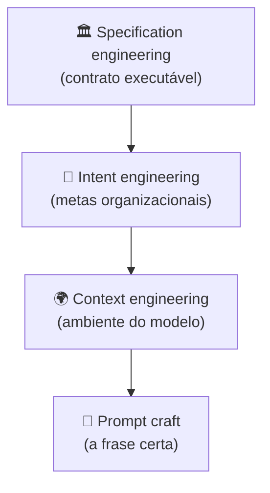
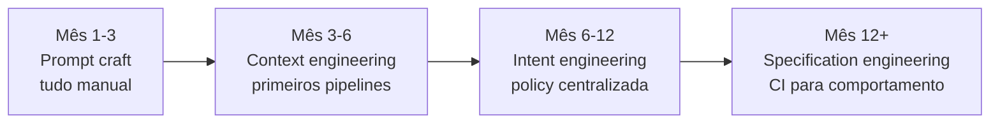

# Os quatro pilares — prompt, context, intent, specification

> [!abstract] TL;DR
> Engenharia de IA em 2026 não é uma disciplina única — são quatro camadas hierárquicas: **prompt craft** (a frase), **context engineering** (o ambiente), **intent engineering** (o objetivo organizacional), e **specification engineering** (o contrato executável). Cada camada resolve um problema que a anterior não consegue resolver sozinha. Pular camadas é a razão mais comum de projetos AI funcionarem na demo e quebrarem em produção.

---

## O problema: por que projetos de IA travam após o protótipo?

Um cenário familiar: você constrói um chatbot. Na demo, funciona perfeitamente. Em produção, após 3 meses, o comportamento mudou — ninguém sabe por quê, não há como reverter, o sistema parece ter "vontade própria". Metade do time passou a semana ajustando prompts sem resultado.

O diagnóstico geralmente é o mesmo: o projeto foi construído em apenas uma camada (prompt craft) quando precisava de quatro. Sem context engineering, o modelo perde contexto entre sessões. Sem intent engineering, diferentes engenheiros encodam objetivos diferentes e conflitantes. Sem specification engineering, não há como saber se uma mudança melhorou ou piorou o comportamento.

Os quatro pilares não são um luxo para projetos grandes — são o mapa mínimo de tudo que você precisa decidir para que um sistema de IA seja confiável ao longo do tempo. E "confiável" não significa "perfeito" — significa "previsível o suficiente para que quando ele falhe, você saiba por quê e como corrigir".

---

## A pirâmide

> [!info] Lê de baixo para cima
> Cada camada **superior** governa as camadas **inferiores**. Specification define quais intents são válidos; intent define qual contexto é montado; contexto define quais prompts fazem sentido. Pular uma camada não a elimina — apenas a deixa implícita e incontrolada.

---

## Camada 1 — Prompt craft

**Pergunta central:** *"Como falar com o modelo nesta interação específica?"*

Prompt craft é a camada mais visível e a menos diferenciadora em 2026. Inclui:

- Wording, exemplos few-shot, formatos de output, tokens de controle
- Técnicas: chain-of-thought, role-play, structured output (JSON mode)
- Posicionamento de informação na janela (início vs. fim têm pesos diferentes)

**Escopo:** uma chamada de API.

**Quando basta:** chatbot simples, tarefas one-shot, exploração inicial de capacidades.

**Quando não basta:** qualquer aplicação que mantenha estado, lide com múltiplas fontes de informação, ou precise de garantias de comportamento consistente ao longo do tempo.

A armadilha: porque prompt craft é tangível e iterável em minutos, é a camada onde times ficam presos. Quando o sistema não funciona, a resposta instintiva é "vamos melhorar o prompt" — mesmo quando o problema está nas camadas acima. Prompt craft é a camada mais visível, mas raramente é o gargalo em sistemas que já passaram do protótipo.

Uma heurística útil: se você está gastando mais de 2 horas por semana ajustando prompts em produção, é provável que o problema real esteja na camada de contexto ou intent.

---

## Camada 2 — Context engineering

**Pergunta central:** *"Que ambiente informacional o modelo vê neste step?"*

Context engineering decide o que entra na janela de contexto, o que é cacheado, o que é recuperado on-demand, e o que é descartado — para cada etapa de cada tarefa. É o tema central deste galho.

**Componentes:**
- Pipelines que montam contexto antes de cada step (→ [[04 - Context pipelines — montagem dinâmica]])
- Hierarquia de memória: persistente, temporal, transiente (→ [[05 - Camadas de contexto — persistente, temporal, transiente]])
- Retrieval dinâmico além de RAG simples (→ [[06 - Dynamic retrieval beyond RAG]])
- Compactação e pruning para controle de custo (→ [[07 - Compressão e pruning de informação]])

**Escopo:** uma sessão de agente, ou um pipeline multi-step.

**Quando basta:** aplicação single-purpose, time pequeno, domínio estável.

**Quando não basta:** quando há **vários stakeholders** querendo objetivos diferentes do mesmo agente, ou quando o comportamento precisa ser auditável e reprodutível.

---

## Camada 3 — Intent engineering

**Pergunta central:** *"Que objetivos organizacionais o agente carrega?"*

Intent engineering encoda valores, prioridades e trade-offs do negócio na infraestrutura do agente. Resolve conflitos que context engineering não consegue resolver: rapidez vs. qualidade, custo vs. UX, exploração vs. segurança.

**Exemplos concretos:**
- "Sempre prefira respostas curtas a longas" (UX)
- "Em caso de ambiguidade, escale para humano em vez de inferir" (segurança)
- "Priorize tempo-real sobre completude em queries do feed" (negócio)
- "Nunca mencione concorrentes pelo nome" (legal/marca)

**Por que vem acima de context:** o mesmo contexto pode levar a comportamentos diferentes dependendo do intent. Sem intent codificado, o agente faz o que o prompt do usuário quiser — mesmo que viole políticas da empresa ou crie inconsistências entre sessões.

**Implementações em 2026:**
- System prompts no nível organizacional (não por feature)
- Guardrails determinísticos com lógica de negócio explícita (→ [[12 - Guardrails determinísticos]])
- Routing rules baseadas em classificação de intent
- "Policy files" versionados que definem limites do agente

**Escopo:** o produto/agente como conjunto, ao longo de sua vida. Em times maduros, mudanças de intent passam por aprovação de produto e jurídico, não apenas de engenharia.

---

## Camada 4 — Specification engineering

**Pergunta central:** *"Qual é o contrato executável que define sucesso?"*

Specification engineering trata o comportamento esperado do agente como um contrato formal: versionado, testável, auditável. É a camada que permite que times evoluam sistemas de IA sem quebrar o que estava funcionando.

**Artefatos:**
- Specs de comportamento com critérios de aceitação (BDD para AI)
- Output schemas estritos como contrato de interface
- Test suites que verificam comportamento, não só output
- Governance: quem aprova mudanças, com qual processo

**Exemplos de specs bem escritas:**
- "Para queries do tipo X, output deve ser JSON que passe no schema Y" — testável
- "99% das respostas a queries de classe Z devem ser ≤500 tokens" — auditável
- "Mudança em system prompt requer aprovação se afetar testes ouro" — governável

**Conexão com Spec-Driven Development:** specification engineering é a versão da disciplina aplicada a sistemas AI — specs como source of truth para comportamento esperado, não apenas para código.

**Escopo:** o programa AI inteiro, ao longo do tempo e das iterações. É a única camada que persiste através de mudanças de modelo, de time e de requisitos.

---

## Tabela comparativa — os quatro pilares

| Pilar | Pergunta | Artefato principal | Velocidade de iteração | Stakeholder primário |
|---|---|---|---|---|
| Prompt craft | "Que palavra?" | String | Minutos | Engineer individual |
| Context engineering | "Que ambiente?" | Pipeline + memória | Horas | Time de produto |
| Intent engineering | "Que objetivo?" | System prompt + rules | Dias | Product manager |
| Specification engineering | "Que contrato?" | Specs + testes | Sprints | Tech lead + Eng manager |

---

## Framing alternativo — as 4 ações sobre contexto

Coexiste outro framing complementar, focado nas **ações** que você pode fazer sobre o contexto em si (popularizado por Karpathy e Anthropic):

| Ação | O que faz | Quando usar |
|---|---|---|
| **Write** | Persistir contexto importante em vector store ou DB | Informação que deve sobreviver à sessão |
| **Select** | Usar retrieval para carregar só os tokens relevantes | Base de conhecimento grande |
| **Compress** | Sumarizar, compactar histórico antigo | Sessões longas, agentes iterativos |
| **Isolate** | Particionar contexto entre subsistemas | Multi-agent, evitar cross-contamination |

Esse framing é **tático** e opera dentro do pilar 2 (context engineering). Os quatro pilares e as quatro ações não se substituem — operam em escalas diferentes. Pense assim: os quatro pilares respondem "o que construir?"; as quatro ações respondem "como manipular o contexto agora?". Ambos os framings são úteis — em momentos diferentes do raciocínio.

---

## Estado da arte — junho de 2026

O modelo dos quatro pilares ganhou tração em 2025 e está sendo adotado por organizações que escalam sistemas de IA:

**Intent engineering** se formalizou com o conceito de "AI policy files" — análogos a políticas de segurança, mas para comportamento de agentes. Empresas como Anthropic (CLAUDE.md/AGENTS.md) e OpenAI (custom instructions a nível de organização) oferecem primitivas para isso.

**Specification engineering** convergiu com o movimento de "evals-driven development": em vez de testar manualmente, times constroem suites de avaliação automatizadas que rodam em CI a cada mudança de prompt ou contexto. Ferramentas como Braintrust, LangSmith e Weights & Biases Weave vieram para esse espaço.

**A camada mais madura é a que mais times ignoram**: specification engineering. A maioria dos projetos de IA em 2026 ainda não tem testes automatizados de comportamento. Projetos que têm reportam 40-60% menos incidentes em produção.

**O ciclo de maturidade típico em 2026:**

A maioria dos times está em algum ponto entre mês 3 e mês 6 em 2026. Organizações como Stripe, Linear e Shopify — que começaram a escalar AI em 2023-2024 — já chegaram à camada 4. A diferença de confiabilidade é visível nos relatos públicos de engenharia dessas empresas.

**Por que a progressão é sequencial:**
Você não pode ter specification engineering sem intent engineering — você não sabe o que testar se não sabe o que o agente deve fazer. Você não pode ter intent engineering sem context engineering — você não consegue codificar intent se o agente não tem contexto estável. A hierarquia é lógica, não apenas conveniente.

Analogia com desenvolvimento de software: você não escreve testes de integração antes de ter a arquitetura definida. Você não define a arquitetura antes de entender os requisitos. A sequência dos quatro pilares segue a mesma lógica — cada camada precisa da anterior para ser construída com fundação sólida.

---

## Quando cada pilar é suficiente

Uma pergunta prática: você realmente precisa dos quatro pilares? Não necessariamente. A resposta depende de onde você está:

| Contexto | Pilares necessários |
|---|---|
| PoC/protótipo, 1 engenheiro | Apenas prompt craft |
| MVP em produção, <100 usuários | Prompt craft + context engineering básico |
| Produto com time dedicado | Os três primeiros pilares |
| Produto regulado ou de alto risco | Os quatro pilares completos |
| Plataforma com múltiplos agentes | Os quatro pilares + governança formal |

A recomendação pragmática: implementar pelo menos um nível acima do que você acha que precisa. O custo de adicionar context engineering cedo é baixo; o custo de adicionar depois, quando o sistema já tem comportamento inconsistente, é alto.

O erro mais comum é esperar os primeiros incidentes em produção para investir nas camadas superiores. Nesse ponto, refatorar é mais caro do que teria sido construir certo desde o início — exatamente como acontece com dívida técnica em código.

Uma regra de bolso: se o seu produto de IA vai ter mais de 1.000 usuários ou mais de 3 engenheiros tocando no sistema, os quatro pilares não são opcionais — são o mínimo para manter o sistema saudável ao longo do tempo. Abaixo desses thresholds, você pode escapar com menos. Acima deles, a ausência de qualquer pilar vai se manifestar como problemas difíceis de diagnosticar e caros de corrigir.

---

## A relação entre os pilares e o custo

Uma insight financeiro subestimado: os quatro pilares também têm implicações de custo diferentes.

- **Prompt craft** barato de iterar mas não escala — cada call paga o mesmo preço
- **Context engineering** tem custo de implementação mas pode reduzir custo por call em 50-80% via caching e compressão
- **Intent engineering** reduz custo de manutenção (menos incidentes, menos bugs de comportamento)
- **Specification engineering** reduz custo de detecção de problemas (encontra regressões antes de produção)

O paradoxo: os pilares mais "caros" de implementar no curto prazo são os que mais reduzem custo no longo prazo. É a mesma dinâmica de testes automatizados vs. teste manual.

Uma estimativa conservadora de times que implementaram os quatro pilares: 30-40% do tempo gasto em "debugging de comportamento" (por que o agente fez isso?) é eliminado. Context engineering elimina o problema de informação ausente; intent engineering elimina conflitos de objetivo; specification engineering detecta regressões antes de produção. O "tempo perdido" construindo a infraestrutura se paga em meses.

---

## Anti-pattern: pular camadas

O erro mais caro em projetos de AI:

| Sintoma em produção | Camada que faltou |
|---|---|
| "Funcionou na demo, falha em produção" | Context engineering ausente |
| "Cada engenheiro faz do seu jeito" | Intent engineering ausente |
| "Não conseguimos validar mudanças" | Specification engineering ausente |
| "O sistema regrediu após atualizar o modelo" | Specification engineering ausente |
| "Funciona, mas ninguém entende por quê" | Todas — vibe-coded |

---

## Casos práticos

### Caso 1 — Startup em camada 1 que tenta escalar

Uma startup de 5 pessoas constrói um agente de suporte com um prompt de 500 palavras. Funciona bem por 3 meses. Com 10.000 usuários, surgem casos edge que o prompt não cobre. A solução instintiva é "ampliar o prompt" — mas sem context engineering, o prompt cresce para 3.000 palavras e começa a ter contradições internas. A lição: context engineering deveria ter sido introduzida antes do primeiro caso edge, não depois de 100. O ponto de inflexão — quando o sistema começa a ter comportamento inconsistente — é o sinal de que você precisa subir para a próxima camada. Mas é muito mais fácil (e barato) antecipar esse ponto do que reagir a ele.

### Caso 2 — Empresa que descobriu intent engineering tarde

Uma empresa de fintech tem um agente de análise de crédito. Diferentes engenheiros codificaram objetivos diferentes no system prompt: um priorizou rapidez, outro priorizou conservadorismo. Em conflito, o comportamento era aleatório. A solução foi criar um "AI policy document" centralizado com as regras de negócio em linguagem natural, revisado pelo time jurídico e de produto. Intent engineering documentada e versionada.

### Caso 3 — Time que criou CI para comportamento de AI

Uma empresa de healthtech mudou o wording do system prompt e o agente começou a dar respostas mais agressivas sobre diagnósticos — sem que ninguém percebesse por 2 semanas. Após o incidente, criaram 150 casos de teste de comportamento que rodam automaticamente a cada PR que afeta qualquer fonte de contexto. Specification engineering em ação.

### Caso 4 — Agente multi-pilar em produção

Uma empresa de e-commerce tem um agente de atendimento com os quatro pilares implementados: prompt craft otimizado por A/B testing, context pipeline que carrega histórico do cliente + catálogo relevante, intent engineering com regras de escalation e limites de desconto, e spec suite de 200 casos de teste. Resultado: 78% de resolução autônoma, zero incidentes de segurança em 6 meses, e equipe consegue iterar em dias em vez de semanas.

---

## Armadilhas comuns

> [!warning] Confundir as camadas entre si
> "Vamos melhorar o intent" vs. "vamos melhorar o contexto" não é a mesma coisa. Intent é sobre objetivos organizacionais — o que o agente deve priorizar. Contexto é sobre informação — o que o agente tem acesso. Confundir os dois leva a soluções na camada errada.

> [!warning] Specification engineering como burocracia
> Criar specs e testes parece slow. A ilusão é que você pode iterar rápido sem eles. A realidade: sem specs, cada mudança pode quebrar comportamento que estava funcionando, sem que você saiba até chegar em produção. Specs são o que permite velocidade sustentada — não o que a impede.

> [!warning] Intent codificado só no prompt do usuário
> Se o único lugar onde as regras de negócio estão codificadas é em cada prompt individual, você não tem intent engineering — você tem esperança de que o usuário vai escrever o prompt certo. Intent precisa estar no system prompt ou nos guardrails, fora do controle do usuário.

> [!warning] Escalar prompt craft em vez de subir camadas
> Um prompt de 5.000 tokens cheio de regras e exceções é um sinal de intent e specification engineering ausentes tentando ser resolvidos no lugar errado. Prompts devem ser sobre a tarefa atual, não sobre a política da empresa.

---

## Como explicar em inglês

**Descrevendo os quatro pilares:**
- "We're operating at the context engineering layer — we're not just fixing the prompt, we're redesigning the information pipeline"
- "The intent layer encodes our business rules and priorities into the agent's infrastructure, not just its prompts"
- "We need specification engineering here — we need a way to verify that changes to the system don't break expected behaviors"

**Em discussões de arquitetura:**
- "This is a classic case of trying to solve a context problem with prompt craft"
- "We're missing the intent layer — different engineers are encoding conflicting objectives"
- "We need evals — a test suite for AI behavior — before we can safely iterate"
- "The system is vibe-coded — we need to work through the four layers before we can scale it"
- "We've been doing prompt engineering when what we needed was context engineering and intent design"
- "Our evals suite covers 200 behaviors — we can ship prompt changes with confidence now"

### Tabela PT ↔ EN

| Português | Inglês |
|---|---|
| Pilares da engenharia de IA | AI engineering pillars |
| Elaboração de prompts | Prompt craft |
| Engenharia de contexto | Context engineering |
| Engenharia de intenção | Intent engineering |
| Engenharia de especificação | Specification engineering |
| Contrato executável | Executable contract |
| Política de IA | AI policy |
| Avaliações automatizadas | Automated evals / eval suite |
| Casos de teste de comportamento | Behavioral test cases |
| Guardrails determinísticos | Deterministic guardrails |
| Desenvolvimento guiado por specs | Spec-driven development |
| Iteração guiada por avaliações | Evals-driven development |
| Anti-padrão | Anti-pattern |
| Camada de intenção | Intent layer |

---

## O que vem a seguir

Os quatro pilares são o mapa; as notas seguintes são o território. A sequência natural:

- **[[03 - Context rot e atenção diluída]]** — o inimigo invisível do pilar 2: por que contextos grandes degradam qualidade sem aviso
- **[[04 - Context pipelines — montagem dinâmica]]** — como construir a infraestrutura do pilar 2 na prática
- **[[12 - Guardrails determinísticos]]** — implementação do pilar 3 (intent) via guardrails verificáveis
- **[[14 - Context engineering na prática — setup completo]]** — os quatro pilares em um sistema de produção real

Em 2026, as organizações mais maduras em IA são as que chegaram na camada 4 — specification engineering. A transição de "vibe-coding" para "spec-driven AI" é o sinal mais claro de maturidade de engenharia de IA de uma empresa.

O que você vai descobrir ao longo do galho é que cada pilar tem seus próprios problemas e ferramentas. Context rot, compressão, retrieval dinâmico, guardrails, evals — cada um é um campo inteiro. Os quatro pilares são o mapa que diz onde cada ferramenta mora. Com o mapa em mãos, as notas seguintes fazem mais sentido do que fariam isoladas.

---

## Os quatro pilares e o problema da "magic incantation"

Há uma crença persistente no ecossistema de IA: que existe uma "magic incantation" — uma combinação perfeita de palavras no prompt que faz o modelo se comportar exatamente como você quer, em todos os casos. Essa crença é falsa, e os quatro pilares explicam por quê.

Um LLM é um sistema estocástico com bilhões de parâmetros treinado em dados heterogêneos. O que você consegue com prompt craft é inclinar as probabilidades. O que você consegue com context engineering é garantir que o modelo tem a informação certa. O que você consegue com intent engineering é codificar os trade-offs corretos. O que você consegue com specification engineering é verificar que tudo isso está funcionando.

Nenhuma frase mágica substitui arquitetura. A boa notícia: com os quatro pilares bem implementados, você não precisa da frase mágica — você precisa de um sistema bem construído.

Isso também implica que context engineering é uma skill que envelhece bem. Prompts ótimos para GPT-4 podem ser subótimos para Claude Opus — mas um sistema com context engineering sólida, intent bem codificada e specification com testes sobrevive a mudanças de modelo com muito menos fricção. Você testa, vê o que quebrou, corrige cirurgicamente. É a diferença entre ter fundação e ter areia.

---

## Checklist de maturidade por pilar

Avalie onde seu projeto está:

**Pilar 1 — Prompt craft**
- [ ] Prompts versionados em código (não na cabeça de alguém)
- [ ] Exemplos few-shot documentados com justificativa
- [ ] Formato de output definido (schema, template, ou exemplo)
- [ ] Temperatura e outros parâmetros de sampling registrados junto com o prompt

**Pilar 2 — Context engineering**
- [ ] Sources de contexto documentadas (system prompt, memória, retrieval, histórico)
- [ ] Budget de tokens por sessão definido e monitorado
- [ ] Estratégia de caching para sources estáticas
- [ ] Logging do contexto completo por chamada (para diagnóstico)

**Pilar 3 — Intent engineering**
- [ ] Policy document centralizado com regras de negócio
- [ ] Processo para adicionar/modificar regras (com review e aprovação, não ad hoc)
- [ ] Guardrails para casos de limite de comportamento
- [ ] Trade-offs explícitos documentados (ex: "rapidez tem prioridade sobre completude em queries de feed")

**Pilar 4 — Specification engineering**
- [ ] Suite de testes de comportamento com pelo menos 20 casos
- [ ] CI que roda os testes a cada mudança em fontes de contexto
- [ ] Processo de aprovação para mudanças que afetam testes existentes
- [ ] Dashboard de qualidade: taxa de aprovação nos testes ao longo do tempo
- [ ] Processo de adição de novos casos quando incidentes ocorrem em produção

---

## Veja também

- [[01 - De prompt engineering a context engineering]] — o contexto histórico da evolução
- [[12 - Guardrails determinísticos]] — implementação prática do pilar 3 (intent)
- [[14 - Context engineering na prática — setup completo]] — os quatro pilares em um sistema real
- [[Spec-Driven Development]] — disciplina de especificação aplicada ao código
- [[Agentes de Codificação]] — onde os quatro pilares são aplicados em ferramentas de desenvolvimento

---

## Referências

- **Karpathy, A.** — *Software Is Changing (Again)* (2025). Framing dos quatro pilares e analogia do sistema operacional — https://www.ycombinator.com/library/MW-andrej-karpathy-software-is-changing-again
- **IntuitionLabs** — *What Is Context Engineering? A Guide for AI & LLMs* (2026). Taxonomia dos pilares.
- **Atlan** — *Context Engineering Framework for Enterprise AI* (2026). Aplicação enterprise da hierarquia.
- **Anthropic** — *Building effective agents: evals and specification* (2025). Base para specification engineering — https://www.anthropic.com/research/building-effective-agents
- **Braintrust** — *Evals-driven development for LLM applications* (2026). Ferramental para camada 4 — https://www.braintrust.dev/articles/eval-driven-development
- **Hamel Husain** — *Your AI Product Needs Evals* (2024). Artigo canônico sobre por que specification engineering é necessária — https://hamel.dev/blog/posts/evals/
- **LangSmith** — *LLM Evaluation and Observability Platform* (2025-2026). Stack de referência para evals automatizados.
- **Anthropic** — *Developing AI policy and governance frameworks* (2026). Guia para intent engineering em organizações.
- **NIST** — *AI Risk Management Framework (AI RMF 1.0)* (2023). Embasamento formal para specification engineering regulado — https://www.nist.gov/itl/ai-risk-management-framework
- **Palermo, J.** — *LLM Evals: The Complete Guide* (2025). Metodologia prática para construção de suites de avaliação de comportamento.
- **Anthropic** — *Model specification* (2024). Exemplo de specification engineering em escala — os valores e comportamentos esperados codificados formalmente para Claude.
- **EU AI Act** — *Regulation (EU) 2024/1689* (2024). Requisitos legais que tornam specification engineering obrigatória para sistemas de IA de alto risco na Europa — https://eur-lex.europa.eu/eli/reg/2024/1689/oj/eng
- **Hamel Husain et al.** — *What We Learned from a Year of Building with LLMs* (2024). Lições práticas de times que já passaram pelas quatro camadas em produção.
- **Google** — *Responsible AI practices: Testing and evaluation* (2025). Framework para specification engineering em produtos de IA de escala corporativa.
- **OpenAI** — *GPT best practices: Systematic testing* (2025). Guia prático para avaliação de comportamento de modelos em produção.
